[TOC]

# RISCV基础开发

## 指令集和寄存器

### 写在前面的话

本系列文章旨在通过十几个裸机程序开发逐渐熟悉RISCV架构，包括其重要的系统寄存器使用方式、中断和异常处理机制等等。本系列不是RISCV汇编语言教程，不会专门的讲解汇编语法，但是会对裸机程序中使用到的一些汇编进行简单的介绍，希望通过本系列文章的学习后，各位童鞋能掌握RISCV架构的基础知识，如果想进一步学习，可以阅读相关的开源软件源码或者查阅网络上相关RISCV资料。

### RISCV模块化指令集设计

学习一个新的架构先来看看这个架构支持哪些指令，RISCV的指令集使用模块化的方式进行组织，每一个模块使用一个英文字母来表示。在指令集规范中，强制要求实现的是由字母I表示的基础整数指令集，其他指令集均为扩展可选，一般使用的扩展指令集包括M/A/F/D/C，如下所示。

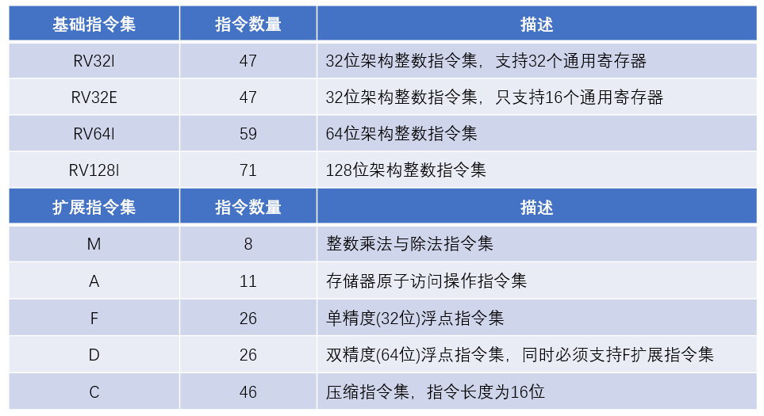

以上模块的一个特定组合“IMAFD”，由于大多数RISCV处理器都会实现，所以也被称为通用组合，用英文字母G表示。因此RV32G表示RV32IMAFD，RV64G表示RV64IMAFD。

#### 基础整数指令集

在RISCV架构中，除了压缩指令集外，其余的指令长度都为32位，也就是4个字节。整数指令集中的指令主要包括以下几类：

- 整数计算：主要是算术运算和逻辑运算类指令，实现加、减、与、或等功能计算。
- 地址访问：主要是Load和Store类指令，实现读写地址功能。
- 程序跳转：主要是分支跳转类和无条件跳转类指令，实现程序跳转功能。
- 控制状态：主要是系统控制状态寄存器访问类指令，实现对系统寄存器的访问。

#### 扩展浮点指令集

RISCV的浮点扩展指令分为单精度和双精度两类，同时浮点指令使用单独的32个浮点寄存器，而不是通用整数寄存器，指令集功能主要包括以下几类：

- 算术运算：主要是加减乘除、矩阵计算、平方根、最大最小值等运算指令。
- 地址访问：主要是浮点寄存器Load和Store类指令，实现读写地址功能。
- 转换搬运：主要是整数和浮点类型数据转换、浮点和通用寄存器之间数据搬运指令。

#### 扩展整数乘除指令集

这个扩展指令集主要实现对整数的乘法和除法运算，并支持有符号和无符号数。

#### 扩展原子操作指令集

原子操作类指令主要用于保证对内存操作上的原子性， 原子表示内存读写之间的过程不会被打断，内存值也不会被其它处理器修改 。一般操作系统都会提供原子操作的系统API，其底层最终就是用这些原子操作指令来实现的。

#### 扩展压缩指令集

RISCV通过压缩指令集可以提高代码密度，其作用类似于ARM中的 Thumb指令集，用于一些存储容量极度受限的嵌入式场景。

#### 扩展向量指令集

类似于ARM下提供的NEON向量指令集，RISCV也提供了向量指令集扩展，用于单指令多数据(SIMD)操作。

#### 其他扩展指令集

除了上述指令集外，还有若干的模块如L、B、P和T等，目前这些扩展大多数还在不断完善和定义中，尚未最终确定，因此不做详细阐述。

### RISCV架构寄存器

#### 32个通用寄存器

RISCV架构设计了32个通用整数寄存器和一个程序计数寄存器(PC)，如下所示。

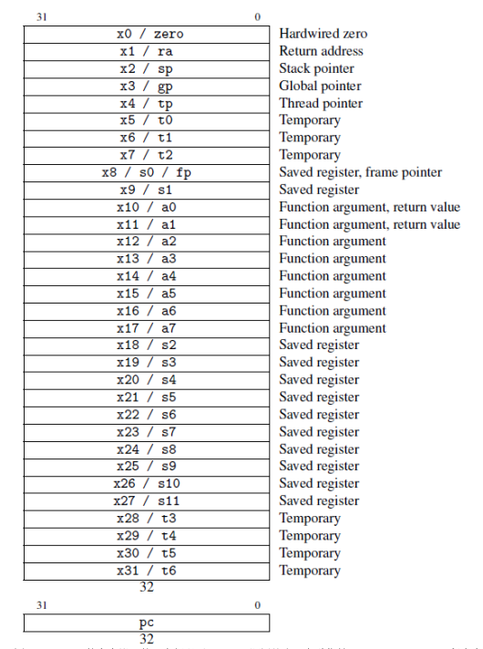

通用寄存器的长度在32位架构中为32位，在64位架构中为64位，下面介绍32个通用寄存器中比较重要的几个寄存器：

- x0：这个寄存器恒为0，读取的值永远为0。
- ra：用于保存函数调用返回地址，作用类似ARM架构中的lr寄存器。
- sp：用于保存栈地址，RISCV下和ARM下一样，一般使用满减栈方式。
- fp：用于保存栈帧，作用类似ARM下的bp寄存器。
- a0~a7：用于传递函数调用的参数，并且a0一般用于保存函数返回值。

#### 32个浮点寄存器

当支持RISCV浮点扩展指令时，需要使用额外的32个浮点寄存器来支持浮点指令，如下所示。

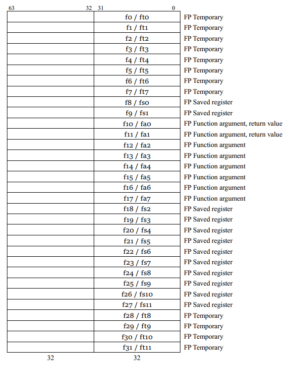

#### 控制状态寄存器

RISCV在M模式和S模式下分别具有一些控制状态寄存器，用于系统异常处理或者其他功能，至于什么是M模式和S模式会在下一章节进行讲解，这里以M模式为例，先介绍这个模式下的几个重要寄存器，S模式下的寄存器类似：

- mtvec(Machine Trap Vector)：保存发生异常时处理器需要跳转的地址。
- mepc(Machine Exception PC)：保存发生异常的指令地址。
- mcause(Machine Exception Cause)：指明产生异常的原因。
- mie(Machine Interrupt Enable)：指明处理器目前能处理和忽略的中断。
- mip(Machine Interrupt Pending)：指明目前正准备处理的中断。
- mtval(Machine Trap Val)：保存产生异常时的附加信息。
- mstatus(Machine Status)：全局中断使能和其他状态信息。

## 特权架构

处理器在架构上一般都会有几种特权模式，比如x86架构有“ring0~ring3”4种级别，一般操作系统内核和驱动运行在ring0级别，也就是最高级别，而普通的应用程序运行在ring3级别，也就是权限最低的级别；再比如arm架构有7种处理器模式，操作系统一般运行在Supervisor模式，而应用程序运行在User模式。

那么为什么处理器架构在设计时需要设计好几种级别不同的模式呢？原因是为了不同作用的程序考虑的。比如一般操作系统享有最高级别的权限，可以访问系统所有硬件，执行所有特权指令，例如设置MMU页表等，那么设置MMU页表这种操作能让普通的应用程序来操作吗，当然是不行的，所以操作系统和普通应用这两种程序肯定是需要运行在不同级别的权限模式下的，如果普通程序强行去执行特权指令操作，要么没有任何反应要么系统产生异常，这样就从硬件上保证了安全性。

同样的，RISCV架构下有三种特权级别，分别是Machine、Supervisor和User，简称M模式、S模式和U模式。M模式权限最高，在这个级别下的程序可以访问一切硬件和执行所有特权指令；S模式一般用于运行操作系统，可以设置MMU使用虚拟地址；U模式一般是普通应用程序使用，权限最低。

M模式使用物理地址进行访问，不经过MMU，但是有类似arm下cortex-m中的MPU功能；S模式可以通过设置MMU来使用虚拟地址访问内存，所以像Linux这类操作系统都运行在S模式下。那么有人要问了，为啥RISCV架构特权模式设计成这样，直接把M模式和S模式合二为一不行吗？这个得从RISCV架构诞生背景来看了，RISCV架构诞生于2010年左右，这时不管是x86还是arm架构都发展得算是比较成熟了，所以RISCV架构设计时就定位了从微控制器到大型超级计算机都可以使用这个架构。在微控制器上使用的RISCV架构一般只有M模式，或者使用M和U两种模式，类似于cortex-m架构的定位；而在带MMU的芯片上，RISCV架构一般都使用M、S和U三种模式，这样通过“拼积木”的方式就可以让RISCV架构适用于各种场景了。

在arm下的应用程序通过“swi”指令可以将处理器从低特权级别切换到高特权级别，一般像Linux下的系统调用都是通过这种方式来使用的。类似的，在RISCV中，通过“ecall”指令可以从低特权切换到高特权，在U模式下执行就切换到S模式，在S模式下调用就切换到M模式。另外在RISCV中，默认产生中断和异常时，处理器自动切换到M模式处理，可以通过中断托管设置将一些中断和异常直接交给S模式处理。RISCV的架构设计就决定了必须要有程序运行在M模式下，来为S模式提供一些基础的服务，RISCV为此定义了SBI(Supervisor Binary Interface)接口规范，让运行在S模式下的操作系统在不同的RISCV处理器上都可以使用标准的SBI接口来使用相应的功能，这个其实就有点类似于x86下的BIOS概念了，详细的RISCV下中断和异常处理以及SBI规范在后续章节会讲解，这里只需要知道就可以。

## 中断和异常处理

在RISCV架构设计中，有一系列的控制和状态寄存器( Control and Status Registers）简称CSR，在三种特权级别下都有其对应的CSR，比如m模式下的命名都为mxxxx，s模式下的都为sxxxx等等。这些寄存器的作用类似于arm架构中的那些cp15寄存器，用于设置异常向量表、设置页表基址、获取异常信息等等。这些寄存器大多数都需要通过“csr”这类指令来进行访问，也有一部分寄存器是采用mmio映射的，可以使用普通访存指令访问，比如timer相关的寄存器（后面会讲）。这些寄存器比较重要的就是和中断异常相关的，下面我们来一起看看这些寄存器。

### M模式下重要的CSR

M模式下的比较重要的寄存器如下所示，当然除了下图列出之外的寄存器，m模式下还有其他的一些寄存器，具体的请参考RISCV特权架构官方文档。

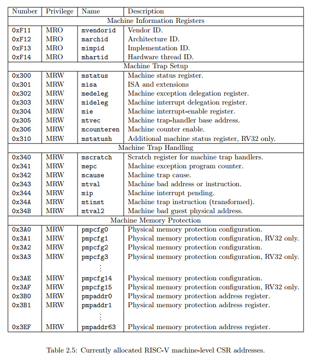

上图中的寄存器被分为四类，其中和Trap相关的寄存器比较重要，用于中断和异常处理：

- 信息类：主要用于获取当前芯片id和cpu核id等信息。
- Trap设置：用于设置中断和异常相关寄存器。
- Trap处理：用于处理中断和异常相关寄存器。
- 内存保护：作用类似于conterx-m中的mpu功能。

下面我们来着重介绍前三类寄存器。

#### Machine Information Registers

mvendorid、 marchid 和 mimpid 可以获取芯片制造商、架构和实现相关信息，最重要的还是 mhartid 这个寄存器，RISCV中每个cpu核都被称为一个hart，通过mhartid可以获取当前cpu核的id号。

#### Machine Trap Setup

在RISCV中，中断（interrupt）和异常（exception）被统称为trap。在arm中我们知道中断和异常是通过中断向量表中不同入口调用不同的处理函数处理的，但是在riscv中，所有中断和异常一般都是使用的同一个处理入口。在x86和arm下都存在中断向量表的概念，用于定义不同异常和中断的处理入口，但是在riscv下，一般是不存在中断向量表这个概念的，只存在trap处理入口这个概念。为了表述上的方便，后续的章节都将trap处理入口称为中断入口，但是要明白这个入口不仅仅是处理中断的，同时也是处理异常的入口。中断入口在m模式和s模式下都有专门的寄存器需要设置，在本小节我们只看m模式下的相关寄存器，在使用中断和异常处理之前需要进行一些设置，下面就来看看这些寄存器如何设置。

##### mtvec

mtvec寄存器全名为Machine Trap-Vector Base-Address Register，用于设置中断入口地址，其寄存器格式如下：

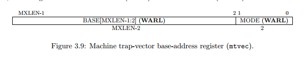

可以看出mtvec需要中断入口地址是4字节对齐的，因为最低两个bit是用于设置中断模式的，其模式定义如下：

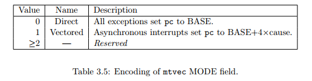

- Direct模式：所有的中断和异常使用同一个中断入口地址，一般都会设置为这种模式。
- Vectored模式：所有异常使用同一个入口地址，但是不同的中断使用不同的入口地址。

##### mstatus

这个寄存器顾名思义是用来控制cpu核当前的一些状态信息的，比如全局中断使能等，寄存器的格式如下：

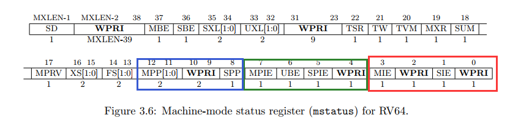

- 红框内的位域用来控制全局中断的使能，SIE控制S模式下全局中断，MIE控制M模式下全局中断。这个有点像arm里cpsr中的F位，只是在RISCV架构下还分为S模式和M模式来控制，像但是不完全像。
- 绿框里的位域用来记录发生中断之前MIE和SIE的值。SPIE记录的是SIE的值，MPIE记录的是MIE的值。
- 蓝色框内位域用来记录当特权级别由低到高发生变化时（比如执行ecall指令），之前的特权级别。当变化后的特权级别是S模式时，SPP表示变化之前的特权级别是S模式还是U模式，所以只需要1位就可以表示；当变化后的特权级别是M模式时，MPP表示变化之前是S模式还是U模式还是M模式，由于有三种情况，所以需要使用2位来表示。

- 注意：当发生中断时，SIE和MIE被硬件自动设置为0，用来屏蔽中断，这个行为和大部分架构都一样，同时MPIE和SPIE被硬件自动设置为MIE和SIE的值，如果特权级别还发生改变的话，之前的特权级别是记录在SPP或者MPP中的。当从中断中返回时，SIE和MIE被自动设置为MPIE和SPIE的值，同时MPIE和SPIE被自动设置为1，特权级别恢复为MPP或者SPP记录的级别，然后MPP或者SPP被设置为U模式。

##### mie

在RISCV下，将中断（interrupt）又细分为三种类型：定时中断(timer)、核间中断(soft)、中断控制器中断(external)。定时中断可以用于产生系统的tick，核间中断用于不同cpu核之间通信，中断控制器则负责所有外设中断。这个设计和arm下有点不一样，在arm多核下，架构中的定时器中断、核间中断和外设中断都是统一由中断控制器管理的，而在RISCV中定时器和核间中断是分离出来的，这两个中断被称为CLINT（Core Local Interrupt），而管理其他外设中断的中断控制器则被称为PLIC（Platform-Level Interrupt Controller）。每个核都有自己的定时器和产生核间中断的寄存器可以设置，这些寄存器的访问不同于其他的控制状态寄存器，采用的是MMIO映射方式访问，比如下图所示为SIFIVE FU540的CLINT寄存器表：

图中的msip用于产生m模式下的核间中断，mtime可以读取出当前计数器的值，mtimecmp用于设置比较值，当mtime的值增加到mtimecmp的值时就可以产生中断。这些寄存器的具体用法在后续的裸机程序编写章节会讲解，这里只需要简单了解即可。

上述讲解的三种中断类型在m模式和s模式下都有相应的中断使能位设置，这是通过mie寄存器实现的，mie寄存器的格式如下：

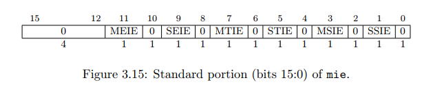

- MSIE、MTIE、MEIE这三个位域分别控制m模式下核间中断、定时中断、中断控制器中断的使能状态。
- SSIE、STIE、SEIE这三个位域分别控制s模式下核间中断、定时中断、中断控制器中断的使能状态。

##### medeleg 和 mideleg

RISCV下默认所有中断和异常都是在m模式下处理的，但是有些时候我们需要将中断和异常直接交给s模式处理，这就是RISCV中的中断托管机制。通过mideleg寄存器，可以将三种中断交给s模式处理，通过medeleg寄存器，可以将异常交给s模式处理。下面来具体看看这些寄存器格式。

当我们想把中断交给s模式处理时，我们可以设置mideleg寄存器，这个寄存器格式如下：

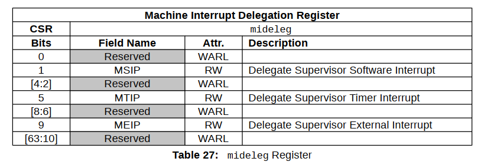

- bit[1]用于控制是否将核间中断交给s模式处理。
- bit[5]用于控制是否将定时中断交给s模式处理。
- bit[9]用于控制是否将中断控制器管理的中断交给s模式处理。

注意对于核间中断和定时中断而言，即使使能了mideleg中对应的bit位，当产生相应中断时，还是先进入m模式进行处理，然后可以通过设置mip寄存器(下一小节讲解)，在退出m模式中断时就可以进入s模式的中断处理函数中处理。

当我们想把异常交给s模式处理时，我们可以设置medelrg寄存器，这个寄存器格式如下：

可以看出来有很多异常是可以设置到s模式下处理的，但是实际使用时并不是所有异常都要交给s模式处理的，比如bit[9]代表的异常还是要交给m模式处理，因为像获取芯片id、cpu核id、设置timer等操作只能在m模式下进行，所以s模式通过SBI接口(后面会讲)使用“ecall”切换到m模式调用不同的服务，所以bit[9]代表的异常必须被m模式处理而不能交给s模式处理。

#### Machine Trap Handling

当产生中断或者异常时，会有一些信息保存在相应的寄存器中，下面我们就一起来看看这些寄存器。

#### mepc

在arm架构中，当发生中断或异常时，硬件自动将要返回的地址保存在lr寄存器中。类似的，在RISCV下产生中断或异常时，硬件自动将返回地址保存在mepc寄存器中，当在中断处理中返回时，硬件自动将mepc中的地址赋值给pc运行。

要注意的时，在RISCV架构中，当产生的时异常时，mepc中保存的是产生异常那条指令的地址，而不是其下一条指令地址，这么设计的原因是希望产生异常时，软件开发人员对相应异常做出处理，当处理完之后再次给一个运行之前产生异常指令的机会，比如缺页异常就是通过这种机制来运行的。当不需要再次运行产生异常那条指令时，需要在中断处理时手动将mepc的值加4，这样中断返回时就是运行产生异常那条指令的下一条指令。当产生的是中断时，mepc直接保存的就是被中断指令的下一条指令的地址，所以需要做修正。

##### mcause和mtval

当产生中断和异常时，mcause寄存器中会记录当前产生的中断或者异常类型，而mtval则针对某些异常会记录一些辅助信息。我们来看看mcause寄存器的格式：

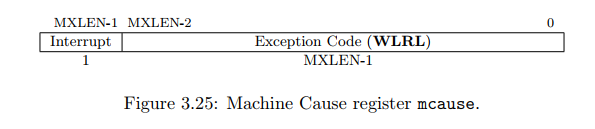

寄存器的最高位用来表示产生的是中断还是异常，1表示中断0表示异常。剩下的位域表示中断或者异常的具体类型，如下所示：

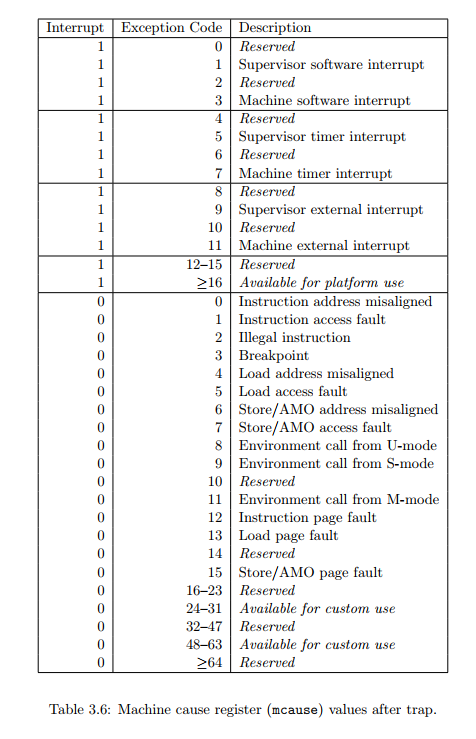

可以看出来中断有6种类型，分别表示m和s模式下的定时、核间、中断控制器这三种中断，而异常的类型就比较多了。

##### mip

这个寄存器可以表明当前是否产生了某种中断，其格式如下所示。

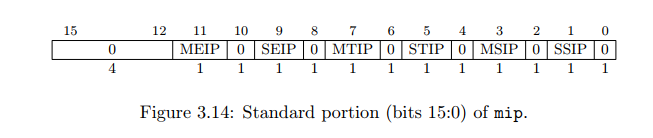

- MSIP表示m模式核间中断，此位只读，其状态反应的是CLINT中对应的核间中断设置寄存器最低位的状态，设置CLINT核间中断设置寄存器最低位为1则产生核间中断，置0则清除核间中断。
- MTIP表示m模式定时中断，此位只读，其状态通过设置CLINT中对应的mtimecmp寄存器来清零。
- MEIP表示m模式中断控制器中断，此位只读，其状态通过具体的中断控制器寄存器设置来清零。
- SSIP表示s模式核间中断，此位在s模式只读(s模式下有sip寄存器，下面会讲)，在m模式下可读写，通过设置此位，可以进入s模式核间中断处理。
- STIP表示s模式定时中断，此位在m模式下可读写，通过设置此位，可以进入s模式定时中断处理。

- SEIP表示s模式中断控制器中断，此位在m模式下可读写，通过设置此位，可以进入s模式中断

### S模式下重要的CSR

S模式下的CSR寄存器大部分都和M模式下的类似，只不过是可以在s模式下进行访问而已。因为在m模式可以访问其他模式下的寄存器，在其他模式下只能访问他自己模式下的csr寄存器。S模式下的一些csr寄存器如下所示。

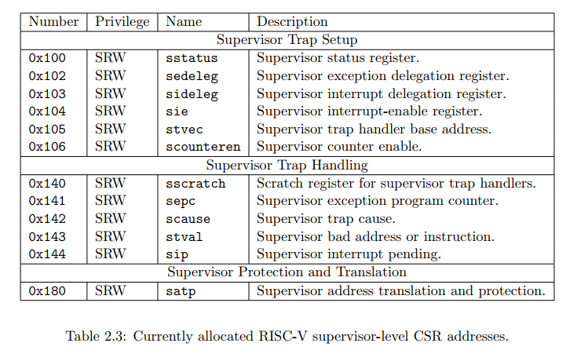

可以看出大部分的寄存器都和m模式下的类似，作用也是一样的，这里就不再赘述了。我们这里看一个m模式下没有的寄存器satp，这个寄存器是s模式下用来设置页表基址的，其格式如下。

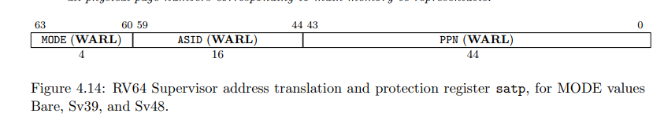

- PPN位域用于填写页表在内存中的物理基址。
- ASID可以先不关心，当作都为0。
- MODE位域用来选择是否开启页表，如果是64位还用来选择虚拟地址翻译的位数，如下：

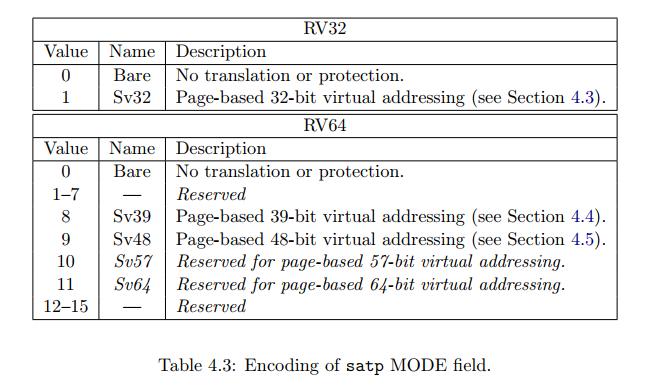

如果是0 表示禁用页表翻译功能，64位架构下一般虚拟地址选用sv39。