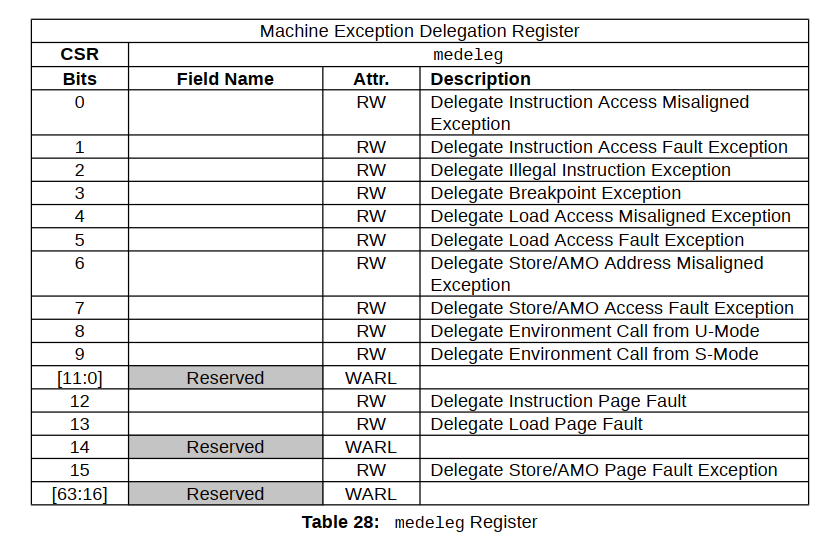
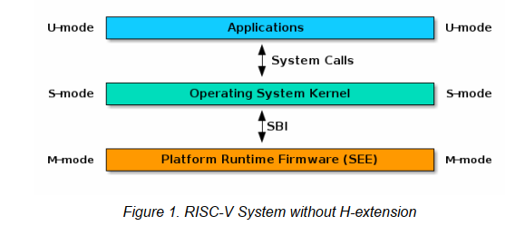

[TOC]


# RISCV基础开发

## 指令集和寄存器

### 写在前面的话

本系列文章旨在通过十几个裸机程序开发逐渐熟悉RISCV架构，包括其重要的系统寄存器使用方式、中断和异常处理机制等等。本系列不是RISCV汇编语言教程，不会专门的讲解汇编语法，但是会对裸机程序中使用到的一些汇编进行简单的介绍，希望通过本系列文章的学习后，各位童鞋能掌握RISCV架构的基础知识，如果想进一步学习，可以阅读相关的开源软件源码或者查阅网络上相关RISCV资料。

### RISCV模块化指令集设计

学习一个新的架构先来看看这个架构支持哪些指令，RISCV的指令集使用模块化的方式进行组织，每一个模块使用一个英文字母来表示。在指令集规范中，强制要求实现的是由字母I表示的基础整数指令集，其他指令集均为扩展可选，一般使用的扩展指令集包括M/A/F/D/C，如下所示。


以上模块的一个特定组合“IMAFD”，由于大多数RISCV处理器都会实现，所以也被称为通用组合，用英文字母G表示。因此RV32G表示RV32IMAFD，RV64G表示RV64IMAFD。

#### 基础整数指令集

在RISCV架构中，除了压缩指令集外，其余的指令长度都为32位，也就是4个字节。整数指令集中的指令主要包括以下几类：

- 整数计算：主要是算术运算和逻辑运算类指令，实现加、减、与、或等功能计算。
- 地址访问：主要是Load和Store类指令，实现读写地址功能。
- 程序跳转：主要是分支跳转类和无条件跳转类指令，实现程序跳转功能。
- 控制状态：主要是系统控制状态寄存器访问类指令，实现对系统寄存器的访问。

#### 扩展浮点指令集

RISCV的浮点扩展指令分为单精度和双精度两类，同时浮点指令使用单独的32个浮点寄存器，而不是通用整数寄存器，指令集功能主要包括以下几类：

- 算术运算：主要是加减乘除、矩阵计算、平方根、最大最小值等运算指令。
- 地址访问：主要是浮点寄存器Load和Store类指令，实现读写地址功能。
- 转换搬运：主要是整数和浮点类型数据转换、浮点和通用寄存器之间数据搬运指令。

#### 扩展整数乘除指令集

这个扩展指令集主要实现对整数的乘法和除法运算，并支持有符号和无符号数。

#### 扩展原子操作指令集

原子操作类指令主要用于保证对内存操作上的原子性， 原子表示内存读写之间的过程不会被打断，内存值也不会被其它处理器修改 。一般操作系统都会提供原子操作的系统API，其底层最终就是用这些原子操作指令来实现的。

#### 扩展压缩指令集

RISCV通过压缩指令集可以提高代码密度，其作用类似于ARM中的 Thumb指令集，用于一些存储容量极度受限的嵌入式场景。

#### 扩展向量指令集

类似于ARM下提供的NEON向量指令集，RISCV也提供了向量指令集扩展，用于单指令多数据(SIMD)操作。

#### 其他扩展指令集

除了上述指令集外，还有若干的模块如L、B、P和T等，目前这些扩展大多数还在不断完善和定义中，尚未最终确定，因此不做详细阐述。

### RISCV架构寄存器

#### 32个通用寄存器

RISCV架构设计了32个通用整数寄存器和一个程序计数寄存器(PC)，如下所示。


通用寄存器的长度在32位架构中为32位，在64位架构中为64位，下面介绍32个通用寄存器中比较重要的几个寄存器：

- x0：这个寄存器恒为0，读取的值永远为0。
- ra：用于保存函数调用返回地址，作用类似ARM架构中的lr寄存器。
- sp：用于保存栈地址，RISCV下和ARM下一样，一般使用满减栈方式。
- fp：用于保存栈帧，作用类似ARM下的bp寄存器。
- a0~a7：用于传递函数调用的参数，并且a0一般用于保存函数返回值。

#### 32个浮点寄存器

当支持RISCV浮点扩展指令时，需要使用额外的32个浮点寄存器来支持浮点指令，如下所示。


#### 控制状态寄存器

RISCV在M模式和S模式下分别具有一些控制状态寄存器，用于系统异常处理或者其他功能，至于什么是M模式和S模式会在下一章节进行讲解，这里以M模式为例，先介绍这个模式下的几个重要寄存器，S模式下的寄存器类似：

- mtvec(Machine Trap Vector)：保存发生异常时处理器需要跳转的地址。
- mepc(Machine Exception PC)：保存发生异常的指令地址。
- mcause(Machine Exception Cause)：指明产生异常的原因。
- mie(Machine Interrupt Enable)：指明处理器目前能处理和忽略的中断。
- mip(Machine Interrupt Pending)：指明目前正准备处理的中断。
- mtval(Machine Trap Val)：保存产生异常时的附加信息。
- mstatus(Machine Status)：全局中断使能和其他状态信息。

## 特权架构

处理器在架构上一般都会有几种特权模式，比如x86架构有“ring0~ring3”4种级别，一般操作系统内核和驱动运行在ring0级别，也就是最高级别，而普通的应用程序运行在ring3级别，也就是权限最低的级别；再比如arm架构有7种处理器模式，操作系统一般运行在Supervisor模式，而应用程序运行在User模式。

那么为什么处理器架构在设计时需要设计好几种级别不同的模式呢？原因是为了不同作用的程序考虑的。比如一般操作系统享有最高级别的权限，可以访问系统所有硬件，执行所有特权指令，例如设置MMU页表等，那么设置MMU页表这种操作能让普通的应用程序来操作吗，当然是不行的，所以操作系统和普通应用这两种程序肯定是需要运行在不同级别的权限模式下的，如果普通程序强行去执行特权指令操作，要么没有任何反应要么系统产生异常，这样就从硬件上保证了安全性。

同样的，RISCV架构下有三种特权级别，分别是Machine、Supervisor和User，简称M模式、S模式和U模式。M模式权限最高，在这个级别下的程序可以访问一切硬件和执行所有特权指令；S模式一般用于运行操作系统，可以设置MMU使用虚拟地址；U模式一般是普通应用程序使用，权限最低。

M模式使用物理地址进行访问，不经过MMU，但是有类似arm下cortex-m中的MPU功能；S模式可以通过设置MMU来使用虚拟地址访问内存，所以像Linux这类操作系统都运行在S模式下。那么有人要问了，为啥RISCV架构特权模式设计成这样，直接把M模式和S模式合二为一不行吗？这个得从RISCV架构诞生背景来看了，RISCV架构诞生于2010年左右，这时不管是x86还是arm架构都发展得算是比较成熟了，所以RISCV架构设计时就定位了从微控制器到大型超级计算机都可以使用这个架构。在微控制器上使用的RISCV架构一般只有M模式，或者使用M和U两种模式，类似于cortex-m架构的定位；而在带MMU的芯片上，RISCV架构一般都使用M、S和U三种模式，这样通过“拼积木”的方式就可以让RISCV架构适用于各种场景了。

在arm下的应用程序通过“swi”指令可以将处理器从低特权级别切换到高特权级别，一般像Linux下的系统调用都是通过这种方式来使用的。类似的，在RISCV中，通过“ecall”指令可以从低特权切换到高特权，在U模式下执行就切换到S模式，在S模式下调用就切换到M模式。另外在RISCV中，默认产生中断和异常时，处理器自动切换到M模式处理，可以通过中断托管设置将一些中断和异常直接交给S模式处理。RISCV的架构设计就决定了必须要有程序运行在M模式下，来为S模式提供一些基础的服务，RISCV为此定义了SBI(Supervisor Binary Interface)接口规范，让运行在S模式下的操作系统在不同的RISCV处理器上都可以使用标准的SBI接口来使用相应的功能，这个其实就有点类似于x86下的BIOS概念了，详细的RISCV下中断和异常处理以及SBI规范在后续章节会讲解，这里只需要知道就可以。

## 中断和异常处理

在RISCV架构设计中，有一系列的控制和状态寄存器( Control and Status Registers）简称CSR，在三种特权级别下都有其对应的CSR，比如m模式下的命名都为mxxxx，s模式下的都为sxxxx等等。这些寄存器的作用类似于arm架构中的那些cp15寄存器，用于设置异常向量表、设置页表基址、获取异常信息等等。这些寄存器大多数都需要通过“csr”这类指令来进行访问，也有一部分寄存器是采用mmio映射的，可以使用普通访存指令访问，比如timer相关的寄存器（后面会讲）。这些寄存器比较重要的就是和中断异常相关的，下面我们来一起看看这些寄存器。

### M模式下重要的CSR

M模式下的比较重要的寄存器如下所示，当然除了下图列出之外的寄存器，m模式下还有其他的一些寄存器，具体的请参考RISCV特权架构官方文档。


上图中的寄存器被分为四类，其中和Trap相关的寄存器比较重要，用于中断和异常处理：

- 信息类：主要用于获取当前芯片id和cpu核id等信息。
- Trap设置：用于设置中断和异常相关寄存器。
- Trap处理：用于处理中断和异常相关寄存器。
- 内存保护：作用类似于conterx-m中的mpu功能。

下面我们来着重介绍前三类寄存器。

#### Machine Information Registers

mvendorid、 marchid 和 mimpid 可以获取芯片制造商、架构和实现相关信息，最重要的还是 mhartid 这个寄存器，RISCV中每个cpu核都被称为一个hart，通过mhartid可以获取当前cpu核的id号。

#### Machine Trap Setup

在RISCV中，中断（interrupt）和异常（exception）被统称为trap。在arm中我们知道中断和异常是通过中断向量表中不同入口调用不同的处理函数处理的，但是在riscv中，所有中断和异常一般都是使用的同一个处理入口。在x86和arm下都存在中断向量表的概念，用于定义不同异常和中断的处理入口，但是在riscv下，一般是不存在中断向量表这个概念的，只存在trap处理入口这个概念。为了表述上的方便，后续的章节都将trap处理入口称为中断入口，但是要明白这个入口不仅仅是处理中断的，同时也是处理异常的入口。中断入口在m模式和s模式下都有专门的寄存器需要设置，在本小节我们只看m模式下的相关寄存器，在使用中断和异常处理之前需要进行一些设置，下面就来看看这些寄存器如何设置。

##### mtvec

mtvec寄存器全名为Machine Trap-Vector Base-Address Register，用于设置中断入口地址，其寄存器格式如下：


可以看出mtvec需要中断入口地址是4字节对齐的，因为最低两个bit是用于设置中断模式的，其模式定义如下：


- Direct模式：所有的中断和异常使用同一个中断入口地址，一般都会设置为这种模式。
- Vectored模式：所有异常使用同一个入口地址，但是不同的中断使用不同的入口地址。

##### mstatus

这个寄存器顾名思义是用来控制cpu核当前的一些状态信息的，比如全局中断使能等，寄存器的格式如下：


- 红框内的位域用来控制全局中断的使能，SIE控制S模式下全局中断，MIE控制M模式下全局中断。这个有点像arm里cpsr中的F位，只是在RISCV架构下还分为S模式和M模式来控制，像但是不完全像。
- 绿框里的位域用来记录发生中断之前MIE和SIE的值。SPIE记录的是SIE的值，MPIE记录的是MIE的值。
- 蓝色框内位域用来记录当特权级别由低到高发生变化时（比如执行ecall指令），之前的特权级别。当变化后的特权级别是S模式时，SPP表示变化之前的特权级别是S模式还是U模式，所以只需要1位就可以表示；当变化后的特权级别是M模式时，MPP表示变化之前是S模式还是U模式还是M模式，由于有三种情况，所以需要使用2位来表示。

- 注意：当发生中断时，SIE和MIE被硬件自动设置为0，用来屏蔽中断，这个行为和大部分架构都一样，同时MPIE和SPIE被硬件自动设置为MIE和SIE的值，如果特权级别还发生改变的话，之前的特权级别是记录在SPP或者MPP中的。当从中断中返回时，SIE和MIE被自动设置为MPIE和SPIE的值，同时MPIE和SPIE被自动设置为1，特权级别恢复为MPP或者SPP记录的级别，然后MPP或者SPP被设置为U模式。

##### mie

在RISCV下，将中断（interrupt）又细分为三种类型：定时中断(timer)、核间中断(soft)、中断控制器中断(external)。定时中断可以用于产生系统的tick，核间中断用于不同cpu核之间通信，中断控制器则负责所有外设中断。这个设计和arm下有点不一样，在arm多核下，架构中的定时器中断、核间中断和外设中断都是统一由中断控制器管理的，而在RISCV中定时器和核间中断是分离出来的，这两个中断被称为CLINT（Core Local Interrupt），而管理其他外设中断的中断控制器则被称为PLIC（Platform-Level Interrupt Controller）。每个核都有自己的定时器和产生核间中断的寄存器可以设置，这些寄存器的访问不同于其他的控制状态寄存器，采用的是MMIO映射方式访问，比如下图所示为SIFIVE FU540的CLINT寄存器表：


图中的msip用于产生m模式下的核间中断，mtime可以读取出当前计数器的值，mtimecmp用于设置比较值，当mtime的值增加到mtimecmp的值时就可以产生中断。这些寄存器的具体用法在后续的裸机程序编写章节会讲解，这里只需要简单了解即可。

上述讲解的三种中断类型在m模式和s模式下都有相应的中断使能位设置，这是通过mie寄存器实现的，mie寄存器的格式如下：


- MSIE、MTIE、MEIE这三个位域分别控制m模式下核间中断、定时中断、中断控制器中断的使能状态。
- SSIE、STIE、SEIE这三个位域分别控制s模式下核间中断、定时中断、中断控制器中断的使能状态。

##### medeleg 和 mideleg

RISCV下默认所有中断和异常都是在m模式下处理的，但是有些时候我们需要将中断和异常直接交给s模式处理，这就是RISCV中的中断托管机制。通过mideleg寄存器，可以将三种中断交给s模式处理，通过medeleg寄存器，可以将异常交给s模式处理。下面来具体看看这些寄存器格式。

当我们想把中断交给s模式处理时，我们可以设置mideleg寄存器，这个寄存器格式如下：


- bit[1]用于控制是否将核间中断交给s模式处理。
- bit[5]用于控制是否将定时中断交给s模式处理。
- bit[9]用于控制是否将中断控制器管理的中断交给s模式处理。

注意对于核间中断和定时中断而言，即使使能了mideleg中对应的bit位，当产生相应中断时，还是先进入m模式进行处理，然后可以通过设置mip寄存器(下一小节讲解)，在退出m模式中断时就可以进入s模式的中断处理函数中处理。

当我们想把异常交给s模式处理时，我们可以设置medelrg寄存器，这个寄存器格式如下：



可以看出来有很多异常是可以设置到s模式下处理的，但是实际使用时并不是所有异常都要交给s模式处理的，比如bit[9]代表的异常还是要交给m模式处理，因为像获取芯片id、cpu核id、设置timer等操作只能在m模式下进行，所以s模式通过SBI接口(后面会讲)使用“ecall”切换到m模式调用不同的服务，所以bit[9]代表的异常必须被m模式处理而不能交给s模式处理。

#### Machine Trap Handling

当产生中断或者异常时，会有一些信息保存在相应的寄存器中，下面我们就一起来看看这些寄存器。

#### mepc

在arm架构中，当发生中断或异常时，硬件自动将要返回的地址保存在lr寄存器中。类似的，在RISCV下产生中断或异常时，硬件自动将返回地址保存在mepc寄存器中，当在中断处理中返回时，硬件自动将mepc中的地址赋值给pc运行。

要注意的时，在RISCV架构中，当产生的时异常时，mepc中保存的是产生异常那条指令的地址，而不是其下一条指令地址，这么设计的原因是希望产生异常时，软件开发人员对相应异常做出处理，当处理完之后再次给一个运行之前产生异常指令的机会，比如缺页异常就是通过这种机制来运行的。当不需要再次运行产生异常那条指令时，需要在中断处理时手动将mepc的值加4，这样中断返回时就是运行产生异常那条指令的下一条指令。当产生的是中断时，mepc直接保存的就是被中断指令的下一条指令的地址，所以需要做修正。

##### mcause和mtval

当产生中断和异常时，mcause寄存器中会记录当前产生的中断或者异常类型，而mtval则针对某些异常会记录一些辅助信息。我们来看看mcause寄存器的格式：


寄存器的最高位用来表示产生的是中断还是异常，1表示中断0表示异常。剩下的位域表示中断或者异常的具体类型，如下所示：


可以看出来中断有6种类型，分别表示m和s模式下的定时、核间、中断控制器这三种中断，而异常的类型就比较多了。

##### mip

这个寄存器可以表明当前是否产生了某种中断，其格式如下所示。


- MSIP表示m模式核间中断，此位只读，其状态反应的是CLINT中对应的核间中断设置寄存器最低位的状态，设置CLINT核间中断设置寄存器最低位为1则产生核间中断，置0则清除核间中断。
- MTIP表示m模式定时中断，此位只读，其状态通过设置CLINT中对应的mtimecmp寄存器来清零。
- MEIP表示m模式中断控制器中断，此位只读，其状态通过具体的中断控制器寄存器设置来清零。
- SSIP表示s模式核间中断，此位在s模式只读(s模式下有sip寄存器，下面会讲)，在m模式下可读写，通过设置此位，可以进入s模式核间中断处理。
- STIP表示s模式定时中断，此位在m模式下可读写，通过设置此位，可以进入s模式定时中断处理。

- SEIP表示s模式中断控制器中断，此位在m模式下可读写，通过设置此位，可以进入s模式中断

### S模式下重要的CSR

S模式下的CSR寄存器大部分都和M模式下的类似，只不过是可以在s模式下进行访问而已。因为在m模式可以访问其他模式下的寄存器，在其他模式下只能访问他自己模式下的csr寄存器。S模式下的一些csr寄存器如下所示。


可以看出大部分的寄存器都和m模式下的类似，作用也是一样的，这里就不再赘述了。我们这里看一个m模式下没有的寄存器satp，这个寄存器是s模式下用来设置页表基址的，其格式如下。


- PPN位域用于填写页表在内存中的物理基址。
- ASID可以先不关心，当作都为0。
- MODE位域用来选择是否开启页表，如果是64位还用来选择虚拟地址翻译的位数，如下：


如果是0 表示禁用页表翻译功能，64位架构下一般虚拟地址选用sv39。

## SBI规范

### 简介

SBI的全称为Supervisor Binary Interface，是m模式下的服务对上提供的统一接口。比如设置timer、发送核间中断等，这些服务通过SBI接口进行封装，这样运行在s模式下的操作系统就可以在不同的平台上通过SBI这个统一的接口来使用一些底层服务，降低移植工作量，这个设计就有点像x86上的BIOS提供的中断服务，如下图所示。



同时RISCV基金会也提供了一套开源的实现，叫做OpenSBI，目前支持qemu virt、k210等几个riscv平台。RISCV芯片厂商一般也都会提供支持其芯片的OpenSBI移植源码，比如全志D1芯片等。

### 调用规则

SBI接口通过“ecall”指令发起调用，然后进入m模式处理。SBI通过EID和FID来确定一个唯一的服务，这两个ID都为32位有符号整数。EID全称为SBI extension ID，其作用类似Linux下的系统调用号，表示SBI的某一组服务，如下图所示。


EID的值通过a7来保存。FID的全称为SBI function ID，表示某一组SBI服务中提供的具体功能，比如EID 0x10，FID 0x4 表示获取芯片厂商ID，如下图所示。


FID通过a6来保存，SBI服务调用结果通过a0和a1来返回，a0保存调用的错误码，比如成功还是失败之类，a1用来保存具体的返回值，错误码如下图所示。


### 使用服务

一般像Linux这样的操作系统都会将SBI调用封装好，并提供相应的函数接口给内核开发者使用，SylixOS也类似，SylixOS通过sbi.h来提供SBI的服务调用接口，如下图所示。


通过这些接口我们可以很方便的使用硬件底层功能，比如想通过串口打印调试，通过“sbi_console_putchar”接口就可以直接输出字符。

## QEMU裸机开发之环境搭建

### 概述

前面我们介绍了RISCV架构的一些基础知识，从本章节开始我们通过在QEMU下编写裸机程序来进一步的学习RISCV架构，旨在通过实操来掌握相关知识点。

运行环境我是在Ubuntu 20.04下测试，QEMU选用的时5.2.0版本而不是最新的6.x版本，因为实测发现在6.x版本下从m模式切换到s模式下时，“mret”指令执行会发生异常，具体原因不明，在5.1和5.2版本下测试都正常，所以QEMU选用5.2版本来使用。

####  安装交叉编译器

首先我们需要安装riscv64的交叉编译器，输入以下命令：

```
sudo apt-get install git build-essential gdb-multiarch qemu-system-misc gcc-riscv64-linux-gnu binutils-riscv64-linux-gnu
```

然后再安装一些后面编译源码时需要的工具，输入以下命令：

```
sudo apt-get install autoconf automake autotools-dev curl libmpc-dev libmpfr-dev libgmp-dev gawk build-essential bison flex texinfo gperf libtool patchutils bc zlib1g-dev libexpat-dev
```

###  编译安装qemu

通过QEMU官网下载5.2.0源码，解压后进入源码目录，通过以下命令来编译安装QEMU5.2.0：

```
$ ./configure --disable-kvm --disable-werror --prefix=/usr/local --target-list="riscv64-softmmu"
$ make
$ sudo make install
```

### 测试环境

安装完成后，通过以下命令来测试交叉编译器和qemu的版本：

```
gewenbin@gewenbin-virtual-machine:~$ riscv64-unknown-elf-gcc --version
riscv64-unknown-elf-gcc () 9.3.0
Copyright (C) 2019 Free Software Foundation, Inc.
This is free software; see the source for copying conditions.  There is NO
warranty; not even for MERCHANTABILITY or FITNESS FOR A PARTICULAR PURPOSE.

gewenbin@gewenbin-virtual-machine:~$ qemu-system-riscv64 --version
QEMU emulator version 5.2.0
Copyright (c) 2003-2020 Fabrice Bellard and the QEMU Project developers
gewenbin@gewenbin-virtual-machine:~$
```

## QEMU裸机开发之打印字符

### 文件结构总览

先整体看下本章节裸机程序的工程文件组成，如下图所示。


- address.h：主要定义了一些外设寄存器的基址还有内存基址等。
- entry.S：入口文件，主要设置了栈。
- kernel.ld：编译用的链接脚本。
- Makefile：makefile文件，控制源码的编译过程。
- start.c：是C语言实现的入口，在entry.S中会调转到C函数中。
- uart.c和uart.h：串口驱动源码。

### Makefile

Makefile控制着源码的编译，如下图所示。

```
# compile objects set
KERNEL_IMAGE_NAME=kernelimage

OBJS = \
  entry.o \
  start.o \
  uart.o

# cross compiler and flag set
CROSS_COMPILER = riscv64-unknown-elf-
CC = $(CROSS_COMPILER)gcc
AS = $(CROSS_COMPILER)gas
LD = $(CROSS_COMPILER)ld
OBJCOPY = $(CROSS_COMPILER)objcopy
OBJDUMP = $(CROSS_COMPILER)objdump

CFLAGS = -Wall -Werror -O -fno-omit-frame-pointer -ggdb
CFLAGS += -mcmodel=medany
CFLAGS += -ffreestanding -fno-common -nostdlib -mno-relax
CFLAGS += -I.
CFLAGS += $(shell $(CC) -fno-stack-protector -E -x c /dev/null >/dev/null 2>&1 && echo -fno-stack-protector)

# Disable PIE when possible (for Ubuntu 16.10 toolchain)
ifneq ($(shell $(CC) -dumpspecs 2>/dev/null | grep -e '[^f]no-pie'),)
CFLAGS += -fno-pie -no-pie
endif
ifneq ($(shell $(CC) -dumpspecs 2>/dev/null | grep -e '[^f]nopie'),)
CFLAGS += -fno-pie -nopie
endif

LDFLAGS = -z max-page-size=4096

# compile kernel
$(KERNEL_IMAGE_NAME): $(OBJS) kernel.ld
    $(LD) $(LDFLAGS) -T kernel.ld -o $(KERNEL_IMAGE_NAME) $(OBJS) 
    $(OBJDUMP) -S $(KERNEL_IMAGE_NAME) > kernel.asm
    $(OBJDUMP) -t $(KERNEL_IMAGE_NAME) | sed '1,/SYMBOL TABLE/d; s/ .* / /; /^$$/d' > kernel.sym
    
clean: 
    rm -f *.tex *.dvi *.idx *.aux *.log *.ind *.ilg \
    $(OBJS) *.asm *.sym \
    $(KERNEL_IMAGE_NAME)
    
# qemu set
QEMU = qemu-system-riscv64

ifndef CPUS
CPUS := 1
endif

QEMUOPTS = -machine virt -bios none -kernel $(KERNEL_IMAGE_NAME) -m 128M -smp $(CPUS) -nographic

qemu: $(KERNEL_IMAGE_NAME)
    $(QEMU) $(QEMUOPTS)
```

这个makefile修改自xv6工程的makefile，需要注意的是qemu的启动命令，我们使用了“-bios none”选项，表示不使用OpenSBI这类的软件，而是直接加载我们编译的程序运行，所以我们写的程序开始就是运行在m模式下的。这里默认使用了128MB内存，并且使用单核方式。

### 链接脚本

链接脚本控制着整个程序的链接地址，如下图所示。

```
OUTPUT_ARCH( "riscv" )
ENTRY( _entry )

SECTIONS
{
  /*
   * ensure that entry.S / _entry is at 0x80000000,
   * where qemu's -kernel jumps.
   */
  . = 0x80000000;

  .text : {
    *(.text .text.*)
    . = ALIGN(0x1000);
    PROVIDE(etext = .);
  }

  .rodata : {
    . = ALIGN(16);
    *(.srodata .srodata.*) /* do not need to distinguish this from .rodata */
    . = ALIGN(16);
    *(.rodata .rodata.*)
  }

  .data : {
    . = ALIGN(16);
    *(.sdata .sdata.*) /* do not need to distinguish this from .data */
    . = ALIGN(16);
    *(.data .data.*)
  }

  .bss : {
    . = ALIGN(16);
    *(.sbss .sbss.*) /* do not need to distinguish this from .bss */
    . = ALIGN(16);
    *(.bss .bss.*)
  }
  
  .stack (NOLOAD) : {
    . = ALIGN(16);
    PROVIDE (__stack_start = .);
    
    . += 128 * 1024;
    
    . = ALIGN(16);
    PROVIDE (__stack_end = .);
  }

  PROVIDE(end = .);
}
```

整个程序链接地址是从0x80000000开始的，然后划分了5个段：代码段、只读数据段、数据段、清零数据段、栈段。栈段默认分配了128KB空间用于m模式和s模式下正常和异常时使用，这个在后面涉及到时会具体讲解。

### 入口处理

entry.S主要是设置了栈地址，因为我们使用的是模拟器，所以不需要初始化内存这类外设，只需要将栈设置好就可以跳转到c语言函数运行了，如下所示。

```
.section .text

.global _entry
_entry:

# sp = __stack_start + ((hartid + 1) * 4096)
    la sp, __stack_start
    li a0, 4096
    csrr a1, mhartid
    addi a1, a1, 1
    mul a0, a0, a1
    add sp, sp, a0

    call start
    
loop:
    j loop
```

这段代码参考自xv6，原来是可以设置多核下的栈的，因为现在我们只使用了单核，所以栈地址被设置为__stack_start+4096这个值，__stack_start就是在链接脚本里定义的，这个栈是m模式正常运行时所使用的栈，大小为4KB。栈设置完成之后，直接就调用c函数实现的start进行处理。

### C语言主函数处理

strat.c中目前只有一个c语言实现的start函数，如下所示。

```
#include "uart.h"

void start(void)
{
    uart_puts("in start.\r\n");
}
```

目前的实现很简单，就是调用串口驱动发送字符串函数“uart_puts”打印一串信息。

### 串口驱动

我们qemu选用的平台是virt，使用的串口为16550兼容串口，由于是模拟器，我们可以直接实现发送函数就可以实现字符输出打印功能，而不需要去初始化，如下所示。

```
#include "address.h"

// the UART control registers.
// some have different meanings for
// read vs write.
// see http://byterunner.com/16550.html
#define RHR 0                 // receive holding register (for input bytes)
#define THR 0                 // transmit holding register (for output bytes)
#define IER 1                 // interrupt enable register
#define IER_RX_ENABLE (1<<0)
#define IER_TX_ENABLE (1<<1)
#define FCR 2                 // FIFO control register
#define FCR_FIFO_ENABLE (1<<0)
#define FCR_FIFO_CLEAR (3<<1) // clear the content of the two FIFOs
#define ISR 2                 // interrupt status register
#define LCR 3                 // line control register
#define LCR_EIGHT_BITS (3<<0)
#define LCR_BAUD_LATCH (1<<7) // special mode to set baud rate
#define LSR 5                 // line status register
#define LSR_RX_READY (1<<0)   // input is waiting to be read from RHR
#define LSR_TX_IDLE (1<<5)    // THR can accept another character to send

// the UART control registers are memory-mapped
// at address UART0. this macro returns the
// address of one of the registers.
#define Reg(reg) ((volatile unsigned char *)(UART0_REG_BASE + reg))
#define ReadReg(reg) (*(Reg(reg)))
#define WriteReg(reg, v) (*(Reg(reg)) = (v))

// add a character to the output buffer and tell the
// UART to start sending if it isn't already.
void uart_putc(char c)
{
    // wait for Transmit Holding Empty to be set in LSR.
    while((ReadReg(LSR) & LSR_TX_IDLE) == 0);

    WriteReg(THR, c);
}

void uart_puts(char *msg)
{
    char c;

    if (!msg) {
        return;
    }

    while ((c = *msg) != '\0') {
        uart_putc(c);
        msg++;
    }
}
```

逻辑也很简单，就是轮询等待发送寄存器为空，然后再写入数据发送，串口模块寄存器基址是定义在address.h中的，如下所示。

```
#ifndef QEMU_RISCV64_ADDRESS_H_
#define QEMU_RISCV64_ADDRESS_H_

// the kernel expects there to be RAM
// for use by the kernel and user pages
// from physical address 0x80000000 to PHYSTOP.
#define KERNBASE 0x80000000L
#define PHYSTOP (KERNBASE + 128*1024*1024)

#define UART0_REG_BASE      (0x10000000L)
#define CLINT_REG_BASE      (0x02000000L)

#endif /* QEMU_RISCV64_ADDRESS_H_ */
```

其中CLINT的基址在后面设置核间中断和timer会用到，后面会讲解。

### 测试

在命令行输入“make qemu”即可编译，编译完成后会自动启动qemu运行程序，如果一切顺利会在最后看到“in start.”这个信息输出，如下所示。

```
gewenbin@gewenbin-virtual-machine:~/Desktop/qemu_test/lesson1$ make qemu
riscv64-unknown-elf-gcc    -c -o entry.o entry.S
riscv64-unknown-elf-gcc -Wall -Werror -O -fno-omit-frame-pointer -ggdb -mcmodel=medany -ffreestanding -fno-common -nostdlib -mno-relax -I. -fno-stack-protector -fno-pie -no-pie   -c -o start.o start.c
riscv64-unknown-elf-gcc -Wall -Werror -O -fno-omit-frame-pointer -ggdb -mcmodel=medany -ffreestanding -fno-common -nostdlib -mno-relax -I. -fno-stack-protector -fno-pie -no-pie   -c -o uart.o uart.c
riscv64-unknown-elf-ld -z max-page-size=4096 -T kernel.ld -o kernelimage entry.o start.o uart.o 
riscv64-unknown-elf-objdump -S kernelimage > kernel.asm
riscv64-unknown-elf-objdump -t kernelimage | sed '1,/SYMBOL TABLE/d; s/ .* / /; /^$/d' > kernel.sym
qemu-system-riscv64 -machine virt -bios none -kernel kernelimage -m 128M -smp 1 -nographic
in start.
QEMU: Terminated
gewenbin@gewenbin-virtual-machine:~/Desktop/qemu_test/lesson1$
```

如果想从qemu中退出到命令行，先按住“ctrl+a”，然后再按“x”键即可。输入“make clean”即可清零编译结果。

### 工程源码

链接：https://pan.baidu.com/s/1TnTYr7mywdKj5bxpdmWnyA，提取码：q772，见lesson1。

## QEMU裸机开发之格式化打印

在前面的程序中我们实现了简单的字符串输出函数，在实际使用时，我们还需要进行格式化打印，比如打印某个变量的值，按十进制或者十六进制打印等等，本章节我们在“uart.c”中实现一个简单的printf函数，用于后续程序的调试，在“uart.c”中添加的代码如下所示。

```
//printf functions
static char digits[] = "0123456789abcdef";

static void print_int(int xx, int base, int sign)
{
    char buf[16];
    int i;
    unsigned int x;

    if(sign && (sign = xx < 0))
        x = -xx;
    else
        x = xx;

    i = 0;
    do {
        buf[i++] = digits[x % base];
    } while((x /= base) != 0);

    if(sign)
        buf[i++] = '-';

    while(--i >= 0)
        uart_putc(buf[i]);
}

static void print_ptr(unsigned long x)
{
    int i;
    uart_putc('0');
    uart_putc('x');

    for (i = 0; i < (sizeof(unsigned long) * 2); i++, x <<= 4)
        uart_putc(digits[x >> (sizeof(unsigned long) * 8 - 4)]);
}

// Print to the console. only understands %d, %x, %p, %s.
void printf(char *fmt, ...)
{
    va_list ap;
    int i, c;
    char *s;

    if (fmt == 0)
        return;

    va_start(ap, fmt);
    for(i = 0; (c = fmt[i] & 0xff) != 0; i++) {
        if(c != '%'){
            uart_putc(c);
            continue;
        }

        c = fmt[++i] & 0xff;
        if(c == 0)
            break;

        switch(c){
        case 'd':
            print_int(va_arg(ap, int), 10, 1);
            break;

        case 'x':
            print_int(va_arg(ap, int), 16, 1);
            break;

        case 'p':
            print_ptr(va_arg(ap, unsigned long));
            break;

        case 's':
            if((s = va_arg(ap, char*)) == 0)
                s = "(null)";

            for(; *s; s++)
                uart_putc(*s);
            break;

        case '%':
            uart_putc('%');
            break;

        default:
            // Print unknown % sequence to draw attention.
            uart_putc('%');
            uart_putc(c);
            break;
        }
    }
}
```

这个printf实现参考xv6，功能也很简单，主要有以下几个功能：

- %d：32位数据按十进制打印。
- %x：32位数据按十六进制打印。
- %p：按16进制打印指针数值。
- %s：打印字符串。

有了这几个功能之后，基本能对付大部分的打印调试需求了，将“start.c”中的打印换成printf，如下所示。

```
#include "uart.h"

void start(void)
{
    printf("%s %d.\r\n", __func__, __LINE__);
}
```

在命令行执行“make qemu”，可以在最后看到打印的函数名以及行号信息，如下所示。

```
gewenbin@gewenbin-virtual-machine:~/Desktop/qemu_test/lesson2$ make qemu
riscv64-unknown-elf-gcc -Wall -Werror -O -fno-omit-frame-pointer -ggdb -mcmodel=medany -ffreestanding -fno-common -nostdlib -mno-relax -I. -fno-stack-protector -fno-pie -no-pie   -c -o start.o start.c
riscv64-unknown-elf-gcc -Wall -Werror -O -fno-omit-frame-pointer -ggdb -mcmodel=medany -ffreestanding -fno-common -nostdlib -mno-relax -I. -fno-stack-protector -fno-pie -no-pie   -c -o uart.o uart.c
riscv64-unknown-elf-ld -z max-page-size=4096 -T kernel.ld -o kernelimage entry.o start.o uart.o 
riscv64-unknown-elf-objdump -S kernelimage > kernel.asm
riscv64-unknown-elf-objdump -t kernelimage | sed '1,/SYMBOL TABLE/d; s/ .* / /; /^$/d' > kernel.sym
qemu-system-riscv64 -machine virt -bios none -kernel kernelimage -m 128M -smp 1 -nographic
start 5.
```

### 工程源码

链接：https://pan.baidu.com/s/1TnTYr7mywdKj5bxpdmWnyA，提取码：q772，见lesson2。

## QEMU裸机开发之M模式中断设置

### CSR寄存器操作

从本章节开始我们需要对CSR相关寄存器设置，所以将这些寄存器的读写访问封装成一些接口定义在“csr.h”中，这些接口基本都参考自xv6，如下所示。


### 中断初始化

在可以使用中断和异常处理之前，需要进行一些设置，所以需要在“start.c”中添加中断初始化代码，如下所示。

```
#include "uart.h"
#include "csr.h"

// in kernel.ld.
extern char __stack_start[];

// in entry.S.
void machine_trap_entry(void);

static void machine_trap_init(void)
{
    //this stack is used for machine_trap_entry in entry.S
    mscratch_set((unsigned long)(__stack_start + 4096 * 2));

    // set the machine-mode trap handler.
    mtvec_set((unsigned long)machine_trap_entry);

    // enable machine-mode interrupts.
    mstatus_set(mstatus_get() | MSTATUS_MIE);

    // enable machine-mode timer and soft interrupts.
    mie_set(mie_get() | MIE_MTIE | MIE_MSIE);
}

void start(void)
{
    printf("%s %d.\r\n", __func__, __LINE__);

    machine_trap_init();
}
```

首先设置了m模式下的中断栈地址，“__stack_start”是定义在链接脚本中的，这个地址往上第二个4KB空间就是m模式中断和异常栈，RISCV架构不像arm那样每个模式都有自己的sp寄存器，所以先将栈地址保存在“mscratch”寄存器中，在实际发生中断和异常时，“mscratch”中保存的值会被软件取出并赋值给sp寄存器。

“mtvec_set”设置了中断和异常的处理地址，这个和arm架构后来提供的中断基址设置寄存器功能类似。通过“mstatus_set”使能了m模式的中断总使能位，类似arm中cpsr中的“F”位，这样cpu才能响应和处理中断。最后通过“mie_set”使能了定时器和核间中断，在本系列裸机学习中我们不关注中断控制器中断，所以这里只使能了这两个中断。

在初始化好了中断之后，我们还需要实现中断处理函数，这个在下一小节讲解。

### 中断处理

#### 中断入口

在“entry.S”中，我们需要实现m模式中断和异常处理的入口，如下所示。

```
#
# machine-mode trap entry.
#
.globl machine_trap_entry
.align 4
machine_trap_entry:

    # mscratch holds mmode trap stack address,
    # swap current sp and mmode trap stack address
    csrrw sp, mscratch, sp

    // call the C trap handler in trap.c
    call machine_trap

    # restore old sp value
    csrrw sp, mscratch, sp

    mret
```

“machine_trap_entry”处理裸机也很简单，就是从“mscratch”中将事先保存的中断栈地址设置到sp寄存器中，然后调用c函数“machine_trap”进行具体的中断处理，结束后再恢复sp寄存器，最后通过“mret”指令退出中断处理函数。RISCV不像arm架构不会自动切换使用中断栈，所以这些工作都交给了软件开发者，另外这里简化了处理工作，在实际的系统中断处理函数中还需要保存通用寄存器等，这里为了说明中断基本处理原理，省去了这些操作。

#### 中断C函数处理

m模式中断和异常c函数放在“trap.c”中，如下所示。

```
#include "uart.h"

// interrupts and exceptions from kernel code go here via machine_trap_entry.
void machine_trap(void)
{ 
    printf("%s %d.\r\n", __func__, __LINE__);
}
```

这里目前只添加了一条打印，用于表明确实进入了中断处理。

### 测试

由于需要触发中断才能测试中断处理是不是真的被执行了，所以本章节只是准备好这些设置和处理，在下一章节中，通过核间中断来一起验证和测试。

####  工程源码

链接：https://pan.baidu.com/s/1TnTYr7mywdKj5bxpdmWnyA，提取码：q772，见lesson3。

## QEMU裸机开发之M模式核间中断

QEMU的virt平台基本是参考SIFIVE的U540平台设计的，所以其寄存器大部分都和U540中的一样，我们再来看下CLINT中定义的核间中断设置寄存器，如下所示。


每个寄存器都是4字节大小，由于我们当前只使用了一个核，所以我们只需要操作第一个“msip”寄存器即可。这个寄存器只有bit0有效，置1触发核间中断，置0取消核间中断。定义“clint.c”，对这两个操作封装相应的函数，如下所示。

```
#include "address.h"

// core local interruptor (CLINT), which contains the timer.
#define CLINT_MSIP             (CLINT_REG_BASE + 0x0)

void msoftint_make(void)
{
    *(volatile unsigned int*)CLINT_MSIP = 1;
}

void msoftint_clear(void)
{
    *(volatile unsigned int*)CLINT_MSIP = 0;
}
```

随后在“start”中添加触发核中断的代码，如下所示。

```
void start(void)
{
    printf("%s %d.\r\n", __func__, __LINE__);

    machine_trap_init();

    msoftint_make();
}
```

在“trap.c”中添加取消核间中断的代码，不然会一直产生中断，如下所示。

```
void machine_trap(void)
{ 
    printf("%s %d.\r\n", __func__, __LINE__);
    
    msoftint_clear();
}
```

在命令行执行“make qemu”，可以在最后看到打印的函数名以及行号信息，如下所示。

```
gewenbin@gewenbin-virtual-machine:~/Desktop/qemu_test/lesson4$ make qemu
riscv64-unknown-elf-gcc    -c -o entry.o entry.S
riscv64-unknown-elf-gcc -Wall -Werror -O -fno-omit-frame-pointer -ggdb -mcmodel=medany -ffreestanding -fno-common -nostdlib -mno-relax -I. -fno-stack-protector -fno-pie -no-pie   -c -o start.o start.c
riscv64-unknown-elf-gcc -Wall -Werror -O -fno-omit-frame-pointer -ggdb -mcmodel=medany -ffreestanding -fno-common -nostdlib -mno-relax -I. -fno-stack-protector -fno-pie -no-pie   -c -o uart.o uart.c
riscv64-unknown-elf-gcc -Wall -Werror -O -fno-omit-frame-pointer -ggdb -mcmodel=medany -ffreestanding -fno-common -nostdlib -mno-relax -I. -fno-stack-protector -fno-pie -no-pie   -c -o trap.o trap.c
riscv64-unknown-elf-gcc -Wall -Werror -O -fno-omit-frame-pointer -ggdb -mcmodel=medany -ffreestanding -fno-common -nostdlib -mno-relax -I. -fno-stack-protector -fno-pie -no-pie   -c -o clint.o clint.c
riscv64-unknown-elf-ld -z max-page-size=4096 -T kernel.ld -o kernelimage entry.o start.o uart.o trap.o clint.o 
riscv64-unknown-elf-objdump -S kernelimage > kernel.asm
riscv64-unknown-elf-objdump -t kernelimage | sed '1,/SYMBOL TABLE/d; s/ .* / /; /^$/d' > kernel.sym
qemu-system-riscv64 -machine virt -bios none -kernel kernelimage -m 128M -smp 1 -nographic
start 28.
machine_trap 7.
```

### 工程源码

链接：https://pan.baidu.com/s/1TnTYr7mywdKj5bxpdmWnyA，提取码：q772，见lesson4。

## QEMU裸机开发之完善M模式中断处理

前面的章节只对m模式下的中断和异常做了最简单的处理，也就是打印表明确实产生了中断，本章节我们来继续完善“machine_trap”处理函数，如下所示。

```
#include "uart.h"
#include "clint.h"
#include "csr.h"

#define S_SOFT_INT      (1)
#define M_SOFT_INT      (3)
#define S_TIMER_INT     (5)
#define M_TIMER_INT     (7)
#define S_EXT_INT       (9)
#define M_EXT_INT       (11)

#define INSTRUCTION_ADDR_MISALIGNED     (0)
#define INSTRUCTION_ACCESS_FAULT        (1)
#define ILLEGAL_INSTRUCTION             (2)
#define BREAK_POINT                     (3)
#define LOAD_ADDR_MISALIGNED            (4)
#define LOAD_ACCESS_FAULT               (5)
#define STORE_ADDR_MISALIGNED           (6)
#define STORE_ACCESS_FAULT              (7)
#define ECALL_FROM_UMODE                (8)
#define ECALL_FROM_SMODE                (9)
#define ECALL_FROM_MMODE                (11)
#define INSTRUCTION_PAGE_FAULT          (12)
#define LOAD_PAGE_FAULT                 (13)
#define STORE_PAGE_FAULT                (15)

static char *interrupt_cause[] = {
    "Reserved",
    "Supervisor software interrupt",
    "Reserved",
    "Machine software interrupt",
    "Reserved",
    "Supervisor timer interrupt",
    "Reserved",
    "Machine timer interrupt",
    "Reserved",
    "Supervisor external interrupt",
    "Reserved",
    "Machine external interrupt",
    "Reserved",
    "Reserved",
    "Reserved",
    "Reserved"
};

static char *exception_cause[] = {
    "Instruction address misaligned",
    "Instruction access fault",
    "Illegal instruction",
    "Breakpoint",
    "Load address misaligned",
    "Load access fault",
    "Store/AMO address misaligned",
    "Store/AMO access fault",
    "Environment call from U-mode",
    "Environment call from S-mode",
    "Reserved",
    "Environment call from M-mode",
    "Instruction page fault",
    "Load page fault",
    "Reserved",
    "Store/AMO page fault"
};

// interrupts and exceptions from kernel code go here via machine_trap_entry.
void machine_trap(void)
{ 
    unsigned long cause = mcause_get();
    unsigned long mepc  = mepc_get();
    unsigned long tval  = mtval_get();

    int is_int = (cause & (1l << 63l)) ? 1 : 0;
    int mcode = cause & 0xff;

    if (mcode >= 16) {
        printf("%s : %s.\r\n", is_int ? "Interrupt" : "Exception", "Unknown code");
        return;
    }

    if (is_int) {
        printf("Interrupt : %s.\r\n", interrupt_cause[mcode]); 
        switch (mcode) {
        case M_SOFT_INT:
            msoftint_clear();
            break;
        case M_TIMER_INT:
            break;
        }
    } else {
        printf("Exception : %s.\r\n", exception_cause[mcode]); 
        switch (mcode) {
        case ILLEGAL_INSTRUCTION:
            printf("tval = %p\r\n", tval);
            printf("mepc = %p\r\n", mepc);
            break;
        case ECALL_FROM_SMODE:
            break;
        }

        mepc_set(mepc + 4);
    }

    return;
}
```

- mcause寄存器可以表明当前是产生了中断还是异常，并且可以给出具体的中断和异常类型。根据这些信息，通过“interrupt_cause”和“exception_cause”这两个字符串数组就可以给出具体的中断和异常原因字符打印信息。
- 中断处理目前我们只处理核间中断和定时器中断。核间中断处理也就是简单的取消核间中断，定时器中断处理在下一章节进行设置，这里只留了个空位。
- 异常处理目前我们也只关注非法指令异常和s模式调用ecall这两个异常。因为之前调试时经常发生设置不正确导致程序跑飞，调到未知未知执行代码，导致指令非法，所以在异常处理中将mepc和mtval值打印出来来判断在哪里飞了。而s模式ecall指令异常则是为后面的s模式定时器中断设置和处理准备的，后面会讲解，这里同样只是预留空位。
- 需要注意的是，异常返回时需要将mepc手动调整，不然返回后还是执行的产生异常的指令，就会一直进入异常处理。当然在实际的软件比如操作系统中，像缺页中断这种异常的确是需要再次回到产生异常的那条指令指令再次执行，就不需要调整epc了，但是在本裸机系列测试中，我们不考虑缺页中断，异常处理都需要手动调整。

在命令行执行“make qemu”，可以在最后看到打印的产生核间中断的信息，如下所示。

```
gewenbin@gewenbin-virtual-machine:~/Desktop/qemu_test/lesson5$ make qemu
riscv64-unknown-elf-gcc    -c -o entry.o entry.S
riscv64-unknown-elf-gcc -Wall -Werror -O -fno-omit-frame-pointer -ggdb -mcmodel=medany -ffreestanding -fno-common -nostdlib -mno-relax -I. -fno-stack-protector -fno-pie -no-pie   -c -o start.o start.c
riscv64-unknown-elf-gcc -Wall -Werror -O -fno-omit-frame-pointer -ggdb -mcmodel=medany -ffreestanding -fno-common -nostdlib -mno-relax -I. -fno-stack-protector -fno-pie -no-pie   -c -o uart.o uart.c
riscv64-unknown-elf-gcc -Wall -Werror -O -fno-omit-frame-pointer -ggdb -mcmodel=medany -ffreestanding -fno-common -nostdlib -mno-relax -I. -fno-stack-protector -fno-pie -no-pie   -c -o trap.o trap.c
riscv64-unknown-elf-gcc -Wall -Werror -O -fno-omit-frame-pointer -ggdb -mcmodel=medany -ffreestanding -fno-common -nostdlib -mno-relax -I. -fno-stack-protector -fno-pie -no-pie   -c -o clint.o clint.c
riscv64-unknown-elf-ld -z max-page-size=4096 -T kernel.ld -o kernelimage entry.o start.o uart.o trap.o clint.o 
riscv64-unknown-elf-objdump -S kernelimage > kernel.asm
riscv64-unknown-elf-objdump -t kernelimage | sed '1,/SYMBOL TABLE/d; s/ .* / /; /^$/d' > kernel.sym
qemu-system-riscv64 -machine virt -bios none -kernel kernelimage -m 128M -smp 1 -nographic
start 28.
Interrupt : Machine software interrupt.
```

### 工程源码

链接：https://pan.baidu.com/s/1TnTYr7mywdKj5bxpdmWnyA，提取码：q772，见lesson5。

## QEMU裸机开发之M模式定时器中断

定时器相关的寄存器也是定义在clint中的，再来看下寄存器映射，如下所示。


同样的我们只关心第一个核的寄存器，和定时器相关的总共就两个寄存器，“mtime”寄存器相当于计数器，从系统上电开始就一直增加，“mtimecmp”是比较寄存器，当mtime的值增加到和其一样时就可以产生中断。我们在“clint.c”中添加两个接口操作定时器，如下所示。

```
#include "address.h"

// core local interruptor (CLINT), which contains the timer.
#define CLINT_MSIP             (CLINT_REG_BASE + 0x0)
#define CLINT_MTIMECMP         (CLINT_REG_BASE + 0x4000)
#define CLINT_MTIME            (CLINT_REG_BASE + 0xBFF8) // cycles since boot.

void msoftint_make(void)
{
    *(volatile unsigned int*)CLINT_MSIP = 1;
}

void msoftint_clear(void)
{
    *(volatile unsigned int*)CLINT_MSIP = 0;
}

unsigned long timer_get(void)
{
    return (*(volatile unsigned long*)CLINT_MTIME);
}

void timer_set(unsigned long interval)
{
    *(volatile unsigned long*)CLINT_MTIMECMP = interval;
}
```

对定时器操作需要知道其输入时钟频率，QEMU中定时器的工作频率大概是10MHz，所以我们在“clint.h”中定义这个频率宏，如下所示。

```
#define TIMER_CLK_RATE  (10 * 1000 * 1000) //10MHz
```

在“start.c”中添加设置比较器的代码，如下所示。

```
void start(void)
{
    printf("%s %d.\r\n", __func__, __LINE__);

    machine_trap_init();

    //msoftint_make();

    timer_set(timer_get() + TIMER_CLK_RATE);
}
```

将当前时间加上定时器的时钟频率，也就是在1s后产生中断的意思，同样的，在中断处理中，我们需要更新比较寄存器，以让定时器持续每隔1s产生一个中断，如下所示。

```
void machine_trap(void)
{ 
    unsigned long cause = mcause_get();
    unsigned long mepc  = mepc_get();
    unsigned long tval  = mtval_get();

    int is_int = (cause & (1l << 63l)) ? 1 : 0;
    int mcode = cause & 0xff;

    if (mcode >= 16) {
        printf("%s : %s.\r\n", is_int ? "Interrupt" : "Exception", "Unknown code");
        return;
    }

    if (is_int) {
        printf("Interrupt : %s.\r\n", interrupt_cause[mcode]); 
        switch (mcode) {
        case M_SOFT_INT:
            msoftint_clear();
            break;
        case M_TIMER_INT:
            timer_set(timer_get() + TIMER_CLK_RATE);
            break;
        }
    } else {
        printf("Exception : %s.\r\n", exception_cause[mcode]); 
        switch (mcode) {
        case ILLEGAL_INSTRUCTION:
            printf("tval = %p\r\n", tval);
            printf("mepc = %p\r\n", mepc);
            break;
        case ECALL_FROM_SMODE:
            break;
        }

        mepc_set(mepc + 4);
    }

    return;
}
```

在命令行执行“make qemu”，可以看到每隔1s打印一条定时器中断信息，如下所示。

```
gewenbin@gewenbin-virtual-machine:~/Desktop/qemu_test/lesson6$ make qemu
riscv64-unknown-elf-gcc    -c -o entry.o entry.S
riscv64-unknown-elf-gcc -Wall -Werror -O -fno-omit-frame-pointer -ggdb -mcmodel=medany -ffreestanding -fno-common -nostdlib -mno-relax -I. -fno-stack-protector -fno-pie -no-pie   -c -o start.o start.c
riscv64-unknown-elf-gcc -Wall -Werror -O -fno-omit-frame-pointer -ggdb -mcmodel=medany -ffreestanding -fno-common -nostdlib -mno-relax -I. -fno-stack-protector -fno-pie -no-pie   -c -o uart.o uart.c
riscv64-unknown-elf-gcc -Wall -Werror -O -fno-omit-frame-pointer -ggdb -mcmodel=medany -ffreestanding -fno-common -nostdlib -mno-relax -I. -fno-stack-protector -fno-pie -no-pie   -c -o trap.o trap.c
riscv64-unknown-elf-gcc -Wall -Werror -O -fno-omit-frame-pointer -ggdb -mcmodel=medany -ffreestanding -fno-common -nostdlib -mno-relax -I. -fno-stack-protector -fno-pie -no-pie   -c -o clint.o clint.c
riscv64-unknown-elf-ld -z max-page-size=4096 -T kernel.ld -o kernelimage entry.o start.o uart.o trap.o clint.o 
riscv64-unknown-elf-objdump -S kernelimage > kernel.asm
riscv64-unknown-elf-objdump -t kernelimage | sed '1,/SYMBOL TABLE/d; s/ .* / /; /^$/d' > kernel.sym
qemu-system-riscv64 -machine virt -bios none -kernel kernelimage -m 128M -smp 1 -nographic
start 28.
Interrupt : Machine timer interrupt.
Interrupt : Machine timer interrupt.
Interrupt : Machine timer interrupt.
Interrupt : Machine timer interrupt.
Interrupt : Machine timer interrupt.
```

### 工程源码

链接：https://pan.baidu.com/s/1TnTYr7mywdKj5bxpdmWnyA，提取码：q772，见lesson6。

## QEMU裸机开发之M模式切换到S模式

从m模式切换到s模式下的代码其实也不是很多，主要是设置"mstatus"和“mepc”寄存器。其实从高特权级别切换到低特权级的思路在各个架构下都差不多，从低级别到高级别只有一种方式那就是产生了中断或者异常，从而进入高级别进行中断和异常处理，然后在中断中再返回到低级别。那么第一次从高级别切换到低级别的思路就很明显了，我们伪造出一个中断环境，设置好相关寄存器，最后执行中断返回指令就可以切换到低级别了，不同操作系统在不同架构下第一次切换到低权限级别思路基本都类似。

RISCV架构下的m切换到s模式添加的代码如下所示。

```
static void main(void)
{
    printf("%s %d.\r\n", __func__, __LINE__);

    while(1);
}

static void machine_switchto_supervisor(void)
{
    // set M Previous Privilege mode to Supervisor, for mret.
    unsigned long x = mstatus_get();
    x &= ~MSTATUS_MPP_MASK;
    x |= MSTATUS_MPP_S;
    mstatus_set(x);

    // set M Exception Program Counter to main, for mret.
    // requires gcc -mcmodel=medany
    mepc_set((unsigned long)main);

    // disable paging for now.
    satp_set(0);

    // delegate interrupts and exceptions to supervisor mode.
    medeleg_set(0xb109);
    mideleg_set(0x222);

    // switch to supervisor mode and jump to main().
    asm volatile("mret");
}

void start(void)
{
    printf("%s %d.\r\n", __func__, __LINE__);

    machine_trap_init();

    //msoftint_make();
    //timer_set(timer_get() + TIMER_CLK_RATE);

    machine_switchto_supervisor();
}
```

- 将“mstatus”中的MPP位域设置为s模式，这样当执行“mret”指令后就可以切换到s模式。
- 将“mepc”设置为main函数的地址，表示，切换到s模式时执行main函数的代码。
- 通过“satp_set”先将mmu关闭，防止回到s模式时由于意外打开mmu而页表并没有设置好导致崩溃。
- “medeleg_set”和“mideleg_set”将m模式的一些中断和异常托管给s模式处理，这个我们在后面s模式中断测试时就可以看到，这里两个值参考OpenSBI中实际设的值进行设置。
- 设置完后，直接通过“mret”指令就可以跳到main函数执行，同时切换到s模式。在之前的测试中发现，QEMU6.x版本在这里执行mret指令会崩溃，原因不明，而5.1和5.2版本都是正常的。

在命令行执行“make qemu”，可以看到切换到s模式下main函数中的打印信息，如下所示。

```
gewenbin@gewenbin-virtual-machine:~/Desktop/qemu_test/lesson7$ make qemu
riscv64-unknown-elf-gcc    -c -o entry.o entry.S
riscv64-unknown-elf-gcc -Wall -Werror -O -fno-omit-frame-pointer -ggdb -mcmodel=medany -ffreestanding -fno-common -nostdlib -mno-relax -I. -fno-stack-protector -fno-pie -no-pie   -c -o start.o start.c
riscv64-unknown-elf-gcc -Wall -Werror -O -fno-omit-frame-pointer -ggdb -mcmodel=medany -ffreestanding -fno-common -nostdlib -mno-relax -I. -fno-stack-protector -fno-pie -no-pie   -c -o uart.o uart.c
riscv64-unknown-elf-gcc -Wall -Werror -O -fno-omit-frame-pointer -ggdb -mcmodel=medany -ffreestanding -fno-common -nostdlib -mno-relax -I. -fno-stack-protector -fno-pie -no-pie   -c -o trap.o trap.c
riscv64-unknown-elf-gcc -Wall -Werror -O -fno-omit-frame-pointer -ggdb -mcmodel=medany -ffreestanding -fno-common -nostdlib -mno-relax -I. -fno-stack-protector -fno-pie -no-pie   -c -o clint.o clint.c
riscv64-unknown-elf-ld -z max-page-size=4096 -T kernel.ld -o kernelimage entry.o start.o uart.o trap.o clint.o 
riscv64-unknown-elf-objdump -S kernelimage > kernel.asm
riscv64-unknown-elf-objdump -t kernelimage | sed '1,/SYMBOL TABLE/d; s/ .* / /; /^$/d' > kernel.sym
qemu-system-riscv64 -machine virt -bios none -kernel kernelimage -m 128M -smp 1 -nographic
start 58.
main 28.
```

### 工程源码

链接：https://pan.baidu.com/s/1TnTYr7mywdKj5bxpdmWnyA，提取码：q772，见lesson7。

## QEMU裸机开发之S模式中断设置

### 中断初始化

S模式下的中断初始化和M模式基本类似，只不过操作的是S模式下的CSR寄存器，如下所示。

```
static void supervisor_trap_init(void)
{
    //this stack is used for supervisor_trap_entry in entry.S
    sscratch_set((unsigned long)(__stack_start + 4096 * 3));

    // set the supervisor trap handler.
    stvec_set((unsigned long)supervisor_trap_entry);

    // enable supervisor interrupts.
    sstatus_set(sstatus_get() | SSTATUS_SIE);

    // enable supervisor timer and soft interrupts.
    sie_set(sie_get() | SIE_STIE | SIE_SSIE);
}

static void main(void)
{
    printf("%s %d.\r\n", __func__, __LINE__);

    supervisor_trap_init();

    while(1);
}
```

唯一不同的是S模式的中断栈使用的是__stack_start往上第三个4KB的空间，其余的和m模式下都差不多，这里就不在赘述了。

### 中断处理

#### 中断入口

在“entry.S”中，我们需要实现s模式中断和异常处理的入口，如下所示。

```
#
# supervisor trap entry.
#
.globl supervisor_trap_entry
.align 4
supervisor_trap_entry:

    # sscratch holds smode trap stack address,
    # swap current sp and smode trap stack address
    csrrw sp, sscratch, sp

    // call the C trap handler in trap.c
    call supervisor_trap

    # restore old sp value
    csrrw sp, sscratch, sp

    sret
```

处理逻辑也和m模式下一样，就是设置好栈地址后，然后调用“supervisor_trap”C函数进行处理。

#### 中断C函数处理

S模式的C处理函数和m模式同样基本类似，只不过将相关CSR寄存器换成S模式下的，如下所示。

```
void supervisor_trap(void)
{ 
    unsigned long tval = stval_get();
    unsigned long sepc = sepc_get();
    unsigned long cause = scause_get();

    int is_int = (cause & (1l << 63l)) ? 1 : 0;
    int scode = cause & 0xff;

    if (scode >= 16) {
        printf("%s : %s.\r\n", is_int ? "Interrupt" : "Exception", "Unknown code");
        return;
    }

    if (is_int) {
        printf("Interrupt : %s.\r\n", interrupt_cause[scode]); 
        switch (scode) {
        case S_SOFT_INT:
            break;
        case S_TIMER_INT:
            break;
        }
    } else {
        printf("Exception : %s.\r\n", exception_cause[scode]); 
        switch (scode) {
        case ILLEGAL_INSTRUCTION:
            printf("tval = %p\r\n", tval);
            printf("sepc = %p\r\n", sepc);
            break;
        }

        sepc_set(sepc + 4);
    }

    return;
}
```

这里只预留了空位，在后续章节会添加相关的处理代码。

### 测试

由于需要触发中断才能测试中断处理是不是真的被执行了，所以本章节只是准备好这些设置和处理，在下一章节中，通过S模式软中断来一起验证和测试。

#### 工程源码

链接：https://pan.baidu.com/s/1TnTYr7mywdKj5bxpdmWnyA，提取码：q772，见lesson8。

## QEMU裸机开发之S模式软中断

S模式下的软中断我们借助m模式下的定时器中断进行触发，在m模式下设置sip中的soft位域就可以触发S模式下的软中断，如下所示。

```
void machine_trap(void)
{ 
    unsigned long cause = mcause_get();
    unsigned long mepc  = mepc_get();
    unsigned long tval  = mtval_get();

    int is_int = (cause & (1l << 63l)) ? 1 : 0;
    int mcode = cause & 0xff;

    if (mcode >= 16) {
        printf("%s : %s.\r\n", is_int ? "Interrupt" : "Exception", "Unknown code");
        return;
    }

    if (is_int) {
        printf("Interrupt : %s.\r\n", interrupt_cause[mcode]); 
        switch (mcode) {
        case M_SOFT_INT:
            msoftint_clear();
            break;
        case M_TIMER_INT:
            timer_set(timer_get() + TIMER_CLK_RATE);
            // raise a supervisor software interrupt.
            sip_set(SIP_SSIP);
            break;
        }
    } else {
        printf("Exception : %s.\r\n", exception_cause[mcode]); 
        switch (mcode) {
        case ILLEGAL_INSTRUCTION:
            printf("tval = %p\r\n", tval);
            printf("mepc = %p\r\n", mepc);
            break;
        case ECALL_FROM_SMODE:
            break;
        }

        mepc_set(mepc + 4);
    }

    return;
}
```

当m模式中断处理结束时就会立马进入s模式中断处理，在s模式的软中断处理中通过将sip中的soft位域置0来清除s模式软中断状态，如下所示。

```
void supervisor_trap(void)
{ 
    unsigned long tval = stval_get();
    unsigned long sepc = sepc_get();
    unsigned long cause = scause_get();

    int is_int = (cause & (1l << 63l)) ? 1 : 0;
    int scode = cause & 0xff;

    if (scode >= 16) {
        printf("%s : %s.\r\n", is_int ? "Interrupt" : "Exception", "Unknown code");
        return;
    }

    if (is_int) {
        printf("Interrupt : %s.\r\n", interrupt_cause[scode]); 
        switch (scode) {
        case S_SOFT_INT:
            // acknowledge the software interrupt by clearing
            // the SSIP bit in sip.
            sip_set(sip_get() & (~SIP_SSIP));
            break;
        case S_TIMER_INT:
            break;
        }
    } else {
        printf("Exception : %s.\r\n", exception_cause[scode]); 
        switch (scode) {
        case ILLEGAL_INSTRUCTION:
            printf("tval = %p\r\n", tval);
            printf("sepc = %p\r\n", sepc);
            break;
        }

        sepc_set(sepc + 4);
    }

    return;
}
```

在“start”中设置定时器以让定时器产生可以产生中断，如下所示。

```
void start(void)
{
    printf("%s %d.\r\n", __func__, __LINE__);

    machine_trap_init();

    //msoftint_make();
    timer_set(timer_get() + TIMER_CLK_RATE);

    machine_switchto_supervisor();
}
```

注意本章节只是为了说明S模式软中断是如何使用的而采用了一种简单方便的测试方法，在实际的软件中，需要借助OpenSBI来进行核间中断设置和处理。

在命令行执行“make qemu”，可以看到先打印m模式下定时器中断信息，然后再打印s模式下的软中断信息，如下所示。

```
gewenbin@gewenbin-virtual-machine:~/Desktop/qemu_test/lesson9$ make qemu
riscv64-unknown-elf-gcc    -c -o entry.o entry.S
riscv64-unknown-elf-gcc -Wall -Werror -O -fno-omit-frame-pointer -ggdb -mcmodel=medany -ffreestanding -fno-common -nostdlib -mno-relax -I. -fno-stack-protector -fno-pie -no-pie   -c -o start.o start.c
riscv64-unknown-elf-gcc -Wall -Werror -O -fno-omit-frame-pointer -ggdb -mcmodel=medany -ffreestanding -fno-common -nostdlib -mno-relax -I. -fno-stack-protector -fno-pie -no-pie   -c -o uart.o uart.c
riscv64-unknown-elf-gcc -Wall -Werror -O -fno-omit-frame-pointer -ggdb -mcmodel=medany -ffreestanding -fno-common -nostdlib -mno-relax -I. -fno-stack-protector -fno-pie -no-pie   -c -o trap.o trap.c
riscv64-unknown-elf-gcc -Wall -Werror -O -fno-omit-frame-pointer -ggdb -mcmodel=medany -ffreestanding -fno-common -nostdlib -mno-relax -I. -fno-stack-protector -fno-pie -no-pie   -c -o clint.o clint.c
riscv64-unknown-elf-ld -z max-page-size=4096 -T kernel.ld -o kernelimage entry.o start.o uart.o trap.o clint.o 
riscv64-unknown-elf-objdump -S kernelimage > kernel.asm
riscv64-unknown-elf-objdump -t kernelimage | sed '1,/SYMBOL TABLE/d; s/ .* / /; /^$/d' > kernel.sym
qemu-system-riscv64 -machine virt -bios none -kernel kernelimage -m 128M -smp 1 -nographic
start 76.
main 44.
Interrupt : Machine timer interrupt.
Interrupt : Supervisor software interrupt.
Interrupt : Machine timer interrupt.
Interrupt : Supervisor software interrupt.
Interrupt : Machine timer interrupt.
Interrupt : Supervisor software interrupt.
```

### 工程源码

链接：https://pan.baidu.com/s/1TnTYr7mywdKj5bxpdmWnyA，提取码：q772，见lesson9。

## QEMU裸机开发之S模式ecall调用

我们知道有些寄存器只能在m模式下设置和访问，如果s模式想要使用某个功能，只能先回到m模式然后再进行相应的设置。OpenSBI定义了s模式和m模式之间功能调用的接口，s模式通过执行“ecall”指令回到m模式使用相关功能，在本章节和下一章节我们将通过类似的方式来学习s模式下如何使用ecall和m模式下如何处理来自s模式的ecall异常。

首先我们将ecall指令封装成宏来使用，如下所示。

```
#ifndef _ASM_RISCV_ECALL_H
#define _ASM_RISCV_ECALL_H

#define RISCV_ECALL(which, arg0, arg1, arg2) ({            \
    register unsigned long a0 asm ("a0") = (unsigned long)(arg0);   \
    register unsigned long a1 asm ("a1") = (unsigned long)(arg1);   \
    register unsigned long a2 asm ("a2") = (unsigned long)(arg2);   \
    register unsigned long a7 asm ("a7") = (unsigned long)(which);  \
    asm volatile ("ecall"                   \
              : "+r" (a0)               \
              : "r" (a1), "r" (a2), "r" (a7)        \
              : "memory");              \
    a0;                         \
})

#define RISCV_ECALL_0(which) RISCV_ECALL(which, 0, 0, 0)

#endif
```

这个宏的封装方式也是参考了Linux下的“sbi.h”，which表示调用号，按照OpenSBI的规范，调用号是存放在a7寄存器中，其他的参数从a0寄存器开始存放。当然在测试中我们不会去检测a7寄存器的，在实际的OpenSBI代码中，会通过a7寄存器判断是何种ecall调用然后进行不同的处理。在“main”中调用ecall宏发起一个ecall调用，如下所示。

```
static void main(void)
{
    printf("%s %d.\r\n", __func__, __LINE__);

    supervisor_trap_init();

    RISCV_ECALL_0(0);

    while(1);
}
```

在m模式的异常处理中，我们先对s模式的ecall异常不做任何处理，如下所示。

```
void machine_trap(void)
{ 
    unsigned long cause = mcause_get();
    unsigned long mepc  = mepc_get();
    unsigned long tval  = mtval_get();

    int is_int = (cause & (1l << 63l)) ? 1 : 0;
    int mcode = cause & 0xff;

    if (mcode >= 16) {
        printf("%s : %s.\r\n", is_int ? "Interrupt" : "Exception", "Unknown code");
        return;
    }

    if (is_int) {
        printf("Interrupt : %s.\r\n", interrupt_cause[mcode]); 
        switch (mcode) {
        case M_SOFT_INT:
            msoftint_clear();
            break;
        case M_TIMER_INT:
            timer_set(timer_get() + TIMER_CLK_RATE);
            // raise a supervisor software interrupt.
            //sip_set(SIP_SSIP);
            break;
        }
    } else {
        printf("Exception : %s.\r\n", exception_cause[mcode]); 
        switch (mcode) {
        case ILLEGAL_INSTRUCTION:
            printf("tval = %p\r\n", tval);
            printf("mepc = %p\r\n", mepc);
            break;
        case ECALL_FROM_SMODE:
            break;
        }

        mepc_set(mepc + 4);
    }

    return;
}
```

在命令行执行“make qemu”，可以看到在m模式中断处理中打印的s模式ecall调用异常信息，如下所示。

```
gewenbin@gewenbin-virtual-machine:~/Desktop/qemu_test/lesson10$ make qemu
riscv64-unknown-elf-gcc    -c -o entry.o entry.S
riscv64-unknown-elf-gcc -Wall -Werror -O -fno-omit-frame-pointer -ggdb -mcmodel=medany -ffreestanding -fno-common -nostdlib -mno-relax -I. -fno-stack-protector -fno-pie -no-pie   -c -o start.o start.c
riscv64-unknown-elf-gcc -Wall -Werror -O -fno-omit-frame-pointer -ggdb -mcmodel=medany -ffreestanding -fno-common -nostdlib -mno-relax -I. -fno-stack-protector -fno-pie -no-pie   -c -o uart.o uart.c
riscv64-unknown-elf-gcc -Wall -Werror -O -fno-omit-frame-pointer -ggdb -mcmodel=medany -ffreestanding -fno-common -nostdlib -mno-relax -I. -fno-stack-protector -fno-pie -no-pie   -c -o trap.o trap.c
riscv64-unknown-elf-gcc -Wall -Werror -O -fno-omit-frame-pointer -ggdb -mcmodel=medany -ffreestanding -fno-common -nostdlib -mno-relax -I. -fno-stack-protector -fno-pie -no-pie   -c -o clint.o clint.c
riscv64-unknown-elf-ld -z max-page-size=4096 -T kernel.ld -o kernelimage entry.o start.o uart.o trap.o clint.o 
riscv64-unknown-elf-objdump -S kernelimage > kernel.asm
riscv64-unknown-elf-objdump -t kernelimage | sed '1,/SYMBOL TABLE/d; s/ .* / /; /^$/d' > kernel.sym
qemu-system-riscv64 -machine virt -bios none -kernel kernelimage -m 128M -smp 1 -nographic
start 79.
main 45.
Exception : Environment call from S-mode.
```

### 工程源码

链接：https://pan.baidu.com/s/1TnTYr7mywdKj5bxpdmWnyA，提取码：q772，见lesson10。

## QEMU裸机开发之S模式定时器中断

在本章节中我们来学习如何在s模式下使用定时器中断，我们首先将上一章节中的ecall调用定义为更新定时器比较寄存器的调用，因为在s模式我们是不能访问定时器比较寄存器的，所以只能发起ecall调用到m模式去访问。在m模式下对s模式下的ecall异常处理如下所示。

```
case ECALL_FROM_SMODE:
    timer_set(timer_get() + TIMER_CLK_RATE);
    csr_clear(mip, SIP_STIP);
    csr_set(mie, MIE_MTIE);
    break;
```

- 先更新比较寄存器以在1s后产生定时器中断。
- 然后将s模式的定时器中断状态位置0，不然会一直产生定时器中断。
- 接着使能m模式下的定时器中断使能位，以让m模式可以处理定时器中断。

当产生定时器中断后，首先会进入m模式下的定时器中断处理，如下所示。

```
case M_TIMER_INT:
    csr_clear(mie, MIE_MTIE);
    csr_set(mip, SIP_STIP);

    //timer_set(timer_get() + TIMER_CLK_RATE);
    // raise a supervisor software interrupt.
    //sip_set(SIP_SSIP);
    break;
```

- 首先关闭m模式下的定时器中断使能位，也就是m模式不再处理定时器中断。
- 然后将s模式的定时器中断状态位置1，这样在退出m模式中断处理后，会立马进入s模式的中断处理，然后就可以在s模式下处理定时器中断了。

在s模式下的定时器中断处理也很简单，就是再次发起ecall以便设置新的定时器比较值，如下所示。

```
case S_TIMER_INT:
    RISCV_ECALL_0(0);
    break;
```

这样就再次进入m模式进行s模式定时器中断状态清除和重新使能m模式下定时器中断，这个在上面已经说过了。m模式下的异常和定时器中断处理逻辑参考自OpenSBI源码。

在命令行执行“make qemu”，通过打印信息可以看到先在m模式下处理定时器中断，然后在s模式下处理定时器中断，最后通过ecall重新设置定时器比较值，如下所示。

```
ewenbin@gewenbin-virtual-machine:~/Desktop/qemu_test/lesson11$ make qemu
riscv64-unknown-elf-gcc -Wall -Werror -O -fno-omit-frame-pointer -ggdb -mcmodel=medany -ffreestanding -fno-common -nostdlib -mno-relax -I. -fno-stack-protector -fno-pie -no-pie   -c -o trap.o trap.c
riscv64-unknown-elf-gcc -Wall -Werror -O -fno-omit-frame-pointer -ggdb -mcmodel=medany -ffreestanding -fno-common -nostdlib -mno-relax -I. -fno-stack-protector -fno-pie -no-pie   -c -o clint.o clint.c
riscv64-unknown-elf-ld -z max-page-size=4096 -T kernel.ld -o kernelimage entry.o start.o uart.o trap.o clint.o 
riscv64-unknown-elf-objdump -S kernelimage > kernel.asm
riscv64-unknown-elf-objdump -t kernelimage | sed '1,/SYMBOL TABLE/d; s/ .* / /; /^$/d' > kernel.sym
qemu-system-riscv64 -machine virt -bios none -kernel kernelimage -m 128M -smp 1 -nographic
start 79.
main 45.
Exception : Environment call from S-mode.
Interrupt : Machine timer interrupt.
Interrupt : Supervisor timer interrupt.
Exception : Environment call from S-mode.
Interrupt : Machine timer interrupt.
Interrupt : Supervisor timer interrupt.
Exception : Environment call from S-mode.
```

### 工程源码

链接：https://pan.baidu.com/s/1TnTYr7mywdKj5bxpdmWnyA，提取码：q772，见lesson11。

## QEMU OpenSBI 裸机开发之字符打印

### 编译OpenSBI镜像

前面的章节我们是直接从m模式开发的裸机程序，从本章节开始我们来学习在已经有OpenSBI的基础下进行裸机开发。首先需要下载OpenSBI源码进行编译，官方仓库地址如下。

```
git clone https://github.com/riscv/opensbi.git
```

下载完成后进入目录输入如下命令进行编译：

```
export CROSS_COMPILE=riscv64-unknown-elf-
make PLATFORM=generic clean
make PLATFORM=generic FW_JUMP_ADDR=0x80200000
```

其中0x80200000是指后面我们编写的裸机程序的入口地址，这个是OpenSBI源码中默认的跳转地址，当然也可以修改成其他合法地址，在后面的裸机程序编译时，我们也需要将链接地址进行修改。

编译完成后，生成的fw_jump.elf文件在build/platform/generic/firmware/目录下，这个文件就是我们要用的OpenSBI镜像。

### 工程改动

#### 总览

在OpenSBI环境下开发的裸机程序工程和原来相比有些地方要做修改，先来看下整体的文件分布，如下所示。


- entry.S：入口文件，主要设置了栈。
- fw_jump.elf：OpenSBI镜像。
- kernel.ld：编译用的链接脚本。
- Makefile：makefile文件，控制源码的编译过程。
- sbi.h：对OpenSBI调用做了一些接口封装，方便使用。
- start.c：是C语言实现的入口，在entry.S中会调转到C函数中。

#### Makefile

Makefile和之前的相比，主要是qemu启动命令修改了，因为现在要先启动OpenSBI镜像，然后再加载我们的程序启动运行，所以需要将“bios”选项修改为“-bios fw_jump.elf”，如下所示。

```
QEMUOPTS = -machine virt -bios fw_jump.elf -kernel $(KERNEL_IMAGE_NAME) -m 128M -smp $(CPUS) -nographic
```

#### 连接脚本

链接脚本相比于原来的主要是修改了链接地址为0x80200000，如下所示。

```
OUTPUT_ARCH( "riscv" )
ENTRY( _entry )

SECTIONS
{
  /*
   * ensure that entry.S / _entry is at 0x80200000,
   * where qemu's -kernel jumps.
   */
  . = 0x80200000;

  .text : {
    *(.text .text.*)
    . = ALIGN(0x1000);
    PROVIDE(etext = .);
  }
```

#### 入口处理

在entry.S中，原来是先读取当前cpu核id然后再设置栈地址，但是现在OpenSBI跳转到我们的裸机程序时，裸机程序已经处于s模式，就不然再运行只能在m模式下执行的指令了，所以直接将栈地址加上4KB即可，如下所示。

```
.section .text

.global _entry
_entry:

    la sp, __stack_start
    li a0, 4096
    add sp, sp, a0

    call start
loop:
    j loop
```

#### SBI接口

我们将SBI调用封装成一些接口方便使用，定义在sbi.h中，这个文件也就是对之前的ecall.h进行完善而成，如下所示。

```
#ifndef _ASM_RISCV_SBI_H
#define _ASM_RISCV_SBI_H

#define SBI_SET_TIMER 0
#define SBI_CONSOLE_PUTCHAR 1
#define SBI_CONSOLE_GETCHAR 2
#define SBI_CLEAR_IPI 3
#define SBI_SEND_IPI 4
#define SBI_REMOTE_FENCE_I 5
#define SBI_REMOTE_SFENCE_VMA 6
#define SBI_REMOTE_SFENCE_VMA_ASID 7
#define SBI_SHUTDOWN 8

#define SBI_CALL(which, arg0, arg1, arg2) ({            \
    register unsigned long a0 asm ("a0") = (unsigned long)(arg0);   \
    register unsigned long a1 asm ("a1") = (unsigned long)(arg1);   \
    register unsigned long a2 asm ("a2") = (unsigned long)(arg2);   \
    register unsigned long a7 asm ("a7") = (unsigned long)(which);  \
    asm volatile ("ecall"                   \
              : "+r" (a0)               \
              : "r" (a1), "r" (a2), "r" (a7)        \
              : "memory");              \
    a0;                         \
})

/* Lazy implementations until SBI is finalized */
#define SBI_CALL_0(which) SBI_CALL(which, 0, 0, 0)
#define SBI_CALL_1(which, arg0) SBI_CALL(which, arg0, 0, 0)
#define SBI_CALL_2(which, arg0, arg1) SBI_CALL(which, arg0, arg1, 0)

static inline void sbi_console_putchar(int ch)
{
    SBI_CALL_1(SBI_CONSOLE_PUTCHAR, ch);
}

static inline int sbi_console_getchar(void)
{
    return SBI_CALL_0(SBI_CONSOLE_GETCHAR);
}

static inline void sbi_set_timer(unsigned long stime_value)
{
    SBI_CALL_1(SBI_SET_TIMER, stime_value);
}

static inline void sbi_shutdown(void)
{
    SBI_CALL_0(SBI_SHUTDOWN);
}

static inline void sbi_clear_ipi(void)
{
    SBI_CALL_0(SBI_CLEAR_IPI);
}

static inline void sbi_send_ipi(const unsigned long *hart_mask)
{
    SBI_CALL_1(SBI_SEND_IPI, hart_mask);
}

static inline void sbi_remote_fence_i(const unsigned long *hart_mask)
{
    SBI_CALL_1(SBI_REMOTE_FENCE_I, hart_mask);
}

static inline void sbi_remote_sfence_vma(const unsigned long *hart_mask,
                     unsigned long start,
                     unsigned long size)
{
    SBI_CALL_1(SBI_REMOTE_SFENCE_VMA, hart_mask);
}

static inline void sbi_remote_sfence_vma_asid(const unsigned long *hart_mask,
                          unsigned long start,
                          unsigned long size,
                          unsigned long asid)
{
    SBI_CALL_1(SBI_REMOTE_SFENCE_VMA_ASID, hart_mask);
}

#endif
```

在SBI规范中，已经提供了输出字符的调用，我们直接使用即可在终端上打印出字符。

#### C函数处理

C函数start通过SBI接口来打印字符即可，如下所示。

```
#include "sbi.h"

void start(void)
{
    sbi_console_putchar('r');
    sbi_console_putchar('u');
    sbi_console_putchar('n');
}
```

#### 测试

在命令行输入“make qemu”，然后在最后就可以看到字符信息输出，如下所示。

```
ewenbin@gewenbin-virtual-machine:~/Desktop/qemu_test/lesson12$ make qemu
riscv64-unknown-elf-gcc    -c -o entry.o entry.S
riscv64-unknown-elf-gcc -Wall -Werror -O -fno-omit-frame-pointer -ggdb -mcmodel=medany -ffreestanding -fno-common -nostdlib -mno-relax -I. -fno-stack-protector -fno-pie -no-pie   -c -o start.o start.c
riscv64-unknown-elf-ld -z max-page-size=4096 -T kernel.ld -o kernelimage entry.o start.o 
riscv64-unknown-elf-objdump -S kernelimage > kernel.asm
riscv64-unknown-elf-objdump -t kernelimage | sed '1,/SYMBOL TABLE/d; s/ .* / /; /^$/d' > kernel.sym
qemu-system-riscv64 -machine virt -bios fw_jump.elf -kernel kernelimage -m 128M -smp 1 -nographic

OpenSBI v0.8-81-g7dcb1e1
   ____                    _____ ____ _____
  / __ \                  / ____|  _ \_   _|
 | |  | |_ __   ___ _ __ | (___ | |_) || |
 | |  | | '_ \ / _ \ '_ \ \___ \|  _ < | |
 | |__| | |_) |  __/ | | |____) | |_) || |_
  \____/| .__/ \___|_| |_|_____/|____/_____|
        | |
        |_|

Platform Name             : riscv-virtio,qemu
Platform Features         : timer,mfdeleg
Platform HART Count       : 1
Firmware Base             : 0x80000000
Firmware Size             : 112 KB
Runtime SBI Version       : 0.2

Domain0 Name              : root
Domain0 Boot HART         : 0
Domain0 HARTs             : 0*
Domain0 Region00          : 0x0000000080000000-0x000000008001ffff ()
Domain0 Region01          : 0x0000000000000000-0xffffffffffffffff (R,W,X)
Domain0 Next Address      : 0x0000000080200000
Domain0 Next Arg1         : 0x0000000082200000
Domain0 Next Mode         : S-mode
Domain0 SysReset          : yes

Boot HART ID              : 0
Boot HART Domain          : root
Boot HART ISA             : rv64imafdcsu
Boot HART Features        : scounteren,mcounteren,time
Boot HART PMP Count       : 16
Boot HART PMP Granularity : 4
Boot HART PMP Address Bits: 54
Boot HART MHPM Count      : 0
Boot HART MHPM Count      : 0
Boot HART MIDELEG         : 0x0000000000000222
Boot HART MEDELEG         : 0x000000000000b109
run
```

### 工程源码

链接：https://pan.baidu.com/s/1TnTYr7mywdKj5bxpdmWnyA，提取码：q772，见lesson12。

## QEMU OpenSBI 裸机开发之格式化打印

格式化打印代码也跟之前的基本一样，就是将字符输出函数从原来的直接操作16550寄存器改为通过SBI接口进行字符输出，其他的都一样，将printf函数定义在printf.c中，如下所示。

```
#include <stdarg.h>
#include "sbi.h"

static void uart_putc(char c)
{
    sbi_console_putchar(c);
}

//printf functions
static char digits[] = "0123456789abcdef";

static void print_int(int xx, int base, int sign)
{
    char buf[16];
    int i;
    unsigned int x;

    if(sign && (sign = xx < 0))
        x = -xx;
    else
        x = xx;

    i = 0;
    do {
        buf[i++] = digits[x % base];
    } while((x /= base) != 0);

    if(sign)
        buf[i++] = '-';

    while(--i >= 0)
        uart_putc(buf[i]);
}

static void print_ptr(unsigned long x)
{
    int i;
    uart_putc('0');
    uart_putc('x');

    for (i = 0; i < (sizeof(unsigned long) * 2); i++, x <<= 4)
        uart_putc(digits[x >> (sizeof(unsigned long) * 8 - 4)]);
}

// Print to the console. only understands %d, %x, %p, %s.
void printf(char *fmt, ...)
{
    va_list ap;
    int i, c;
    char *s;

    if (fmt == 0)
        return;

    va_start(ap, fmt);
    for(i = 0; (c = fmt[i] & 0xff) != 0; i++) {
        if(c != '%'){
            uart_putc(c);
            continue;
        }

        c = fmt[++i] & 0xff;
        if(c == 0)
            break;

        switch(c){
        case 'd':
            print_int(va_arg(ap, int), 10, 1);
            break;

        case 'x':
            print_int(va_arg(ap, int), 16, 1);
            break;

        case 'p':
            print_ptr(va_arg(ap, unsigned long));
            break;

        case 's':
            if((s = va_arg(ap, char*)) == 0)
                s = "(null)";

            for(; *s; s++)
                uart_putc(*s);
            break;

        case '%':
            uart_putc('%');
            break;

        default:
            // Print unknown % sequence to draw attention.
            uart_putc('%');
            uart_putc(c);
            break;
        }
    }
}
```

将“start.c”中的打印换成printf，如下所示。

```
#include "printf.h"

void start(void)
{
    printf("%s %d.\r\n", __func__, __LINE__);
}
```

在命令行执行“make qemu”，可以在最后看到打印的函数名以及行号信息，如下所示。

```
gewenbin@gewenbin-virtual-machine:~/Desktop/qemu_test/lesson13$ make qemu
riscv64-unknown-elf-gcc -Wall -Werror -O -fno-omit-frame-pointer -ggdb -mcmodel=medany -ffreestanding -fno-common -nostdlib -mno-relax -I. -fno-stack-protector -fno-pie -no-pie   -c -o printf.o printf.c
riscv64-unknown-elf-ld -z max-page-size=4096 -T kernel.ld -o kernelimage entry.o start.o printf.o 
riscv64-unknown-elf-objdump -S kernelimage > kernel.asm
riscv64-unknown-elf-objdump -t kernelimage | sed '1,/SYMBOL TABLE/d; s/ .* / /; /^$/d' > kernel.sym
qemu-system-riscv64 -machine virt -bios fw_jump.elf -kernel kernelimage -m 128M -smp 1 -nographic

OpenSBI v0.8-81-g7dcb1e1
   ____                    _____ ____ _____
  / __ \                  / ____|  _ \_   _|
 | |  | |_ __   ___ _ __ | (___ | |_) || |
 | |  | | '_ \ / _ \ '_ \ \___ \|  _ < | |
 | |__| | |_) |  __/ | | |____) | |_) || |_
  \____/| .__/ \___|_| |_|_____/|____/_____|
        | |
        |_|

Platform Name             : riscv-virtio,qemu
Platform Features         : timer,mfdeleg
Platform HART Count       : 1
Firmware Base             : 0x80000000
Firmware Size             : 112 KB
Runtime SBI Version       : 0.2

Domain0 Name              : root
Domain0 Boot HART         : 0
Domain0 HARTs             : 0*
Domain0 Region00          : 0x0000000080000000-0x000000008001ffff ()
Domain0 Region01          : 0x0000000000000000-0xffffffffffffffff (R,W,X)
Domain0 Next Address      : 0x0000000080200000
Domain0 Next Arg1         : 0x0000000082200000
Domain0 Next Mode         : S-mode
Domain0 SysReset          : yes

Boot HART ID              : 0
Boot HART Domain          : root
Boot HART ISA             : rv64imafdcsu
Boot HART Features        : scounteren,mcounteren,time
Boot HART PMP Count       : 16
Boot HART PMP Granularity : 4
Boot HART PMP Address Bits: 54
Boot HART MHPM Count      : 0
Boot HART MHPM Count      : 0
Boot HART MIDELEG         : 0x0000000000000222
Boot HART MEDELEG         : 0x000000000000b109
start 5.
```

### 工程源码

链接：https://pan.baidu.com/s/1TnTYr7mywdKj5bxpdmWnyA，提取码：q772，见lesson13。

## QEMU OpenSBI 裸机开发之定时器中断

### 中断处理准备

在s模式下的中断设置和处理逻辑和原来的基本一致，首先在entry.S中添加中断处理汇编入口，如下所示：

```
#
# supervisor trap entry.
#
.globl supervisor_trap_entry
.align 4
supervisor_trap_entry:

    # sscratch holds smode trap stack address,
    # swap current sp and smode trap stack address
    csrrw sp, sscratch, sp

    // call the C trap handler in trap.c
    call supervisor_trap

    # restore old sp value
    csrrw sp, sscratch, sp

    sret
```

这里就是设置好中断栈，然后跳转到c函数处理，supervisor_trap和之前的也一样，定义在trap.c中，如下所示。

```
#include "csr.h"
#include "sbi.h"
#include "timer.h"
#include "printf.h"

#define S_SOFT_INT      (1)
#define M_SOFT_INT      (3)
#define S_TIMER_INT     (5)
#define M_TIMER_INT     (7)
#define S_EXT_INT       (9)
#define M_EXT_INT       (11)

#define INSTRUCTION_ADDR_MISALIGNED     (0)
#define INSTRUCTION_ACCESS_FAULT        (1)
#define ILLEGAL_INSTRUCTION             (2)
#define BREAK_POINT                     (3)
#define LOAD_ADDR_MISALIGNED            (4)
#define LOAD_ACCESS_FAULT               (5)
#define STORE_ADDR_MISALIGNED           (6)
#define STORE_ACCESS_FAULT              (7)
#define ECALL_FROM_UMODE                (8)
#define ECALL_FROM_SMODE                (9)
#define ECALL_FROM_MMODE                (11)
#define INSTRUCTION_PAGE_FAULT          (12)
#define LOAD_PAGE_FAULT                 (13)
#define STORE_PAGE_FAULT                (15)

static char *interrupt_cause[] = {
    "Reserved",
    "Supervisor software interrupt",
    "Reserved",
    "Machine software interrupt",
    "Reserved",
    "Supervisor timer interrupt",
    "Reserved",
    "Machine timer interrupt",
    "Reserved",
    "Supervisor external interrupt",
    "Reserved",
    "Machine external interrupt",
    "Reserved",
    "Reserved",
    "Reserved",
    "Reserved"
};

static char *exception_cause[] = {
    "Instruction address misaligned",
    "Instruction access fault",
    "Illegal instruction",
    "Breakpoint",
    "Load address misaligned",
    "Load access fault",
    "Store/AMO address misaligned",
    "Store/AMO access fault",
    "Environment call from U-mode",
    "Environment call from S-mode",
    "Reserved",
    "Environment call from M-mode",
    "Instruction page fault",
    "Load page fault",
    "Reserved",
    "Store/AMO page fault"
};

void supervisor_trap(void)
{ 
    unsigned long tval = stval_get();
    unsigned long sepc = sepc_get();
    unsigned long cause = scause_get();

    int is_int = (cause & (1l << 63l)) ? 1 : 0;
    int scode = cause & 0xff;

    if (scode >= 16) {
        printf("%s : %s.\r\n", is_int ? "Interrupt" : "Exception", "Unknown code");
        return;
    }

    if (is_int) {
        printf("Interrupt : %s.\r\n", interrupt_cause[scode]); 
        switch (scode) {
        case S_SOFT_INT:
            // acknowledge the software interrupt by clearing
            // the SSIP bit in sip.
            sip_set(sip_get() & (~SIP_SSIP));
            break;
        case S_TIMER_INT:
            // acknowledge the timer interrupt by set new val.
            sbi_set_timer(mtime_get() + TIMER_CLK_RATE);
            break;
        }
    } else {
        printf("Exception : %s.\r\n", exception_cause[scode]); 
        switch (scode) {
        case ILLEGAL_INSTRUCTION:
            printf("tval = %p\r\n", tval);
            printf("sepc = %p\r\n", sepc);
            break;
        }

        sepc_set(sepc + 4);
    }

    return;
}
```

在使用中断之前需要设置好中断相关寄存器，这是在start.c中处理的，逻辑和原来的基本一样，如下所示。

```
static void supervisor_trap_init(void)
{
    //this stack is used for supervisor_trap_entry in entry.S
    sscratch_set((unsigned long)(__stack_start + 4096 * 2));

    // set the supervisor trap handler.
    stvec_set((unsigned long)supervisor_trap_entry);

    // enable supervisor interrupts.
    sstatus_set(sstatus_get() | SSTATUS_SIE);

    // enable supervisor timer and soft interrupts.
    sie_set(sie_get() | SIE_STIE | SIE_SSIE);
}
```

### 设置定时器

在start.c中，通过SBI接口来设置定时器比较器的值，如下所示。

```
void start(void)
{
    printf("%s %d.\r\n", __func__, __LINE__);

    supervisor_trap_init();

    sbi_set_timer(mtime_get() + TIMER_CLK_RATE);
}
```

这里我们读取定时器的当前值用了一个新的接口mtime_get，定时器的值可以通过MMIO映射的寄存器来访问，也可以通过csr指令来访问，用csr指令访问的汇编代码如下。

```
static inline unsigned long mtime_get(void)
{
    unsigned long val;
    asm volatile("csrr %0, time" : "=r" (val) );
    return val;
}
```

sbi_set_timer这个函数的参数是要设置的比较器新值，所以需要将当前值先读取出来然后加上一个间隔值，这里加上的是定时器工作频率值，也就是设置1s产生1个中断。

在定时器中断处理中我们需要再次调用sbi_set_timer来设置新的值，这样定时器就可以每隔1s产生一个中断，如下所示。

```
case S_TIMER_INT:
    // acknowledge the timer interrupt by set new val.
    sbi_set_timer(mtime_get() + TIMER_CLK_RATE);
    break;
```

在RISCV中，定时器的中断是通过设置新的值来清除的，如果不想下次产生中断，可以设置一个比当前定时器值小的值来实现。

### 测试

在命令行执行“make qemu”，可以每隔1s打印一条s模式定时器中断信息，如下所示。

```
gewenbin@gewenbin-virtual-machine:~/Desktop/qemu_test/lesson14$ make qemu
riscv64-unknown-elf-gcc -Wall -Werror -O -fno-omit-frame-pointer -ggdb -mcmodel=medany -ffreestanding -fno-common -nostdlib -mno-relax -I. -fno-stack-protector -fno-pie -no-pie   -c -o trap.o trap.c
riscv64-unknown-elf-ld -z max-page-size=4096 -T kernel.ld -o kernelimage entry.o start.o printf.o trap.o 
riscv64-unknown-elf-objdump -S kernelimage > kernel.asm
riscv64-unknown-elf-objdump -t kernelimage | sed '1,/SYMBOL TABLE/d; s/ .* / /; /^$/d' > kernel.sym
qemu-system-riscv64 -machine virt -bios fw_jump.elf -kernel kernelimage -m 128M -smp 1 -nographic

OpenSBI v0.8-81-g7dcb1e1
   ____                    _____ ____ _____
  / __ \                  / ____|  _ \_   _|
 | |  | |_ __   ___ _ __ | (___ | |_) || |
 | |  | | '_ \ / _ \ '_ \ \___ \|  _ < | |
 | |__| | |_) |  __/ | | |____) | |_) || |_
  \____/| .__/ \___|_| |_|_____/|____/_____|
        | |
        |_|

Platform Name             : riscv-virtio,qemu
Platform Features         : timer,mfdeleg
Platform HART Count       : 1
Firmware Base             : 0x80000000
Firmware Size             : 112 KB
Runtime SBI Version       : 0.2

Domain0 Name              : root
Domain0 Boot HART         : 0
Domain0 HARTs             : 0*
Domain0 Region00          : 0x0000000080000000-0x000000008001ffff ()
Domain0 Region01          : 0x0000000000000000-0xffffffffffffffff (R,W,X)
Domain0 Next Address      : 0x0000000080200000
Domain0 Next Arg1         : 0x0000000082200000
Domain0 Next Mode         : S-mode
Domain0 SysReset          : yes

Boot HART ID              : 0
Boot HART Domain          : root
Boot HART ISA             : rv64imafdcsu
Boot HART Features        : scounteren,mcounteren,time
Boot HART PMP Count       : 16
Boot HART PMP Granularity : 4
Boot HART PMP Address Bits: 54
Boot HART MHPM Count      : 0
Boot HART MHPM Count      : 0
Boot HART MIDELEG         : 0x0000000000000222
Boot HART MEDELEG         : 0x000000000000b109
start 29.
Interrupt : Supervisor timer interrupt.
Interrupt : Supervisor timer interrupt.
Interrupt : Supervisor timer interrupt.
Interrupt : Supervisor timer interrupt.
Interrupt : Supervisor timer interrupt.
```

### 工程源码

工程源码：链接：https://pan.baidu.com/s/1TnTYr7mywdKj5bxpdmWnyA，提取码：q772，见lesson14。