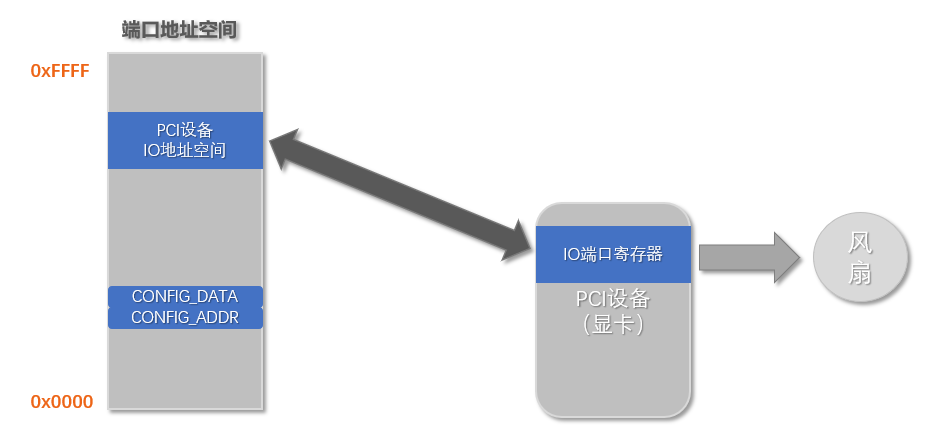
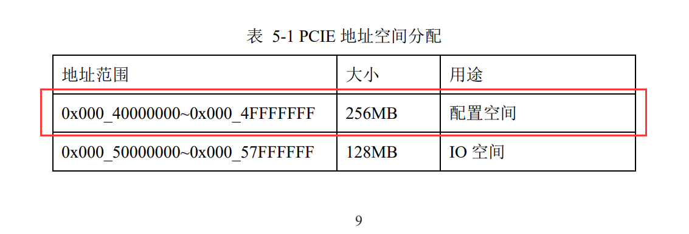

# SylixOS PCIe开发

> 本文章致力于对PCI相关知识做一个普及。
>
> 另外推荐一个PCIe讲解的不错的系列博客：http://blog.chinaaet.com/justlxy/p/5100061871

## SylixOS PCIe开发(一)

### x86处理器系统初步认识

#### x86主板布局

PCI是Peripheral Component Interconnect(外设部件互连标准)的缩写，本文介绍的是x86处理器系统下PCI相关知识。首先来看一张x86主板图：


如上图所示，靠近CPU的是北桥芯片(North Bridge)，北桥芯片中集成了内存控制器、PCI控制器等，主要负责和高速设备通信，如内存、显卡等。在北桥芯片附近的是南桥芯片(South Bridge)，主要负责和一些低速外设之间的通信。从图中还可以看出，内存插槽和PCI插槽都是靠近北桥芯片的，目的就是减少这些插槽到北桥芯片之间的布线长度，从而降低北桥芯片和这些设备的通信延迟。

#### 芯片组系统框架


如上图所示，intel 82915P是一款典型的北桥芯片，intel ICH6x是南桥芯片，这两款芯片加在一起被称为i915P芯片组。从中看出，某个芯片组其实就是以北桥芯片的型号来命名的。从图中可以了解到以下信息：

- CPU和北桥之间通过前端总线FSB通信
- 北桥负责和显卡、内存设备通信
- 南桥负责和低速外设通信，如USB设备、硬盘等
- 南桥不能直接和CPU通信，必须经过DMI和北桥通信，然后统一由北桥和CPU通信

上图的这种的CPU、北桥、南桥架构是10几年前的经典架构，目前北桥的大部分功能已经被整合进处理器中，如内存控制器和PCIe控制器。在intel某些型号的处理器中，南桥也被整合进处理器中，从而主板上只剩下处理器一颗芯片，更类似于ARM处理器系统中的架构。

### x86的几个地址空间

#### CPU地址空间

CPU地址空间是指CPU所能寻址的空间大小，比如对于32位CPU来说，其所能寻址的空间大小为0~4G。这是由CPU自身的地址总线数目决定的。这段空间也被称作CPU物理地址空间。

#### 内存地址空间

内存地址空间就是指内存控制器所能寻址的空间大小。在x86处理器系统中，内存地址空间是CPU地址空间的一部分。但是在32位x86系统中，并不是所有的内存地址空间都能被系统使用，如下图：


如图所示，左侧0~4G为CPU所能寻址的地址空间，红框内的空间是能被CPU识别的内存地址空间。右侧为内存控制器所能寻址的空间大小为4GB，但是只有一部分空间能被CPU所识别。这就是为什么4GB内存在32位x86系统只能被识别为3G多的原因，因为剩下的CPU地址空间被其他设备占用了，比如PCI设备、Local APIC或者IO APIC等，这些CPU地址空间对应的是这些设备的寄存器区域。

#### 设备的内存映射空间

注意，这里的设备内存映射空间是指硬件机制上实现的设备寄存器访问方式映射，而不是指MMU中虚拟地址到物理地址的映射。在上图中，我们可以得知，CPU通过CPU地址空间中的内存地址空间能访问内存设备，大概的访问流程如下：


CPU发送相关信号给北桥，告知其要访问内存，然后北桥通过内存控制器来访问内存设备。在汇编指令级别，这是通过MOV指令实现的，比如MOV eax,[mem addr]，就能触发北桥通过内存控制器访问内存。这是CPU访问内存设备的情况，那么CPU如果要访问别的设备呢，比如要访问PCI设备，这是如何实现的？

从第2小节的图中可以看出，在CPU地址空间中有一段空间叫做PCI Memory Range，这段空间也叫做PCI设备寄存器映射区。CPU通过访问这段空间，从而达到访问PCI设备的目的。由于这种方式同样是通过MOV指令实现的，故这种方式被称为内存映射访问，意思就是CPU能通过像访问内存那样的方式来访问这些设备。注意，CPU访问CPU地址空间上的设备都是通过MOV指令来实现的。CPU访问PCI设备的大概流程如下：


CPU发送相关信号给北桥，告知其要访问PCI设备，然后北桥通过PCI控制器来访问PCI设备中的寄存器。

#### 端口地址空间

端口地址访问是x86处理器系统中另外一种访问设备的方式，不同于CPU地址空间，端口地址空间只有64KB大小，为0~65535，这是因为访问端口时必须将端口地址放入dx寄存器，dx寄存器是16位的，故端口地址空间只有64KB大小。如下图：


端口其实就是设备中的寄存器，只不过访问这些寄存器并不是通过MOV指令来访问，而是通过IN/OUT指令来访问。比如在北桥中有一个端口，其地址为0xCF8，访问这个端口流程如下：


#### x86处理器系统中设备驱动编写注意

在PPC和ARM处理器系统中，外设的寄存器都是被映射到CPU地址空间上的，所以访问这些外设寄存器通过readl、writel等系统接口就可以，因为readl、writel这些系统接口最终都会被翻译为MOV指令。但是在x86处理器系统中，还存在着通过端口地址空间访问设备的情况，如果一个设备的寄存器是通过端口地址来访问的，那么就需要用in8、out8等这些系统接口，因为这些系统接口最终会被翻译为IN/OUT指令。所以在为x86处理器系统下的设备编写驱动时，一定要搞清楚设备的寄存器是通过CPU地址空间来访问的还是通过端口地址来访问的。比如显卡设备，有的寄存器是通过CPU地址空间来访问的，有的寄存器是通过端口地址来访问的，这时候访问这些不同方式的寄存器就需要使用不同的系统接口。

### PCI的基础知识

#### PCI总线组成结构


在x86处理器系统中，每一个PCI设备在系统中的ID都是唯一的，PCI设备的ID由Bus Number、Device Number、Function Number、Register Number组成。

- Bus Number：标明PCI设备是在哪条PCI总线上，有几个PCI桥设备就有几条PCI总线
- Device Number：标明在同一PCI总线下的哪个PCI设备
- Function Number：一个PCI设备最多可以有8个逻辑功能，但是大多数PCI设备只有一个功能
- Register Number：标明PCI设备配置空间寄存器号

#### HOST主桥

HOST主桥是一个很特殊的桥片，其主要功能是隔离处理器系统的CPU地址空间和PCI地址空间。PCI设备具有独立的地址空间，即PCI总线地址空间，该空间与CPU地址空间通过HOST主桥隔离。处理器需要通过HOST主桥才能访问PCI设备，而PCI设备需要通过HOST主桥才能访问CPU地址空间。在x86处理器系统中，HOST主桥在北桥中。

#### PCI地址空间

PCI地址空间就是能被HOST主桥识别的PCI地址范围，如果HOST主桥能识别32位PCI地址，那么PCI地址空间就为0~4G。注意，虽然这个PCI地址空间大小和CPU地址空间一样，但是PCI地址空间和CPU地址空间是两种东西！

下图所示的是PCI设备的引脚图，如图所示，PCI设备的数据引脚和地址引脚是复用的，有32位和64位两种。


#### PCI总线事务

总线的基本任务是实现数据传送，PCI总线使用**地址译码**的方式进行**数据传递**，而使用**ID译码**方式进行**配置信息的传递**。其中地址译码方式使用PCI设备的地址信号，而ID译码方式使用PCI设备的ID号，包括Bus Number、Device Number、Function Number、Register Number。ID译码方式只在对PCI设备的配置空间读写的时候才会用到，也就是说，**对PCI设备的配置空间读写并不会用到PCI设备的地址线信号**。

### PCI设备的配置空间

#### 基本介绍

其实PCI设备的配置空间就是配置PCI设备的那些寄存器集合。PCI通常将PCI配置信息存放在E2PROM中，PCI设备上电初始化时，将E2PROM中的信息读到PCI设备的配置空间中作为初始值。这个过程由硬件逻辑完成，绝大多数PCI设备使用这种方式初始化其配置空间。系统加电时，BIOS检测PCI总线，确定所有连接在PCI总线上的设备以及它们的配置要求，并进行系统配置。所以，所有的PCI设备必须实现配置空间，从而能够实现参数的自动配置。

PCI总线规范定义的配置空间总长度为256个字节，配置信息按一定的顺序和大小依次存放。前64个字节的配置空间称为配置头，对于所有的设备都一样，配置头的主要功能是用来识别设备、定义主机访问PCI卡的方式（I/O访问或者存储器访问，还有中断信息）。其余的192个字节称为本地配置空间，主要定义卡上局部总线的特性、本地空间基地址及范围等。

一般我们需要关心配置空间中配置头的信息。

#### 配置空间中配置头信息

配置头寄存器信息如下：


- Device ID和Vendor ID寄存器，这两个寄存器的值由PCISIG分配，只读。其中Vendor ID代表PCI设备的生产厂商，而Device ID代表这个厂商所生产的具体设备。如intel公司的基于82571EB芯片的系列网卡，其Vendor ID为0x8086，而Device ID为0x105E。
- Revision ID和Class Code寄存器，这两个寄存器只读。其中Revision ID寄存器记载PCI设备的版本号，该寄存器可以被认为是Device ID寄存器的扩展。而Class Code寄存器记载PCI设备的分类。
- Header Type寄存器，改寄存器只读，第7位表示当前设备是多功能还是单功能设备。第0~6位表示当前配置空间的类型，系统软件使用该寄存器区分不同类型的PCI配置空间。如普通PCI设备、PCI桥、CardBUS设备。
- Subsystem ID和Subsystem Vendor ID寄存器，这两个寄存器和Device ID及Vendor ID类似，也是记录PCI设备的生产厂商和设备名称。
- Expansion ROM base address寄存器，有些PCI设备在处理器还没有运行操作系统之前，就需要完成基本的初始化设置，比如显卡、键盘和硬盘等设备。为了实现这个“预先执行”功能，PCI设备需要提供一段ROM程序，而处理器在初始化过程中将运行这段ROM程序，初始化这些PCI设备。Expansion ROM base address记载这段ROM程序的基地址。
- Interrupt Line寄存器，这个寄存器是系统软件对PCI设备进行配置时写入的，该寄存器记录当前PCI设备使用的中断向量号，设备驱动可以通过这个寄存器，判断当前PCI设备使用处理器系统中哪个中断向量号，并将驱动程序的中断服务例程注册到操作系统中。不过目前在绝大多数处理器系统中，并没有使用该寄存器存放PCI设备使用的中断向量号。
- Interrupt Pin寄存器，这个寄存器保存PCI设备使用的中断引脚。为1时表示使用INTA#引脚作为中断引脚，2时表示使用INTB#引脚作为中断引脚，依次类推。
- Base Address Register0~5寄存器，该组寄存器简称为BAR寄存器，BAR寄存器保存PCI设备使用的地址空间的基地址，注意，该基地址是指PCI设备的PCI总线地址，并不是在CPU地址空间中的地址。其中每一个设备最多可以有6个基地址空间，但多数设备不会使用这么多组地址空间。

在PCI设备复位之后，BAR寄存器存放PCI设备需要使用的基址空间大小，着段空间可以是IO空间，也可以是存储器空间。系统软件对PCI总线进行配置时，首先获得BAR寄存器中的初始化信息，之后根据处理器系统的配置，将合理的基地址写入相应的BAR寄存器中。系统软件还可以使用该寄存器，获得PCI设备使用的BAR空间的长度，其方法是向BAR寄存器写入0xFFFF-FFFF，之后再读取该寄存器。

处理器访问PCI设备的BAR空间时，需要使用BAR寄存器提供的基地址。值得注意的是，处理器使用的是CPU地址空间的地址，而BAR寄存器存放的是PCI总线地址。因此处理器系统需要将PCI总线地址转换为CPU地址空间的地址。在许多处理器系统中，如Alpha和PowerPC处理器系统，PCI总线地址与CPU地址空间地址并不相等。但是在x86系统中，这两个地址的值是一样的，也就是它们之间的关系是一一映射的。但是，即使这两个地址的值是一样的，也需要明白这两个地址是不同地址空间中的地址。同时这个CPU地址空间的地址表示的是物理地址，需要使用ioremap这类接口映射为虚拟地址后，才能被驱动或内核使用。

### PCI设备的几个空间资源概念

#### 配置空间

如第（四）小节所述，每个PCI设备都有而且是必须要有一个配置空间，操作系统通过设备的配置空间获取PCI设备的基本信息，如设备的厂商ID和设备ID，以及通过BAR寄存器组获得BAR空间信息。那么CPU是如何访问一个PCI设备的配置空间的呢？

在x86处理器的北桥中，有两个端口寄存器，分别为CONFIG_ADDRESS和CONFIG_DATA寄存器，其地址为0xCF8和0xCFC。x86处理器使用这两个IO端口来访问PCI设备的配置空间。PCI总线规范也以这两个寄存器为例，说明处理器如何访问PCI设备的配置空间。其中CONFIG_ADDRESS寄存器存放PCI设备的ID号，而CONFIG_DATA寄存器存放进行配置读写的数据。

CONFIG_ADDRESS寄存器的结构如下图所示：


- Enable位，第31位。该位为1时，对CONFIG_DATA寄存器进行读写时将引发PCI总线的配置周期。
- Bus Number，第23~16位，为PCI设备的总线号。
- Device Number，第15~11位，为PCI设备的设备号。
- Function Number，第10~8位，为PCI设备的功能号。通过此位也能知道为什么一个PCI设备最多有8个逻辑功能了，因为Function Number位只有3位，所以最多有8个功能
- Register Number，第7~2位，为PCI设备配置空间的寄存器号。

当x86处理器对CONFIG_DATA寄存器进行IO读写访问（也就是通过IN/OUT指令访问此端口地址），且CONFIG_ADDR寄存器的Enable位为1时，HOST主桥将这个IO读写访问转换为PCI配置读写总线事务，然后发送到PCI总线上，PCI总线根据保存在CONFIG_ADDR寄存器中的ID号，将PCI配置读写请求发送到指定PCI设备的指定配置空间寄存器中。如下图所示：


那么系统是怎么知道PCI设备的总线号等这些号的呢，在x86系统下，系统上电时，BIOS会根据某种算法遍历本处理器系统中的所有的PCI设备，从而就得知了每个PCI设备的总线号等。而SylixOS启动时会直接使用BIOS遍历的结果，目前并不会再次对设备进行遍历。

#### **PCI设备的存储器地址空间（又叫做Memory空间资源）**

PCI设备的存储器地址空间是指PCI地址空间映射在CPU地址空间中的一段地址范围，这段地址范围可能是一个PCI设备的相关控制寄存器集合（注意，这里的寄存器和配置空间中的寄存器是两种不同的寄存器，比如显卡中进行2D和3D渲染的寄存器），或者是PCI设备的存储空间，如显存。在x86处理器系统中，PCI设备的存储器地址空间是被一一映射到CPU地址空间的，这样CPU就能像访问内存那样使用MOV指令访问PCI设备的控制寄存器和存储空间了，如下图所示：


下面这张图从地址空间分布角度反映了这种情况：


#### PCI设备的IO地址空间（IO资源）

PCI设备的IO地址空间是指PCI设备中映射到x86处理器端口地址空间中的寄存器集合。访问这些寄存器需要使用IN/OUT指令。如下图所示：


这些IO寄存器控制的是PCI设备上的一些外设，如显卡上的风扇，如下图：



## SylixOS PCIe开发(二)

### 概述

本篇文章主要介绍不同平台下pci设备配置空间的访问方法，总的来说，pci设备的配置空间有两种访问方式：

- 配置寄存器访问
- ECAM访问

#### 配置空间寄存器


pci配置空间寄存器大小为256字节，从0x0~0xff。pcie配置空间大小为4KB，从0x0~0xfff。但是对于一般的设备驱动而言，需要关心的也就是0x0~0x3f这64字节大小的配置空间。

- 0x0~0x3f：这部分的配置空间是标准的PCI配置空间头，是每个PCI/PCIE设备都必须遵循的。目前一共有3种标准头格式，00是PCI DEVICE头，01是PCI-PCI bridge头，02是Cardbus bridge头。头类型由Header Type寄存器定义。
- 0x40~0xff：这部分定义PCI扩展功能寄存器。0-3F定义的寄存器是每个PCI设备都必须实现的，而PCI的一些扩展功能，不是每个设备都必须实现的，可以根据自己的需要来实现其中一部分特性。重点注意的是这部分寄存器的组织结构，每一个可选的特性被组织成一个标准的Capability Struct，设备选用的多个Capabilities用链表的方式组织起来，称为Capabilities List。PCIE即在PCI原有的Capabilities当中新增了一种ID，即PCIE Capability Struct。这样可以实现对老的PCI驱动的兼容。
- 0x100~0xfff：这部分定义PCIE扩展功能寄存器。实现PCIE的可选特性，也是采取Capabilities List结构组织起来的。

### x86平台配置空间访问方式

#### IO方式访问（配置寄存器方式）

在x86处理器的北桥中，有两个端口寄存器，分别为CONFIG_ADDRESS和CONFIG_DATA寄存器，其地址为0xCF8和0xCFC。x86处理器使用这两个IO端口来访问PCI设备的配置空间。PCI总线规范也以这两个寄存器为例，说明处理器如何访问PCI设备的配置空间。其中CONFIG_ADDRESS寄存器存放PCI设备的ID号，而CONFIG_DATA寄存器存放进行配置读写的数据。

CONFIG_ADDRESS寄存器的结构如下图所示：


- Enable位，第31位。该位为1时，对CONFIG_DATA寄存器进行读写时将引发PCI总线的配置周期。
- Bus Number，第23~16位，为PCI设备的总线号。
- Device Number，第15~11位，为PCI设备的设备号。
- Function Number，第10~8位，为PCI设备的功能号。通过此位也能知道为什么一个PCI设备最多有8个逻辑功能了，因为Function Number位只有3位，所以最多有8个功能
- Register Number，第7~2位，为PCI设备配置空间的寄存器号。

由上述信息可知，x86平台通过I/O方式只能访问0x0~0xff这256字节的配置空间，并不能访问pcie的0x100~0xfff这段扩展配置空间。

#### ECAM方式访问

ECAM全称为Enhanced Configuration Access Mechanism，意思为增强的配置访问方式，其实就是MMIO方式访问。在某个平台上要想通过ECAM方式访问配置空间，大致需要经过以下几个步骤的设置：

- 通过平台相关的寄存器来设置ECAM方式访问的配置空间在存储器域的基地址和总大小
- 根据bus、dev、func、reg这四个参数来确定要访问的存储器域地址
- 通过要访问的字节数来确定调用何种接口进行访问，比如单字节、双字节还是四字节。

通过ECAM方式可以访问pci/pcie全部的配置空间，由于规范中规定每个pci/pcie的功能都需要独立的配置空间，所以所有的pci/pcie设备占用的ECAM空间大小为256(总线数)*32(设备数)*8(功能数)*4KB(pcie配置空间大小)=256MB。在实际的嵌入式系统中，一般不会用到这么多的pci/pcie设备，所以ECAM的空间一般情况下不会设置为256MB，典型设置值为十几MB。

在SylixOS下，x86平台的pci/pcie设备是通过I/O方式来访问配置空间的。

### ppc平台配置空间访问方式

ppc平台一般通过配置寄存器的方式来访问pci/pcie设备的配置空间，通过PEXn_PEX_CONFIG_ADDR和PEXn_PEX_CONFIG_DATA这两个寄存器来访问配置空间。其中n表示不同的控制器，ppc平台和其他平台不一样的地方就是ppc平台有多个pcie控制器，而其他平台一般只有1个。

下图为ppc平台的PEXn_PEX_CONFIG_ADDR寄存器的定义：


各个位域的意义如下：


可以看出，ppc平台通过配置寄存器方式可以访问pcie的全部4KB配置空间，而x86通过配置寄存器方式只能访问256B的空间。由于通过配置寄存器的方式已经能访问所有总线上的设备的全部配置空间了，所以ppc也就不需要再额外提供ECAM方式来访问配置空间。

### 龙芯平台配置空间访问

龙芯平台配置空间是通过ECAM方式访问，每个设备配置寄存器对应的访问地址相对于ECAM基址的偏移通过下图方式计算：


由上图可以看出，ECAM方式可以访问pcie的全部4KB配置空间。

不同于其他平台的是，龙芯上的ECAM基址有两个，一个是用于访问TYPE0设备的配置空间，一个是用于访问TYPE1设备的配置空间。

### 飞腾平台配置空间访问

飞腾平台pci设备的配置空间是通过ECAM方式访问，每个设备的配置寄存器访问地址相对于ECAM基址的偏移计算方法如下：


可以看出，飞腾平台的ECAM方式同样可以访问pcie全部的4KB配置空间。

### **ARM平台配置空间访问方式**

ARM平台也是通过ECAM方式来访问pci/pcie设备的配置空间的，每个pci/pcie设备配置寄存器的访问地址相对于ECAM基址的偏移的计算方式如下：


图中有一个错误，就是设备号的位域其实应该是[19:15]，而不是图中的[19:12]。从图中可以看出，ARM下的ECAM方式同样可以访问pcie设备的全部4KB配置空间。

### 总结

| 平台 | 配置寄存器方式 | ECAM方式 | 访问每个设备配置空间大小           |
| ---- | -------------- | -------- | ---------------------------------- |
| x86  | 支持           | 支持     | 配置寄存器方式：256B ECAM方式：4KB |
| ppc  | 支持           | 支持     | 4KB                                |
| 龙芯 |                | 支持     | 4KB                                |
| 飞腾 |                | 支持     | 4KB                                |
| ARM  |                | 支持     | 4KB                                |

##  SylixOS PCIe开发(三)

### **SylixOS主控驱动支持多个控制器**

SylixOS中的pci框架目前只支持单个控制器，如果需要在主控驱动中支持多个控制器，就需要将多个控制器虚拟成一个控制器给SylixOS。

在vx下用户的pci设备驱动中，经常会调用到vxbPciConfigInWord类似的接口来读写设备的配置空间，先来看看这个函数的原型：

```
IMPORT STATUS vxbPciConfigInWord

    (

    VXB_DEVICE_ID busCtrlID,

    int busNo,      /* bus number */

    int deviceNo,   /* device number */

    int funcNo,     /* function number */

    int offset,     /* offset into the configuration space */

    UINT16 * pData  /* data read from the offset */

    );
```

可以看出，vx这个接口的第一个参数表示的是要操作哪个控制器，也就是vx的pci驱动是支持多个控制器的，在SylixOS下，我们可以找到类似的如下接口：

```
INT  API_PciConfigInWord (INT iBus, INT iSlot, INT iFunc, INT iOft, UINT16 *pusValue);
```

可以看出的是SylixOS下此接口的第一个参数是总线号，而不是控制器的ID，如果不做处理直接调用这个接口，主控驱动是不知道调用者到底想使用哪个控制器的，那么有什么办法能让主控驱动知道调用者想使用的是哪个控制器呢？

答案就是从第一个参数总线号入手，规范中虽然规定了pci可以有256个总线，但是实际应用中不会使用到全部的总线号，那么我们就可以将总线号做划分，通过不同的总线号来确定要操作的控制器。在这种方式下，我们可以将总线号称作为虚拟总线号。比如某个平台有3个控制器，那么我们可以做如下的划分：

- 总线号0~9上的设备是控制器1的
- 总线号10~19上的设备是控制器2的
- 总线号20~29上的设备是控制器3的

那么如果我们想操作控制器2上总线3上的设备的话，那么调用 API_PciConfigInWord时传入的虚拟总线号应该是10+3=13，在主控驱动中需要通过虚拟总线号来确定要操作哪个控制器，然后再减去其对应的虚拟总线号起始值得到真正要操作的总线号，最后进行访问。

### ECAM方式访问配置空间崩溃问题

在ARM平台和龙芯2k1000平台上，当通过ECAM方式访问没有实际设备的配置空间时会产生内存访问错误或者bus error错误，这是由于平台特性决定的，这时需要在bsp中重新实现bspCpuExcHook函数，大致的内容就是判断当前崩溃的地址是否在ECAM空间内，如果在，那么做一些平台相关处理后返回1，否则返回0.

### pci设备驱动从vx下移植到SylixOS下注意点

- 客户的驱动中访问pci bar空间的寄存器可能会直接定义一个指针变量，然后操作这个指针变量来读写寄存器，比如：

```
int *reg = xxxx;
*reg =  2;
```

这种代码在使用gcc编译器编译时可能会被优化，解决方法就是在指针变量前加上volatile修饰，如下：

```
volatile int *reg = xxxx;
*reg = 2;
```

通过volatile修饰符来告诉编译器禁止优化reg这个变量。

- 客户驱动中可能会使用如下方式来实现延时：

```
int i;
for(i=0;i<2000;i++)
```

这种代码同样可能会被gcc编译器优化掉，目前的解决方法是使用usleep之类的接口延时确定的时间。不过我觉得i变量是不是同样可以用volatile来修饰来禁止编译器优化，这个得修改用户代码再确认。

## SylixOS PCIe开发(四)

### **动态映射ECAM空间**

我们在《SylixOS PCIe开发(二)》文章中介绍了使用ECAM方式来访问PCI设备的配置空间，这种方式的缺点就是如果想访问所有总线上的设备，一共需要256MB的地址空间，在实际使用中，并不是每个总线上都存在设备，如果按256MB空间来分配的话会造成很大一部分空间的浪费。下面介绍的动态映射ECAM空间的方法就可以解决这个问题，从而达到即能访问各个设备的配置空间又能节省空间的目的。

首先我们来学习ATU寄存器组，ATU（Address Translation Unit）用于建立cpu物理地址和pci地址之间的映射关系，包括两大寄存器组，outbound和inbound寄存器组。outbound寄存器用在rc模式，Inbound寄存器用在ep模式，这里我们只关注rc模式。

用于建立映射要设置的寄存器大致有4种，这里讲解的是简化的版本，具体的寄存器意义参见各个SOC的芯片手册。这4种寄存器如下：

| 寄存器         | 意义                                   |
| -------------- | -------------------------------------- |
| 类型寄存器     | 要映射的类型，比如io,mem，参考pcie协议 |
| 基址寄存器     | cpu物理地址                            |
| 目标地址寄存器 | pci地址                                |
| 大小           | 映射的区域大小                         |

类型除了io和mem之外，还有cfg0,cfg1用来表示访问设备的配置空间。

当需要动态映射ECAM空间时，表中的cpu物理地址和映射区域大小都是初始化的时候确定的，而且映射区域的大小4KB即可，为什么呢？因为一个BDF所对应的配置空间大小就是4KB，所以映射4KB就能访问一个BDF的全部配置空间了。当访问不同的BDF时，需要根据BDF组合成具体的pci地址，然后填到目标地址寄存器中，这个组合规则不同的芯片不一样，具体参见芯片手册。最后根据当前设备和主桥的关系来决定是发起cfg0还是cfg1访问。

## SylixOS注册PCIe控制器驱动

PCIe驱动主要分为两大类，PCIe控制器驱动和PCIe设备驱动。PCIe控制器驱动主要负责配置空间读写方法的实现、中断号获取和BAR地址自动配置功能，设备驱动根据PCIe设备的功能不同而不同，简单的可能就是个普通的字符设备驱动，复杂的可能就是网卡、存储设备驱动等等。

在SylixOS中，使用内核PCI相关接口时需要在源文件抬头加上***__SYLIXOS_KERNEL\*** 和 ***__SYLIXOS_PCI_DRV\*** 这两个宏。

```
#define __SYLIXOS_KERNEL
#define __SYLIXOS_PCI_DRV
#include <SylixOS.h>
```

根据驱动不同的需要可能还需要包含内核PCI相关的头文件。

```
#define __SYLIXOS_KERNEL
#define __SYLIXOS_PCI_DRV
#include <SylixOS.h>
#include <system/device/pci/pciBus.h>
#include <system/device/pci/pciMsi.h>
#include <system/device/pci/pciLib.h>
```

在SylixOS中，使用 ***PCI_CTRL_CB\*** 这个数据结构来表示一个PCIe控制器。

```
typedef struct {
    LW_LIST_LINE            PCI_lineDevNode;                            /* 设备管理节点                 */
    INT                     PCI_iIndex;                                 /* 控制器索引(当前支持单控制器) */
    INT                     PCI_iBusMax;
    LW_SPINLOCK_DEFINE     (PCI_slLock);                                /* 底层操作自旋锁               */

    union {
        PCI_DRV_FUNCS0     *PCIF_pDrvFuncs0;
        PCI_DRV_FUNCS12    *PCIF_pDrvFuncs12;
    } f;
#define PCI_pDrvFuncs0      f.PCIF_pDrvFuncs0
#define PCI_pDrvFuncs12     f.PCIF_pDrvFuncs12
    
#define PCI_MECHANISM_0     0
#define PCI_MECHANISM_1     1
#define PCI_MECHANISM_2     2
    UINT8                   PCI_ucMechanism;
    
    /*
     * 下面地址仅适用于 PCI_MECHANISM_1 与 PCI_MECHANISM_2
     */
    addr_t                  PCI_ulConfigAddr;
    addr_t                  PCI_ulConfigData;
    addr_t                  PCI_ulConfigBase;                           /* only for PCI_MECHANISM_2     */

    PCI_AUTO_CB             PCI_tAutoConfig;                            /* 用于自动配置                 */

    PVOID                   PCI_pvPriv;                                 /* 私有数据                     */
} PCI_CTRL_CB;
typedef PCI_CTRL_CB        *PCI_CTRL_HANDLE;
```

> 注意：目前SylixOS内核只支持单控制器，也就是控制器驱动只能注册一个***PCI_CTRL_CB\*** 数据结构，和VxWorks、Linux这类支持多控制器的系统是不一样的。

一般在驱动中定义一个全局变量来表示主控制器。

```
static PCI_CTRL_CB pci_host;
```

驱动初始化好***PCI_CTRL_CB\*** 数据结构后，使用***API_PciCtrlCreate\*** 这个接口来注册控制器驱动，这个接口函数原型为：

```
PCI_CTRL_HANDLE  API_PciCtrlCreate(PCI_CTRL_HANDLE hCtrl);
```

驱动注册后，会遍历所有总线上的设备信息，这些设备信息可以通过使用***pcis\*** 和 ***lspci\*** 命令来查看，关于这两个命令的使用会在后面PCIe设备驱动开发章节中详细介绍。

**附pci_host_driver_demo1.c源码：**

```
#define __SYLIXOS_KERNEL
#define __SYLIXOS_PCI_DRV
#include <SylixOS.h>
#include <module.h>
#include <system/device/pci/pciBus.h>
#include <system/device/pci/pciMsi.h>
#include <system/device/pci/pciLib.h>

static PCI_CTRL_CB pci_host;

int pci_host_probe (void)
{
    API_PciCtrlCreate(&pci_host);

    return 0;
}

int module_init (void)
{
    pci_host_probe();

    return 0;
}

void module_exit (void)
{
}
```

## SylixOS读写PCIe设备配置空间

在上一节中，我们知道注册控制器驱动后，SylixOS会遍历所有总线上的设备信息，这是通过读取设备的配置空间信息实现的。SylixOS中配置空间的读写都是通过调用***PCI_DRV_FUNCS0\*** 或者***PCI_DRV_FUNCS12\*** 数据结构中的回调函数实现的。***PCI_DRV_FUNCS12\*** 这个是x86平台使用的，所以我们这里只关注 ***PCI_DRV_FUNCS0\*** 这个数据结构。

```
typedef struct pci_drv_funcs0 {
    INT     (*cfgRead)(INT iBus, INT iSlot, INT iFunc, INT iOft, INT iLen, PVOID pvRet);
    INT     (*cfgWrite)(INT iBus, INT iSlot, INT iFunc, INT iOft, INT iLen, UINT32 uiData);
    INT     (*vpdRead)(INT iBus, INT iSlot, INT iFunc, INT iPos, UINT8 *pucBuf, INT iLen);
    INT     (*irqGet)(INT iBus, INT iSlot, INT iFunc, INT iMsiEn, INT iLine, INT iPin, PVOID pvIrq);
    INT     (*cfgSpcl)(INT iBus, UINT32 uiMsg);
} PCI_DRV_FUNCS0;
```

我们简单回顾下PCIe知识，按照PCIe标准，一个控制器下最多可以有256个总线，每个总线下最多有32个设备，每个设备最多有8个功能，每个功能都有一个配置空间，普通功能配置空间大小为256字节，复杂的可能需要4KB大小。配置空间可以进行单字节、双字节、4字节访问。

有了以上信息后我们以读函数接口为例看看读写接口如何实现。

```
static int pci_cfg_read (int bus, int dev, int func,
                         int offset, int len, void *data)
{
    return 0;
}
```

- bus：总线号。
- dev：设备号。
- func：功能号。
- offset：寄存器偏移。
- len：读取的字节数，可以为1、2、4。
- data：数据缓冲区。

每个入参的意义很好理解，不同平台需要根据这几个入参转换成平台相关的配置空间访问方法。比如对于飞腾2000/4平台来说，配置空间是通过普通的MMIO访问来实现的，配置空间MMIO起始地址为0x40000000，控制器驱动需要根据上述入参计算出配置空间寄存器对应的MMIO访问地址，然后通过普通的内存访问方法读写数据。



配置空间写接口和读接口类似，只是最后一个参数是上层传下来的具体要写的数值。

```
static int pci_cfg_write (int bus, int dev, int func,
                          int offset, int len, unsigned int data)
{
    return 0;
}
```

驱动同样需要根据入参转换成平台相关的配置空间写方法。

在实际的驱动中，一般定义一个全局变量，并使用上述的读写接口来初始化。

```
static PCI_DRV_FUNCS0  pci_driver_funcs = {
    .cfgRead  = pci_cfg_read,
    .cfgWrite = pci_cfg_write,
};
```

**附pci_host_driver_demo2.c源码：**

```
#define __SYLIXOS_KERNEL
#define __SYLIXOS_PCI_DRV
#include <SylixOS.h>
#include <module.h>
#include <system/device/pci/pciBus.h>
#include <system/device/pci/pciMsi.h>
#include <system/device/pci/pciLib.h>

static PCI_CTRL_CB pci_host;

static int pci_cfg_read (int bus, int dev, int func,
                         int offset, int len, void *data)
{
    return 0;
}

static int pci_cfg_write (int bus, int dev, int func,
                          int offset, int len, unsigned int data)
{
    return 0;
}

static PCI_DRV_FUNCS0  pci_driver_funcs = {
    .cfgRead  = pci_cfg_read,
    .cfgWrite = pci_cfg_write,
};

int pci_host_probe (void)
{
    API_PciCtrlCreate(&pci_host);

    return 0;
}

int module_init (void)
{
    pci_host_probe();

    return 0;
}

void module_exit (void)
{
}
```

## SylixOS申请PCIe设备中断

本来这篇文章是想和读写配置空间放一起讲的，但是梳理了下发现PCIe的中断方面的知识还是比较重要的，因为现在一般的PCIe设备都需要配合中断来进行工作，而PCIe中断又分为INTx中断和MSI中断，如果使用或者设置不当的话，很可能造成设备无法正常使用，所以把中断单独拿出来用一个章节讲解。

### PCIe中断简单回顾

我们首先来简单回顾下PCIe中断方面的知识，PCIe体系中的中断继承自PCI，分为INTx中断和MSI中断。INTx中断共有四种：INTA、INTB、INTC、INTD，大部分的设备都只使用了INTA作为中断引脚。为了平衡系统中所有设备中断请求负载，会将不同设备的INTx引脚相连到中断控制器的同一个IRQ引脚：


INTx中断是低电平有效，PCIe设备还可以使用MSI和MSI-X方式产生中断，MSI中断本质上就是PCIe设备向某个地址提交一个数据写请求，然后就会触发中断控制器处理这个中断并通知CPU来处理。配置空间中有一段寄存器就是给MSI中断使用的，共有4种格式，我们来看最基础的一种：


其中Message Control区域中有一个Bit位可以控制PCIe设备是否使能MSI中断机制，当使能MSI中断后，INTx中断机制自动失效。Message Address和Message Data具体设置为何值根据不同的平台而不同，比如对于zynq mpsoc平台，Message Address固定为0xFE440000，Message Data为MSI向量号：


### 申请INTx中断向量号

根据上述信息我们来看看驱动中申请中断的处理：

```
static int pci_vector_get (int bus, int dev, int func,
                           int msi_en, int line, int pin,
                           void *vector)
{
    return 0;
}
```

前三个入参很好理解，msi_en表示申请的是INTx还是MSI中断，line只在x86平台上有用，这里不需要关心，pin表示如果申请的是INTx中断向量号，PCIe设备使用的是哪个INT引脚，因为不同设备的INTx引脚可能使用不同的中断号，驱动中需要根据不同平台上的中断路由寻找INTx实际对应的中断向量号：

```
static int pci_vector_get (int bus, int dev, int func,
                           int msi_en, int line, int pin,
                           void *vector)
{
    if (!msi_en) {
        /*
         *  根据不同平台上的中断路由寻找INTx引脚实际对应的中断向量号
         */
        switch (pin) {
        case 1:
            break;

        case 2:
            break;

        case 3:
            break;

        case 4:
            break;

        default:
            return -1;
        }
    }

    return 0;
}
```

中断号最终就通过最后出参vector返回给调用者。在一个实际的嵌入式系统中，INTx引脚对应的实际中断号可能只有一个，也就是INTA~INTD公用一个中断号，如mpsoc平台：


也可能INTA~INTD各对应一个中断号，比如飞腾2000/4平台：


### 申请MSI中断向量号

当msi_en为true时，表示上层驱动想申请MSI中断向量号，这时最后一个出参就表示***PCI_MSI_DESC*** 类型的数据结构指针，驱动中需要设置这个数据结构来返回正确的信息，我们来看下这个数据结构：

```
typedef struct {
    UINT32      uiAddressLo;                                            /* low 32 bits of address       */
    UINT32      uiAddressHi;                                            /* high 32 bits of address      */
    UINT32      uiData;                                                 /* 16 bits of msi message data  */
} PCI_MSI_MSG;

typedef struct {
    UINT32          PCIMSI_uiNum;
    ULONG           PCIMSI_ulDevIrqVector;
    PCI_MSI_MSG     PCIMSI_pmmMsg;

    UINT32          PCIMSI_uiMasked;
    UINT32          PCIMSI_uiMaskPos;

    PVOID           PCIMSI_pvPriv;
} PCI_MSI_DESC;
typedef PCI_MSI_DESC       *PCI_MSI_DESC_HANDLE;
```

这里介绍其中几个比较重要的成员。

- PCIMSI_uiNum：表示设备驱动想申请多少个向量号，根据标准，MSI支持32个中断向量号，MSI-X支持更多。一般控制器驱动会根据这个值来设置PCIe相关的寄存器来使能MSI向量号对应的中断。
- PCIMSI_ulDevIrqVector：MSI和MSI-X中的向量号只是从0开始的数值，其需要对应实际平台上中断控制器上的中断号，PCIMSI_ulDevIrqVector就是申请成功时，起始的MSI向量号对应的中断号，这个成员需要控制器来设置。
- PCIMSI_pmmMsg：根据我们之前回顾的中断知识可知，这是PCIe设备触发MSI中断的方法，根据不同的平台而不同，需要控制器驱动来进行设置。

在mpsoc平台上，MSI向量号支持0~63共64个，对应的实际中断号为两个，0~31MSI向量号的中断号为146，32~63MSI向量号的中断号为147：


假设在mpsoc平台上申请MSI向量号0，设置应该如下所示：

```
static int pci_vector_get (int bus, int dev, int func,
                           int msi_en, int line, int pin,
                           void *vector)
{    
    PCI_MSI_DESC *msi_desc;

    if (msi_en) {
        msi_desc = (PCI_MSI_DESC *)vector;

        msi_desc->PCIMSI_pmmMsg.uiAddressHi = 0;
        msi_desc->PCIMSI_pmmMsg.uiAddressLo = 0xFE440000;
        msi_desc->PCIMSI_pmmMsg.uiData      = 0 & 0x1f;
        msi_desc->PCIMSI_ulDevIrqVector     = 146;
    } 
    return 0;
}
```

INTx和MSI中断申请都处理完之后，用***pci_vector_get*** 来初始化***pci_driver_funcs*** 变量即可：

```
static PCI_DRV_FUNCS0  pci_driver_funcs = {
    .cfgRead  = pci_cfg_read,
    .cfgWrite = pci_cfg_write,
    .irqGet   = pci_vector_get,
};
```

**附pci_host_driver_demo3.c源码：**

```
#define __SYLIXOS_KERNEL
#define __SYLIXOS_PCI_DRV
#include <SylixOS.h>
#include <module.h>
#include <system/device/pci/pciBus.h>
#include <system/device/pci/pciMsi.h>
#include <system/device/pci/pciLib.h>

static PCI_CTRL_CB pci_host;

static int pci_cfg_read (int bus, int dev, int func,
                         int offset, int len, void *data)
{
    return 0;
}

static int pci_cfg_write (int bus, int dev, int func,
                          int offset, int len, unsigned int data)
{
    return 0;
}

static int pci_vector_get (int bus, int dev, int func,
                           int msi_en, int line, int pin,
                           void *vector)
{
    PCI_MSI_DESC *msi_desc;

    if (msi_en) {
        msi_desc = (PCI_MSI_DESC *)vector;

       /*
        *  根据不同平台进行设置，这里以mpsoc平台为例
        *  msi_desc->PCIMSI_pmmMsg.uiAddressHi = 0;
        *  msi_desc->PCIMSI_pmmMsg.uiAddressLo = 0xFE440000;
        *  msi_desc->PCIMSI_pmmMsg.uiData      = 0 & 0x1f;
        *  msi_desc->PCIMSI_ulDevIrqVector     = 146;
        */
    } else {
        /*
         *  根据不同平台上的中断路由寻找INTx实际对应的中断向量号
         */
        switch (pin) {
        case 1:
            break;

        case 2:
            break;

        case 3:
            break;

        case 4:
            break;

        default:
            return -1;
        }
    }

    return 0;
}

static PCI_DRV_FUNCS0  pci_driver_funcs = {
    .cfgRead  = pci_cfg_read,
    .cfgWrite = pci_cfg_write,
    .irqGet   = pci_vector_get,
};

int pci_host_probe (void)
{
    API_PciCtrlCreate(&pci_host);

    return 0;
}

int module_init (void)
{
    pci_host_probe();

    return 0;
}

void module_exit (void)
{
}
```

## SylixOS初始化PCI控制器数据结构

通过前面的几篇文章我们初始化好了***PCI_DRV_FUNCS0*** 中的读写和中断申请这三个回调函数，现在我们要将这个操作集初始化给PCI控制器数据结构：

```
pci_host.PCI_iIndex       = 0;
pci_host.PCI_iBusMax      = PCI_MAX_BUS;
pci_host.PCI_pDrvFuncs0   = &pci_driver_funcs;
pci_host.PCI_ucMechanism  = PCI_MECHANISM_0;
pci_host.PCI_pvPriv       = LW_NULL;
```

- PCI_iIndex：SylixOS目前只支持单控制器，所以这个成员只能为0。
- PCI_iBusMax：最大总线个数，一般都为256。
- PCI_pDrvFuncs0：控制器操作函数集，使用之前初始化的全局变量来设置这个成员。
- PCI_ucMechanism：除了x86平台外，这个成员一般都为0。
- PCI_pvPriv：控制器驱动私有数据，根据实际需要设置。

初始化完***pci_host\*** 之后，调用***API_PciCtrlCreate\*** 注册控制器驱动，SylixOS会遍历各总线上的设备，但是并不会重新设置设备的BAR空间，因为一般Bootloader都会枚举设备并分配BAR空间地址，SylixOS可以直接读出来BAR地址使用即可，如何在SylixOS下重新配置BAR空间在下一章节讲解。

**附pci_host_driver_demo4.c源码：**

```
#define __SYLIXOS_KERNEL
#define __SYLIXOS_PCI_DRV
#include <SylixOS.h>
#include <module.h>
#include <system/device/pci/pciBus.h>
#include <system/device/pci/pciMsi.h>
#include <system/device/pci/pciLib.h>

static PCI_CTRL_CB pci_host;

static int pci_cfg_read (int bus, int dev, int func,
                         int offset, int len, void *data)
{
    return 0;
}

static int pci_cfg_write (int bus, int dev, int func,
                          int offset, int len, unsigned int data)
{
    return 0;
}

static int pci_vector_get (int bus, int dev, int func,
                           int msi_en, int line, int pin,
                           void *vector)
{
    PCI_MSI_DESC *msi_desc;

    if (msi_en) {
        msi_desc = (PCI_MSI_DESC *)vector;

       /*
        *  根据不同平台进行设置，这里以mpsoc平台为例
        *  msi_desc->PCIMSI_pmmMsg.uiAddressHi = 0;
        *  msi_desc->PCIMSI_pmmMsg.uiAddressLo = 0xFE440000;
        *  msi_desc->PCIMSI_pmmMsg.uiData      = 0 & 0x1f;
        *  msi_desc->PCIMSI_ulDevIrqVector     = 146;
        */
    } else {
        /*
         *  根据不同平台上的中断路由寻找INTx实际对应的中断向量号
         */
        switch (pin) {
        case 1:
            break;

        case 2:
            break;

        case 3:
            break;

        case 4:
            break;

        default:
            return -1;
        }
    }

    return 0;
}

static PCI_DRV_FUNCS0  pci_driver_funcs = {
    .cfgRead  = pci_cfg_read,
    .cfgWrite = pci_cfg_write,
    .irqGet   = pci_vector_get,
};

int pci_host_probe (void)
{
    pci_host.PCI_iIndex       = 0;
    pci_host.PCI_iBusMax      = PCI_MAX_BUS;
    pci_host.PCI_pDrvFuncs0   = &pci_driver_funcs;
    pci_host.PCI_ucMechanism  = PCI_MECHANISM_0;
    pci_host.PCI_pvPriv       = LW_NULL;

    API_PciCtrlCreate(&pci_host);

    return 0;
}

int module_init (void)
{
    pci_host_probe();

    return 0;
}

void module_exit (void)
{
}
```

## SylixOS PCIe控制器驱动使用自动配置功能

### 地址空间简单回顾

自动配置主要就是配置各个设备BAR空间的PCIe地址，所以我们简单回顾下PCIe地址和CPU物理地址的概念。

PCIe控制器和PCIe设备之间通信都是使用的PCIe地址，PCIe地址分为32位和64位，32位只能使用4GB地址空间，64位可以使用超过4GB地址空间。PCIe设备配置空间中BAR寄存器中记录的就是PCIe空间地址，这个地址是Bootloader或者操作系统在启动的过程中分配的。

BAR寄存器中记录的地址其实就是PCIe设备寄存器的基地址，设置好这个基地址后，CPU这时还不能直接去访问，因为CPU访问所使用的是物理地址，而PCIe体系中都是通过PCIe地址来访问的，所以还需要设置PCIe控制器中的地址翻译单元(ATU)，将CPU的物理地址和PCIe设备使用的PCIe地址建立映射。大部分情况下，Bootloader或者操作系统都会为这两种地址建立一一映射的关系，所以从数值上来看，这两种地址的值是一样的。在不同的平台中，在CPU的物理地址域中专门有一段空间是留给PCIe控制器建立映射使用的，比如飞腾2000/4平台：


PCIe体系中，地址空间分为三种：配置空间用于访问设备的配置空间寄存器；IO和MEM空间用于访问设备的寄存器。其中IO空间只是为了兼容以前老的PCI设备而保留的，现在大部分PCIe设备都通过MEM方式访问寄存器。

### Uboot下查看映射关系

一般情况下，PCIe控制器的电源、时钟、地址映射关系等初始化Bootloader都会做好，x86下是BIOS来做的，龙芯下是PMON来做的，飞腾下是Uboot下来做的，设备的枚举和BAR地址分配Bootloader也会做好。

大部分情况下，SylixOS为了简化控制器驱动工作是不再做上述这些工作的，但是在某些情况下可能需要SylixOS重新分配设备的BAR地址，这时就需要使能控制器驱动中的自动配置功能，使用自动配置之前，我们需要知道Bootloader对CPU地址和PCIe地址的映射关系，这个一般只能通过阅读Bootloader源码来了解，但是如果系统使用了Uboot来引导，并且使能了Uboot中PCI相关命令后，可以通过***pci region*** 这个命令来查看UBoot中建立的映射关系：


其中MEM空间根据PCIe标准可以分为支持预取和不支持预取两种，图中的Bus就是指PCIe地址，Phys就是指CPU物理地址。我们可以看出mem和mem prefetch两段空间是一一映射的，IO空间的PCIe地址是从0开始的，其对应的CPU物理地址是从0x50000000开始的，总共15MB。

### SylixOS使用自动配置

SylixOS下通过***PCI_AUTO_CB*** 这个数据结构来记录自动配置的信息，通过初始化这个成员我们就可以使能自动配置功能：

```
PCI_AUTO_HANDLE pci_auto_cfg;
pci_auto_cfg = &pci_host.PCI_tAutoConfig;
pci_auto_cfg->PCIAUTO_iConfigEn        = LW_TRUE;
pci_auto_cfg->PCIAUTO_iHostBridegCfgEn = LW_TRUE;
pci_auto_cfg->PCIAUTO_uiFirstBusNo     = 0;
pci_auto_cfg->PCIAUTO_uiLastBusNo      = PCI_MAX_BUS - 1;
pci_auto_cfg->PCIAUTO_uiCurrentBusNo   = 0;
pci_auto_cfg->PCIAUTO_ucCacheLineSize  = PCI_AUTO_CACHE_LINE_SIZE;
pci_auto_cfg->PCIAUTO_ucLatencyTimer   = PCI_AUTO_LATENCY_TIMER;
pci_auto_cfg->PCIAUTO_pfuncDevFixup    = LW_NULL;
pci_auto_cfg->PCIAUTO_pfuncDevIrqFixup = LW_NULL;
pci_auto_cfg->PCIAUTO_pvPriv           = LW_NULL;
```

- PCIAUTO_iConfigEn：是否使能自动配置功能。
- PCIAUTO_iHostBridegCfgEn：是否使能主桥自动配置功能。
- PCIAUTO_uiFirstBusNo：使用自动配置的起始总线号，一般为0。
- PCIAUTO_uiLastBusNo：使用自动配置的最后一个总线号，一般为255。
- PCIAUTO_uiCurrentBusNo：当前总线号，一般为0。
- PCIAUTO_ucCacheLineSize：PCIe高速缓冲大小，一般设置为PCI_AUTO_CACHE_LINE_SIZE。
- PCIAUTO_ucLatencyTimer：时间相关参数，一般设置为PCI_AUTO_LATENCY_TIMER。
- PCIAUTO_pfuncDevFixup：修正回调函数，一般为NULL。
- PCIAUTO_pfuncDevIrqFixup：中断修正回调函数，一般为NULL。
- PCIAUTO_pvPriv：私有数据，根据实际需要设置。

通过上面的初始化我们使能了自动配置的功能，除此之外，我们还需要告诉系统各个PCIe空间起始地址和大小，以让系统自动配置时为各个设备的BAR空间分配地址。在SylixOS下，这是通过***API_PciAutoCtrlRegionSet*** 接口来实现的，这个接口的函数原型如下：

```
LW_API INT API_PciAutoCtrlRegionSet(PCI_CTRL_HANDLE hCtrl,
                                    UINT            uiIndex,
                                    pci_bus_addr_t  addrBusStart,
                                    pci_addr_t      addrPhyStart,
                                    pci_size_t      stSize,
                                    ULONG           ulFlags);
```

- hCtrl：PCIe控制器数据结构。
- uiIndex：各段PCIe地址空间的索引号。
- addrBusStart：PCIe地址起始值。
- addrPhyStart：PCIe地址对应的CPU物理地址值，这个成员目前在SylixOS下没有使用。
- stSize：PCIe空间大小。
- ulFlags：PCIe空间属性，比如时IO还是MEM空间，支持不支持预取等。

> 注意：目前SylxiOS不支持处理MEM空间PCIe地址和CPU物理地址不一一映射的情况，PCIe设备驱动通过系统接口只能拿到BAR空间的PCIe地址，如果不是一一映射，访问时还需要手动将PCIe地址转换成物理地址以进行访问。

以飞腾2000/4平台来说，通过Uboot下查看映射关系，我们就可以在SylixOS下如下设置IO空间，**PCI_AUTO_REGION_IO** 宏标明设置的是IO空间：

```
#define PCI_IO_REGION_BASE      (0x0)
#define PCI_IO_SIZE             (15 * LW_CFG_MB_SIZE)


API_PciAutoCtrlRegionSet(&pci_host, PCI_AUTO_REGION_INDEX_0,
                         PCI_IO_REGION_BASE, PCI_IO_REGION_BASE, PCI_IO_SIZE,
                         PCI_AUTO_REGION_IO);
```

同样，不支持预取功能的MEM空间设置如下，**PCI_AUTO_REGION_MEM**宏标明设置的是非预取MEM空间：

```
#define PCI_MEM_NONPRE_BASE     (0x0000000058000000)
#define PCI_NONPRE_SIZE         (640 * LW_CFG_MB_SIZE)

API_PciAutoCtrlRegionSet(&pci_host, PCI_AUTO_REGION_INDEX_1,
                         PCI_MEM_NONPRE_BASE, PCI_MEM_NONPRE_BASE, PCI_NONPRE_SIZE,
                         PCI_AUTO_REGION_MEM);
```

如果需要设置预取MEM空间，则标志上还需加上**PCI_AUTO_REGION_PREFETCH**这个宏，如下所示：

```
#define PCI_MEM_PRE_BASE        (0x0000000100000000)
#define PCI_PRE_SIZE            (64 * LW_CFG_GB_SIZE)

API_PciAutoCtrlRegionSet(&pci_host, PCI_AUTO_REGION_INDEX_2,
                         PCI_MEM_PRE_BASE, PCI_MEM_PRE_BASE, PCI_PRE_SIZE,
                         PCI_AUTO_REGION_MEM | PCI_AUTO_REGION_PREFETCH);
```

最后将要自动配置的空间个数赋值给***PCIAUTO_uiRegionCount\***这个成员：

```
pci_auto_cfg->PCIAUTO_uiRegionCount = 3;
```

另外，针对IO空间我们还需要额外做一些设置，因为我们知道IO空间现在是非一一映射的，我们需要在驱动中定义个全局变量**__IO_BASE__，**并将IO空间的起始物理地址经过MMU映射后的虚拟地址赋值给这个变量：

```
ioaddr_t __IO_BASE__ = (ioaddr_t)0x50000000ul;
```

一般在SylixOS启动过程中可以将IO空间的物理地址和虚拟地址一一映射，这样就可以直接将物理地址值赋值给**__IO_BASE**__变量了**。**

如果PCIe设备使用IO空间对寄存器访问，那么在设备驱动中，我们就必须使用**in8、out8**这类接口来访问IO空间：

```
#define in8(a)              read8(__IO_BASE__ + a)
#define in16(a)             read16(__IO_BASE__ + a)
#define in32(a)             read32(__IO_BASE__ + a)
#define in64(a)             read64(__IO_BASE__ + a)

#define out8(d, a)          write8(d, __IO_BASE__ + a)
#define out16(d, a)         write16(d, __IO_BASE__ + a)
#define out32(d, a)         write32(d, __IO_BASE__ + a)
#define out64(d, a)         write64(d, __IO_BASE__ + a)
```

至此，我们就完成了自动配置的相关设置。

**附pci_host_driver_demo5.c源码：**

```
#define __SYLIXOS_KERNEL
#define __SYLIXOS_PCI_DRV
#include <SylixOS.h>
#include <module.h>
#include <system/device/pci/pciBus.h>
#include <system/device/pci/pciMsi.h>
#include <system/device/pci/pciLib.h>

#define PCI_CFG_BASE            (0x0000000040000000)
#define PCI_IO_REGION_BASE      (0x0)
#define PCI_MEM_NONPRE_BASE     (0x0000000058000000)
#define PCI_MEM_PRE_BASE        (0x0000000100000000)

#define PCI_CFG_SIZE            (256 * LW_CFG_MB_SIZE)
#define PCI_IO_SIZE             (15 * LW_CFG_MB_SIZE)
#define PCI_NONPRE_SIZE         (640 * LW_CFG_MB_SIZE)
#define PCI_PRE_SIZE            (64 * LW_CFG_GB_SIZE)

ioaddr_t __IO_BASE__ = (ioaddr_t)0x50000000ul;

static PCI_CTRL_CB pci_host;

static int pci_cfg_read (int bus, int dev, int func,
                         int offset, int line, void *data)
{
    return 0;
}

static int pci_cfg_write (int bus, int dev, int func,
                          int offset, int line, unsigned int data)
{
    return 0;
}

static int pci_vector_get (int bus, int dev, int func,
                           int msi_en, int line, int pin,
                           void *vector)
{
    PCI_MSI_DESC *msi_desc;

    if (msi_en) {
        msi_desc = (PCI_MSI_DESC *)vector;

       /*
        *  根据不同平台进行设置，这里以mpsoc平台为例
        *  msi_desc->PCIMSI_pmmMsg.uiAddressHi = 0;
        *  msi_desc->PCIMSI_pmmMsg.uiAddressLo = 0xFE440000;
        *  msi_desc->PCIMSI_pmmMsg.uiData      = 0 & 0x1f;
        *  msi_desc->PCIMSI_ulDevIrqVector     = 146;
        */
    } else {
        /*
         *  根据不同平台上的中断路由寻找INTx实际对应的中断向量号
         */
        switch (pin) {
        case 1:
            break;

        case 2:
            break;

        case 3:
            break;

        case 4:
            break;

        default:
            return -1;
        }
    }

    return 0;
}

static PCI_DRV_FUNCS0  pci_driver_funcs = {
    .cfgRead  = pci_cfg_read,
    .cfgWrite = pci_cfg_write,
    .irqGet   = pci_vector_get,
};

int pci_host_probe (void)
{
    pci_host.PCI_iIndex       = 0;
    pci_host.PCI_iBusMax      = PCI_MAX_BUS;
    pci_host.PCI_pDrvFuncs0   = &pci_driver_funcs;
    pci_host.PCI_ucMechanism  = PCI_MECHANISM_0;
    pci_host.PCI_pvPriv       = LW_NULL;

    PCI_AUTO_HANDLE pci_auto_cfg;
    pci_auto_cfg = &pci_host.PCI_tAutoConfig;
    pci_auto_cfg->PCIAUTO_iConfigEn        = LW_TRUE;
    pci_auto_cfg->PCIAUTO_iHostBridegCfgEn = LW_TRUE;
    pci_auto_cfg->PCIAUTO_uiFirstBusNo     = 0;
    pci_auto_cfg->PCIAUTO_uiLastBusNo      = PCI_MAX_BUS - 1;
    pci_auto_cfg->PCIAUTO_uiCurrentBusNo   = 0;
    pci_auto_cfg->PCIAUTO_ucCacheLineSize  = PCI_AUTO_CACHE_LINE_SIZE;
    pci_auto_cfg->PCIAUTO_ucLatencyTimer   = PCI_AUTO_LATENCY_TIMER;
    pci_auto_cfg->PCIAUTO_pfuncDevFixup    = LW_NULL;
    pci_auto_cfg->PCIAUTO_pfuncDevIrqFixup = LW_NULL;
    pci_auto_cfg->PCIAUTO_pvPriv           = LW_NULL;

    API_PciAutoCtrlRegionSet(&pci_host, PCI_AUTO_REGION_INDEX_0,
                             PCI_IO_REGION_BASE, PCI_IO_REGION_BASE, PCI_IO_SIZE,
                             PCI_AUTO_REGION_IO);
    API_PciAutoCtrlRegionSet(&pci_host, PCI_AUTO_REGION_INDEX_1,
                             PCI_MEM_NONPRE_BASE, PCI_MEM_NONPRE_BASE, PCI_NONPRE_SIZE,
                             PCI_AUTO_REGION_MEM);
    API_PciAutoCtrlRegionSet(&pci_host, PCI_AUTO_REGION_INDEX_2,
                             PCI_MEM_PRE_BASE, PCI_MEM_PRE_BASE, PCI_PRE_SIZE,
                             PCI_AUTO_REGION_MEM | PCI_AUTO_REGION_PREFETCH);
    pci_auto_cfg->PCIAUTO_uiRegionCount = 3;

    API_PciCtrlCreate(&pci_host);

    return 0;
}

int module_init (void)
{
    pci_host_probe();

    return 0;
}

void module_exit (void)
{
}
```

## SylixOS PCI相关shell命令使用

SylixOS下可以使用一些命令来查看PCI设备的信息，具体使用方法请看下面介绍。

### pcis命令

***pcis*** 命令是SylixOS内核自带的shell命令，这个命令可以列出当前系统扫描到的所有PCI设备的信息：


上图是在飞腾2000/4平台下看到的信息，我们以网卡为例进行具体的讲解。

- Bus 13 Slot 0 Function 0表示设备所在的位置，PCIe体系中，BDF三个值可以确定一个唯一的设备功能。
- VendorID 10ec DevieceID 8168表示设备的厂商ID和设备ID，厂商ID是需要向PCIe组织去申请的，全球唯一，设备ID由厂商自己定义。
- Class 2 [Network controller] Sub 0 [Ethernet controller]表示设备的类型，比如网卡、显卡、SATA存储设备等等。
- IRQ Line-255 Pin-1，这里我们只关心Pin-1，表示设备的INTx中断使用INTA引脚。
- Base0 00004001 Base1 00000000 Base2 5a400004
  Base3 00000000 Base4 5a404004 Base5 00000000

这个就是设备6个BAR寄存器中的值，如果为0表示这个BAR没有被设备使用。需要注意的是，BAR寄存器的bit0~bit3是表示这个BAR的属性的：


属性主要就是BAR空间类型，使用的地址是32位还是64位，支不支持预取。注意如果BAR是64位的，需要使用两个BAR寄存器组成一个64位的地址。

- Region 0: I/O ports at 4000 [Size 256] [flags 00040101]
  Region 2: Memory at 5a400000 [Size 4] [flags 00140204] (64-bit non-pre)
  Region 4: Memory at 5a404000 [Size 16] [flags 00140204] (64-bit non-pre)

这个就是系统处理后的信息，我们可以很清除的看到每个BAR被分配到的PCIe地址和大小，如果是MEM空间，还可以看出使用的地址位数和支不支持预取属性。

- Irq start 3c end 3c [flags 00000400]，这个就是设备实际使用的INTX中断号，0x3c十进制就是60，在飞腾2000/4平台，60中断号就是INTA的中断。注意，这个数值仅代表设备使用的INTx中断号，如果设备使用的MSI中断，中断号就不是这个值了。

### lspci命令

***lspci*** 命令是一个单独的可执行程序，并非SylixOS自带的shell命令，要想使用这个命令需要将base组件中的***pciutils*** 组件勾选上进行编译然后上传到板子上：


这个工具是移植的开源软件，Linux下也可以使用这个命令，一般在调试的时候可以和Linux下的信息做对比以排除问题。

#### lspci

直接执行***lspci\*** 命令可以列出当前系统内扫描的所有PCI设备：


通过这个可以快速的查看系统的PCI设备和其所在的总线位置。

#### lspci -vvv

当需要更详细地查看某个设备的信息时，可以使用***lspci -vvv*** 这个命令：


这里我们还是以网卡为例进行讲解一般我们需要关注的几个重要信息：

- Control: I/O+ Mem+ BusMaster+，这三个标志是设备配置空间中COMMAND寄存器中三个bit位的状态，+表示使能，-表示关闭，只有对应的空间使能后，我们才能访问设备的IO或者MEM空间寄存器。一般Bootloader扫描阶段会根据设备支持的空间类型设置COMMAND寄存器使能相应的空间，但是有的Bootloader就不会使能，所以在驱动中需要手动进行使能，Linux下的pci_device_enable就是设置这几个bit位，SylixOS下可以通过直接读写配置空间寄存器进行类似操作。
- Capabilities: [50] MSI: Enable+ Count=1/1 Maskable- 64bit+
  Address: 0000000029930040 Data: 0000

这个属性很明显的表示设备的MSI中断使能了没，以及使用的Message地址是多少位的。

- LnkCap: Port #0, Speed 2.5GT/s, Width x1, ASPM L0s L1, Exit Latency L0s unlimited, L1 <64us
  ClockPM+ Surprise- LLActRep- BwNot- ASPMOptComp+

这个可以看出设备支持的最高速度以及通道数。

- LnkSta: Speed 2.5GT/s (ok), Width x1 (ok)
  TrErr- Train- SlotClk+ DLActive- BWMgmt- ABWMgmt-

这个可以看出设备当前工作的速度以及通道数，上面的LnkCap表示设备最高支持的属性，但是实际设备可以工作在低速低通道模式。

- Capabilities: [b0] MSI-X: Enable- Count=4 Masked-
  Vector table: BAR=4 offset=00000000
  PBA: BAR=4 offset=00000800

这个也很明显的看出是表示MSI-X中断是否使能，-就表示当前设备不使用MSI-X中断。

#### lspci -xxx

有时候设备在SylixOS下工作异常的时候，我们需要对比SylixOS下设备的配置空间和Linux下设备正常工作时配置空间的信息，这就可以使用***lspci -xxx*** 命令来实现：


3个x表示查看配置空间前256字节的内容，一般设备也只用到这么多，如果设备使用到扩展配置空间也就是4KB的话，使用4个x也就是***lspci -xxxx*** 就可以查看4KB的配置空间信息。

#### pcidev和pcidrv

有时候我们需要查看当前系统PCI设备和PCI设备驱动之间的关系，可以使用***pcidev*** 命令来查看：


在DRVNAME一栏我们可以看出某个设备使用了哪个设备驱动，*表示该设备没有驱动。

使用***pcidrv*** 类似的可以查看当前系统注册了哪些PCI设备驱动，以及有多少设备使用了同一个驱动：


## SylixOS PCIe设备驱动注册和卸载

在SylixOS中，使用***PCI_DRV_CB*** 数据结构来表示一个PCIe设备驱动：

```
typedef struct {
    LW_LIST_LINE            PCIDRV_lineDrvNode;                         /* 驱动节点管理                 */
    CHAR                    PCIDRV_cDrvName[PCI_DRV_NAME_MAX];          /* 驱动名称                     */
    PVOID                   PCIDRV_pvPriv;                              /* 私有数据                     */
    PCI_DEV_ID_HANDLE       PCIDRV_hDrvIdTable;                         /* 设备支持列表                 */
    UINT32                  PCIDRV_uiDrvIdTableSize;                    /* 设备支持列表大小             */

    /*
     *  驱动常用函数, PCIDRV_pfuncDevProbe 与 PCIDRV_pfuncDevRemove 不能为 LW_NULL, 其它可选
     */
    INT   (*PCIDRV_pfuncDevProbe)(PCI_DEV_HANDLE hHandle, const PCI_DEV_ID_HANDLE hIdEntry);
    VOID  (*PCIDRV_pfuncDevRemove)(PCI_DEV_HANDLE hHandle);
    INT   (*PCIDRV_pfuncDevSuspend)(PCI_DEV_HANDLE hHandle, PCI_PM_MESSAGE_HANDLE hPmMsg);
    INT   (*PCIDRV_pfuncDevSuspendLate)(PCI_DEV_HANDLE hHandle, PCI_PM_MESSAGE_HANDLE hPmMsg);
    INT   (*PCIDRV_pfuncDevResumeEarly)(PCI_DEV_HANDLE hHandle);
    INT   (*PCIDRV_pfuncDevResume)(PCI_DEV_HANDLE hHandle);
    VOID  (*PCIDRV_pfuncDevShutdown)(PCI_DEV_HANDLE hHandle);

    PCI_ERROR_HANDLE        PCIDRV_hDrvErrHandler;                      /* 错误处理句柄                 */

    INT                     PCIDRV_iDrvFlag;                            /* 驱动标志                     */
    UINT32                  PCIDRV_uiDrvDevNum;                         /* 关联设备数                   */
    LW_LIST_LINE_HEADER     PCIDRV_plineDrvDevHeader;                   /* 设备管理链表头               */
} PCI_DRV_CB;
typedef PCI_DRV_CB         *PCI_DRV_HANDLE;
```

我们这里关注一下几个重要的成员：

- PCIDRV_cDrvName：驱动名字，这个必须是系统所有PCIe驱动中唯一的，这个名字同时也是使用***picdev\*** 和***pcidrv\*** 命令时显示出的名字。
- PCIDRV_hDrvIdTable：驱动支持的设备ID列表，驱动和设备通过此表进行匹配，这个会在后续章节详解。
- PCIDRV_uiDrvIdTableSize：设备ID表中条目个数。
- PCIDRV_pfuncDevProbe：驱动注册回调函数，注册时会调用此接口进行设备初始化的工作，需要驱动开发者实现。
- PCIDRV_pfuncDevRemove：驱动卸载回调函数，卸载时会调用此接口进行资源回收工作，需要驱动开发者实现。

 

一般在驱动中定义一个全局变量来表示：

```
static PCI_DRV_CB pci_driver;
```

然后初始化其驱动名字成员：

```
#define PCI_DRV_NAME "pci_demo_drv"

strlcpy(pci_driver.PCIDRV_cDrvName, PCI_DRV_NAME, PCI_DRV_NAME_MAX);
```

通过***API_PciDrvRegister*** 这个接口来注册PCIe设备驱动，这个接口的原型为：

```
INT API_PciDrvRegister(PCI_DRV_HANDLE hHandle);
```

初始化好***pci_driver\*** 之后，将其地址传入上述函数即可注册驱动：

```
API_PciDrvRegister(&pci_driver);
```

驱动卸载需要经过两步操作，首先需要通过驱动名字找到内核使用的驱动控制块，因为在驱动注册时内核会生成一个自己的驱动控制块，然后将驱动中我们自己定义的pci_driver数据结构中所有信息复制过去。卸载时需要使用内核自己生成的驱动控制块而不是我们自己定义的。通过***API_PciDrvHandleGet*** 接口我们可以获得内核的驱动控制块：

```
PCI_DRV_HANDLE pci_driver;

pci_driver = API_PciDrvHandleGet(PCI_DRV_NAME);
```

然后使用***API_PciDrvUnregister*** 接口即可卸载驱动：

```
API_PciDrvUnregister(pci_driver);
```

**附pci_driver_demo1.c源码：**

```
#define  __SYLIXOS_KERNEL
#define  __SYLIXOS_PCI_DRV
#include <SylixOS.h>
#include <module.h>
#include <string.h>
#include <stdio.h>
#include <stdlib.h>
#include <linux/compat.h>
#include <system/device/pci/pciBus.h>
#include <system/device/pci/pciMsi.h>
#include <system/device/pci/pciLib.h>
#include <system/device/pci/pciIds.h>
#include <system/device/pci/pciDev.h>

#define PCI_DRV_NAME    "pci_demo_drv"

static PCI_DRV_CB pci_driver;

int module_init (void)
{
    strlcpy(pci_driver.PCIDRV_cDrvName, PCI_DRV_NAME, PCI_DRV_NAME_MAX);
    API_PciDrvRegister(&pci_driver);

    return 0;
}

void module_exit (void)
{
    PCI_DRV_HANDLE pci_driver;

    pci_driver = API_PciDrvHandleGet(PCI_DRV_NAME);
    API_PciDrvUnregister(pci_driver);
}
```

## SylixOS PCIe设备ID匹配

我们知道声卡有声卡的驱动，网卡有网卡的驱动，那么我们在加载声卡驱动的时候，系统是怎么知道当前的驱动是给声卡这个设备用的而不是给网卡用的呢？这就是通过驱动中定义的设备ID表来识别的。

驱动中的设备表用来标明本驱动支持哪些PCIe设备，在加载驱动的时候，会将系统中所有的PCIe设备和驱动中的ID表进行匹配，如果匹配上了则调用驱动中的probe初始化函数。在SylixOS下使用***PCI_DEV_ID_CB*** 这个数据结构来表示设备ID信息：

```
typedef struct {
    UINT32                  PCIDEVID_uiVendor;                          /* 厂商 ID                      */
    UINT32                  PCIDEVID_uiDevice;                          /* 设备 ID                      */

    UINT32                  PCIDEVID_uiSubVendor;                       /* 子厂商 ID                    */
    UINT32                  PCIDEVID_uiSubDevice;                       /* 子设备 ID                    */

    UINT32                  PCIDEVID_uiClass;                           /* 设备类                       */
    UINT32                  PCIDEVID_uiClassMask;                       /* 设备子类                     */

    ULONG                   PCIDEVID_ulData;                            /* 设备私有数据                 */
} PCI_DEV_ID_CB;
typedef PCI_DEV_ID_CB      *PCI_DEV_ID_HANDLE;
```

一般的PCIe设备通过厂商ID和设备ID来匹配驱动，所以在驱动中需要将这两个成员设置在表中。我们以x86模拟器中的PCIe设备进行讲解:


通过***pcis*** 我们可以查看到系统中有一个显卡设备，厂商ID为0x1013，设备ID为0xb8，现在我们想为其写驱动，那么我们就需要驱动中定义一个设备表，然后将这个显卡的厂商ID和设备ID设置在表中:

```
static PCI_DEV_ID_CB  pci_devices[] = {
    {PCI_DEVICE(0x1013, 0x00b8)},
    {}
};
```

这样驱动加载时只有符合这两个ID条件的设备才会使用本驱动，设备ID表设置完之后还需要将其地址设置到pci_driver中：

```
static PCI_DRV_CB pci_driver = {
    .PCIDRV_hDrvIdTable      = (PCI_DEV_ID_HANDLE)pci_devices,
    .PCIDRV_uiDrvIdTableSize = sizeof(pci_devices) / sizeof(PCI_DEV_ID_CB),
};
```

PCIDRV_uiDrvIdTableSize表示设备ID表中有几个设备，在实际的驱动中，有可能一个厂商有N个设备都可以使用同一个驱动，但是这些设备的ID是不一样的，所以需要在表中设置多个设备：


**附pci_driver_demo2.c源码：**

```
#define  __SYLIXOS_KERNEL
#define  __SYLIXOS_PCI_DRV
#include <SylixOS.h>
#include <module.h>
#include <string.h>
#include <stdio.h>
#include <stdlib.h>
#include <linux/compat.h>
#include <system/device/pci/pciBus.h>
#include <system/device/pci/pciMsi.h>
#include <system/device/pci/pciLib.h>
#include <system/device/pci/pciIds.h>
#include <system/device/pci/pciDev.h>

#define PCI_DRV_NAME    "pci_demo_drv"

static PCI_DEV_ID_CB  pci_devices[] = {
    {PCI_DEVICE(0x1013, 0x00b8)},
    {}
};

static PCI_DRV_CB pci_driver = {
    .PCIDRV_hDrvIdTable      = (PCI_DEV_ID_HANDLE)pci_devices,
    .PCIDRV_uiDrvIdTableSize = sizeof(pci_devices) / sizeof(PCI_DEV_ID_CB),
};

int module_init (void)
{
    strlcpy(pci_driver.PCIDRV_cDrvName, PCI_DRV_NAME, PCI_DRV_NAME_MAX);
    API_PciDrvRegister(&pci_driver);

    return 0;
}

void module_exit (void)
{
    PCI_DRV_HANDLE pci_driver;

    pci_driver = API_PciDrvHandleGet(PCI_DRV_NAME);
    API_PciDrvUnregister(pci_driver);
}
```

## SylixOS PCIe设备驱动注册和卸载入口

通过前面的介绍我们知道当驱动注册时，如果匹配通过会调用我们自己的probe初始化函数，同样在卸载时会调用我们自己的退出函数。我们先来看看我们自己的probe函数：

```
static int pci_driver_probe (PCI_DEV_HANDLE pci_dev, const PCI_DEV_ID_HANDLE id)
{
    return 0;
}
```

在SylixOS中，使用***PCI_DEV_CB*** 来表示一个PCIe设备，在系统启动过程中，会扫描系统中所有的PCIe设备并为每一个PCIe设备生成一个***PCI_DEV_CB*** 数据结构：

```
typedef struct {
    LW_LIST_LINE        PCIDEV_lineDevNode;                             /* 设备管理节点                 */
    LW_OBJECT_HANDLE    PCIDEV_hDevLock;                                /* 设备自身操作锁               */

    UINT32              PCIDEV_uiDevVersion;                            /* 设备版本                     */
    UINT32              PCIDEV_uiUnitNumber;                            /* 设备编号                     */
    CHAR                PCIDEV_cDevName[PCI_DEV_NAME_MAX];              /* 设备名称                     */

    INT                 PCIDEV_iDevBus;                                 /* 总线号                       */
    INT                 PCIDEV_iDevDevice;                              /* 设备号                       */
    INT                 PCIDEV_iDevFunction;                            /* 功能号                       */
    PCI_HDR             PCIDEV_phDevHdr;                                /* 设备头                       */

    /*
     *  PCI_HEADER_TYPE_NORMAL  PCI_HEADER_TYPE_BRIDGE  PCI_HEADER_TYPE_CARDBUS
     */
    INT                 PCIDEV_iType;                                   /* 设备类型                     */
    UINT8               PCIDEV_ucPin;                                   /* 中断引脚                     */
    UINT8               PCIDEV_ucLine;                                  /* 中断线                       */
    UINT32              PCIDEV_uiIrq;                                   /* 虚拟中断向量号               */

    UINT8               PCIDEV_ucRomBaseReg;
    UINT32              PCIDEV_uiResourceNum;
    PCI_RESOURCE_CB     PCIDEV_tResource[PCI_NUM_RESOURCES];            /* I/O and memory  + ROMs       */

    INT                 PCIDEV_iDevIrqMsiEn;                            /* 是否使能 MSI                 */
    ULONG               PCIDEV_ulDevIrqVector;                          /* MSI 或 INTx 中断向量         */
    UINT32              PCIDEV_uiDevIrqMsiNum;                          /* MSI 中断数量                 */
    PCI_MSI_DESC        PCIDEV_pmdDevIrqMsiDesc;                        /* MSI 中断描述                 */

    CHAR                PCIDEV_cDevIrqName[PCI_DEV_IRQ_NAME_MAX];       /* 中断名称                     */
    PINT_SVR_ROUTINE    PCIDEV_pfuncDevIrqHandle;                       /* 中断服务句柄                 */
    PVOID               PCIDEV_pvDevIrqArg;                             /* 中断服务参数                 */

    PVOID               PCIDEV_pvDevDriver;                             /* 驱动句柄                     */
    PVOID               PCIDEV_pvPrivate;                               /* 用户驱动使用                 */
} PCI_DEV_CB;
typedef PCI_DEV_CB     *PCI_DEV_HANDLE;
```

通过上述结构信息我们可以看出从这个数据结构中包含了很多信息，比如设备在总线上的位置、中断号、资源等等。通过资源成员我们可以获取设备各个BAR空间中的起始地址和大小，这个在下一章节详解。

probe函数的第二个入参表示当前设备的ID信息。类似probe函数，我们来看看自己定义的退出函数：

```
static void pci_driver_remove (PCI_DEV_HANDLE pci_dev)
{

}
```

这两个函数定义完之后，还需要将其设置到pri_driver中：

```
static PCI_DRV_CB pci_driver = {
    .PCIDRV_hDrvIdTable      = (PCI_DEV_ID_HANDLE)pci_devices,
    .PCIDRV_uiDrvIdTableSize = sizeof(pci_devices) / sizeof(PCI_DEV_ID_CB),
    .PCIDRV_pfuncDevProbe    = pci_driver_probe,
    .PCIDRV_pfuncDevRemove   = pci_driver_remove,
};
```

我们可以在probe和remove函数中加调试信息然后在模拟器中加载驱动观察输出效果：

```
static int pci_driver_probe (PCI_DEV_HANDLE pci_dev, const PCI_DEV_ID_HANDLE id)
{
    printk("probe: bus %d, dev %d, func %d.\r\n",
            pci_dev->PCIDEV_iDevBus,
            pci_dev->PCIDEV_iDevDevice,
            pci_dev->PCIDEV_iDevFunction);

    return 0;
}

static void pci_driver_remove (PCI_DEV_HANDLE pci_dev)
{
    printk("remove: bus %d, dev %d, func %d.\r\n",
            pci_dev->PCIDEV_iDevBus,
            pci_dev->PCIDEV_iDevDevice,
            pci_dev->PCIDEV_iDevFunction);
}
```

编译驱动上传x86模拟器然后加载驱动：

```
insmod /lib/modules/pci_driver_demo3.ko
```

可以在模拟器上看到probe函数中的打印：


使用pcidev和pcidrv可以查看到驱动的信息：


卸载驱动查看打印信息：

```
rmmod /lib/modules/pci_driver_demo3.ko
```

可以在模拟器上看到remove函数中的打印：


**附pci_driver_demo3.c源码：**

```
#define  __SYLIXOS_KERNEL
#define  __SYLIXOS_PCI_DRV
#include <SylixOS.h>
#include <module.h>
#include <string.h>
#include <stdio.h>
#include <stdlib.h>
#include <linux/compat.h>
#include <system/device/pci/pciBus.h>
#include <system/device/pci/pciMsi.h>
#include <system/device/pci/pciLib.h>
#include <system/device/pci/pciIds.h>
#include <system/device/pci/pciDev.h>

#define PCI_DRV_NAME    "pci_demo_drv"

static PCI_DEV_ID_CB  pci_devices[] = {
    {PCI_DEVICE(0x1013, 0x00b8)},
    {}
};

static int pci_driver_probe (PCI_DEV_HANDLE pci_dev, const PCI_DEV_ID_HANDLE id)
{
    printk("probe: bus %d, dev %d, func %d.\r\n",
            pci_dev->PCIDEV_iDevBus,
            pci_dev->PCIDEV_iDevDevice,
            pci_dev->PCIDEV_iDevFunction);

    return 0;
}

static void pci_driver_remove (PCI_DEV_HANDLE pci_dev)
{
    printk("remove: bus %d, dev %d, func %d.\r\n",
            pci_dev->PCIDEV_iDevBus,
            pci_dev->PCIDEV_iDevDevice,
            pci_dev->PCIDEV_iDevFunction);
}

static PCI_DRV_CB pci_driver = {
    .PCIDRV_hDrvIdTable      = (PCI_DEV_ID_HANDLE)pci_devices,
    .PCIDRV_uiDrvIdTableSize = sizeof(pci_devices) / sizeof(PCI_DEV_ID_CB),
    .PCIDRV_pfuncDevProbe    = pci_driver_probe,
    .PCIDRV_pfuncDevRemove   = pci_driver_remove,
};

int module_init (void)
{
    strlcpy(pci_driver.PCIDRV_cDrvName, PCI_DRV_NAME, PCI_DRV_NAME_MAX);
    API_PciDrvRegister(&pci_driver);

    return 0;
}

void module_exit (void)
{
    PCI_DRV_HANDLE pci_driver;

    pci_driver = API_PciDrvHandleGet(PCI_DRV_NAME);
    API_PciDrvUnregister(pci_driver);
}
```

## SylixOS PCIe设备驱动获取BAR空间信息

通过前面的学习我们知道了如何编写一个简单PCIe设备驱动的基本框架，但是我们还需要知道这个设备的寄存器基址，中断号等才能进一步编写驱动硬件的代码。我们知道PCIe设备寄存器可以在IO或者MEM空间中，那么如何让获得这两个空间的信息呢？

在SylixOS中，使用***PCI_RESOURCE_CB*** 数据结构表示PCIe设备的资源信息，像MEM、IO、中断号等都可以看作是设备的资源信息：

```
typedef struct {
    pci_resource_size_t     PCIRS_stStart;
    pci_resource_size_t     PCIRS_stEnd;
    PCHAR                   PCIRS_pcName;
    ULONG                   PCIRS_ulFlags;
    ULONG                   PCIRS_ulDesc;
} PCI_RESOURCE_CB;
typedef PCI_RESOURCE_CB    *PCI_RESOURCE_HANDLE;
```

我们来看看其中几个比较重要的成员：

- PCIRS_stStart：资源的起始值，对于MEM、IO空间而言，这就是其PCIe起始地址，而一般情况下，PCIe地址和CPU物理地址是一一映射的，所以可以认为这个值就是MEM和IO空间寄存器的物理基址。对于中断资源而言，这个值就是设备使用的INTx中断号。
- PCIRS_stEnd：资源的结尾值，对于MEM、IO空间而言，这个值减去上面的起始值就表示了寄存器区域的大小。对于中断而言，这个值和上面的值一样，表示设备INTx中断号。
- PCIRS_ulFlags：资源的属性标志。

在驱动中可以使用***API_PciDevResourceGet***接口来获得某一种类型资源的信息，我们来看下这个接口原型：

```
PCI_RESOURCE_HANDLE  API_PciDevResourceGet(PCI_DEV_HANDLE hDevHandle, UINT uiType, UINT uiNum);
```

- hDevHandle：SylixOS下PCIe设备数据结构指针。
- uiType：资源类型，比如PCI_IORESOURCE_MEM、PCI_IORESOURCE_IO、PCI_IORESOURCE_IRQ等。
- uiNum：资源索引，比如有的设备BAR空间有2个BAR都是MEM类型的，那么用uiNum来表示想要获取哪个MEM空间的资源。
- 这个接口如果成功则返回对应的资源信息。

假设我们想获取一个设备第一个MEM空间资源，则方法如下：

```
PCI_RESOURCE_HANDLE pci_resrc;

pci_resrc = API_PciDevResourceGet(pci_dev, PCI_IORESOURCE_MEM, 0);
```

获取了资源信息后，我们可以使用**PCI_RESOURCE_START**这个宏来取出资源中的起始值：

```
phys_addr_t reg_base;

reg_base = (phys_addr_t)(PCI_RESOURCE_START(pci_resrc));
```

对于MEM空间而言，这个值就是寄存器基址。同样的我们可以通过**PCI_RESOURCE_SIZE**宏来获得这段空间的大小：

```
size_t size;

size = (size_t)(PCI_RESOURCE_SIZE(pci_resrc));
```

我们现在拿到的只是寄存器区域的物理地址和大小，驱动要想操作必须再映射为虚拟地址进行访问，可以使用***API_PciDevIoRemap\***接口来映射寄存器空间：

```
void *vaddr;

vaddr = API_PciDevIoRemap((void *)reg_base, size);
```

MEM空间映射完之后，我们就可以使用read/write类接口来读写寄存器了，通过寄存器偏移地址就能访问某个寄存器：

```
使用readl/writel这类接口来访问设备MEM寄存器
int value = readl(vaddr + MME_REG_OFFSET);
writel(value, vaddr + MEM_REG_OFFSET);
```

驱动卸载时需要释放MEM空间映射的虚拟地址，这是通过***API_PciDevIoUnmap*** 接口来实现的:

```
API_PciDevIoUnmap(vaddr);
```

IO空间的使用方式和MEM空间类似，首先获取设备IO空间基址和大小等信息：

```
pci_resrc = API_PciDevResourceGet(pci_dev, PCI_IORESOURCE_IO, 0);
size = (size_t)(PCI_RESOURCE_SIZE(pci_resrc));
reg_base = (phys_addr_t)(PCI_RESOURCE_START(pci_resrc));
```

但是访问IO空间并不是使用read/write类接口，而是使用in/out类接口，同样通过IO寄存器偏移地址来访问：

```
使用in32/out32这类接口来访问设备IO寄存器
int value = in32(reg_base + IO_REG_OFFSET);
out32(value, reg_base + IO_REG_OFFSET);
```

> 注意：设备驱动中要想通过in/out类接口访问IO寄存器，需要控制器驱动中提前映射IO空间物理地址并设置好访问地址，具体请见控制器驱动开发相关章节。

**附pci_driver_demo4.c源码：**

```
#define  __SYLIXOS_KERNEL
#define  __SYLIXOS_PCI_DRV
#include <SylixOS.h>
#include <module.h>
#include <string.h>
#include <stdio.h>
#include <stdlib.h>
#include <linux/compat.h>
#include <system/device/pci/pciBus.h>
#include <system/device/pci/pciMsi.h>
#include <system/device/pci/pciLib.h>
#include <system/device/pci/pciIds.h>
#include <system/device/pci/pciDev.h>

#define PCI_DRV_NAME    "pci_demo_drv"

void *vaddr;

static PCI_DEV_ID_CB  pci_devices[] = {
    {PCI_DEVICE(0x1013, 0x00b8)},
    {}
};

static int pci_driver_probe (PCI_DEV_HANDLE pci_dev, const PCI_DEV_ID_HANDLE id)
{
    PCI_RESOURCE_HANDLE pci_resrc;
    phys_addr_t reg_base;
    size_t size;

    printk("probe: bus %d, dev %d, func %d.\r\n",
            pci_dev->PCIDEV_iDevBus,
            pci_dev->PCIDEV_iDevDevice,
            pci_dev->PCIDEV_iDevFunction);

    /*
     *  获取MEM空间信息
     */
    pci_resrc = API_PciDevResourceGet(pci_dev, PCI_IORESOURCE_MEM, 0);
    size = (size_t)(PCI_RESOURCE_SIZE(pci_resrc));
    reg_base = (phys_addr_t)(PCI_RESOURCE_START(pci_resrc));
    vaddr = API_PciDevIoRemap((void *)reg_base, size);

    /*
     *  使用readl/writel这类接口来访问设备MEM寄存器
     *  int value = readl(vaddr + MME_REG_OFFSET);
     *  writel(value, vaddr + MEM_REG_OFFSET);
     */


    /*
     *  获取IO空间信息
     */
    pci_resrc = API_PciDevResourceGet(pci_dev, PCI_IORESOURCE_IO, 0);
    size = (size_t)(PCI_RESOURCE_SIZE(pci_resrc));
    reg_base = (phys_addr_t)(PCI_RESOURCE_START(pci_resrc));

    /*
     *  使用in32/out32这类接口来访问设备IO寄存器
     *  int value = in32(reg_base + IO_REG_OFFSET);
     *  out32(value, reg_base + IO_REG_OFFSET);
     */

    return 0;
}

static void pci_driver_remove (PCI_DEV_HANDLE pci_dev)
{
    printk("remove: bus %d, dev %d, func %d.\r\n",
            pci_dev->PCIDEV_iDevBus,
            pci_dev->PCIDEV_iDevDevice,
            pci_dev->PCIDEV_iDevFunction);

    API_PciDevIoUnmap(vaddr);
}

static PCI_DRV_CB pci_driver = {
    .PCIDRV_hDrvIdTable      = (PCI_DEV_ID_HANDLE)pci_devices,
    .PCIDRV_uiDrvIdTableSize = sizeof(pci_devices) / sizeof(PCI_DEV_ID_CB),
    .PCIDRV_pfuncDevProbe    = pci_driver_probe,
    .PCIDRV_pfuncDevRemove   = pci_driver_remove,
};

int module_init (void)
{
    strlcpy(pci_driver.PCIDRV_cDrvName, PCI_DRV_NAME, PCI_DRV_NAME_MAX);
    API_PciDrvRegister(&pci_driver);

    return 0;
}

void module_exit (void)
{
    PCI_DRV_HANDLE pci_driver;

    pci_driver = API_PciDrvHandleGet(PCI_DRV_NAME);
    API_PciDrvUnregister(pci_driver);
}
```

## SylixOS PCIe设备驱动中断处理

现在的PCIe设备要想正常工作基本都会用到中断功能，在SylixOS下要想使用设备中断功能，必须注册设备的中断处理函数并使能中断。而PCIe的中断又分为INTx、MSI和MSI-X三种，本章节我们主要讲解如何在驱动中使用INTx和MSI中断，MSI-X中断和MSI类似，具体使用方法请参考内核的PCIe设备驱动程序。

我们先来看看INTx中断如何使用，首先需要获得设备的INTx中断号，跟上一章节获取MEM、IO空间资源一样，INTx中断也是一种资源信息，同样可以通过***API_PciDevResourceGet\***这个接口获取：

```
unsigned long vector;

/*
 *  设备使用INTx中断
 */
pci_resrc = API_PciDevResourceGet(pci_dev, PCI_IORESOURCE_IRQ, 0);
vector = (unsigned long)(PCI_RESOURCE_START(pci_resrc));
```

拿到设备的INTx中断号后，我们就可以使用API_PciDevInterConnect接口来注册中断处理函数了：

```
API_PciDevInterConnect(pci_dev, vector, pci_driver_isr, LW_NULL, "pci_demo_isr");
```

- pci_dev为SylixOS下PCIe设备的数据结构指针。
- vector：中断号。
- pci_driver_isr：中断处理函数。
- LW_NULL：中断处理函数入参，如果没有填NULL。
- "pci_demo_isr"：用于标识这个中断的名字，可以使用***ints\*** 命令查看系统中所有的中断信息。

注册好中断处理函数后，就可以使能中断了，这是通过***API_PciDevInterEnable\*** 接口来实现的：

```
API_PciDevInterEnable(pci_dev, vector, pci_driver_isr, LW_NULL);
```

由于不同的PCIe设备可能共享同一个中断号，所以在设备的中断处理函数中必须先读取设备中断状态来判断是不是当前设备产生了中断，如果不是需要直接返回以让内核继续调用真正产生中断设备的中断处理程序：

```
static irqreturn_t pci_driver_isr (void *arg, unsigned long vector)
{
    int int_status = 0;

    /*
     *  检查是否是本设备产生了中断
     */
    if (!int_status) {
      return  (LW_IRQ_NONE);
    }

    return  (LW_IRQ_HANDLED);
}
```

中断处理中不是当前设备中断需要返回**LW_IRQ_NONE**，如果中断正常处理完毕则返回**LW_IRQ_HANDLED**。

在PCIe标准中规定设备必须支持MSI或者MSI-X中断，INTx中断可以支持也可以不支持，所以如果一个PCIe设备可能只支持MSI中断而不支持其他中断，这时中断号的获取流程和INTx是不一样的。

使用MSI中断之前首先需要使能设备的MSI中断，这是通过***API_PciDevMsiEnableSet*** 接口来实现：

```
API_PciDevMsiEnableSet(pci_dev, LW_TRUE);
```

**LW_TRUE**表示使能，**LW_FALSE**表示禁止。MSI中断支持申请多个向量号，这是通过***API_PciDevMsiRangeEnable*** 接口来实现的：

```
API_PciDevMsiRangeEnable(pci_dev, 1, 1);
```

第一个1表示起始向量号，第二个1表示要申请的个数。申请成功后，则通过如下方法获取到MSI起始向量号对应的中断：

```
vector = pci_dev->PCIDEV_ulDevIrqVector;
```

PCIDEV_ulDevIrqVector这个成员其实就表示设备的INTx或者MSI中断号，当没使能MSI之前，这个成员就表示INTx中断号，当使能MSI中断并成功申请MSI向量之后，这个成员会被更新为MSI中断号，接下来注册和使能中断号对应的中断就和INTx下处理一样了，不再赘述。

当驱动卸载时，通过以下接口关闭中断并卸载中断处理函数：

```
API_PciDevInterDisableEx(pci_dev, vector, pci_driver_isr, LW_NULL, 1);
API_PciDevInterDisconnect(pci_dev, vector, pci_driver_isr, LW_NULL);
```

**附pci_driver_demo5.c源码：**

```
#define  __SYLIXOS_KERNEL
#define  __SYLIXOS_PCI_DRV
#include <SylixOS.h>
#include <module.h>
#include <string.h>
#include <stdio.h>
#include <stdlib.h>
#include <linux/compat.h>
#include <system/device/pci/pciBus.h>
#include <system/device/pci/pciMsi.h>
#include <system/device/pci/pciLib.h>
#include <system/device/pci/pciIds.h>
#include <system/device/pci/pciDev.h>

#define PCI_DRV_NAME    "pci_demo_drv"

void *vaddr;
unsigned long vector;

static PCI_DEV_ID_CB  pci_devices[] = {
    {PCI_DEVICE(0x1013, 0x00b8)},
    {}
};

static irqreturn_t pci_driver_isr (void *arg, unsigned long vector)
{
    int int_status = 0;

    /*
     *  检查是否是本设备产生了中断
     */
    if (!int_status) {
      return  (LW_IRQ_NONE);
    }

    return  (LW_IRQ_HANDLED);
}

static int pci_driver_probe (PCI_DEV_HANDLE pci_dev, const PCI_DEV_ID_HANDLE id)
{
    PCI_RESOURCE_HANDLE pci_resrc;
    phys_addr_t reg_base;
    size_t size;

    printk("probe: bus %d, dev %d, func %d.\r\n",
            pci_dev->PCIDEV_iDevBus,
            pci_dev->PCIDEV_iDevDevice,
            pci_dev->PCIDEV_iDevFunction);

    /*
     *  获取MEM空间信息
     */
    pci_resrc = API_PciDevResourceGet(pci_dev, PCI_IORESOURCE_MEM, 0);
    size = (size_t)(PCI_RESOURCE_SIZE(pci_resrc));
    reg_base = (phys_addr_t)(PCI_RESOURCE_START(pci_resrc));
    vaddr = API_PciDevIoRemap((void *)reg_base, size);

    /*
     *  使用readl/writel这类接口来访问设备MEM寄存器
     *  int value = readl(vaddr + MME_REG_OFFSET);
     *  writel(value, vaddr + MEM_REG_OFFSET);
     */


    /*
     *  获取IO空间信息
     */
    pci_resrc = API_PciDevResourceGet(pci_dev, PCI_IORESOURCE_IO, 0);
    size = (size_t)(PCI_RESOURCE_SIZE(pci_resrc));
    reg_base = (phys_addr_t)(PCI_RESOURCE_START(pci_resrc));

    /*
     *  使用in32/out32这类接口来访问设备IO寄存器
     *  int value = in32(reg_base + IO_REG_OFFSET);
     *  out32(value, reg_base + IO_REG_OFFSET);
     */


    /*
     *  设备使用INTx中断
     */
    pci_resrc = API_PciDevResourceGet(pci_dev, PCI_IORESOURCE_IRQ, 0);
    vector = (unsigned long)(PCI_RESOURCE_START(pci_resrc));

    /*
     *  设备使用MSI中断
     */
    API_PciDevMsiEnableSet(pci_dev, LW_TRUE);
    API_PciDevMsiRangeEnable(pci_dev, 1, 1);
    vector = pci_dev->PCIDEV_ulDevIrqVector;


    /*
     *  注册中断处理函数并使能
     */
    API_PciDevInterConnect(pci_dev, vector, pci_driver_isr, LW_NULL, "pci_demo_isr");
    API_PciDevInterEnable(pci_dev, vector, pci_driver_isr, LW_NULL);

    return 0;
}

static void pci_driver_remove (PCI_DEV_HANDLE pci_dev)
{
    printk("remove: bus %d, dev %d, func %d.\r\n",
            pci_dev->PCIDEV_iDevBus,
            pci_dev->PCIDEV_iDevDevice,
            pci_dev->PCIDEV_iDevFunction);

    API_PciDevInterDisableEx(pci_dev, vector, pci_driver_isr, LW_NULL, 1);
    API_PciDevInterDisconnect(pci_dev, vector, pci_driver_isr, LW_NULL);

    API_PciDevIoUnmap(vaddr);
}

static PCI_DRV_CB pci_driver = {
    .PCIDRV_hDrvIdTable      = (PCI_DEV_ID_HANDLE)pci_devices,
    .PCIDRV_uiDrvIdTableSize = sizeof(pci_devices) / sizeof(PCI_DEV_ID_CB),
    .PCIDRV_pfuncDevProbe    = pci_driver_probe,
    .PCIDRV_pfuncDevRemove   = pci_driver_remove,
};

int module_init (void)
{
    strlcpy(pci_driver.PCIDRV_cDrvName, PCI_DRV_NAME, PCI_DRV_NAME_MAX);
    API_PciDrvRegister(&pci_driver);

    return 0;
}

void module_exit (void)
{
    PCI_DRV_HANDLE pci_driver;

    pci_driver = API_PciDrvHandleGet(PCI_DRV_NAME);
    API_PciDrvUnregister(pci_driver);
}
```

## SylixOS PCIe设备驱动开发杂项

### 参考驱动代码

在SylixOS内核中，有一些PCIe设备驱动代码可以参考，具体的路径在libsylixos/SylixOS/driver/pci下：


其中null下是PCIe设备驱动的模板，sio下是PCIe串口驱动，storage下是sata和nvme设备驱动。

#### VxWorks设备驱动移植

有些客户以前的项目中使用的是VxWorks下的PCIe设备驱动，这些驱动可能是直接读写设备的配置空间来获取BAR地址等信息，并没有使用什么系统提供的驱动框架，这类驱动移植到SylixOS下时就需要使用设备配置空间读写接口来替换VxWorks下的接口。

一般这类设备驱动肯定是事先知道了设备的厂商ID和设备ID，然后我们就可以使用***API_PciFindDev*** 接口来获取设备对应的BDF信息：

```
int vendorid, deviceid;
int bus, dev, func;

vendorid = 0x1013;
deviceid = 0x00b8;
API_PciFindDev(vendorid, deviceid, 0, &bus, &dev, &func);
```

然后使用***API_PciConfigInDword*** 这类接口直接读写设备的配置空间寄存器：

```
unsigned int value;

API_PciConfigInDword(bus, dev, func, PCI_BASE_ADDRESS_0, &value);
```

比如上面的**PCI_BASE_ADDRESS_0**就表示第一个BAR空间寄存器，注意这里读取出来的是BAR寄存器中的原始值，不能直接拿来使用，因为BAR寄存器低4位表示BAR的属性，我们需要将读出来的值低4位清零才表示MEM、IO空间等基址，一个设备BAR空间有多大一般也都提前知道了，这样就可以直接映射为虚拟地址进行访问：

```
API_PciConfigInDword(bus, dev, func, PCI_BASE_ADDRESS_0, &value);
value &= ~0xf;

vaddr = API_PciDevIoRemap(value, 4 * 1024 * 1024);
```

**附pci_driver_demo6.c源码：**

```
#define  __SYLIXOS_KERNEL
#define  __SYLIXOS_PCI_DRV
#include <SylixOS.h>
#include <module.h>
#include <string.h>
#include <stdio.h>
#include <stdlib.h>
#include <linux/compat.h>
#include <system/device/pci/pciBus.h>
#include <system/device/pci/pciMsi.h>
#include <system/device/pci/pciLib.h>
#include <system/device/pci/pciIds.h>
#include <system/device/pci/pciDev.h>

int module_init (void)
{
    int vendorid, deviceid;
    int bus, dev, func;
    unsigned int value;
    void *vaddr;

    vendorid = 0x1013;
    deviceid = 0x00b8;
    API_PciFindDev(vendorid, deviceid, 0, &bus, &dev, &func);
    API_PciConfigInDword(bus, dev, func, PCI_BASE_ADDRESS_0, &value);
    value &= ~0xf;

    vaddr = API_PciDevIoRemap(value, 4 * 1024 * 1024);

    return 0;
}

void module_exit (void)
{
    printk("hello_module exit!\n");
}
```