# SylixOS使用入门

## 嵌入式和实时操作系统

### 计算机系统

在学习SylixOS之前，我们有必要简单了解什么是嵌入式和实时操作系统，下面的这些类别都是按照我自己的理解划分的，可能并不是特别的严谨。这里说的计算机系统包括了硬件系统和软件系统两部分，而不是单单指软件上的操作系统。

#### 大型计算机系统

对计算机历史稍微有了解的人都知道，早期的计算机都是大型计算机，这里的大简单来说包含两个方面。一是体积上的大。比如现在公认的世界第一台电子计算机ENIAC，占地170平方米，重30吨，是不是很大：

再比如诞生了著名的UNIX系统的PDP-7计算机，从下图就看出它也很大：

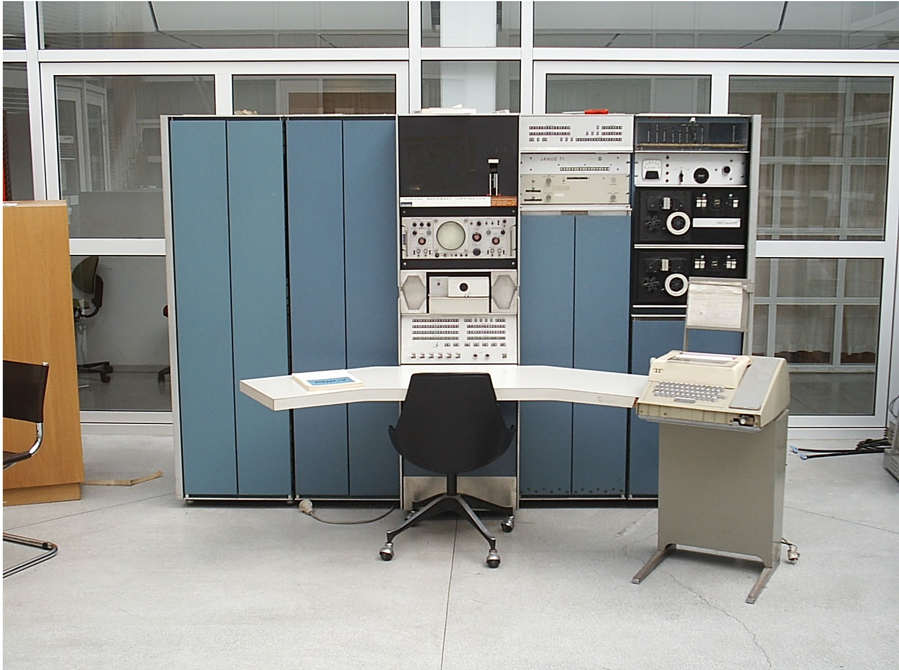

二是指服务的客户很''大''。早期计算机的使用对象一般都是政府单位、军队、银行、学校等等。因为大型计算机的造价不菲，这就从根本上决定了能使用它的不可能是一般的普通民众，而只能是有一定资金的单位或者组织。

#### 个人计算机系统

随着时间的发展，有那么一群极客不满足于在单位或者学校里使用那些大型计算机，他们想在家中也能畅快地使用计算机，这种想法促成了个人计算机的诞生。个人计算机也被称为微型计算机，更通俗一点的叫法是台式机，英文叫Personal Computer，简称PC。今天提到PC，我们立马想到的就是使用x86处理器运行Windows的计算机，其实最早商用化且有一定知名度的PC应该是苹果公司的Apple II：

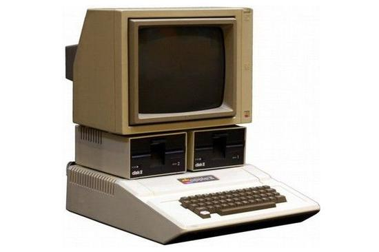

Apple II发售于1977年，它的发售带动了个人计算机大力的发展，也导致了IBM随后进入个人计算机领域并发布IBM PC机，也就是采用英特尔的处理器运行DOS系统的计算机。IBM将除了BIOS之外的计算机设计资料全部公开，这导致一大堆的IBM PC兼容机如雨后春笋般的出现在市场上，比如戴尔、康柏等等公司都是靠IBM PC兼容机起家的，这些"百家争鸣"的兼容机加快了个人计算机的普及并最终成就了英特尔和微软这两个商业帝国。

#### 嵌入式计算机系统

大型计算机一般用于复杂任务和大量数据的计算，个人计算机一般用于生产力开发和个人娱乐，另外还有一部分的设备中也需要计算机系统，比如洗衣机、智能音箱、快递柜、工业机器人、导弹等等。这些设备中的计算机系统没有大型计算机和个人计算机系统那么复杂，而且也不像大型机和个人机那么标准化，往往需要针对具体的设备功能和需求进行定制的设计硬件和软件系统，这种计算机系统被称为嵌入式计算机系统，这些设备也被称为嵌入式设备。

嵌入式设备是千变万化的，这就导致了它的计算机系统也是多种多样，我这里按照复杂程度大致将嵌入式系统分成了三类。

#####  复杂嵌入式系统

这类计算机系统一般硬件上功能丰富，可能具有网络、显示、较大的存储、性能较强的处理器，软件上一般都会运行Linux、Android或者VxWorks这样的操作系统，比如手机、快递柜、各种智能设备、路由器、车载仪表和娱乐屏等等：

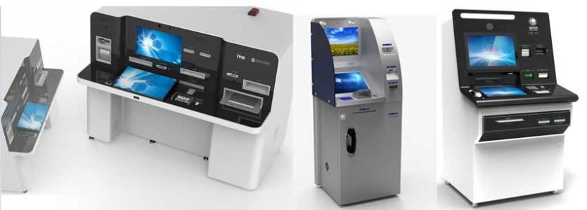

##### 一般嵌入式系统

这类计算机系统在硬件资源上没有那么丰富，软件层面可能会运行深度裁剪的Linux或者一些实时操作系统，比如电力领域中的继电保护装置：

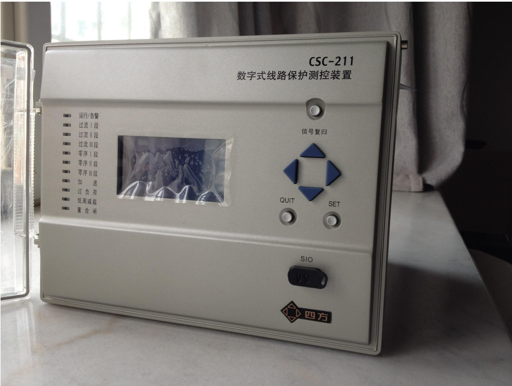

##### 深度嵌入式系统

这类计算机系统在硬件资源上严重受限，存储容量可能也就几十到几百KB，处理器主频可能也就几十或者几百MHz，因为这类系统要尽量降低功耗，所以系统中拥有的外设一般都比较单一。在软件层面可能会使用轻量实时操作系统或者直接是裸机程序运行，比如火灾报警系统、医疗监测系统、发动机控制系统等等：

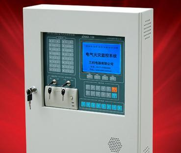

### 操作系统

鲁迅先生说过：世上本没有路，走的人多了也就有了路。操作系统也是如此，计算机刚诞生的那段时间里并没有什么操作系统，甚至连软件这个概念都不存在，想要使用计算机都是通过一些开关或者是打孔纸带进行"编程"。后来随着技术的发展出现了集成电路，计算机执行的任务逐渐形成了"软件"的概念，这些"软件"用今天的眼光来看就是妥妥的裸机程序，这些程序都是使用汇编语言或者是机器语言编写而成，这就导致了这些"软件"和硬件是强绑定的，想要把A厂商机器上的"软件"拿到B厂商机器上使用基本是不可能的，所以在这个时期"软件"和硬件是绑定在一起售卖的。

随着时间的发展，人们对计算机的要求越来越高，需求也越来越多样化和复杂化，这时人们发现每卖一种计算机就为它编写一整套使用的"软件"越来越费时费力，而且这些"软件"基本都是从硬件外设操作到业务逻辑实现全都包揽了，"软件"本身本应只关注业务逻辑而不需要关心底层具体使用的是什么硬件，基于这种想法就诞生了操作系统这个特殊的"软件"。操作系统负责管理整个硬件，并为其他"软件"提供统一的操作硬件的接口，这样"软件"就可以专心关心它自己的业务逻辑了。

类似的，早期的操作系统也都是使用汇编语言编写的，这也导致了它的可移植性很差，同时在操作系统的设计上各家有各家的想法，可谓是百花齐放，这种情况随着1974年UNIX操作系统的发布迎来了改变。肯•汤普森和丹尼斯•里奇为了让UNIX具有可移植性从而设计开发了C语言，并使用C语言加一些汇编重写了UNIX（UNIX一开始是用汇编编写的），同时引入了万物皆文件的思想，方便程序的设计和开发。可以说UNIX的诞生是一个非常重要的里程碑事件，并对其他的操作系统产生了深远的影响，包括现在的Windows、Linux、IOS、MacOS等等系统在设计上都有借鉴UNIX，可以说UNIX是现代操作系统的"教父"级别的存在。

随着时间的发展，操作系统要负责的功能也越来越多，包括网络通信、文件系统管理、设备管理、进程管理等等，这就导致了操作系统也越来越复杂，同时为了解决不同领域内的问题，操作系统的类别也多种多样，有像Windows这样的通用系统，也有像VxWorks这样的实时系统。同样根据我自己的了解，我将操作系统大致分为了两类：通用系统和实时系统。

#### 通用操作系统

像Windows、Linux、安卓、IOS等这类操作系统都可以划为通用操作系统，通用系统一般具有分时特性，也就是某个任务可以在cpu上运行一段时间，当时间到了之后，操作系统选取下一个任务来运行，如此往复。这类系统上的任务如果在单位时间内没有响应的话也是可以容忍的，比如你上网看视频突然视频卡住了，或者操作鼠标突然窗口冻住无反应了，这些一般不会造成严重的损失，大不了重启整个系统。

#### 实时操作系统

有一部分设备上运行的任务要求在单位时间内必须被响应，如果不响应则会造成严重的后果。比如继电保护装置需要周期性的进行电压电流计算，如果没有及时地运行计算任务可能造成计算结果错误甚至做出错误的判断从而影响电网的正常运行；再比如导弹的弹道控制，如果导弹中姿态校正任务没有及时响应，可能导致运行轨迹偏离原有弹道，从而无法击中目标。

针对有上述需求的设备就不能再运行Windows这类通用的操作系统了，而必须为这类设备专门设计一种操作系统，这就是实时操作系统。实时操作系统在设计上可以保证重要任务能被及时响应，当然这也需要任务的配合而不是说程序随便瞎写也能满足实时性的要求。根据实时系统的使用方式和功能我将实时系统大致分为了两类：

##### 通用实时系统

这里说的通用实时系统并不是指将通用操作系统进行改造变成实时系统，而是指软件开发方式类似于通用系统那样，可以将应用、驱动、内核等功能开发相分离，每个部分都可以单独的开发和部署，具有动态加载运行这种功能，比如VxWorks、QNX、SylixOS等实时操作系统：

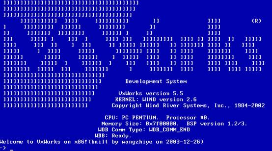

##### 专用实时系统

专用实时系统一般将内核、应用、驱动等功能模块合成一个镜像文件进行部署使用，不能对某个功能模块进行单独的部署或者升级，如果某个功能升级了一般都需要重新部署整个系统软件，比如UCOS、FreeRTOS等实时操作系统。

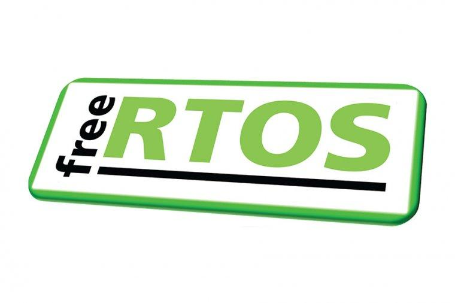

## 翼辉三大操作系统

### SylixOS

按照上一章节的分类，SylixOS属于通用实时操作系统，其市场定位是替换国内VxWorks。在系统结构设计上采用类似VxWorks 5.x的大平板地址设计，也就是内核、应用、驱动等模块都是运行在硬件最高特权级别，同时各模块之间功能调用是直接通过函数接口调用实现的，不像Linux那样有不同硬件权限的内核态和用户态之分。

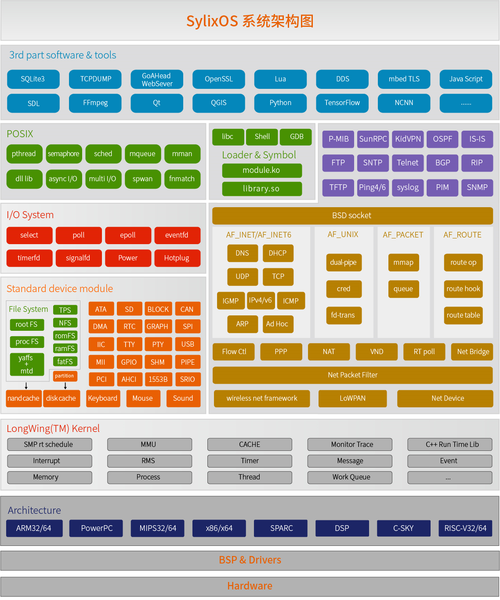

在开发方式上SylixOS采用类似Linux的方式，内核、应用、动态库、驱动都可以单独开发和部署，应用层通过操作类似Linux下的设备文件来使用驱动提供的功能，同时提供posix接口和VxWorks兼容层，方便用户将Linux下或者VxWorks下的原有代码移植到SylixOS下。

### MS-RTOS

通过上面的介绍可以看出SylixOS更多的是用于那些具有MMU，处理器资源比较丰富的平台上，针对MCU这种资源受限的处理器，翼辉推出了MS-RTOS实时操作系统，并将应用和系统开发相分离，这两部分可以单独的开发、部署和升级，同时应用支持动态装载。

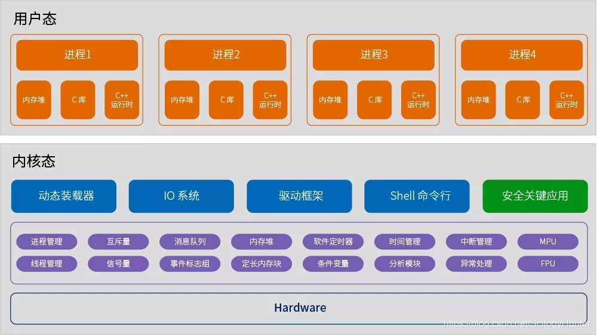

### EdgerOS

物联网是现在比较火热的一个词，它被视作是互联网之后的下一个信息革命。以华为的鸿蒙为例，鸿蒙分为两种版本，一种是以liteos-a为内核的版本，主要用于一般嵌入式设备，比如摄像头、手表、智能外设等等；另一种是以Linux为内核的版本，主要用于移动设备，比如手机、电视、平板等等。通过将这些智能嵌入式设备运行鸿蒙操作系统之后，可以有序智能的组织和管理这些设备，从而达到华为宣传的基于场景来对这些设备功能开发，让这些设备在不同的场景下组成物联网，进而更好地服务人类。

鸿蒙应用层开发框架支持JS和JAVA两种语言，JS一般用作轻量嵌入式设备的开发，比如手表，JAVA一般用于重量设备的开发，比如手机、电视等。

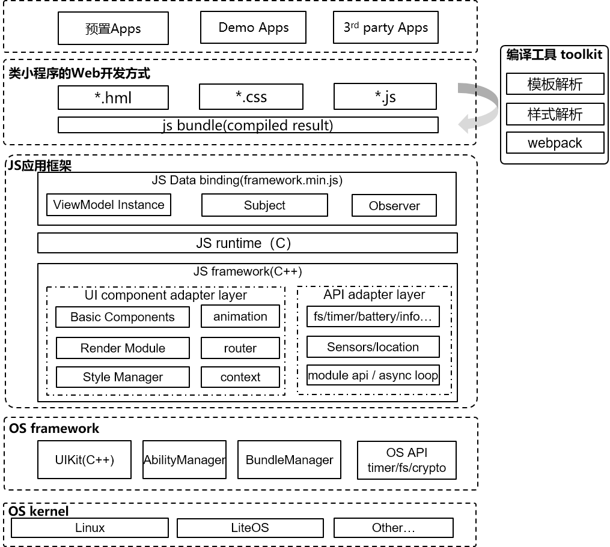

为了迎接物联网的到来，也为了更好的整合生态资源，翼辉推出了EdgerOS这个面向物联网和边缘计算的智能操作系统。EdgerOS以SylixOS内核为基础，应用层采用JS作为开发语言，主要运行在硬件资源丰富，性能较强的平台，作为边缘计算中心，其他的智能外设通过标准的通讯协议接入EdgerOS，这些智能外设可以是运行MS-RTOS或者其他操作系统的设备。

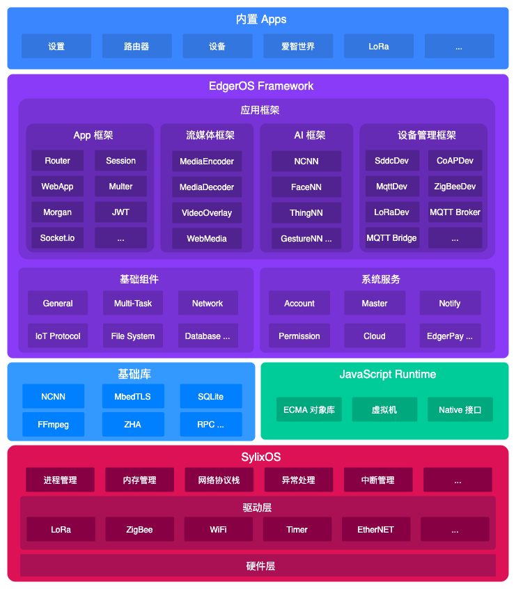

同时用户可以通过手机、平板等设备远程登陆到EdgerOS，对运行在其上的各种应用进行管理和设置。

