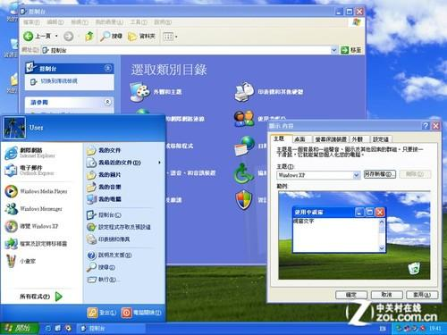

# SylixOS使用入门

## 嵌入式和实时操作系统

### 计算机系统

在学习SylixOS之前，我们有必要简单了解什么是嵌入式和实时操作系统，下面的这些类别都是按照我自己的理解划分的，可能并不是特别的严谨。这里说的计算机系统包括了硬件系统和软件系统两部分，而不是单单指软件上的操作系统。

#### 大型计算机系统

对计算机历史稍微有了解的人都知道，早期的计算机都是大型计算机，这里的大简单来说包含两个方面。一是体积上的大。比如现在公认的世界第一台电子计算机ENIAC，占地170平方米，重30吨，是不是很大：


再比如诞生了著名的UNIX系统的PDP-7计算机，从下图就看出它也很大：


二是指服务的客户很''大''。早期计算机的使用对象一般都是政府单位、军队、银行、学校等等。因为大型计算机的造价不菲，这就从根本上决定了能使用它的不可能是一般的普通民众，而只能是有一定资金的单位或者组织。

#### 个人计算机系统

随着时间的发展，有那么一群极客不满足于在单位或者学校里使用那些大型计算机，他们想在家中也能畅快地使用计算机，这种想法促成了个人计算机的诞生。个人计算机也被称为微型计算机，更通俗一点的叫法是台式机，英文叫Personal Computer，简称PC。今天提到PC，我们立马想到的就是使用x86处理器运行Windows的计算机，其实最早商用化且有一定知名度的PC应该是苹果公司的Apple II：


Apple II发售于1977年，它的发售带动了个人计算机大力的发展，也导致了IBM随后进入个人计算机领域并发布IBM PC机，也就是采用英特尔的处理器运行DOS系统的计算机。IBM将除了BIOS之外的计算机设计资料全部公开，这导致一大堆的IBM PC兼容机如雨后春笋般的出现在市场上，比如戴尔、康柏等等公司都是靠IBM PC兼容机起家的，这些"百家争鸣"的兼容机加快了个人计算机的普及并最终成就了英特尔和微软这两个商业帝国。

#### 嵌入式计算机系统

大型计算机一般用于复杂任务和大量数据的计算，个人计算机一般用于生产力开发和个人娱乐，另外还有一部分的设备中也需要计算机系统，比如洗衣机、智能音箱、快递柜、工业机器人、导弹等等。这些设备中的计算机系统没有大型计算机和个人计算机系统那么复杂，而且也不像大型机和个人机那么标准化，往往需要针对具体的设备功能和需求进行定制的设计硬件和软件系统，这种计算机系统被称为嵌入式计算机系统，这些设备也被称为嵌入式设备。

嵌入式设备是千变万化的，这就导致了它的计算机系统也是多种多样，我这里按照复杂程度大致将嵌入式系统分成了三类。

#####  复杂嵌入式系统

这类计算机系统一般硬件上功能丰富，可能具有网络、显示、较大的存储、性能较强的处理器，软件上一般都会运行Linux、Android或者VxWorks这样的操作系统，比如手机、快递柜、各种智能设备、路由器、车载仪表和娱乐屏等等：


##### 一般嵌入式系统

这类计算机系统在硬件资源上没有那么丰富，软件层面可能会运行深度裁剪的Linux或者一些实时操作系统，比如电力领域中的继电保护装置：


##### 深度嵌入式系统

这类计算机系统在硬件资源上严重受限，存储容量可能也就几十到几百KB，处理器主频可能也就几十或者几百MHz，因为这类系统要尽量降低功耗，所以系统中拥有的外设一般都比较单一。在软件层面可能会使用轻量实时操作系统或者直接是裸机程序运行，比如火灾报警系统、医疗监测系统、发动机控制系统等等：


### 操作系统

鲁迅先生说过：世上本没有路，走的人多了也就有了路。操作系统也是如此，计算机刚诞生的那段时间里并没有什么操作系统，甚至连软件这个概念都不存在，想要使用计算机都是通过一些开关或者是打孔纸带进行"编程"。后来随着技术的发展出现了集成电路，计算机执行的任务逐渐形成了"软件"的概念，这些"软件"用今天的眼光来看就是妥妥的裸机程序，这些程序都是使用汇编语言或者是机器语言编写而成，这就导致了这些"软件"和硬件是强绑定的，想要把A厂商机器上的"软件"拿到B厂商机器上使用基本是不可能的，所以在这个时期"软件"和硬件是绑定在一起售卖的。

随着时间的发展，人们对计算机的要求越来越高，需求也越来越多样化和复杂化，这时人们发现每卖一种计算机就为它编写一整套使用的"软件"越来越费时费力，而且这些"软件"基本都是从硬件外设操作到业务逻辑实现全都包揽了，"软件"本身本应只关注业务逻辑而不需要关心底层具体使用的是什么硬件，基于这种想法就诞生了操作系统这个特殊的"软件"。操作系统负责管理整个硬件，并为其他"软件"提供统一的操作硬件的接口，这样"软件"就可以专心关心它自己的业务逻辑了。

类似的，早期的操作系统也都是使用汇编语言编写的，这也导致了它的可移植性很差，同时在操作系统的设计上各家有各家的想法，可谓是百花齐放，这种情况随着1974年UNIX操作系统的发布迎来了改变。肯•汤普森和丹尼斯•里奇为了让UNIX具有可移植性从而设计开发了C语言，并使用C语言加一些汇编重写了UNIX（UNIX一开始是用汇编编写的），同时引入了万物皆文件的思想，方便程序的设计和开发。可以说UNIX的诞生是一个非常重要的里程碑事件，并对其他的操作系统产生了深远的影响，包括现在的Windows、Linux、IOS、MacOS等等系统在设计上都有借鉴UNIX，可以说UNIX是现代操作系统的"教父"级别的存在。


随着时间的发展，操作系统要负责的功能也越来越多，包括网络通信、文件系统管理、设备管理、进程管理等等，这就导致了操作系统也越来越复杂，同时为了解决不同领域内的问题，操作系统的类别也多种多样，有像Windows这样的通用系统，也有像VxWorks这样的实时系统。同样根据我自己的了解，我将操作系统大致分为了两类：通用系统和实时系统。

#### 通用操作系统

像Windows、Linux、安卓、IOS等这类操作系统都可以划为通用操作系统，通用系统一般具有分时特性，也就是某个任务可以在cpu上运行一段时间，当时间到了之后，操作系统选取下一个任务来运行，如此往复。这类系统上的任务如果在单位时间内没有响应的话也是可以容忍的，比如你上网看视频突然视频卡住了，或者操作鼠标突然窗口冻住无反应了，这些一般不会造成严重的损失，大不了重启整个系统。



#### 实时操作系统

有一部分设备上运行的任务要求在单位时间内必须被响应，如果不响应则会造成严重的后果。比如继电保护装置需要周期性的进行电压电流计算，如果没有及时地运行计算任务可能造成计算结果错误甚至做出错误的判断从而影响电网的正常运行；再比如导弹的弹道控制，如果导弹中姿态校正任务没有及时响应，可能导致运行轨迹偏离原有弹道，从而无法击中目标。

针对有上述需求的设备就不能再运行Windows这类通用的操作系统了，而必须为这类设备专门设计一种操作系统，这就是实时操作系统。实时操作系统在设计上可以保证重要任务能被及时响应，当然这也需要任务的配合而不是说程序随便瞎写也能满足实时性的要求。根据实时系统的使用方式和功能我将实时系统大致分为了两类：

##### 通用实时系统

这里说的通用实时系统并不是指将通用操作系统进行改造变成实时系统，而是指软件开发方式类似于通用系统那样，可以将应用、驱动、内核等功能开发相分离，每个部分都可以单独的开发和部署，具有动态加载运行这种功能，比如VxWorks、QNX、SylixOS等实时操作系统：


##### 专用实时系统

专用实时系统一般将内核、应用、驱动等功能模块合成一个镜像文件进行部署使用，不能对某个功能模块进行单独的部署或者升级，如果某个功能升级了一般都需要重新部署整个系统软件，比如UCOS、FreeRTOS等实时操作系统。


## 翼辉三大操作系统

### SylixOS

按照上一章节的分类，SylixOS属于通用实时操作系统，其市场定位是替换国内VxWorks。在系统结构设计上采用类似VxWorks 5.x的大平板地址设计，也就是内核、应用、驱动等模块都是运行在硬件最高特权级别，同时各模块之间功能调用是直接通过函数接口调用实现的，不像Linux那样有不同硬件权限的内核态和用户态之分。


在开发方式上SylixOS采用类似Linux的方式，内核、应用、动态库、驱动都可以单独开发和部署，应用层通过操作类似Linux下的设备文件来使用驱动提供的功能，同时提供posix接口和VxWorks兼容层，方便用户将Linux下或者VxWorks下的原有代码移植到SylixOS下。


### MS-RTOS

通过上面的介绍可以看出SylixOS更多的是用于那些具有MMU，处理器资源比较丰富的平台上，针对MCU这种资源受限的处理器，翼辉推出了MS-RTOS实时操作系统，并将应用和系统开发相分离，这两部分可以单独的开发、部署和升级，同时应用支持动态装载。


### EdgerOS

物联网是现在比较火热的一个词，它被视作是互联网之后的下一个信息革命。以华为的鸿蒙为例，鸿蒙分为两种版本，一种是以liteos-a为内核的版本，主要用于一般嵌入式设备，比如摄像头、手表、智能外设等等；另一种是以Linux为内核的版本，主要用于移动设备，比如手机、电视、平板等等。通过将这些智能嵌入式设备运行鸿蒙操作系统之后，可以有序智能的组织和管理这些设备，从而达到华为宣传的基于场景来对这些设备功能开发，让这些设备在不同的场景下组成物联网，进而更好地服务人类。

鸿蒙应用层开发框架支持JS和JAVA两种语言，JS一般用作轻量嵌入式设备的开发，比如手表，JAVA一般用于重量设备的开发，比如手机、电视等。


为了迎接物联网的到来，也为了更好的整合生态资源，翼辉推出了EdgerOS这个面向物联网和边缘计算的智能操作系统。EdgerOS以SylixOS内核为基础，应用层采用JS作为开发语言，主要运行在硬件资源丰富，性能较强的平台，作为边缘计算中心，其他的智能外设通过标准的通讯协议接入EdgerOS，这些智能外设可以是运行MS-RTOS或者其他操作系统的设备。


同时用户可以通过手机、平板等设备远程登陆到EdgerOS，对运行在其上的各种应用进行管理和设置。

## SylixOS开发环境

### SylixOS Base工程

SylixOS Base工程是其他所有工程的基石，在创建使用其他SylixOS工程之前必须首先创建并编译SylixOS Base工程。我们知道Linux的内核源码其实包含了内核功能源码+板子驱动源码，这两部分源码是放在一起编译的，而不像SylixOS、VxWorks、QNX这类系统有明确的内核和BSP之分。SylixOS将板级无关的代码组织成Base工程，主要包括了内核线程调度器、文件系统、网络协议栈、cpu架构(mmu和cache)等等功能，因为这部分代码和具体的板子无关，所以统一放在Base工程里进行编译。

在Base工程中，除了包含基本的内核代码外，还包含了一些动态库和APP代码，因为这些是系统使用的比较重要的库或者工具，所以就放入Base中供用户来选择使用，如下图所示。


libsylixos和libcextern是默认选择的两个，libsylixos中主要是内核源码还有一些和c++、app堆管理等相关的库，libcextern是SylixOS下的c库。这里介绍下libsylixos编译出来的两个比较重要的产物：libsylixos.a和libvpmpdm.so，如下图所示。


- libsylixos.a最终会被SylixOS BSP工程使用，会和BSP进行联编，最终生成SylixOS镜像。
- libvpmpdm.so会被SylixOS APP和SylixOS Shared Lib工程强制依赖使用，主要功能是负责用户层动态内存申请。SylixOS在用户层使用malloc和在内核中使用malloc是两套不同的代码实现的，并且使用的堆内存区也不同。用户层的malloc是在APP区申请内存，内核层的malloc是在内核数据区申请内存(参考SylixOS BSP开发教程中讲解的内存划分)。

在实际的板子上，如果使用到了APP和动态库工程，一定要记得先将SylixOS Base工程的这些基础动态库和工具部署到板子上，具体的操作可以参考SylixOS IDE使用手册。

### SylixOS BSP工程

SylixOS BSP工程主要负责板级的初始化和系统引导启动，不同的开发板都需要对应的SylixOS BSP才能编译出最终系统镜像。关于SylixOS BSP移植请参考本网站系列文章。

SylixOS BSP工程编译后生成的最终SylixOS内核镜像是在BSP工程下而不是在BASE工程下，一般内核镜像名为xxx.elf或者xxx.bin。用elf文件作为引导镜像的一般在x86、龙芯、飞腾平台下使用，用bin文件作为引导镜像的一般在arm平台下使用，具体使用哪种文件作为引导文件根据实际情况来选择。


生成的SylixOS镜像一般都是通过bootloader来加载到内存引导的，可以是网络、U盘、磁盘或者其他方式，根据实际平台使用的bootloader和支持的引导方式来选择具体的引导方法。

### SylixOS APP工程

类似于Linux下应用都是以单独的elf可执行文件存在，SylixOS下的应用程序也是elf格式的可执行文件。应用程序可以单独进行编译开发，这样就将应用和系统解耦，可以分别开发和维护，降低维护成本。SylixOS应用可以动态加载执行，也可以使用动态库，这种使用方式对于熟悉Linux应用编程的童鞋来说应该是比较容易接受学习的。

APP工程编译后会生成strip和非strip两个elf格式的可执行文件，一般部署到开发板上的都是strip版本文件，这样可以减少文件体积，节省存储空间。


### SylixOS Shared Lib工程

SylixOS和Linux一样，都可以编译生成动态库文件，通过将公共的代码以动态库形式提供可以提高代码复用率，还有一些软件支持不同的插件，这些插件其实就是不同的动态库。SylixOS下通过Shared Lib工程来创建动态库工程，编译后生成xxx.so动态库，并同时生成xxx.a静态库，也就是SylixOS下的动态库工程是同时编译出动态库和静态库两个文件的，具体使用那个看实际情况。另外需要注意的是，这里生成的静态库文件和下面要介绍的内核静态库文件不是同一个东西，这里的静态库是给应用层使用的，也就是给APP工程使用的，千万不要把这里生成的静态库拿给BSP或者内核模块去使用，否则BSP或者内核模块编译都不会通过。


### SylixOS Kernel Module工程

我们都知道Linux下的驱动都是叫xxx.ko，类似的，SylixOS下的驱动模块是通过Kernel Module工程创建的，编译后会生成xxx.ko驱动程序，通过“insmod”命令进行动态加载使用。

SylixOS下的驱动程序可以直接编译进BSP中，系统启动时调用驱动的入口初始化函数，也可以将驱动编译成内核模块形式，在系统启动后进行动态加载初始化使用。这种使用方式和Linux下类似，降低了Linux下驱动移植和使用的难度。


### SylixOS Kernel Static Lib工程

有时候会有一些需求要将一些驱动代码以静态库的形式提供，然后被BSP工程或者内核模块工程来使用。这时候就可以通过Kernel Static Lib工程来创建内核静态库，通过这个工程生成的静态库文件只能被BSP或者其他内核模块使用，不能给应用层APP去使用。


## SylixOS同步互斥之互斥锁

​		从本篇开始往后的文章主要介绍下SylixOS常用的编程接口，比如同步互斥接口、动态内存相关类接口、Cache操作接口等等，主要聚焦于驱动开发中经常使用到的内核接口。

### 基本作用

​		互斥锁在SylixOS中也被叫做互斥信号量，它的主要作用就是保护一段“共享资源”避免被同时访问，从而达到互斥的效果。比如在一般的网卡或者SD卡驱动中，硬件模块的数据收发都是通过描述符来进行设置的，当一个线程或者进程在更新或者准备这些描述符数据时，这些描述符是不可以再被别的线程来访问的，不然的话你前面一个线程设置好的描述符还没开始用立马又被别的线程给更改了，这就造成描述符的混乱从而导致收发数据异常。在这个案例中，描述符数据就是“共享资源”，访问这些数据可以使用互斥锁进行保护。

​		当一个线程成功获取到互斥锁后，就可以正常去访问“共享资源”，如果这时候另外的线程也来获取互斥锁，一般会被阻塞住，直到获取到锁的线程访问完“共享资源”，然后释放锁的时候会唤醒这些阻塞住的线程，从中选择一个优先级最高的调度运行。

​		互斥锁的详细使用方法在《SylixOS应用开发手册》的7.3.3章节有介绍，这里只介绍基本用法和使用过程中的一些注意事项或者比较重要的东西。

### 互斥锁相关接口

#### 创建互斥锁

互斥锁在使用之前需要进行创建，创建成功后会获得一个互斥锁句柄，后续的操作都是基于这个句柄来进行的。互斥锁创建使用接口***API_SemaphoreMCreate*** 来实现，这个接口可以在应用层使用也可以在内核和驱动中使用，其函数原型如下：

```
LW_API LW_OBJECT_HANDLE API_SemaphoreMCreate(CPCHAR             pcName,
                                             UINT8              ucCeilingPriority,
                                             ULONG              ulOption,
                                             LW_OBJECT_ID      *pulId); /*  建立互斥信号量              */
```

- pcName：互斥锁的名字，给每个互斥锁取不同的名字在一个使用超多互斥锁的工程进行调试时十分有用（经验之谈）。名字可以为空。
- ucCeilingPriority：当使用优先级天花板算法时， 此参数表示天花板优先级。使用互斥锁时可能会发生优先级翻转问题，解决方法就是使用优先级继承或者优先级天花板算法，具体的原理请自行查阅相关资料。
- ulOption：互斥锁的一些属性，比如优先级翻转解决算法、是否使用递归加锁等等。
- pulId：当互斥锁成功创建后，可以通过此出参返回互斥锁句柄，也可以直接通过创建接口返回值来返回，取决于具体的使用环境，一般设置为空。

此接口成功创建返回互斥锁句柄，失败返回***LW_OBJECT_HANDLE_INVALID*** 。另外有个比较重要的地方需要注意，就是ulOption中有一个***LW_OPTION_OBJECT_GLOBAL*** 标志，当在驱动中使用此接口创建互斥锁时，一定要加上这个属性标志，在应用层使用此接口时则使用的是***LW_OPTION_OBJECT_LOCAL\*** 这个标志，一定要铭记！！！

GLOBAL那个标志控制着当进程结束时是否自动销毁此互斥锁资源。在SylixOS下，互斥锁、二进制信号量等其他内核对象都属于资源，当互斥锁没有设置GLOBAL标志时，进程退出时如果没有回收这些资源，系统会帮忙自动回收这些资源。这种机制对于应用层来说没有啥问题，因为即使你在应用中不手动销毁互斥锁，系统会帮你销毁以回收资源，但是在驱动中就有问题了。比如在某些驱动中，当初次被某个进程使用时会动态创建一些互斥锁等资源以用于驱动功能管理，当再次被别的进程使用时是不会再次去创建这些资源，这些资源只有在驱动卸载时才会被销毁回收。也就是说这些资源虽然是在第一个进程使用的过程中创建的，却不能在第一个进程结束时被系统来回收，这就是通过在创建时加上GLOBAL标志来实现的。所以在驱动中创建这些资源时都需要加上这个GLOBAL标志。

#### 获取互斥锁

创建好互斥锁之后，在访问“共享资源”之前需要申请互斥锁或者叫获取互斥锁，在SylixOS下这是通过***API_SemaphoreMPend*** 接口实现的，如下所示。

```
LW_API ULONG            API_SemaphoreMPend(LW_OBJECT_HANDLE  ulId, 
                                           ULONG             ulTimeout);/*  等待互斥信号量              */
```

- ulId：这是之前创建的互斥锁句柄。
- ulTimeout：等待互斥锁的时间。单位为tick，如果想一直等待，则设置为***LW_OPTION_WAIT_INFINITE*** 即可。

此接口成功返回0，失败返回错误码，比如等待超时会返回***ERROR_THREAD_WAIT_TIMEOUT\***。

#### 释放互斥锁

当访问完“共享资源”后，需要释放互斥锁以让别的线程或者进程来访问“共享资源”，在SylixOS下这是通过***API_SemaphoreMPost*** 接口实现的，如下所示。

```
LW_API ULONG            API_SemaphoreMPost(LW_OBJECT_HANDLE  ulId);     /*  释放互斥信号量              */
```

- ulId：成功创建的互斥锁句柄。

此接口会检查是否有别的线程在等待获取此互斥锁，如果有则将所有等待线程中优先级最高的线程加入调度就绪表。成功则返回0，失败返回错误码。

#### 销毁互斥锁

由于互斥锁是占用系统资源的，如果确认使用完毕的话需要进行销毁以回收系统资源，在SylixOS下这是通过***API_SemaphoreMDelete*** 接口实现的，如下所示。

```
LW_API ULONG            API_SemaphoreMDelete(LW_OBJECT_HANDLE  *pulId); /*  删除互斥信号量              */
```

- pulId：要销毁的互斥锁句柄变量的地址。

成功返回0，失败返回错误码。

### 接口使用示例

这里用伪代码来说明上述接口的基本使用方法，详细的使用请参考应用开发手册。

```
LW_OBJECT_HANDLE mutex;

1. 创建互斥锁
mutex = Lw_SemaphoreM_Create("lock",
                             LW_PRIO_HIGH,
                             LW_OPTION_WAIT_FIFO | LW_OPTION_OBJECT_GLOBAL| LW_OPTION_INHERIT_PRIORITY,
                             LW_NULL);

2. 获取互斥锁，如果获取不到则一直等待
API_SemaphoreMPend(mutex, LW_OPTION_WAIT_INFINITE);

3. 访问共享资源

4. 释放互斥锁
API_SemaphoreMPost(mutex);

5. 删除互斥锁
API_SemaphoreMDelete(&mutex);
```

为了简洁，上述代码没有进行函数调用返回值检查，在实际的使用中一定要记得检查函数调用的返回值。

关于互斥锁还有其他一些接口，具体可以参见内核源码SylixOS/kernel/include/k_api.h。

### 注意事项

- 互斥锁只能使用在线程上下文环境，禁止在中断上下文中使用，否则会返回错误。
- 互斥锁的获取和释放两个操作要成对的在同一个线程中使用，不要在不同的线程中使用

## SylixOS同步互斥之二进制信号量

### 基本作用

​		上一章节我们介绍了互斥锁，用于“共享资源”的互斥访问，在驱动开发中我们有时候需要等待某种资源准备好之后才能继续执行代码，这就需要使用同步机制来实现这个目的。比如某个应用想要读取AD转换数据，但是这时候转换还未完成，那么就有两种基本处理方法：一是轮询某个寄存器直到AD转换完成；二是将当前线程阻塞，等待AD转换完成后在中断处理中唤醒。第一种方法由于一直在轮询寄存器，cpu的占用率比较高，其他线程得不到运行，cpu利用率较低；第二种方法由于线程阻塞住之后系统可以调度其他的线程运行，cpu利用率较高，但是需要系统提供相应的同步机制。

​		多个线程可以等待同一个二进制信号量，唤醒的时候根据实际需要可以唤醒优先级最高的线程或者唤醒所有阻塞的线程。二进制信号量详细使用方法在《SylixOS应用开发手册》的7.3.1章节有介绍，这里只介绍基本用法和使用过程中的一些注意事项或者比较重要的东西。

### 二进制信号量相关接口

#### 创建二进制信号量

类似于互斥锁，二进制信号量在使用之前也需要先进行创建，这是通过***API_SemaphoreBCreate*** 接口实现的，如下所示。

```
LW_API LW_OBJECT_HANDLE API_SemaphoreBCreate(CPCHAR             pcName,
                                             BOOL               bInitValue,
                                             ULONG              ulOption,
                                             LW_OBJECT_ID      *pulId); /*  建立二进制信号量            */
```

- pcName：二进制信号量也可以设置一个名字，在调试的时候很有用。
- bInitValue：二进制信号量顾名思义它的状态只有两种，0或者1。初始化的时候可以设置初始状态值为0或者1，**二进制信号量用于同步时初始值需要设置为0**，设置为1时二进制信号量可以当作互斥锁来使用，但是由于二进制信号量用作互斥时不能解决优先级翻转问题，所以这种用法一般不怎么常用。
- ulOption：和互斥锁类似，二进制信号量也有一些属性可以设置，其中也包括***LW_OPTION_OBJECT_GLOBAL*** 这个属性，其作用和意义对于二进制信号量和互斥锁是一样的。
- pulId：和互斥锁类似，可以通过此出参保存二进制信号量句柄。

成功返回二进制信号量句柄，失败返回错误码。

#### 阻塞等待二进制信号量

当资源没有准备好时，一般情况下需要将当前线程阻塞住来等待别的线程或者中断来唤醒，这是通过***API_SemaphoreBPend*** 接口来实现的，如下所示。

```
LW_API ULONG            API_SemaphoreBPend(LW_OBJECT_HANDLE  ulId, 
                                           ULONG             ulTimeout);/*  等待二进制信号量            */
```

- ulId：二进制信号量句柄。
- ulTimeout：等待时间。和互斥锁一样，等待时间单位是tick，如果想一直等待，也是通过***LW_OPTION_WAIT_INFINITE\*** 来设置。

成功返回0，失败返回错误码，比如等待超时会返回***ERROR_THREAD_WAIT_TIMEOUT***。调用此接口时会将二进制信号量的值减去1，如果减之前值已经是0的话，就会将当前线程阻塞住，这也是为啥我们在初始化的时候需要将二进制信号量初始值设置为0的原因，因为只有这样设置调用此接口的线程才能真正的阻塞住

#### 唤醒二进制信号量

当资源准备好之后，就可以唤醒通知阻塞在二进制信号量上的线程，表示资源已经准备好了，快来使用。根据唤醒的需求不同，可以分为唤醒优先级最高的线程和全部唤醒两种方式，下面分别作介绍。

##### 唤醒单个线程

如果只需要唤醒所有阻塞线程中优先级最高的那个线程的话，则可以使用***API_SemaphoreBPost*** 来实现，如下所示。

```
LW_API ULONG            API_SemaphoreBPost(LW_OBJECT_HANDLE  ulId);     /*  RT 释放信号量               */
```

- ulId：二进制信号量句柄。

成功返回0，失败返回错误码。如果没有线程阻塞在此二进制信号量上时，调用此接口会将二进制信号量的值恢复为1。

##### 唤醒全部线程

如果需要将阻塞在二进制信号量上的所有线程都唤醒的话，可以使用***API_SemaphoreBFlush*** 接口来实现，如下所示。

```
LW_API ULONG            API_SemaphoreBFlush(LW_OBJECT_HANDLE  ulId, 
                                            ULONG            *pulThreadUnblockNum);
                                                                        /*  解锁所有等待线程            */
```

- ulId：二进制信号量句柄。
- pulThreadUnblockNum：这个参数用于保存将要被唤醒的线程的数量，如果不关心的话，可以设置为空。

成功返回0，失败返回错误码。

#### 销毁二进制信号量

当二进制信号量使用完毕之后，需要进行销毁以回收资源，这是通过***API_SemaphoreBDelete*** 接口实现的，如下所示。

```
LW_API ULONG            API_SemaphoreBDelete(LW_OBJECT_HANDLE  *pulId); /*  删除二进制信号量            */
```

- pulId：和互斥锁类似，此参数为要销毁的二进制信号量句柄变量的地址。

成功返回0，失败返回错误码。

###  接口使用示例

这里用伪代码来说明上述接口的基本使用方法，详细的使用请参考应用开发手册。

```
LW_OBJECT_HANDLE sync_handle;

1. 创建二进制信号量，并将初始值设置为0，表示用作同步
sync_handle= API_SemaphoreBCreate("sync",
                                  LW_FALSE,
                                  LW_OPTION_WAIT_FIFO | LW_OPTION_OBJECT_GLOBAL,
                                  LW_NULL);

2. 当资源未准备好时，阻塞等待二进制信号量
API_SemaphoreBPend(sync_handle, LW_OPTION_WAIT_INFINITE);

3. 当资源准备好后，唤醒等待二进制信号量的线程
API_SemaphoreBPost(sync_handle);
或者
API_SemaphoreBFlush(sync_handle, NULL);

4. 使用完毕后，销毁二进制信号量
API_SemaphoreBDelete(&sync_handle);
```

关于二进制信号量还有其他一些接口，具体可以参见内核源码SylixOS/kernel/include/k_api.h。

### 注意事项

- 和互斥锁不一样的是，二进制信号量的等待和唤醒这两个接口一般是在不同的线程中调用的
- 唤醒接口可以在中断上下文环境中使用，但是等待接口不能在中断中使用

## SylixOS同步互斥之自旋锁

#### 基本作用

​		在前面我们介绍过互斥锁用于共享资源的互斥访问，但是互斥锁有一个缺点就是资源开销比较大。因为获取互斥锁和释放互斥锁过程中都需要进出内核，如果共享资源自身不是很大的话，比如可能就是修改一个变量的值，代码里也就几行，这个时候就可以考虑使用自旋锁来实现互斥访问。

​		自旋锁顾名思义，当锁已经被别人获取的时候，再次去获取锁的人会一直“自旋”，也就是一直在检测锁的状态直到锁被释放。自旋锁一般用在多核的情况下，比如现在有两个线程分别跑在两个核上，然后都要去访问共享资源，如下图所示。

```
cpu核0上运行线程A：
    获取锁保护资源
    count++;
    释放锁

cpu核1上运行线程B：
    获取锁保护资源
    count--;
    释放锁
```

这里的共享资源就是count这个变量，对这个变量的访问需要被保护起来。如果使用互斥锁来实现，假设线程A首先获取到锁，那么当线程B去获取锁时会被阻塞然后调度其他线程运行，直到线程A执行完count++然后释放锁，线程B得到机会被再次调度运行，然后执行count--。我们发现这里其实count++或者count--代码执行的时间是很短的，用互斥锁的话线程B被阻塞调度其他线程运行然后又调度回来执行，这中间花去了不少时间，得不偿失。这里就可以用自旋锁来实现互斥，线程B发现锁已经被线程A获取了，然后一直检测锁的状态直到锁被线程A释放，因为线程A占用锁的时间很短，所以线程B很快就可以获取到锁，这样就避免了调度来调度去的时间开销，提高了程序的性能。

### 自旋锁相关接口

以下接口只能用在驱动和内核中，如果想在应用层使用的话，可以使用posix中规定的自旋锁接口。

#### 初始化自旋锁

自旋锁使用之前，需要初始化，这是通过***API_SpinInit*** 接口来实现的，如下所示。

```
LW_API INT              API_SpinInit(spinlock_t *psl);
```

- psl：自旋锁变量地址。在SylixOS下，自旋锁类型是***spinlock_t***，使用之前需要进行初始化。

成功返回0，失败返回错误码。

#### 获取自旋锁

当需要保护共享资源时，需要先申请自旋锁，这是通过***API_SpinLock*** 接口实现的，如下所示。

```
LW_API INT              API_SpinLock(spinlock_t *psl);
```

- psl：自旋锁变量地址。

成功返回0，失败返回错误码。此接口调用完不会改变cpu原有的中断状态，也就是如果在调用接口之前cpu的中断状态是开状态，调用完之后中断状态还是开状态。并且调用成功之后当前线程会被锁定在当前cpu核上执行，不会被调度到其他核上运行。

####  释放自旋锁

访问完共享资源就可以释放自旋锁了，这是通过***API_SpinUnlock*** 接口实现的，如下所示

```
LW_API INT              API_SpinUnlock(spinlock_t *psl);
```

- psl：自旋锁变量地址。

这个接口是和***API_SpinLock*** 接口成对使用的，成功返回0，失败返回错误码。并且在释放的时候会尝试进行一次调度，让其他线程有机会运行。

#### 获取自旋锁同时关闭中断

有时候可能会有这么一种需求，在获取到自旋锁的同时需要将cpu中断状态关闭，这是通过***API_SpinLockIrq*** 接口来实现的，如下所示。

```
LW_API INT              API_SpinLockIrq(spinlock_t *psl, INTREG  *iregInterLevel);
```

- psl：自旋锁变量地址。
- iregInterLevel：用来保存调用之前中断状态值的。

这个接口和***API_SpinLock*** 接口作用类似，不同的是调用完之后cpu的中断状态是关闭的，也就是在当前cpu核上不会处理任何中断，直到中断被再次打开。成功返回0，失败返回错误码，并且同样调用成功之后当前线程会被锁定在当前cpu核上执行，不会被调度到其他核上运行。

#### 释放自旋锁同时打开中断

和***API_SpinLockIrq*** 接口相对应的释放自旋锁并打开中断的接口是***API_SpinUnlockIrq\*** ，如下所示。

```
LW_API INT              API_SpinUnlockIrq(spinlock_t *psl, INTREG  iregInterLevel);
```

- psl：自旋锁变量地址。
- iregInterLevel：之前保存的中断状态值。

成功返回0，失败返回错误码。并且在释放的时候会尝试进行一次调度，让其他线程有机会运行。

#### 销毁自旋锁

自旋锁使用完毕之后需要进行销毁以回收资源，这是通过***API_SpinDestory\*** 接口实现的，如下所示。

```
LW_API INT              API_SpinDestory(spinlock_t *psl);
```

- psl：自旋锁变量地址。

成功返回0，失败返回错误码。在SylixOS的实现中，这个接口基本是个空函数，并没有做什么实质的资源回收，但是为了代码的健壮性，建议还是要调这个接口，因为保不准以后哪个版本之后这个函数就有真正的回收资源的不同实现了。

### 接口使用示例

```
spinlock_t spin_lock;
1. 初始化自旋锁
API_SpinInit(&spin_lock);

2. 获取自旋锁
API_SpinLock(&spin_lock);
或者
INTREG flag;
API_SpinLockIrq(&spin_lock, &flag);

3. 访问共享资源

4. 释放自旋锁
API_SpinUnlock(&spin_lock);
或者
API_SpinUnlockIrq(&spin_lock, flag);

5. 使用完毕后，销毁自旋锁
API_SpinDestory(&spin_lock);
```

关于自旋锁还有其他一些接口，具体可以参见内核源码SylixOS/kernel/include/k_api.h。

### 注意事项

- 禁止在上述的lock和unlock接口之间调用内核系统接口或者能引起阻塞和调度的接口，如果一定要用这些系统接口的话，可以使用***LW_SPIN_LOCK_TASK*** 和***LW_SPIN_UNLOCK_TASK*** 这两个接口，这两个接口同时也是posix中spinlock相关实现中使用的。
- 禁止在中断上下文中使用***LW_SPIN_LOCK_TASK*** 和***LW_SPIN_UNLOCK_TASK*** 这两个接口。

## SylixOS同步互斥之原子操作

### 基本作用

在各类操作系统提供的接口中，除了我们之前学习的互斥锁和信号量类接口用于实现互斥或者同步的目的外，也基本都会提供一类原子操作的接口，一般接口都带有atomic_xxx字样。原子操作类接口一般用于某个变量需要改变的情况，比如变量值需要增加、减少或者逻辑运算等等，但是如果这些操作是用高级语言编写的，比如C语言等，一句简单的“count++”被编译器编译后可能会生成n条指令来完成这一个操作，那么在这n条指令执行过程中是不能被打断的，如果被打断就有可能造成程序上的错误，这时我们就可以用之前学习的互斥锁和自旋锁来保护这个“count++”过程，保证其不被打断。现代处理器针对这些运算都基本提供了专门的指令，可以保证指令在执行过程中不会被打断，也就是效果是“原子性”的，因为在以前的物理认识中，原子是不可再分的最小物质，当然现在我们知道有比原子更小的物质，但是由于历史原因，atomic这个叫法就这么一直延续下来了。

对于初学者而言，可能会对原子操作产生困扰，因为完全可以用互斥锁和自旋锁实现和原子操作相同的效果，那为啥还要单独再提供这么个接口，这也是笔者刚学习时的疑问。其实在软件实现上，的确可以完全用互斥锁和自旋锁实现和原子操作相同的效果，但是使用原子接口没有互斥锁带来的调度开销和自旋锁带来的cpu“死等”浪费，也就是性能比前两者要好。但是原子操作可以运用的场景也比较有限，也就是针对一些变量的数学计算和逻辑运算这类场景，而互斥锁和自旋锁可以用于其他很多要资源保护的场景。

### 原子操作相关接口

#### 原子量设置接口

在SylixOS下，原子量都是用***atomic_t\*** 类型来定义的，原子量初始值一般都是通过***API_AtomicSet*** 接口来设置的，如下所示。

```
LW_API VOID             API_AtomicSet(INT  iVal, atomic_t  *patomic);
```

- iVal：要设置的原子量值。
- patomic：原子量变量地址。

该接口没有返回值，调用完毕之后原子量就变为要设置的数值了。

#### 原子量获取接口

通过***API_AtomicGet*** 接口可以获取当前原子量的值，如下所示。

```
LW_API INT              API_AtomicGet(atomic_t  *patomic);
```

- patomic：原子量变量地址。

成功返回原子量当前值，失败返回-1。

#### 原子量增加数值接口

如果想将原子量的值加上一个数值，可以使用***API_AtomicAdd*** 接口，如下所示。

```
LW_API INT              API_AtomicAdd(INT  iVal, atomic_t  *patomic);
```

- iVal：要增加的数值。
- patomic：原子量变量地址。

成功返回原子量原来的值，失败返回-1。如果只想将原子量的数值加一的话，可以使用***API_AtomicInc*** 接口，如下所示。

```
LW_API INT              API_AtomicInc(atomic_t  *patomic);
```

- patomic：原子量变量地址。

成功返回原子量原来的值，失败返回-1。

#### 原子量减少数值接口

如果想将原子量的值减少一个数值，可以使用***API_AtomicSub*** 接口，如下所示。

```
LW_API INT              API_AtomicSub(INT  iVal, atomic_t  *patomic);
```

- iVal：要增加的数值。
- patomic：原子量变量地址。

成功返回原子量原来的值，失败返回-1。如果只想将原子量的数值减一的话，可以使用***API_AtomicDec*** 接口，如下所示。

```
LW_API INT              API_AtomicDec(atomic_t  *patomic);
```

- patomic：原子量变量地址。

成功返回原子量原来的值，失败返回-1。

#### 原子量交换接口

如果想将原子量设置为新数值同时还要获取其原来的值，可以使用***API_AtomicSwp*** 接口，如下所示。

```
LW_API INT              API_AtomicSwp(INT  iVal, atomic_t  *patomic);
```

- iVal：要设置的新数值。
- patomic：原子量变量地址。

成功返回原子量原来的值，失败返回-1。

### 接口使用示例

由于原子量的接口比较简单，基本看接口名就能知道是咋用的了，这里就不在举例子了。关于原子量还有其他一些接口，具体可以参见内核源码SylixOS/kernel/include/k_api.h。

### 注意事项

- 原子量操作在移植Linux下的驱动时会经常遇到，但是Linux下原子量操作接口的返回值和SylixOS下相应接口返回值可能代表的意义并不相同，这个在实际移植时要注意。

