[TOC]


# SylixOS图形开发

## Vivante GCXX系列GPU驱动工作原理简介

### FrameBuffer简介

SylixOS下将显示设备抽象为一个文件，一般为/dev/fb0、/dev/fb1等，通过对fb设备文件的操作就可以直接操作显示设备。本质就是读写显示设备的“显示区域”，也就是一块内存区域，只要将要在屏幕上显示的数据准备好，然后填入这块区域，显示控制器就能在屏幕上显示图像，这块“显示区域”就叫做FramBuffer。如下图所示：

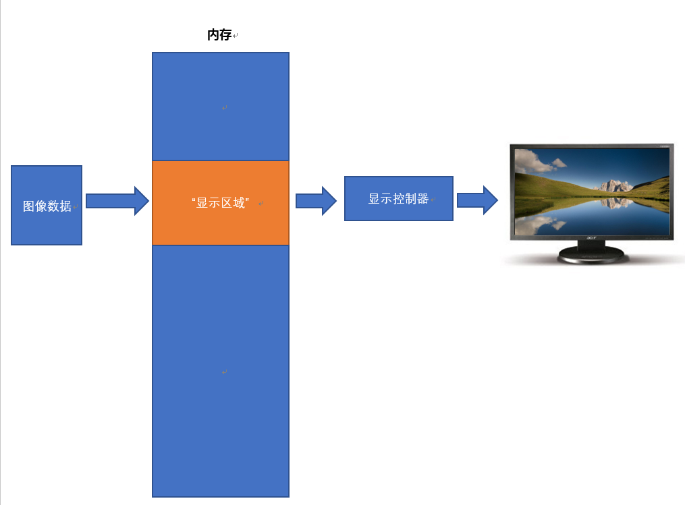

假设屏幕的分辨率为1024*600，单个像素的颜色数据用RGBA表示，也就是一个像素颜色用4字节表示，那么这个屏幕的FramBuffer大小为1024*600*4字节，也就是2400KB。

### Vivante GPU渲染原理简介

- 将GPU需要计算的原始数据准备好
- 启动GPU计算
- 得到计算结果，这个结果就是一帧屏幕图像数据
- 将第3步的得到的数据拷贝到FramBuffer，这样GPU渲染的一帧图像就在显示设备上显示出来了

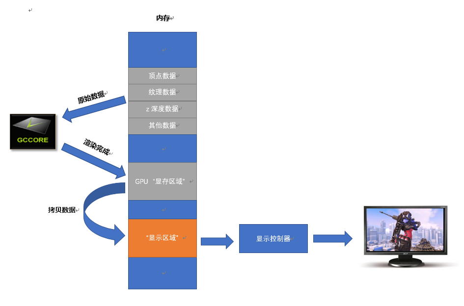

### Vivante GPU驱动工作原理

#### Contex Buffer

GPU在启动渲染前需要设置其状态，也就是渲染环境，这些设置命令专门存放buffer中，这个buffer叫做contex buffer。如果GPU的渲染环境需要改变，就需要重新填写contex buffer中的内容。

#### Command Buffer

在设置好contex buffer后，就可以让GPU做渲染（计算）工作了，这些渲染指令也被放在专门的buffer中，这个buffer叫做command buffer。

#### Command queue

GPU除了设置状态和渲染指令外，还有一些控制类指令，类似于CPU的CALL、JMP等，通过这些控制指令来控制contex buffer和command buffer，这些指令同样被放在专门的buffer中，这个buffer叫做command queue。

#### GPU的event同步机制

当GPU的渲染工作完成后，会执行一条event指令，这条event指令是事先被填在command queue中的。event指令可以表示0~29共30个event，当执行event指令后，GPU会产生中断，中断程序通过读取GPU的中断状态寄存器，就可以知道发生的是哪个event的中断，从而执行相应的处理程序。

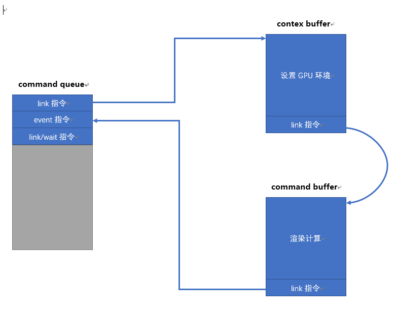

如上图所示，GPU从command queue开始执行指令，link指令相当于一条跳转指令，跳到contex buffer中执行设置GPU环境的指令，设置好环境后接着又通过link指令跳转到command buffer中执行渲染指令，渲染指令执行完后再次通过link指令跳回command queue，然后执行event命令，GPU产生中断，CPU处理中断相关内容。最后的link/wait指令让GPU处于等待状态，直到有新的指令可以执行。

### 驱动中event管理简介

#### 空闲event控制块链表

每个event信息都是存放在一个event控制块中的，驱动初始化的时候会生成固定个数的event控制块，然后将这些event控制块构造成一个单向链表。如果有event信息产生，就从链表中取出一个控制块，将event信息填写进去。如下图所示，一个这样的控制块就叫做一个record。

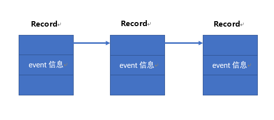

#### Event queue

每个record都有一个类型，相同类型的record会被链在一起，然后通过一个event queue来管理。驱动里共维护了30个这样的event queue，正好和GPU的event指令表示的范围相吻合。如下图：

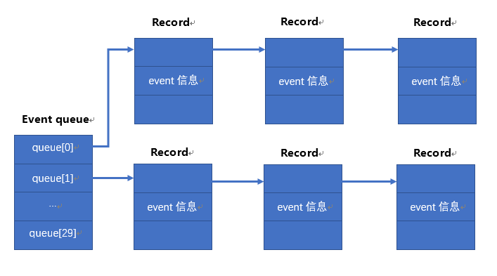

### Command queue执行流程分析

#### command queue初始化

初始化很简单，就是在command queue中添加了wait/link指令。wait指令的作用是让GPU空闲n个周期，link指令指向的是command queue中wait指令的地址，这样就形成了一个“闭环”，GPU就不会跑飞了，如下图所示：

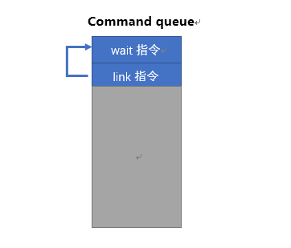

#### 在context buffer中添加link指令

context buffer中的link指令指向command buffer首地址：

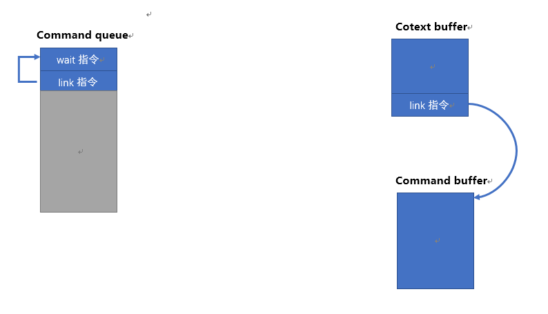

#### 再次添加wait/link指令

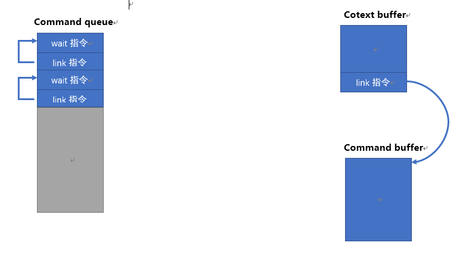

#### 在command buffer中添加link指令

command buffer中的link指向command queue中的wait指令地址：

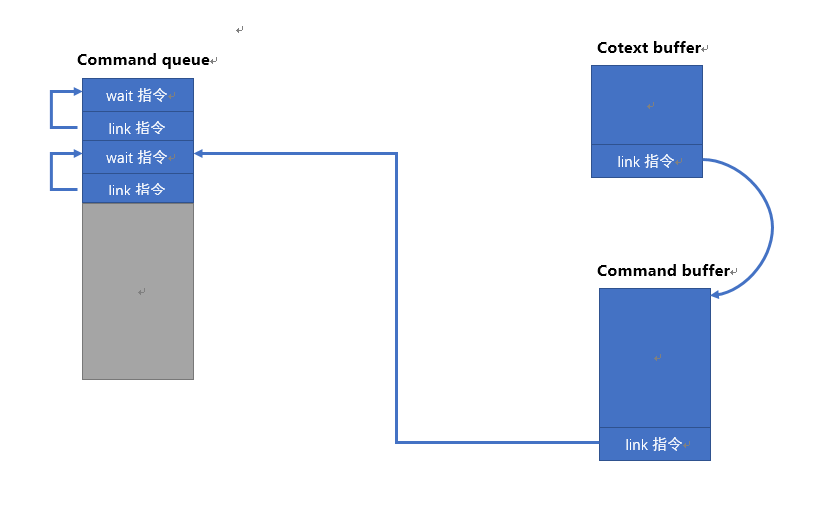

#### 将command queue中此时第一个wait指令改成link指令

command queue中改完后的link指令指向context buffer首地址，从此刻开始，GPU就跳转到context buffer中运行了：

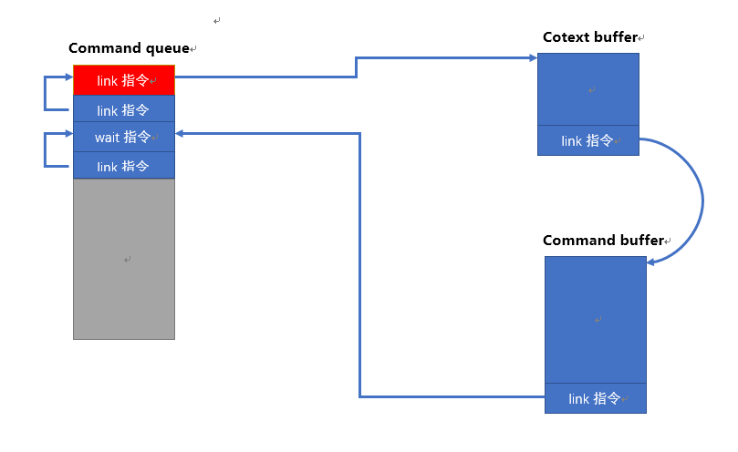

#### 在command queue中添加event指令

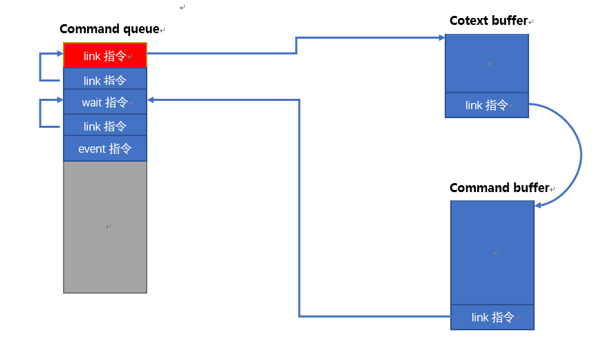

#### 再次添加wait/link指令

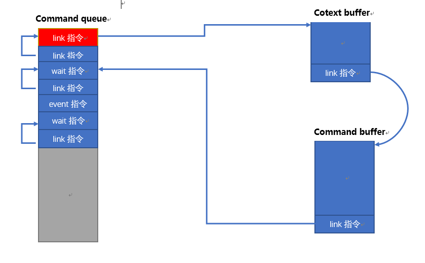

#### 将此时command queue中的第一个wait指令改成link指令

command queue中改完后的link指向command queue中的event指令地址：

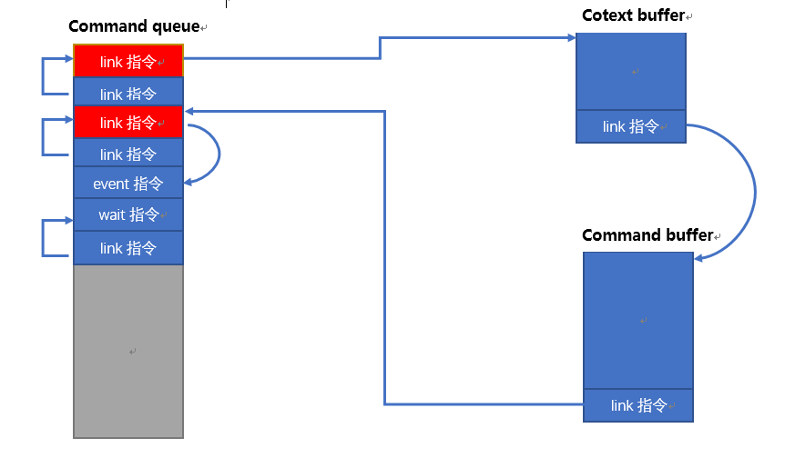

## LLVM

### LLVM编译器框架

LLVM编译器的大致组成如下：

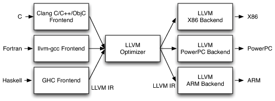

- 不同语言编写的源文件被翻译成未被优化的LLVM IR
- LLVM IR经过优化生成优化后的LLVM IR
- 优化后的LLVM IR再翻译成具体的平台机器码

这里介绍一下IR是什么，IR全称为Intermediate Representation，指的是编译器对于源程序进行扫描后生成的内部表示，代表源程序的语义和语法结构，编译器的各个阶段都在IR上进行分析或优化变换，它对编译器的整体结构、效率和健壮性都有着极大的影响，并对编译器的可移植性以及代码生成起到关键作用。

不同的编译器的实现使用了不同的IR，并且可能使用不止一种IR。比如LLVM使用的是LLVM IR，GCC使用了AST/GENERIC、GIMPLE、RTL三种IR。

### LLVM编译器总结

我们这里不考虑交叉编译，仅讨论在x86平台的编译情况。以C语言为例，C语言程序的编译器运行的平台为x86 cpu，编译后的C语言程序的执行平台是x86 cpu，编译器本身的运行方式是作为另外的可执行程序运行。总结以上三点是为了方便和后面文章中的GLSL语言还有OpenCL C语言做对比。如下所示:

| 编译器名字         | LLVM CLANG                 |
| ------------------ | -------------------------- |
| 编译器作用         | 将C语言翻译成x86 cpu机器码 |
| 编译器运行平台     | x86 cpu                    |
| 编译后程序运行平台 | x86 cpu                    |
| 编译器运行方式     | 可执行程序                 |

## OpenGL

### OpenGL渲染管线

管线的英文名叫pipeline，其实翻译成流水线更贴切形象一点，渲染管线就是图形图像从数据一步一步形成最终输出的画面所要经历的各种操作过程。数据经过一个操作后，被处理成下一个步骤需要的数据，最终一步一步整合成拼凑最终画面的元素。通常来讲，以下两个大步骤是必要的：

- 顶点渲染：用于渲染出形状
- 像素渲染：在形状中填充色彩

所以可以简单地认为，渲染管线就是：


顶点渲染和像素渲染是图形渲染流水线中最重要的两个步骤，这两步发生在GPU硬件上，本质上就是GPU硬件在执行GPU硬件指令的操作。

类似于C语言的作用，为了对不同的GPU硬件提供统一的顶点渲染和像素渲染编程方式，OpenGL的维护组织Khronos Group制定了GLSL语言规范。GLSL全称为OpenGL Shading Language，针对顶点渲染步骤使用GLSL编写的源程序叫做Vertex Shader（顶点着色器），针对像素渲染步骤使用GLSL编写的源程序叫做Pixel Shader（像素着色器）。

### Shader

通过一个简单的示例来直观的感受下如何在OpenGL程序中使用Shader：

```
///
// Initialize the shader and program object
//
int Init ( void)
{
   char vShaderStr[] =
      "#version 300 es                          \n"
      "layout(location = 0) in vec4 vPosition;  \n"
      "void main()                              \n"
      "{                                        \n"
      "   gl_Position = vPosition;              \n"
      "}                                        \n";

   char fShaderStr[] =
      "#version 300 es                              \n"
      "precision mediump float;                     \n"
      "out vec4 fragColor;                          \n"
      "void main()                                  \n"
      "{                                            \n"
      "   fragColor = vec4 ( 1.0, 0.0, 0.0, 1.0 );  \n"
      "}                                            \n";

   GLuint vertexShader;
   GLuint fragmentShader;
   GLuint programObject;

   // Load the vertex/fragment shaders
   vertexShader = LoadShader ( GL_VERTEX_SHADER, vShaderStr );
   fragmentShader = LoadShader ( GL_FRAGMENT_SHADER, fShaderStr );

   // Create the program object
   programObject = glCreateProgram ( );
   
   glAttachShader ( programObject, vertexShader );
   glAttachShader ( programObject, fragmentShader );

   // Link the program
   glLinkProgram ( programObject );
   
   // Use the program object
   glUseProgram ( programObject );
}
```

假设以上的代码截取自demo.c源文件，对这个示例代码的说明如下:

- vShaderStr字符串表示的就是顶点着色器源码，fShaderStr字符串表示的就是像素着色器源码
- GLSL语言类似于C语言，每个着色器都必须包含main函数
- 通过自定义的函数LoadShader 加载顶点着色器和像素着色器，在本示例中，着色器是直接以字符串源码形式在demo.c中提供，也可以将着色器写在单独的文件中，然后在demo.c中通过打开文件->读取文件中内容->然后加载着色器来实现
- 着色器加载好之后需要进行编译，使用OpenGL接口glLinkProgram 来实现这一目的

可以看出，GLSL程序的编译类似于C语言程序的编译，只不过C语言程序的编译是通过可执行编译器程序实现，而GLSL程序的编译通过调用一系列的OpenGL接口来实现。

### OpenGL驱动

OpenGL规范其实包含两个部分：

- OpenGL API规范，使用OpenGL API编写的程序叫做OpenGL程序，比如上面的示例demo.c，是在CPU上运行的
- GLSL规范，符合GLSL规范的程序叫做Shader程序，分为顶点Shader和像素Shader，是在GPU上运行的

OpenGL的驱动主要就有两大功能：

- 实现OpenGL API
- 实现GLSL编译器，用于将GLSL程序编译成具体的GPU硬件指令

如下图所示：

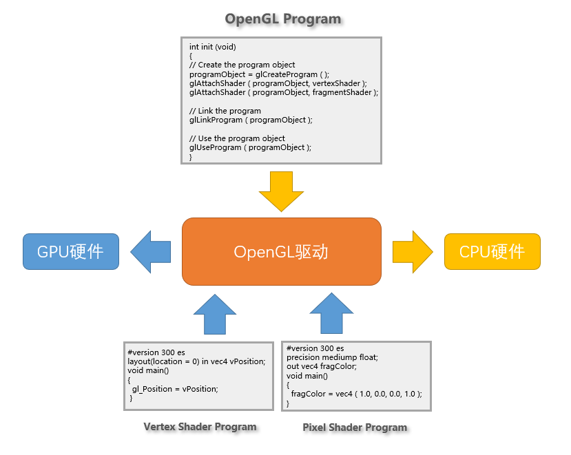

GLSL编译器一般在OpenGL驱动中以动态库形式提供，比如对于vivante公司实现的OpenGL驱动中的libGLSLC.so就是GLSL编译器。可以看出，GLSL程序的编译是在OpenGL程序运行时编译，从某种角度来说，GLSL程序的编译属于跨平台编译，因为编译发生在CPU平台，运行发生在GPU平台。

### GLSL编译器

类似于LLVM编译器，GLSL编译器编译流程也大致分为三步，如下：

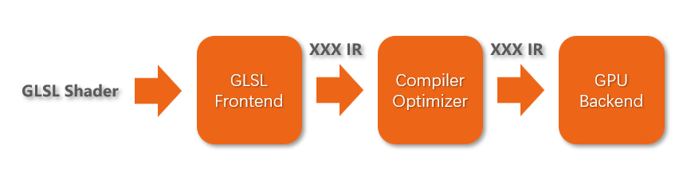

- GLSL程序被翻译成某种IR
- 对IR进行优化
- 将优化后的IR翻译成具体的GPU硬件指令

不同的GLSL编译器会使用不同的IR，我们这里介绍Mesa中的GLSL编译器的基本组成。

由于历史的原因，Mesa的GLSL针对不同的GPU使用不同的IR来优化，这里以AMD的GPU为例来说明，如下图所示：

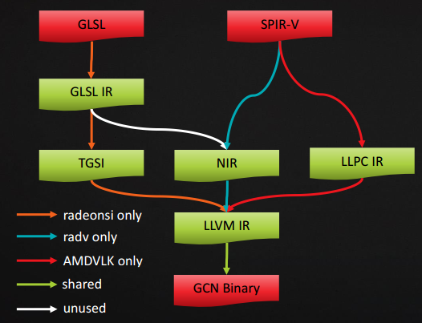

- GLSL程序首先翻译成GLSL IR
- GLSL IR又翻译成TGSI IR
- TGSI IR翻译成LLVM IR
- LLVM IR最终翻译成AMD GPU的指令，AMD GPU指令使用的是GCN架构

SPIR-V是Vulkan和OpenCL中使用的IR，在后面会介绍。

## Vulkan

### Vulkan简介

Vulkan是Khronos组织制定的“下一代”开放的图形显示API，是与DirectX12能够匹敌的GPU API标准。

这里我们仅仅讨论Vulkan着色器相关内容，与OpenGL的着色器需要使用GLSL语言编写不同的是，Vulkan着色器必须以二进制字节码的格式使用，而不是像GLSL这样具有比较好的可读性的语法。此字节格式称为SPIR-V，它可以与Vulkan和OpenCL一同使用。这是一种可以编写图形和计算着色器的格式。

使用二进制字节码格式的优点之一是使得GPU厂商编写将着色器代码转换为本地代码的编译器复杂度减少了很多。经验表明使用可读性比较强的语法，比如GLSL，一些GPU厂商能相当灵活地理解这个标准。这会导致一种情况发生，比如编写好，并在一个厂商的GPU运行的不错的着色器程序，可能在其他的GPU厂商的GPU驱动程序上运行异常，可能是语法的问题，或者更糟的是不同GPU厂商编写的编译器差异，导致着色器运行错误。如果直接使用编译好的二进制字节码格式，可以避免这种情况。

但是，并不意味着我们要手写字节码。Khronos发布了与厂商无关的编译器，它将GLSL编译成SPIR-V。该编译器用于验证着色器代码是否符合标准，并生成与Vulkan功能运行的SPRIR-V二进制文件。除此之外还可以将此编译器作为库在运行时编译生成SPRI-V，安卓平台就是如此使用。

### Vulkan中编译框架

由于Vulkan规范中规定了Vulkan接口只能使用SPIR-V IR，所以Vulkan驱动省去了从GLSL语言编译成SPIR-V IR这一编译前端的工作，而只需要实现SPIR-V IR的优化和SPIR-V IR转换成具体的GPU硬件指令这两步骤，如下所示：

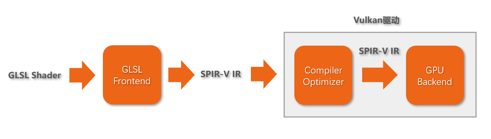

下面这张图能更详细的展示这种关系：

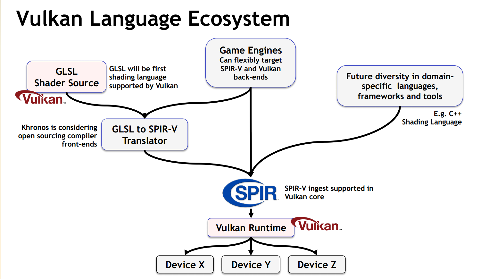

在实际的Vulkan驱动中，可能会将SPIR-V IR进一步转换成其他IR来进行优化，比如在Mesa的AMD GPU的Vulkan驱动中就将SPIR-V转换成LLVM IR进行优化，如下所示：


- 首先将SPIR-V IR转换成LLPC IR
- 接着将LLPC IR转换成LLVM IR
- 最后将LLVM IR转换成GCN指令

## OpenCL

### OpenCL简介

OpenCL 是由 Khronos Group 针对异构计算设备（heterogeneous device）进行并行运算所设计的标准 API 以及程式语言。

OpenCL 程序分成两部分：一部分是在设备上执行的（例如 GPU），另一部分是在主机上（CPU）运行的。在设备上执行的程序就是实现“异构”和“并行计算”的部分。 为了能在设备上执行代码，程序员需要写一个特殊的程序（kernel 程序）。这个程序需要使用 OpenCL 语言编写。 OpenCL 语言采用了 C 语言的一部分加上一些约束、关键字和数据类型。在主机上运行的程序用 OpenCL 的 API 管理设备上运行的程序。主机程序的 API 用 C 语言编写，也有 C++、 Java、 Python 等高级语言接口。

设计OpenCL的目的主要有两个：

- 并行计算
- 同一份代码在不同的平台（异构）都能执行

OpenCL的根本目的就是针对并行计算提供一个统一的编程方式，从而方便对使用不同类型的并行计算硬件进行编程，这些硬件设备有多核CPU、GPU、FPGA、DSP、其他形式硬件等。如下所示：

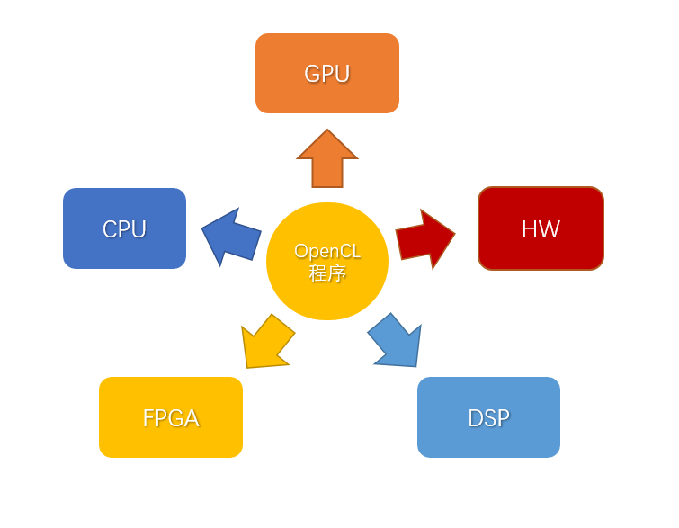

### Kernel程序

在OpenGL规范中，针对在GPU硬件上的编程提出了GLSL语言规范，同样的，在OpenCL规范中，针对在不同的并行计算设备上编程提出了“OpenCL C”语言规范。此语言设计参考了C语言，使用“OpenCL C”语言写的程序叫做kernel程序。通过一个简单的示例来直观的感受下如何在OpenCL程序中使用kernel程序。

```
void Init (void)
{
    char *kernelSource =
        "__kernel void test(__global int *pInOut)\n"
        "{\n"
        " int index = get_global_id(0);\n"
        " pInOut[index] += pInOut[index];\n"
        "}\n";
   
    cl_program program = NULL;
   
    // create program
    program = clCreateProgramWithSource(context, 1, (const char**)&kernelSource, NULL, &ret);

    // build program
    clBuildProgram(program, 1, &device_id, NULL, NULL, NULL);
}
```

假设以上的代码截取自demo.c源文件，对这个示例代码的说明如下:

- kernelSource字符串表示的就是OpenCL kernel程序源码
- 通过OpenCL接口clCreateProgramWithSource来加载kernel源码
- kernel源码加载好之后需要进行编译，使用OpenCL接口clBuildProgram来实现这一目的

### OpenCL驱动

OpenCL规范其实包含两个部分：

- OpenCL API规范，使用OpenCL API编写的程序叫做OpenCL程序，比如上面的示例demo.c，是在CPU上运行的
- OpenCL C规范，符合OpenCL C规范的程序叫做kernel程序，是在并行计算设备上运行的

OpenCL的驱动主要就有两大功能：

- 实现OpenCL API
- 实现OpenCL C编译器，用于将kernel程序编译成具体的并行计算设备硬件指令

如下图所示：

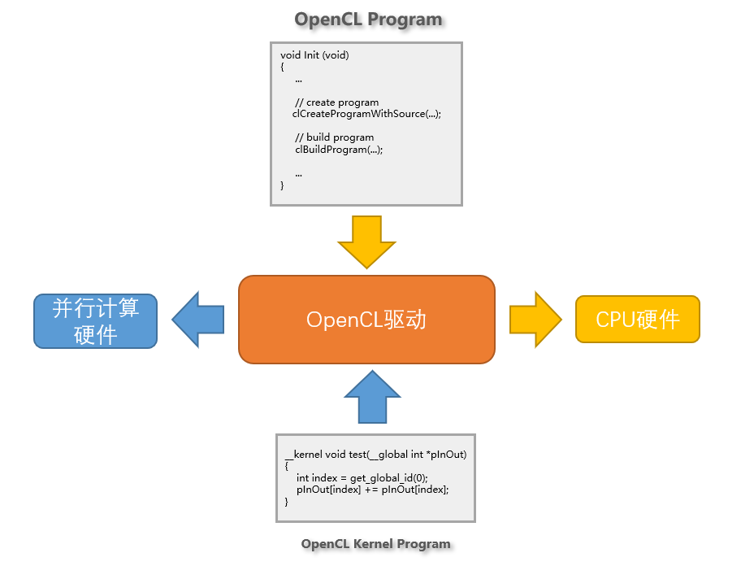

### OpenCL编译器

这里主要讨论OpenCL 2.1版本之后的编译框架。OpenCL 2.1相比于之前的版本增加了两大功能：

- 制定了OpenCL C++语言规范，之前的Kernel程序都是用OpenCL C语言编写的，现在可以使用OpenCL C++语言编写
- OpenCL接口可以直接识别加载SPIR-V IR，然后编译成kernel程序在并行计算设备上执行

详细的框架如下所示：

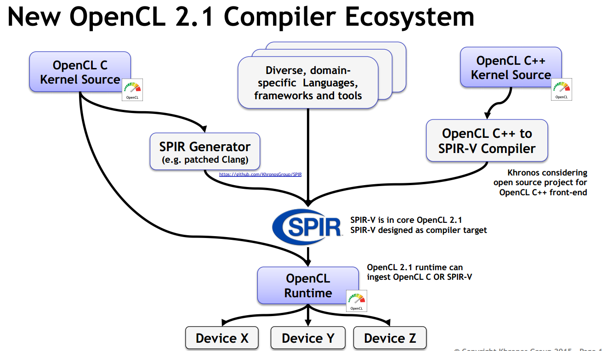

从上图中可以看出以下几点信息：

- 用OpenCL C++语言编写的kernel程序必须编译成SPIR-V格式的IR给OpenCL接口使用
- 用OpenCL C语言编写的kernel程序可以直接传给OpenCL接口使用（主要是为了兼容考虑），也可以编译成SPIR-V格式的IR给OpenCL接口使用
- OpenCL 2.1版本的驱动能处理OpenCL C和SPIR-V格式的kernel程序

从OpenCL 2.1版本的编译框架改动来看，Khronos组织希望使用SPIR-V这一IR来统一Vulkan和OpenCL的中间表示语言。Khronos提供了一个名为SPIR-V generator/Clang的基于LLVM的编译器，用于将用OpenCL C和OpenCL C++语言编写的kernel源码编译成SPIR-V格式的二进制文件。

## Wayland窗口系统

### 窗口系统

#### 窗口系统简介

任何窗口系统的主要组件通常称为显示服务器(Display Server)，也可以称作窗口服务器(Window Server)或合成器(Compositor)。在窗口中运行并显示其GUI的任何应用程序都是显示服务器的客户端。显示服务器及其客户端通过通信协议相互通信，通信协议通常称为显示服务器协议(Display Server Protocol)。显示服务器接收并处理输入事件，例如键盘、鼠标或触摸屏并将其传递给正确的客户端，显示服务器还负责将客户端内容输出到显示器。如下所示：

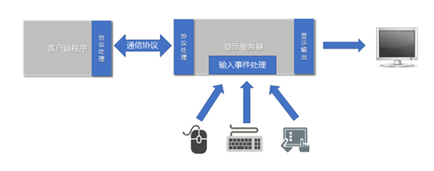

#### 不同OS平台的窗口系统

##### X Window System

X窗口系统用于类Unix操作系统，使用C/S模型，服务器接受图形输出请求并且分发用户输入事件。服务器和客户端之间的通信协议可以通过网络进行操作：客户端和服务器可以在同一台机器上运行，也可以在不同的机器上运行，可能使用不同的架构和操作系统。如下所示：

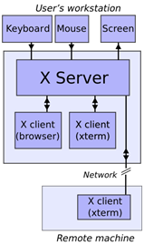

##### Desktop Window Manager

DWM是微软Windows系统中的窗口管理器，它最初是为了实现新的“ Windows Aero ”用户体验的一部分而创建的，这允许诸如透明度，3D窗口切换等效果。DWM以不同的方式工作，具体取决于操作系统（Windows 7或Windows Vista）以及它使用的图形驱动程序版本（WDDM 1.0或1.1）。在Windows 7和WDDM 1.1驱动程序下，DWM仅将程序的缓冲区写入视频RAM，即使它是图形设备接口（GDI）程序。这是因为Windows 7为GDI 支持（有限的）硬件加速，并且这样做不需要在系统RAM中保留缓冲区的副本，以便CPU可以写入它。


##### Quartz Compositor

Quartz Compositor是macOS中的显示服务器（同时也是合成窗口管理器）。Quartz 2D，OpenGL，Core Image，QuickTime或其他进程的位图输出被写入特定的内存位置或后备存储区。然后，Compositor从后备存储区中读取数据，并将每个数据组合成一个用于显示的图像，将该图像写入图形卡的帧缓冲存储区。Quartz Compositor只接受栅格化数据，是唯一可以直接访问图形帧缓冲区的进程。

在管理单个窗口时，Quartz Compositor 从其渲染器接受窗口内容的位图图像及其位置。渲染器的选择取决于单个应用程序，尽管大多数使用Quartz 2D。

作为窗口管理器，Quartz Compositor还有一个事件队列，用于接收事件，例如击键和鼠标点击。Quartz Compositor从队列中获取事件，确定哪个进程拥有事件发生的窗口，并将事件传递给进程。

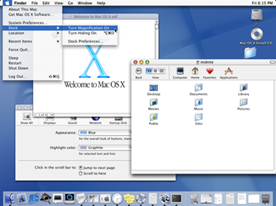

### Wayland

#### Wayland简介

Wayland是一个合成器与客户端通信的窗口协议，以及该协议的C库实现。合成器可以是在Linux内核模式设置和evdev输入设备，X应用程序或Wayland客户端本身上运行的独立显示服务器。客户端可以是传统应用程序，X服务器或其他显示服务器。

Wayland协议遵循C/S模型，其中客户端是请求在屏幕上显示像素缓冲区的图形应用程序，并且服务器（合成器）是控制这些缓冲区的显示的服务提供者。

#### Wayland架构

##### Wayland整体架构

通过跟踪从输入设备活动到其影响屏幕上的内容这一整个过程来了解Wayland架构是一个不错的方法。如下所示：

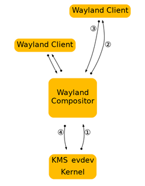

- 内核获取一个事件并将其发送给合成器
- 合成器将该事件发送给需要处理该事件的客户端
- 当客户端收到事件时，它会更新UI作为响应。接着客户端向合成器发送请求以指示其UI区域已经更新
- 合成器收到客户端UI已更新请求，然后重新合成屏幕内容

##### Wayland协议架构

Wayland参考实现被设计为两层协议：

- 一种底层协议，用于处理两个进程（客户端和合成器）之间的进程间通信，以及它们交换的数据的序列化过程。该层是基于消息的，通常使用内核IPC服务实现，比如Unix domain sockets。
- 构建在其上的高级层协议，用于处理客户端和合成器需要交换的信息，以实现窗口系统的基本功能。该层实现为“异步面向对象的协议”。

Wayland协议的参考实现分为两个库：Wayland客户端调用libwayland-client库，Wayland合成器调用libwayland-server库。如下所示：

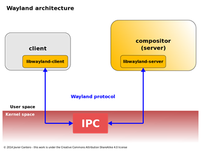

##### Wayland渲染方式

在Wayland架构中，客户端窗口内容的渲染是由客户端自己负责的，客户端可以使用软件渲染，也可以使用硬件渲染，比如OpenGL。它知道如何编程硬件并直接渲染到缓冲区。合成器反过来可以获取缓冲区，并将其用作纹理用于合成桌面。在初始设置之后，客户端只需要告诉合成器使用哪个缓冲区以及它何时何地将新内容呈现到其中。

这使应用程序有两种方法来更新其窗口内容：

- 将新内容渲染到新缓冲区并告诉合成器使用新的而不是旧缓冲区。应用程序可以在每次需要更新窗口内容时分配新的缓冲区，或者它可以保留两个（或更多）缓冲区并在它们之间循环使用。缓冲区管理完全受应用程序控制。
- 将新内容渲染到之前告诉合成器要使用的缓冲区中。虽然可以直接渲染到与合成器共享的缓冲区，但这可能会与合成器产生竞争。可能发生的情况是，重新绘制窗口内容可能会被重构桌面的合成器中断。如果应用程序在清除窗口之后但在渲染内容之前被中断，则合成器将从空白缓冲区进行纹理处理。结果是应用程序窗口将在空白窗口或半渲染内容之间闪烁。避免这种情况的传统方法是将新内容渲染到后台缓冲区，然后从那里复制到合成器。后台缓冲区可以在运行中分配，并且足够大以容纳新内容，或者应用程序可以保留缓冲区。同样，这也是由应用程序控制。

在任何一种情况下，应用程序必须告诉合成器哪个区域包含新内容。当应用程序直接呈现给共享缓冲区时，需要将更新的内容通知合成器。但是，当交换缓冲区时，合成器不会假设任何更改，并且在重新绘制桌面之前需要接受来自应用程序的请求。

##### Wayland项目组成

Wayland项目主要由4个部分组成：Wayland协议、Wayland参考C库实现、Wayland合成器参考实现Weston、Wayland和Weston一些demo。如下所示：

- Wayland协议：合成器和客户端通信的协议。
- Wayland参考C库实现：有4个库，libwayland-client、libwayland-server、libwayland-cursor、libwayland-egl。
- Weston：主要包括窗口管理（shell），合成器（compositor）和输入管理几个部分。
- Demo：主要是一些简单的客户端用例，用于测试Wayland协议以及Weston合成器。

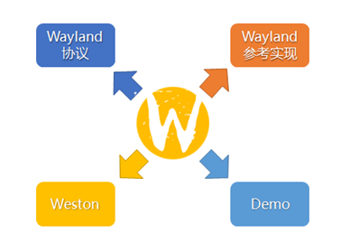

### Wayland协议

#### 基本概念

Wayland协议被描述为“异步面向对象的协议”。 面向对象意味着合成器提供的服务是以一系列对象呈现的。每个对象实现一个接口，该接口具有名称，许多方法（称为请求）以及若干相关事件。客户端发往服务端的操作成为请求(request)，反之成为一个事件(event)。每个请求和事件都有零个或多个参数，每个参数都有一个名称和一个数据类型。在请求不必等待同步回复或ACK这个意义上，协议是异步的，从而避免了往返延迟时间并提高了性能。如下所示：

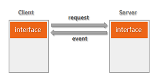

如果对象的接口支持该请求，Wayland客户端可以对某个对象发出请求（方法调用）。客户端还必须为此类请求的参数提供所需的数据。这是客户端从合成器请求服务的方式。合成器通过对象发出事件（也可能带有参数）将信息发送回客户端。这些事件可以由合成器发出，作为对特定请求的响应，或者异步地发生（例如来自输入设备的事件）或状态更改事件。错误事件也由合成器发出。

为了使客户端能够向对象发出请求，它首先需要告诉服务器它将用于标识该对象的ID号。合成器中有两种类型的对象：全局对象和非全局对象。合成器在创建客户端时（以及在销毁它们时）将全局对象通告给客户端，而非全局对象通常由已作为其功能的一部分的其他对象创建。

接口以及其请求和事件是定义Wayland协议的核心元素。协议的每个版本都包含一组接口，以及它们的请求和事件。另外，Wayland合成器也可以定义和实现自己的接口以用来支持新请求和事件，从而将功能扩展到核心协议之外。为了便于更改协议，每个接口除了名称外还包含“版本号”属性，此属性允许区分同一接口的不同变体。

#### 生成协议头文件

Wayland协议定义为xml格式文件，文件在protocol目录，通信协议实现在src目录。它主要编译出三个库，libwayland-client，libwayland-server和libwayland-cursor。第一个为协议的client端实现，第二个为协议的server端实现，第三个是协议中鼠标相关处理实现。编译时会首先编译出wayland-scanner这个可执行文件，它利用expat这个库来解析xml文件，将wayland.xml生成相应的wayland-protocol.c，wayland-client-protocol.h和wayland-server-protocol.h。它们会被Wayland的client和server在编译时用到。同时wayland-scanner在生成Weston中的Wayland扩展协议中起同样作用。如下所示：

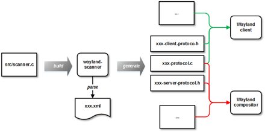

#### 协议通信信息格式

Wayland协议是一种异步面向对象的协议。所有请求都是对某些对象的方法调用。请求包含唯一标识服务器上对象的对象ID。每个对象都实现一个接口，请求包含一个操作码，用于标识要调用的接口中的哪个方法。

该协议是基于消息的。客户端发送到服务器的消息称为请求。从服务器到客户端的消息称为事件。消息有许多参数，每个参数都有一定的类型。

每条消息有3个部分组成，如下所示：

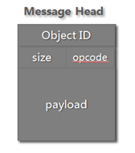

##### 信息头部

信息头部由两个部分组成：

- 第一个字数据表示发送对象的ID(32位数据)。
- 第二个字数据由2个16位数据组成。高16位数据表示整条信息的大小，以字节为单位；低16位数据表示发送的请求或者事件的操作码。

##### 信息主体

余下的数据称之为payload区域，存放着请求/事件的参数值。每个参数都是32位数据对齐的，如果不对齐需要填充数据对齐，填充的数值未作规定，默认是0。

传输的参数的类型共有8种，如下所示：

- int,uint：表示有符号/无符号32位数据的值。
- fixed：它是带符号的十进制类型，提供1位符号位，23位整数精度和8位小数精度。可以通过相关API和double、int类型数据相互转换。
- string：以无符号32位长度开始，然后跟着字符串内容，包括终止空字符，然后填充对齐到32位边界。如下所示：


- object：32位对象ID。
- new_id：同样还是32位对象ID。当客户端发起请求时(该请求需要服务端创建新对象以和客户端一一对应)，客户端确定对象ID，接着将此ID告知服务端，服务端用此ID创建和客户端一一映射的对象。
- array：以无符号32位长度开始，然后跟着数组内容，然后填充对齐到32位边界。如下所示：


- fd：文件描述符不存储在payload中，而是存储在UNIX domain socket消息的辅助数据中(msg_control)。

#### 协议接口

协议接口(interface)是客户端和服务端交互的入口。每个接口都有自己的名字、版本、方法表(request请求表)、事件表(event事件表)等信息。Wayland协议包含了一系列核心接口，比如wl_display、wl_registry等。通过一个给定的接口就可以知道该接口有哪些方法和事件，这是最重要的两个属性。

##### wl_display

我们主要关注下接口中有哪些reauest和event。

Request：

- sync：同步请求。该请求返回一个wl_callback对象。这个接口的作用是提供客户端一个确认它前面所有的请求都被处理的保证。
- get_registry：此请求创建并返回一个wl_registry对象，该对象允许客户端列出并绑定合成器中可用的全局对象(服务)。

Event：

- error：用于发生不可恢复错误时发送错误事件。
- delete_id：当客户端删除对象时，服务器将发送此事件以确认客户端已看到删除请求。当客户端收到此事件时，它将知道它可以安全地重用对象ID。

##### wl_registry

Request：

- bind：使用指定的名称作为标识符，将新的客户端创建的对象绑定到服务器。

Event：

- global：通知客户端服务端有哪些全局对象。
- global_remove：通知客户端已删除的全局对象。此事件通知客户端全局对象不再可用。如果客户端使用绑定请求绑定到全局对象，则客户端现在应该销毁该对象。该对象仍然有效，但对该对象的请求将被忽略，直到客户端销毁该对象。

##### wl_callback

Request：

- 无。

Event：

- done：完成相关请求后通知客户端。

##### wl_compositor

Request：

- create_surface：让合成器创建一个新的surface，此请求返回一个wl_surface对象。此surface表示窗口中的内容，不代表窗口本身，窗口本身由另外一个对象表示。
- create_region：让合成器创建一个新的region，此请求返回一个wl_surface对象。这个对象的作用是描述一块wl_surface 上的区域，以便对这个区域进行操作。

Event：

- 无。

##### wl_shm_pool

wl_shm_pool封装了合成器和客户端之间共享的一块内存。通过wl_shm_pool，客户端可以分配共享内存wl_buffer。通过同一个池创建的所有对象共享相同的底层映射内存。重复利用映射内存在交互式调整surface大小或许多小缓冲区时非常有用。

Request：

- create_buffer：通过共享内存的空间来创建窗口绘制使用的 wl_buffer。
- destroy：请求销毁共享内存池。当从此池创建的所有缓冲区都消失后，将释放已经映射的内存。
- resize：此请求将使服务器从使用新的大小重新映射共享内存。此请求只能用于使池更大的请求。

Event：

无。

##### wl_shm

Request：

- create_pool：创建一个新的wl_shm_pool对象。该池可用于创建基于共享内存的缓冲区对象。服务器和客户端通过mmap文件描述符fd来实现内存共享。

Event：

- format：通知客户端有关可用于缓冲区的有效像素格式。已知格式包括argb8888和xrgb8888。

##### wl_buffer

缓冲区为wl_surface提供内容。缓冲区是通过接口创建，例如wl_drm，wl_shm等。它具有宽度和高度，可以附加到wl_surface，但是客户端提供和更新内容的机制由缓冲区接口定义。

Request：

- destroy：请求销毁一个wl_buffer。

Event：

- release：当合成器不再使用此wl_buffer时发送此事件。客户端然后可以自由地重用或销毁此缓冲区及其后备存储区。

#####  wl_shell

这个是管理真正窗口的服务接口类。 通过这个接口，可以创建某一个wl_surface显示用窗口。目前该接口已经被官方放弃，建议使用xdg_shell替代。

Request：

- get_shell_surface：请求创建指定wl_surface 的显示窗口对象wl_shell_surface。 一般情况下，一个wl_surface对应一个wl_shell_surface。

Event：无。

##### wl_shell_surface

此接口提供了处理窗口的请求，比如设置为顶层窗口、最大化、全屏化等。

Reauest：

- pong、move、resize、set_toplevel、transient、set_transient、set_fullscreen、set_popup、set_maximized、set_title、set_class。

Event：

- ping、configure、popup_done。

##### wl_surface

surface是显示在屏幕上的矩形区域。它具有位置，大小和像素内容。此接口提供对窗口内容的操作，比如销毁、缩放等。

Request：

- destroy、attach、damage、frame、set_opaque_region、set_input_region、set_buffer_transform、set_buffer_scale、damage_buffer、commit。

Event：

- enter、leave。

#### 协议对象

协议对象在服务端和客户端是一一对应的，并且协议对象是对接口的进一步封装。每个对象都有一个ID，此ID在服务端和客户端是相同的(其实就是数组下标)，用于将两边的对象进行一一映射。

对象在服务端分为两类，全局对象和非全局对象。全局对象代表着服务端能提供的服务，比如wl_compositor、wl_shm、wl_shell等。非全局对象由wl_display接口对象创建出来。

### Wayland协议实现浅析

#### 几个重要的数据结构

##### wl_object

wl_object是一个很重要的数据结构，在客户端和服务端都有此数据结构的封装，是wl_proxy、wl_resource数据结构的第一个成员，wayland中所有对象的概念都是基于wl_object而言的。wl_object包括interface、implementation、id三个重要成员，每个成员的作用如下：

- interface：是客户端和服务端交互的接口。Interface主要包含以下几项内容：

1. name：接口的名字。
2. version：此接口的版本号。
3. request信息表：用于表明有哪些request以及每项request具体参数的类型。
4. event信息表：类似request信息表，用于表明有哪些event事件以及每项event具体参数的类型。

- implementation：在服务端此成员表示request方法的具体实现，在客户端此成员表示event事件的具体实现。
- id：该object的ID，用于client/server端索引此object，服务端和客户端就是通过此ID建立映射。

如下所示：

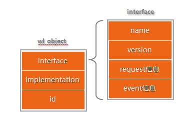

##### wl_proxy

这是wl_object在客户端的封装，wayland客户端的对象都是对wl_proxy进一步的封装。wl_proxy主要包含以下成员：

- object：wl_object，通过此成员可以获得interface等信息。
- display：wl_display，服务端和客户端启动后最先创建的就是wl_display。
- version：对象的版本。

##### wl_resource

这是wl_object在服务端的封装，wayland服务端的对象都是对wl_resource进一步的封装。wl_resource主要包含以下成员：

- object：wl_object，通过此成员可以获得interface等信息。
- destroy：用于对象销毁时回调的销毁函数。
- link：用于将对象连接成链表。
- client：wl_client，每有一个客户端连接到服务端时，在服务端就会创建一个wl_client结构，用于表示客户端的信息。

##### wl_global

wl_global用于表示服务端的全局对象，一个全局对象就表示服务端提供的一个服务，比如wl_compositor、wl_shm、wl_shell等。wl_global主要包括以下内容：

- display：wl_display，服务端和客户端启动后最先创建的就是wl_display。
- interface：wl_interface，客户端和服务端交互的接口。
- name：全局对象的名字。
- version：全局对象的版本。
- bind：在wl_registry接口进行bind这个request这个操作时会回调wl_global中的bind回调函数。
- link：用于将全局对象连接成链表。

##### wl_array

动态数组，数组中的每一项内容都是服务端和客户端对象数据结构的地址，也就是说，wl_array其实就是一个指针数组。在服务端和客户端的对象通过数组下标建立映射关系，也就是说，同一个对象在服务端和客户端数组中的位置是相同的，这样在client/server两端进行对象传递时，只需要传递数组下标就可以了。当数组内容满了的时候，如果继续插入数据会自动扩充数组的大小。wl_array的内容如下：

- size：数组已经使用的空间大小。
- alloc：整个数组的空间大小。
- data：实际数据缓存区地址。

client/server端的对象映射关系如下所示：

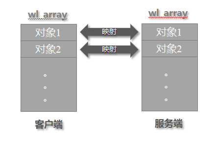

需要注意的是，不管服务端还是客户端，映射表中的第0项都是空的，新的对象从第一项开始。

##### wl_map

wl_map是对wl_array的封装，服务端和客户端都有此数据结构，主要成员如下：

- client_entries：wl_array类型，客户端使用。
- server_entries：wl_array类型，服务端使用。
- side：用于表示当前的wl_map是服务端还是客户端的。

##### wl_buffer

wl_buffer用于缓存客户端和服务端通信数据，通信数据格式见3.3章节。此buffer不同是环形缓冲区，不同于wl_array，如果填满了会回到起始处继续填充。wl_buffer包含的内容如下：

- data[4096]：这是4KB的缓存区。
- head：用于表示当前缓存中待发送数据的位置。
- tail：用于表示当前缓存中已经发送完后数据的位置。

##### wl_connection

wl_connection是对wl_buffer进一步的封装，当服务端和客户端需要发送和接受数据时，都会对wl_connection数据结构进行操作。wl_connection的内容如下：

- in：wl_buffer类型，用于缓存接受到的数据。
- out：wl_buffer类型，用于缓存发送的数据。
- fds_in：wl_buffer类型，如果要接收的数据有文件描述符类参数，缓存在fds_in中。
- fds_out：wl_buffer类型，如果要发送的数据有文件描述符类参数，缓存在fds_out中。
- fd：表示已经建立连接的socket fd。
- want_flush：表示缓存区中的数据是否需要强制发送。

客户端和服务端通信的示意图如下所示：

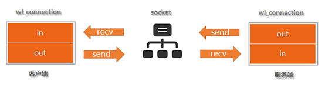

##### wl_event_source

wl_event_source由服务端使用，服务端启动后会通过epool机制等待一系列的事件信息，wl_event_source就表示某个等待的事件的信息，其内容如下：

- interface：wl_event_source_interface类型，当事件激活时会调用interface中的dispatch函数。
- loop：wl_event_loop类型，用于描述服务端循环等待事件的epool fd相关信息。
- link：用于形成链表。
- fd：等待的事件fd。

服务端真正使用的表示事件资源的数据结构会对wl_event_source做进一步封装，比如wl_event_source_fd，表示等待fd可读可写事件。wl_event_source_fd有一个func成员，此成员会被wl_event_source中的interface中的dispatch函数调用，比如当有客户端链接socket fd时，此回调函数是socket_data，当客户端有数据通信时，此回调函数是wl_client_connection_data。

#####  wl_closure

wl_closure用于表示函数调用信息和要调用的函数的参数信息。此数据结构是一个非常重要的数据结构，客户端和服务端在发送前都会先将数据组织到wl_closure数据结构中，然后由此数据结构解析到wl_connection中进行发送；接收时会将wl_connection中的原始数据解析成wl_closure数据结构，然后进行函数调用。

wl_closure内容如下：

- count：表示要调用的函数中的参数个数。
- message：表示request/event信息表。
- opcode：表示request/event信息表中的哪一个。
- sender_id：发送对象的ID。
- args[20]：函数调用的每个参数值都会存放在args数组中，每次最多20个参数。
- link：用于形成链表。
- proxy：表明是哪个对象。

通过wl_closure进行数据通信过程示意如下所示:

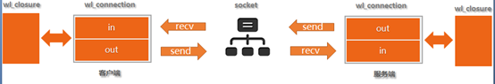

#### 几个重要的链表

##### global_list

global_list用于将服务端的所有全局对象连接成链表，在客户端进行获取注册表操作时会将全局对象链表中的每一个全局对象信息发送给客户端。global_list链表头是在服务端的wl_display数据结构中，如下所示：

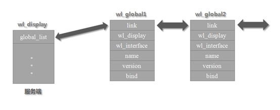

##### socket_list

服务端使用，socket_list用于将所有监听的socket信息连接成链表，一般情况下链表中只有一个监听的socket，名字默认为“wayland-0”，如下所示：

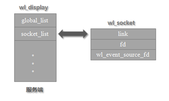

##### client_list

服务端使用，每当有一个客户端和服务端连接时，服务端就会创建一个wl_client数据结构，用于表示连接信息。wl_client主要包含以下内容：

- wl_connection：发送/接收数据都是缓存在wl_connection中。
- wl_event_source_fd：用于表示已经连接的client fd信息。
- wl_resource：服务端的wl_display对象。
- link：用于形成链表。
- wl_map：用于client/server进行映射对象。

如下所示：

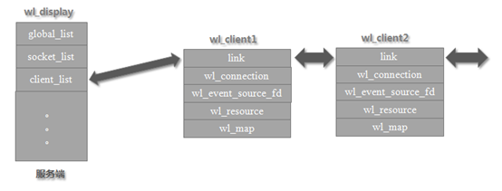

##### registry_resource_list

服务端使用，每当客户端发送get_registry这个request时，服务端都会创建一个新的wl_ resource对象，这些wl_ resource对象通过registry_resource_list形成链表，如下所示：

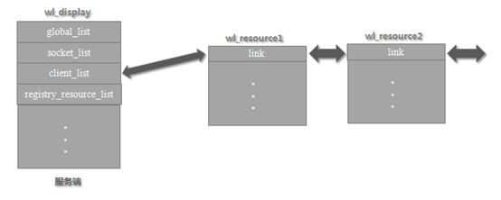

##### display_queue

客户端使用，当客户端收到服务端发送的数据后，将其解析成wl_closure数据结构，然后将wl_closure插入到display_queue中。随后在客户端dispatch_queue的时候会将display_queue中的wl_closure取出解析进行函数调用。如下所示：

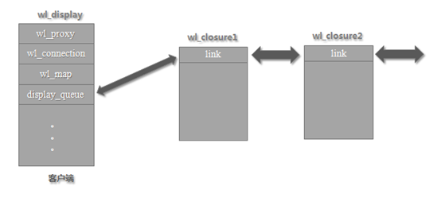

##### default_queue

default_queue作用和display_queue一样，只是在收到服务端发送的数据后，如果解析出的发送对象proxy就是客户端wl_display中的proxy，那么就会将wl_closure插入到display_queue中，否则插入到default_queue中。

dispatch_queue时会首先处理display_queue中的wl_closure，然后再处理default_queue中的wl_closure。

#### 跨进程调用

客户端和服务端跨进程进行函数调用的大致流程如下所示：

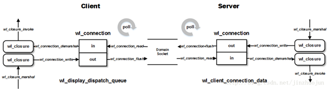

##### wl_closure_marshal()

创建wl_closure数据结构，并根据具体的参数初始化。客户端/服务端在发送数据之前都需要调用此函数将要发送的参数等信息组织到wl_closure数据结构中。

##### wl_connection_write()

将wl_closure数据结构解析成具体要发送的数据填入到wl_connection中。在这个函数中会将对象指针替换成对象ID，以及对fd类型参数做特殊处理等。

##### wl_conntction_flush()

将wl_buffer中缓存的数据通过sendmsg接口发送出去。

##### wl_connection_read()

通过recvmsg接口将socket中的数据接收到wl_buffer中。

##### wl_closure_demarshal()

将wl_connection缓存中的数据解析成wl_closure数据结构，用来传递给wl_closure_invoke进行函数调用。每一条IPC信息都会被解析成一个wl_closure数据结构。

##### wl_closure_invoke()

根据wl_closure数据结构进行真正的函数调用，注意，这个函数中使用了libffi接口以作为函数调用的跳板。

#### Server端IPC信息循环处理流程

- Server端在进行一些初始化操作之后会阻塞在wl_event_loop_dispatch中的epool_wait上。
- epool_wait主要在等待两个事件：

1. listen socket fd，如果有client连接，调用socket_data处理。
2. connect socket fd，如果有client传送数据，调用wl_client_connection_data处理。

#### Client端IPC信息循环处理流程

- Client端在进行初始化后调用wl_display_dispatch_queue。
- Client阻塞在wl_display_poll中的poll上，等待server端发送数据。
- 如果server端有数据传送，则调用read_events，最终调用到queue_event，主要做以下几件事：

1. 将收到的数据组织成wl_closure数据结构。
2. 将wl_closure插入到queue->event_list中。
3. 这里有两个queue：display_queue和default_queue。具体插到哪个queue请参见2.5和4.2.6章节。

- 调用dispatch_queue，首先处理display_queue，然后处理default_queue。主要是将queue中的wl_closure逐个进行解析，然后进行真正的函数调用。

#### 基于SHM机制传递窗口

- 客户端首先打开一个临时文件。
- 然后通过ftruncate改变文件的大小，这个大小根据实际的窗口大小决定。
- 客户端mmap临时文件fd，客户端通过socket机制将此fd发送给服务端。
- 服务端收到fd后，同样mmap此fd，那么客户端和服务端分别使用mmap后获得的地址来访问同一块共享内存区。
- 客户端对共享内存区进行渲染绘制，完成后通知服务端。
- 服务端拿到共享内存区数据进行合成。

#### Demo合成器、客户端实现简析

#### demo合成器分析

##### wl_display_create

此函数主要进行如下工作：

- 分配wl_display结构体空间。
- 初始化event_loop，event_loop是服务端用于循环处理各种等待事件的机制。
- 初始化global_list、socket_list等各种链表。
- 初始化shm formats array，这个数组中记录了服务端将以何种格式解析共享内存区中的数据。

##### wl_display_add_socket_auto

此函数主要进行如下工作：

- 创建wayland lock文件并锁住此文件，一般名为wayland-0.lock。
- 创建、绑定、监听socket，名字一般为wayland-0。
- 将上个步骤创建的wayland socket fd加入到epool中监听。
- 将wl_socket加入到display的socket_list链表中。

##### wl_global_create

这个函数负责创建全局对象并将其插入到链表中。

- 对interface的版本做检查。
- 创建struct wl_global结构体空间并初始化。
- 将全局对象插入到display中的global_list中。
- 创建新全局对象后，给每个客户端发送registry global事件，通知客户端服务端有新全局对象创建了。

demo合成器创建了3个全局对象：wl_compositor_interface、wl_shell_interface、wl_shm_interface。每个全局对象创建的时候都会有一个bind回调函数，此函数在wl_registry对象进行bind request操作时被调用，主要作用就是根据全局对象来创建其服务端对应的resource，并设置resource对应的request实现函数。

##### wl_display_init_shm

这个函数内部调用wl_global_create来创建wl_shm_interface全局对象。

##### wl_display_add_shm_format

此函数用来设置服务端支持的共享内存像素数据格式，默认支持ARGB8888和XRGB8888。

这个函数内部调用wl_array_add，用来在wl_array中预留指定大小的空间并返回此空间的地址，这样用户就可以通过这个地址向这个空间中填写数据。

##### wl_display_run

- 首先调用wl_display_flush_clients将client_list链表中所有客户端缓存区中的数据通过socket接口发送出去。
- 接着调用wl_event_loop_dispatch等待接收服务端的数据。等待的事件主要是：

1. listen socket fd，用于监听客户端连接，如果有连接，回调socket_data函数。
2. connect socket fd，用于处理客户端数据通信，如果有数据，回调wl_client_connection_data函数。

- 回到步骤1循环处理。

##### socket_data

- 通过accept获得与客户端通讯的fd。
- 创建wl_client结构，并初始化。
- 将wl_client结构插入client_list链表中。

##### wl_client_connection_data

- wl_connection_read：通过recvmsg将数据读取到wl_connection的缓存区中。
- wl_connection_demarshal：将数据组织成wl_closure结构。
- wl_closure_invoke：根据wl_closure结构进行函数调用。

#### demo客户端分析

##### wl_display_connect

- 连接到服务端创建的“wayland-0”socket接口。
- 创建并初始化wl_display数据结构。

##### wl_display_get_registry

- 向服务端发送wl_display对象的get_registry请求。
- 创建wl_registry对象。

##### wl_registry_add_listener

- 设置wl_registry对象的event实现函数。

##### wl_display_roundtrip

- 向服务端发送wl_display对象的sync请求。
- 创建wl_callback对象。
- 设置wl_callback对象的event实现函数。
- 将客户端缓冲区的数据通过socket发送出去。
- 等待接收服务端发送的数据。
- 处理服务端发送的事件。

##### create_window

- wl_compositor_create_surface：向服务端发送wl_compositor对象的create_surface请求，同时创建wl_surface对象。
- wl_shell_get_shell_surface：向服务端发送wl_shell对象的get_shell_surface请求，同时创建wl_shell_surface对象。
- wl_shell_surface_add_listener：设置wl_shell_surface对象的event实现函数。
- 创建临时文件。
- 通过ftruncate设置临时文件大小。
- 通过mmap映射临时文件。
- wl_shm_create_pool：向服务端发送wl_shm对象的create_pool请求。
- 创建wl_shm_pool对象。
- wl_shm_pool_create_buffer：向服务端发送wl_shm_pool对象的create_buffer请求。

##### draw_window

- 根据create_window中mmap出来的共享内存区渲染像素数据。
- wl_surface_attach：向服务端发送wl_surface对象的attach请求。
- wl_surface_damage：向服务端发送wl_surface对象的damage请求。
- wl_surface_commit：向服务端发送wl_surface对象的commit请求。

##### wl_display_dispatch

- 将客户端缓冲区的数据通过socket发送出去。
- 等待接收服务端发送的数据。
- 处理服务端发送的事件。
- 回到步骤1循环处理。

## 揭开显卡的神秘面纱

### 概述

本篇文章对嵌入式领域使用的显示系统做一个介绍，主要关注显示硬件组成和2D显示驱动。

### 名词解释

#### 显卡

显卡顾名思义最基础的功能就是显示，在上世纪80年代，显卡还不像今天显卡这样有丰富的功能，它的最主要的功能就是输出显示图像，比如下图的VGA显卡。

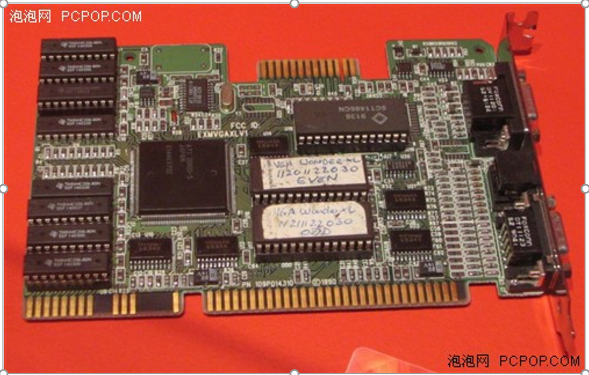

这时候的显卡能输出的分辨率比较低，一般都是640x480、800x600等。

#### 2D加速卡

随着像windows这样的操作系统的发展，单纯的使用显卡的基础显示功能已经不能满足日常的需求了，比如你将一个窗口从左边移动到右边，这个操作过程窗口本身的内容没有任何改变，只是位置变化了，如果完全使用cpu去绘制的话就需要不停的改变窗口新位置对应的显存中的数据，这样会导致cpu占用率很高，一直在执行绘图任务没法去执行其他任务。

这时2D加速的需求就出现了，也就是在显卡上添加一个2D加速的功能，比如上述的窗口移动操作，有了2D加速之后，程序员们只需要告诉2D加速硬件窗口原始的位置、新的位置还有窗口代表的图像大小信息，2D加速硬件就会自动将原位置图像更新到新位置显存处，由于这一过程cpu仅在最开始设置2D加速硬件的时候参与到，后续的更新过程完全不需要参与，所以cpu这时就可以去执行别的任务。这个搬运的过程其实本质上就是一个DMA传输的过程，在2D加速中这个术语叫bitblt，当然2D加速还有很多其他的功能，比如画直线、矩形单色填充、颜色混合等等。

像windows这样的操作系统会将基础的2D图形绘制封装出一些列的接口，这些接口底层如果有2D加速硬件的话，会使用驱动提供的2D加速功能实现，如果没有的话则使用cpu绘制实现。有2D加速功能的这些显卡则可以称为2D加速卡。

#### 3D加速卡

随着多媒体时代的到来，人们在PC上玩游戏的需求越来越大，这当中的3D游戏也逐渐发展起来。但是人们很快发现单纯的使用cpu去渲染图形已经满足不了复杂的3D游戏需求，这时候3D加速卡应运而生。使用3D加速卡可以让专用的硬件去渲染生成图形内容而cpu就可以腾出手来干点别的事情，比如播放音频等等。这个时期3D加速卡和2D加速卡都是单独的计算机外设，后期也有厂商将2D和3D功能集成在一张卡上，比如Voodoo Banshee。

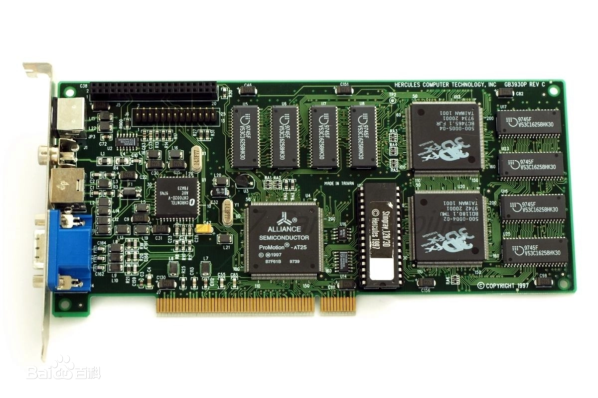

####  GPU

虽然3D加速卡可以加速3D图形的渲染，但是在3D图形学渲染流程中的T&L(Transform and Lighting，多边形转换与光源处理)还是由cpu来计算的，这种情况一直持续到英伟达发布GeForce 256。GeForce 256是第一个支持使用专有硬件处理T&L的3D加速卡，英伟达并把这种硬件芯片命名为GPU(Graphics Processing Unit)，从此3D图形学中的所有渲染过程都可以由硬件来处理了，cpu只需要配合GPU准备好渲染资源，然后通知GPU使用这些资源渲染图形就行了。

### 显示系统类型

下面简单介绍下在不同硬件平台下经常碰到的几种显示系统组成情况。

#### 集显

集显叫做集成显卡，因为是集成在桥片内部的，所以叫集成显卡。在以前x86的架构中，集显是在北桥芯片中的，集显一般将一部分内存当作显存用，一般情况下没有独立显存，但是也不是绝对的，比如龙芯7A1000桥片中的集显就有独立显存。

#### 核显

核显叫做核芯显卡，是和cpu核一起集成在处理器芯片中的，而不像集显那样是在处理器外部的，当然这种叫法一般都是特指对x86平台上处理器内部的核显，核显一般也是将部分内存当作显存来使用。核显和集显一般都包含了显示控制器DC和图形处理器GPU这两个部件，也就是说同时有显示功能又有3D渲染的功能。

#### 独显

独显叫做独立显卡，一般通过PCI或者PCIe接口插入到主板上使用，比如英伟达和AMD都有自己的独立显卡。独立显卡一般有自己的独立显存，但是可能并不一定有3D渲染功能，比如SM768显卡只有显示和2D加速功能而没有3D加速功能。

#### 嵌入式显示

在嵌入式中，显示控制器和GPU一般都是两个独立的外设控制器，可能是不同厂商的IP核。比如我们手机中的arm架构soc，GPU可能是arm mali、power vr等厂商提供的IP核，显示控制器可能是另外的厂商提供。在这种架构中，都是将部分内存拿来当作显存使用，一般出于成本和功耗的考虑不会有独立显存。

### 不同平台显示系统

#### x86平台

现在x86平台的显卡基本都是通过PCIe接入，在早期的架构中在北桥中有集显，比如82915这款北桥芯片，集显通过PCIe和北桥传输数据，北桥通过FSB前端总线和cpu传输数据，如下图所示。

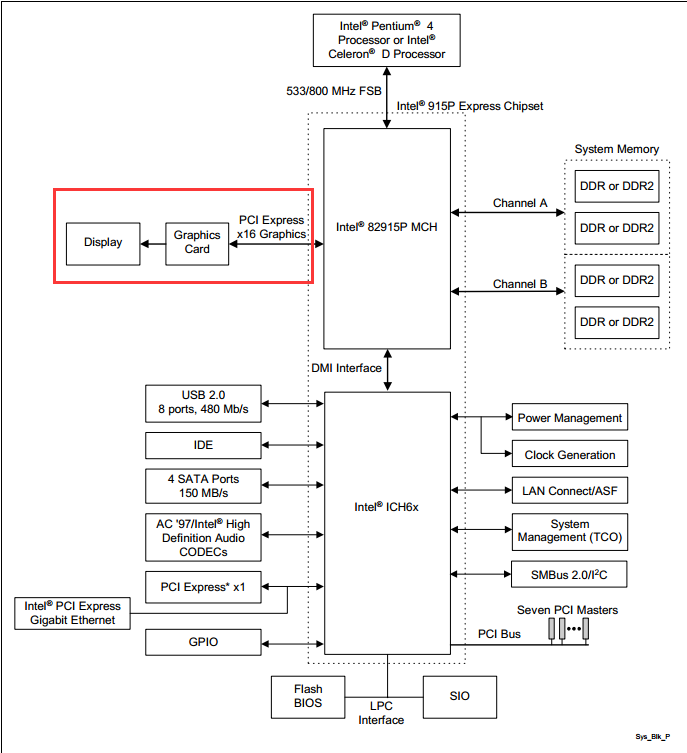

在现在的英特尔处理器芯片中，核显被集成到了处理器内部，通过内部ringbus总线和cpu通信，降低了通信延迟，提高了新能，如下图所示。

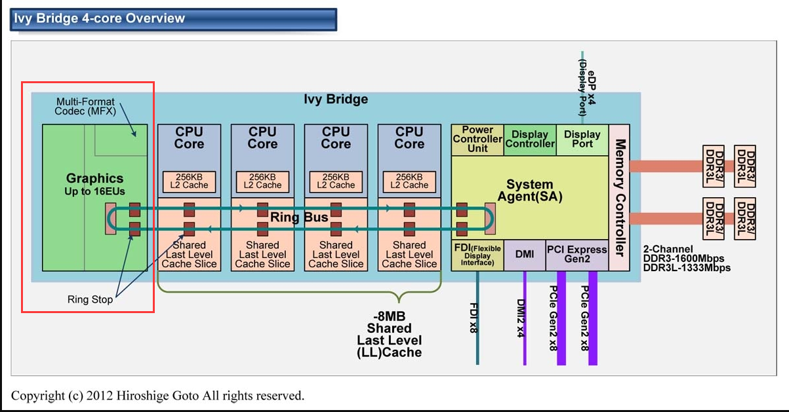

当然集显和核显的性能针对基础的电脑使用来说是基本满足的，但是如果是玩大型游戏或者是需要工业图形渲染的话，都需要搭配独立显卡来使用，一般的x86主板上都预留了独立显卡的PCIe插槽。

#### 龙芯平台

#### 2K1000

2K1000是一款双核SOC，自带GPU和DC，GPU和DC通过内部总线连接cpu，如下图所示。

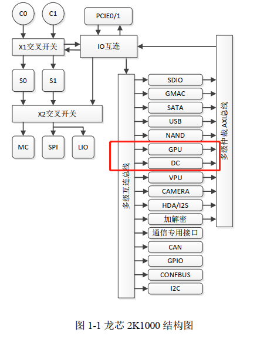

GPU和DC都可以单独工作，在2K1000平台是将内存当作显存使用的。

#### 3A3000 + 7A1000

3A3000处理器需要配合7A1000桥片来使用，7A1000桥片的作用就是类似于以前x86架构中的南北桥功能。在7A1000中有集显，桥片通过HT总线和处理器通信，如下图所示。

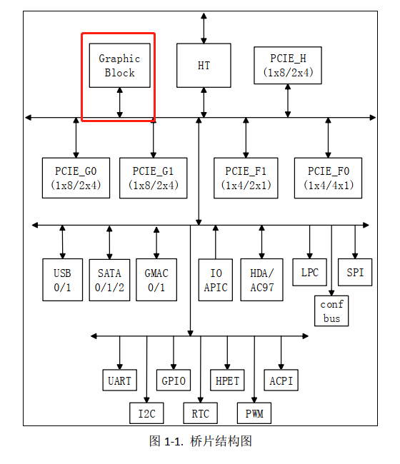

在7A1000中，集显既可以使用内存当作显存使用，也可以使用内部的独立显存。

#### 飞腾平台

飞腾处理器内部没有GPU和DC，所以需要外接PCIe显卡来使用，比如SM768、JM7200等等。也可以配合飞腾的x100套片来使用显示和GPU功能，如下图所示。

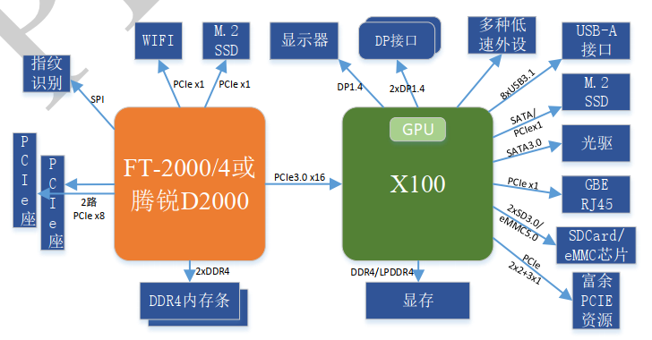

#### 大部分ARM平台

ARM平台的显示系统和2K1000一样，DC和GPU都是可以分开单独工作的，比如全志R16芯片，如下图所示。

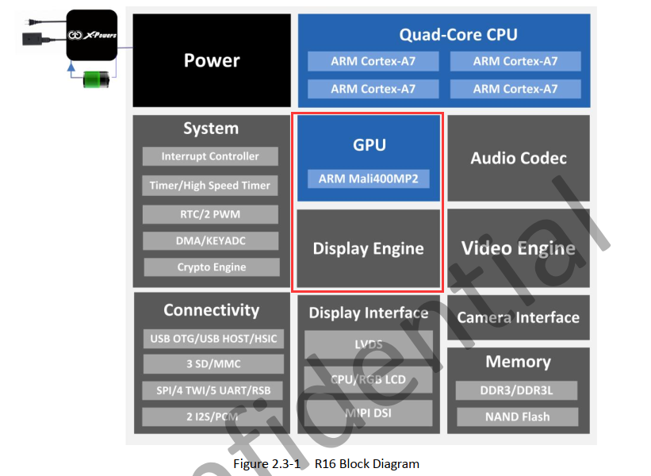

在ARM平台上同样是拿内存当显存来使用的。

#### 显卡驱动

#### 嵌入式平台驱动

针对嵌入式arm平台或者龙芯平台，显示驱动就是单独驱动SOC中的显示控制器，在SylixOS下就是普通的fb驱动，在Linux下就是drm/kms驱动，输出的接口一般有VGA、LVDS、HDMI等等，分辨率都可以通过设置DC相关寄存器来改变。

#### 通用显卡驱动（VBE驱动）

针对单独的PCIe形式的显卡，现在基本都满足VBE标准，VBE标准是VESA组织制定的一个显示编程接口标准，主要用于统一在x86实模式下显卡显示一系列编程接口，比如设置分辨率、获取显卡支持的分辨率信息等等。VBE最新的标准是3.0版本，制定于上世纪90年代末期，现代的显卡基本都遵守这个标准，这个标准主要是为x86平台制定的，所以显卡厂商将VBE相关功能代码编译成x86指令烧录在显卡的VBIOS中。

VBE功能一般只能在实模式下使用，为了在x86进入保护模式后也能使用VBE功能，Linux中开发了一个x86模拟器，模拟出x86的实模式环境，这样就可以在保护模式下继续使用VBE功能了。在龙芯的PMON中就是使用同样的原理来使用这些PCIe显卡的，PMON中同样有一个x86模拟器，来执行显卡VBIOS中的x86指令从而来设置显卡显示输出。

由于VBE基本是现代显卡都支持的，所有支持VBE的显示驱动理论上都能驱动显卡基本显示输出，比如Linux下的uvesa驱动，SylixOS下x86平台的显卡驱动同样是VBE驱动，所以一套驱动就能驱动不同厂商的显卡。

#### 专用显卡驱动

虽然VBE驱动一套驱动吃遍所有显卡，很方便，但是也是有缺点的，比如VBE驱动能设置的显示分辨率只能是显卡厂商固化在VBIOS中的几种分辨率，有的显卡可以设置更高的分辨率，但是在VBE中没有支持。因为在现代的显卡中，支持VBE更多的是为了兼容性考虑，VBE更多的是为了“亮机”功能而存在，如果想使用更多的显卡功能就需要专用显卡驱动，比如SM768专有显卡驱动就可以在多个平台上使用，可以设置多种分辨率。

在Linux下，显卡的显示驱动和GPU驱动一般都是在一块的，叫做drm/kms驱动，一些老的显卡可能还是使用的fbdev框架，新的显卡基本都是用drm框架了。

### FAQ

#### 龙芯和飞腾平台可以通过VBE驱动使用任意显卡显示吗

龙芯片平台基本可以，飞腾平台根据实测基本不可以。因为VBE功能基本依赖显卡厂商的VBIOS，有的显卡VBIOS需要依赖x86的vga端口来设置显卡显示，龙芯的PCIe控制器可以处理vga端口的访问，但是飞腾的PCIe控制则不行，如果一个显卡的VBE实现不依赖vga端口的话，则在飞腾下有可能能被正常驱动显示。在测试中试了AMD的几款显卡只有一款老式的R600显卡能在飞腾下显示，其他的显卡要么显示异常要么完全不能驱动，所以在飞腾下想使用显卡显示的话，最好使用显卡的专用驱动。