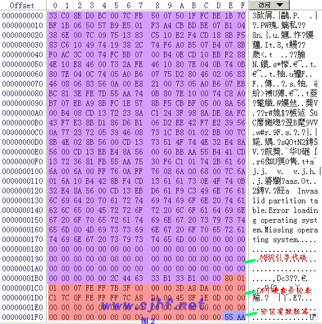
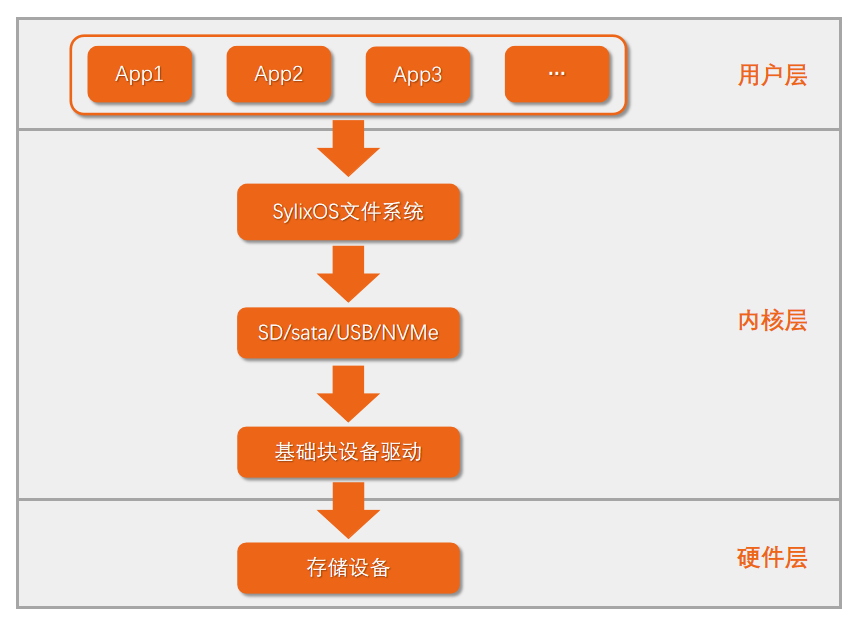
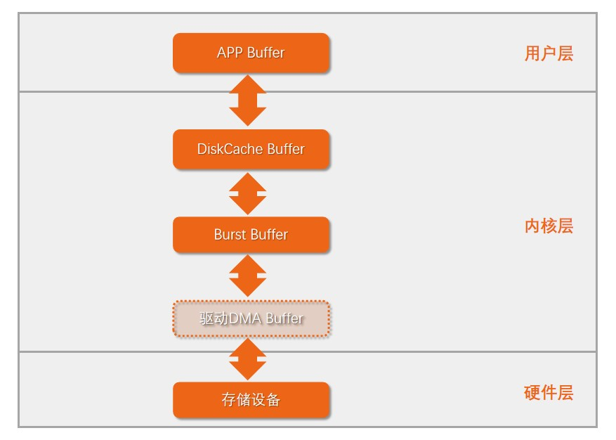
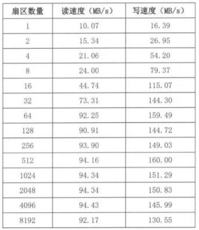

# SylixOS块设备驱动开发

## **认识块设备**

### 存储设备

在嵌入式中，常见的存储设备有SD卡、eMMC、sata硬盘、U盘、NVMe盘等。其中SD卡和eMMC使用的是SD协议，sata盘使用的是sata协议(包括机械硬盘和固态硬盘)，U盘使用的是USB协议，NVMe盘使用的是NVMe协议。这些存储设备的数据读写并不像字符设备那样是字节流形式，而是块形式，也就是以一个个扇区来进行访问，一个扇区的典型大小为512字节。

另外厂商对于设备容量的计算方法和计算机中计算容量方法是不一样的，比如一个硬盘厂商宣称它的容量是500GB，是按照1000字节单位来算的，也就是实际容量是500 * 1000 * 1000 *1000字节，而计算机中识别设备容量是按照1024字节单位来算的，所以一个500GB硬盘在计算机中识别出来大约是465.66GB，emmm......


### SylixOS块设备位置

SylixOS下的块设备一般创建在 ***/dev/blk\*** 目录下，各类协议设备创建出的名字一般如下：

- SD协议类设备名字为sdcard-0、sdcasrd-1等。这里的0和1并不是指分区，而是代表一个盘(控制器)，和Linux不同的是，在SylixOS中不会为各个分区再单独创建设备文件。
- sata协议类设备名字为hdd-0,、hdd-1等。
- U盘设备名字为udisk-0、udisk-1等。
- NVMe协议类设备名字为nvme-0、nvme-1等。

```
[root@sylixos:/dev/blk]# ll
brw-r--r-- root     root     Sat Jan 01 08:00:00 2000    256MB, sdcard-0
      total items: 1
[root@sylixos:/dev/blk]#
```

#### SylixOS块设备挂载位置

我们在应用层使用块设备都是通过读写某个目录下的文件方式来实现的，所以需要将块设备挂载到系统的某个目录下来使用。SylixOS一般将设备的各个分区挂载到 ***/media*** 目录下：

```
[root@sylixos:/root]# cd /media/
[root@sylixos:/media]# ll
drwxrwxrwx root     root     Sat Jan 01 08:00:04 2000           sdcard0/
      total items: 1
[root@sylixos:/media]#
```

另外在根目录下的比如apps、lib这些目录，其实真正的位置都在 ***/media\*** 下的某个分区里，根目录下的位置只是一个软连接，方便使用而已：

```
[root@sylixos:/media]# cd /
[root@sylixos:/]# ll
lrwxr-xr-- root     root     Sat Jan 01 08:00:00 2000           apps -> /media/sdcard0/apps
lrwxr-xr-- root     root     Sat Jan 01 08:00:00 2000           bin -> /media/sdcard0/bin
lrw-rw-rw- root     root     Sat Jan 01 08:00:00 2000           boot -> /media/sdcard0
lrwxr-xr-- root     root     Sat Jan 01 08:00:00 2000           etc -> /media/sdcard0/etc
lrwxr-xr-- root     root     Sat Jan 01 08:00:00 2000           home -> /media/sdcard0/home
lrwxr-xr-- root     root     Sat Jan 01 08:00:00 2000           lib -> /media/sdcard0/lib
lrwxr-xr-- root     root     Sat Jan 01 08:00:00 2000           qt -> /media/sdcard0/qt
lrwxr-xr-- root     root     Sat Jan 01 08:00:00 2000           root -> /media/sdcard0/root
lrwxr-xr-- root     root     Sat Jan 01 08:00:00 2000           sbin -> /media/sdcard0/sbin
lrwxr-xr-- root     root     Sat Jan 01 08:00:00 2000           tmp -> /ram/tmp
lrwxr-xr-- root     root     Sat Jan 01 08:00:00 2000           usr -> /media/sdcard0/usr
lrwxr-xr-- root     root     Sat Jan 01 08:00:00 2000           var -> /media/sdcard0/var
drwxr-xr-- root     root     Sat Jan 01 08:00:00 2000           ram/
drw-rw-rw- root     root     Sat Jan 01 08:00:00 2000           yaffs2/
drw-r--r-- root     root     Sat Jan 01 08:00:00 2000           proc/
drwxr-xr-- root     root     Sat Jan 01 08:00:00 2000           media/
drwxr-xr-- root     root     Sat Jan 01 08:00:00 2000           mnt/
drwxr-xr-- root     root     Sat Jan 01 08:00:00 2000           dev/
      total items: 18
[root@sylixos:/]#
```

## **分区和格式化**

### 查看分区信息

块设备要想被使用首先需要进行分区，然后将分区格式化为具体的文件系统格式才能使用，分区信息是以分区表的形式保存在设备的第一个扇区末尾中：



在x86平台的磁盘上，上图中紫色的部分是系统启动用的引导代码，在其他平台上这段空间数据无意义，红色的部分就是分区表了，每个分区信息用16B来描述，总共可以描述4个分区的信息。

在SylixOS中可以使用 ***fdisk*** 命令来查看块设备的分区信息：

```
[root@sylixos:/]# fdisk /dev/blk/sdcard-0
block device  : /dev/blk/sdcard-0
block type    : SD/MMC
block serial  : DEADBEEF
block firmware: 2006.02, v0.1
block product : QEMU! SDSC memory card
block media   : SDSC(v1.0), 512(R) 512(W)

partition >>

PART ACT  SIZE(KB)  OFFSET(KB)             TYPE
---- --- ---------- ---------- -------------------------------------
   0  *      261120       1024 SylixOS True Power Safe Partition

total partition 1
[root@sylixos:/]#
```

- PART：表示这是第几个分区。
- ACT：此分区是否是激活分区。
- SIZE：分区的大小，单位是KB。
- OFFSET：分区的起始位置，单位是KB。在SylixOS中设备前1MB的空间是预留的，分区是从1MB偏移位置开始的。
- TYPE：分区的文件系统类型，在SylixOS下块设备一般使用2种文件系统：FATFS(FAT12、FAT16、FAT32)，TPSFS。

### SylixOS分区操作

在SylixOS中同样通过 ***fdisk*** 命令来对一个块设备进行分区操作，我们这里通过分区一个虚拟块设备来体验下如何进行分区，后面章节会详细地分析这个虚拟块设备的代码。

虚拟块设备的名字为 ***vdisk-0*** :

```
[root@sylixos:/dev/blk]# ll
brw-r--r-- root     root     Sat Jan 01 09:09:00 2000     20MB, vdisk-0
brw-r--r-- root     root     Sat Jan 01 08:00:00 2000    256MB, sdcard-0
      total items: 2
[root@sylixos:/dev/blk]#
```

通过 ***fdisk -f*** 命令进行分区，首先会提示需要分几个区，这里以3个为例：

```
[root@sylixos:/root]# fdisk -f /dev/blk/vdisk-0
block device /dev/blk/vdisk-0 total size: 20 (MB)
please input how many partition(s) you want to make (1 ~ 4) : 3
```

接着输入块的对齐大小，典型值为4096：

```
please input how many bytes align (4K 8K ...) : 4096
```

第一个分区我们设置为2MB大小的非激活保留分区：

```
please input the partition 0 size percentage(%) or capacity(M) 0 means all left space : 2M
is this partition active(y/n) : n
please input the file system type
1: FAT   2: TPSFS   3: LINUX   4: RESERVED
4
```

第二个分区我们将剩余磁盘容量的10%设置为FAT文件系统：

```
please input the partition 1 size percentage(%) or capacity(M) 0 means all left space : 10
is this partition active(y/n) : y
please input the file system type
1: FAT   2: TPSFS   3: LINUX   4: RESERVED
1
```

第三个分区我们将剩余的容量都设置为TPSFS文件系统：

```
please input the partition 2 size percentage(%) or capacity(M) 0 means all left space : 0
is this partition active(y/n) : y
please input the file system type
1: FAT   2: TPSFS   3: LINUX   4: RESERVED
2
```

输入0就表示将剩余空间都设置为一个分区。

随后会给出新分出的三个分区信息：

```
making partition...
block device  : /dev/blk/vdisk-0
block type    : <unkown>
block serial  : N/A
block firmware: N/A
block product : N/A
block media   : N/A

partition >>

PART ACT  SIZE(KB)  OFFSET(KB)             TYPE
---- --- ---------- ---------- -------------------------------------
   0           2048       1024 Reserved partition
   1  *        1944       3072 Win95 FAT32 Partition
   2          15464       5016 SylixOS True Power Safe Partition

total partition 3
[root@sylixos:/root]#
```

### SylixOS格式化分区操作

块设备分区完成之后需要挂载到某个目录下，通过 ***remount*** 命令对块设备进行挂载：

```
[root@sylixos:/root]#
[root@sylixos:/root]# remount /dev/blk/vdisk-0
Block device /dev/blk/vdisk-0 part 1 mount to /media/vdisk0 use vfat file system.
Magic number error, mount failed
Block device /dev/blk/vdisk-0 part 2 mount to /media/vdisk1 use tpsfs file system.
[root@sylixos:/root]#
```

> 挂载TPSFS分区时，会报出一个Magic number error, mount failed，这个是正常现象，无需担心。

通过输出信息可以知道，虚拟块设备的两个分区被挂载到 ***/media/vdisk0*** 和 ***/media/vdisk1*** 下，我们通过 ***mkfs*** 命令来格式化这两个分区：

```
[root@sylixos:/root]# mkfs /media/vdisk0/
now format media, please wait...
disk format ok.
[root@sylixos:/root]#
[root@sylixos:/root]#
[root@sylixos:/root]#
[root@sylixos:/root]# mkfs /media/vdisk1/
now format media, please wait...
disk format ok.
[root@sylixos:/root]#
```

格式化完成之后可以通过 ***df*** 命令查看分区容量使用情况：

```
[root@sylixos:/root]# df /media/vdisk0
    VOLUME       TOTAL     FREE    USED RO            FS TYPE
-------------- --------- --------- ---- -- ---------------------------------
/media/vdisk0  1690.00KB 1688.00KB   0% n  FAT12 FileSystem
[root@sylixos:/root]# df /media/vdisk1
    VOLUME       TOTAL     FREE    USED RO            FS TYPE
-------------- --------- --------- ---- -- ---------------------------------
/media/vdisk1    14.12MB   13.74MB   2% n  True Power Safe FileSystem
[root@sylixos:/root]#
```

### 查看挂载信息

通过 ***showmount*** 命令查看系统中所有块设备的挂载情况;

```
[root@sylixos:/root]# showmount
AUTO-Mount point show >>
       VOLUME                    BLK NAME
-------------------- --------------------------------
/media/vdisk1        /dev/blk/vdisk-0:2
/media/vdisk0        /dev/blk/vdisk-0:1
/media/sdcard0       /dev/blk/sdcard-0:0

MTD-Mount point show >>
       VOLUME                    BLK NAME
-------------------- --------------------------------

Mount point show >>
       VOLUME                    BLK NAME
-------------------- --------------------------------
/ram                 0
[root@sylixos:/root]#
```

#### 卸载分区

如果要对一个块设备重新分区，首先需要将已经挂载的分区进行卸载，然后才能重新分区格式化。可以先通过 ***showmount*** 命令查看块设备的各个分区挂载情况，然后通过 ***umount\*** 命令来卸载所有分区：

```
[root@sylixos:/root]# umount /media/vdisk0
[root@sylixos:/root]# umount /media/vdisk1
[root@sylixos:/root]#
```

## SylixOS块设备框架

### 从功能角度

从功能角度，SylixOS块设备框架大致可以分为5个部分：

- 用户层的APP通过对文件读写来操作块设备。
- 各种文件通过内核提供的文件系统进行统一的管理。
- 文件最终是需要保存在存储设备上的，不同的存储设备需要使用不同的通信协议进行数据传输和控制。
- 不同协议的块设备驱动最终都是以基础块设备驱动为基石的，学好基础块设备驱动是为以后学习SD等设备驱动打好基础。
- 不同的块设备通过各种不同的接口接入到系统中。



### 从块缓冲角度

由于磁盘的速度低于CPU和内存的速度，所以为了提高系统的整体性能，一般都会在系统中添加磁盘扇区缓冲，将常用的扇区缓存在内存中，这样读写某个扇区就是读写内存，从而提高性能。在SylixOS中，数据在应用程序和设备之间可能会经过4种缓冲区，3次拷贝：

> 对于超高速设备，引入块缓冲可能会降低整体的性能，比如对于NVMe设备来说，在SylixOS下不使用块缓冲可以达到更好的性能。

- APP Buffer：应用层buffer，用来保存想要读写的数据。
- DiskCache Buffer：磁盘缓冲区，保存一个磁盘设备经常需要读写的扇区，大小通常为几十到几百KB。
- Burst Buffer：每种磁盘都有一个最佳传输的扇区大小，在这个最佳扇区大小传输下，磁盘速度达到最高。在SylixOS下，针对读写可以分别有对应的Burst Buffer，大小一般为几十个扇区大小。
- 如果设备控制器支持DMA传输的话，在底层驱动中可能还会有驱动自己管理的DMA Buffer。当然有的设备可能直接将Burst Buffer用于DMA传输的缓冲区，在这种情况下需要将Burst Buffer申请为非cache类型或者申请为带cache 类型然后传输时手动刷新或失效cache。



这里额外讲述下存储设备最佳猝发大小的概念，存储设备都有一个最佳的猝发传输大小，这个值不同的存储设备都不一定相同，具体大小可以参考设备的相关资料或者进行实际测试得到，亦可以采用经验值。比如 下图所示的是某个平台下的 sata 磁盘在不同的扇区个数下的传输速度，可以看出该 sata 盘的最佳猝发扇区数是 64，当一次传输的扇区数大于 64 时，传输速度基本不会再有太大的提升了。



## 创建块设备并自动挂载

### 概述

从本小节开始，我们以一个虚拟磁盘块设备驱动为例来讲解如何编写一个基础的块设备驱动。说是虚拟的磁盘也就是分配一段内存来当做磁盘来使用，对磁盘的读写也就是访问内存的不同位置来实现。

### 块设备注册

SylixOS中的块设备是通过***LW_BLK_DEV*** 这个数据结构来描述的，这个结构就是一个实际磁盘控制器的抽象：

```
typedef struct {
    PCHAR       BLKD_pcName;                                            /* 可以为 NULL 或者 "\0"        */
                                                                        /* nfs romfs 文件系统使用       */
    FUNCPTR     BLKD_pfuncBlkRd;                                        /* function to read blocks      */
    FUNCPTR     BLKD_pfuncBlkWrt;                                        /* function to write blocks     */
    FUNCPTR     BLKD_pfuncBlkIoctl;                                        /* function to ioctl device     */
    FUNCPTR     BLKD_pfuncBlkReset;                                        /* function to reset device     */
    FUNCPTR     BLKD_pfuncBlkStatusChk;                                 /* function to check status     */
    
    ULONG       BLKD_ulNSector;                                         /* number of sectors            */
    ULONG       BLKD_ulBytesPerSector;                                  /* bytes per sector             */
    ULONG       BLKD_ulBytesPerBlock;                                   /* bytes per block              */
    
    BOOL        BLKD_bRemovable;                                        /* removable medium flag        */
    BOOL        BLKD_bDiskChange;                                       /* media change flag            */
    INT         BLKD_iRetry;                                            /* retry count for I/O errors   */
    INT         BLKD_iFlag;                                             /* O_RDONLY or O_RDWR           */
    
    /*
     *  以下参数操作系统使用, 必须初始化为 0.
     */
    INT         BLKD_iLogic;                                            /* if this is a logic disk      */
    UINT        BLKD_uiLinkCounter;                                     /* must be 0                    */
    PVOID       BLKD_pvLink;                                            /* must be NULL                 */
    
    UINT        BLKD_uiPowerCounter;                                    /* must be 0                    */
    UINT        BLKD_uiInitCounter;                                     /* must be 0                    */
} LW_BLK_DEV;
```

一个块设备通常都会有自己的磁盘缓冲，在SylixOS中，块设备缓冲是通过 ***LW_DISKCACHE_ATTR*** 数据结构来描述的：

```
typedef struct {
    PVOID           DCATTR_pvCacheMem;                                  /*  扇区缓存地址                */
    size_t          DCATTR_stMemSize;                                   /*  扇区缓存大小                */
    INT             DCATTR_iBurstOpt;                                   /*  缓存属性                    */
    INT             DCATTR_iMaxRBurstSector;                            /*  磁盘猝发读的最大扇区数      */
    INT             DCATTR_iMaxWBurstSector;                            /*  磁盘猝发写的最大扇区数      */
    INT             DCATTR_iMsgCount;                                   /*  管线消息队列缓存个数        */
    INT             DCATTR_iPipeline;                                   /*  处理管线线程数量            */
    BOOL            DCATTR_bParallel;                                   /*  是否支持并行读写            */
    ULONG           DCATTR_ulReserved[8];                               /*  保留                        */
} LW_DISKCACHE_ATTR;
```

在对上述两个数据结构初始化之后，就可以调用 ***API_OemDiskMount2*** 来创建块设备并自动尝试挂载相应的分区：

```
PLW_OEMDISK_CB    API_OemDiskMount2(CPCHAR             pcVolName,
                                           PLW_BLK_DEV        pblkdDisk,
                                           PLW_DISKCACHE_ATTR pdcattrl);
```

成功调用后，接口返回一个磁盘控制块句柄：

```
typedef struct {
    PLW_BLK_DEV          OEMDISK_pblkdDisk;                             /*  物理磁盘驱动                */
    PLW_BLK_DEV          OEMDISK_pblkdCache;                            /*  CACHE 驱动块                */
    PLW_BLK_DEV          OEMDISK_pblkdPart[LW_CFG_MAX_DISKPARTS];       /*  各分区驱动块                */
    INT                  OEMDISK_iVolSeq[LW_CFG_MAX_DISKPARTS];         /*  对应个分区的卷序号          */
    PLW_DEV_HDR          OEMDISK_pdevhdr[LW_CFG_MAX_DISKPARTS];         /*  安装后的设备头              */
    PVOID                OEMDISK_pvCache;                               /*  自动分配内存地址            */
    UINT                 OEMDISK_uiNPart;                               /*  分区数                      */
    INT                  OEMDISK_iBlkNo;                                /*  /dev/blk/? 设备号           */
    CHAR                 OEMDISK_cVolName[1];                           /*  磁盘根挂载节点名            */
} LW_OEMDISK_CB;
```

一般的做法是定义一个全局的块设备数据结构变量，块缓冲数据结构可以定义为局部变量，初始化后进行块设备创建：

```
static LW_BLK_DEV vdisk_dev;
static PLW_OEMDISK_CB *vdisk_oemcb;

int module_init (void)
{
    PLW_BLK_DEV pdev = &vdisk_dev;
    LW_DISKCACHE_ATTR dcattrl;

    /*
    *  配置块设备参数
    */
    pdev->BLKD_pcName = "VirtualDisk";
    pdev->BLKD_ulNSector = VIRTUAL_DISK_SIZE / SECTOR_BYTES;
    pdev->BLKD_ulBytesPerSector = SECTOR_BYTES;
    pdev->BLKD_ulBytesPerBlock = SECTOR_BYTES;
    pdev->BLKD_bRemovable = LW_TRUE;
    pdev->BLKD_iRetry = 1;
    pdev->BLKD_iFlag = O_RDWR;
    pdev->BLKD_bDiskChange = LW_TRUE;
    pdev->BLKD_pfuncBlkRd = vdisk_read;
    pdev->BLKD_pfuncBlkWrt = vdisk_write;
    pdev->BLKD_pfuncBlkIoctl = vdisk_ioctl;
    pdev->BLKD_pfuncBlkReset = vdisk_reset;
    pdev->BLKD_pfuncBlkStatusChk = vdisk_status_chk;

    pdev->BLKD_iLogic = 0;
    pdev->BLKD_uiLinkCounter = 0;
    pdev->BLKD_pvLink = LW_NULL;

    pdev->BLKD_uiPowerCounter = 0;
    pdev->BLKD_uiInitCounter = 0;

    dcattrl.DCATTR_pvCacheMem = LW_NULL;
    dcattrl.DCATTR_stMemSize = (size_t)(DISK_CACHE_SIZE);
    dcattrl.DCATTR_iBurstOpt = LW_DCATTR_BOPT_CACHE_COHERENCE;
    dcattrl.DCATTR_iMaxRBurstSector = (INT)BUSTOR_SECTOR;
    dcattrl.DCATTR_iMaxWBurstSector = (INT)BUSTOR_SECTOR;
    dcattrl.DCATTR_iMsgCount = 4;
    dcattrl.DCATTR_bParallel = LW_TRUE;
    dcattrl.DCATTR_iPipeline = 1;

    vdisk_oemcb = API_OemDiskMount2("/media/vdisk", pdev, &dcattrl);
    if (!vdisk_oemcb) {
        printk("oem disk mount fail.\r\n");
        free(vdisk_start);
        return  (PX_ERROR);
    }

    return  (ERROR_NONE);
}

void module_exit (void)
{
    if (vdisk_oemcb) {
        API_OemDiskUnmount(vdisk_oemcb);
    }
}
```

具体的初始化参数会在下面章节讲解，***API_OemDiskMount2*** 第一个参数表示块设备要挂载的位置，系统会自动截取最后一个'/'后面的字符串加上块设备序号或者分区号组成最终的设备名和挂载目录。

同时还要定义一个全局变量用来保存虚拟磁盘的内存起始地址：

```
#define VIRTUAL_DISK_SIZE 20 * LW_CFG_MB_SIZE

static void *vdisk_start;

int module_init (void)
{
    vdisk_start = malloc(VIRTUAL_DISK_SIZE);
    if (!vdisk_start) {
        printk("create virtual disk fail.\n");
        return  (PX_ERROR);
    }

    return  (ERROR_NONE);
}
```

在驱动中使用malloc接口申请内存当做虚拟磁盘空间，默认的大小为20MB。

## 块设备读写和控制

在初始化块设备数据结构的时候，有几个回调函数需要初始化：

```
pdev->BLKD_pfuncBlkRd = vdisk_read;
pdev->BLKD_pfuncBlkWrt = vdisk_write;
pdev->BLKD_pfuncBlkIoctl = vdisk_ioctl;
pdev->BLKD_pfuncBlkReset = vdisk_reset;
pdev->BLKD_pfuncBlkStatusChk = vdisk_status_chk;
```

其中的reset和status_chk这两个函数在此驱动中是空函数，但是这两个函数一定要有，不然块设备创建和使用会有问题：

```
static int vdisk_reset (PLW_BLK_DEV dev)
{
    return  (ERROR_NONE);
}

static int vdisk_status_chk (PLW_BLK_DEV dev)
{
    return  (ERROR_NONE);
}
```

块设备最重要的两个操作就和读和写，可以说这两个函数是整个驱动中的核心操作函数，下面我们以读函数为例，看下读函数的原型：

```
int vdisk_read (PLW_BLK_DEV dev, void *buf, int blk_start, int blk_num);
```

- dev表示块设备指针，标明操作的是哪一个块设备。
- buf表示上层要传输数据的缓冲区地址。
- blk_start表示要传输的数据的起始扇区号。
- blk_num表示要传输的扇区个数。

我们知道数据传输三要素：源位置、目标位置、数据大小。对于读函数而言，源位置就是buf地址，目标位置就是blk_start，数据大小就是blk_num。

根据起始扇区号和单个扇区大小就可以计算出目标位置在虚拟磁盘中的位置：

```
static int vdisk_read (PLW_BLK_DEV dev, void *buf, int blk_start, int blk_num)
{
    //计算要读取的虚拟磁盘起始位置
    void *addr = vdisk_start + blk_start * dev->BLKD_ulBytesPerSector;

    //读取虚拟磁盘数据
    memcpy(buf, addr, blk_num * dev->BLKD_ulBytesPerSector);

    return  (ERROR_NONE);
}
```

由于是虚拟磁盘，数据传输就是一个简单的memcpy，在实际的磁盘驱动中一般就是发起DMA传输，然后程序阻塞等待中断完成传输来唤醒。

写函数的参数和读函数一样，只不过源位置变成了blk_start，目标位置变为了buf：

```
static int vdisk_write (PLW_BLK_DEV dev, void *buf, int blk_start, int blk_num)
{
    //计算要读取的虚拟磁盘起始位置
    void *addr = vdisk_start + blk_start * dev->BLKD_ulBytesPerSector;

    //写入虚拟磁盘数据
    memcpy(addr, buf, blk_num * dev->BLKD_ulBytesPerSector);

    return  (ERROR_NONE);
}
```

除了读写函数之外，块设备还需要实现一个ioctl函数，用来处理各种文件系统相关的命令，但是在本驱动中，我们只需要实现获取扇区大小和扇区总数这两个命令：

```
static int vdisk_ioctl (PLW_BLK_DEV dev, int cmd, long arg)
{
    switch (cmd) {

    /*
     *  必须要支持的命令
     */
    case FIOSYNC:
    case FIODATASYNC:
    case FIOSYNCMETA:
    case FIOFLUSH:                                                      /*  将缓存写入磁盘              */

    case FIOUNMOUNT:                                                    /*  卸载卷                      */
    case FIODISKINIT:                                                   /*  初始化磁盘                  */
    case FIODISKCHANGE:                                                 /*  磁盘媒质发生变化            */
        break;

    case FIOTRIM:                                                       /* AHCI_TRIM_EN                 */
        break;
    /*
     *  低级格式化
     */
    case FIODISKFORMAT:                                                 /*  格式化卷                    */
        return  (PX_ERROR);                                             /*  不支持低级格式化            */

    /*
     *  FatFs 扩展命令
     */
    case LW_BLKD_CTRL_POWER:
    case LW_BLKD_CTRL_LOCK:
    case LW_BLKD_CTRL_EJECT:
        break;

    case LW_BLKD_GET_SECSIZE:
    case LW_BLKD_GET_BLKSIZE:
        *((LONG *)arg) = (LONG)dev->BLKD_ulBytesPerSector;
        break;

    case LW_BLKD_GET_SECNUM:
        *((ULONG *)arg) = (ULONG)dev->BLKD_ulNSector;
        break;

    case FIOWTIMEOUT:
    case FIORTIMEOUT:
        break;

    default:
        _ErrorHandle(ENOSYS);
        return  (PX_ERROR);
    }

    return  (ERROR_NONE);
}
```

## 块设备和块缓冲配置

### 块设备配置

这里对块配置中几个比较重要的成员做个说明：

- BLKD_pcName：这个名字会在proc文件系统中查看块缓冲信息时用到。
- BLKD_ulNSector：块设备总扇区个数。
- BLKD_ulBytesPerSector：单个扇区的大小。
- BLKD_bRemovable：块设备是否可卸载。
- BLKD_iFlag：块设备是只读的还是可读写的。
- BLKD_pfuncBlkRd：块设备读操作回调函数。
- BLKD_pfuncBlkWrt：块设备写操作回调函数。
- BLKD_pfuncBlkIoctl：块设备控制操作回调函数。
- BLKD_pfuncBlkReset：块设备复位回调函数。
- BLKD_pfuncBlkStatusChk：块设备状态检查函数。

在此驱动中，虚拟磁盘大小为20MB，扇区大小为512B：

```
#define SECTOR_BYTES       512
#define VIRTUAL_DISK_SIZE  20 * LW_CFG_MB_SIZE

    pdev->BLKD_pcName = "VirtualDisk";
    pdev->BLKD_ulNSector = VIRTUAL_DISK_SIZE / SECTOR_BYTES;
    pdev->BLKD_ulBytesPerSector = SECTOR_BYTES;
    pdev->BLKD_ulBytesPerBlock = SECTOR_BYTES;
    pdev->BLKD_bRemovable = LW_TRUE;
    pdev->BLKD_iRetry = 1;
    pdev->BLKD_iFlag = O_RDWR;
    pdev->BLKD_bDiskChange = LW_TRUE;
    pdev->BLKD_pfuncBlkRd = vdisk_read;
    pdev->BLKD_pfuncBlkWrt = vdisk_write;
    pdev->BLKD_pfuncBlkIoctl = vdisk_ioctl;
    pdev->BLKD_pfuncBlkReset = vdisk_reset;
    pdev->BLKD_pfuncBlkStatusChk = vdisk_status_chk;

    pdev->BLKD_iLogic = 0;
    pdev->BLKD_uiLinkCounter = 0;
    pdev->BLKD_pvLink = LW_NULL;

    pdev->BLKD_uiPowerCounter = 0;
    pdev->BLKD_uiInitCounter = 0;
```

### 块缓冲配置

下面我们对块缓冲中几个重要成员做个介绍：

- DCATTR_pvCacheMem：如果驱动需要自己分配DiskCache，则可以将分配后的内存地址用来初始化此成员，否则填NULL让内核自己分配。
- DCATTR_stMemSize：DiskCache的大小。
- DCATTR_iBurstOpt：BurstBuffer的cache属性，如果需要分配带cache属性的，则初始化为0，如果需要非cache属性的，则初始化为LW_DCATTR_BOPT_CACHE_COHERENCE。
- DCATTR_iMaxRBurstSector：读猝发缓冲区大小。
- DCATTR_iMaxWBurstSector：写猝发缓冲区大小。
- DCATTR_bParallel：是否可以同时进行读写操作。
- DCATTR_iPipeline：系统后台刷新写缓冲的线程个数。
- DCATTR_iMsgCount：每个写缓冲线程消息数量，一般为DCATTR_iPipeline的2~8倍数值大小。

在本驱动中，读和写猝发扇区设置为64，DiskCache大小设置64KB。另外需要注意的是，实际内核中申请的写猝发缓冲区大小为DCATTR_iMaxWBurstSector * 单扇区大小 * DCATTR_iMsgCount。

```
#define BUSTOR_SECTOR      64
#define DISK_CACHE_SIZE    64 * LW_CFG_KB_SIZE

    dcattrl.DCATTR_pvCacheMem = LW_NULL;
    dcattrl.DCATTR_stMemSize = (size_t)(DISK_CACHE_SIZE);
    dcattrl.DCATTR_iBurstOpt = LW_DCATTR_BOPT_CACHE_COHERENCE;
    dcattrl.DCATTR_iMaxRBurstSector = (INT)BUSTOR_SECTOR;
    dcattrl.DCATTR_iMaxWBurstSector = (INT)BUSTOR_SECTOR;
    dcattrl.DCATTR_iMsgCount = 4;
    dcattrl.DCATTR_bParallel = LW_TRUE;
    dcattrl.DCATTR_iPipeline = 1;
```

系统后台写缓冲刷新线程为 ***t_dcwpipe*** ：

```
[root@sylixos:/root]# ts
thread show >>

      NAME         TID    PID  PRI STAT LOCK SAFE    DELAY   PAGEFAILS FPU CPU
---------------- ------- ----- --- ---- ---- ---- ---------- --------- --- ---
t_idle0          4010000     0 255 RDY     0 YES           0         0       0
t_itimer         4010001     0  20 SLP     0 YES        8741         0       0
t_isrdefer       4010002     0   0 SEM     0 YES           0         0       0
t_except         4010003     0   0 SEM     0 YES           0         0       0
t_log            4010004     0  60 MSGQ    0 YES           0         0       0
t_power          4010005     0 254 SLP     0 YES          50         0       0
t_hotplug        4010006     0 250 SEM     0 YES          50         0       0
t_reclaim        4010008     0 253 MSGQ    0 YES           0         0       0
t_sync           4010009     0 252 SLP     0             150         0       0
t_sdhcisdio      401000a     0 197 SEM     0               0         0       0
t_dcwpipe        401000b     0 160 SEM     0               0         0       0
t_tpsfs          401000c     0 160 SLP     0              10         0       0
t_netjob         401000d     0 110 SEM     0 YES           0         0       0
t_netproto       401000e     0 110 MSGQ    0 YES           6         0 USE   0
t_snmp           401000f     0 110 MSGQ    0 YES           0         0       0
t_ftpd           4010010     0 160 MSGQ    0               0         0       0
t_telnetd        4010011     0 160 MSGQ    0 YES           0         0       0
t_xinput         4010013     0 199 SEM     0               0         0       0
t_tshell         4010015     0 150 RDY     1               0         0       0

thread: 19
[root@sylixos:/root]#
```

### 查看系统块缓冲信息

经过上述的初始化之后，加载虚拟块设备驱动之后就可以根据《SylixOS块设备驱动开发(二)》中的方法对块设备进行分区和格式化操作了。通过 ***cat /proc/diskcache*** 命令来查看系统中所有块设备的块缓冲信息：

```
[root@sylixos:/proc]# cat /proc/diskcache
DO NOT INCLUDE 'NAND' READ CACHE INFO.

       NAME       OPT SECTOR-SIZE TOTAL-SECs VALID-SECs DIRTY-SECs BURST-R BURST-W  HASH
----------------- --- ----------- ---------- ---------- ---------- ------- ------- ------
VirtualDisk         0         512        128         64          0      64      64    128
SD-MemCard          0         512       1024       1024          0      16      32   1024
[root@sylixos:/proc]#
```

## 虚拟块设备驱动源码

```
#define  __SYLIXOS_KERNEL
#include <SylixOS.h>
#include <module.h>
#include <stdlib.h>
#include <string.h>

/*
*  BSP内存需求：
*  1. 虚拟磁盘由于是在内核用malloc申请的一块内存，所以需要保证BSP中内核data区域要大于这个磁盘内存的大小
*  2. 如果需要DCATTR_stMemSize磁盘缓存cache，这个cache是内核在内核堆上申请的，所以BSP中的data区也要大于这大小
*  3. 读猝发缓冲区大小为：猝发扇区数 * 扇区大小
*  4. 写猝发缓冲区大小为：猝发扇区数 * 扇区大小 * DCATTR_iMsgCount
*  5. 3和4如果使用cache一致性，那么内核申请的区域是DMA区域，否则是内核堆区
*
*/

#define SECTOR_BYTES       512
#define VIRTUAL_DISK_SIZE  20 * LW_CFG_MB_SIZE

#define BUSTOR_SECTOR      64
#define DISK_CACHE_SIZE    64 * LW_CFG_KB_SIZE

static LW_BLK_DEV vdisk_dev;
static PLW_OEMDISK_CB *vdisk_oemcb;
static void *vdisk_start;

static int vdisk_read (PLW_BLK_DEV dev, void *buf, int blk_start, int blk_num)
{
    //计算要读取的虚拟磁盘起始位置
    void *addr = vdisk_start + blk_start * dev->BLKD_ulBytesPerSector;

    //读取虚拟磁盘数据
    memcpy(buf, addr, blk_num * dev->BLKD_ulBytesPerSector);

    return  (ERROR_NONE);
}

static int vdisk_write (PLW_BLK_DEV dev, void *buf, int blk_start, int blk_num)
{
    //计算要读取的虚拟磁盘起始位置
    void *addr = vdisk_start + blk_start * dev->BLKD_ulBytesPerSector;

    //写入虚拟磁盘数据
    memcpy(addr, buf, blk_num * dev->BLKD_ulBytesPerSector);

    return  (ERROR_NONE);
}

static int vdisk_ioctl (PLW_BLK_DEV dev, int cmd, long arg)
{
    switch (cmd) {

    /*
     *  必须要支持的命令
     */
    case FIOSYNC:
    case FIODATASYNC:
    case FIOSYNCMETA:
    case FIOFLUSH:                                                      /*  将缓存写入磁盘              */

    case FIOUNMOUNT:                                                    /*  卸载卷                      */
    case FIODISKINIT:                                                   /*  初始化磁盘                  */
    case FIODISKCHANGE:                                                 /*  磁盘媒质发生变化            */
        break;

    case FIOTRIM:                                                       /* AHCI_TRIM_EN                 */
        break;
    /*
     *  低级格式化
     */
    case FIODISKFORMAT:                                                 /*  格式化卷                    */
        return  (PX_ERROR);                                             /*  不支持低级格式化            */

    /*
     *  FatFs 扩展命令
     */
    case LW_BLKD_CTRL_POWER:
    case LW_BLKD_CTRL_LOCK:
    case LW_BLKD_CTRL_EJECT:
        break;

    case LW_BLKD_GET_SECSIZE:
    case LW_BLKD_GET_BLKSIZE:
        *((LONG *)arg) = (LONG)dev->BLKD_ulBytesPerSector;
        break;

    case LW_BLKD_GET_SECNUM:
        *((ULONG *)arg) = (ULONG)dev->BLKD_ulNSector;
        break;

    case FIOWTIMEOUT:
    case FIORTIMEOUT:
        break;

    default:
        _ErrorHandle(ENOSYS);
        return  (PX_ERROR);
    }

    return  (ERROR_NONE);
}

static int vdisk_reset (PLW_BLK_DEV dev)
{
    return  (ERROR_NONE);
}

static int vdisk_status_chk (PLW_BLK_DEV dev)
{
    return  (ERROR_NONE);
}

int module_init (void)
{
    PLW_BLK_DEV pdev = &vdisk_dev;
    LW_DISKCACHE_ATTR dcattrl;

    vdisk_start = malloc(VIRTUAL_DISK_SIZE);
    if (!vdisk_start) {
        printk("create virtual disk fail.\n");
        return  (PX_ERROR);
    }

    /*
    *  配置块设备参数
    */
    pdev->BLKD_pcName = "VirtualDisk";
    pdev->BLKD_ulNSector = VIRTUAL_DISK_SIZE / SECTOR_BYTES;
    pdev->BLKD_ulBytesPerSector = SECTOR_BYTES;
    pdev->BLKD_ulBytesPerBlock = SECTOR_BYTES;
    pdev->BLKD_bRemovable = LW_TRUE;
    pdev->BLKD_iRetry = 1;
    pdev->BLKD_iFlag = O_RDWR;
    pdev->BLKD_bDiskChange = LW_TRUE;
    pdev->BLKD_pfuncBlkRd = vdisk_read;
    pdev->BLKD_pfuncBlkWrt = vdisk_write;
    pdev->BLKD_pfuncBlkIoctl = vdisk_ioctl;
    pdev->BLKD_pfuncBlkReset = vdisk_reset;
    pdev->BLKD_pfuncBlkStatusChk = vdisk_status_chk;

    pdev->BLKD_iLogic = 0;
    pdev->BLKD_uiLinkCounter = 0;
    pdev->BLKD_pvLink = LW_NULL;

    pdev->BLKD_uiPowerCounter = 0;
    pdev->BLKD_uiInitCounter = 0;

    dcattrl.DCATTR_pvCacheMem = LW_NULL;
    dcattrl.DCATTR_stMemSize = (size_t)(DISK_CACHE_SIZE);
    dcattrl.DCATTR_iBurstOpt = LW_DCATTR_BOPT_CACHE_COHERENCE;
    dcattrl.DCATTR_iMaxRBurstSector = (INT)BUSTOR_SECTOR;
    dcattrl.DCATTR_iMaxWBurstSector = (INT)BUSTOR_SECTOR;
    dcattrl.DCATTR_iMsgCount = 4;
    dcattrl.DCATTR_bParallel = LW_TRUE;
    dcattrl.DCATTR_iPipeline = 1;

    vdisk_oemcb = API_OemDiskMount2("/media/vdisk", pdev, &dcattrl);
    if (!vdisk_oemcb) {
        printk("oem disk mount fail.\r\n");
        free(vdisk_start);
        return  (PX_ERROR);
    }

    return  (ERROR_NONE);
}

void module_exit (void)
{
    if (vdisk_oemcb) {
        API_OemDiskUnmount(vdisk_oemcb);
    }

    if (vdisk_start) {
        free(vdisk_start);
    }
}
```