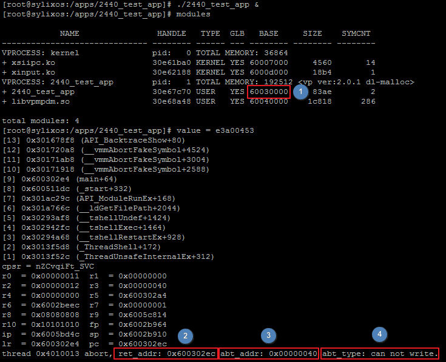
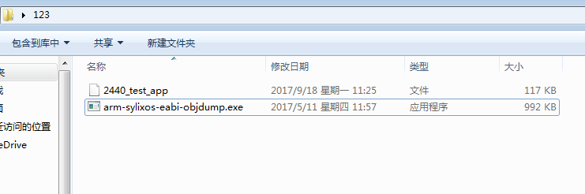
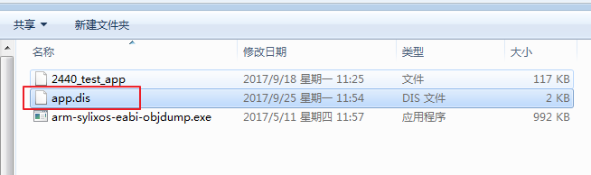
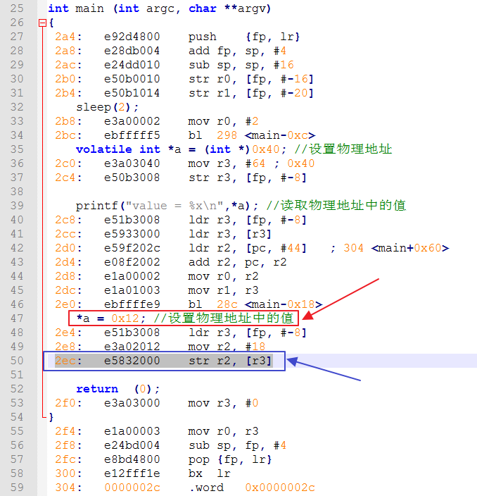
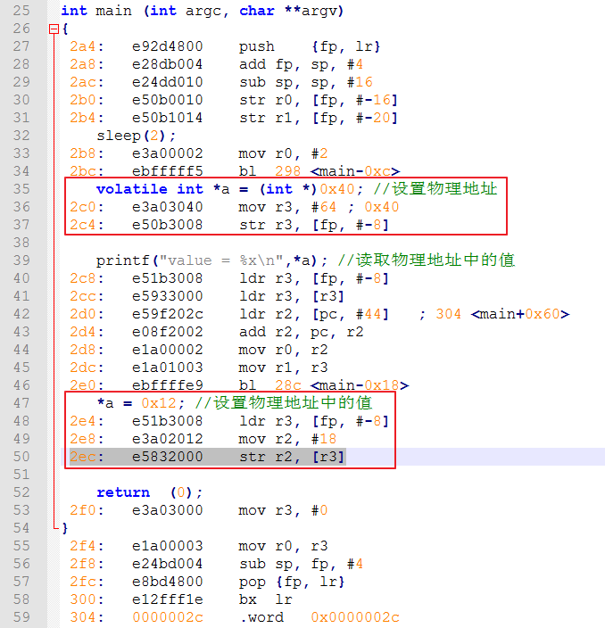
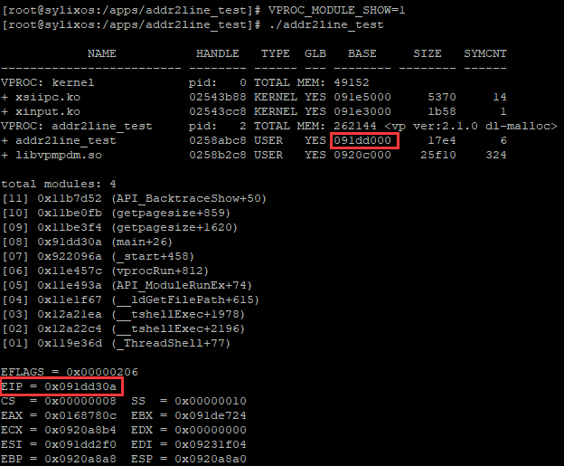
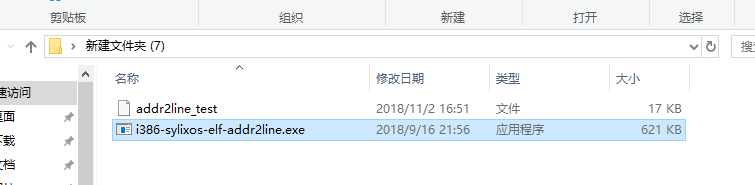
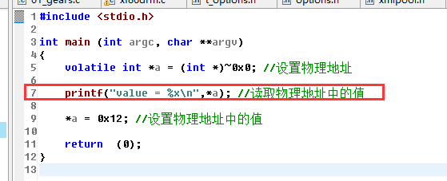
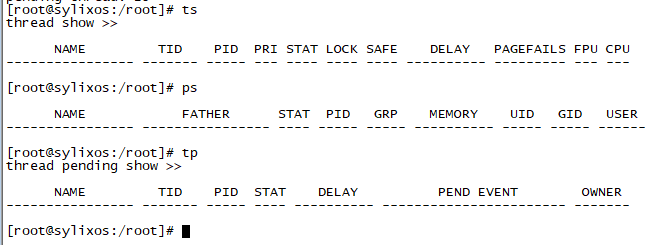
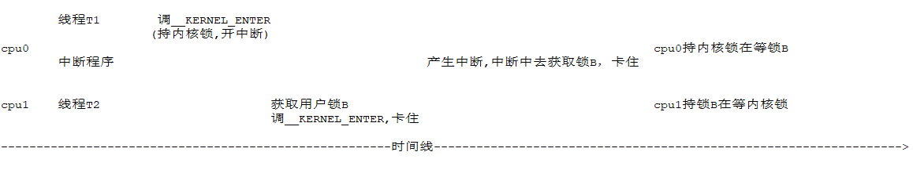

[TOC]


# SylixOS常见问题解决

## SylixOS内存访问错误解决方法(一)

> 本文章介绍了一种分析内存错误提示信息，从而找到源码中错误代码位置的方法，为大家排查这类错误提供一种思路，起到抛砖引玉的作用。

### 测试代码

测试代码如下：

```
#include <stdio.h>

int main (int argc, char **argv)
{
    sleep(2);
    volatile int *a = (int *)0x40; //设置物理地址

    printf("value = %x\n",*a); //读取物理地址中的值
    *a = 0x12; //设置物理地址中的值

    return  (0);
}
```

### 运行结果

在2440模拟器上运行结果：



- 1表示测试程序的加载地址，这里为0x60030000。
- 2表示引起错误的那条指令在内存中的地址，这里为0x600302ec。
- 3表示引起内存访问错误的地址，这里是0x40，意思是系统进行了一个访问0x40这个内存地址的操作，从而导致了内存错误。
- 4表示内存访问错误类型，这里是can not write，意思就是系统执行了一个写内存的操作，但是这个内存地址是不允许写的，从而引起内存错误。

### 反汇编测试程序

本测试程序是用debug模式编译所得，将测试程序和sylixos-objdump工具拷贝到同一个目录下：



在空白处按住shift并右击，选择“在此处打开命令窗口”：


在打开的命令行中输入：

```
C:\Users\databus\Desktop\123>arm-sylixos-eabi-objdump.exe -S -d 2440_test_app >app.dis
```

在同一目录下将生成一个app.dis反汇编文件：



### 分析汇编文件

测试程序的加载地址=0x60030000，引起错误的那条指令在内存中的地址=0x600302ec。所以可以计算出引起错误的那条指令在内存中的偏移为0x600302ec-0x60030000=0x2ec。这个地址就是引起错误的那条指令在反汇编文件的偏移地址：



可以看出0x2ec汇编地址处对应的是一条写内存指令，对应的c语句是“*a = 0x12”，这就是源码中出错的地方。

### release和debug区别

首先来看debug模式下的汇编：



从图中红框中的内容可以看出，在debug模式下变量是在栈中分配的，fp寄存器相当于x86中的ebp寄存器，通过操作fp就可以操作栈中变量对应的内存区。

接着来看下release模式下的汇编：


不知道为啥，release版本反汇编出代码格式有问题。。。但是还是能看出一些东西。上图中第一个红框中的r0和r1分别表示printf中两个参数，其中r1表示的是“*a”的值，由此可见，release版本经过优化后，并没有一个内存空间用来表示a这个变量。这点也可以通过第二个红框中的内容来验证，r3中存放的是要写入到“*a”地址中的值，写入操作是通过一句“str r3, [r4, #64]”语句实现，同样没有一个内存空间用来表示a这个变量，对a变量的操作都被编译器优化到指令中了。

### 驱动模块此类错误排查

通过上面的测试程序例子，大家可以看到，程序一开始就执行了sleep，这是为了有充分的时间通过modules命令查看程序的加载地址。但是如果驱动模块有内存错误的话，怎么查找呢？驱动模块中加sleep后，再通过modules命令是查看不到模块的加载地址的，这时可以先将module_init函数写成空函数，然后注册，接着通过modules查看模块的加载地址，获得加载地址后，接下来的分析方法就同应用程序一样了。

## SylixOS内存访问错误解决方法(二)

> 解决方法(一)介绍的方法比较麻烦，因为需要反汇编要排查文件，当文件比较大时，反汇编的时间就会很长，而且打开一个很大的文件在性能较差的电脑上也需要较长时间，下面介绍一种更简便的方法。

### 测试代码

测试代码如下：

```
#include <stdio.h>

int main (int argc, char **argv)
{
    volatile int *a = (int *)~0x0; //设置物理地址

    printf("value = %x\n",*a); //读取物理地址中的值

    *a = 0x12; //设置物理地址中的值

    return  (0);
}
```

### 运行程序

#### 设置系统环境变量

在命令行输入如下命令，这样在app运行的时候就可以自动打印出各个模块的加载信息，我们主要需要的是模块的基址信息：

```
VPROC_MODULE_SHOW=1
```

#### 运行结果



从图中可知，app程序的崩溃的地址是0x091dd30a，app程序的基址是0x091dd000。

#### 计算崩溃地址偏移值

崩溃地址的偏移值=0x091dd30a - 0x091dd000=0x30a。

#### 使用addr2line工具获取崩溃代码的位置

将addr2line工具和待分析的程序文件(release或者debug的都可以，但不能是strip版本的)拷贝到同一目录下：



打开一个cmd终端，输入如下命令：

```
i386-sylixos-elf-addr2line.exe -e addr2line_test -f 30a
```

其中30a就是之前计算出的崩溃地址的偏移值，-f表示打印崩溃代码所在的函数名字：


从图中可以看出，崩溃的代码是在源文件addr2line_test.c中的第7行，所在的函数是main函数，结合源码看下：



从源码中可以看出，第7行代码访问了一个非法地址，这就是程序崩溃的地方。

## SylixOS驱动中锁的使用

在驱动开发中，有时候配合app测试之后，使用ts等命令发现只能打印出头部信息，主体信息无法打印，如下：



原因：驱动中锁使用不规范导致系统死锁。

驱动测试代码：

```
#define  __SYLIXOS_KERNEL
#include <SylixOS.h>
#include <module.h>

LW_DEV_HDR        __GdevHdr;
LW_OBJECT_HANDLE  ulSem;

static LONG __devOpen(PLW_DEV_HDR pdevhdrHdr,
                      PCHAR       pcName,
                      INT         iFlag,
                      INT         iMode)
{
    ulSem = API_SemaphoreBCreate("test_sem", LW_TRUE, LW_OPTION_OBJECT_GLOBAL, LW_NULL);

    return 0;
}

static INT __devClose(PLW_FD_ENTRY  pFdEntry)
{
    API_SemaphoreBPend(ulSem, LW_OPTION_WAIT_INFINITE);

    /*
     *  some code
     */

    API_SemaphoreBPost(ulSem);

    return 0;
}


static INT  __devIoctl (PLW_FD_ENTRY  pFdEntry, INT  iCmd, LONG lArg)
{
    API_SemaphoreBPend(ulSem, LW_OPTION_WAIT_INFINITE);

    /*
     *  some code
     */
    while(1);

    API_SemaphoreBPost(ulSem);

    return 0;
}

struct file_operations __GdevOps = {
    .fo_open  = __devOpen,
    .fo_close = __devClose,
    .fo_ioctl = __devIoctl
};

static INT  __devRegister(VOID)
{
    INT iDrvNum    = iosDrvInstallEx2(&__GdevOps, LW_DRV_TYPE_NEW_1);   /*  安装驱动程序                */

    return  (iosDevAddEx(&__GdevHdr, "/dev/testdev", iDrvNum, DT_CHR)); /*  创建设备                    */
}

static INT  __devUnregister(VOID)
{
    PLW_DEV_HDR pDev;

    pDev = &__GdevHdr;

    if (pDev) {
        iosDevDelete(pDev);                                             /*  卸载设备                    */
        return  (iosDrvRemove(pDev->DEVHDR_usDrvNum, 0));               /*  卸载驱动程序                */
    } else {
        return  (PX_ERROR);
    }
}

int module_init (void)
{
    __devRegister();

    return 0;
}

void module_exit (void)
{
    __devUnregister();
}
```

APP测试代码：

```
#include <stdio.h>

int main (int argc, char **argv)
{
    INT iFbFd;

    iFbFd = open("/dev/testdev", O_RDWR);
    if (iFbFd < 0) {
        fprintf(stderr, "open /dev/testdev failed.\n");
        return (-1);
    }

    ioctl(iFbFd, NULL, NULL);

    return  (0);
}
```

分析：

- ioctl中使用信号量保护了一段资源，使用while(1)模拟当进程还在执行资源区代码时被用户CTRL+C终止
- 进程的资源回收工作是由t_reclaim线程负责的
- t_reclaim线程会通过vprocIoReclaim函数回收进程打开的文件，主体回收代码使用_G_ulVProcMutex互斥锁保护
- 在回收由驱动创建的设备文件资源时，最终会调用到驱动里的close函数
- close函数中的ulSem信号量在ioctl中被用户进程持有，所以t_reclaim线程此时被阻塞，**但是注意！此时t_reclaim线程还持有_G_ulVProcMutex互斥锁！**
- 这时使用ts查看线程信息，会调用vprocGetPidByTcbdesc函数以获取进程 id，这个函数中同样使用**_G_ulVProcMutex互斥锁**保护获取过程，但是此时**_G_ulVProcMutex互斥锁**是被t_reclaim线程持有的，所以当前线程阻塞，不会再输出信息

建议：

通过此案例可以看出，资源回收不当的话，会给系统带来负面影响。所以在驱动和应用开发中要注意进程结束时，资源该如何正确的回收，比如上面的测试用例如果能保证在ioctl执行完后再结束进程，就不会有死锁产生了。

## 自旋锁引起的死锁问题

调试GPU时，遇到的死锁问题，具体的序列如下：

- cpu0上某线程T1调用了系统含有__KERNEL_ENTER的接口
- __KERNEL_ENTER中会获得内核锁，然后使能中断，这时内核锁是归T1线程持有
- 就在使能中断后，GPU中断来了，接着执行GPU中断程序（在cpu0上执行）
- 这时在cpu1上的线程T2获取了用户自定义的锁B
- 线程T2同样调用了系统含有__KERNEL_ENTER的接口
- 由于内核锁已经被cpu0上的T1线程持有，所以cpu1上的T2线程此时卡住
- 这时GPU中断程序中也要去获取用户自定义的锁B，但是锁B已经被cpu1上的T2线程持有
- 中断程序卡住
- 由于中断程序卡死，所以不会执行API_InterExit，也就不会调用调度程序，从而T1线程再也没有机会被调度执行
- 由于之前cpu0上的中断程序没退出，cpu0上的中断还处于关闭状态，可怜的tick中断也无法被执行了，更没法调度了
- 由于T1线程没可能再次执行，也就没可能释放内核锁了，此时整个系统GG



分析：

- 死锁的诱发原因是T1线程无法被调度执行，从而无法释放内核锁
- 在中断上下文中程序被spinlock卡死，从而导致中断程序无法正常结束（在实际案例中是由于在lock和unlock之间调用了信号量post操作）
- 如果中断程序能正常结束，那么T1线程就能被再次调度，从而解决死锁问题

解决方法：

- 第一种方法就是修改spinlock保护的临界区代码逻辑，不要使用带__KERNEL_ENTER的系统接口
- 第二种方法就是将中断处理放到中断延迟队列中去执行

在实际的案例中，使用了第二种方法，因为由于驱动程序的复杂性，可能导致用第一种方法会导致驱动逻辑的较大改动，从而带来较大的工作量。