# SylixOS 应用移植指导——以Redis5.0.3为例

> 本文章致力于指导有一定SylixOS开发基础的用户进行中大型应用软件移植。
>
> 没有SylixOS应用开发基础的建议先参考IDE自带的《RealEvo-IDE使用手册.pdf》，了解SylixOS IDE下的不同的工程类型，尝试过APP与动态库编译后再读本文，会更容易上手。
>
> 推荐书籍：《程序员的自我修养--链接、装载和库》

## 总述：

SylixOS应用移植遵循的四步原则是：**搬 改 测 查**。

###  搬：

既然是移植，首先我们要确定移植的目的。本文以Redis5.0.3为例，源码来自Redis官网，源码编译环境为Ubuntu20.0，移植目标环境是SylixOS X86平台，版本是2.0.1。移植的目标是将Redis-Server、Redis-Client运行在SylixOS环境下，编译出的其他文件，可移植的就一起加入工程。

移植不是盲目的，像Redis这样的，对第三方库依赖非常少的，可行性较高。如果是Linux下依赖Linux比较核心机制的库就很难移植，比如一些依赖X11的中间件。而那些根本不开源只提供Linux下动态库的就更不用说了。

言归正传，何谓搬，搬就是希望将Linux下的整个工程源码、编译流程、生成的文件，分毫不动的在SylixOS下实现一遍。这当然是移植的最好结果，然而事实是SylixOS并不是Linux，或多或少都存在差异性，差异体现在API实现的数量、进程创建的机制、系统参数的配置等各方面。

所以，原则上应用移植需要照搬Linux工程源码，并参考Linux编译流程，搭建基于SylixOS IDE的应用工程。

### 改：

然而照搬的工程编译一般没法一次通过，甚至编译通过后，运行时会提示“can not find symbol xxx“ 的提示，这是因为SylixOS是交叉编译的，编译器并不清楚实际运行的环境中是否存在某个符号（符号可以理解为函数、变量），只会有告警（有声明不会告警），而无法判断你的应用是否正确的实现了所有需要的符号。

所以在工程编译阶段，由于操作系统的不同，需要我们修改工程源码。大部分情况下是注释掉不支持的接口，移植性较好的工程一般有config.h供用户注释相关宏定义，以做到工程裁剪或替换功能。小部分情况需要我们自行修改相关实现，以适用于SylixOS的运行环境。

当工程修改到：编译不会报错，编译完成的可执行文件（ELF）可以上传到SylixOS运行环境下，运行不会提示找不到符号表了。别太早高兴，这只说明，移植的第一步终于完成了。

### 测

既然都可以运行了，那就开测吧。一般来说，Linux的工程源码内都会配有test目录，或其他测试脚本。测的目的就是通过这些测试用例。

当然，初步移植的应用大概率是 ./xxx 运行的时候，应用直接跑飞，系统报个栈回溯。无论是应用直接跑飞、测试用例跑飞、还是测试用例表现结果与预想不一致，这都说明我们的移植还存在问题，需要开始 查。

### 查

问题排查，移植中最头疼的一部，由于问题五花八门都有可能，在后续的移植指导中会带着提到。

当然，大概率问题是出在第二步 改 那里，可以重点关注一下自己改的是否存在问题。

测和查是循环的过程，当排完所有问题，所有测试用例通过之后，可以说自己的应用移植已经完成大部分了。那还有什么问题呢？那就涉及到更高级的一些玩法，比如跨平台配置，工程的美观性配置等等。

 

接下来，就以Redis5.0.3的移植过程为例，演示SylixOS的应用移植吧。

## 前期准备

首先需要有一台Linux作为参考，SylixOS工程最终的表现形式与Linux越接近，说明移植的效果越好。

其次需要找到需要移植的应用源码，搞清它库之间的依赖关系，并确保其所有的依赖库（SylixOS下的动态库，或源码）可以获得。举个例子，我需要移植A工程，其依赖libB.so，是A工程内自带并编译的，依赖zlib，依赖libssl。由于libB.so是工程自带并有源码编译的，不需要关心，libssl是SylixOS base工程内自带的，不需要关心，只需要链接，而zlib是没有的，这时候就需要先自行下载zlib源码并编译。

像zlib、libxml2、libjson这类的库，自身无依赖，只作为其他工程依赖的库，移植都比较简单，大部分是编译过就能用的。

然后需要有SylixOS的验证环境，这里推荐使用真机，如果没有就用IDE自带的模拟器验证吧。

## Linux下编译

移植不是乱移，不是把所有.c编译一下就可以的。首先我们需要在Linux下确定需要编译的.c文件。

获得工程源码，并解压：

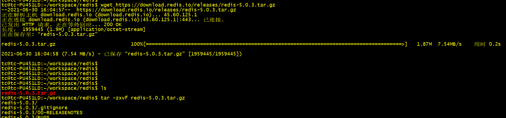

进入Linux工程目录，Linux下的工程一般是三步走，即./configure、make、make install ：

进目录一看，没有configure，那就看一下Makefile，发现实际调用的是src目录下的Makefile：

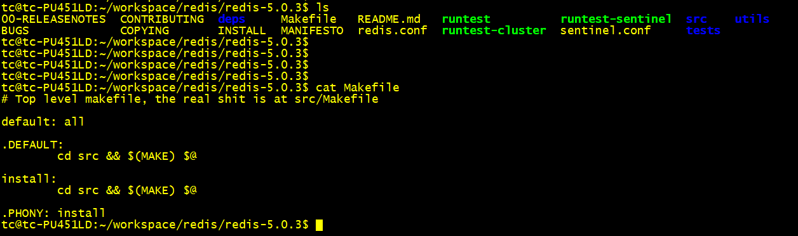

那就敲个make看看，发现有报错提示：

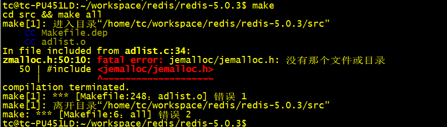

这里是因为Redis可以依赖jemalloc，而我的环境下没有jemalloc，刚好SylixOS也不支持jemalloc，百度可知 make MALLOC=libc 可以使用普通的malloc。

敲make MALLOC=libc，发现编译的时候只提示编出哪些.o，而没有完整的编译过程，这点不好，不利于我们移植，通过V=1参数让gcc打印完整过程：

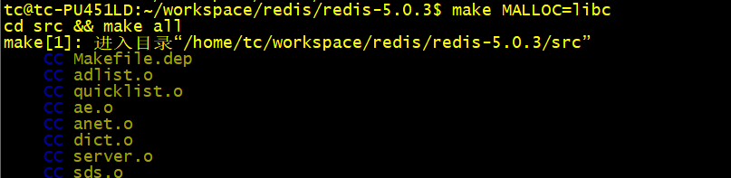

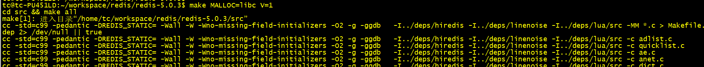

等待编译中。。。

发现链接的时候报了错，是没有liblua.a，且这个库应当在deps目录下。进入deps目录，发现有一些redis的依赖库，分别是lua、hiredis、jemalloc和linenoise。lua和linenoise是必要的，hiredis是redis client的依赖库，jemalloc不是必要的。那就先编译依赖库：

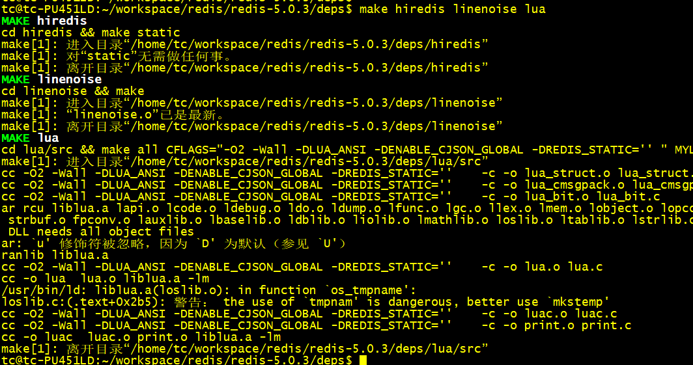

再切回上一级目录继续编译redis，发现已经可以编完：

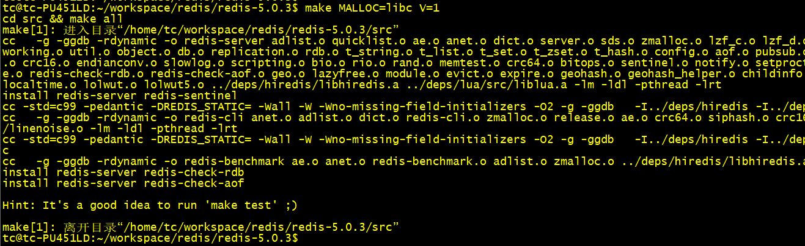

那就make install一下，看看究竟编了哪些ELF，如果不喜欢install到/usr/bin之类的目录下，可以自行指定PREFIX:

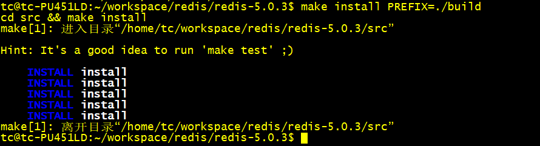

看一下build目录，编出了redis-server、redis-client以及其他附带的ELF：

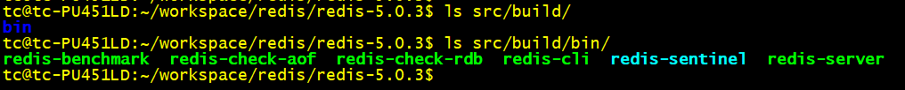

这时候我们明确这次移植的流程：

首先需要编译linenoise、liblua.a、libhiredis.so。再依赖其编译出redis-server、redis-client等其他工具。并且，我们有了所有工程的编译流程，可以获得以下信息：需要编译的.c文件名、编译的参数、链接参数、库依赖关系等。这为我们的移植铺平了道路。什么？你说不知道liblua要编哪些文件？make distclean一下，再到deps目录下make lua去。

把所有的编译流程贴到notepad，准备开始下一步的移植。

## 创建IDE工程

总结一下本阶段的工作：

### **已知：**

1. Redis源码
2. Redis编译流程
3. 需要编译的依赖库
4. 需要编译出的目标文件

### **目标：**

1. 在SylixOS IDE下构建工程
2. 配置与Linux下一致的编译流程
3. 编译出所有依赖的库
4. 编译出最终的可执行文件

### **SylixOS IDE 工程**

在把Linux工程代码贴入IDE工程之前，首先需要了解一下SylixOS的工程结构和Makefile规则。

首先我们创建一个专家模式的APP工程，关于专家模式与普通模式的区别，可以参考《RealEvo-IDE使用手册.pdf》，总结一下就是：专家模式所有的配置通过修改Makefile来实现，普通模式所有的配置通过图形化勾选来实现，这两种模式不要混用，否则可能出现在Makefile里改了内容但编译一下内容消失的“惨案”。

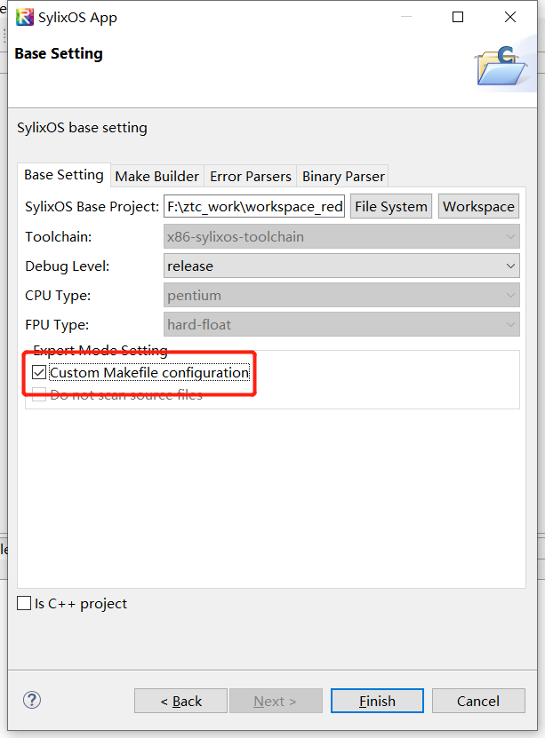

刚创建的工程一般有以下几个文件：

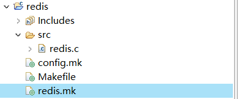

简单介绍一下几个文件：

- **src目录：**

一般工程源码直接贴入此目录，默认会创建一个和工程同名的.c文件，可删除。

- **config.mk：**

指定工程依赖的BASE路径，以及工程的debug level是Debug还是Release，一般不需要改动。

- **Makefile：**

SylixOS工程的Makefile文件，里面大部分都是include各种模板，其中用户唯一需要关心的就是“Include targets makefiles”部分：

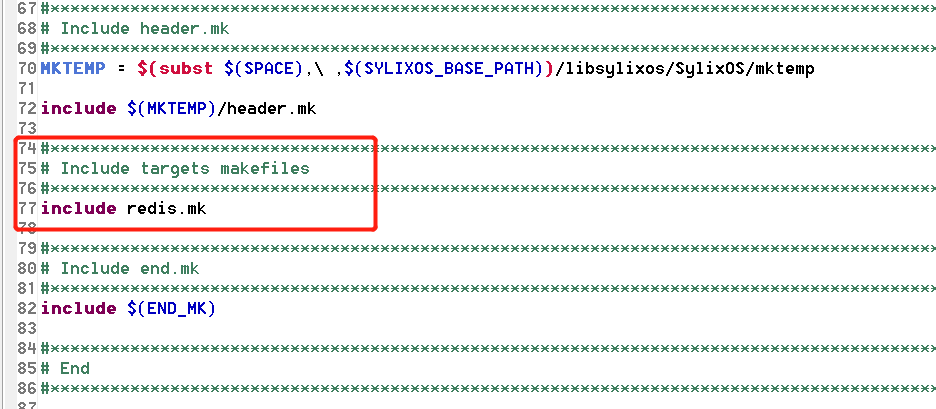

这里include的就是实际工程需要编译的app或者库的makefile文件了，默认只include工程同名的mk文件。而随着移植的进展，可能会有libA.mk，libB.mk、C.mk、D.mk等等，需要在此位置分别include进来，否则编译器不会编译。

- **redis.mk：**

这里是redis.mk，是因为我工程名字叫redis，所以自动生成的。这个mk下的宏分别对应的内容为：

- **LOCAL_TARGET_NAME：**

生成的目标名称，一般生成动态库A的名称格式是“LOCAL_TARGET_NAME := libA.aso”，生成静态库A名称的格式是“LOCAL_TARGET_NAME := libA.a”，生成可执行文件A的名称格式就是 “LOCAL_TARGET_NAME := A”。需要注意的是，这里的名称并**不会**让编译器按照APP或动态库的模板去编译，所以不要认为你改了target_name编译器就直接帮你编动态库了，实际是有地方指定的，下面会说。

- **LOCAL_SRCS :**

这里指定编译的所有源文件。

- **LOCAL_INC_PATH :**

这里指定编译的头文件路径，注意，有时候头文件是有先后顺序之分的，最好的办法就是直接参考Linux编译流程。

- **LOCAL_DSYMBOL :**

这里指定的是编译的宏或者符号，也就是-Da=xxx，相当于.c里写了#define a xxx。属于GCC的语法，所以一样可以参考Linux下的编译流程。

- **LOCAL_CFLAGS : LOCAL_CXXFLAGS :**

分别是gcc和g++的编译参数。

- **LOCAL_DEPEND_LIB : LOCAL_DEPEND_LIB_PATH：**

指定工程的依赖库和依赖库路径，这里的路径指的是IDE下的库路径，即Windows下的路径，不是SylixOS运行环境下的库路径。依赖SylixOS Base的libcextern库的写法为：

```
LOCAL_DEPEND_LIB      := \
-lcextern
LOCAL_DEPEND_LIB_PATH := \
-L"$(SYLIXOS_BASE_PATH)/libcextern/$(Output)"
```

- **LOCAL_USE_CXX :LOCAL_USE_CXX_EXCEPT :**

是否使能C++，是否使用C++异常库，如果是C++工程就=yes。

- **LOCAL_NO_UNDEF_SYM、LOCAL_USE_GCOV、LOCAL_USE_OMP：**

基本用不到，感兴趣可以自己研究。

- **LOCAL_PRE_LINK_CMD、LOCAL_POST_LINK_CMD、LOCAL_PRE_STRIP_CMD、LOCAL_POST_STRIP_CMD：**

对应link阶段或strip阶段执行的命令，一般用不到，巧的是redis还真用到了。

- **include $(APPLICATION_MK)**

这个很重要，一般位于.mk的最后面，指定本mk使用哪一套模板，APP就是APPLICATION_MK，动态库/静态库是LIBRARY_MK。这里指定了本工程的最终属性。

了解了IDE的工程属性以及Makefile模板规则，可以贴入代码了。先残忍了删了自带的redis.c，然后将linux下的工程源码拖到工程下，我一般推荐是configure过后的文件贴过来，而不是拿tar.gz直接解压的，因为configure一般会生成config.h，并做过第一遍的修改。当然由于redis没有configure，区别倒不是太大：

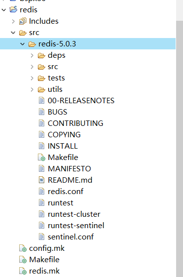

### 添加Makefile文件

前面我们知道了，要想编redis-server，需要先编译lua，要想编译redis-client，需要先编译linenoise、hiredis，什么，你说怎么知道的？不知道就看redis-server编译的link阶段打印，看看它链接了哪些库，比如-llua，-lhiredis。

简单分析一下，lua和hiredis是库的形式存在的，linenoise是单独编成.o链接的，那就不用管linenoise，到时候填到mk里就行，再仔细看看，lua是变成静态库，hiredis是编成动态库。

那就从lua开始，首先复制个mk，取个名叫liblua.mk。再回到Linux下，如果lua的编译流程没了，就make distclean一下，然后在deps目录下， make lua > ./lua.log，获得lua.log：

```
(cd hiredis && make clean) > /dev/null || true
(cd linenoise && make clean) > /dev/null || true
(cd lua && make clean) > /dev/null || true
(cd jemalloc && [ -f Makefile ] && make distclean) > /dev/null || true
(rm -f .make-*)
(echo "" > .make-cflags)
(echo "" > .make-ldflags)
[32;1mMAKE[0m [37;1mlua[0m
cd lua/src && make all CFLAGS="-O2 -Wall -DLUA_ANSI -DENABLE_CJSON_GLOBAL -DREDIS_STATIC='' " MYLDFLAGS="" AR="ar rcu"
make[1]: 杩涘叆鐩綍鈥�/home/tc/workspace/redis/redis-5.0.3/deps/lua/src鈥�
cc -O2 -Wall -DLUA_ANSI -DENABLE_CJSON_GLOBAL -DREDIS_STATIC=''    -c -o lapi.o lapi.c
cc -O2 -Wall -DLUA_ANSI -DENABLE_CJSON_GLOBAL -DREDIS_STATIC=''    -c -o lcode.o lcode.c
cc -O2 -Wall -DLUA_ANSI -DENABLE_CJSON_GLOBAL -DREDIS_STATIC=''    -c -o ldebug.o ldebug.c
cc -O2 -Wall -DLUA_ANSI -DENABLE_CJSON_GLOBAL -DREDIS_STATIC=''    -c -o ldo.o ldo.c
cc -O2 -Wall -DLUA_ANSI -DENABLE_CJSON_GLOBAL -DREDIS_STATIC=''    -c -o ldump.o ldump.c
cc -O2 -Wall -DLUA_ANSI -DENABLE_CJSON_GLOBAL -DREDIS_STATIC=''    -c -o lfunc.o lfunc.c
cc -O2 -Wall -DLUA_ANSI -DENABLE_CJSON_GLOBAL -DREDIS_STATIC=''    -c -o lgc.o lgc.c
cc -O2 -Wall -DLUA_ANSI -DENABLE_CJSON_GLOBAL -DREDIS_STATIC=''    -c -o llex.o llex.c
cc -O2 -Wall -DLUA_ANSI -DENABLE_CJSON_GLOBAL -DREDIS_STATIC=''    -c -o lmem.o lmem.c
cc -O2 -Wall -DLUA_ANSI -DENABLE_CJSON_GLOBAL -DREDIS_STATIC=''    -c -o lobject.o lobject.c
cc -O2 -Wall -DLUA_ANSI -DENABLE_CJSON_GLOBAL -DREDIS_STATIC=''    -c -o lopcodes.o lopcodes.c
cc -O2 -Wall -DLUA_ANSI -DENABLE_CJSON_GLOBAL -DREDIS_STATIC=''    -c -o lparser.o lparser.c
cc -O2 -Wall -DLUA_ANSI -DENABLE_CJSON_GLOBAL -DREDIS_STATIC=''    -c -o lstate.o lstate.c
cc -O2 -Wall -DLUA_ANSI -DENABLE_CJSON_GLOBAL -DREDIS_STATIC=''    -c -o lstring.o lstring.c
cc -O2 -Wall -DLUA_ANSI -DENABLE_CJSON_GLOBAL -DREDIS_STATIC=''    -c -o ltable.o ltable.c
cc -O2 -Wall -DLUA_ANSI -DENABLE_CJSON_GLOBAL -DREDIS_STATIC=''    -c -o ltm.o ltm.c
cc -O2 -Wall -DLUA_ANSI -DENABLE_CJSON_GLOBAL -DREDIS_STATIC=''    -c -o lundump.o lundump.c
cc -O2 -Wall -DLUA_ANSI -DENABLE_CJSON_GLOBAL -DREDIS_STATIC=''    -c -o lvm.o lvm.c
cc -O2 -Wall -DLUA_ANSI -DENABLE_CJSON_GLOBAL -DREDIS_STATIC=''    -c -o lzio.o lzio.c
cc -O2 -Wall -DLUA_ANSI -DENABLE_CJSON_GLOBAL -DREDIS_STATIC=''    -c -o strbuf.o strbuf.c
cc -O2 -Wall -DLUA_ANSI -DENABLE_CJSON_GLOBAL -DREDIS_STATIC=''    -c -o fpconv.o fpconv.c
cc -O2 -Wall -DLUA_ANSI -DENABLE_CJSON_GLOBAL -DREDIS_STATIC=''    -c -o lauxlib.o lauxlib.c
cc -O2 -Wall -DLUA_ANSI -DENABLE_CJSON_GLOBAL -DREDIS_STATIC=''    -c -o lbaselib.o lbaselib.c
cc -O2 -Wall -DLUA_ANSI -DENABLE_CJSON_GLOBAL -DREDIS_STATIC=''    -c -o ldblib.o ldblib.c
cc -O2 -Wall -DLUA_ANSI -DENABLE_CJSON_GLOBAL -DREDIS_STATIC=''    -c -o liolib.o liolib.c
cc -O2 -Wall -DLUA_ANSI -DENABLE_CJSON_GLOBAL -DREDIS_STATIC=''    -c -o lmathlib.o lmathlib.c
cc -O2 -Wall -DLUA_ANSI -DENABLE_CJSON_GLOBAL -DREDIS_STATIC=''    -c -o loslib.o loslib.c
cc -O2 -Wall -DLUA_ANSI -DENABLE_CJSON_GLOBAL -DREDIS_STATIC=''    -c -o ltablib.o ltablib.c
cc -O2 -Wall -DLUA_ANSI -DENABLE_CJSON_GLOBAL -DREDIS_STATIC=''    -c -o lstrlib.o lstrlib.c
cc -O2 -Wall -DLUA_ANSI -DENABLE_CJSON_GLOBAL -DREDIS_STATIC=''    -c -o loadlib.o loadlib.c
cc -O2 -Wall -DLUA_ANSI -DENABLE_CJSON_GLOBAL -DREDIS_STATIC=''    -c -o linit.o linit.c
cc -O2 -Wall -DLUA_ANSI -DENABLE_CJSON_GLOBAL -DREDIS_STATIC=''    -c -o lua_cjson.o lua_cjson.c
cc -O2 -Wall -DLUA_ANSI -DENABLE_CJSON_GLOBAL -DREDIS_STATIC=''    -c -o lua_struct.o lua_struct.c
cc -O2 -Wall -DLUA_ANSI -DENABLE_CJSON_GLOBAL -DREDIS_STATIC=''    -c -o lua_cmsgpack.o lua_cmsgpack.c
cc -O2 -Wall -DLUA_ANSI -DENABLE_CJSON_GLOBAL -DREDIS_STATIC=''    -c -o lua_bit.o lua_bit.c
ar rcu liblua.a lapi.o lcode.o ldebug.o ldo.o ldump.o lfunc.o lgc.o llex.o lmem.o lobject.o lopcodes.o lparser.o lstate.o lstring.o ltable.o ltm.o lundump.o lvm.o lzio.o strbuf.o fpconv.o lauxlib.o lbaselib.o ldblib.o liolib.o lmathlib.o loslib.o ltablib.o lstrlib.o loadlib.o linit.o lua_cjson.o lua_struct.o lua_cmsgpack.o lua_bit.o	# DLL needs all object files
ranlib liblua.a
cc -O2 -Wall -DLUA_ANSI -DENABLE_CJSON_GLOBAL -DREDIS_STATIC=''    -c -o lua.o lua.c
cc -o lua  lua.o liblua.a -lm 
cc -O2 -Wall -DLUA_ANSI -DENABLE_CJSON_GLOBAL -DREDIS_STATIC=''    -c -o luac.o luac.c
cc -O2 -Wall -DLUA_ANSI -DENABLE_CJSON_GLOBAL -DREDIS_STATIC=''    -c -o print.o print.c
cc -o luac  luac.o print.o liblua.a -lm 
make[1]: 绂诲紑鐩綍鈥�/home/tc/workspace/redis/redis-5.0.3/deps/lua/src鈥�
```

多么清晰的流程，需要编译的文件就是lapi.c、lcode.c、ldebug.c。。。编译参数是-O2 -Wall，实际上SylixOS工程自带了相关参数，不重要。定义的符号是：-DLUA_ANSI -DENABLE_CJSON_GLOBAL -DREDIS_STATIC=''。

再往下看：

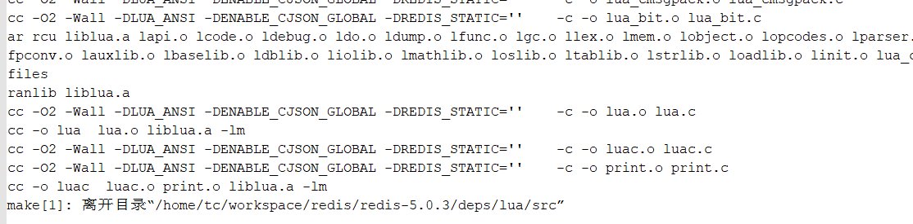

发现libua.a只需要ar 这些.o，而下面还编了个luac出来，对我们的redis没啥用，可以不管。

那么，我们的liblua.mk参考这些流程，应该很容易编写出来：

```
#*********************************************************************************************************
#
#                                    中国软件开源组织
#
#                                   嵌入式实时操作系统
#
#                                SylixOS(TM)  LW : long wing
#
#                               Copyright All Rights Reserved
#
#--------------文件信息--------------------------------------------------------------------------------
#
# 文   件   名: liblua.mk
#
# 创   建   人: RealEvo-IDE
#
# 文件创建日期: 2019 年 03 月 06 日
#
# 描        述: 本文件由 RealEvo-IDE 生成，用于配置 Makefile 功能，请勿手动修改
#*********************************************************************************************************

#*********************************************************************************************************
# Clear setting
#*********************************************************************************************************
include $(CLEAR_VARS_MK)

#*********************************************************************************************************
# Target
#*********************************************************************************************************
LOCAL_TARGET_NAME := liblua.a

#*********************************************************************************************************
# Source list
#*********************************************************************************************************
LOCAL_SRCS := \
src/redis-5.0.3/deps/lua/src/lapi.c \
src/redis-5.0.3/deps/lua/src/lcode.c \
src/redis-5.0.3/deps/lua/src/ldebug.c \
src/redis-5.0.3/deps/lua/src/ldo.c \
src/redis-5.0.3/deps/lua/src/ldump.c \
src/redis-5.0.3/deps/lua/src/lfunc.c \
src/redis-5.0.3/deps/lua/src/lgc.c \
src/redis-5.0.3/deps/lua/src/llex.c \
src/redis-5.0.3/deps/lua/src/lmem.c \
src/redis-5.0.3/deps/lua/src/lobject.c \
src/redis-5.0.3/deps/lua/src/lopcodes.c \
src/redis-5.0.3/deps/lua/src/lparser.c \
src/redis-5.0.3/deps/lua/src/lstate.c \
src/redis-5.0.3/deps/lua/src/lstring.c \
src/redis-5.0.3/deps/lua/src/ltable.c \
src/redis-5.0.3/deps/lua/src/ltm.c \
src/redis-5.0.3/deps/lua/src/lundump.c \
src/redis-5.0.3/deps/lua/src/lvm.c \
src/redis-5.0.3/deps/lua/src/lzio.c \
src/redis-5.0.3/deps/lua/src/strbuf.c \
src/redis-5.0.3/deps/lua/src/fpconv.c \
src/redis-5.0.3/deps/lua/src/lauxlib.c \
src/redis-5.0.3/deps/lua/src/lbaselib.c \
src/redis-5.0.3/deps/lua/src/ldblib.c \
src/redis-5.0.3/deps/lua/src/liolib.c \
src/redis-5.0.3/deps/lua/src/lmathlib.c \
src/redis-5.0.3/deps/lua/src/loslib.c \
src/redis-5.0.3/deps/lua/src/ltablib.c \
src/redis-5.0.3/deps/lua/src/lstrlib.c \
src/redis-5.0.3/deps/lua/src/loadlib.c \
src/redis-5.0.3/deps/lua/src/linit.c \
src/redis-5.0.3/deps/lua/src/lua_cjson.c \
src/redis-5.0.3/deps/lua/src/lua_struct.c \
src/redis-5.0.3/deps/lua/src/lua_cmsgpack.c \
src/redis-5.0.3/deps/lua/src/lua_bit.c

#*********************************************************************************************************
# Header file search path (eg. LOCAL_INC_PATH := -I"Your header files search path")
#*********************************************************************************************************
LOCAL_INC_PATH := \
-I"src/lua/src"

#*********************************************************************************************************
# Pre-defined macro (eg. -DYOUR_MARCO=1)
#*********************************************************************************************************
LOCAL_DSYMBOL := -DLUA_USE_LINUX=1

#*********************************************************************************************************
# Compiler flags
#*********************************************************************************************************
LOCAL_CFLAGS   := 
LOCAL_CXXFLAGS := 

#*********************************************************************************************************
# Depend library (eg. LOCAL_DEPEND_LIB := -la LOCAL_DEPEND_LIB_PATH := -L"Your library search path")
#*********************************************************************************************************
LOCAL_DEPEND_LIB      := 
LOCAL_DEPEND_LIB_PATH := 

#*********************************************************************************************************
# C++ config
#*********************************************************************************************************
LOCAL_USE_CXX        := no
LOCAL_USE_CXX_EXCEPT := no

#*********************************************************************************************************
# Code coverage config
#*********************************************************************************************************
LOCAL_USE_GCOV := no

#*********************************************************************************************************
# OpenMP config
#*********************************************************************************************************
LOCAL_USE_OMP := no

#*********************************************************************************************************
# User link command
#*********************************************************************************************************
LOCAL_PRE_LINK_CMD   := 
LOCAL_POST_LINK_CMD  := 
LOCAL_PRE_STRIP_CMD  := 
LOCAL_POST_STRIP_CMD := 

#*********************************************************************************************************
# Depend target
#*********************************************************************************************************
LOCAL_DEPEND_TARGET := 

include $(LIBRARY_MK)

#*********************************************************************************************************
# End
#*********************************************************************************************************
```

同样的，我们很容易编出libhiredis.mk：

```
#*********************************************************************************************************
#
#                                    中国软件开源组织
#
#                                   嵌入式实时操作系统
#
#                                SylixOS(TM)  LW : long wing
#
#                               Copyright All Rights Reserved
#
#--------------文件信息--------------------------------------------------------------------------------
#
# 文   件   名: libhiredis.mk
#
# 创   建   人: RealEvo-IDE
#
# 文件创建日期: 2019 年 03 月 06 日
#
# 描        述: 本文件由 RealEvo-IDE 生成，用于配置 Makefile 功能，请勿手动修改
#*********************************************************************************************************

#*********************************************************************************************************
# Clear setting
#*********************************************************************************************************
include $(CLEAR_VARS_MK)

#*********************************************************************************************************
# Target
#*********************************************************************************************************
LOCAL_TARGET_NAME := libhiredis.so

#*********************************************************************************************************
# Source list
#*********************************************************************************************************
LOCAL_SRCS := \
src/redis-5.0.3/deps/hiredis/net.c \
src/redis-5.0.3/deps/hiredis/hiredis.c \
src/redis-5.0.3/deps/hiredis/sds.c \
src/redis-5.0.3/deps/hiredis/async.c \
src/redis-5.0.3/deps/hiredis/read.c

#*********************************************************************************************************
# Header file search path (eg. LOCAL_INC_PATH := -I"Your header files search path")
#*********************************************************************************************************
LOCAL_INC_PATH := \
-I"src/redis-5.0.3/deps/hiredis"

#*********************************************************************************************************
# Pre-defined macro (eg. -DYOUR_MARCO=1)
#*********************************************************************************************************
LOCAL_DSYMBOL := 

#*********************************************************************************************************
# Compiler flags
#*********************************************************************************************************
LOCAL_CFLAGS   := -std=c99 -pedantic -Wstrict-prototypes -Wwrite-strings -g -ggdb
LOCAL_CXXFLAGS := 

#*********************************************************************************************************
# Depend library (eg. LOCAL_DEPEND_LIB := -la LOCAL_DEPEND_LIB_PATH := -L"Your library search path")
#*********************************************************************************************************
LOCAL_DEPEND_LIB      := 
LOCAL_DEPEND_LIB_PATH := 

#*********************************************************************************************************
# C++ config
#*********************************************************************************************************
LOCAL_USE_CXX        := no
LOCAL_USE_CXX_EXCEPT := no

#*********************************************************************************************************
# Code coverage config
#*********************************************************************************************************
LOCAL_USE_GCOV := no

#*********************************************************************************************************
# OpenMP config
#*********************************************************************************************************
LOCAL_USE_OMP := no

#*********************************************************************************************************
# User link command
#*********************************************************************************************************
LOCAL_PRE_LINK_CMD   := 
LOCAL_POST_LINK_CMD  := 
LOCAL_PRE_STRIP_CMD  := 
LOCAL_POST_STRIP_CMD := 

#*********************************************************************************************************
# Depend target
#*********************************************************************************************************
LOCAL_DEPEND_TARGET := 

include $(LIBRARY_MK)

#*********************************************************************************************************
# End
#*********************************************************************************************************
```

一定要注意.c文件的**路径**问题。

这时候，我们工程应该是这样的：

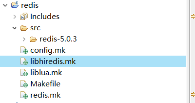

注意，别忘了把自己创建的mk加入Makfile：

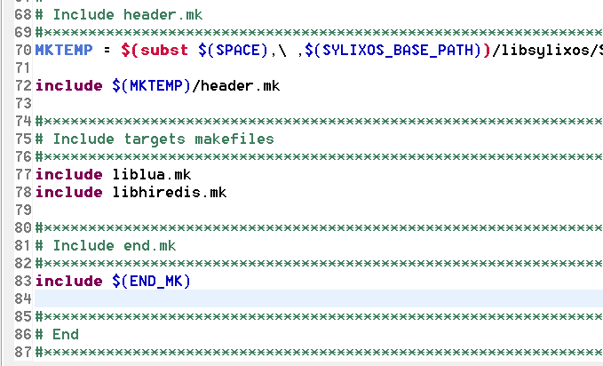

尝试编译一下，两个库都编出来了：

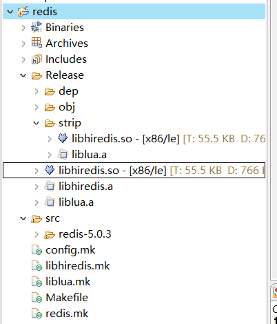

下面要开始编redis-server和redis-client了。