[TOC]


# SylixOS 最小系统开发

## 引导SylixOS

​		在学习BSP移植之前，我们先来看看SylixOS是如何被Bootloader引导起来的。我们都知道，任何一种操作系统内核运行之前都需要通过某种方式导入到内存中，然后CPU跳转到内核入口处运行，这个过程就叫做引导系统。至于具体通过什么方式导入到内存中，根据实际硬件系统不同而不同，可能是通过网络方式下载到内存中，也可能是从磁盘等存储介质上读取到内存中，甚至有可能是通过USB下载到内存中。这些工作一般都是由引导程序做的，常见的引导程序如x86平台上的BIOS、arm平台上的U-Boot、龙芯平台上的PMON等等。引导程序大致的作用就是初始化最基本的硬件环境，然后将操作系统内核加载到内存中，最后跳转过去执行内核。

​		在嵌入式领域使用的最多的Bootloader是U-Boot，SylixOS内核镜像也可以使用U-Boot来引导，通过这篇文章我们来学习如何使用U-Boot来引导SylixOS。

​		我们本次教程使用的是全志R16平台，通过查阅芯片手册得知，R16上电会首先从SDC0(SD卡控制器0)寻找Bootloader运行：


​		这个Bootloader就是U-Boot，U-Boot运行后我们就可以使用U-Boot的***fatload*** 命令将SylixOS镜像从SD卡中加载到内存固定位置。我们首先通过***fatls*** 命令查看SD卡中有哪些文件：

```
=> fatls mmc 0:1
            System Volume Information/
  3202776   bsp_clockwork.bin
  2313216   rootfs.img
   797448   liteos.bin
  3574472   bsp_clockwork.bin2
            ofi/
            3ds/
            a9lh/
            boot9strap/
            FilesToInstall/
            luma/

4 file(s), 7 dir(s)

=>
```

​		其中bsp_clockwork.bin就是SylixOS内核镜像，SylixOS镜像一般加载到内存中时都是放在内存基址处的，通过查阅R16芯片手册得知，内存基址为0x40000000：


​		所以我们可以通过***fatload*** 命令将SylixOS镜像加载到0x40000000地址：

```
=> fatload mmc 0:1 40000000 bsp_clockwork.bin
reading bsp_clockwork.bin
3202776 bytes read in 791 ms (3.9 MiB/s)
=>
```

​		加载完成后就可以直接跳转到0x40000000地址处运行SylixOS内核镜像了，这是通过***go*** 命令实现：

```
=> go 40000000
## Starting application at 0x40000000 ...
environment variables load from /etc/profile fail, error: No such file or directory
Press <n> to NOT execute /etc/startup.sh (timeout: 1 sec(s))
can not open /etc/startup.sh: No such file or directory
sysname  : sylixos
nodename : sylixos
release  : Enterprise
version  : 2.0.0
machine  : Allwinner R16 (Quad-core ARM Cortex-A7 1.2GHz VFPv4)

                          [[                          (R)
 [[[[           [[[[      [[             [[[[    [[[[
[[  [[            [[                    [[  [[  [[  [[
[[      [[  [[    [[    [[[[    [[  [[  [[  [[  [[
 [[     [[  [[    [[      [[    [[  [[  [[  [[   [[
  [[    [[  [[    [[      [[     [[[[   [[  [[    [[
   [[   [[  [[    [[      [[      [[    [[  [[     [[
    [[  [[  [[    [[      [[     [[[[   [[  [[      [[
[[  [[  [[  [[    [[      [[    [[  [[  [[  [[  [[  [[
 [[[[    [[[[   [[[[[[  [[[[[[  [[  [[   [[[[    [[[[
           [[
          [[    KERNEL: LongWing(C) 2.0.0
       [[[[   COPYRIGHT ACOINFO Co. Ltd. 2006 - 2020

SylixOS license: Commercial & GPL.
SylixOS kernel version: 2.0.0 Code name: Enterprise

CPU     : Allwinner R16 (Quad-core ARM Cortex-A7 1.2GHz VFPv4)
CACHE   : 64KBytes(D-32K/I-32K) L1-Cache per core, 512KBytes L2-Cache
PACKET  : ALLWINNER R16 Demo
ROM SIZE: 0x00400000 Bytes (0x00000000 - 0x003fffff)
RAM SIZE: 0x0c800000 Bytes (0x40000000 - 0x4c7fffff)
BSP     : BSP version 1.0.0 for Enterprise
[root@sylixos:/root]#
```

​		如果一切顺利的话就可以看到SylixOS的启动Logo了，输入***top\*** 命令查看CPU使用率：

```
[root@sylixos:/root]# top
CPU usage checking, please wait...
CPU usage show (measurement accuracy 1.0%) >>

       NAME        TID    PID  PRI   CPU   KERN
---------------- ------- ----- --- ------ ------
t_tshell         4010011     0 150   0.0%   0.0%
t_telnetd        401000e     0 160   0.0%   0.0%
t_ftpd           401000d     0 160   0.0%   0.0%
t_snmp           401000c     0 110   0.0%   0.0%
t_netproto       401000b     0 110   0.0%   0.0%
t_netjob         401000a     0 110   0.0%   0.0%
t_sync           4010009     0 252   0.0%   0.0%
t_reclaim        4010008     0 253   0.0%   0.0%
t_hotplug        4010006     0 250   0.0%   0.0%
t_power          4010005     0 254   0.0%   0.0%
t_log            4010004     0  60   0.0%   0.0%
t_except         4010003     0   0   0.0%   0.0%
t_isrdefer       4010002     0   0   0.0%   0.0%
t_itimer         4010001     0  20   0.0%   0.0%
t_idle0          4010000     0 255  99.0%   0.0%

[root@sylixos:/root]#
```

整个BSP开发系列教程最后就实现这样的SylixOS最小系统开发，所谓的最小系统开发就是指完成SylixOS下的串口、中断控制器、定时器驱动开发，最终将SylixOS启动起来并可以在shell命令行进行交互，通过这样一个最小系统的开发，我们就能熟悉SylixOS下BSP的基本框架了。

## 创建BSP工程

​		在实际的项目中，如果需要开发一款新的BSP，一般都是拿一个已有的BSP在此基础上做修改而成。但是在本教程中，我们完全从头开始创建一个空的BSP模板，带领大家一步步的完善这个BSP，最后实现SylixOS最小系统的功能。

​		首先我们要熟悉RealEvo-IDE的基本使用，比如创建base和bsp工程等等，这个需要大家提前进行学习。全志R16是cortex-a7架构的，所以在创建base工程时我们要选择这个架构类型：


​		在创建bsp工程时，我们选择arm-none模板：


​		这个选项会创建一个最基础的BSP模板，不包含任何的开发板相关代码，有助于我们在此基础上添加代码：


我们以上图为例来简单看下SylixOS BSP的基本组织:

**bsp目录**

bsp目录下包含了最重要的几个文件：

- bspInit.c：SylixOS系统启动初始化文件，在这个文件中会初始化系统的一系列内核组件和外设驱动。
- bspLib.c：SylixOS BSP接口文件，这个文件中包含了一系列的内核会使用的接口，需要根据不同的芯片去实现这些接口。比如关闭/使能中断向量号、获取BSP信息、系统TICK初始化等等。
- bspMap.h：系统物理地址和虚拟地址空间映射关系文件，这个文件中用两个表来描述了系统需要使用的物理地址空间和虚拟地址空间如何映射。
- startup.S：SylixOS内核入口初始化文件，主要包含了架构相关的一些设置，比如中断向量表设置、栈设置等等。由于这些设置都是架构相关的，所以使用汇编来实现的。
- config.h：直接包含最外层的config.h。

**driver目录**

这个目录下主要放BSP开发者需要实现的各种外设的驱动，比如中断控制器、串口、网络等等。然后在bspInit.c中会去调用这些驱动的初始化函数。在BSP最小系统的开发中，我们需要实现串口、中断控制器和定时器这三个驱动。

**user目录**

这个目录下只有一个main.c文件，这个文件中的t_main线程会去创建一个shell来让使用者和SylixOS进行交互。在实际的使用中，这个文件保持原样即可，一般不需要进行改动。

**config.h**

这个文件中主要包含了物理内存空间的划分，主要就是内核代码段、数据段、DMA内存段、APP内存段这四个空间的大小配置，这个我们会在后面专门有一章节来进行讲解。

**makefile**

bsp_allwinner_r16.mk、config.mk和Makefile是控制着BSP编译的三个文件，在实际的项目中，可能由于一些需求需要手动修改这些文件，但是在本BSP开发教程中，这几个文件默认即可，不需要进行额外修改。

**链接脚本**

config.ld和SylixOSBSP.ld这两个文件控制着SylixOS内核镜像如何进行链接，在实际使用中很少需要改动这个两个文件，一般默认即可。

通过上面的介绍，我们对SylixOS BSP的文件组织有了一个基本的认识，从下一章节开始我们就正式开始编写代码了，让我们一起来揭开SylixOS BSP的神秘面纱吧

## 修改内核入口文件

​		SylixOS内核入口文件是startup.S，这个文件是用汇编写的，在这个文件中会做一些必要的初始化工作，然后跳转到C语言编写的代码中继续执行。创建BSP工程时会自动生成startup.S文件，这个文件中的内容对于大部分的32位arm处理器都是通用的，实际使用中再添加上特定架构相关的处理即可。下面我们一起来看看在这个文件中我们需要做哪些工作。

### 定义中断向量表

​		中断向量表是给中断系统使用的，当CPU产生中断或者异常时会去中断向量表中相应位置取出处理函数地址然后跳转过去运行：

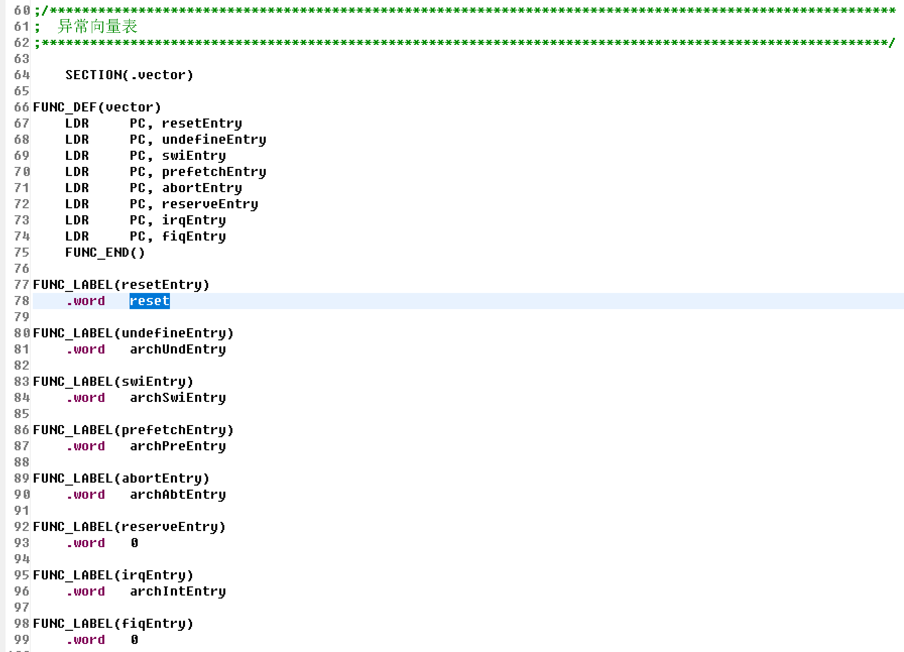

​		针对arm处理器的几种异常模式SylixOS内核都已经有统一的标准接口处理，比如IRQ处理函数就是***archIntEntry*** ，这些入口函数我们原样保留即可。同时我们从上图中也可以看出，SylixOS默认是不处理FIQ中断的，在实际的使用中，FIQ使用的非常少，一般中断都是通过IRQ来处理的。

​		在SylixOS内核镜像中，起始处放置的就是中断向量表，在系统启动过程中，我们随后还需要将中断向量表的基址设置到系统寄存器中，这个会在后续章节进行讲解。

### 复位入口初始化

​		当系统上电或者复位时就会跳转到reset地址处执行：

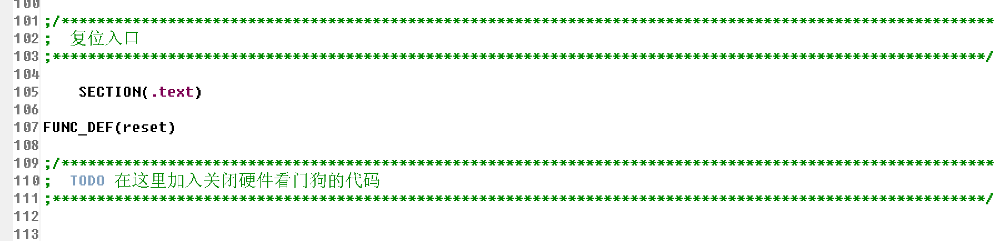

​		一般在这里会有一些架构相关的初始化操作，比如关闭Cache、关闭MMU、禁止TLB等等操作，具体要执行哪些操作大家可以参考U-Boot或者Linux中相关的启动代码。

​		SylixOS的内核中已经提供了一些常用的启动过程中会用到的接口，我们只需要在startup.S中调用这些接口即可：

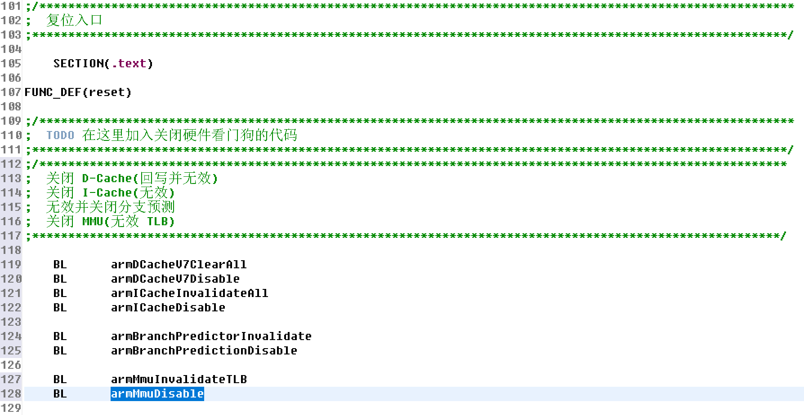

### 初始化栈空间

​		我们知道程序运行过程中需要使用到栈，所以启动的时候需要将arm处理器各模式下的栈地址设置好，这里使用的栈大小直接使用默认的即可:


​		那么栈起始地址是怎么确定的呢？这其实是通过BSP的链接脚本来定义的：

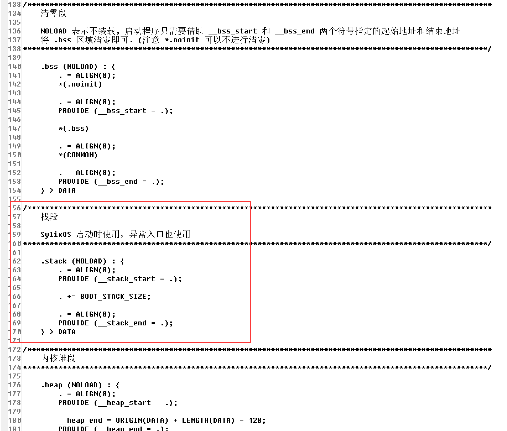

​		在ARM平台上，栈一般都是递减形式的，也就是压栈时数据元素是由高地址往低地址存放的，所以BSP启动时栈的起始地址就是链接脚本中定义的***__stack_end*** 符号地址，这个符号的值会在BSP链接阶段确定下来，最后被startup.S中的栈初始化程序使用：

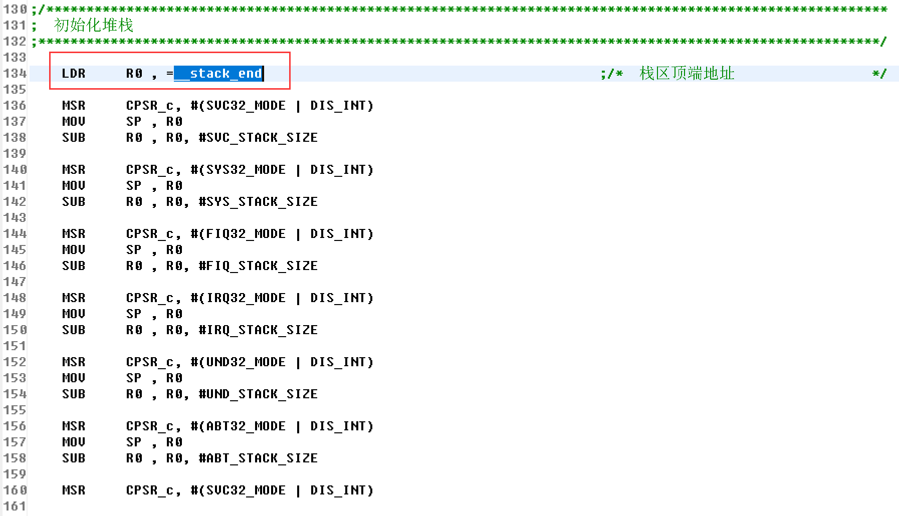

### 初始化DATA段

​		这里主要就是将内核的数据段从加载地址搬运到运行地址处，至于为什么SylixOS内核数据段的加载地址和运行地址会不一致，这个会在后续章节中详细讲解，这里我们知道系统启动过程中需要进行搬运这个操作即可：

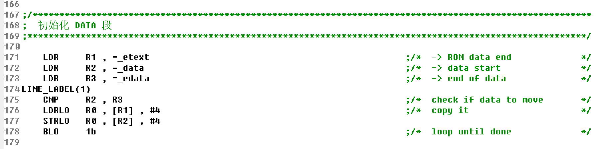

###  初始化BSS段

​		我们都知道BSS段中存放的是程序中使用的数据，默认值为0，所以这里需要将这段空间进行清零操作：

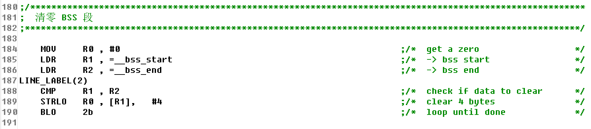

### 跳转到C语言

​		当上述初始化工作都做完之后，我们就可以跳转到C语言编写的代码继续执行了：

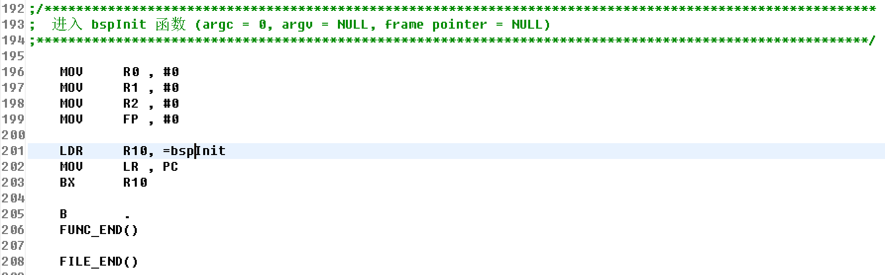

​		其中bspInit函数是在bspInit.c中实现的，从上图中我们还可以看出这个函数可以有三个参数，但是一般情况下都没有使用，大家可以根据实际情况进行修改使用。

​		经过上面的学习，我们已经知道了SylixOS的内核启动时需要做哪些基础的准备工作，但是需要注意的是，这里只是在单核情况下需要做的工作，当使用多核时，我们需要对这个文件做一些修改，以满足多核启动需要，这个也会在后续章节详细讲解

## 内核启动参数设置

​		SylixOS内核启动的时候需要传入一些参数以打开、关闭或者设置内核的一些功能组件，这是通过调用***API_KernelStartParam*** 这个接口来实现的：

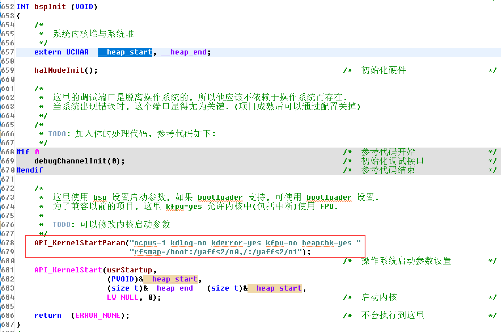

这些参数根据实际的需要进行设置，这里只介绍几个比较重要的：

- ncpus：设置系统使用的cpu的个数，在开发多核BSP时，可以先将这个参数设置为1，在单核下将最小系统完成后再改成多核进行调试。
- kdlog：内核日志，内核在创建线程、信号量等等事件时会输出打印信息，这个参数就是控制是否开启这些打印信息。一般在最小系统开发时，我们需要将这个参数设置为***yes***，在开发完成后再改回***no*** 关闭。
- kderror：内核出错时是否输出相关的打印信息，一般都需要输出，使用默认的***yes*** 即可。
- kfpu：内核是否使用硬件浮点寄存器，SylixOS内核默认不使用硬件浮点寄存器。
- heapchk：是否进行堆越界检测，一般都打开。
- hz：系统tick的频率，默认100，一般设置为100或者1000，不易设置过高。
- hhz：高度定时器频率，默认100，需要BSP的支持。
- sldepcache：这个参数只在arm平台上使用，用于指明当前架构的自旋锁实现是否依赖于Cache。因为在系统启动过程中，可能会在Cache还未打开的情况下就使用自旋锁，通过这个参数告诉系统在启动过程中不要使用这些依赖Cache的指令。在全志R16平台，这个参数需要设置为***yes*** 。
- rfsmap：用于指明系统根文件系统映射关系。在实际情况下，根文件系统可以挂载在SD卡、eMMC、Nandflash、内存等各种存储介质上，这个参数就是用来选择具体怎么挂载的。在最小系统的开发阶段，由于我们还没有实现SD卡等存储介质驱动，所以都是挂载在内存文件系统上，也就是这个参数需要设置为***rfsmap=/:/dev/ram*** 。

根据上述的讲解，我们将全志R16平台上的启动参数设置如下：

```c
API_KernelStartParam("ncpus=1 kdlog=yes kderror=yes kfpu=no heapchk=yes "
                     "sldepcache=yes hz=1000 hhz=1000 "
                     "rfsmap=/:/dev/ram");
```

## 物理内存空间配置

### 物理内存段配置

​		SylixOS将物理内存划分成4个区域进行使用：内核代码区，内核数据区，DMA内存区和APP内存区。系统启动开启MMU后会将内核代码区和内核数据区的物理地址和虚拟地址建立对等映射的关系，也就是物理地址和虚拟地址是一样的；DMA内存区会在需要的时候建立映射，也是对等映射的关系；APP内存区也是在需要的时候建立映射，但是映射关系不一定是对等映射，APP区的虚拟地址是可以在bspMap.h中进行配置的，这个在后续章节中讲解。

​		使能MMU后，系统VMM组件接管的内存区是DMA和APP区，系统内核和内核数据区不归VMM组件管理：


下面我们来看看这几个区域的作用;

- 内核代码区：这段区域存放有系统的中断向量表和内核代码，使能MMU后这段区域无法写入。

- 内核数据区：这段区域是内核使用的数据区，包括内核栈、内核堆、全局数据等等。使能MMU后这段区域可读可写。

- DMA内存区：有些外设控制器需要申请物理连续的内存，DMA内存区就是为这些控制器准备的。

- APP内存区：SylixOS动态加载的应用程序、动态库和内核模块都是使用的这段区域。

  ​		在上述的4个区域中，内核代码区、内核数据区和APP内存区都是带Cache属性的，DMA内存区根据需要可以申请带Cache或者不带Cache属性的物理连续内存。

​		我手中的开发板使用的内存是1GB大小，根据上述信息，我们可以将物理内存空间在***config.h\*** 中进行如下配置：

```c
#define BSP_CFG_ROM_BASE (0x00000000)
#define BSP_CFG_ROM_SIZE (4 * 1024 * 1024)

#define BSP_CFG_RAM_BASE (0x40000000)
#define BSP_CFG_RAM_SIZE (1 * 1024 * 1024 * 1024)

#define BSP_CFG_TEXT_SIZE (10 * 1024 * 1024)
#define BSP_CFG_DATA_SIZE (50 * 1024 * 1024)
#define BSP_CFG_DMA_SIZE  (128 * 1024 * 1024)
#define BSP_CFG_APP_SIZE  (BSP_CFG_RAM_SIZE  - BSP_CFG_TEXT_SIZE - \
                           BSP_CFG_DATA_SIZE - BSP_CFG_DMA_SIZE)

#define BSP_CFG_BOOT_STACK_SIZE (128 * 1024)
```

- BSP_CFG_ROM_BASE：在本平台上不需要关心。
- BSP_CFG_ROM_SIZE：在本平台上不需要关心。
- BSP_CFG_RAM_BASE：SylixOS所使用的物理内存基址，这个地址也是内核镜像的加载地址。
- BSP_CFG_RAM_SIZE：SylixOS使用的物理内存大小。
- BSP_CFG_TEXT_SIZE：内核代码区大小。
- BSP_CFG_DATA_SIZE：内核数据区大小。
- BSP_CFG_DMA_SIZE：DMA内存区大小。
- BSP_CFG_APP_SIZE：APP内存区大小。
- BSP_CFG_BOOT_STACK_SIZE：BSP启动时使用的栈空间大小。

### 内核数据段拷贝

​		SylixOS内核代码段和内核数据段的链接地址(运行地址)是在config.ld链接脚本中定义的：

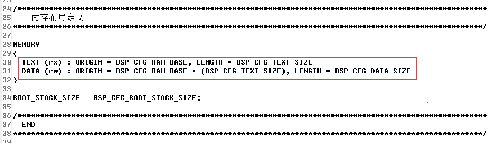

​		可以看出，内核数据段的运行地址是紧挨在内核代码段之后的，内核代码段大小一般我们都是根据经验来分配一个合理的大小，也许实际并没有使用全部的空间，这样为了减少生成的bin文件大小，默认生成的bin文件中内核数据和内核实际使用的代码空间是紧挨着存放的。所以在实际运行时，需要将内核数据区的数据从加载地址复制到运行地址：

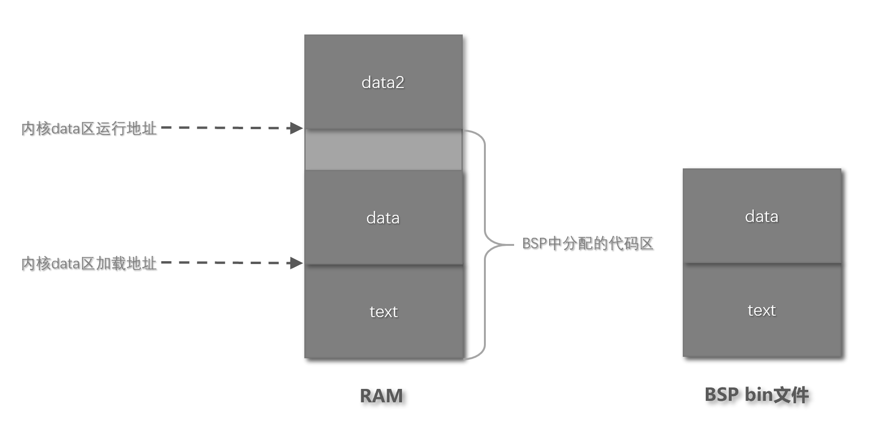

​		在这个拷贝的操作就是在startup.S中做的，现在大家知道为什么启动时需要拷贝内核数据区了吧。

## 实现系统调试信息打印接口

​		当系统出错时或者使用内核日志时会输出一些打印信息，这最终都是调用到bspLib.c中的bspDebugMsg 这个接口来实现的，所以我们在开发BSP时，第一个要做的工作就是实现这个接口。

​		一般的调试信息都是通过串口来输出的，所以我们需要实现全志R16平台上串口发送的函数。因为U-Boot在启动时使用串口0输出信息，所以我们这里只要实现串口0的发送函数即可，像串口的时钟、波特率设置等等U-Boot已经帮我们做好了，所以我们这里可以不用关心。另外需要说明的是，在本系列教程中并不会去详细地讲解外设驱动寄存器具体如何设置，我们这里关心的是BSP的框架和开发的整体流程，至于寄存器怎么设置请参考厂商提供的U-Boot或者Linux下的对应代码。

​		由于我们现在要实现串口驱动，所以可以在***driver*** 目录下新建一个uart目录用来存放串口驱动文件：

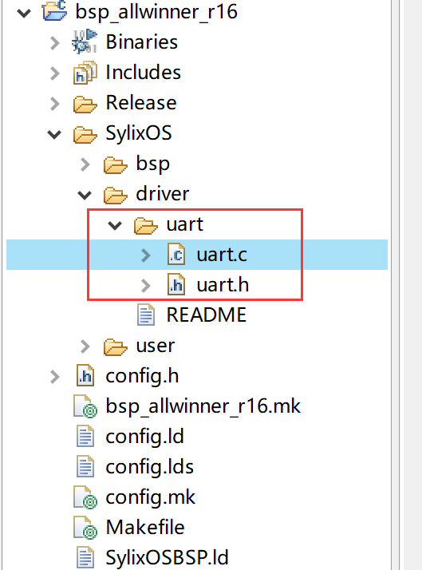

其中uart.h会被bspLib.c文件使用，我们需要在uart.c中实现串口的轮询发送接口：

```c
#define  __SYLIXOS_KERNEL
#include <SylixOS.h>
#include <linux/compat.h>

/*********************************************************************************************************
  基地址定义
*********************************************************************************************************/
#define UART0_BASE            (0x01c28000)
/*********************************************************************************************************
  寄存器偏移
*********************************************************************************************************/
#define RBR                   0x0
#define THR                   0x0
#define USR                   0x7C

VOID  uartPutChar (CHAR  cChar)
{
    //  若 FIFO 不满就填入数据，否则等待
    while (!(readl(UART0_BASE + USR) & BIT(1)));

    writel(cChar, UART0_BASE + THR);
}

VOID  uartPutMsg (CPCHAR  cpcMsg)
{
    CHAR  cChar;

    if (!cpcMsg) {
        return;
    }

    while ((cChar = *cpcMsg) != '\0') {
        uartPutChar(cChar);
        cpcMsg++;
    }
}
```

​		最后在bspLib.c中的***bspDebugMsg*** 接口中调用我们实现的串口轮询发送函数即可：

```c
/*********************************************************************************************************
** 函数名称: bspDebugMsg
** 功能描述: 打印系统调试信息
** 输　入  : pcMsg     信息
** 输　出  : NONE
** 全局变量:
** 调用模块:
*********************************************************************************************************/
VOID  bspDebugMsg (CPCHAR  pcMsg)
{
    /*
     * TODO: 通过 UART 打印系统调试信息
     */
    uartPutMsg(pcMsg);
}
```

​		到此为止我们可以先编译出SylixOS内核镜像来启动了，如果串口上有打印就说明我们最起码能通过打印来调试了。编译BSP工程(当然需要提前先编译好base工程)，在Release目录下找到***bsp_allwinner_r16.bin*** 这个文件，这个就是SylixOS内核镜像，将其拷贝到SD卡上，将SD卡插入开发板上，上电通过以下命令启动SylixOS内核：

```
=> fatload mmc 0:1 40000000 bsp_allwinner_r16.bin
reading bsp_allwinner_r16.bin
3231464 bytes read in 175 ms (17.6 MiB/s)
=> go 40000000
```

​		我们就可以在串口上看到SylixOS启动过程中的日志打印：

```
## Starting application at 0x40000000 ...
longwing(TM) kernel initialize...
kernel low level initialize...
kernel heap build...
semaphore "heap_lock" has been create.
kernel heap has been create 0x40f08c18 (47149928 Bytes).
system heap build...
system heap has been create 0x0 (0 Bytes).
kernel interrupt vector initialize...
kernel high level initialize...
semaphore "sigfdsel_lock" has been create.
thread "t_idle0" has been initialized.
thread "t_idle0" has been start.
thread "t_itimer" has been initialized.
thread "t_itimer" has been start.
semaphore "job_sync" has been create.
thread "t_isrdefer" has been initialized.
thread "t_isrdefer" has been start.
semaphore "job_sync" has been create.
thread "t_except" has been create.
msgqueue "log_msg" has been create.
partition "printk_pool" has been create.
thread "t_log" has been initialized.
semaphore "ios_mutex" has been create.
semaphore "evtfdsel_lock" has been create.
semaphore "bmsgsel_lock" has been create.
semaphore "bmsgd_lock" has been create.
semaphore "semfdsel_lock" has been create.
semaphore "semfd_lock" has been create.
semaphore "tmrfdsel_lock" has been create.
semaphore "hstmrfdsel_lock" has been create.
semaphore "gpiofdsel_lock" has been create.
semaphore "blkio_lock" has been create.
semaphore "autom_lock" has been create.
semaphore "mount_lock" has been create.
semaphore "bus_listlock" has been create.
semaphore "blk_lock" has been create.
semaphore "power_lock" has been create.
semaphore "sel_wakeup" has been create.
thread "t_power" has been create.
semaphore "job_sync" has been create.
semaphore "hotplug_lock" has been create.
semaphore "sel_wakeup" has been create.
thread "t_hotplug" has been create.
semaphore "hpsel_lock" has been create.
semaphore "hotplug_lock" has been create.
system initialized.
semaphore "cpprt_lock" has been create.
semaphore "cond_signal" has been create.
c++ run time lib initialized.
kernel primary cpu usrStartup...
ARM(R) 920 none FPU pri-core initialization.
FPU initilaized.
__vmmVirtualCreate() bug: virtual switich page invalidate.
```

​		当然这时候系统是不可能完全启起来的，因为我们现在只是实现了调试信息输出而已。

**注：由于此时并未实现vmm虚拟地址和物理地址的映射，所以上述的打印 log 信息会一直循环出现，直至后续初始化完成mmu方可解决**

​		另外在开发的过程中，可能需要带参数打印一些信息，这时候就不能使用***bspDebugMsg\*** 了，这个接口只能打印纯字符串，我们可以使用***_PrintFormat\*** 来打印变量值等等信息，用法类似于printf。

## 初始化FPU、MMU和Cache组件

​		本来想在不初始化这些部件的情况下把SylixOS先启动起来感受下，结果测试发现如果MMU不使能的话，系统启动过程中线程无法进行调度emm。。。所以只好把这一章节提前来讲了。这三个组件的初始化都是在bspInit.c中进行的。

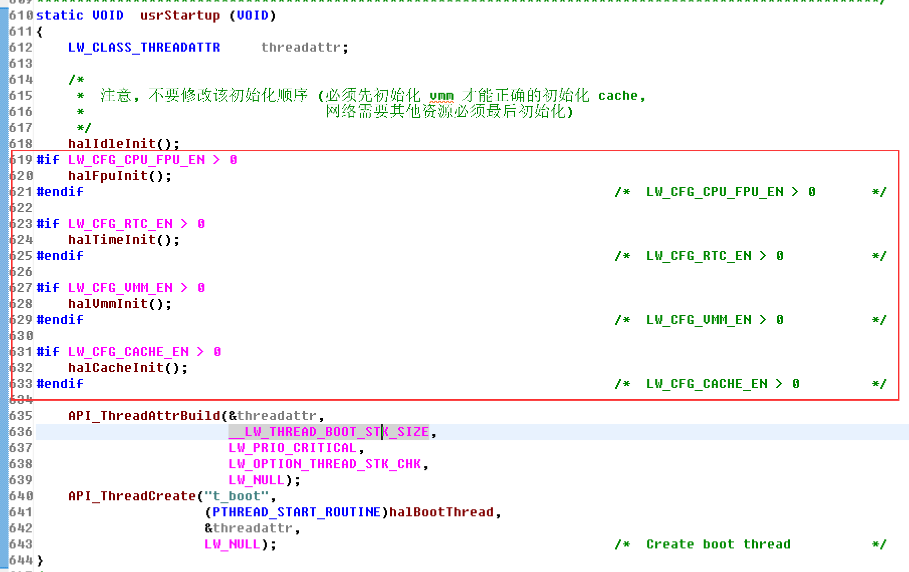

### FPU初始化

我们首先来看下FPU的初始化：

```c
static VOID  halFpuInit (VOID)
{
    API_KernelFpuInit(ARM_MACHINE_A7, ARM_FPU_VFPv3);
}
```

​		可以看出来FPU的初始化很简单，只需要调用***API_KernelFpuInit*** 即可。第一个参数表示当前CPU的架构，第二个参数表示当前SOC中FPU使用的类型，这两个参数根据芯片数据手册的信息然后使用内核提供好的宏填入就行了。

### Cache初始化

再来看看Cache的初始化：

```c
static VOID  halCacheInit (VOID)
{
    API_CacheLibInit(CACHE_COPYBACK, CACHE_COPYBACK, ARM_MACHINE_A7);   /*  初始化 CACHE 系统           */
    API_CacheEnable(INSTRUCTION_CACHE);
    API_CacheEnable(DATA_CACHE);                                        /*  使能 CACHE                  */
}
```

首先使用***API_CacheLibInit*** 接口初始化了内核Cache组件：

- 第一个参数表示指令Cache的工作方式，一般有写回和写通两种模式，实际中一般使用写回模式。
- 第二个参数表示数据Cache的工作方式，一般有写回和写通两种模式，实际中一般使用写回模式。
- 第三个表示当前CPU的架构类型。

​        初始化完了内核Cache组件，接着使用了***API_CacheEnable*** 接口使能了指令Cache和数据Cache，可以看出Cache的初始化还是比较简单的，因为内核已经为大部分arm架构封装好了Cache等部件的操作，我们只需要调用接口即可。

​		另外有些平台上的L2 Cache是可以单独控制的，比如zynq7000平台，针对这些L2 Cache可以控制的的平台我们还需要实现bspLib.c中的***bspL2CBase*** 和***bspL2CAux*** 这两个接口：

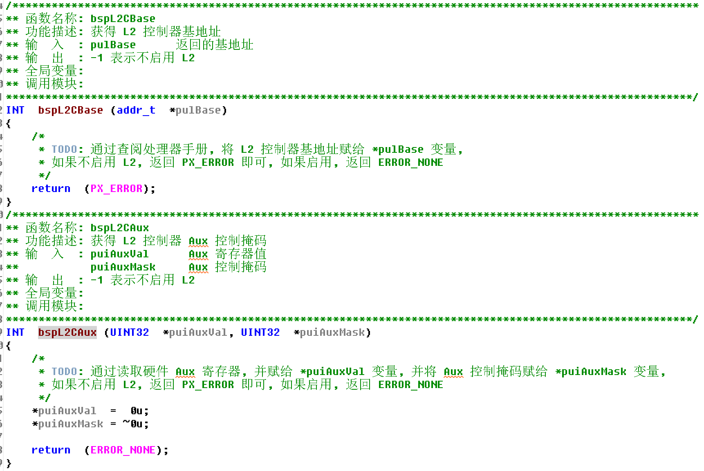

​		全志R16平台并没有单独L2 Cache控制器，所以这两个接口我们直接使用默认实现即可。

### MMU初始化

​		MMU的初始化需要做三部分工作，一个是***bspMap.h\*** 中映射表的设置，另外一个是内核VMM组件初始化，最后是MMU页表池大小设置，下面我们分别来学习下这两部分的内容。

#### 映射表设置

映射表是定义在***bspMap.h\*** 中，***_G_physicalDesc*** 描述物理地址空间的关系，***_G_virtualDesc\*** 描述虚拟地址空间关系，VMM通过这两个表中定义的关系来管理物理地址和虚拟地址。

##### 物理地址空间映射表

SylixOS中使用***LW_MMU_PHYSICAL_DESC*** 这个数据结构来描述中断向量表、物理内存区、外设寄存器的物理地址和虚拟地址的映射关系：

```c
/*********************************************************************************************************
  物理内存信息描述
  注意:
  TEXT, DATA, DMA 物理段 PHYD_ulPhyAddr 必须等于 PHYD_ulVirMap,
  TEXT, DATA, VECTOR, BOOTSFR, DMA 物理段 PHYD_ulVirMap 区间不能与虚拟内存空间冲突.
*********************************************************************************************************/

typedef struct __lw_vmm_physical_desc {
    addr_t                   PHYD_ulPhyAddr;                            /*  物理地址 (页对齐地址)       */
    addr_t                   PHYD_ulVirMap;                             /*  需要初始化的映射关系        */
    size_t                   PHYD_stSize;                               /*  物理内存区长度 (页对齐长度) */
    
#define LW_PHYSICAL_MEM_TEXT        0                                   /*  内核代码段                  */
#define LW_PHYSICAL_MEM_DATA        1                                   /*  内核数据段 (包括 HEAP)      */
#define LW_PHYSICAL_MEM_VECTOR      2                                   /*  硬件向量表                  */
#define LW_PHYSICAL_MEM_BOOTSFR     3                                   /*  启动时需要的特殊功能寄存器  */
#define LW_PHYSICAL_MEM_BUSPOOL     4                                   /*  总线地址池, 不进行提前映射  */
#define LW_PHYSICAL_MEM_DMA         5                                   /*  DMA 物理内存, 不进行提前映射*/
#define LW_PHYSICAL_MEM_APP         6                                   /*  装载程序内存, 不进行提前映射*/
    UINT32                   PHYD_uiType;                               /*  物理内存区间类型            */
    UINT32                   PHYD_uiReserve[8];
} LW_MMU_PHYSICAL_DESC;
typedef LW_MMU_PHYSICAL_DESC *PLW_MMU_PHYSICAL_DESC;
```

- PHYD_ulPhyAddr：表示物理地址空间起始地址。
- PHYD_ulVirMap：表示起始虚拟地址。
- PHYD_stSize：表示物理地址空间大小。
- PHYD_uiType：物理空间的类型。

> 注意：这里的地址和大小值必须是当前平台页对齐的值，系统启动过程中会检测是否对齐，如果不对齐则会启动失败。

让我们来看看R16平台上这个表的具体设置：

```
LW_MMU_PHYSICAL_DESC    _G_physicalDesc[] = {
    {                                                                   /*  中断向量表                  */
        BSP_CFG_RAM_BASE,
        0,
        LW_CFG_VMM_PAGE_SIZE,
        LW_PHYSICAL_MEM_VECTOR
    },

    {                                                                   /*  内核代码段                  */
        BSP_CFG_RAM_BASE,
        BSP_CFG_RAM_BASE,
        BSP_CFG_TEXT_SIZE,
        LW_PHYSICAL_MEM_TEXT
    },

    {                                                                   /*  内核数据段                  */
        BSP_CFG_RAM_BASE + BSP_CFG_TEXT_SIZE,
        BSP_CFG_RAM_BASE + BSP_CFG_TEXT_SIZE,
        BSP_CFG_DATA_SIZE,
        LW_PHYSICAL_MEM_DATA
    },

    {                                                                   /*  DMA 缓冲区                  */
        BSP_CFG_RAM_BASE + BSP_CFG_TEXT_SIZE + BSP_CFG_DATA_SIZE,
        BSP_CFG_RAM_BASE + BSP_CFG_TEXT_SIZE + BSP_CFG_DATA_SIZE,
        BSP_CFG_DMA_SIZE,
        LW_PHYSICAL_MEM_DMA
    },

    {                                                                   /*  APP 通用内存                */
        BSP_CFG_RAM_BASE + BSP_CFG_TEXT_SIZE + BSP_CFG_DATA_SIZE + BSP_CFG_DMA_SIZE,
        BSP_CFG_RAM_BASE + BSP_CFG_TEXT_SIZE + BSP_CFG_DATA_SIZE + BSP_CFG_DMA_SIZE,
        BSP_CFG_APP_SIZE,
        LW_PHYSICAL_MEM_APP
    },

    /*
     * TODO: 加入启动设备的寄存器映射, 参考代码如下:
     */
    {                                                                   /*  UART0 ~ 4                   */
        0x01C28000,
        0x01C28000,
        2 * LW_CFG_VMM_PAGE_SIZE,
        LW_PHYSICAL_MEM_BOOTSFR
    },

    {                                                                   /*  结束                        */
        0,
        0,
        0,
        0
    }
};
```

- 在以前比较老的arm平台，中断向量表的地址必须是放在0地址处的，当使能MMU之后，需要将中断向量表所在的实际物理地址映射为虚拟地址0，这样中断向量表才能被正常使用。
- 内核代码段和内核数据段会在VMM初始化时将表中记录的物理地址和虚拟地址建立对等映射关系。
- DMA内存段中记录的映射关系不会再VMM初始化的时候使用，但是会在申请DMA内存的时候使用，一般都是对等映射。
- 这个表中APP内存段中的虚拟地址不会被VMM使用，VMM主要使用的是这里记录的物理基址和大小，其对应的虚拟地址是再另一个表中配置的。这里为了表内容统一，直接将物理地址填在虚拟地址的位置。
- SylixOS支持启动的时候静态映射寄存器和通过调用接口动态映射寄存器地址。如果需要静态映射，就将映射关系填入上表中，一般也都是对等映射，动态映射在下一小节说明。由于使能MMU之后，我们还需要串口进行输出信息，所以这里需要将串口寄存器地址进行静态映射。

##### 虚拟地址空间表

​		SylixOS中使用***LW_MMU_VIRTUAL_DESC*** 数据结构来描述虚拟地址空间信息：

```c
typedef struct __lw_mmu_virtual_desc {
    addr_t                   VIRD_ulVirAddr;                            /*  虚拟空间地址 (页对齐地址)   */
    size_t                   VIRD_stSize;                               /*  虚拟空间长度 (页对齐长度)   */
    
#define LW_VIRTUAL_MEM_APP      0                                       /*  装载程序虚拟内存区间        */
#define LW_VIRTUAL_MEM_DEV      1                                       /*  设备映射虚拟内存空间        */
    UINT32                   VIRD_uiType;                               /*  虚拟内存区间类型            */
    UINT32                   VIRD_uiReserve[8];
} LW_MMU_VIRTUAL_DESC;
typedef LW_MMU_VIRTUAL_DESC *PLW_MMU_VIRTUAL_DESC;
```

- VIRD_ulVirAddr：虚拟地址空间起始地址。
- VIRD_stSize：虚拟地址空间大小。
- VIRD_uiType：虚拟空间类型。

同样的，起始地址和大小值也必须是页对齐的值。VMM管理的虚拟地址空间只有两种：***LW_VIRTUAL_MEM_APP\*** 表示系统动态加载的程序、动态库和内核模块所使用的虚拟地址空间；***LW_VIRTUAL_MEM_DEV\*** 表示系统调用***API_VmmIoRemap\*** 这类接口动态映射寄存器地址时所使用的虚拟地址空间。

我们来看看R16平台上的实际配置：

```c
LW_MMU_VIRTUAL_DESC    _G_virtualDesc[] = {
    /*
     * TODO: 加入虚拟地址空间的定义, 参考代码如下:
     */
#if 1
    {                                                                   /*  应用程序虚拟空间            */
        0x80000000,
        ((size_t)1 * LW_CFG_GB_SIZE),
        LW_VIRTUAL_MEM_APP
    },

    {
        0xC0000000,                                                     /*  ioremap 空间                */
        (64 * LW_CFG_MB_SIZE),
        LW_VIRTUAL_MEM_DEV
    },
#endif

    {                                                                   /*  结束                        */
        0,
        0,
        0
    }
};
```

> 注意：这里的虚拟地址和物理空间描述表中各个区域的虚拟地址不要有重复，在满足这个前提下，地址值可以任意配置。另外还需要注意的是起始地址加上大小之后不要超过4GB，因为我们现在用的是32位的地址空间。

**注意：在bspmap.h中映射物理地址和虚拟地址时，不能删除最后的{0}结构，否则会出现页未对齐报错**

```
  __vmmPhysicalCreate() bug: physical zone vaddr 0x2e332e32 not page aligned
```

**这是由于在base中映射的时候退出循环需要以0为结束判断**

```c
 for (i = 0; ; i++) {
     if (pvirdes[i].VIRD_stSize == 0) {
                break;
            }
 }
```

#### VMM组件初始化

​		在配置好上述的两个映射表后，就可以使用***API_VmmLibInit\*** 这个接口来初始化VMM组件：

```c
static VOID  halVmmInit (VOID)
{
    API_VmmLibInit(_G_physicalDesc, _G_virtualDesc, ARM_MACHINE_A7);
    API_VmmMmuEnable();
}
```

​		上述代码应该很好理解，就不再赘述。初始化好VMM组件之后，最后调用***API_VmmMmuEnable\*** 接口来使能MMU。

#### MMU页表池设置

​		MMU正常工作需要使用页表，全志R16属于armv7架构，在armv7架构下，SylixOS内核使用的是二级页表机制。第一级页表叫全局页目录(Page Global Directory)，也可以叫做一级页表，页目录中单个条目就叫做页目录项，一个页目录项可以映射1MB的物理页，32位地址空间有4GB大小，所以整个页目录共有4096个页目录项。第二级页表叫做二级页表，二级页表中单个条目就叫做页表项(Page Table Entry)，一般arm32位都是用4KB页大小，也就是一个页表项可以映射4KB的物理页，一个二级页表可以映射1MB大小，所以一个二级页表中共有256个页表项：

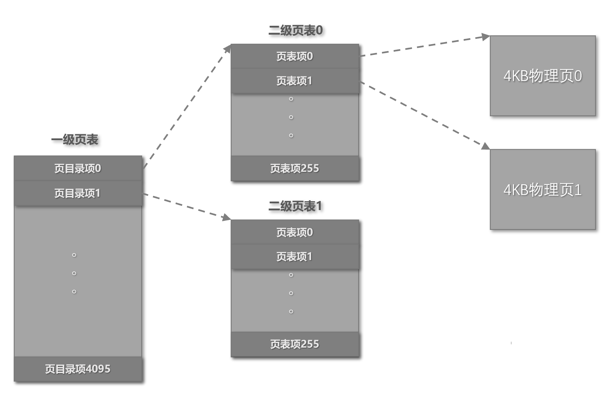

​		在SylixOS中，一级页表和二级页表所占的内存是在内核堆上的，也就是内核数据区空间，所以在配置config.h时，最好将内核数据区配置大点，否则有可能因为MMU页表申请不到内存空间而导致系统启动失败。

​		在一个实际的嵌入式项目中，并不会完全使用4GB的空间，那么我们就可以将二级页表的个数减少点来节省下内存给其他的内核模块或者应用使用，这是通过bspLib.c中的***bspMmuPgdMaxNum*** 和***bspMmuPteMaxNum*** 这两个接口实现的。

​		***bspMmuPgdMaxNum*** 接口主要用来获取一级页表的个数，一个一级页表已经能映射4GB的空间了，所以这个函数一般都是返回1：

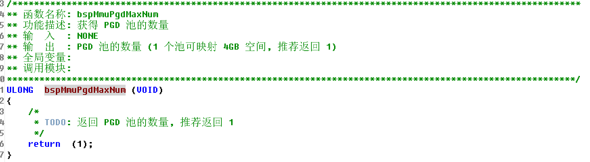

​		***bspMmuPteMaxNum*** 接口主要用来获取二级页表的个数，注意是二级页表的个数而不是页表项的个数。如果是4096则表示映射完整的4GB空间，这里实际返回的是2048，也就是表示只映射2GB的空间：

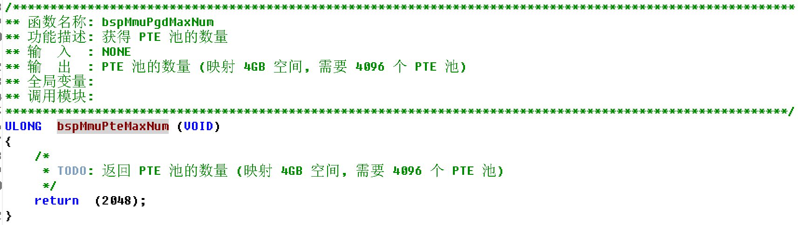

​		因为本次使用的开发板内存是1GB，再加上其他的寄存器空间大小，2GB空间已经足够使用了。如果开发板内存是2GB的话，那么这个函数的返回值就需要改大一点了，总之这个值根据实际情况进行设置。

**注：初始化mmu之前需先在映射文件中设置虚拟空间的地址和大小，且需要映射串口0的地址；t3开发板需要在 startup.s里手动关闭cache，否则会卡在mmu初始化处；**

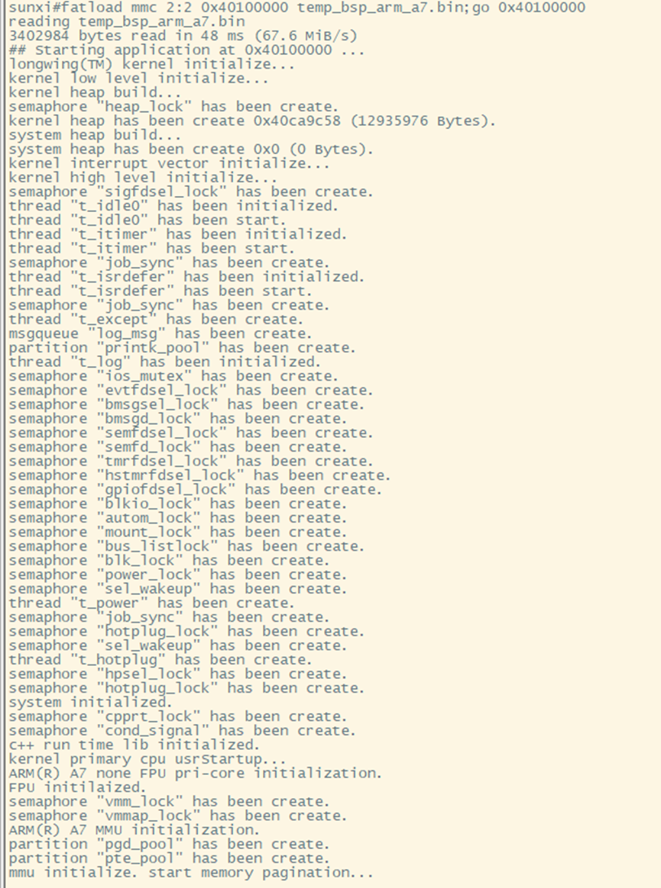

**在 startup.s 中关闭cache 即可：**

    ;/********************************************************************************************************
    ;  关闭 D-Cache(回写并无效)
    ;  关闭 I-Cache(无效)
    ;  无效并关闭分支预测
    ;  关闭 MMU(无效 TLB)
    ;********************************************************************************************************/
    BL      armDCacheV7ClearAll
    BL      armDCacheV7Disable
    BL      armICacheInvalidateAll
    BL      armICacheDisable
    
    BL      armBranchPredictorInvalidate
    BL      armBranchPredictionDisable
    
    BL      armMmuInvalidateTLB
    BL      armMmuDisable
## 实现串口SIO驱动

​		在SylixOS中，不管是调试串口还是通信串口都是以TTY设备的形式注册到内核中使用，每一个串口设备都在***/dev/\*** 目录下有一个对应的***ttyS\**** 设备名的设备：

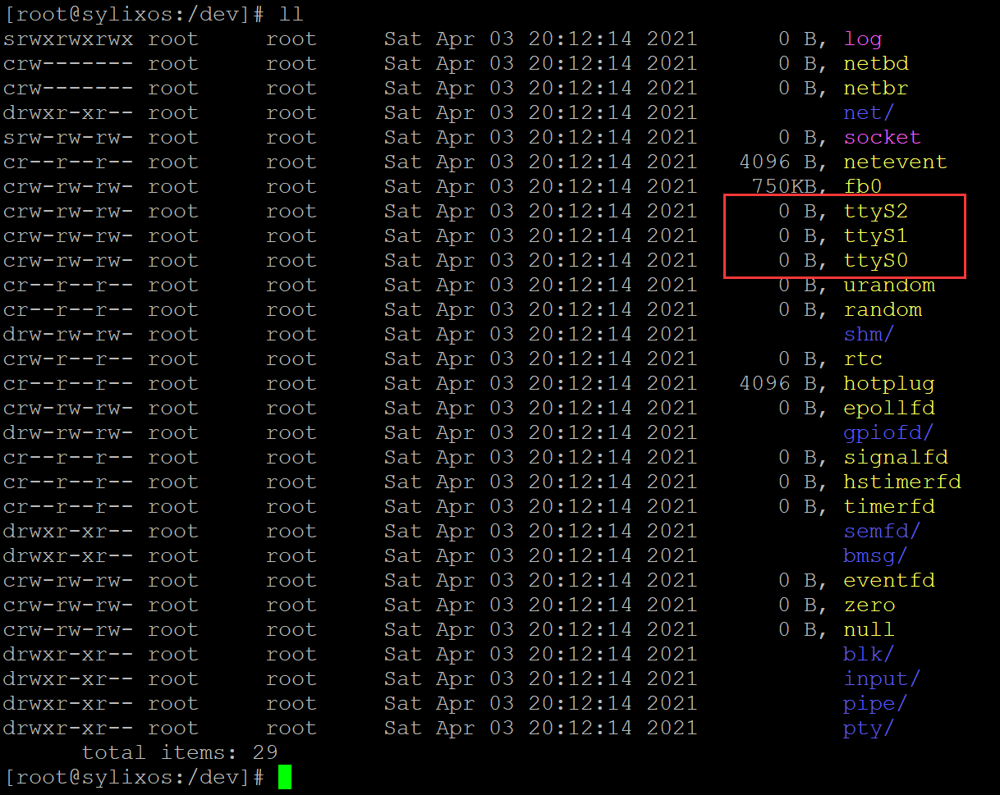

​		BSP在启动的过程中也会打开调试串口的tty设备，并且将其文件描述符设置为内核标准输入、标准输出和标准出错这三个文件描述符：

```c
static VOID  halStdFileInit (VOID)
{
    INT     iFd = open("/dev/ttyS0", O_RDWR, 0);

    if (iFd >= 0) {
        ioctl(iFd, FIOBAUDRATE,   SIO_BAUD_115200);
        ioctl(iFd, FIOSETOPTIONS, (OPT_TERMINAL & (~OPT_7_BIT)));       /*  system terminal 8 bit mode  */

        ioGlobalStdSet(STD_IN,  iFd);
        ioGlobalStdSet(STD_OUT, iFd);
        ioGlobalStdSet(STD_ERR, iFd);
    }
}
```

​		SylixOS中TTY设备使用的是SIO驱动框架，类似于printf这样的打印最终都需要调用到SIO驱动中的发送回调函数，下面让我们一起来学习下如何开发SylixOS下串口SIO驱动。

在SylixOS中，使用***SIO_CHAN\*** 数据结构来表示一个SIO通道：

```
typedef struct sio_chan {                                               /*  a serial channel            */
    
    SIO_DRV_FUNCS    *pDrvFuncs;
    
} SIO_CHAN;
```

可以看出这个数据结构很简单，其中只有一个成员，表示SIO驱动操作集。***SIO_DRV_FUNCS\*** 数据结构就表示了SIO驱动操作集：

```c
struct sio_drv_funcs {                                                  /*  driver functions            */
    
    INT               (*ioctl)
                      (
                      SIO_CHAN    *pSioChan,
                      INT          cmd,
                      PVOID        arg
                      );
                      
    INT               (*txStartup)
                      (
                      SIO_CHAN    *pSioChan
                      );
                      
    INT               (*callbackInstall)
                      (
                      SIO_CHAN          *pSioChan,
                      INT                callbackType,
                      VX_SIO_CALLBACK    callback,
                      PVOID              callbackArg
                      );
                      
    INT               (*pollInput)
                      (
                      SIO_CHAN    *pSioChan,
                      PCHAR        inChar
                      );
                      
    INT               (*pollOutput)
                      (
                      SIO_CHAN    *pSioChan,
                      CHAR         outChar
                      );
};
typedef struct sio_drv_funcs                       SIO_DRV_FUNCS;
```

- ioctl：实现对SIO通道的一些控制，比如打开、关闭、设置硬件参数等等。
- txStartup：SIO通道发送数据。
- callbackInstall：SIO驱动中需要通过此回调将系统缓冲区发送和接收数据操作接口记录在驱动中，SylixOS并没有为BSP提供相应的API来直接操作系统数据缓冲区，所以只能通过这种间接的方式来记录内核中操作系统缓冲区的函数指针，然后在驱动中使用。
- pollInput和pollOutput：这两个回调接口当前并没有被内核所使用，是预留接口。

通常在驱动中定义一个SIO通道全局变量：

```
static SIO_CHAN  uartSioChan;
```

然后再定义一个SIO驱动集全局变量：

```
static SIO_DRV_FUNCS  uartSioDrvFunc;
```

最后用SIO驱动操作集来初始化SIO通道：

```
SIO_CHAN  *uartSioChanCreate (VOID)
{
    uartSioChan.pDrvFuncs = &uartSioDrvFunc;

    return  &uartSioChan;
}
```

附 sio.c 源码：

```c
#define  __SYLIXOS_KERNEL
#include <SylixOS.h>
#include <linux/compat.h>
#include "uart.h"

static SIO_CHAN  uartSioChan;

static SIO_DRV_FUNCS  uartSioDrvFunc;

SIO_CHAN  *uartSioChanCreate (VOID)
{
    uartSioChan.pDrvFuncs = &uartSioDrvFunc;

    return  &uartSioChan;
}
```

​		在实现SIO驱动操作集之前，我们先来学习下SylixOS下标准输出、标准输入、标准出错时如何工作的：

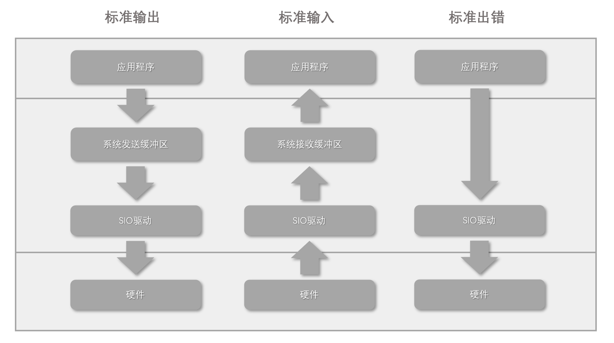

- 标准输出：当程序中使用printf打印信息时，就是往系统标准输出上输出信息。但是这些信息并不是立马就输出到串口上，而是首先发送到系统缓冲区，然后当满足一定条件时再将系统缓冲区中保存的数据通过SIO驱动中的发送接口操作硬件发送出去。一般这个触发条件是发送的数据中有换行符或者发送缓冲区满了。
- 标准输入：类似于标准输出，当硬件收到数据时，先送到系统缓冲区，当满足一定条件时再将系统缓冲区的数据拷贝到程序的buffer中。这个触发条件一般是接收的数据中有回车符或者接收缓冲区满了。
- 标准出错：不同于标准输入和输出都有系统缓冲区，标准出错需要立即将出错信息输出出来，所以没有系统缓冲区，直接通过SIO驱动进行数据发送输出。

这下我们再来看看SIO驱动中的三个操作集接口如何实现：

```c
static SIO_DRV_FUNCS  uartSioDrvFunc = {
    .ioctl = uartSioIoctl,
    .txStartup = uartStartup,
    .callbackInstall = uartSioCbInstall,
};
```

### **uartSioIoctl**

这个函数需要实现SIO通道的打开、关闭、硬件参数设置、波特率设置等等，如下所示：

```c
static INT  uartSioIoctl (SIO_CHAN  *pSioChan, INT  iCmd, PVOID  pArg)
{
    switch (iCmd) {
    case SIO_BAUD_SET:
        break;

    case SIO_BAUD_GET:
        *((LONG *)pArg) = 115200;
        break;

    case SIO_HW_OPTS_SET:
        break;

    case SIO_HW_OPTS_GET:
        *(LONG *)pArg = 0;
        break;

    case SIO_OPEN:
        break;

    case SIO_HUP:
        break;

    default:
        _ErrorHandle(ENOSYS);
        return  (ENOSYS);
    }

    return  (ERROR_NONE);
}
```

- SIO_BAUD_SET：波特率设置，需要根据应用层传入的波特率设置硬件。
- SIO_BAUD_GET：获取当前设置的波特率，由于调试串口是U-Boot初始化的，波特率是115200，这里就直接返回。
- SIO_HW_OPTS_SET：设置硬件参数，比如数据位数、奇偶校验位、停止位数等等。
- SIO_HW_OPTS_GET：获取当前硬件设置的参数。
- SIO_OPEN：打开SIO通道，一般这里会调用一些硬件的初始化代码。
- SIO_HUP：关闭SIO通道，一般这里回收一些资源。

之前的教程中说了，为了让大家关注框架而不是硬件寄存器设置，所以这里大部分的命令对应的实现都直接返回了，应该说来是比较简单的。

### **uartSioCbInstall**

我们在上文中说了，SylixOS没有为BSP直接提供操作系统缓冲区的接口，而是在tty设备创建时将内核中的读写系统缓冲区的函数指针传入SIO驱动中的***callbackInstall\*** 接口，驱动需要自己保存这两个函数指针和其对应的参数，我们可以在驱动中定义全局变量用来保存：

```c
static INT (*uartGetTxChar)(PVOID  pArg, PCHAR  pcChar);
static INT (*uartPutRcvChar)(PVOID  pArg, CHAR  cChar);
static PVOID  pTxArg;
static PVOID  pRxArg;
```

在callback回调函数被调用的时候，通过以下方法保存内核中的读写函数指针：

```c
static INT  uartSioCbInstall (SIO_CHAN  *pSioChan,
                              INT  iCallbackType,
                              VX_SIO_CALLBACK  callbackRoute,
                              PVOID  pvCallbackArg)
{
    switch (iCallbackType) {
    case SIO_CALLBACK_GET_TX_CHAR:
        uartGetTxChar = (INT (*)(PVOID, PCHAR))callbackRoute;
        pTxArg = pvCallbackArg;

        break;

    case SIO_CALLBACK_PUT_RCV_CHAR:
        uartPutRcvChar = (INT (*)(PVOID, CHAR))callbackRoute;
        pRxArg = pvCallbackArg;

        break;

    default:
        _ErrorHandle(ENOSYS);
        return  (PX_ERROR);
    }

    return  (ERROR_NONE);
}
```

​		这样在驱动中要从系统缓冲区中读取数据发送就可以调用**uartGetTxChar** 这个函数指针，要上送数据到系统缓冲区时可以使用**uartPutRcvChar** 这个函数指针。

### **uartStartup**

接下来我们就需要实现SIO驱动中的发送函数了。这个接口的逻辑很简单，就是从系统发送缓冲区中不停的取出数据，然后调用串口发送接口发送，直到系统发送缓冲区中没有要发送的数据了就返回：

```c
static INT  uartStartup (SIO_CHAN  *pSioChan)
{
    CHAR  cChar;

    while (!uartGetTxChar(pTxArg, &cChar)) {
        uartPutChar(cChar);
    }

    return  (ERROR_NONE);
}
```

### **数据接收**

​       串口数据接收一般使用中断来实现，但是我们现在还没有编写好中断控制器的驱动代码，所以无法使用中断功能，串口的中断接收功能我们那就留到最后来实现。

​		到此为止我们就编写好了一个基本的串口SIO驱动，我们目前的实现时比较简单的，在实际的串口SIO驱动中我们还要考虑多通道、不同波特率和硬件参数设置、通过中断进行发送数据等等功能，这里为了快速地学习基础的框架，我们将上述功能狗省略了，这需要大家注意。

我们将编写好的sio.c同样放在uart目录下:

附sio.c源码：

```c
#define  __SYLIXOS_KERNEL
#include <SylixOS.h>
#include <linux/compat.h>
#include "uart.h"

static SIO_CHAN  uartSioChan;
static INT (*uartGetTxChar)(PVOID  pArg, PCHAR  pcChar);
static INT (*uartPutRcvChar)(PVOID  pArg, CHAR  cChar);
static PVOID  pTxArg;
static PVOID  pRxArg;

static INT  uartSioIoctl (SIO_CHAN  *pSioChan, INT  iCmd, PVOID  pArg)
{
    switch (iCmd) {
    case SIO_BAUD_SET:
        break;

    case SIO_BAUD_GET:
        *((LONG *)pArg) = 115200;
        break;

    case SIO_HW_OPTS_SET:
        break;

    case SIO_HW_OPTS_GET:
        *(LONG *)pArg = 0;
        break;

    case SIO_OPEN:
        break;

    case SIO_HUP:
        break;

    default:
        _ErrorHandle(ENOSYS);
        return  (ENOSYS);
    }

    return  (ERROR_NONE);
}

static INT  uartStartup (SIO_CHAN  *pSioChan)
{
    CHAR  cChar;

    while (!uartGetTxChar(pTxArg, &cChar)) {
        uartPutChar(cChar);
    }

    return  (ERROR_NONE);
}

static INT  uartSioCbInstall (SIO_CHAN  *pSioChan,
                              INT  iCallbackType,
                              VX_SIO_CALLBACK  callbackRoute,
                              PVOID  pvCallbackArg)
{
    switch (iCallbackType) {
    case SIO_CALLBACK_GET_TX_CHAR:
        uartGetTxChar = (INT (*)(PVOID, PCHAR))callbackRoute;
        pTxArg = pvCallbackArg;

        break;

    case SIO_CALLBACK_PUT_RCV_CHAR:
        uartPutRcvChar = (INT (*)(PVOID, CHAR))callbackRoute;
        pRxArg = pvCallbackArg;

        break;

    default:
        _ErrorHandle(ENOSYS);
        return  (PX_ERROR);
    }

    return  (ERROR_NONE);
}

static SIO_DRV_FUNCS  uartSioDrvFunc = {
    .ioctl = uartSioIoctl,
    .txStartup = uartStartup,
    .callbackInstall = uartSioCbInstall,
};

SIO_CHAN  *uartSioChanCreate (VOID)
{
    uartSioChan.pDrvFuncs = &uartSioDrvFunc;

    return  &uartSioChan;
}
```

​		通过前面的学习，我们已经完成了SylixOS内核入口文件设置、内核VMM映射表设置和串口SIO驱动这几个比较重要的功能，这下我们可以再次编译内核启动，这次内核是可以成功输出SylixOS的Logo并进入shell命令行的。不过在这之前，我们还有一些小小的工作需要做一下：

### **修改BSP字符串信息**

在bspLib.c文件的开始处，通过几个全局变量定义了BSP和Cache等一些信息，需要根据开发板实际情况进行修改：

```
/*********************************************************************************************************
  BSP 信息
*********************************************************************************************************/
/*
 * TODO: 修改以下字符串为目标板的 CPU 信息
 */
static const CHAR   _G_pcCpuInfo[]     = "Allwinner R16, Quad-core Cortex-A7 Up to 1.2GHz";
/*
 * TODO: 修改以下字符串为目标板的 CACHE 信息
 */
static const CHAR   _G_pcCacheInfo[]   = "128KBytes(D-32K/I-32K) L1-Cache per core,512KBytes L2-Cache";
/*
 * TODO: 修改以下字符串为目标板的信息
 */
static const CHAR   _G_pcPacketInfo[]  = "ClockworkPI (CPI v3.1) development board";
/*
 * TODO: 修改以下字符串为 BSP 的版本信息
 */
static const CHAR   _G_pcVersionInfo[] = "BSP version 1.0.0 for "__SYLIXOS_RELSTR;
```

### **创建串口tty设备**

在bspInit.c中的***halDevInit\*** 函数中添加创建调试串口tty设备的代码：

```
static VOID  halDevInit (VOID)
{
    /*
     *  创建根文件系统时, 将自动创建 dev, mnt, var 目录.
     */
    rootFsDevCreate();                                                  /*  创建根文件系统              */
    procFsDevCreate();                                                  /*  创建 proc 文件系统          */
    shmDevCreate();                                                     /*  创建共享内存设备            */
    randDevCreate();                                                    /*  创建随机数文件              */

    /*
     * TODO: 加入你的处理代码, 参考代码如下:
     */
#if 1                                                                   /*  参考代码开始                */
    SIO_CHAN    *psio0 = uartSioChanCreate();                           /*  创建串口 0 通道             */
    ttyDevCreate("/dev/ttyS0", psio0, 30, 50);                          /*  add    tty   device         */
#endif                                                                  /*  参考代码结束                */

    yaffsDevCreate("/yaffs2");                                          /*  create yaffs device(only fs)*/
}
```

首先通过***uartSioChanCreate\*** 接口获取到串口的SIO通道数据结构指针，然后通过***ttyDevCreate\*** 接口来创建tty设备。其中30和50分别表示tty设备对应的输入缓冲区和输出缓冲区的大小，这两个值实际使用时建议设置的大点，这里为了演示直接使用默认的大小。

### **关闭执行启动脚本**

注释掉***halBootThread*** 函数对***tshellStartup*** 接口的调用代码：

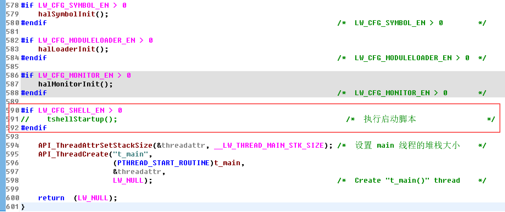

​		启动脚本用于系统启动时自动运行一些程序或者加载驱动模块等等，***tshellStartup*** 接口会获取用户的串口输入，如果接收到字符'n'则跳过自动执行脚本，如果在1秒内没有接收到这个字符则自动执行启动脚本。由于会使用到系统的定时接口，而我们现在还没有实现中断和定时器的驱动，所以这个接口调用后会将当前线程挂起而不会返回，而且在本次的BSP系列教程中我们并不需要关心启动脚本，所以这里就直接将这个调用注释掉。

重新编译SylixOS内核镜像，复制到SD卡中，并在U-Boot下引导启动，一起正常的话就会看到SylixOS的Logo了：

```
=> fatload mmc 0:1 40000000 bsp_allwinner_r16.bin
reading bsp_allwinner_r16.bin
3232056 bytes read in 175 ms (17.6 MiB/s)
=> go 40000000
## Starting application at 0x40000000 ...
longwing(TM) kernel initialize...
kernel low level initialize...
kernel heap build...
semaphore "heap_lock" has been create.
kernel heap has been create 0x40f08cd8 (47149736 Bytes).
system heap build...
system heap has been create 0x0 (0 Bytes).
kernel interrupt vector initialize...
kernel high level initialize...
semaphore "sigfdsel_lock" has been create.
thread "t_idle0" has been initialized.
thread "t_idle0" has been start.
thread "t_itimer" has been initialized.
thread "t_itimer" has been start.
semaphore "job_sync" has been create.
thread "t_isrdefer" has been initialized.
thread "t_isrdefer" has been start.
semaphore "job_sync" has been create.
thread "t_except" has been create.
msgqueue "log_msg" has been create.
partition "printk_pool" has been create.
thread "t_log" has been initialized.
semaphore "ios_mutex" has been create.
semaphore "evtfdsel_lock" has been create.
semaphore "bmsgsel_lock" has been create.
semaphore "bmsgd_lock" has been create.
semaphore "semfdsel_lock" has been create.
semaphore "semfd_lock" has been create.
semaphore "tmrfdsel_lock" has been create.
semaphore "hstmrfdsel_lock" has been create.
semaphore "gpiofdsel_lock" has been create.
semaphore "blkio_lock" has been create.
semaphore "autom_lock" has been create.
semaphore "mount_lock" has been create.
semaphore "bus_listlock" has been create.
semaphore "blk_lock" has been create.
semaphore "power_lock" has been create.
semaphore "sel_wakeup" has been create.
thread "t_power" has been create.
semaphore "job_sync" has been create.
semaphore "hotplug_lock" has been create.
semaphore "sel_wakeup" has been create.
thread "t_hotplug" has been create.
semaphore "hpsel_lock" has been create.
semaphore "hotplug_lock" has been create.
system initialized.
semaphore "cpprt_lock" has been create.
semaphore "cond_signal" has been create.
c++ run time lib initialized.
kernel primary cpu usrStartup...
ARM(R) A7 vfpv3 FPU pri-core initialization.
FPU initilaized.
semaphore "vmm_lock" has been create.
semaphore "vmmap_lock" has been create.
ARM(R) A7 MMU initialization.
partition "pgd_pool" has been create.
partition "pte_pool" has been create.
mmu initialize. start memory pagination...
MMU initilaized.
ARM(R) A7 L1 cache controller initialization.
ARM(R) A7 L2 cache controller initialization.
ARMv7 I-Cache line size = 32 bytes, Way size = 16384 bytes.
ARMv7 D-Cache line size = 64 bytes, Way size = 8192 bytes.
CACHE initilaized.
I-CACHE enable.
D-CACHE enable.
semaphore "sel_wakeup" has been create.
thread "t_boot" has been create.
msgqueue "res_reclaim" has been create.
semaphore "sel_wakeup" has been create.
thread "t_reclaim" has been create.
semaphore "resh_lock" has been create.
semaphore "resraw_lock" has been create.
kernel ticks initialize...
semaphore "ints_lock" has been create.
IRQ 0 : tick_timer connect : 0x400003f8
primary cpu multi-task start...
semaphore "tshell_lock" has been create.
semaphore "heap_trace_lock" has been create.
semaphore "proc_lock" has been create.
semaphore "shm_lock" has been create.
semaphore "pipe_ropen" has been create.
semaphore "pipe_wopen" has been create.
SylixOS tpsFs file system installed.
ISO9660 file system installed.
microsoft FAT file system installed.
ram file system installed.
rom file system installed.
semaphore "nfs_lock" has been create.
nfs file system installed.
yaffs2 file system installed.
semaphore "yaffs_oplock" has been create.
semaphore "randsel_lock" has been create.
semaphore "ty_rsync" has been create.
semaphore "ty_wsync" has been create.
semaphore "ty_drain" has been create.
semaphore "ty_lock" has been create.
semaphore "sellist_lock" has been create.
semaphore "sel_wakeup" has been create.
thread "t_sync" has been create.
yaffs "/yaffs2" has been create.
thread "t_log" has been start.
semaphore "ramvol_lock" has been create.
target "/dev/ram" mount ok.
semaphore "fd_node_lock" has been create.
semaphore "fd_node_lock" has been delete.
semaphore "fd_node_lock" has been create.
semaphore "fd_node_lock" has been delete.
semaphore "fd_node_lock" has been create.
semaphore "fd_node_lock" has been delete.
semaphore "fd_node_lock" has been create.
semaphore "fd_node_lock" has been delete.
semaphore "fd_node_lock" has been create.
semaphore "fd_node_lock" has been delete.
semaphore "fd_node_lock" has been create.
semaphore "fd_node_lock" has been delete.
semaphore "fd_node_lock" has been create.
semaphore "fd_node_lock" has been delete.
semaphore "fd_node_lock" has been create.
semaphore "fd_node_lock" has been delete.
semaphore "fd_node_lock" has been create.
semaphore "fd_node_lock" has been delete.
semaphore "fd_node_lock" has been create.
semaphore "fd_node_lock" has been delete.
semaphore "fd_node_lock" has been create.
semaphore "fd_node_lock" has been delete.
semaphore "fd_node_lock" has been create.
semaphore "fd_node_lock" has been delete.
semaphore "fd_node_lock" has been create.
semaphore "fd_node_lock" has been delete.
semaphore "fd_node_lock" has been create.
semaphore "fd_node_lock" has been delete.
semaphore "fd_node_lock" has been create.
semaphore "fd_node_lock" has been delete.
semaphore "fd_node_lock" has been create.
semaphore "fd_node_lock" has been delete.
semaphore "fd_node_lock" has been create.
semaphore "fd_node_lock" has been delete.
semaphore "fd_node_lock" has been create.
semaphore "fd_node_lock" has been delete.
semaphore "fd_node_lock" has been create.
semaphore "fd_node_lock" has been delete.
semaphore "fd_node_lock" has been create.
semaphore "fd_node_lock" has been delete.
semaphore "fd_node_lock" has been create.
semaphore "fd_node_lock" has been delete.
semaphore "fd_node_lock" has been create.
semaphore "fd_node_lock" has been delete.
semaphore "fd_node_lock" has been create.
semaphore "fd_node_lock" has been delete.
semaphore "fd_node_lock" has been create.
semaphore "fd_node_lock" has been delete.
semaphore "fd_node_lock" has been create.
semaphore "fd_node_lock" has been delete.
semaphore "fd_node_lock" has been create.
semaphore "fd_node_lock" has been delete.
semaphore "fd_node_lock" has been create.
semaphore "fd_node_lock" has been delete.
environment variables load from /etc/profile fail, error: No such file or directory
semaphore "if_list" has been create.
semaphore "job_sync" has been create.
semaphore "sel_wakeup" has been create.
thread "t_netjob" has been create.
semaphore "nevt_lock" has been create.
semaphore "sellist_lock" has been create.
msgqueue "net_msg" has been create.
semaphore "net_mutex" has been create.
semaphore "sel_wakeup" has been create.
thread "t_netproto" has been initialized.
thread "t_netproto" has been start.
semaphore "afunix_lock" has been create.
partition "unix_256" has been create.
partition "unix_512" has been create.
semaphore "afpacket_lock" has been create.
partition "afpacket_nodes" has been create.
semaphore "socksel_lock" has been create.
semaphore "vnd_lock" has been create.
semaphore "vnd_sel" has been create.
semaphore "net_mutex" has been create.
semaphore "net_sem" has been create.
semaphore "fd_node_lock" has been create.
semaphore "fd_node_lock" has been delete.
semaphore "net_libc" has been create.
semaphore "hosttable_lock" has been create.
semaphore "sel_wakeup" has been create.
thread "t_snmp" has been initialized.
thread "t_snmp" has been start.
semaphore "net_mutex" has been create.
semaphore "net_mutex" has been create.
semaphore "fd_node_lock" has been create.
semaphore "fd_node_lock" has been delete.
semaphore "fd_node_lock" has been create.
semaphore "fd_node_lock" has been delete.
semaphore "fd_node_lock" has been create.
semaphore "fd_node_lock" has been delete.
semaphore "fd_node_lock" has been create.
semaphore "fd_node_lock" has been delete.
semaphore "fd_node_lock" has been create.
semaphore "fd_node_lock" has been delete.
semaphore "fd_node_lock" has been create.
semaphore "fd_node_lock" has been delete.
semaphore "ftpsession_lock" has been create.
semaphore "sel_wakeup" has been create.
thread "t_ftpd" has been create.
semaphore "sel_wakeup" has been create.
thread "t_telnetd" has been create.
timer "nat_timer" has been create.
semaphore "sem_npflcok" has been create.
semaphore "sem_qoslcok" has been create.
semaphore "px_lock" has been create.
semaphore "aio_mutex" has been create.
semaphore "cond_signal" has been create.
semaphore "pseminit" has been create.
semaphore "pmutexinit" has been create.
semaphore "prwinit" has been create.
semaphore "pcondinit" has been create.
semaphore "syslog_lock" has been create.
semaphore "symtable_lock" has been create.
semaphore "loader_lock" has been create.
semaphore "execshare_lock" has been create.
semaphore "kvproc_lock" has been create.
semaphore "sel_wakeup" has been create.
thread "t_main" has been create.
semaphore "sel_wakeup" has been delete.
thread "t_boot" has been delete.
msgqueue "net_msg" has been create.
semaphore "net_tsem" has been create.
msgqueue "net_msg" has been create.
semaphore "net_tsem" has been create.
msgqueue "net_msg" has been delete.
msgqueue "net_msg" has been create.
msgqueue "net_msg" has been create.
semaphore "net_tsem" has been create.
msgqueue "net_msg" has been delete.
msgqueue "net_msg" has been create.
sysname  : sylixos
nodename : sylixos
release  : Tangram
version  : 1.12.9
machine  : Allwinner R16, Quad-core Cortex-A7 Up to 1.2GHz
ttiny shell system initialize...
semaphore "sel_wakeup" has been create.
thread "t_tshell" has been initialized.
thread "t_tshell" has been start.

semaphore "fd_node_lock" has been create.
semaphore "fd_node_lock" has been delete.
semaphore "fd_node_lock" has been create.
semaphore "fd_node_lock" has been delete.
semaphore "fd_node_lock" has been create.
semaphore "fd_node_lock" has been delete.
semaphore "fd_node_lock" has been create.
semaphore "fd_node_lock" has been delete.

                          [[                          (R)
 [[[[           [[[[      [[             [[[[    [[[[
[[  [[            [[                    [[  [[  [[  [[
[[      [[  [[    [[    [[[[    [[  [[  [[  [[  [[
 [[     [[  [[    [[      [[    [[  [[  [[  [[   [[
  [[    [[  [[    [[      [[     [[[[   [[  [[    [[
   [[   [[  [[    [[      [[      [[    [[  [[     [[
    [[  [[  [[    [[      [[     [[[[   [[  [[      [[
[[  [[  [[  [[    [[      [[    [[  [[  [[  [[  [[  [[
 [[[[    [[[[   [[[[[[  [[[[[[  [[  [[   [[[[    [[[[
           [[
          [[    KERNEL: LongWing(C) 1.12.9
       [[[[   COPYRIGHT ACOINFO Co. Ltd. 2006 - 2019

SylixOS license: Commercial & GPL.
SylixOS kernel version: 1.12.9 Code name: Tangram

CPU     : Allwinner R16, Quad-core Cortex-A7 Up to 1.2GHz
CACHE   : 128KBytes(D-32K/I-32K) L1-Cache per core,512KBytes L2-Cache
PACKET  : ClockworkPI (CPI v3.1) development board
ROM SIZE: 0x00400000 Bytes (0x00000000 - 0x003fffff)
RAM SIZE: 0x40000000 Bytes (0x40000000 - 0x7fffffff)
BSP     : BSP version 1.0.0 for Tangram
[root@sylixos:/root]# semaphore "sel_wakeup" has been delete.
thread "t_main" has been delete.
```

**注：在实际完成上述操作后，t3开发板会卡住这个阶段primary cpu multi-task start...：**

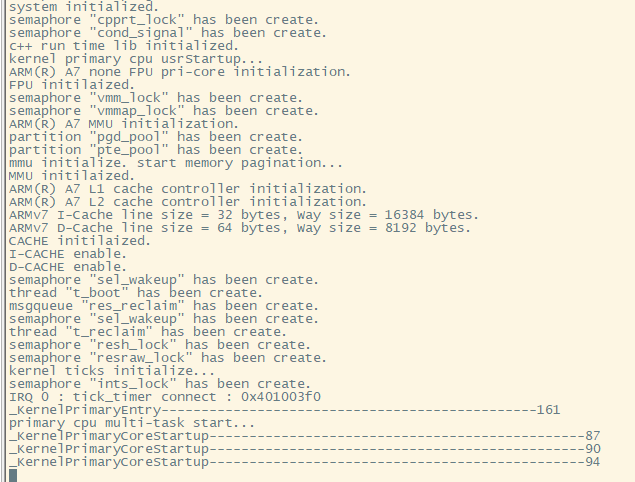

**这是由于在底层启动内核阶段会进行中断使能操作，但由于中断部分并未实现，因此不能继续执行，解决思路主要是关闭所有中断，屏蔽所有中断信号的接收，主要办法有以下两种：**

**方法一：关闭cpu端的中断使能，在函数archTaskCtxCreate中会对IRQ使能，在此处关闭即可，但注意后续需要把此处打开（libsylixos/sylixos/arch/arm/common/armcontext. c，其他架构同理）**

**方法二：关闭控制器端的中断使能，可以先简单实现gic的控制器端关闭中断，即可进行后续调试**

  **writel(0,GIC_DIST_BASE+GIC_DIST_CTRL);**

## SylixOS内核启动过程简单分析

​		通过前面的学习我们已经掌握了SylixOS BSP开发的最基础的内容，现在大家至少能快速地在一块开发板上移植SylixOS并且能启动到显示Logo阶段了。现在我们暂且把移植工作放一放，我们来简单的看下SylixOS内核在启动时大致做了哪些事情，以让我们对系统启动过程做到心中有数，这样我们才能以不变应万变。

​		当然我们现在只用了单核启动，所以分析的也是单核的启动流程，多核的启动流程会在后续章节进行讲解。我将SylixOS的启动流程大致总结成了10个步骤：

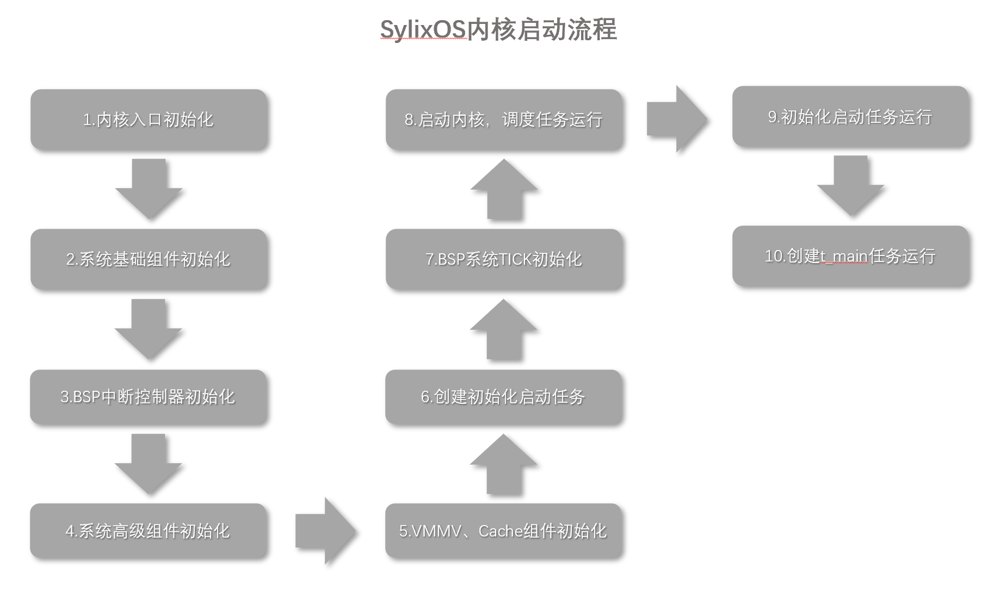

### **内核入口初始化**

这个就是startup.S中做的工作，主要就是一些架构相关的初始化工作，这个在前面章节我们已经学习过。

### **系统基础组件初始化**

主核启动时在BSP中会调用***API_KernelPrimaryStart\*** 执行内核所有组件的初始化工作。首先会调用***_KernelPrimaryLowLevelInit\*** 接口来初始化系统一些基础组件，比如调度器、消息队列、内核堆管理器等等：

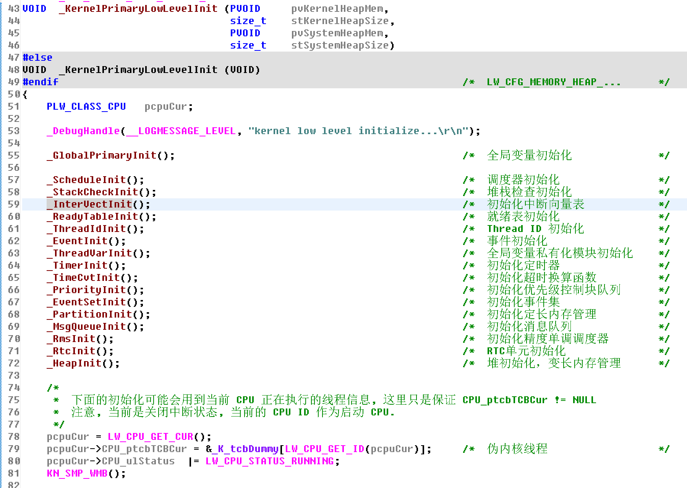

### **BSP中断控制器初始化**

通过调用***bspIntInit*** 接口来初始化中断控制器，这个接口需要在bspLib.c中实现：

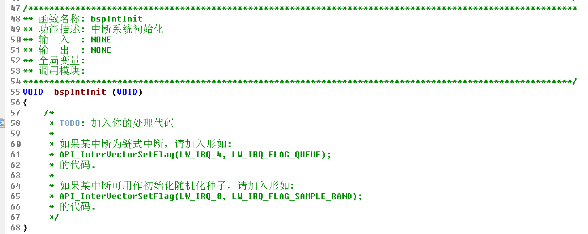

### **系统高级组件初始化**

调用***_KernelHighLevelInit*** 来初始化系统高级组件，比如信号系统、中断延迟队列、总线系统等等：

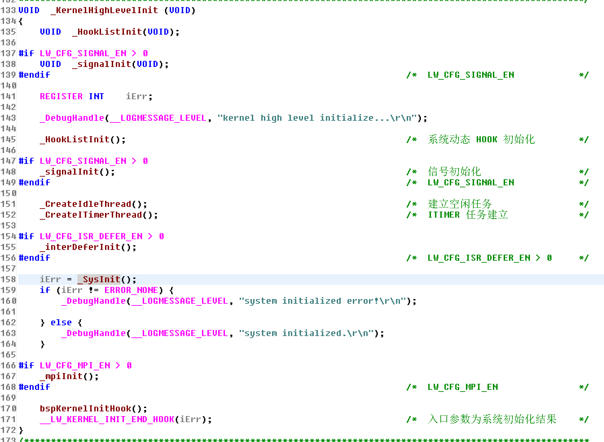

### **VMM、Cache组件初始化**

这是在bspInit.c中的***usrStartup*** 函数中做的：

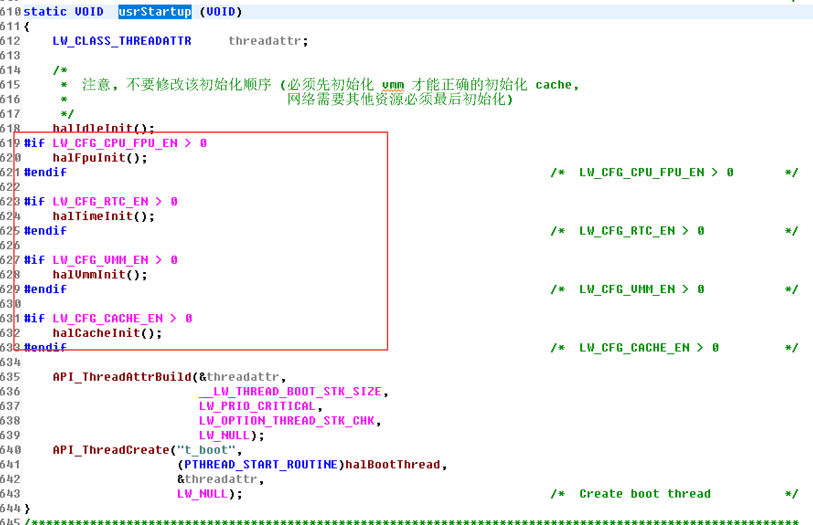

### **创建初始化启动任务**

BSP中的大部分驱动初始化、设备创建等等工作都是在***halBootThread\*** 这个线程中做的。这个线程同样是在***usrStartup*** 函数中创建，但是要注意的是这时仅仅是创建了这个线程，它并没有被调度运行，在内核所有工作都初始化完成后会调度这个线程进行工作。

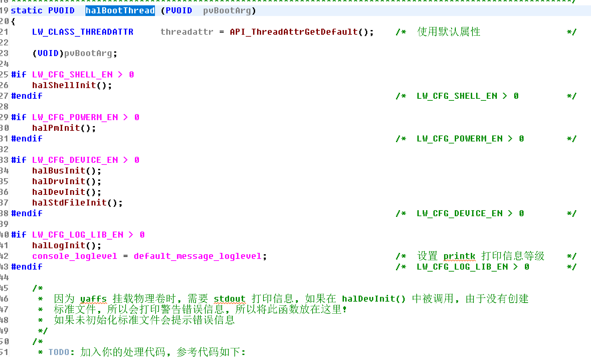

### **BSP系统TICK初始化**

通过调用bspLib.c中的***bspTickInit*** 接口来初始化系统TICK，其实就是初始化一个硬件定时器并让其以系统TICK频率开始工作：

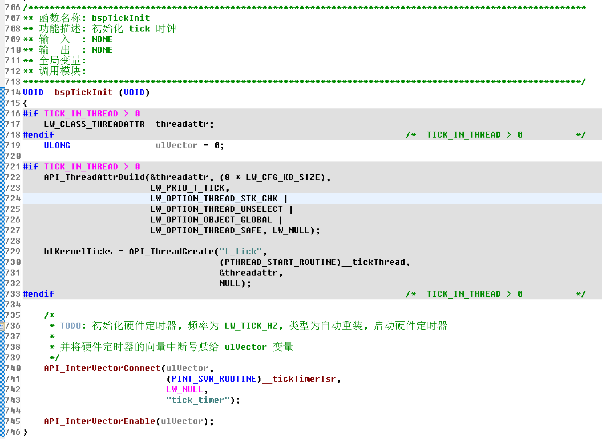

###  **启动内核，调度任务运行**

到这里为止，内核的初始化工作哦基本已经完成了，这时就需要选择一个优先级最高的线程来运行了，这是通过调用***_KernelPrimaryCoreStartup\*** 来实现的：

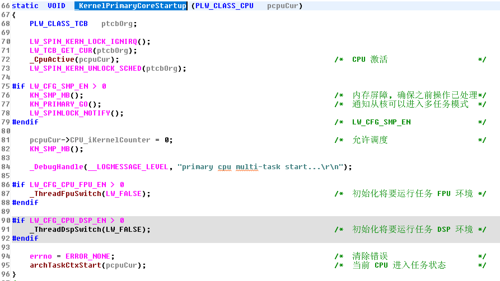

那么第一个被调度的线程是哪个线程呢，是我们之前在BSP中创建的***halBootThread\*** 这个线程吗？其实并不是，SylixOS内核是按优先级调度的，***halBootThread\*** 线程的优先级为50，在内核初始化的过程中会创建很多系统任务，这些任务中有三个优先级是比***halBootThread\*** 线程优先级高的(数值越小优先级越高)：

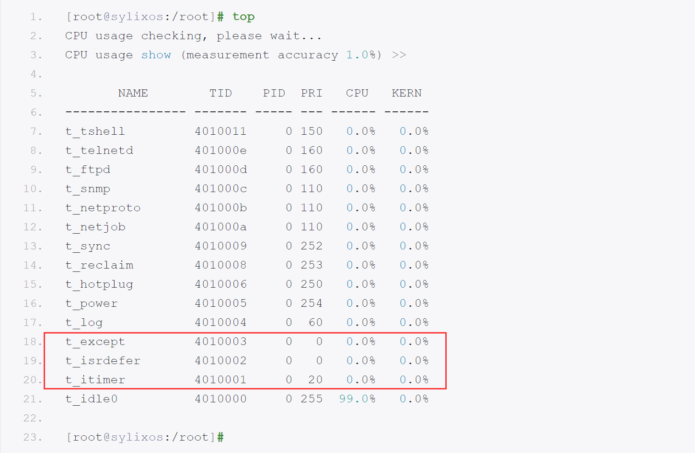

从优先级我们可以分析出t_except和t_isrdefer这两个线程肯定是最开始被调度运行的两个线程，但是这两个线程运行后马上就阻塞自己了，接着调度t_itimer线程运行，这个线程也将自己挂起，这时候***halBootThread\*** 线程才是就绪的优先级最高的线程，于是被调度运行。

### **运行初始化启动任务**

在这个初始化线程***halBootThread*** 中会去初始化驱动、Posix组件、动态加载器、SylixOS Shell等等一些列的功能，这些初始化的顺序使用默认的即可，一般不需要太大的修改。这里只介绍几个调用到的比较重要的接口。

- halBusInit：如果BSP需要使用I2C或者SPI，那么就需要将SylixOS的I2C和SPI总线初始化的代码加在这个函数中。
- halDrvInit：驱动初始化函数，BSP开发者可以将自己的驱动初始化接口加在这个函数中。
- halDevInit：设备创建函数，BSP开发者可以将自己驱动中设备创建接口加载这个函数中。

### **创建t_main任务运行**

这个线程主要就是创建一个SylixOS Shell以让用户可以和SylixOS进行交互：

```
int  t_main (void)
{
    struct utsname  name;
    
    uname(&name);
    
    printf("sysname  : %s\n", name.sysname);
    printf("nodename : %s\n", name.nodename);
    printf("release  : %s\n", name.release);
    printf("version  : %s\n", name.version);
    printf("machine  : %s\n", name.machine);
    
    Lw_TShell_Create(STDOUT_FILENO, LW_OPTION_TSHELL_PROMPT_FULL | LW_OPTION_TSHELL_VT100);
    
    return  (0);
}
```

​		经过上面的介绍，相信大家对SylixOS内核的基本启动流程有了一个大致的了解，到目前为止，SylixOS虽然可以启动起来，但是现在是只有"形"而没有"神"，接下来就让我们继续实现中断控制器驱动和定时器驱动来赋予SylixOS真正的灵魂。

## 实现系统TICK初始化

​		通常情况下我们会选择一个定时器用于产生系统所需要的TICK中断，在全志R16平台上有两个24bit硬件定时器，使用时用户设置一个初始值，启动后定时器进行递减，如果减到0则可以产生一个中断。如果用户使用自动重载功能，硬件自动重新从初始值再次开始递，直到再次减到0产生中断，依次往复：

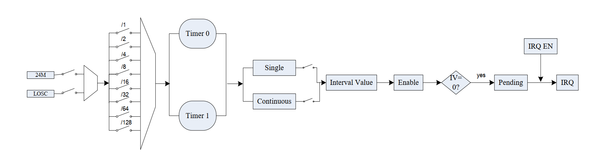

​		全志R16的定时器输入时钟和分频值可以通过通过自身寄存器进行设置，在本次教程中，我们固定使用24M进行2分频，也就是定时器输入时钟频率是12MHz。同时定时器工作模式选择为自动重载和使能中断模式。根据以上信息我们可以封装出三个接口：

```
#define  __SYLIXOS_KERNEL
#include <SylixOS.h>
#include <linux/compat.h>
#include "timer.h"

#define TIMER_BASE     0x01c20c00
#define TIMER_IRQ_EN   0x00
#define TIMER_IRQ_STA  0x04
#define TIMER0_CTRL    0x10
#define TIMER0_INTV    0x14
#define TIMER0_CUR     0x18
#define TIMER1_CTRL    0x20
#define TIMER1_INTV    0x24
#define TIMER1_CUR     0x28

VOID  timerStart (INT32  iNum, UINT32  uiHZ)
{
    UINT32  uiCount;
    UINT32  uiIntvOffset;
    UINT32  uiCtrlOffset;

    if (0 == iNum) {
        uiIntvOffset = TIMER0_INTV;
        uiCtrlOffset = TIMER0_CTRL;
    } else if (1 == iNum) {
        uiIntvOffset = TIMER1_INTV;
        uiCtrlOffset = TIMER1_CTRL;
    } else {
        return ;
    }

    uiCount  = TIMER_FREQ;
    uiCount /= uiHZ;
    writel(uiCount, TIMER_BASE + uiIntvOffset);
    writel(BIT(1) | BIT(2) | BIT(4), TIMER_BASE + uiCtrlOffset);
    while ((readl(TIMER_BASE + uiCtrlOffset) >> 1) & 0x01);
    writel(readl(TIMER_BASE + uiCtrlOffset) | BIT(0), TIMER_BASE + uiCtrlOffset);
    writel(readl(TIMER_BASE + TIMER_IRQ_EN) | BIT(iNum), TIMER_BASE + TIMER_IRQ_EN);
}

VOID  timerIntClear (INT32  iNum)
{
    if ((0 != iNum) && (1 != iNum))
        return ;

    writel(readl(TIMER_BASE + TIMER_IRQ_STA) | BIT(iNum), TIMER_BASE + TIMER_IRQ_STA);
}

BOOL  timerIsIntPending (INT32  iNum)
{
    if ((0 != iNum) && (1 != iNum))
        return  FALSE;

    return  (readl(TIMER_BASE + TIMER_IRQ_STA) & BIT(iNum)) ? TRUE : FALSE;
}
```

- timerStart：使能定时器，需要将定时器输出的频率作为参数传入。
- timerIntClear：清除定时器模块中断状态。
- timerIsIntPending：检测定时器模块是否产生了中断。

因为这时候我们还没有初始化中断控制器，所以CPU是无法执行定时器对应的中断处理函数的。但是我们可以通过轮询定时器的中断状态寄存器来判断定时器是否正常工作了，因为如果正常工作的话是会产生中断的。

在driver目录下新建timer目录，然后将定时器驱动文件放在timer目录中，另外我们将定时器的频率和中断号放在timer.h头文件中供外部使用：

```
#define TIMER_FREQ          (24 * 1000 * 1000 / 2)
#define TIMER_VECTOR(x)     ((x) + 50)

VOID  timerStart(INT32  iNum, UINT32  uiHZ);
VOID  timerIntClear(INT32  iNum);
BOOL  timerIsIntPending(INT32  iNum);
```

系统TICK的初始化是在bspLib.c中的***bspTickInit\*** 接口中实现的，在创建BSP模板时这个接口的大部分功能已经被实现了：

```
VOID  bspTickInit (VOID)
{
#if TICK_IN_THREAD > 0
    LW_CLASS_THREADATTR  threadattr;
#endif                                                                  /*  TICK_IN_THREAD > 0          */
    ULONG                ulVector = 0;

#if TICK_IN_THREAD > 0
    API_ThreadAttrBuild(&threadattr, (8 * LW_CFG_KB_SIZE),
                        LW_PRIO_T_TICK,
                        LW_OPTION_THREAD_STK_CHK |
                        LW_OPTION_THREAD_UNSELECT |
                        LW_OPTION_OBJECT_GLOBAL |
                        LW_OPTION_THREAD_SAFE, LW_NULL);

    htKernelTicks = API_ThreadCreate("t_tick",
                                     (PTHREAD_START_ROUTINE)__tickThread,
                                     &threadattr,
                                     NULL);
#endif                                                                  /*  TICK_IN_THREAD > 0          */

    /*
     * TODO: 初始化硬件定时器, 频率为 LW_TICK_HZ, 类型为自动重装, 启动硬件定时器
     *
     * 并将硬件定时器的向量中断号赋给 ulVector 变量
     */
    API_InterVectorConnect(ulVector,
                           (PINT_SVR_ROUTINE)__tickTimerIsr,
                           LW_NULL,
                           "tick_timer");

    API_InterVectorEnable(ulVector);
}
```

通过其中的注释我们能很容易的明白这个接口要做的事情：初始化并启动定时器，然后注册中断处理函数并能使定时器对应的中断号。

SylixOS中使用***API_InterVectorConnect\*** 接口来注册中断处理函数：

```
LW_API ULONG            API_InterVectorConnect(ULONG                 ulVector,
                                               PINT_SVR_ROUTINE      pfuncIsr,
                                               PVOID                 pvArg,
                                               CPCHAR                pcName);
```

- ulVector：中断号。
- pfuncIsr：中断处理函数。
- pvArg：中断处理函数参数。
- pcName：中断名字。

在arm平台上，这里的中断号就是芯片手册上对应外设中断的中断号。注册了中断处理函数之后，再使用***API_InterVectorEnable\*** 接口来使能这个中断号：

```
LW_API ULONG            API_InterVectorEnable(ULONG  ulVector);
```

这个接口最终会调用到bspLib.c中的***bspIntVectorEnable\*** 接口来操作中断控制器使能对应的中断。当然这里我们还没有实现这个接口，所以并不会真正的使能中断。

这个接口我们需要添加的代码就是调用定时器驱动中的***timerStart*** 接口来初始化定时器：

```
VOID  bspTickInit (VOID)
{
#if TICK_IN_THREAD > 0
    LW_CLASS_THREADATTR  threadattr;
#endif                                                                  /*  TICK_IN_THREAD > 0          */
    ULONG                ulVector = TIMER_VECTOR(0);

#if TICK_IN_THREAD > 0
    API_ThreadAttrBuild(&threadattr, (8 * LW_CFG_KB_SIZE),
                        LW_PRIO_T_TICK,
                        LW_OPTION_THREAD_STK_CHK |
                        LW_OPTION_THREAD_UNSELECT |
                        LW_OPTION_OBJECT_GLOBAL |
                        LW_OPTION_THREAD_SAFE, LW_NULL);

    htKernelTicks = API_ThreadCreate("t_tick",
                                     (PTHREAD_START_ROUTINE)__tickThread,
                                     &threadattr,
                                     NULL);
#endif                                                                  /*  TICK_IN_THREAD > 0          */

    /*
     * TODO: 初始化硬件定时器, 频率为 LW_TICK_HZ, 类型为自动重装, 启动硬件定时器
     *
     * 并将硬件定时器的向量中断号赋给 ulVector 变量
     */
    API_InterVectorConnect(ulVector,
                           (PINT_SVR_ROUTINE)__tickTimerIsr,
                           LW_NULL,
                           "tick_timer");

    API_InterVectorEnable(ulVector);

    timerStart(0, LW_TICK_HZ);
}
```

​		同时将***ulVector\*** 初始化为TIMER_VECTOR(0)，因为我们用定时器0作为系统TICK中断来源。定时器初始化代码添加好之后我们来看看系统TICK的中断处理函数：

```
static irqreturn_t  __tickTimerIsr (VOID)
{
    /*
     * TODO: 通过设置硬件寄存器, 清除 tick 定时器中断
     */

    API_KernelTicksContext();                                           /*  保存被时钟中断的线程控制块  */

#if TICK_IN_THREAD > 0
    API_ThreadResume(htKernelTicks);
#else
    API_KernelTicks();                                                  /*  内核 TICKS 通知             */
    API_TimerHTicks();                                                  /*  高速 TIMER TICKS 通知       */
#endif                                                                  /*  TICK_IN_THREAD > 0          */
    
    return  (LW_IRQ_HANDLED);
}
```

​		中断处理函数中会调用一些系统接口以进行时间相关的处理工作，通过注释我们可以看出，我们需要将定时器的中断状态清除操作放在函数的最开始，因为如果不及时清除中断的话，中断处理结束后会不停地产生中断从而导致cpu一直在处理中断处理函数而不能干别的事情。我们只需要在开始调用***timerIntClear*** 接口即可：

```
static irqreturn_t  __tickTimerIsr (VOID)
{
    /*
     * TODO: 通过设置硬件寄存器, 清除 tick 定时器中断
     */
    timerIntClear(0);

    API_KernelTicksContext();                                           /*  保存被时钟中断的线程控制块  */

#if TICK_IN_THREAD > 0
    API_ThreadResume(htKernelTicks);
#else
    API_KernelTicks();                                                  /*  内核 TICKS 通知             */
    API_TimerHTicks();                                                  /*  高速 TIMER TICKS 通知       */
#endif                                                                  /*  TICK_IN_THREAD > 0          */
    
    return  (LW_IRQ_HANDLED);
}
```

​		现在代码都设置完了，但是中断控制器驱动还没有编写，我们怎么知道定时器正常工作产生中断了呢？可答案就是可以在***bspTickInit\*** 的结尾添加定时器中断状态检测代码来辅助判断：

```
bspDebugMsg("timer start!\r\n");
while(!timerIsIntPending(0));
bspDebugMsg("there is a timer int!\r\n");
```

​		如果定时器工作异常没有产生中断的话，就会一直执行while语句，那么第二个信息就不会被打印出来，如果有第二句打印就表示定时器正常工作并产生中断了。

​		我们在这里可以将启动参数中的***kdlog\*** 改回为***no*** ，因为在前面的教程中我们已经将SylixOS成功启动到Logo界面了，可以将内核日志输出关闭减少打印信息方便我们调试。

```
API_KernelStartParam("ncpus=1 kdlog=no kderror=yes kfpu=no heapchk=yes "
                     "sldepcache=yes hz=1000 hhz=1000 "
                     "rfsmap=/:/dev/ram");
```

到这里我们就可以重新编译内核启动看看效果了，但是在这之前还有一步工作需要做，那就是在bspMap.h中添加定时器寄存器的静态映射关系：

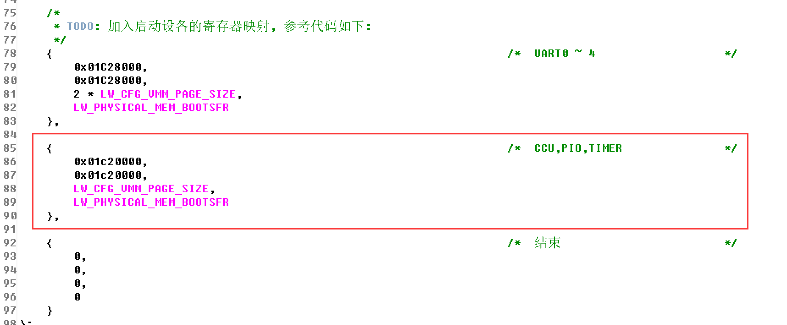

重新编译BSP工程，将新的SylixOS镜像拷贝到SD卡中用U-Boot启动：

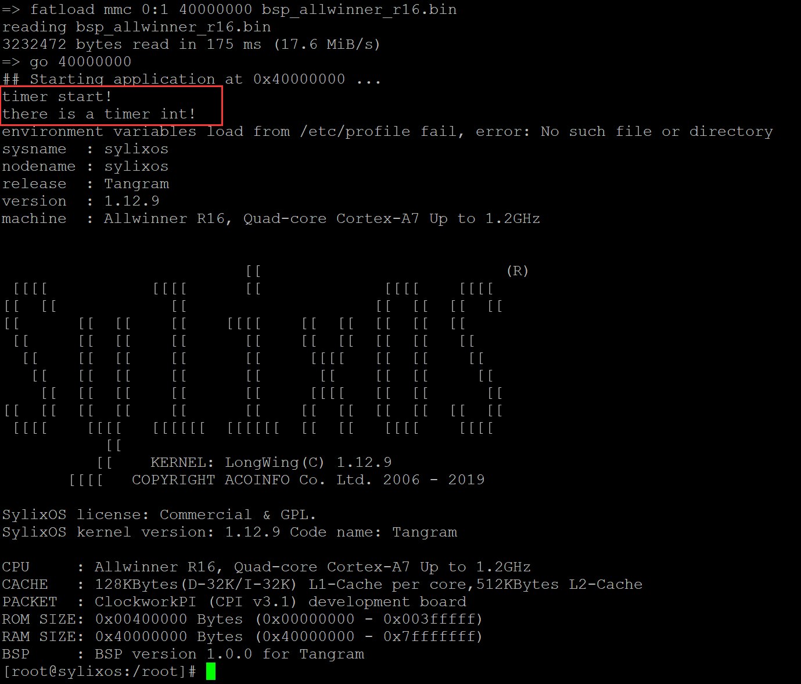

​		可以看到我们之前添加的打印，说明定时器确实产生中断了。但是定时器产生中断的频率对不对呢？我们可以在初始化时将定时器的输出频率设置为1，也就是1s产生一个中断，这样在打印时我们会先看到***timer start!*** 信息然后大概1s之后我们再看到***there is a timer int!*** 信息。通过这种方法来辅助判断定时器输出频率是否正常：

```
timerStart(0, 1);
```

**注：在bspMap.h中添加映射关系时需注意页对齐**

## 实现BSP中断系统处理接口

​		这些接口都定义在bspLib.c中，需要BSP开发者根据实际平台去实现这些接口。全志R16使用的arm官方的GICv2版本中断控制器，关于这个控制器硬件上如何使用我们不会在这篇文章中讲解，请参考arm官方资料或者互联网上相关文章。我们这里关心的是bspLib.c中哪些接口是和中断系统相关的以及实现这些接口我们需要做哪些事。

### **bspIntInit**

这个接口主要是初始化中断控制器，一般都是清除所有中断状态，关闭所有中断等操作：

```
VOID  bspIntInit (VOID)
{
    /*
     * TODO: 加入你的处理代码
     *
     * 如果某中断为链式中断，请加入形如:
     * API_InterVectorSetFlag(LW_IRQ_4, LW_IRQ_FLAG_QUEUE);
     * 的代码.
     *
     * 如果某中断可用作初始化随机化种子，请加入形如:
     * API_InterVectorSetFlag(LW_IRQ_0, LW_IRQ_FLAG_SAMPLE_RAND);
     * 的代码.
     */

    gicDistInit();
    gicCpuInit();
}
```

### **bspIntHandle**

中断处理接口，当cpu产生IRQ中断时，首先是从startup.S的中断向量表中找到IRQ中断入口也即是***archIntEntry*** 这个函数，这个函数在处理过程中最终调用到BSP中的***bspIntHandle*** 。这个接口首先需要读取中断控制器来获取当前是哪个中断号产生了中断，然后调用内核接口***archIntHandle\*** 来处理这个中断号对应的中断服务函数，当中断服务函数处理完毕之后可能还需要通知中断控制器：

```
VOID  bspIntHandle (VOID)
{
    /*
     * TODO: 通过读取硬件寄存器, 得到当前产生的中断向量号, 并赋给 uiVector 变量
     */
    REGISTER UINT32   uiVector = 0;
    unsigned int irqstat;

    irqstat=readl(GIC_CPU_BASE+GIC_CPU_IAR);
    uiVector=irqstat & 0x3ff;
    archIntHandle((ULONG)uiVector, LW_FALSE);
    writel(irqstat,GIC_CPU_BASE+GIC_CPU_EOIR);
}
```

### **bspIntVectorEnable**

这个接口使能相应中断号对应的中断，调用系统接口***API_InterVectorEnable*** 最终就是调用BSP中的这个接口来使能中断的：

```
VOID  bspIntVectorEnable (ULONG  ulVector)
{
    /*
     * TODO: 通过设置硬件寄存器, 使能指定的中断向量
     */
    armGicIntVecterEnable(ulVector);
}
```

因为GICv2是支持多核的中断控制器，所以这里使能中断时我们将中断默认都在0核上处理。

### **bspIntVectorDisable**

这个接口关闭相应中断号对应的中断，调用系统接口***API_InterVectorDisable*** 最终就是调用BSP中的这个接口来关闭中断的：

```
VOID  bspIntVectorDisable (ULONG  ulVector)
{
    /*
     * TODO: 通过设置硬件寄存器, 禁能指定的中断向量
     */
    armGicIntVecterDisable(ulVector);
}
```

### **bspIntVectorIsEnable**

这个接口用来检测某一个中断号对应的中断是否使能，调用系统接口***API_InterVectorIsEnable\*** 最终就是调用BSP中的这个接口来检测中断状态的：

```
BOOL  bspIntVectorIsEnable (ULONG  ulVector)
{
    /*
     * TODO: 通过读取硬件寄存器, 检查指定的中断向量是否使能
     */
    return  (armGicIrqIsEnable(ulVector) ? LW_TRUE : LW_FALSE);
}
```

### **bspIntVectorSetPriority**

某些中断控制器支持中断优先级设置，这个接口用来设置某个中断的优先级，调用系统接口***API_InterVectorSetPriority*** 最终就是调用BSP中的这个接口来设置中断优先级的，在本次教程中我们不关心中断优先级，所以这个接口使用默认设置就好：

```
ULONG   bspIntVectorSetPriority (ULONG  ulVector, UINT  uiPrio)
{
    return  (ERROR_NONE);
}
```

### **bspIntVectorGetPriority**

这个接口用来获取某个中断的优先级，调用系统接口***API_InterVectorGetPriority*** 最终就是调用BSP中的这个接口来获取中断优先级的，在本次教程中我们不关心中断优先级，所以这个接口使用默认设置就好：

```
ULONG   bspIntVectorGetPriority (ULONG  ulVector, UINT  *puiPrio)
{
    *puiPrio = 0;
    return  (ERROR_NONE);
}
```

### **bspIntVectorSetTarget**

这个接口用于设置某个中断可以被哪些cpu核处理，调用系统接口***API_InterSetTarget*** 最终就是调用BSP中的这个接口来实现中断绑核功能，在本教程中我们让中断都在0核上处理，所以这个接口使用默认设置就好：

```
ULONG   bspIntVectorSetTarget (ULONG  ulVector, size_t  stSize, const PLW_CLASS_CPUSET  pcpuset)
{
    return  (ERROR_NONE);
}
```

### **bspIntVectorGetTarget**

这个接口用于获取某个中断可以被哪些cpu核处理，调用系统接口***API_InterGetTarget*** 最终就是调用BSP中的这个接口来获取中断绑在哪个核上的，在本教程中我们让中断都在0核上处理，所以这个接口使用默认设置就好：

```
ULONG   bspIntVectorGetTarget (ULONG  ulVector, size_t  stSize, PLW_CLASS_CPUSET  pcpuset)
{
    LW_CPU_ZERO(pcpuset);
    LW_CPU_SET(0, pcpuset);
    return  (ERROR_NONE);
}
```

​		到此为止我们就介绍完了bspLib.c中需要实现的核中断处理相关的接口，在实际BSP开发调试中，中断控制器的驱动一般都是从别的使用相同型号中断控制器的BSP中拷贝过来然后进行修改调试。如果是完全从头开发的话，需要参考芯片厂商提供的Linux源码，这部分工作也是重中之重，因为如果中断系统无法正常工作的话，SylixOS基本也就基本告别自行车了==

​		实现完上述接口之后还有最后一个步骤要做，我们需要将当前系统设置的中断向量表的基址告诉cpu，在armv7架构中我们可以通过cp15协处理器指令设置中断向量表的基址，在SylixOS内核中已经提供好接口***armVectorBaseAddrSet*** ，只需要将基址传入即可。

> 注意：如果使能了MMU，这里需要设置的地址是虚拟地址，但是在SylixOS内核中，中断向量表是在内核代码段的，这段内存是对等映射的，所以直接将物理地址填入即可。

​		这个设置操作我们放在bspInit.c中的***halModeInit\*** 函数中，因为在之后的从核启动过程中也会使用这个接口：

```
static VOID  halModeInit (VOID)
{
    /*
     * TODO: 加入你的处理代码, 但建议不作处理
     */
    armHighVectorDisable();
    armVectorBaseAddrSet(BSP_CFG_RAM_BASE);
}
```

在arm架构中，为了安全考虑可以将中断向量表位置固定在0xffff0000这个地址，这个位置一般都是厂商BootRom所在的位置，但是我们现在要使用自己的中断向量表而不是BootRom中的，所以需要先将中断向量表定位在0xffff0000这个功能关闭掉，这是通过上面的***armHighVectorDisable\*** 接口来实现的。

在driver目录下新建gic目录，将中断控制器的驱动放在其中：


附 armGic.c 源码：

```c

#include "arm_gic.h"
#include "./driver/a7addr.h"


void armGicIntVecterEnable(ULONG  ulVector){
    ULONG mask = 1 << ( ulVector % 32 );
    writel(mask,GIC_DIST_BASE+GIC_DIST_ENABLE+(ulVector/32)*4);
}

void armGicIntVecterDisable (ULONG  ulVector){
    ULONG mask = 1 << ( ulVector % 32 );
    writel(mask,GIC_DIST_BASE+GIC_DIST_ENABLE_CLEAR+(ulVector/32)*4);
}

void gicDistInit ()
{
    writel(0,GIC_DIST_BASE+GIC_DIST_CTRL);
    unsigned int mask;
    unsigned int i;

    for (i = mask = 0; i < 32; i += 4) {
        mask = readl(GIC_DIST_BASE + GIC_DIST_TARGET + i);
        mask |= mask >> 16;
        mask |= mask >> 8;
        if (mask)
            break;
    }

    mask |= mask << 8;
    mask |= mask << 16;
    for (i = 32; i < 1020; i += 4)         //中断ID在32-1019之间
        writel(mask, GIC_DIST_BASE + GIC_DIST_TARGET + i * 4 / 4);

    unsigned int gic_irqs;
    gic_irqs = readl(GIC_DIST_BASE + GICD_TYPER) & 0x1f;
       gic_irqs = (gic_irqs + 1) * 32;         //计算支持的最大中断数量
       if (gic_irqs > 1020)
           gic_irqs = 1020;

    /*
    * Set all global interrupts to be level triggered, active low.
    */
    for (i = 32; i < gic_irqs; i += 16)
       writel_relaxed(0, GIC_DIST_BASE + GIC_DIST_CONFIG + i / 4);

    /*
    * Set priority on all global interrupts.
    */
    for (i = 32; i < gic_irqs; i += 4)
       writel_relaxed(0xa0a0a0a0, GIC_DIST_BASE + GIC_DIST_PRI + i);

    /*
    * Disable all interrupts.  Leave the PPI and SGIs alone
    * as they are enabled by redistributor registers.
    */
    for (i = 32; i < gic_irqs; i += 32)
                   writel(0xffffffff, GIC_DIST_BASE + GIC_DIST_ENABLE_CLEAR + i / 8);

    writel(1,GIC_DIST_BASE+GIC_DIST_CTRL);

}

void gicCpuInit ()
{
    writel(0xffff0000, GIC_CPU_BASE + GIC_DIST_ENABLE_CLEAR);
    writel(0x0000ffff, GIC_CPU_BASE + GIC_DIST_ENABLE);
    int i;
    for (i = 0; i < 32; i += 4)
            writel_relaxed(0xa0a0a0a0, GIC_CPU_BASE + GIC_DIST_PRI + i * 4 / 4);
    writel_relaxed(0xf0, GIC_CPU_BASE + GIC_CPU_PRIMASK);
    writel_relaxed(1, GIC_CPU_BASE + GIC_CPU_CTRL);
}

```

## 验证中断系统

​		上一章节我们已经完成了BSP中的中断系统接口实现，现在该验证下中断控制器是否能正常工作了。我们可以在系统TICK的中断处理函数中添加一个打印信息：

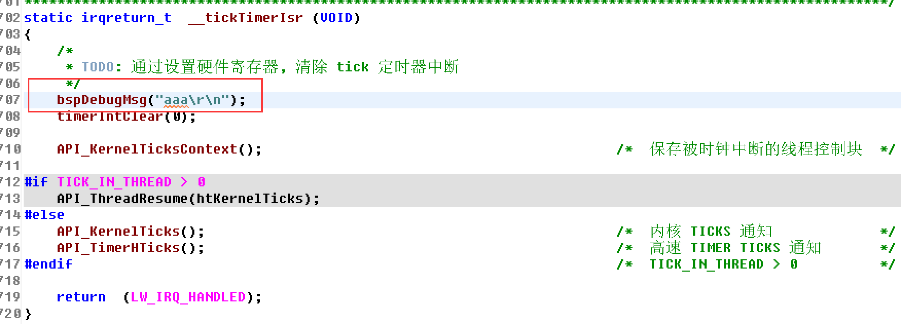

​		如果中断系统正常工作的话，当TICK产生中断时就会调用这个服务服务函数。同时我们将原来***bspTickInit*** 接口最后添加的验证定时器是否产生中断的代码删除，再将定时器中断频率设置为1，因为启动参数中我们设置的是1000，如果中断正常工作，1s会打印1000条信息，这样影响我们判断，所以设置成1s产生1次中断：

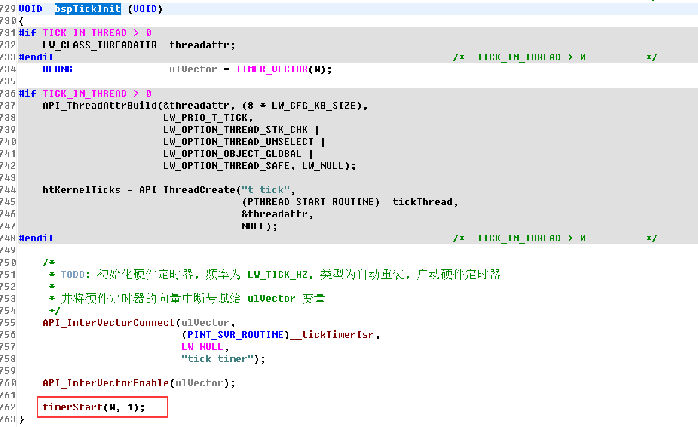

​		重新编译内核镜像进行引导，如果看到串口上每秒都有1个***aaa\*** 打印就说明中断系统是正常工作的：

```
=> fatload mmc 0:1 40000000 bsp_allwinner_r16.bin
reading bsp_allwinner_r16.bin
3233520 bytes read in 214 ms (14.4 MiB/s)
=> go 40000000
## Starting application at 0x40000000 ...
environment variables load from /etc/profile fail, error: No such file or directory
sysname  : sylixos
nodename : sylixos
release  : Tangram
version  : 1.12.9
machine  : Allwinner R16, Quad-core Cortex-A7 Up to 1.2GHz


                          [[                          (R)
 [[[[           [[[[      [[             [[[[    [[[[
[[  [[            [[                    [[  [[  [[  [[
[[      [[  [[    [[    [[[[    [[  [[  [[  [[  [[
 [[     [[  [[    [[      [[    [[  [[  [[  [[   [[
  [[    [[  [[    [[      [[     [[[[   [[  [[    [[
   [[   [[  [[    [[      [[      [[    [[  [[     [[
    [[  [[  [[    [[      [[     [[[[   [[  [[      [[
[[  [[  [[  [[    [[      [[    [[  [[  [[  [[  [[  [[
 [[[[    [[[[   [[[[[[  [[[[[[  [[  [[   [[[[    [[[[
           [[
          [[    KERNEL: LongWing(C) 1.12.9
       [[[[   COPYRIGHT ACOINFO Co. Ltd. 2006 - 2019

SylixOS license: Commercial & GPL.
SylixOS kernel version: 1.12.9 Code name: Tangram

CPU     : Allwinner R16, Quad-core Cortex-A7 Up to 1.2GHz
CACHE   : 128KBytes(D-32K/I-32K) L1-Cache per core,512KBytes L2-Cache
PACKET  : ClockworkPI (CPI v3.1) development board
ROM SIZE: 0x00400000 Bytes (0x00000000 - 0x003fffff)
RAM SIZE: 0x40000000 Bytes (0x40000000 - 0x7fffffff)
BSP     : BSP version 1.0.0 for Tangram
[root@sylixos:/root]# aaa
aaa
aaa
aaa
aaa
aaa
aaa
aaa
```

验证正常后再将定时器中断频率改为系统TICK数量并删除TICK中断服务函数中的打印：

```
timerStart(0, LW_TICK_HZ);
```

## 实现串口中断接收

​		通过前面的学习我们已经调试好了串口SIO驱动发送功能、中断系统和系统TICK功能，现在最小系统已经被我们完成了90%了，就剩最后一步我们需要实现串口使用中断接收数据的功能，这样我们才能在shell上输入命令和SylixOS进行交互。

要实现串口接收功能我们需要在uart.c中实现3个接口：

```
VOID  uartGetChar (PCHAR  pcChar)
{
    *pcChar = readb(UART0_BASE + RBR);
}

BOOL  uartIsRcvFifoEmpty (VOID)
{
    return  (!(readl(UART0_BASE + USR) & BIT(3)) ? TRUE : FALSE);
}

VOID  uartEnableRcvInt (VOID)
{
    writel(readl(UART0_BASE + LCR) & ~BIT(7), UART0_BASE + LCR);
    writel(BIT(0), UART0_BASE + IER);
}
```

- uartGetChar：这个接口从寄存器中读取一个字节数据。
- uartIsRcvFifoEmpty：用于检测接收FIFO中是否有数据，全志R16使用的是16550兼容的UART控制器，发送和接收都有64字节的FIFO进行缓冲。当收到数据时，数据首先存放到接收FIFO中，当数据个数满足事先设置的阈值(默认是1个字节)时产生一个中断。
- uartEnableRcvInt：使能UART控制器的接收中断。

同时将串口中断号使用宏定义在uart.h中以让外部文件使用：

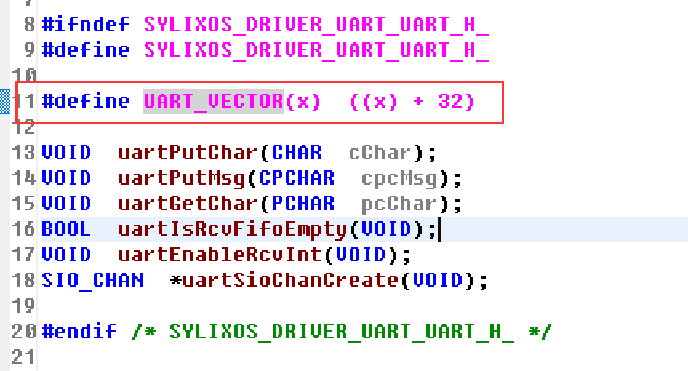

接下来我们就要在sio.c中实现串口接收中断处理函数了：

```
static irqreturn_t  uartSioIsr (PVOID  pArg, ULONG  ulVector)
{
    CHAR  cChar;

    /*
     *  TODO:清除中断
     */


    while (!uartIsRcvFifoEmpty()) {
        uartGetChar(&cChar);

        uartPutRcvChar(pRxArg, cChar);
    }

    return  (LW_IRQ_HANDLED);
}
```

逻辑也很简单，首先判断接收FIFO中是否有数据，如果有数据就从中读取一个数据，再通过***uartPutRcvChar\*** 接口把接收的数据上送到系统接收缓冲区。有的UART控制器可能需要在中断处理函数中清除中断状态，但是全志R16使用的UART控制器不需要。

中断处理函数编写完成之后，通过***API_InterVectorConnect\*** 接口注册到系统中：

```
SIO_CHAN  *uartSioChanCreate (VOID)
{
    uartSioChan.pDrvFuncs = &uartSioDrvFunc;

    API_InterVectorConnect(UART_VECTOR(0),
                           (PINT_SVR_ROUTINE)uartSioIsr,
                           NULL,
                           "uart_isr");

    return  &uartSioChan;
}
```

最后将中断使能的操作放在打开SIO通道的ioctl中：

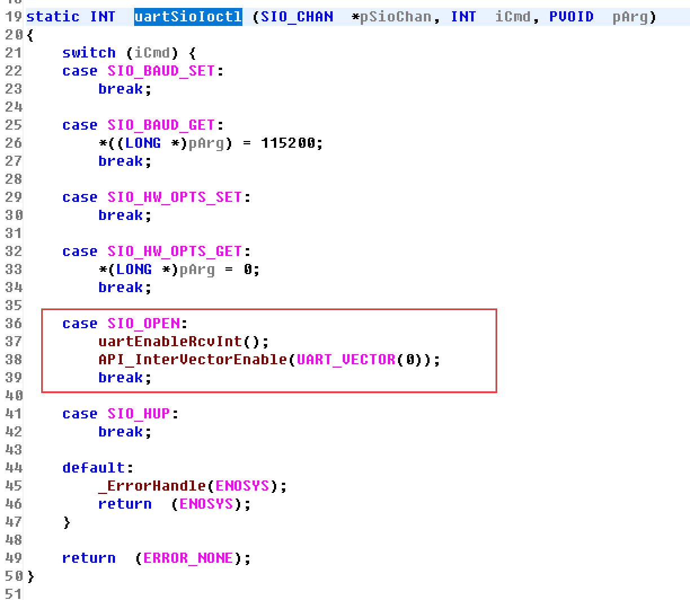

重新编译内核进行引导，这次我们就可以在串口终端上输入命令了：

```
[root@sylixos:/root]# top
CPU usage checking, please wait...
CPU usage show (measurement accuracy 1.0%) >>

       NAME        TID    PID  PRI   CPU   KERN
---------------- ------- ----- --- ------ ------
t_tshell         4010010     0 150   0.0%   0.0%
t_telnetd        401000e     0 160   0.0%   0.0%
t_ftpd           401000d     0 160   0.0%   0.0%
t_snmp           401000c     0 110   0.0%   0.0%
t_netproto       401000b     0 110   0.0%   0.0%
t_netjob         401000a     0 110   0.0%   0.0%
t_sync           4010009     0 252   0.0%   0.0%
t_reclaim        4010008     0 253   0.0%   0.0%
t_hotplug        4010006     0 250   0.0%   0.0%
t_power          4010005     0 254   0.0%   0.0%
t_log            4010004     0  60   0.0%   0.0%
t_except         4010003     0   0   0.0%   0.0%
t_isrdefer       4010002     0   0   0.0%   0.0%
t_itimer         4010001     0  20   0.0%   0.0%
t_idle0          4010000     0 255  99.9%   0.0%

[root@sylixos:/root]# ps

      NAME            FATHER      STAT  PID   GRP    MEMORY    UID   GID   USER
---------------- ---------------- ---- ----- ----- ---------- ----- ----- ------
kernel           <orphan>         R        0     0        0KB     0     0 root

total vprocess: 1
[root@sylixos:/root]# ts
thread show >>

      NAME         TID    PID  PRI STAT LOCK SAFE    DELAY   PAGEFAILS FPU CPU
---------------- ------- ----- --- ---- ---- ---- ---------- --------- --- ---
t_idle0          4010000     0 255 RDY     0 YES           0         0       0
t_itimer         4010001     0  20 SLP     0 YES       92274         0       0
t_isrdefer       4010002     0   0 SEM     0 YES           0         0       0
t_except         4010003     0   0 SEM     0 YES           0         0       0
t_log            4010004     0  60 MSGQ    0 YES           0         0       0
t_power          4010005     0 254 SLP     0 YES         446         0       0
t_hotplug        4010006     0 250 SEM     0 YES         439         0       0
t_reclaim        4010008     0 253 MSGQ    0 YES           0         0       0
t_sync           4010009     0 252 SLP     0             425         0       0
t_netjob         401000a     0 110 SEM     0 YES           0         0       0
t_netproto       401000b     0 110 MSGQ    0 YES          23         0       0
t_snmp           401000c     0 110 MSGQ    0 YES           0         0       0
t_ftpd           401000d     0 160 MSGQ    0               0         0       0
t_telnetd        401000e     0 160 MSGQ    0 YES           0         0       0
t_tshell         4010010     0 150 RDY     1               0         0       0

thread: 15
[root@sylixos:/root]#
```

我们还可以通过***ints*** 命令来查看系统的中断情况：

```
[root@sylixos:/root]# ints
interrupt vector show >>

 IRQ      NAME       ENTRY    CLEAR   ENABLE RND PREEMPT PRIO     CPU 0
---- -------------- -------- -------- ------ --- ------- ---- -------------
  32 uart_isr       40000b8c        0 true                  0            23
  50 tick_timer     40000400        0 true                  0         15687

interrupt nesting show >>

 CPU  MAX NESTING      IPI
----- ----------- -------------
    0           1             0

[root@sylixos:/root]#
```

通过***cat /proc/cpuinfo\*** 来查看当前平台的基本信息，可以看出现在使用的是单核状态：

```
[root@sylixos:/root]# cat /proc/cpuinfo
CPU         : Allwinner R16, Quad-core Cortex-A7 Up to 1.2GHz
CPU Family  : ARM(R) 32-Bits
CPU Endian  : Little-endian
CPU Cores   : 1
CPU Active  : 1
PWR Level   : Top level
CACHE       : 128KBytes(D-32K/I-32K) L1-Cache per core,512KBytes L2-Cache
PACKET      : ClockworkPI (CPI v3.1) development board
BogoMIPS  0 : 2000.00
[root@sylixos:/root]#
```

## bspLib.c其他接口介绍

​		经过前面的学习，我们已经实现了bspLib.c中的中断和TICK相关的接口，在这个文件中还有一些其他的接口，下面我们就一起来看看这些接口的功能。

### **BSP信息获取相关接口**

这些接口主要获取BSP的基本信息，比如cpu信息、板级包信息、内存基址等等，大部分的接口直接使用默认的实现即可：

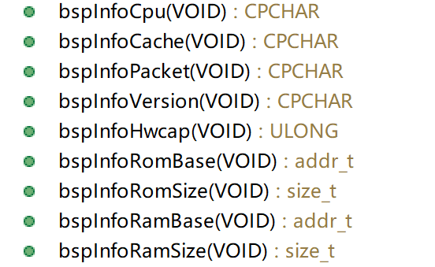

其中需要***bspInfoHwcap*** 这个接口需要根据实际硬件特性进行设置：

```
ULONG  bspInfoHwcap (VOID)
{
    /*
     * TODO: 返回硬件特性 (如果支持硬浮点, 可以加入 HWCAP_VFP , HWCAP_VFPv3 , HWCAP_VFPv3D16 , HWCAP_NEON)
     */
    return  (HWCAP_VFP | HWCAP_VFPv4 | HWCAP_NEON | HWCAP_LPAE);
}
```

### **BSP钩子接口**

一些重要的系统接口会预留钩子接口，比如线程创建、删除等，用户可以在钩子接口中添加自己的处理代码，其中有一些钩子接口是定义在bspLib.c中的，如果有需要，BSP开发者可以实现这些接口：

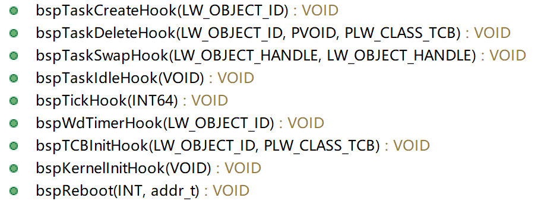

其中***bspReboot\*** 接口是用来重启系统的，一般都是通过硬件看门狗来复位整个硬件系统达到重启的目的。在SylixOS命令行下输入***ctrl + x*** 组合键最终会调用到bsp中的***bspReboot\*** 接口实现系统重启。

### **CPU和多核接口**

这些接口都是控制cpu的，比如启动从核、cpu休眠和唤醒等等：

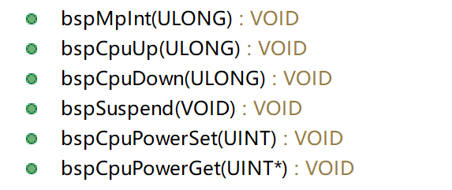

- bspMpInt：用来产生一个核间中断。
- bspCpuUp：启动一个cpu核。
- bspCpuDown：关闭一个cpu核。
- bspSuspend：系统进入休眠。
- bspCpuPowerSet：设置cpu运行等级。
- bspCpuPowerGet：获取cpu运行等级。

在使用多核时，我们需要实现前三个接口，后三个接口一般情况下不实现，使用默认设置即可。

### **操作系统时间相关接口**

这里面主要就是系统TICK的接口，因为系统延时类接口需要以TICK作为时间基准，TICK初始化我们在之前的章节中已经实现：

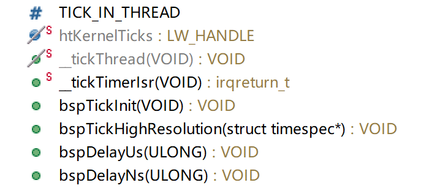

- bspTickHighResolution：高精度时间修正。SylixOS系统提供了普通时间和高精度时间两类接口，普通时间接口的时间精度和TICK相关，如果TICK设置为100，那么精度就是10ms，如果TICK设置1000，精度就是1ms。而高精度时间的时间精度和定时器的计数间隔有关，一般都能达到ns级别，高精度时间可以用额外的定时器实现也可以直接使用TICK的定时器实现，但是不管使用哪种方式，都需要在底层做时间精度上的修正，这个我们在下一章节详细讲解。
- bspDelayUs：延时微妙接口，如果需要可以实现，一般不用，使用默认实现即可。
- bspDelayNs：延时纳秒接口，同上个接口一样，如果需要可以实现。

### **其他接口**

这些接口是配合编译器或者有其他用途，使用默认即可：

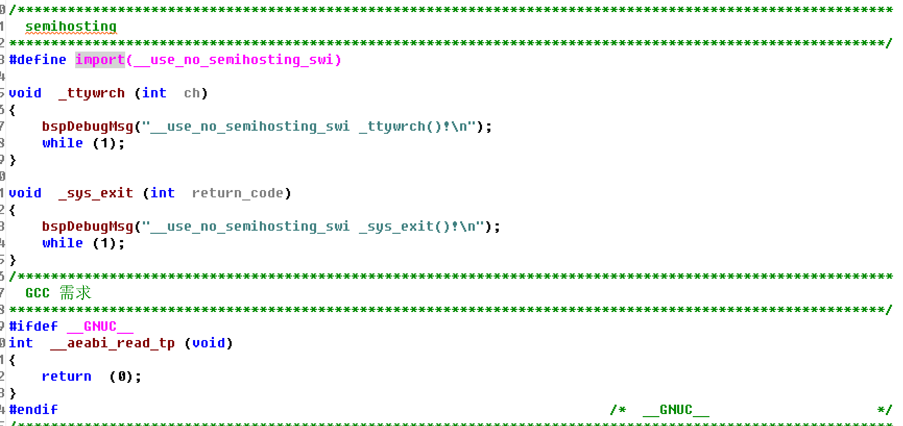

## 高精度时间修正

### TICK工作原理

​		其实这应该说“定时器工作原理”更合适些，1个系统tick就是一个定时器硬件中断，全志R16定时器的工作原理很简单，就是内部有一个递减的计数器，当减到0时产生一个中断：

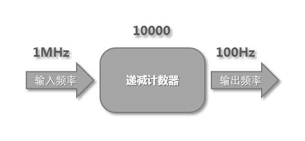

​		假设定时器模块的输入频率是1MHz，系统定义的tick数是100，也就是100Hz，那么可以计算出递减计数器要设置的值为1MHz/100Hz=10000。可以看出递减计数器相当于一个分频器，输入端每来一个脉冲，其值就减去1，当减到0时产生一个中断，同时其值自动重载成10000，如此循环下去。

### **系统获取时间操作**

系统获取时间相关接口是基于tick来工作的，这其实有精度的：

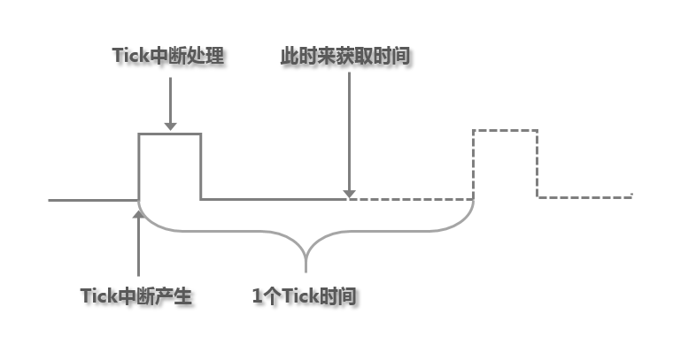

​		虚线表示一个tick中断还未产生，如果此时来获取时间，获取到的时间只是之前tick累计的时间。假设tick中断产生时刻和获取时间那一时刻之间的跨度是4ms，那么获取的时间就有4ms的误差，高精度时间修正就是为了消除这种误差而诞生的。

### 时间修正

我们知道，上述误差产生的根本原因是没有将tick中断产生时刻和获取时间那一时刻之间的跨度更新到时间里去，如果我们能计算出这段时间并加到时间里去不就行了吗？看到没有，so easy！

根据以上的信息，我们可以很容易的想出以下修正算法：

- 根据输入频率我们可以得到计数器递减一次所需要的时间。
- 计数器的初始值是定时器初始化时就确定的，用其值减去获取时间那一刻计数器当前值就可以得到计数器已经递减了多少次。
- 用计数器递减的次数 x 递减一次所需时间 = 需要修正的时间。
- 此外还需要考虑一种特殊情况：当系统是多核时，系统产生了一个由cpu0来处理的tick中断，当cpu0还没有更新整个系统的tick数时，这时cpu1来获取时间，按照上述方法计算后还要加上一个tick的时间才是正确的。

### 编写代码

我们首先需要在初始化时将定时器的递减初始值和一次递减的时间记录下来：

```
static UINT32  u32FullCnt;
static UINT64  u64NsecPerCnt7;

VOID  timerStart (INT32  iNum, UINT32  uiHZ)
{
    UINT32  uiCount;
    UINT32  uiIntvOffset;
    UINT32  uiCtrlOffset;

    if (0 == iNum) {
        uiIntvOffset = TIMER0_INTV;
        uiCtrlOffset = TIMER0_CTRL;
    } else if (1 == iNum) {
        uiIntvOffset = TIMER1_INTV;
        uiCtrlOffset = TIMER1_CTRL;
    } else {
        return ;
    }

    uiCount  = TIMER_FREQ;
    uiCount /= uiHZ;

    if (0 == iNum) {
        u32FullCnt = uiCount;
        u64NsecPerCnt7 = ((1000 * 1000 * 1000 / LW_TICK_HZ) << 7) / u32FullCnt;
    }

    writel(uiCount, TIMER_BASE + uiIntvOffset);
    writel(BIT(1) | BIT(2) | BIT(4), TIMER_BASE + uiCtrlOffset);
    while ((readl(TIMER_BASE + uiCtrlOffset) >> 1) & 0x01);
    writel(readl(TIMER_BASE + uiCtrlOffset) | BIT(0), TIMER_BASE + uiCtrlOffset);
    writel(readl(TIMER_BASE + TIMER_IRQ_EN) | BIT(iNum), TIMER_BASE + TIMER_IRQ_EN);
}
```

注意这里记录的递减一次的时间单位的ns，因为SylixOS高精度时间的精度就是1ns，但是如果定时器的时钟频率超过1MHz的话，一次脉冲时间就会小于1ns，所以***u64NsecPerCnt7\*** 在计算过程中将结果左移7位扩大以提高计算精度，最终得到的修正时间会再右移7位恢复到ns精度。

修正算法中需要获取当前计数器的值，所以需要额外定义一个这个接口：

```
static UINT32  timerCurGet (INT32  iNum)
{
    if ((0 != iNum) && (1 != iNum))
        return 0;

    return  readl(TIMER_BASE + (TIMER0_CUR + iNum * 0x10));
}
```

一切准备好之后，接下来就是实现修正算法了：

```
VOID  timerTickHighResolution (struct timespec *ptv)
{
    register UINT32  u32DoCnt;

    /*
     * work out how many counts have gone since last timer interrupt
     */
    u32DoCnt = u32FullCnt - timerCurGet(0);

    /*
     * check to see if there is an interrupt pending
     */
    if (timerIsIntPending(0)) {
        /*
         * re-read the timer, and try and fix up for the missed
         * interrupt. Note, the interrupt may go off before the
         * timer has re-loaded from wrapping.
         */
        u32DoCnt = u32FullCnt - timerCurGet(0);

        if (u32DoCnt != u32FullCnt) {
            u32DoCnt += u32FullCnt;
        }
    }

    ptv->tv_nsec += (LONG)((u64NsecPerCnt7 * u32DoCnt) >> 7);
    if (ptv->tv_nsec >= 1000000000) {
        ptv->tv_nsec -= 1000000000;
        ptv->tv_sec++;
    }
}
```

- u32DoCnt就表示获取时间时刻计数器递减的次数，乘上u64NsecPerCnt7就表示需要修正的时间，但是这个得到的时间的扩大后的，所以需要再右移7位恢复到ns精度。
- 上述计算出的ns时间如果超过1s的话，需要将struct timespec结构中的秒成员加1。
- 中间的if判断就是用来处理本章第3小节所说的那种特殊情况的。

在bspLib.c中的***bspTickHighResolution*** 接口中调用我们上面实现的修正函数即可：

```
VOID  bspTickHighResolution (struct timespec *ptv)
{
    /*
     * TODO: 修改为你的处理代码
     */
    timerTickHighResolution(ptv);
}
```

## 全志R16多核架构简介

### 多核架构

​		在学习SylixOS多核BSP开发之前，我们有必要先简单了解下多核架构的基本知识。全志R16是Arm Cortex-A7结构的多核处理器，从Cortex-A7 MPCore手册中我们可以看到多核的基本架构：

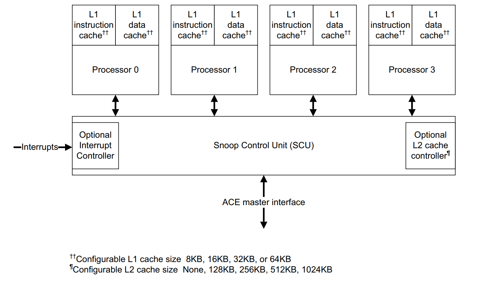

​		每个核都有自己的MMU和L1 Cache，此外还有一个SCU部件用于同步各个核的L1 DCache和L2 Cache中的数据一致性，也就是说L2 Cache也是个DataCache，而各个核中的L1 ICache数据的同步是不归SCU负责的，这个我们可以在手册中找到相关描述：

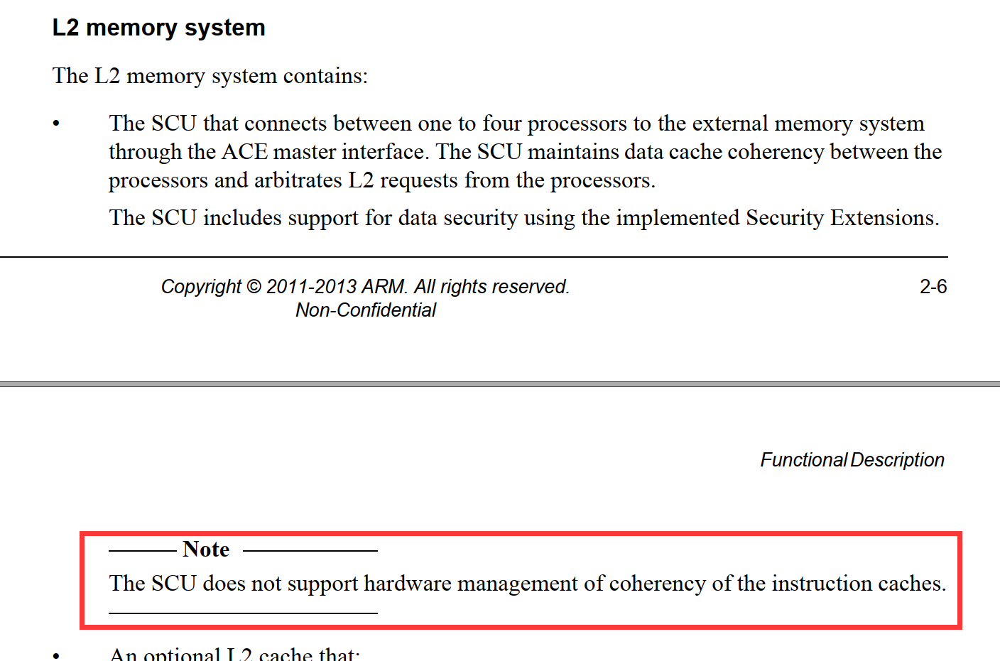

​		这个意思就是说各个核指令Cache同步需要由软件人员来负责，硬件只能保证数据Cache之间的同步。

​		另外Cortex-A7架构中的L2 Cache是没法单独关闭的，必须和L1 DCache一起开关，这是通过两个系统控制器寄存器实现的。Auxiloiary Control Register这个辅助寄存器中的SMP位是控制是否使用硬件Cache一致性，并且手册中也明确写了再使能L1 Cache和MMU之前必须将这个SMP位置1：

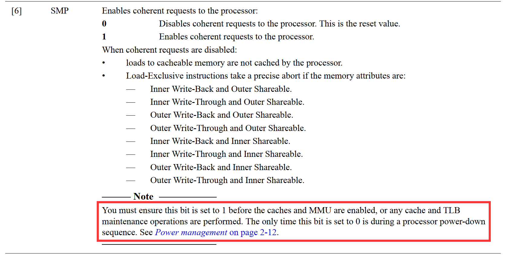

系统控制寄存器System Control Register中的C位就是控制是否使能L1 DCache 和L2 Cache，并且说明了如果ACR.SMP为0的话，即使你将L1 DCache和L2 Cache打开的话那也是无效的：

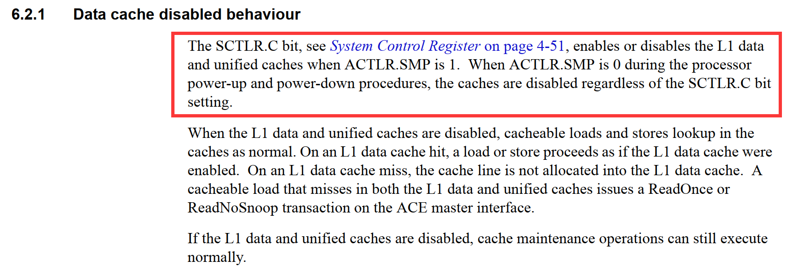

L1指令Cache不受ACR.SMP位控制，可以单独打开和关闭。

### SMP和AMP系统

​		如果想在多核硬件上运行操作系统，那么根据不同的需求，系统可以分为SMP和AMP两种模式。SMP系统是所有cpu核共同使用同一份操作系统镜像和硬件资源，比如内存、控制器等等。在SMP系统中虽然所有核是共享软硬件资源的，但是一般都有一个核是主核，负责管理其他核。AMP系统是每个核都运行自己的操作系统，并且一般需要对软硬件资源提前做划分，以确保每个核都能使用自己的软硬件资源，在需要和其他核进行数据交换时，通过某种核间通信的方式来交换数据。这些核上运行的操作系统可能是同一种也可能是不同种，甚至是不跑操作系统直接运行裸机程序。

在接下来的章节中我们将一起来学习如何开发SylixOS多核SMP BSP。

## 多核唤醒简介

​		在开始多核BSP开发之前，我们需要思考两个问题：第一个是各个cpu核不管是主核还是从核是如何开始执行指令的，也就是如何唤醒它们让其开始工作；第二个问题是各个cpu核怎么知道它要执行的第一条指令在哪的。下面我们就结合全志R16平台来看看这两个问题。

​		我们先来看主核的情况，主核被唤醒工作肯定是整个系统被上电了，那么主核执行的第一条指令在哪呢？这个其实是看处理器厂商定义的，全志芯片上电首先会运行固化在芯片内部的BootROM程序，然后再去加载外部程序执行，通过全志R16手册，我们可以知道，BootROM是在0xffff0000起始的区域中，那么R16主核执行的第一条指令就是在这个位置了：

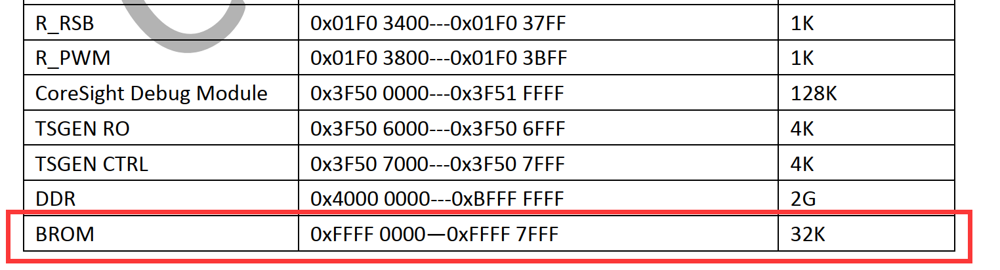

​		再来看从核的情况，从核是如何被唤醒的呢？这个其实也是取决于处理器厂商的设计，全志R16的从核唤醒之前需要主核对从核和Cache进行复位并使能供电，最后取消复位状态从核就开始运行了。从核运行的第一条指令所在的内存地址需要事先设置在某个寄存器中，这样从核被唤醒后才能知道从哪开始拿指令执行。从核唤醒的步骤在某些厂商的芯片手册中会说明的很清楚，某些则没有说明，只能去参考厂商提供的Linux源码。在SylixOS中，从核与主核都是从内核镜像加载地址处运行：

```
/*
 *  Start up a secondary CPU core.
 */
VOID  cpuEnable (UINT8 ucCoreNum)
{
    UINT32  uiValue;

    /*
     * Exit if the requested core is not available.
     */
    if (ucCoreNum == 0 || ucCoreNum >= MAX_CORE_COUNT) {
        return;
    }

    writel(BSP_CFG_RAM_BASE, R_CPUCFG_BASE + CPUCFG_PRIVATE0_REG);      /*  Set CPU boot address        */

    writel(0, R_CPUCFG_BASE + CPUCFG_CPU_RST_CTRL_REG(ucCoreNum));      /*  Assert the CPU core in reset*/

    uiValue = readl(R_CPUCFG_BASE + CPUCFG_GEN_CTRL_REG);
    writel(uiValue & ~BIT(ucCoreNum), R_CPUCFG_BASE + CPUCFG_GEN_CTRL_REG);
                                                                        /*  Assert the L1 cache in reset*/

    uiValue = readl(R_PRCM_BASE + PRCM_CPU_PWROFF_REG);
    writel(uiValue & ~BIT(ucCoreNum), R_PRCM_BASE + PRCM_CPU_PWROFF_REG);
                                                                        /*  Clear CPU power-off gating  */

    usleep(10);

    writel(3, R_CPUCFG_BASE + CPUCFG_CPU_RST_CTRL_REG(ucCoreNum));      /*  Deassert the CPU core reset */
}
```

上面的代码移植自Linux，我们可以看出来从核唤醒步骤还是比较简单的，很容易理解。

## 修改内核入口文件

​		有了前面的基础知识后，我们从本章开始正式学习多核BSP开发。首先要做的工作就是修改startup.S这个内核入口文件，为了支持多核我们需要添加修改一些代码.

### 调整栈设置

​		我们知道单核下内核入口文件的处理流程是：**中断向量表设置 -> 关闭Cache和MMU -> 栈设置 -> 内核数据段和BSS段设置 -> 跳转C入口**。这里其实有一个不严谨的地方，就是关闭Cache和MMU这步我们都是调用的内核提供好的接口，我们不知道这些接口实现是不是用到了栈，而栈设置是放在这之后的。之所以敢这么做是因为我们知道uboot已经设置了栈为某个地址，即使内核代码中用到了栈，这些代码也能正常工作。

​		但是如果是从核执行这些代码就可能有问题了，我们不知道从核被唤醒后它的栈是指向哪的，所以我们需要先设置栈再关闭Cache和MMU。第一个修改的地方就是将栈设置代码移动到关闭Cache和MMU操作之前，SylixOS启动时多个核使用的栈空间是在编译时确定的，总大小是通过***config.h*** 中的**BSP_CFG_BOOT_STACK_SIZE**宏来配置的，每个核默认栈空间大小是在***startup.S*** 中通过**CPU_STACKS_SIZE**宏来配置，所以BSP需要确保**BSP_CFG_BOOT_STACK_SIZE** 配置的大小要比所有核总共需要的栈空间要大：

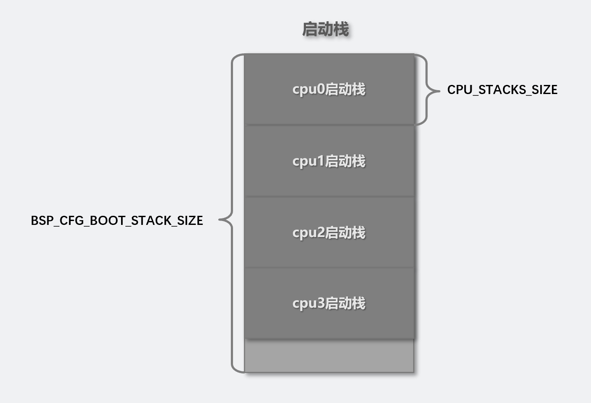

然后需要根据当前启动的是哪个核来计算使用的栈空间的起始地址：

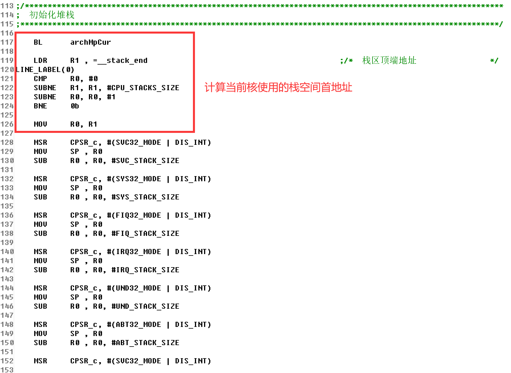

### 跳转从核入口

​		主核启动的时候需要进行内核数据段的搬运和BSS段清零操作，从核启动的时候就不需要进行这个操作了，所以启动的时候需要跳过这段处理，在关闭Cache和MMU之后直接跳转到从核C入口执行：


​		***halSecondaryCpuMain*** 就是从核的C语言函数入口，这个接口中需要做的工作会在后续章节中讲解。

​		我们来总结下从核启动时在startup.S中做的事情：**中断向量表设置 -> 栈设置 -> 关闭Cache和MMU -> 跳转C入口**。可以看出基本流程和主核启动时差不多，主要就是少了数据段和BSS段的设置。

## 实现bspLib.c中多核相关接口

​		在bspLib.c中有3个接口是需要我们来实现的，另外为了配合多核启动，我们还需要另外再自己实现几个接口以和bspInit.c来一起将多核启动起来。

### bspMpInt

​		这个接口主要是向某一个核发送一个核间中断，核间中断IPI(Inter-Processor Interrupts)是多核之间进行通信的一种方法。发起方cpu核首先将消息写到一块事先约定好的共享内存中，然后发起核间中断，产生核间中断的cpu核在核间中断服务程序中读取该内存，以获得发起方通知的消息。

​		至于如何产生核间中断则需要看具体的中断控制器了，另外还有一个问题就是核间中断的中断号是多少？在arm架构中，每个核的核间中断号就是本核的ID，也就是cpu0的核间中断号是0，cpu1的是1，依此类推。

​		一般的多核控制器都有向多个核同时发送核间中断的功能，具体的参考控制器的手册和相应的Linux源码：

```
/*********************************************************************************************************
** 函数名称: bspMpInt
** 功能描述: 产生一个核间中断
** 输  入  : ulCPUId      目标 CPU
** 输  出  : NONE
** 全局变量:
** 调用模块:
*********************************************************************************************************/
VOID   bspMpInt (ULONG  ulCPUId)
{
    /*
     * TODO: 加入你的处理代码
     */
    armGicSoftwareIntSend(ulCPUId, GIC_SW_INT_OPTION_USE_TARGET_LIST, 1 << ulCPUId);
}
```

### bspCpuUp

​		这个接口功能是启动一个从核，SylixOS下的多核启动流程大致如下图所示：

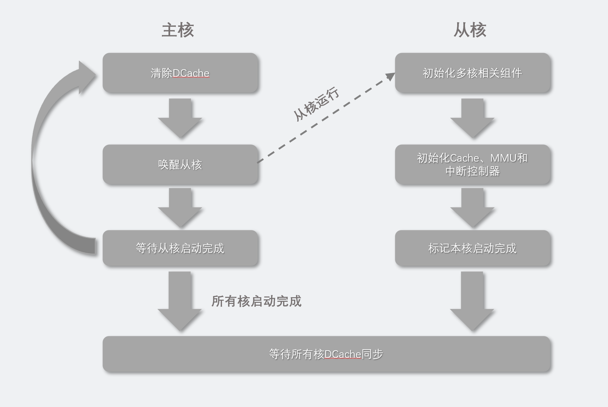

​		主核为了让从核启动后和自己看到的数据是一致的，在唤醒从核启动之前需要将DCache回写并失效，同时还要关闭本核中断，防止在中断处理中对内存访问从而改变Cache中的数据。接着就是具体的从核唤醒操作了，这是和具体的处理器相关的，从核启动后主核需要等待从核初始化完成后才能接着去唤醒下一个cpu核，在SylixOS中一般是通过轮询一个全局变量的值是否改变来实现的：

```
static volatile BOOL cpuStartDone[LW_CFG_MAX_PROCESSORS];

/*********************************************************************************************************
** 函数名称: bspCpuUp
** 功能描述: 启动一个 CPU
** 输  入  : ulCPUId      目标 CPU
** 输  出  : NONE
** 全局变量:
** 调用模块:
*********************************************************************************************************/
VOID   bspCpuUp (ULONG  ulCPUId)
{
    /*
     * TODO: 加入你的处理代码, 如果没有, 请保留下面的调试信息
     */
    INTREG  iregInterLevel;

    iregInterLevel = KN_INT_DISABLE();

    API_CacheClear(DATA_CACHE, LW_NULL, (size_t)~0);

    /*
     *  TODO: 唤醒从核启动
     */
    cpuEnable(ulCPUId);

    while (!cpuStartDone[ulCPUId]);

    KN_INT_ENABLE(iregInterLevel);
}
```

​		***cpuStartDone*** 中的值默认都是0，在从核启动完成后会将相应核对应的变量置1，这样主核就知道从核已经启动完成了，就继续去启动下一个cpu核，这个循环控制是在***bspInit.c*** 中做的。

​		当所有核都启动完成后还需要进行DCache的同步，这在SylixOS下是通过***API_CacheBarrier\*** 接口来实现的，这个会在下面小节讲解。

### bspCpuDown

这个接口功能就是关闭一个cpu核，不过在SylixOS中一般cpu核启动后就不会再动态去关闭它了，所以这个接口使用默认实现即可。

### bspCpuUpDone

在第2小节我们知道从核启动后需要告知主核它已经启动完成了，这是通过将全局变量置1来实现的：

```
VOID  bspCpuUpDone (VOID)
{
    cpuStartDone[LW_CPU_GET_CUR_ID()] = LW_TRUE;

    KN_SMP_MB();
}
```

这个接口是我们自己定义的，并不是SylixOS内核要求的，并且这个接口会在***bspInit.c*** 中被调用，这个我们将在下一章节看到。

### bspCpuUpSync

从第二小节的图中我们可以知道SylixOS所有核启动完成后需要进行DCache同步操作，这是通过***API_CacheBarrier*** 接口实现的，这个接口可以让所有核同步执行某个回调函数，然后再同步等待所有核都执行完这个回调函数再继续运行：

```
static VOID  bspCpuCacheSync (VOID)
{
    API_CacheClear(DATA_CACHE, LW_NULL, (size_t)~0);
}

VOID  bspCpuUpSync (VOID)
{
    INT i;
    LW_CLASS_CPUSET cpuset;

    LW_CPU_ZERO(&cpuset);

    LW_CPU_FOREACH (i) {
        LW_CPU_SET(i, &cpuset);
    }

    API_CacheBarrier(bspCpuCacheSync, LW_NULL, sizeof(cpuset), &cpuset);
}
```

​		***API_CacheClear*** 接口将当前cpu核的DCache先回写再失效，这样每个核在***API_CacheBarrier\*** 执行完之后DCache中的数据是一致的。

​		***bspCpuUpSync*** 接口同样也是我们自己实现的，不是SylixOS内核要求的，这个接口同样会在bspInit.c中被主核和从核调用。

## 在bspInit.c中添加多核启动功能

在本章节中，我们将添加从核启动需要的初始化代码，同样的在主核的处理过程中也需要添加代码来配合多核功能。

### halModeInit

​		这个接口是主核和从核进入C函数接口第一个调用的函数，之前单核启动时这个接口中主要就是设置了中断向量表的基址，这里我们还要加上使能ACR.SMP这个寄存器位，这在**全志R16多核架构简介**章节我们介绍过。在SylixOS下这是通过***armAuxControlFeatureEnable*** 接口来实现的：

```
static VOID  halModeInit (VOID)
{
    /*
     * TODO: 加入你的处理代码, 但建议不作处理
     */
    armHighVectorDisable();
    armVectorBaseAddrSet(BSP_CFG_RAM_BASE);
    armAuxControlFeatureEnable(AUX_CTRL_A7_SMP);                        /*  使能多核 Cache              */
}
```

### halEnableCpuIpiInt

​		通过上一章节我们知道cpu核是通过核间中断来进行通信的，所以在每个核的启动过程中需要设置核间中断，在SylixOS中安装核间中断向量是通过***API_InterVectorIpi*** 这个接口来实现的：

```
static VOID  halEnableCpuIpiInt (VOID)
{
    ULONG  ulCPUId = LW_CPU_GET_CUR_ID();

    API_InterVectorIpi(ulCPUId, ulCPUId);                               /*  安装 IPI 向量               */
    armGicIntVecterEnable(ulCPUId, LW_FALSE, 0, 1 << ulCPUId);          /*  使能 IPI 中断               */
}
```

​		安装完核间中断向量后再通过中断控制器提供的接口来使能各个核对应的核间中断号，如上面代码所示。在主核的启动过程中，我们需要在***usrStartup*** 函数中调用***halEnableCpuIpiInt\*** 这个接口：

```
static VOID  usrStartup (VOID)
{
    LW_CLASS_THREADATTR     threadattr;

    /*
     *  注意, 不要修改该初始化顺序 (必须先初始化 vmm 才能正确的初始化 cache,
     *                              网络需要其他资源必须最后初始化)
     */
    halIdleInit();
#if LW_CFG_CPU_FPU_EN > 0
    halFpuInit();
#endif                                                                  /*  LW_CFG_CPU_FPU_EN > 0       */

#if LW_CFG_RTC_EN > 0
    halTimeInit();
#endif                                                                  /*  LW_CFG_RTC_EN > 0           */

#if LW_CFG_VMM_EN > 0
    halVmmInit();
#endif                                                                  /*  LW_CFG_VMM_EN > 0           */

#if LW_CFG_CACHE_EN > 0
    halCacheInit();
#endif                                                                  /*  LW_CFG_CACHE_EN > 0         */

    halEnableCpuIpiInt();

    API_ThreadAttrBuild(&threadattr,
                        __LW_THREAD_BOOT_STK_SIZE,
                        LW_PRIO_CRITICAL,
                        LW_OPTION_THREAD_STK_CHK,
                        LW_NULL);
    API_ThreadCreate("t_boot",
                     (PTHREAD_START_ROUTINE)halBootThread,
                     &threadattr,
                     LW_NULL);                                          /*  Create boot thread          */
}
```

### API_CpuUp

​		主核除了上述的两个地方需要修改之外，还需要在***halBootThread*** 这个接口中添加启动多核的逻辑代码，这段代码是加在创建***t_main\*** 线程之前的，因为当主核执行到创建t_main这里已经说明系统内核基本初始化完成了，可以开始唤醒从核启动了。

​		主核唤醒从核是通过循环调用***API_CpuUp*** 这个接口来实现的，这个API会最终调用我们之前在bspLib.c中实现的***bspCpuUp*** 这个接口：

```
ULONG ulCPUId;
for (ulCPUId = 1; ulCPUId < LW_NCPUS; ulCPUId++) {                  /*  启动其它 CPU                */
    API_CpuUp(ulCPUId);
}
bspCpuUpSync();
```

​		当上面代码中的for循环退出时表示所有核已经启动完成，这是调用bspCpuUpSync来等待其他核进行DCache同步。**LW_NCPUS**这个值代表系统中cpu的个数，这个数值是通过系统启动参数***ncpus*** 来控制的，所以我们还需要将这个参数修改为全志R16上cpu核的实际个数，也就是4：

```
API_KernelStartParam("ncpus=4 kdlog=no kderror=yes kfpu=no heapchk=yes "
                     "sldepcache=yes hz=1000 hhz=1000 "
                     "rfsmap=/:/dev/ram");
```

​		到这里为止，主核上需要添加修改的功能都已经完成了，接下来需要实现从核的启动初始化接口。

### halSecondaryCpuMain

之前在startup.S中我们将从核的C入口跳转到了***halSecondaryCpuMain*** 这个接口，所以我们需要实现这个接口：

```
INT  halSecondaryCpuMain (VOID)
{
    halModeInit();
    API_KernelSecondaryStart(halSecondaryCpuInit);                      /*  Secondary CPU 启动内核      */

    return  (0);                                                        /*  不会执行到这里              */
}
```

​		首先和主核一样调用***halModeInit*** 来设置中断向量表基址和使能Cache共享功能，我们知道主核在启动的过程中是调用***API_KernelStart*** 接口来初始化内核组件，然后调用***usrStartup*** 回调函数来初始化MMU和Cache等功能的。类似的，从核启动时是通过***API_KernelSecondaryStart*** 接口来初始化内核组件，然后通过***halSecondaryCpuInit*** 回调函数来初始化从核的MMU和Cache等功能。

### halSecondaryCpuInit

这个接口中做的事情类似于主核，主要就是FPU、MMU、Cache、中断控制器和中断向量的初始化：

```
static VOID  halSecondaryCpuInit (VOID)
{
    API_KernelFpuSecondaryInit(ARM_MACHINE_A7, ARM_FPU_VFPv4);          /*  初始化 FPU 系统             */
    API_VmmLibSecondaryInit(ARM_MACHINE_A7);                            /*  初始化 VMM 系统             */
    API_CacheLibSecondaryInit(ARM_MACHINE_A7);                          /*  初始化 CACHE 系统           */

    armGicCpuInit(LW_FALSE, 255);                                       /*  初始化当前 CPU 使用 GIC 接口*/

    API_VmmMmuEnable();
    API_CacheEnable(INSTRUCTION_CACHE);                                 /*  使能 I-Cache                */
    API_CacheEnable(DATA_CACHE);                                        /*  使能 D-Cache                */

    halEnableCpuIpiInt();

    bspCpuUpDone();                                                     /*  通知其它 CPU 本核心启动完成 */
    bspCpuUpSync();                                                     /*  等待 CPU 启动同步           */
}
```

​		当上述工作都做完后表示从核已经启动完成了，然后通过***bspCpuUpDone*** 接口通知主核当前核启动完成，最后调用***bspCpuUpSync*** 接口来等待其他核来一起同步DCache。

> 注意：从核虽然也初始化了MMU，但是不会再次去初始化页表，而是使用主核启动时初始化的页表，也就是在SylixOS下，所有核共用一张页表。

到这里为止，多核启动需要的设置就全部完成了。

## SylixOS多核启动体验

​		重新编译SylixOS进行引导启动，启动后可以通过***ts*** 命令查看t_idle线程的个数来判断当前系统中有几个核：

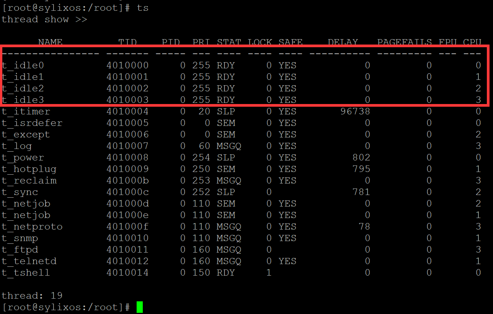

另外还可以通过***cat /proc/cpuinfo\*** 命令来查看系统的cpu核数：

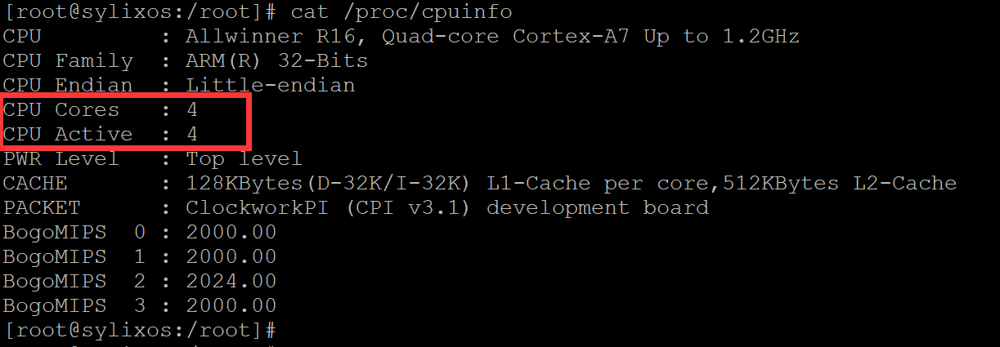

最后通过***ints*** 命令查看每个核的核间中断产生的次数：

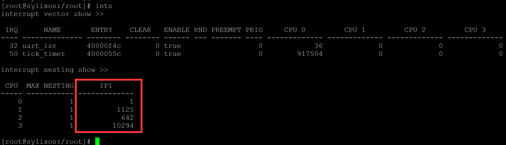

通过***ints*** 命令还可以看到每个中断号对应的中断在各个cpu核上产生的次数，SylixOS中所有中断默认都在cpu0上处理，所以我们在图中可以看出其他核上的中断次数都是0。