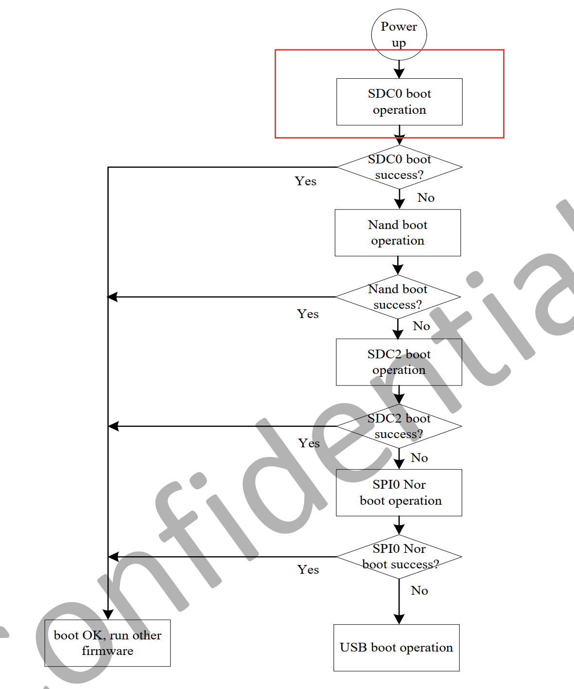
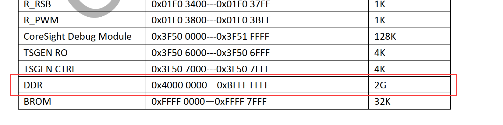
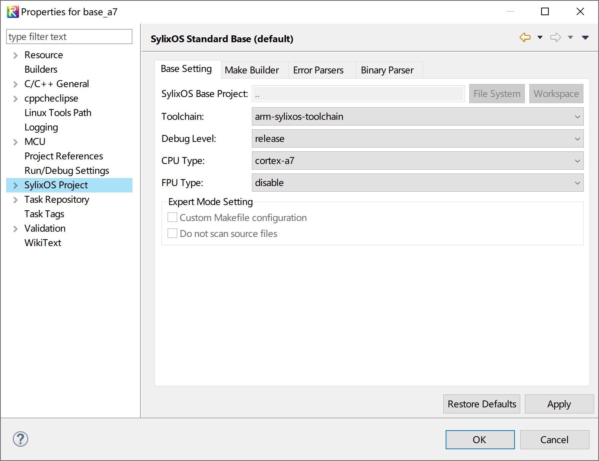
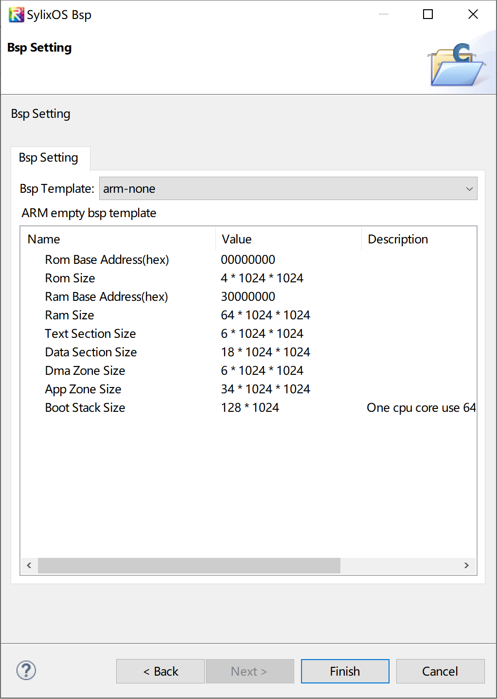
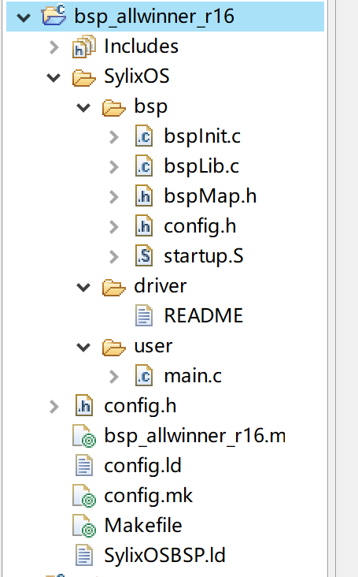

# SylixOS 最小系统开发

## 引导SylixOS

​		在学习BSP移植之前，我们先来看看SylixOS是如何被Bootloader引导起来的。我们都知道，任何一种操作系统内核运行之前都需要通过某种方式导入到内存中，然后CPU跳转到内核入口处运行，这个过程就叫做引导系统。至于具体通过什么方式导入到内存中，根据实际硬件系统不同而不同，可能是通过网络方式下载到内存中，也可能是从磁盘等存储介质上读取到内存中，甚至有可能是通过USB下载到内存中。这些工作一般都是由引导程序做的，常见的引导程序如x86平台上的BIOS、arm平台上的U-Boot、龙芯平台上的PMON等等。引导程序大致的作用就是初始化最基本的硬件环境，然后将操作系统内核加载到内存中，最后跳转过去执行内核。

​		在嵌入式领域使用的最多的Bootloader是U-Boot，SylixOS内核镜像也可以使用U-Boot来引导，通过这篇文章我们来学习如何使用U-Boot来引导SylixOS。

​		我们本次教程使用的是全志R16平台，通过查阅芯片手册得知，R16上电会首先从SDC0(SD卡控制器0)寻找Bootloader运行：



​		这个Bootloader就是U-Boot，U-Boot运行后我们就可以使用U-Boot的***fatload*** 命令将SylixOS镜像从SD卡中加载到内存固定位置。我们首先通过***fatls*** 命令查看SD卡中有哪些文件：

```
=> fatls mmc 0:1
            System Volume Information/
  3202776   bsp_clockwork.bin
  2313216   rootfs.img
   797448   liteos.bin
  3574472   bsp_clockwork.bin2
            ofi/
            3ds/
            a9lh/
            boot9strap/
            FilesToInstall/
            luma/

4 file(s), 7 dir(s)

=>
```

​		其中bsp_clockwork.bin就是SylixOS内核镜像，SylixOS镜像一般加载到内存中时都是放在内存基址处的，通过查阅R16芯片手册得知，内存基址为0x40000000：



​		所以我们可以通过***fatload*** 命令将SylixOS镜像加载到0x40000000地址：

```
=> fatload mmc 0:1 40000000 bsp_clockwork.bin
reading bsp_clockwork.bin
3202776 bytes read in 791 ms (3.9 MiB/s)
=>
```

​		加载完成后就可以直接跳转到0x40000000地址处运行SylixOS内核镜像了，这是通过***go*** 命令实现：

```
=> go 40000000
## Starting application at 0x40000000 ...
environment variables load from /etc/profile fail, error: No such file or directory
Press <n> to NOT execute /etc/startup.sh (timeout: 1 sec(s))
can not open /etc/startup.sh: No such file or directory
sysname  : sylixos
nodename : sylixos
release  : Enterprise
version  : 2.0.0
machine  : Allwinner R16 (Quad-core ARM Cortex-A7 1.2GHz VFPv4)

                          [[                          (R)
 [[[[           [[[[      [[             [[[[    [[[[
[[  [[            [[                    [[  [[  [[  [[
[[      [[  [[    [[    [[[[    [[  [[  [[  [[  [[
 [[     [[  [[    [[      [[    [[  [[  [[  [[   [[
  [[    [[  [[    [[      [[     [[[[   [[  [[    [[
   [[   [[  [[    [[      [[      [[    [[  [[     [[
    [[  [[  [[    [[      [[     [[[[   [[  [[      [[
[[  [[  [[  [[    [[      [[    [[  [[  [[  [[  [[  [[
 [[[[    [[[[   [[[[[[  [[[[[[  [[  [[   [[[[    [[[[
           [[
          [[    KERNEL: LongWing(C) 2.0.0
       [[[[   COPYRIGHT ACOINFO Co. Ltd. 2006 - 2020

SylixOS license: Commercial & GPL.
SylixOS kernel version: 2.0.0 Code name: Enterprise

CPU     : Allwinner R16 (Quad-core ARM Cortex-A7 1.2GHz VFPv4)
CACHE   : 64KBytes(D-32K/I-32K) L1-Cache per core, 512KBytes L2-Cache
PACKET  : ALLWINNER R16 Demo
ROM SIZE: 0x00400000 Bytes (0x00000000 - 0x003fffff)
RAM SIZE: 0x0c800000 Bytes (0x40000000 - 0x4c7fffff)
BSP     : BSP version 1.0.0 for Enterprise
[root@sylixos:/root]#
```

​		如果一切顺利的话就可以看到SylixOS的启动Logo了，输入***top\*** 命令查看CPU使用率：

```
[root@sylixos:/root]# top
CPU usage checking, please wait...
CPU usage show (measurement accuracy 1.0%) >>

       NAME        TID    PID  PRI   CPU   KERN
---------------- ------- ----- --- ------ ------
t_tshell         4010011     0 150   0.0%   0.0%
t_telnetd        401000e     0 160   0.0%   0.0%
t_ftpd           401000d     0 160   0.0%   0.0%
t_snmp           401000c     0 110   0.0%   0.0%
t_netproto       401000b     0 110   0.0%   0.0%
t_netjob         401000a     0 110   0.0%   0.0%
t_sync           4010009     0 252   0.0%   0.0%
t_reclaim        4010008     0 253   0.0%   0.0%
t_hotplug        4010006     0 250   0.0%   0.0%
t_power          4010005     0 254   0.0%   0.0%
t_log            4010004     0  60   0.0%   0.0%
t_except         4010003     0   0   0.0%   0.0%
t_isrdefer       4010002     0   0   0.0%   0.0%
t_itimer         4010001     0  20   0.0%   0.0%
t_idle0          4010000     0 255  99.0%   0.0%

[root@sylixos:/root]#
```

整个BSP开发系列教程最后就实现这样的SylixOS最小系统开发，所谓的最小系统开发就是指完成SylixOS下的串口、中断控制器、定时器驱动开发，最终将SylixOS启动起来并可以在shell命令行进行交互，通过这样一个最小系统的开发，我们就能熟悉SylixOS下BSP的基本框架了。

## 创建BSP工程

​		在实际的项目中，如果需要开发一款新的BSP，一般都是拿一个已有的BSP在此基础上做修改而成。但是在本教程中，我们完全从头开始创建一个空的BSP模板，带领大家一步步的完善这个BSP，最后实现SylixOS最小系统的功能。

​		首先我们要熟悉RealEvo-IDE的基本使用，比如创建base和bsp工程等等，这个需要大家提前进行学习。全志R16是cortex-a7架构的，所以在创建base工程时我们要选择这个架构类型：



​		在创建bsp工程时，我们选择arm-none模板：



​		这个选项会创建一个最基础的BSP模板，不包含任何的开发板相关代码，有助于我们在此基础上添加代码：



我们以上图为例来简单看下SylixOS BSP的基本组织:

### 1. bsp目录

bsp目录下包含了最重要的几个文件：

- bspInit.c：SylixOS系统启动初始化文件，在这个文件中会初始化系统的一系列内核组件和外设驱动。
- bspLib.c：SylixOS BSP接口文件，这个文件中包含了一系列的内核会使用的接口，需要根据不同的芯片去实现这些接口。比如关闭/使能中断向量号、获取BSP信息、系统TICK初始化等等。
- bspMap.h：系统物理地址和虚拟地址空间映射关系文件，这个文件中用两个表来描述了系统需要使用的物理地址空间和虚拟地址空间如何映射。
- startup.S：SylixOS内核入口初始化文件，主要包含了架构相关的一些设置，比如中断向量表设置、栈设置等等。由于这些设置都是架构相关的，所以使用汇编来实现的。
- config.h：直接包含最外层的config.h。

### 2. driver目录

这个目录下主要放BSP开发者需要实现的各种外设的驱动，比如中断控制器、串口、网络等等。然后在bspInit.c中会去调用这些驱动的初始化函数。在BSP最小系统的开发中，我们需要实现串口、中断控制器和定时器这三个驱动。

### 3. user目录

这个目录下只有一个main.c文件，这个文件中的t_main线程会去创建一个shell来让使用者和SylixOS进行交互。在实际的使用中，这个文件保持原样即可，一般不需要进行改动。

### 4. config.h

这个文件中主要包含了物理内存空间的划分，主要就是内核代码段、数据段、DMA内存段、APP内存段这四个空间的大小配置，这个我们会在后面专门有一章节来进行讲解。

### 5. makefile

bsp_allwinner_r16.mk、config.mk和Makefile是控制着BSP编译的三个文件，在实际的项目中，可能由于一些需求需要手动修改这些文件，但是在本BSP开发教程中，这几个文件默认即可，不需要进行额外修改。

### 6. 链接脚本

config.ld和SylixOSBSP.ld这两个文件控制着SylixOS内核镜像如何进行链接，在实际使用中很少需要改动这个两个文件，一般默认即可。

通过上面的介绍，我们对SylixOS BSP的文件组织有了一个基本的认识，从下一章节开始我们就正式开始编写代码了，让我们一起来揭开SylixOS BSP的神秘面纱吧