[TOC]


# SylixOS系统分析与使用

## SylixOS编程知识点

> 主要记录一些驱动开发或者应用开发中比较重要的知识点，不定期更新。

### 串口缓冲区大小设置

在创建串口设备时，一般使用的是下面这个接口：

```
INT  API_TtyDevCreate (PCHAR     pcName,
                       SIO_CHAN *psiochan,
                       size_t    stRdBufSize,
                       size_t    stWrtBufSize)
```

最后两个参数stRdBufSize和stWrtBufSize分别是输入缓冲区大小和输出缓冲区大小，这两个数值建议设置大点，否则在大量数据传输时缓冲区中未被处理的数据会被新数据覆盖，从而导致异常。

i.MX6Q bsp中设置的是256字节，实际工程中如果256字节不够的话，可以设置为512或者1024。

### 使用**_DebugFormat 打印64位数据**

应使用 %qd 进行64位数据的打印。

### **SylixOS下某个shell命令对应的接口函数位置**

所有shell命令对应的接口可以在__tshellSysCmdInit函数中查找到。

###  **SylixOS下查看系统对象资源使用情况**

使用如下命令查看：

```
cat /proc/kernel/objects
```

通过这种方法可以辅助查找程序是否有申请系统资源但是没有释放之类问题。

```
[root@sylixos:/root]#  cat /proc/kernel/objects
object      total    used     max-used
event       5000     238      240
eventset    500      0        0
heap        52       1        1
msgqueue    500      8        8
partition   50       8        8
rms         32       0        0
thread      500      31       33
timer       50       2        2
dpma        2        0        0
threadpool  2        0        0
```

### **增加系统日志消息缓冲的最大数量**

在使用printk的时候，经常会碰到明明加了打印语句，但是终端上却并没有显示出来这种情况，原因是系统的缓冲有限，而打印语句又太多，从而导致后面的打印覆盖了前面的打印，造成打印丢失。

解决方法是修改base中的LW_CFG_MAX_LOGMSGS这个宏，系统默认的值是20（这是不是也太少了。。。。），其所在的文件路径为：libsylixos/SylixOS/config/system/system_cfg.h：

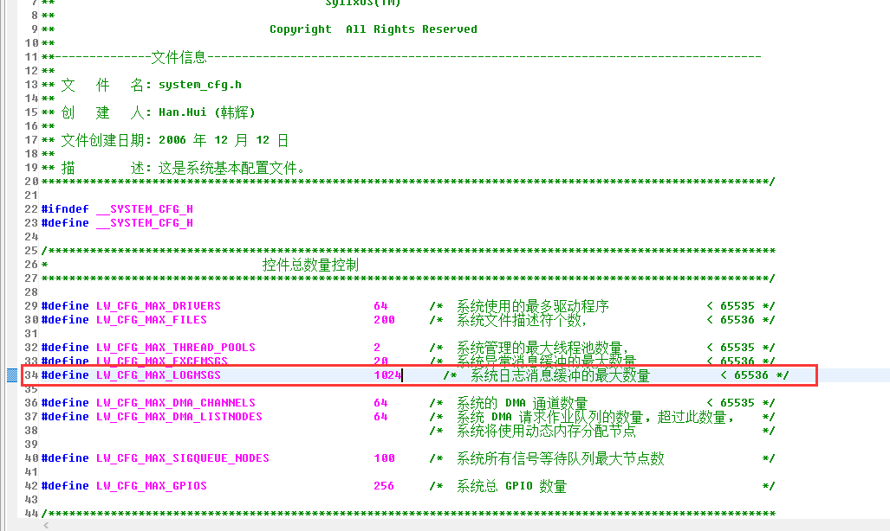

### **printk输出定向到文件**

本操作主要用于x86平台驱动调试，因为x86平台主板一般没有串口输出，printk的信息是输出到屏幕的，当有大量调试信息时，通过屏幕不能查看完整的调试信息，这时可以将printk的信息输出到文件中，然后查看：

```
int log_init (void)
{
        int fd;
        int width;
        fd_set fdset;

        fd = open("/apps/log1.txt", O_RDWR | O_CREAT | O_TRUNC);
        if (fd < 0) {
                printf("open /apps/log1.txt fail\n");
                return -1;
        }

        logFdGet(&width, &fdset);
        FD_SET(fd, &fdset);
        logFdSet(max(fd,width)+1, &fdset);

        return 0;
}
```

只要在驱动初始化的时候调用上面的函数，就可以将调试信息记录到log1.txt中。本方法在API手册第17章有具体的描述。

### **printk输出到网络终端**

- 先用telnet登陆到系统
- 输入files命令查看当前系统打开的文件描述符：

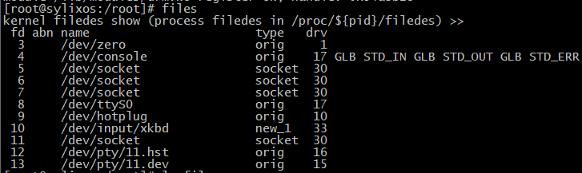

- 查看/dev/pty/xx.hst对应的fd，如上图中是12
- 输入logfileadd 12
- 这样再驱动中使用printk输出的信息就会同步输出到网络终端上

### 环境变量设置和删除

设置变量：

- 在命令行输入“变量名=变量值”即可
- 执行varsave

删除变量：

- 输入“vardel 变量名”
- 执行varsave

### 打印栈回溯

在程序调试时，有时候会想打印当前函数的调用关系，则可以在程序中加入如下语句打印栈回溯：

```
kill(getpid(),47);
```

### **启动时添加身份验证**

SylxiOS在网络telnet登录时会需要身份验证，在串口终端和x86平台的console终端默认是不需要身份验证的，如果需要身份验证功能，则修改bsp中user/main.c的如下代码:

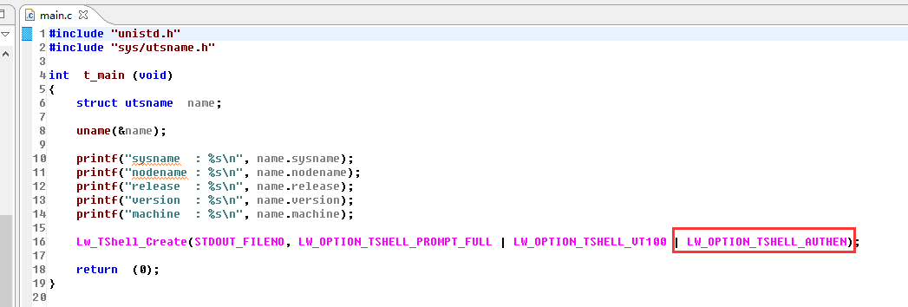

在创建shell的参数中添加LW_OPTION_TSHELL_AUTHEN选项，这样在启动时会要求输入用户名和密码验证，但是这样只有一次输入的机会，如果输入错误需要重新验证身份的话，需要再添加LW_OPTION_TSHELL_LOOPLOGIN选项，如下:

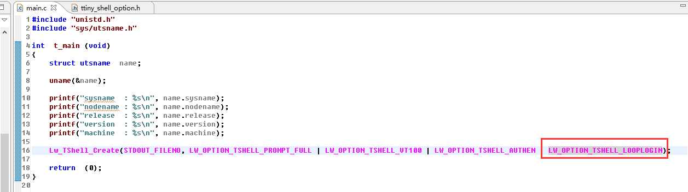

### 使用SylixOS Unit Test工程

这个工程一般在移植中间件自带的测试用例中用到，中间件自带的测试程序一般是n多个测试程序测试中间件中某一个模块或者功能，这些测试程序大多是一个源文件对应一个测试程序，而且编译参数相同。像这样的测试程序就可以通过SylixOS Unit Test工程一次性的编译出来，否则就得自己建立一个app工程，然后手动编写n个makefile，通过SylixOS Unit Test工程可以避免这些繁琐的步骤。

#### 新建SylixOS Unit Test工程

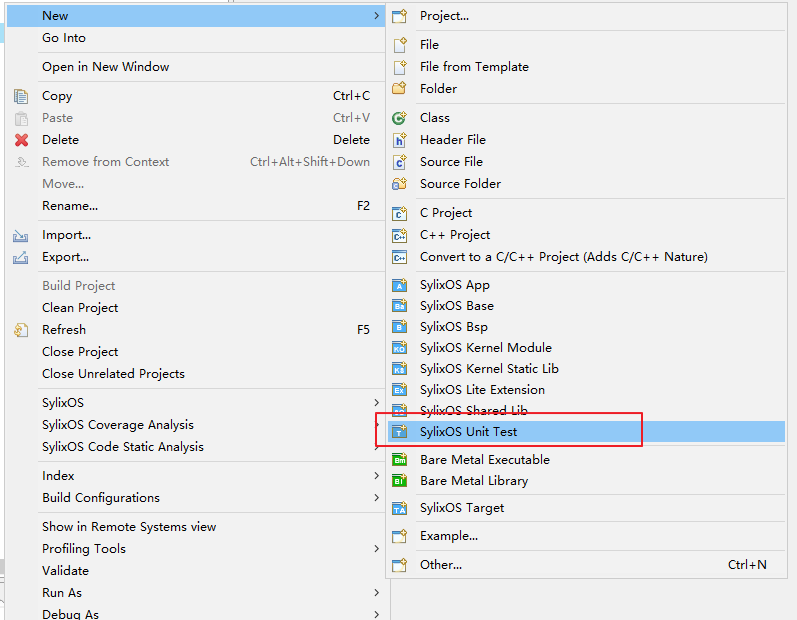

#### 将要编译的源文件都放入unit-test目录下：

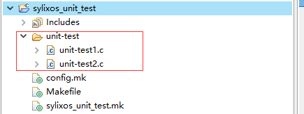

#### 编译生成可执行程序：

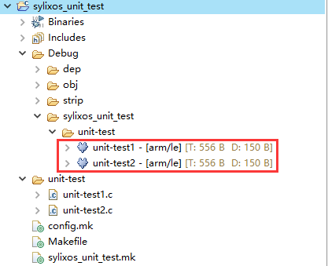

### 自动运行测试用例

在移植中间件时，当有几十个测试程序需要运行时，一个一个运行无疑是效率比较低的方式，这里介绍一种自动化运行n多测试程序的方法。

#### 复制自动化测试程序源码

创建base时选中libffi库，在testsuit目录下有一个run_test_suite.c文件，这就是自动化测试程序源码，如下：

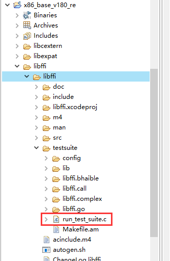

#### 新建工程并编译源码

新建一个app工程，编译run_test_suite.c文件：

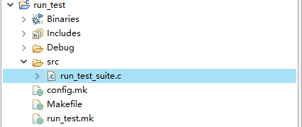

#### 上传文件

将编译后的run_test_suite程序上传到目标机/usr/bin目录下：

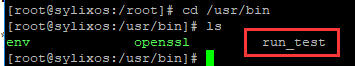

#### 查看用法

查看run_test_suite程序用法：

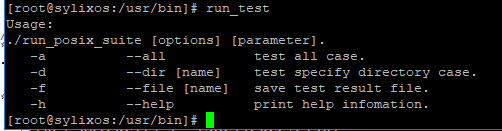

可以看出run_test_suite程序可以自动运行某个目录下的所有程序，包括目录下的子目录下的程序；也可以运行指定目录中的程序。

#### 用例

在/apps/sylixos_unit_test/sylixos_unit_test/unit-test目录下有两个测试程序，unit-test1和unit-test2：

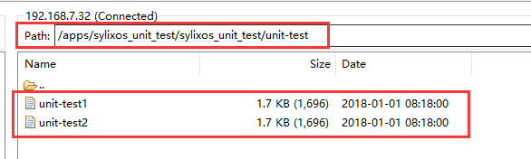

进入/apps/sylixos_unit_test/目录下，运行run_test_suite程序，即可自动运行unit-test1和unit-test2两个程序，如下：

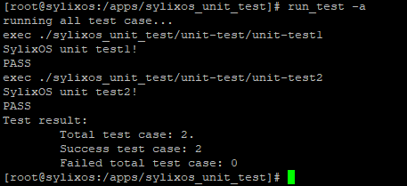

可以看出，输出信息中可以看出每个测试程序是否运行成功，最后也有运行结果的统计。

### 静态库链接顺序问题

有时候程序编译会有静态库依赖关系的问题，比如A静态库依赖B静态库，那么在makefile中的库依赖选项那里，被依赖的库应该放在右边，比如-lA -lB。

看如下测试代码：

liba的代码：

```
#include <stdio.h>

void libb_func (void);

void liba_func (void)
{
    printf("liba_func call!\n");
    libb_func();
}
```

libb的代码：

```
#include <stdio.h>

void libb_func (void)
{
    printf("libb_func call!\n");
}
```

APP的代码：

```
#include <stdio.h>

void liba_func (void);

int main (int argc, char **argv)
{
    printf("Hello SylixOS!\n");

    liba_func();

    return  (0);
}
```

#### makefile中libb放在左边

```
#*********************************************************************************************************
# Depend library (eg. LOCAL_DEPEND_LIB := -la LOCAL_DEPEND_LIB_PATH := -L"Your library search path")
#*********************************************************************************************************
LOCAL_DEPEND_LIB :=  \
-lb -la
LOCAL_DEPEND_LIB_PATH :=  \
-L"lib/" \
```

编译，运行，结果如下：


#### makefile中libb放在右边

```
#*********************************************************************************************************
# Depend library (eg. LOCAL_DEPEND_LIB := -la LOCAL_DEPEND_LIB_PATH := -L"Your library search path")
#*********************************************************************************************************
LOCAL_DEPEND_LIB :=  \
-la -lb
LOCAL_DEPEND_LIB_PATH :=  \
-L"lib/" \
```

编译，运行，结果如下：


### **添加自定义shell命令**

```
int my_func(int argc, char **argv)
{
    ...
}

API_TShellKeywordAdd("myfunc", (PCOMMAND_START_ROUTINE)my_func);
```

### **Qt4程序指定fb运行**

```
./app -qws -display "sylixosfb:/dev/fbx" &
```

其中fbx可以为fb0、fb1等。

### **强绑核(只允许一个线程运行在某核上)**

编程：

```
LW_CLASS_CPUSET  cpuset;
LW_CPU_ZERO(&cpuset);
LW_CPU_SET(3, &cpuset);
API_ThreadSetAffinity(API_ThreadIdSelf(), sizeof(LW_CLASS_CPUSET), &cpuset);
```

3表示想绑定的cpu核心编号，从1开始。

设置shell命令：

```
couaffinity 3 1
```

3表示想绑定的cpu核心编号，1表示启用强绑定功能，0表示关闭强绑定功能。

经过以上两步操作，3核上就只有一个线程运行了。