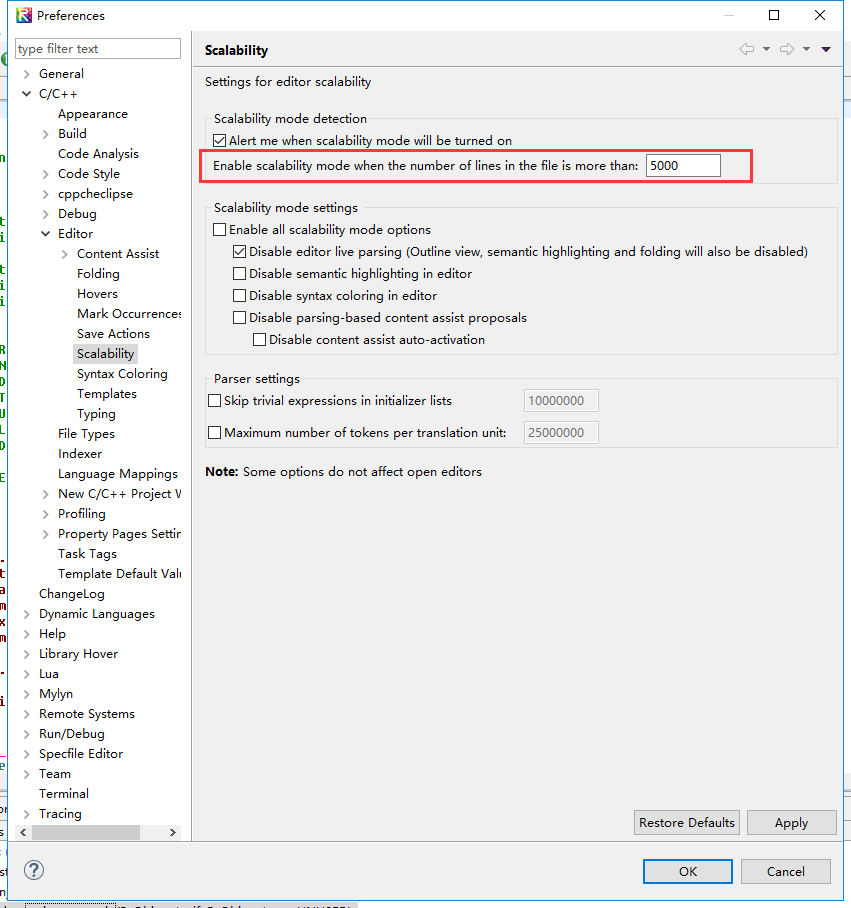
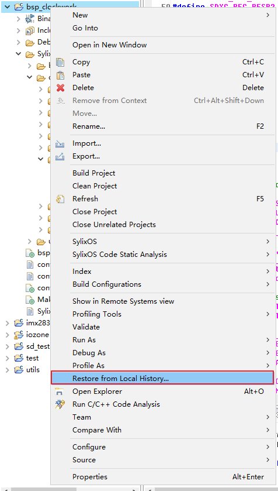

[TOC]


# SylixOS系统分析与使用

## SylixOS编程知识点

> 主要记录一些驱动开发或者应用开发中比较重要的知识点，不定期更新。

### 串口缓冲区大小设置

在创建串口设备时，一般使用的是下面这个接口：

```
INT  API_TtyDevCreate (PCHAR     pcName,
                       SIO_CHAN *psiochan,
                       size_t    stRdBufSize,
                       size_t    stWrtBufSize)
```

最后两个参数stRdBufSize和stWrtBufSize分别是输入缓冲区大小和输出缓冲区大小，这两个数值建议设置大点，否则在大量数据传输时缓冲区中未被处理的数据会被新数据覆盖，从而导致异常。

i.MX6Q bsp中设置的是256字节，实际工程中如果256字节不够的话，可以设置为512或者1024。

### 使用**_DebugFormat 打印64位数据**

应使用 %qd 进行64位数据的打印。

### **SylixOS下某个shell命令对应的接口函数位置**

所有shell命令对应的接口可以在__tshellSysCmdInit函数中查找到。

###  **SylixOS下查看系统对象资源使用情况**

使用如下命令查看：

```
cat /proc/kernel/objects
```

通过这种方法可以辅助查找程序是否有申请系统资源但是没有释放之类问题。

```
[root@sylixos:/root]#  cat /proc/kernel/objects
object      total    used     max-used
event       5000     238      240
eventset    500      0        0
heap        52       1        1
msgqueue    500      8        8
partition   50       8        8
rms         32       0        0
thread      500      31       33
timer       50       2        2
dpma        2        0        0
threadpool  2        0        0
```

### **增加系统日志消息缓冲的最大数量**

在使用printk的时候，经常会碰到明明加了打印语句，但是终端上却并没有显示出来这种情况，原因是系统的缓冲有限，而打印语句又太多，从而导致后面的打印覆盖了前面的打印，造成打印丢失。

解决方法是修改base中的LW_CFG_MAX_LOGMSGS这个宏，系统默认的值是20（这是不是也太少了。。。。），其所在的文件路径为：libsylixos/SylixOS/config/system/system_cfg.h：


### **printk输出定向到文件**

本操作主要用于x86平台驱动调试，因为x86平台主板一般没有串口输出，printk的信息是输出到屏幕的，当有大量调试信息时，通过屏幕不能查看完整的调试信息，这时可以将printk的信息输出到文件中，然后查看：

```
int log_init (void)
{
        int fd;
        int width;
        fd_set fdset;

        fd = open("/apps/log1.txt", O_RDWR | O_CREAT | O_TRUNC);
        if (fd < 0) {
                printf("open /apps/log1.txt fail\n");
                return -1;
        }

        logFdGet(&width, &fdset);
        FD_SET(fd, &fdset);
        logFdSet(max(fd,width)+1, &fdset);

        return 0;
}
```

只要在驱动初始化的时候调用上面的函数，就可以将调试信息记录到log1.txt中。本方法在API手册第17章有具体的描述。

### **printk输出到网络终端**

- 先用telnet登陆到系统
- 输入files命令查看当前系统打开的文件描述符：


- 查看/dev/pty/xx.hst对应的fd，如上图中是12
- 输入logfileadd 12
- 这样再驱动中使用printk输出的信息就会同步输出到网络终端上

### 环境变量设置和删除

设置变量：

- 在命令行输入“变量名=变量值”即可
- 执行varsave

删除变量：

- 输入“vardel 变量名”
- 执行varsave

### 打印栈回溯

在程序调试时，有时候会想打印当前函数的调用关系，则可以在程序中加入如下语句打印栈回溯：

```
kill(getpid(),47);
```

### **启动时添加身份验证**

SylxiOS在网络telnet登录时会需要身份验证，在串口终端和x86平台的console终端默认是不需要身份验证的，如果需要身份验证功能，则修改bsp中user/main.c的如下代码:


在创建shell的参数中添加LW_OPTION_TSHELL_AUTHEN选项，这样在启动时会要求输入用户名和密码验证，但是这样只有一次输入的机会，如果输入错误需要重新验证身份的话，需要再添加LW_OPTION_TSHELL_LOOPLOGIN选项，如下:


### 使用SylixOS Unit Test工程

这个工程一般在移植中间件自带的测试用例中用到，中间件自带的测试程序一般是n多个测试程序测试中间件中某一个模块或者功能，这些测试程序大多是一个源文件对应一个测试程序，而且编译参数相同。像这样的测试程序就可以通过SylixOS Unit Test工程一次性的编译出来，否则就得自己建立一个app工程，然后手动编写n个makefile，通过SylixOS Unit Test工程可以避免这些繁琐的步骤。

#### 新建SylixOS Unit Test工程


#### 将要编译的源文件都放入unit-test目录下：


#### 编译生成可执行程序：


### 自动运行测试用例

在移植中间件时，当有几十个测试程序需要运行时，一个一个运行无疑是效率比较低的方式，这里介绍一种自动化运行n多测试程序的方法。

#### 复制自动化测试程序源码

创建base时选中libffi库，在testsuit目录下有一个run_test_suite.c文件，这就是自动化测试程序源码，如下：


#### 新建工程并编译源码

新建一个app工程，编译run_test_suite.c文件：


#### 上传文件

将编译后的run_test_suite程序上传到目标机/usr/bin目录下：


#### 查看用法

查看run_test_suite程序用法：


可以看出run_test_suite程序可以自动运行某个目录下的所有程序，包括目录下的子目录下的程序；也可以运行指定目录中的程序。

#### 用例

在/apps/sylixos_unit_test/sylixos_unit_test/unit-test目录下有两个测试程序，unit-test1和unit-test2：


进入/apps/sylixos_unit_test/目录下，运行run_test_suite程序，即可自动运行unit-test1和unit-test2两个程序，如下：


可以看出，输出信息中可以看出每个测试程序是否运行成功，最后也有运行结果的统计。

### 静态库链接顺序问题

有时候程序编译会有静态库依赖关系的问题，比如A静态库依赖B静态库，那么在makefile中的库依赖选项那里，被依赖的库应该放在右边，比如-lA -lB。

看如下测试代码：

liba的代码：

```
#include <stdio.h>

void libb_func (void);

void liba_func (void)
{
    printf("liba_func call!\n");
    libb_func();
}
```

libb的代码：

```
#include <stdio.h>

void libb_func (void)
{
    printf("libb_func call!\n");
}
```

APP的代码：

```
#include <stdio.h>

void liba_func (void);

int main (int argc, char **argv)
{
    printf("Hello SylixOS!\n");

    liba_func();

    return  (0);
}
```

#### makefile中libb放在左边

```
#*********************************************************************************************************
# Depend library (eg. LOCAL_DEPEND_LIB := -la LOCAL_DEPEND_LIB_PATH := -L"Your library search path")
#*********************************************************************************************************
LOCAL_DEPEND_LIB :=  \
-lb -la
LOCAL_DEPEND_LIB_PATH :=  \
-L"lib/" \
```

编译，运行，结果如下：


#### makefile中libb放在右边

```
#*********************************************************************************************************
# Depend library (eg. LOCAL_DEPEND_LIB := -la LOCAL_DEPEND_LIB_PATH := -L"Your library search path")
#*********************************************************************************************************
LOCAL_DEPEND_LIB :=  \
-la -lb
LOCAL_DEPEND_LIB_PATH :=  \
-L"lib/" \
```

编译，运行，结果如下：


### **添加自定义shell命令**

```
int my_func(int argc, char **argv)
{
    ...
}

API_TShellKeywordAdd("myfunc", (PCOMMAND_START_ROUTINE)my_func);
```

### **Qt4程序指定fb运行**

```
./app -qws -display "sylixosfb:/dev/fbx" &
```

其中fbx可以为fb0、fb1等。

### **强绑核(只允许一个线程运行在某核上)**

编程：

```
LW_CLASS_CPUSET  cpuset;
LW_CPU_ZERO(&cpuset);
LW_CPU_SET(3, &cpuset);
API_ThreadSetAffinity(API_ThreadIdSelf(), sizeof(LW_CLASS_CPUSET), &cpuset);
```

3表示想绑定的cpu核心编号，从1开始。

设置shell命令：

```
couaffinity 3 1
```

3表示想绑定的cpu核心编号，1表示启用强绑定功能，0表示关闭强绑定功能。

经过以上两步操作，3核上就只有一个线程运行了。

## SylixOS动态库的初始化和清理

参考以下博客：

https://blog.csdn.net/xy010902100449/article/details/47263049

https://blog.csdn.net/lixiangminghate/article/details/44300839

###  动态库示例代码

```
#include <SylixOS.h>

void __attribute__((constructor)) brfore_main(void); //在main函数之前被调用
void after_main (void);

void brfore_main (void)
{
    printf("brfore_main call!\n");

    atexit((void (*)(void)) after_main); //注册程序结束时调用的函数
}

void lib_func (void)
{
    printf("lib_func call!\n");
}

void after_main (void)
{
    printf("after_main call!\n");
}
```

### 测试程序示例代码

```
#include <stdio.h>

void lib_func (void);

int main (int argc, char **argv)
{
    printf("Hello SylixOS!\n");

    lib_func();

    return  (0);
}
```

###  运行结果

```
[root@sylixos:/root]# cd /apps/test/
[root@sylixos:/apps/test]# ./test
brfore_main call!
Hello SylixOS!
lib_func call!
after_main call!
[root@sylixos:/apps/test]#
```

# MMU、TLB和CACHE之间不得不说的事

> MMU、TLB和CACHE是计算机系统中经常用到同时又经常被忽视的部件，网上关于MMU的资料绝大部分是介绍了其页表的映射方法，但是并没有或者很少介绍计算机系统引入MMU的原因。本帖介绍了引入MMU的两个原因，同时介绍了ARM体系的Cache和TLB及其基本操作。

### MMU

#### **MMU诞生原因之一：解决内存访问安全问题**

在很久之前，CPU访问内存的方式是直接通过地址总线来访问内存，CPU发到地址总线上的信号就叫做物理地址。以intel的16位处理器8086为例，8086共有20根地址线，能访问1MB的内存，是直接通过物理地址来访问内存：


由于程序能直接访问物理内存，那么只要知道了物理内存基址和大小，就可以访问到整个内存空间，这样就带来了安全问题，比如下面的例子：

系统启动时OS被加载到内存中运行：


OS加载了一个程序到内存中运行：


进程1只有一个功能，就是从内存基址开始，将内存的值都改写成0，这样系统内核就被破坏，整个系统宕机：


通过上面简单的例子可以看出，直接使用物理地址访问内存是多么的危险。产生这种危害的主要原因就是没有对访问的内存的属性做出规定和检查，也就是某个内存段的可读、可写和可执行问题。

#### **MMU诞生原因之二：解决地址映射问题**

这个以ARM中的中断向量表为例，在ARM体系中，地址空间分配一般如下：


在0地址处的一般是CPU内部的内存iRAM或者是外部的Norflash，而外接的内存地址一般都不是从0地址开始，比如2440的内存基址就是从0x30000000。在ARM体系中，当发生中断后，CPU自动跳转到存放在0地址处的中断向量表中去执行（假设不使用高内存中断向量表）：


但是，一旦引入了操作系统，一切都开始变得复杂起来。操作系统的内核是运行在内存空间的，内核也有自己的中断向量表，而且这个中断向量表是在内存中的，而不是在0地址处的iRAM或者是外部的Norflash中：


按照操作系统设计者的意图，发生中断后，CPU应该跳转到内存中的中断向量表中去执行。但是，理想很美好，现实很残酷，CPU可没有那么聪明，当发生中断后，它还是跳转到0地址处的中断向量表去执行，这样就背离了设计者原本的意图。

CPU无论进行取指令还是读写数据，都是对内存进行访问操作。当发生中断后，假设CPU跳转到0地址处执行，CPU需要访问0地址以取出指令。如果有这样一种硬件，能将CPU访问0地址改变成访问内中的中断向量表地址，假设内存中的中断向量表的地址是0x30001000，也就是将0x00000000地址映射为0x30001000地址，就能解决上面的问题了。

#### MMU的诞生

为了解决内存访问安全问题和地址映射的需求，迫切地需要添加这样一个模块：

- 拦截CPU发出的地址信号，然后对地址做一些属性检查。
- 将CPU发出的地址按照某种规则转换成另一个地址，然后通过地址总线访问内存。

这样的模块就叫做MMU(Memory Management Unit)，同时将CPU和MMU之间的地址信号叫做虚拟地址，将MMU和内存之间的地址信号叫做物理地址。


#### 内存描述符

MMU通过内存描述符来描述一段内存区域的属性和虚实地址映射关系。

- 内存属性表示物理内存段可读、可写、可执行、是否存在这几种属性，其中是否存在是为了支持虚拟存储而提出的一个属性。如果存在，则可以进行属性检查、地址变换；如果不存在，则产生一个异常。
- 虚实地址映射描述了虚拟地址和物理地址之间的转换关系。


那么内存描述符存放在哪呢？首先不可能在MMU内部放置存储空间用于存放内存描述符，因为内存描述符数量很多，而像寄存器这种存储介质单位造价又很高，从成本上考虑必须要另寻存放空间。容量足够造价又低的存储介质是什么呢？当然是内存啦。想想是不是很有趣呢，用来描述内存的描述符它自己也在内存里。


### CACHE

世上本没有Cache，内存的速度跟不上了，也就有了Cache。

在计算机系统中，CPU的速度比内存的速度快很多，当CPU从内存中取数据或者指令时，通常需要几十、几百个时钟周期，这大大地影响了整个系统的性能。为了解决内存速度低下的问题，设计者们在CPU的内部放置了一些SRAM用于缓存数据和指令，来提高CPU访问指令和数据的速度。这些SRAM就叫做Cache（缓存）。

以下讲的Cache都是基于ARM体系的。

#### Cache的两种写方式

- 写通方式。每次CPU修改了Cache中内容时，Cache同时更新相应内存中的内容。
- 写回方式。CPU修改Cache内容后，Cache并不会立即更新内存中的内容，而是等到某种原因需要覆盖Cache中的数据，Cache才会将之前修改的数据同步到内存中相应的位置。

#### 添加内存描述符内容

当引入了Cache功能之后，我们的内存描述符就要做一点点改动了。主要就是在描述符中添加了另外2个功能：

- 是否使用Cache功能。这不是指使能/关闭Cache功能，而是指“想不想用”Cache功能。因为需要对每个描述符描述的内存段分别进行Cache使用与否控制，所以需要在描述符中添加这一功能。
- Cache的写类型。这个就是标明描述符描述的内存段使用的Cache是写通类型还是回写类型的。


### TLB

当使用MMU后，带来了一个新的问题：在没有使用MMU之前，从内存中取指令和数据只需访问一次内存即可。但是使用MMU之后，就需要两次了，第一次访问内存是为了获得内存描述符，第二次访问内存才是真正的获取指令或者数据。本来一次就能获得想要的东西现在变成两次才能得到，而且内存访问本来就慢，现在还要访问两次，岂不是降低了系统的性能？答案是：没错，确实是这样。

#### **TLB的引入**

解决方法就是在MMU内部使用Cache，将最近使用的内存描述符缓存在Cache中，这样MMU就不需要去内存中获取内存描述符了。这个MMU中的Cache不同于指令和数据Cache，它有一个专门的名字，叫TLB(Translation Lookaside Buffers)，简称为快表。

#### TLB的基本操作

失效TLB，TLB的操作中最常见的一种，就是将TLB中的内容丢弃，以重新从内存中缓存新的内存描述符，这点是跟指令和数据Cache一样的。指令TLB和数据TLB都有这个操作。

## 揭开SylixOS VMM子系统的神秘面纱

> SylixOS的VMM子系统共有三个功能：物理地址的管理、虚拟地址的管理、映射虚拟地址和物理地址。SylixOS下对物理地址空间和虚拟地址空间是通过页面来管理，单个页面的大小是4KB。

### **SylixOS对物理内存的划分**

SylixOS将物理内存划分了4个区域，分别是：内核代码区、内核数据区、DMA内存区、APP内存区：


在内核、驱动中所申请的内存都是在内核数据区分配，内核数据区有着一套自己的内存管理方法。VMM子系统管理的内存区域是DMA内存区和APP内存区：


### **VMM子系统一些数据结构**

#### 页面控制块

VMM子系统对已分配的物理内存和虚拟内存、已经释放的物理内存和虚拟内存采用LW_VMM_PAGE数据结构来管理，我们称之为页面控制块。页面控制块中记录了物理或者虚拟内存的地址和页面个数，还有其他的一些属性：


#### 空闲页面管理块

VMM子系统对可分配物理或者虚拟内存采用LW_VMM_ZONE数据结构来管理，我们称之为空闲页面管理块。空闲页面管理块中记录了可分配页面数量和已经释放的页面控制块的散列表。


#### **已释放页面控制块散列表**

在内存空间多次的分配-释放后，会产生许多不同大小的页面控制块，为了有效的管理，将被回收的页面控制块以页面数量为关键参数进行HASH散列放置。


#### **已分配页面控制块散列表(地址反查表)**

已经分配的连续页面采用LW_VMM_AREA数据结构来管理。释放页面时，为了从页面地址快速定位到对应的页面控制块，SylixOS首先以该连续页面的起始地址为关键参数进行HASH散列，然后将具有相同散列值的页面控制块以红黑树数据结构进行管理，提高了页面回收的时间确定性。


#### **页面控制块邻居链表**

SylixOS中的页面控制块邻居链表是在内存分配过程中形成的。申请内存时，根据需要分配的页面数量，快速定位到已释放页面控制块散列表内具有相同散列值的链表头，在遍历以找到最佳大小的页面控制块。如果找到的最佳大小的页面控制块所表示的页面数量比需要分配的多，则分裂该页面，并将剩余的空闲页面控制块插入到已释放页面控制块散列表内。同时将刚刚分裂的两个页面控制块形成邻居链表，表示这两个控制块是分裂得来的。


### VMM内存回收算法

VMM回收页面控制块时，会检查这个页面控制块的邻居链表中左右相邻的页面控制块是否是空闲的。如果是空闲的，就需要将这控制块合成1个，以减少多余控制块对内存的占用，这种操作叫做聚合。

假设经过多次分配回收过后，现存在这样一个页面控制块邻居链表：


#### 左右都不聚合

释放控制块3或者控制块4都属于这种情况，这里假设释放控制块4;


#### 左聚合

左聚合情况，在3.1中的情景下，释放控制块2属于这种情况：


#### 右聚合

右聚合情况，在3.1中的情景下，释放控制块3属于这种情况：


#### 左右都聚合

在3.1或者3.2情景下，再回收控制块都属于这种情况。这时会先执行左聚合，然后执行右聚合。以2.2情景为例，先左聚合：


再右聚合：


### VMM子系统**对物理内存的管理**

#### **空闲物理页面控制块池**

系统初始化的时候根据DMA内存区和APP内存区总的物理页面数量预先分配了相应数量的物理页面控制块，并将这些物理页面控制块形成单向链表。物理内存除了DMA内存区，绝大多数都是进程使用，进程很多页面都是在缺页中断分配物理内存。初始化时预分配控制块是保障缺页中断执行时间相对较短，确定性好，保证控制块一定比物理页面的数量多，只要物理页面存在就不会出现控制块不够用的情况，而且分配控制块的时间是一个确定时间，实时系统的确定性非常关键，用空间换取时间确定性。


#### **空闲物理页面管理块**

VMM子系统最多有8个空闲物理页面管理块，常用的有2个，分别用于管理可分配的DMA内存区和APP内存区内存。管理DMA内存区的管理块一般是_G_vmzonePhysical[0]，管理APP内存区的管理块一般是_G_vmzonePhysical[1]。

#### **物理地址反查表**

VMM子系统最多有8个物理地址反查表，常用的有2个，分别用于反查DMA内存区和APP内存区内存地址。反查DMA内存区的反查表一般是_G_vmareaZoneSpace[0]，反查APP内存区的反查表一般是_G_vmareaZoneSpace[1]。

#### **回收物理页面控制块**

- 只有发生聚合操作时，才会有一个物理页面控制块被放回空闲物理页面控制块池中
- 不管是左聚合还是右聚合，都是保留左边的控制块并更新，右边的控制块被回收到控制块池中
- 只要释放一个控制块管理的内存空间时，空闲的控制块会被链入HASH空闲链表中

#### **使用注意**

在申请到一个空闲的物理页面控制块后，一般都需要将这个物理页面控制块插入到物理地址反查表中，但是也有例外，在申请逻辑地址连续，物理地址可能不连续的内存时，就不需要将物理页面控制块插入到物理地址反查表中，原因会在下一小节讲明。

### **VMM子系统对虚拟内存的管理**

VMM子系统主要管理2类虚拟内存：

- APP虚拟内存，这部分内存被SylixOS中所有动态加载的对象使用。比如内核模块，动态链接库，应用程序，这些对象所使用的内存都来自APP区虚拟内存。对象加载时，只会获得虚拟页面，只有真正使用时，才会在缺页中断处理中分配物理页面。
- IO Remap区虚拟内存，外设IO寄存器空间重新映射后的虚拟地址空间都来自这部分虚拟内存。

VMM子系统对物理内存和虚拟内存的映射关系如下：


由图中的映射可以看出：

- 内核代码区、内核数据区、DMA内存区的虚拟地址和物理地址是一样的，也就是平板映射。
- 中断向量表被映射了2次，因为在arm体系中，当发生中断和异常时，cpu自动跳转到0x00000000地址去执行，所以需要将中断向量表再次映射到0地址去。
- 外设寄存器地址空间可以被平板映射，也可以再次被映射到IO映射区。

其中APP虚拟内存区大小一般在1GB~2GB之间，IO映射区大小一般是几百MB。

#### **空闲虚拟页面控制块的分配**

VMM子系统对虚拟页面控制块的分配不同于物理页面控制块的分配方法，虚拟页面控制块是“用时分配”，也就是用到的时候分配一个。

##### **物理页面控制块散列表**

这个表只有在申请逻辑地址连续，物理地址可能不连续的内存时才会用到。这时虚拟页面控制块只有一个，但是物理页面控制块可能有多个，于是将这多个物理页面控制块散列在物理页面控制块散列表中。这样在回收虚拟内存时，可以根据此表找到所有的分配出去的物理内存页面控制块，然后分别回收物理内存。这也就解释了5.5小节中的疑问，为什么不需要将物理页面控制块插入到物理地址反查表中，因为已经可以通过物理页面控制块散列表找到相应的物理页面控制块，所以就需要插入到物理地址反查表中。


物理页面控制块散列表的内存空间是紧接着虚拟页面控制块的，其地址保存在虚拟页面控制块中。

#### **空闲虚拟页面管理块**

  VMM子系统最多有9个空闲虚拟页面管理块，常用的有2个，分别用于管理可分配的APP虚拟内存区和IO映射虚拟内存区内存。管理APP虚拟内存区的管理块一般是_G_vmzoneVirApp[0]，并且最多有8个这样的区域。管理IO映射虚拟内存区的管理块是_G_vmzoneVirDev，只有1个。

#### **虚拟地址反查表**

VMM子系统只有一个虚拟地址反查表，用于反查APP虚拟内存区和IO映射虚拟内存区内存。记录在mmuctxGlobal中。

#### **回收虚拟页面控制块**

- 只有发生聚合操作时，才会有一个虚拟页面控制块被删除
- 不管是左聚合还是右聚合，都是保留左边的控制块并更新，右边的控制块被回收到控制块池中
- 只要释放一个控制块管理的内存空间时，空闲的控制块会被链入HASH空闲链表中

### **VMM子系统映射物理内存和虚拟内存**

SylixOS下采用的是2级页表映射，也就是最小映射单位是4KB。所谓的映射就是在已知物理地址和虚拟地址和内存属性的情况下，构造好相应的页目录项和页表项，二级页表如何映射网上的资料很多，这里不再赘述。

#### **预分配页目录和页表内存空间**

SylixOS对页目录和页表所占的内存区域是使用两个定长内存分区来管理的。页目录只申请一次，建立映射时，如果发现对应的页表不存在，则从页目录的定长分区中分配一个定长内存出来，然后填写好相应的页目录项和页表项。


MM中用于管理的数据结构，如页面控制块，空闲页面管理块等等，所在的内存区域都是内核数据区。

## SylixOS高精度时钟分析

### **tick工作原理简介**

其实这应该说“定时器工作原理简介”更合适些，1个系统tick就是一个定时器硬件中断，定时器的工作原理很简单，就是内部有一个递减的计数器，当减到0时产生一个中断：


假设定时器模块的输入频率是1MHz，系统定义的1S内tick数是100，也就是100Hz，那么可以计算出递减计数器要设置的值为1MHz/100Hz=10000。可以看出递减计数器相当于一个分频器，输入端每来一个脉冲，其值就减去1，当减到0时产生一个中断，同时其值自动重载成10000，如此循环下去。

### **系统获取时间操作**

系统获取时间相关接口是基于tick来工作的。但是这是有误差的：


虚线表示一个tick中断还未产生，如果此时来获取时间，获取到的时间只是之前tick累计的时间。假设tick中断产生时刻和获取时间那一时刻之间的跨度是4ms，那么获取的时间就有4ms的误差，高精度时钟就是为了消除这种误差而诞生的。

### **高精度时钟原理**

#### 基本原理

我们知道，上述误差产生的根本原因是没有将tick中断产生时刻和获取时间那一时刻之间的跨度更新到时间里去，如果我们能计算出这段时间并加到时间里去不就行了吗？看到没有，so easy！

结合第1小节和第2小节中的图，分析如下:

- 1个tick时间其实等价于递减计数器的初始值，假设是10000，也就是说递减10000次相当于过了一个tick时间
- 我们用1000 * 1000 * 1000 / 10000得到递减一次的时间，单位是ns
- 我们用计数器初始值减去获取时间那一刻计数器中的值，就得到了获取时间时刻计数器已经递减的次数
- 拿递减一次的时间 * 递减的次数 = tick中断产生时刻和获取时间那一时刻之间的时间跨度

#### 特殊情况

当系统是多核时，系统产生了一个由cpu0来处理的tick中断，当cpu0还没有更新整个系统的tick数时，这时cpu1来获取时间，按照前面的方法计算后还要加上一个tick的时间才是正确的。

### 代码展示

```
/*********************************************************************************************************
** 函数名称: bspTickHighResolution
** 功能描述: 修正从最近一次 tick 到当前的精确时间.
** 输　入  : ptv       需要修正的时间
** 输　出  : NONE
** 全局变量:
** 调用模块:
*********************************************************************************************************/
VOID  bspTickHighResolution (struct timespec *ptv)
{
    REGISTER UINT32  uiCntCur, uiDone;

    uiCntCur = (UINT32)timerGetCnt(4);
    uiDone   = GuiFullCnt - uiCntCur;

    /*
     *  检查是否有 TICK 中断请求
     */
    if (rSRCPND & BIT_TIMER4) {
        /*
         *  这里由于 TICK 没有及时更新, 所以需要重新获取并且加上一个 TICK 的时间
         */
        uiCntCur = (UINT32)timerGetCnt(4);
        uiDone   = GuiFullCnt - uiCntCur;

        if (uiCntCur != 0) {
            uiDone   += GuiFullCnt;
        }
    }

    ptv->tv_nsec += (LONG)((Gui64NSecPerCnt7 * uiDone) >> 7);
    if (ptv->tv_nsec >= 1000000000) {
        ptv->tv_nsec -= 1000000000;
        ptv->tv_sec++;
    }
}
```

- GuiFullCnt表示递减计数器的初始值，也就是产生1个tick时间的计数值；Gui64NSecPerCnt7表示递减一次的时间，但是这个时间被扩大了128倍，目的是为了提高计算精度。
- uiDone表示获取时间时刻计数器已经递减的次数，uiCntCur表示获取时间时刻计数器当前值
- if (rSRCPND & BIT_TIMER4)用于3.2小节特殊情况的判断，条件成立表示系统的tick数还没来得及更新，不成立表示系统的tick数已经被更新
- 当uiCntCur=0时，表示tick中断刚刚产生，这时uiDone就已经代表一个tick的计数值，所以就无需再加上一个tick的计数值了
- 最后将修正后的时间赋值给tv_nsec成员

## RealEvo-IDE使用小技巧

### 显示特殊字符

#### 快捷按钮


#### 编辑要显示的特殊字符


### 将tab键换成4个空格


### 在固定的列显示竖线


### 按列编辑


### 解决单个文件无法自动跳转

IDE首次编辑大于5000行（默认）代码以上的文件时，会提示为了提高性能，已进入Scalabilitys模式，将关闭代码定义跳转功能以提高性能：


这时我们点击yes，进入到设置界面：



将默认的5000改大一点就行，比如我改成了500000......，然后重新打开源代码文件，就会发现代码定义跳转可以正常使用了：


### 恢复IDE默认的窗口布局


### IDE恢复工程文件

在实际开发中，由于不小心误删除文件或者修改了源文件而没有保存原始文件，但是又想用原始的文件，这时可以通过IDE的历史保存功能恢复原始文件，首先右击工程，选择restore from local history:



左侧列有可以恢复的文件，右侧列有不同的时间点，根据这两个选择想要恢复某个时间点的文件：


## SylixOS之BSD红黑树

### 设计数据结构

使用红黑树的主要目的是为了加速查找数据，我们先来看一看使用链表而不是红黑树方式组织数据时该如何设计数据结构。

#### 平常的链表方式

我们能想到一种很简单的数据结构：

```
struct xxx_object {
    struct list_head head;
    int key;
}
```

通过xxx_object中的head成员将各个xxx_object链成链表，查找的时候遍历链表，通过对比key值来找到对应的数据。

#### BSD红黑树方式

使用BSD红黑树时一般需要设计两种数据结构，A数据结构需要包含红黑树的根结点，B数据结构需要包含红黑树的普通结点。

##### 定义红黑树root结点

BSD提供了一个RB_HEAD的宏来定义一个root结点，所以我们的A数据结构设计如下：

```
struct xxx_device {
    /*
     *  some other members
     */

    RB_HEAD(bsd_rb_name, xxx_object) rb_root;
};
```

RB_HEAD宏有两个成员，解释如下：

- bsd_rb_name：表示红黑树的名字，红黑树插入和删除操作都需要这个名字。
- xxx_object：包含红黑树普通结点的数据结构的类型，也就是B数据结构的类型。

这样xxx_device中的rb_root就表示红黑树的root结点了。

##### **定义红黑树普通结点**

BSD提供了一个RB_ENTRY的宏来定义一个普通结点，所以我们的B数据结构设计如下：

```
struct xxx_object {
    /*
     *  some other members
     */
    struct xxx_device   *dev;
    int                  size;

    RB_ENTRY(xxx_object) rb_node;
};
```

RB_ENTRY宏只有一个成员，就是B数据结构的类型，xxx_object中的size其实就是查找时用的key。

那么这里有个疑问，如果两个xxx_object的key值一样呢，后插入的xxx_object会覆盖之前插入的吗？实际情况是，如果key值一样，后一个数据根本不会被插入到红黑树中。所以在插入的时候保证每个xxx_object的size都不一样，那么在查找的时候就能找出来。

### 使用插入和删除

#### 定义插入和删除等函数

BSD提供了一个RB_GENERATE宏用于生成红黑树插入、删除等功能函数，我们可以在c源文件的最开始放置如下代码：

```
RB_GENERATE(bsd_rb_name, xxx_object, rb_node, xxx_object_cmp_rb_tree_items);
```

RB_GENERATE宏四个成员的意思如下：

- bsd_rb_name：红黑树的名字。
- xxx_object：包含红黑树普通结点的数据结构类型，也就是B数据结构类型。
- rb_node：在xxx_object中包含的红黑树普通结点成员的名字。
- xxx_object_cmp_rb_tree_items：这是一个红黑树插入时用到的回调函数，用于定义插入时的规则。

xxx_object_cmp_rb_tree_items函数声明如下：

```
int xxx_object_cmp_rb_tree_items(struct xxx_object *node, struct xxx_object *father_node);
```

node表示要操作的数据结点，father_node表示被插入的数据结点，当node结点插入到father_node结点后，就形成了父子结点的关系。
 这个回调函数可以返回三种数值，分别如下：

- 返回值<0，表示将node结点和father_node的左结点继续比较。
- 返回值>0，表示将node结点和father_node的右结点继续比较。
- 返回值=0，表示比较结束。

根据这个说明，我们设计如下规则：

- 如果node的size比father_node的size小，返回-1。
- 如果node的size比father_node的size大，返回1。
- 如果node的size和father_node的size相同，返回0。

根据如上的规则，xxx_object_cmp_rb_tree_items的代码如下：

```
int xxx_object_cmp_rb_tree_items(struct xxx_object *node, struct xxx_object *father_node)
{
    //将小的往左节点操作
    if (node->size < father_node->size) {
        return (-1);
    //将大的往右节点操作
    } else if (node->size > father_node->size) {
        return (1);
    //如果相等则不操作
    } else {
        return (0);
    }
}
```

这样插入完毕后，对于任意一个结点而言，比结点小的都在左边，比结点大的都在右边。

#### **初始化红黑树root结点**

BSD提供了RB_INIT宏用于初始化root结点，对应的代码如下：

```
void xxx_device_init (struct xxx_device *device)
{
    RB_INIT(&device->rb_root);
}
```

这个宏很简单，不做阐述。

#### **数据插入红黑树**

BSD提供了RB_INSERT宏用于将数据插入到红黑树中，对应的代码如下：

```
void xxx_object_insert_rb(struct xxx_object *obj)
{
    struct xxx_device *dev = obj->dev;

    RB_INSERT(bsd_rb_name, &dev->rb_root, obj);
}
```

RB_INSERT宏的三个成员说明如下：

- bsd_rb_name：红黑树的名字。
- &dev->rb_root：红黑树root结点地址。
- obj：要插入的包含红黑树普通结点的数据。

#### 数据从红黑树中删除

BSD提供了RB_REMOVE宏用于将数据从红黑树中删除，对应的代码如下：

```
void xxx_object_remove_rb(struct xxx_object *obj)
{
    struct xxx_device *dev = obj->dev;

    RB_REMOVE(bsd_rb_name, &dev->rb_root, obj);
}
```

RB_REMOVE宏的三个成员和RB_INSERT宏的三个成员是一样的。

### 查找数据

```
struct xxx_object *xxx_object_lookup_rb (struct xxx_device *device, int size)
{
    int cur_size;
    struct xxx_object *bo;
    struct xxx_object *best_bo = NULL;

    bo = RB_ROOT(&device->rb_root);
    while (bo != NULL) {
        cur_size = bo->size;
        //如果要找的比当前的大，则搜索右节点
        if (size > cur_size) {
            bo = RB_RIGHT(bo, rb_node);
        //如果要找的比当前的小，则搜索左节点
        } else if (size < cur_size) {
            bo = RB_LEFT(bo, rb_node);
        //如果大小相等，则表示找到
        } else {
            best_bo = bo;
            break;
        }
    }

    return best_bo;
}
```

对于其中的几个宏的说明如下：

RB_ROOT、RB_RIGHT、RB_LEFT这三个宏都是通过红黑树结点来获取到实际的数据。

- RB_ROOT：通过root结点获取到第一个包含红黑树普通结点的数据。
- RB_RIGHT：获取当前结点右子结点的数据。
- RB_LEFT：获取当前结点左子结点的数据。

RB_RIGHT和RB_LEFT宏的两个成员说明如下：

- bo：当前数据地址。
- rb_node：当前数据中包含的红黑树普通结点的成员名字。

可以看出，查找数据的规则是和数据插入时的规则是一一对应的，所以只要定义好插入和查找的规则，就能在红黑树中快速的查找到数据。

### BSD红黑树示例

注意：使用BSD提供的红黑树，需要包含如下头文件：

```
#include <sys/tree.h>
```

main.c文件如下：

```
#include <stdio.h>
#include "bsd_rbtree_test.h"

#define OBJ_NUM             10
#define INDEX_TO_SIZE(i)    (10 * ((i) + 1))

void xxx_obj_init (struct xxx_device *dev, struct xxx_object *obj, int index)
{
    obj->dev  = dev;
    obj->size = INDEX_TO_SIZE(index);
}

int main (int argc, char **argv)
{
    struct xxx_device device;
    struct xxx_object obj[OBJ_NUM];
    struct xxx_object *lookup_obj = NULL;
    int i;

    xxx_device_init(&device);

    for (i = 0; i < OBJ_NUM; i++) {
        xxx_obj_init(&device, &obj[i], i);
        xxx_object_insert_rb(&obj[i]);
    }

    for (i = 0; i < OBJ_NUM; i++) {
        lookup_obj = xxx_object_lookup_rb(&device, INDEX_TO_SIZE(i));
        if (lookup_obj) {
            printf("obj[%d] found, obj->size = %d\n", i, lookup_obj->size);
        } else {
            printf("obj[%d] not found.\n", i);
        }
        lookup_obj = NULL;
    }

    xxx_object_remove_rb(&obj[OBJ_NUM / 2]);
    lookup_obj = xxx_object_lookup_rb(&device, INDEX_TO_SIZE(OBJ_NUM / 2));
    if (lookup_obj) {
        printf("obj[%d] found, obj->size = %d\n", OBJ_NUM / 2, lookup_obj->size);
    } else {
        printf("obj[%d] not found.\n", OBJ_NUM / 2);
    }

    return  (0);
}
```

- 每一个object的size的值初始化为10的倍数
- 将所有object插入到红黑树中后，通过size(key)寻找每一个object，并输出查找结果信息
- 在红黑树中删除一个object，然后再查找这个object，输出查找结果信息

该例子的运行结果如下：

```
obj[0] found, obj->size = 10
obj[1] found, obj->size = 20
obj[2] found, obj->size = 30
obj[3] found, obj->size = 40
obj[4] found, obj->size = 50
obj[5] found, obj->size = 60
obj[6] found, obj->size = 70
obj[7] found, obj->size = 80
obj[8] found, obj->size = 90
obj[9] found, obj->size = 100
obj[5] not found.
```

### BSD红黑树查找时间

我们稍微修改下源码，计算下在1000万个数据中寻找某个数据需要的时间。首先看下测试机器的配置：

```
CPU         : Intel(R) Core(TM) i3-6100 CPU @ 3.70GHz
CPU Family  : x86(R) 32-Bits
CPU Endian  : Little-endian
CPU Cores   : 4
CPU Active  : 4
PWR Level   : Top level
CACHE       : L1 D-CACHE 32KB L1 I-CACHE 32KB L2 U-CACHE 256KB L3 U-CACHE 3MB
PACKET      : Standard PC Compatibles (32-Bits)
BogoMIPS  0 : 7314.00
BogoMIPS  1 : 7380.00
BogoMIPS  2 : 7380.00
BogoMIPS  3 : 7380.00
```

测试代码如下：

```
#include <stdio.h>
#include <stdlib.h>
#include <time.h>
#include "bsd_rbtree_test.h"

#define OBJ_NUM             1000 * 10000
#define INDEX_TO_SIZE(i)    (10 * ((i) + 1))

long cal_time (struct timeval *tv1, struct timeval *tv2)
{
    INT64 time1 = tv1->tv_sec * 1000 * 1000 + tv1->tv_usec;
    INT64 time2 = tv2->tv_sec * 1000 * 1000 + tv2->tv_usec;

    return (long)(time2 - time1);
}

void xxx_obj_init (struct xxx_device *dev, struct xxx_object *obj, int index)
{
    obj->dev  = dev;
    obj->size = INDEX_TO_SIZE(index);
}

int main (int argc, char **argv)
{
    struct timeval tv1, tv2;
    struct xxx_device device;
    struct xxx_object *obj;
    struct xxx_object *lookup_obj = NULL;
    int i, index_lookup;

    xxx_device_init(&device);

    obj = malloc(OBJ_NUM * sizeof(*obj));
    for (i = 0; i < OBJ_NUM; i++) {
        xxx_obj_init(&device, &obj[i], i);
        xxx_object_insert_rb(&obj[i]);
    }

    index_lookup = OBJ_NUM / 2;
    gettimeofday(&tv1, NULL);
    lookup_obj = xxx_object_lookup_rb(&device, INDEX_TO_SIZE(index_lookup));
    gettimeofday(&tv2, NULL);
    if (lookup_obj) {
        printf("obj[%d] found, obj->size = %d\n", index_lookup, lookup_obj->size);
        printf("time use : %ld usec.\n", cal_time(&tv1, &tv2));
    } else {
        printf("obj[%d] not found.\n", i);
    }

    return  (0);
}
```

运行结果如下：

```
obj[5000000] found, obj->size = 50000010
time use : 2 usec.
```

可以看出，在1000万个数据中寻找一个数据只需要2us，这个速度还是很快的。

**附bsd_rbtree_test.c:**

```
#include <stdio.h>
#include "bsd_rbtree_test.h"

int xxx_object_cmp_rb_tree_items(struct xxx_object *node, struct xxx_object *father_node);
RB_GENERATE(bsd_rb_name, xxx_object, rb_node, xxx_object_cmp_rb_tree_items);

int xxx_object_cmp_rb_tree_items(struct xxx_object *node, struct xxx_object *father_node)
{
    //将小的往左节点操作
    if (node->size < father_node->size) {
        return (-1);
    //将大的往右节点操作
    } else if (node->size > father_node->size) {
        return (1);
    //如果相等则不操作
    } else {
        return (0);
    }
}

void xxx_device_init (struct xxx_device *device)
{
    RB_INIT(&device->rb_root);
}

void xxx_object_insert_rb(struct xxx_object *obj)
{
    struct xxx_device *dev = obj->dev;

    RB_INSERT(bsd_rb_name, &dev->rb_root, obj);
}

void xxx_object_remove_rb(struct xxx_object *obj)
{
    struct xxx_device *dev = obj->dev;

    RB_REMOVE(bsd_rb_name, &dev->rb_root, obj);
}

struct xxx_object *xxx_object_lookup_rb (struct xxx_device *device, int size)
{
    int cur_size;
    struct xxx_object *bo;
    struct xxx_object *best_bo = NULL;

    bo = RB_ROOT(&device->rb_root);
    while (bo != NULL) {
        cur_size = bo->size;
        //如果要找的比当前的大，则搜索右节点
        if (size > cur_size) {
            bo = RB_RIGHT(bo, rb_node);
        //如果要找的比当前的小，则搜索左节点
        } else if (size < cur_size) {
            bo = RB_LEFT(bo, rb_node);
        //如果大小相等，则表示找到
        } else {
            best_bo = bo;
            break;
        }
    }

    return best_bo;
}
```

**bsd_rbtree_test.h:**

```
/*
 * bsd_rbtree_test.h
 *
 *  Created on: Jun 27, 2019
 *      Author: databus
 */

#ifndef SRC_BSD_RBTREE_TEST_H_
#define SRC_BSD_RBTREE_TEST_H_

#include <sys/tree.h>

struct xxx_device;

struct xxx_object {
    /*
     *  some other members
     */
    struct xxx_device   *dev;
    int                  size;

    RB_ENTRY(xxx_object) rb_node;
};

struct xxx_device {
    /*
     *  some other members
     */

    RB_HEAD(bsd_rb_name, xxx_object) rb_root;
};

void xxx_device_init (struct xxx_device *device);
void xxx_object_insert_rb(struct xxx_object *obj);
void xxx_object_remove_rb(struct xxx_object *obj);
struct xxx_object *xxx_object_lookup_rb (struct xxx_device *device,int size);

#endif /* SRC_BSD_RBTREE_TEST_H_ */
```

**main.c:**

```
/*
 * main.c
 *
 *  Created on: Jun 28, 2019
 *      Author: databus
 */
#include <stdio.h>
#include "bsd_rbtree_test.h"

#define OBJ_NUM             10
#define INDEX_TO_SIZE(i)    (10 * ((i) + 1))

void xxx_obj_init (struct xxx_device *dev, struct xxx_object *obj, int index)
{
    obj->dev  = dev;
    obj->size = INDEX_TO_SIZE(index);
}

int main (int argc, char **argv)
{
    struct xxx_device device;
    struct xxx_object obj[OBJ_NUM];
    struct xxx_object *lookup_obj = NULL;
    int i;

    xxx_device_init(&device);

    for (i = 0; i < OBJ_NUM; i++) {
        xxx_obj_init(&device, &obj[i], i);
        xxx_object_insert_rb(&obj[i]);
    }

    for (i = 0; i < OBJ_NUM; i++) {
        lookup_obj = xxx_object_lookup_rb(&device, INDEX_TO_SIZE(i));
        if (lookup_obj) {
            printf("obj[%d] found, obj->size = %d\n", i, lookup_obj->size);
        } else {
            printf("obj[%d] not found.\n", i);
        }
        lookup_obj = NULL;
    }

    xxx_object_remove_rb(&obj[OBJ_NUM / 2]);
    lookup_obj = xxx_object_lookup_rb(&device, INDEX_TO_SIZE(OBJ_NUM / 2));
    if (lookup_obj) {
        printf("obj[%d] found, obj->size = %d\n", OBJ_NUM / 2, lookup_obj->size);
    } else {
        printf("obj[%d] not found.\n", OBJ_NUM / 2);
    }

    return  (0);
}
```

## SylixOS之Linux红黑树

### 设计数据结构

SylixOS内核中提供了简单的红黑树的操作，是裁剪自Linux的红黑树的代码。

#### 定义红黑树root结点

通过LW_TREE_RB_ROOT定义一个root结点：

```
struct xxx_device {
    /*
     *  some other members
     */

    LW_TREE_RB_ROOT     rb_root;
};
```

#### 定义红黑树普通结点

通过LW_TREE_RB_NODE定义一个红黑树普通结点：

```
struct xxx_object {
    /*
     *  some other members
     */
    struct xxx_device   *dev;
    int                  size;

    LW_TREE_RB_NODE      rb_node;
};
```

#### 使用插入和删除

#### 初始化红黑树root结点

初始化root结点很简单，直接赋值为0即可：

```
void xxx_device_init (struct xxx_device *device)
{
#define RB_ROOT (LW_TREE_RB_ROOT) { NULL, }

    device->rb_root = RB_ROOT;
}
```

#### 数据插入红黑树

不像BSD提供了插入红黑树的宏，Linux下插入红黑树得自己根据规则操作结点：

```
void xxx_object_insert_rb(struct xxx_object *obj)
{
    struct xxx_device *dev = obj->dev;

    LW_TREE_RB_NODE **iter  = &dev->rb_root.TRBR_ptrbnNode;
    LW_TREE_RB_NODE *parent = NULL;
    struct xxx_object *iter_node;

    while (*iter) {
        parent = *iter;
        iter_node = _TREE_ENTRY(*iter, struct xxx_object, rb_node);

        //如果小，往左节点操作
        if (obj->size < iter_node->size)
            iter = _tree_rb_get_left_addr(*iter);
        //如果大，往右节点操作
        else if (obj->size > iter_node->size)
            iter = _tree_rb_get_right_addr(*iter);
        else
            return;
    }

    _tree_rb_link_node(&obj->rb_node, parent, iter);
    _Tree_Rb_Insert_Color(&obj->rb_node, &dev->rb_root);
}
```

其实这些步骤跟BSD中是差不多的，只不过BSD封装了一个宏给使用者，Linux下就比较苦逼了，啥都得自己干。

#### 数据从红黑树中删除

使用_Tree_Rb_Erase函数实现这一功能：

```
void xxx_object_remove_rb(struct xxx_object *obj)
{
    struct xxx_device *dev = obj->dev;

    _Tree_Rb_Erase(&obj->rb_node, &dev->rb_root);
}
```

### 查找数据

查找数据的逻辑是和BSD一样的：

```
struct xxx_object *xxx_object_lookup_rb (struct xxx_device *device, int size)
{
    int cur_size;
    LW_TREE_RB_NODE   *iter;
    struct xxx_object *node;
    struct xxx_object *best = NULL;

    iter = device->rb_root.TRBR_ptrbnNode;

    while (iter) {
        node = _TREE_ENTRY(iter, struct xxx_object, rb_node);
        cur_size = node->size;
        //如果要找的比当前的大，则搜索右节点
        if (size > cur_size) {
            iter = _tree_rb_get_right(iter);
        //如果要找的比当前的小，则搜索左节点
        } else if (size < cur_size) {
            iter = _tree_rb_get_left(iter);
        //如果大小相等，则表示找到
        } else {
            best = node;
            break;
        }
    }

    return best;
}
```

### Linux红黑树示例

注意：使用Linux风格的红黑树，需要包含如下头文件：

```
#define  __SYLIXOS_KERNEL
#include <SylixOS.h>
#include <kernel/tree/tree.h>
```

main.c代码和之前一样，运行结果如下：

```
obj[0] found, obj->size = 10
obj[1] found, obj->size = 20
obj[2] found, obj->size = 30
obj[3] found, obj->size = 40
obj[4] found, obj->size = 50
obj[5] found, obj->size = 60
obj[6] found, obj->size = 70
obj[7] found, obj->size = 80
obj[8] found, obj->size = 90
obj[9] found, obj->size = 100
obj[5] not found.
```

**附linux_rbtree_test.c:**

```
#include "linux_rbtree_test.h"

void xxx_device_init (struct xxx_device *device)
{
#define RB_ROOT (LW_TREE_RB_ROOT) { NULL, }

    device->rb_root = RB_ROOT;
}

void xxx_object_insert_rb(struct xxx_object *obj)
{
    struct xxx_device *dev = obj->dev;

    LW_TREE_RB_NODE **iter  = &dev->rb_root.TRBR_ptrbnNode;
    LW_TREE_RB_NODE *parent = NULL;
    struct xxx_object *iter_node;

    while (*iter) {
        parent = *iter;
        iter_node = _TREE_ENTRY(*iter, struct xxx_object, rb_node);

        //如果小，往左节点操作
        if (obj->size < iter_node->size)
            iter = _tree_rb_get_left_addr(*iter);
        //如果大，往右节点操作
        else if (obj->size > iter_node->size)
            iter = _tree_rb_get_right_addr(*iter);
        else
            return;
    }

    _tree_rb_link_node(&obj->rb_node, parent, iter);
    _Tree_Rb_Insert_Color(&obj->rb_node, &dev->rb_root);
}

void xxx_object_remove_rb(struct xxx_object *obj)
{
    struct xxx_device *dev = obj->dev;

    _Tree_Rb_Erase(&obj->rb_node, &dev->rb_root);
}

struct xxx_object *xxx_object_lookup_rb (struct xxx_device *device, int size)
{
    int cur_size;
    LW_TREE_RB_NODE   *iter;
    struct xxx_object *node;
    struct xxx_object *best = NULL;

    iter = device->rb_root.TRBR_ptrbnNode;

    while (iter) {
        node = _TREE_ENTRY(iter, struct xxx_object, rb_node);
        cur_size = node->size;
        //如果要找的比当前的大，则搜索右节点
        if (size > cur_size) {
            iter = _tree_rb_get_right(iter);
        //如果要找的比当前的小，则搜索左节点
        } else if (size < cur_size) {
            iter = _tree_rb_get_left(iter);
        //如果大小相等，则表示找到
        } else {
            best = node;
            break;
        }
    }

    return best;
}
```

**linux_rbtree_test.h:**

```
/*
 * linux_rbtree_test.h
 *
 *  Created on: Jun 28, 2019
 *      Author: databus
 */

#ifndef SRC_LINUX_RBTREE_TEST_H_
#define SRC_LINUX_RBTREE_TEST_H_
#define  __SYLIXOS_KERNEL
#include <SylixOS.h>
#include <kernel/tree/tree.h>

struct xxx_object {
    /*
     *  some other members
     */
    struct xxx_device   *dev;
    int                  size;

    LW_TREE_RB_NODE      rb_node;
};

struct xxx_device {
    /*
     *  some other members
     */

    LW_TREE_RB_ROOT     rb_root;
};

void xxx_device_init (struct xxx_device *device);
void xxx_object_insert_rb(struct xxx_object *obj);
void xxx_object_remove_rb(struct xxx_object *obj);
struct xxx_object *xxx_object_lookup_rb (struct xxx_device *device,int size);

#endif /* SRC_LINUX_RBTREE_TEST_H_ */
```

**main.c:**

```
/*
 * main.c
 *
 *  Created on: Jun 28, 2019
 *      Author: databus
 */
#include <stdio.h>
#include "linux_rbtree_test.h"

#define OBJ_NUM             10
#define INDEX_TO_SIZE(i)    (10 * ((i) + 1))

void xxx_obj_init (struct xxx_device *dev, struct xxx_object *obj, int index)
{
    obj->dev  = dev;
    obj->size = INDEX_TO_SIZE(index);
}

int main (int argc, char **argv)
{
    struct xxx_device device;
    struct xxx_object obj[OBJ_NUM];
    struct xxx_object *lookup_obj = NULL;
    int i;

    xxx_device_init(&device);

    for (i = 0; i < OBJ_NUM; i++) {
        xxx_obj_init(&device, &obj[i], i);
        xxx_object_insert_rb(&obj[i]);
    }

    for (i = 0; i < OBJ_NUM; i++) {
        lookup_obj = xxx_object_lookup_rb(&device, INDEX_TO_SIZE(i));
        if (lookup_obj) {
            printf("obj[%d] found, obj->size = %d\n", i, lookup_obj->size);
        } else {
            printf("obj[%d] not found.\n", i);
        }
        lookup_obj = NULL;
    }

    xxx_object_remove_rb(&obj[OBJ_NUM / 2]);
    lookup_obj = xxx_object_lookup_rb(&device, INDEX_TO_SIZE(OBJ_NUM / 2));
    if (lookup_obj) {
        printf("obj[%d] found, obj->size = %d\n", OBJ_NUM / 2, lookup_obj->size);
    } else {
        printf("obj[%d] not found.\n", OBJ_NUM / 2);
    }

    return  (0);
}
```