[TOC]


# SylixOS网络开发

## SylixOS网络开发(一)

### 网络硬件组成一览

#### 总体概览

网络硬件上主要有以下几部分组成：

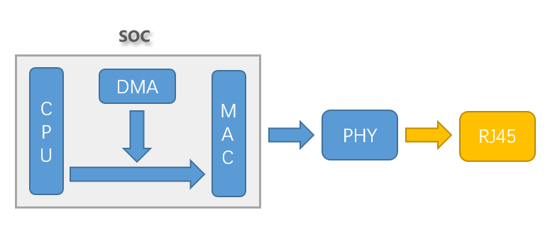

- CPU：为MAC控制器提供描述符，以及负责在网络协议栈和网络驱动之间传送数据
- MAC：通过描述符来控制DMA发送和接收数据
- DMA：用来在缓存区和MAC之间搬送数据，一般是MAC控制器内部的DMA，而不是SOC上的通用DMA
- PHY：用于将数据编码发送或者接收数据的器件
- RJ45：网络接口，比如常见的电口或者光口

#### MAC和PHY

MAC和PHY之间通过专用的MII类接口连接，MII类接口功能大致分为两个部分：数据和控制。数据类引脚用于传输数据，控制类引脚用于MAC控制PHY，比如设置PHY寄存器，获取PHY工作状态等等。

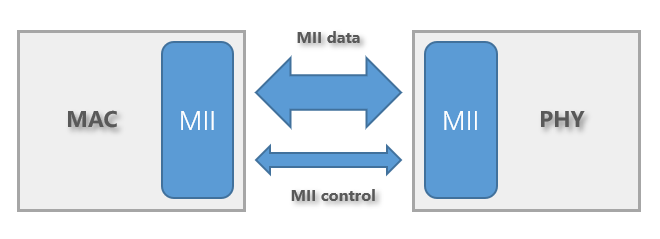

#### PHY地址

一个PHY硬件可以通过引脚设置成不同的地址，MAC要想和PHY通信的话，必须要知道PHY正确的地址。一般PHY的地址为0~31，在MAC控制器上有寄存器是用来设置想要通信的PHY的地址，如下所示。

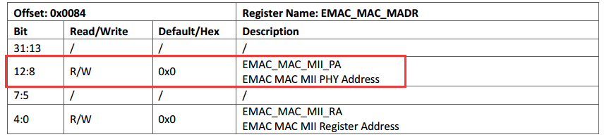

如果不知道PHY硬件上设置成了什么地址的话，可以通过遍历读取0~31号地址上PHY的硬件ID来判断哪些地址上是有PHY，然后选择具体的PHY进行通信。

### PHY寄存器

PHY是 IEEE802.3 中定义的一个标准模块，PHY 寄存器的地址空间为 5 位，因此寄存器范围是0 到31 ，最多有 32 个寄存器。IEEE802.3 定义了地址为0-15 这16个寄存器的功能，地址16-31的寄存器留给芯片制造商自由定义。但现在芯片功能很强大，32个寄存器远远不到，于是有的厂家就想出办法，使用page的方式来扩展。在看手册过程中发现，即使是0-15这类的寄存器，不同厂家在实现还是有点差异，所以，IEEE标准定义的寄存器只是在大的方面上说是“标准”的，细节方面如同一寄存器不同的位，功能也不一样，所以最好以厂商的datasheet为准。PHY寄存器描述如下：

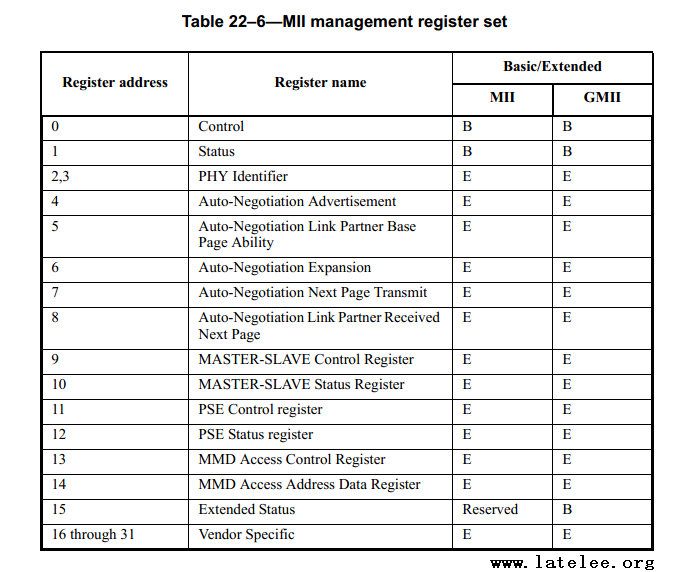

其中2和3号寄存器记录了一个PHY的ID号，一般在网卡驱动中需要通过PHY地址和PHY的ID这两个信息来确定MAC要和哪个PHY进行通信。

### 网卡驱动中PHY的初始化

由于大部分PHY只需要通过前16个寄存器进行初始化，而前16个寄存器的定义对于大部分PHY都是相同的，所以SylixOS提供了一个标准的接口给驱动，用于简化初始化PHY的步骤。在SylixOS网络驱动中，一个通用的PHY初始化步骤如下：

- 定义一个struct phy_dev类型变量，然后初始化好其中的一些成员
- 调用API_MiiPhyInit接口对PHY进行初始化
- 调用API_MiiPhyMonitorStart接口使能对PHY状态变化检测功能，其实就是创建一个独立的线程每隔固定的时间对PHY状态进行检测

注意这些都是对一般通用的PHY的初始化步骤，对于某些PHY，还需要操作厂商自定义的扩展寄存器进行一些设置，这时就需要参考PHY的datasheet或者厂商提供的参考例程。

## SylixOS网络开发(二)

### 概述

最近调网卡驱动，调的身心俱疲，这里记录一下在调试过程中学习到的网卡驱动相关知识。这个系列文章只关注在SylixOS系统下要让网卡收发数据，需要做什么，会涉及到网络控制器的一些基本硬件知识、驱动和网络协议栈传递数据的方法等等，不会讲具体的一个网卡驱动代码，写这个系列文章的目的就是给网卡驱动初学者一个指南。如果你看完这个系列文章，明白了网卡在数据流上如何和SylixOS协议栈交互的，那么这篇文章就没有白写。好了，不多BB，让我们一起来揭开网卡的神秘面纱~

### 网络数据收发

#### 总览

首先来看下在一个系统中网络数据流大致是如何传递的，如下图：

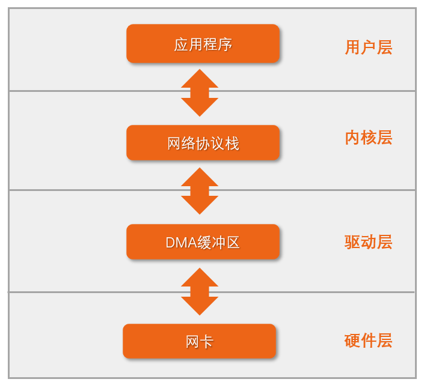

- 在网络的世界中，数据的接收和发送都是以帧为单位的，也就是一帧数据一帧数据的传输，每帧数据的大小可能为几十个字节，也可能是几百字节。
- 发送的时候，数据经过两次拷贝由应用层复制到协议栈，再由协议栈复制到DMA缓冲区，然后设置网卡从DMA缓冲区中取数据发送。
- 接收的时候，当网卡收到一帧数据后，将数据保存在DMA缓冲区中，然后通知cpu从缓冲区中取数据处理。cpu将DMA缓冲区中的数据经过两次拷贝之后传送到应用程序。
- 上图是SylixOS中网卡驱动不使用零拷贝的数据流图。

#### 缓冲区描述符

本小节关注网卡硬件上如何使用DMA缓冲区进行数据的收发。

网卡硬件上通过缓冲区描述符来使用DMA缓冲区，这里讲述一种常见的缓冲区描述符，如下图所示：

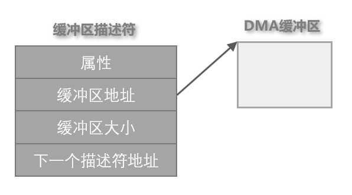

- 属性标明描述符的一些基本属性，比如描述符指向的缓冲区是否有有效数据，DMA传输完成后是否产生中断等等。
- 缓冲区地址指向用于存放收发数据的DMA缓冲区，一般都会有字节对齐的要求，比如地址要4字节对齐等等。
- 缓冲区大小用于标明DMA缓冲区中有效数据的大小，以字节为单位。
- 下一个描述符地址很好理解，就是下一个描述符的物理地址，一般初始化的时候会事先确定好有多少个缓冲区描述符，比如256个，然后将这些缓冲区描述符组成一个环链。
- 网卡硬件上收发各有一个环链。

### 网络驱动和协议栈交互

#### 概述

网络驱动和协议栈通过两个很重要的数据结构进行交互，struct netdev和struct pbuf。

一个网卡就对应着一个struct netdev，也就是说struct netdev是网卡硬件的抽象。netdev中有两个重要的方法，transmit和receive。当需要发送数据时，协议栈调用transmit方法通知驱动来进行数据发送，当网卡接收到数据时，系统通过receive方法接收数据并通知协议栈进行解析。如下图所示：

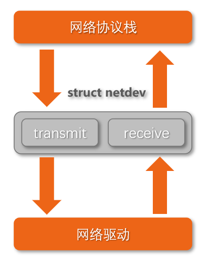

#### 网络任务处理线程

在SylixOS中，有两个线程是专门用来处理网络相关的任务的，分别是t_netjob和t_netproto，如下图所示。

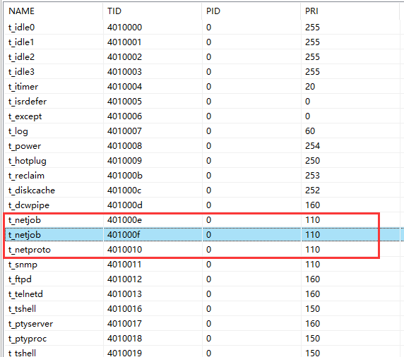

在多核系统上，会看到有两个t_netjob线程，用于并发处理网络任务，前提是驱动要做好并发处理。

- 当网络收发数据完成产生中断后，可以将耗时的处理放入t_netjob中进行排队处理
- t_netproto是网络协议栈线程，专门用来处理网络协议相关的东西

## SylixOS网络开发(三)

### 概述

本篇章节介绍SylixOS网络驱动不使用零拷贝时的数据是如何传递的。在阅读本篇文章的时候，大家脑海里一定要记住以下这张图：

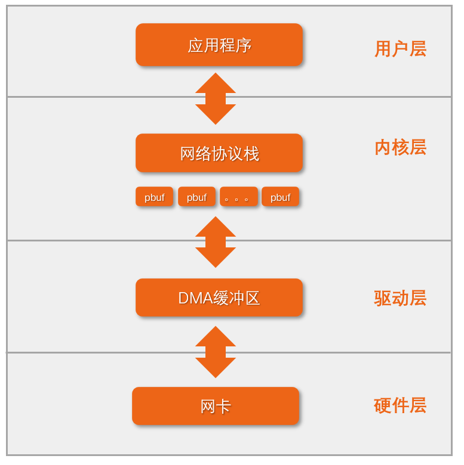

这张图只是对上一章节中的网络数据流图做了一点小修改。

#### 发送数据

我们之前说过，协议栈通过transmit方法来通知驱动进行数据发送，我们来看一下这个方法的函数原型：

```
/* netdev transmit a packet, and if success return 0 or return -1. */
 int  (*transmit)(struct netdev *netdev, struct pbuf *p);
```

可以看出这个函数的第二个参数是一个pbuf指针，驱动中通过pbuf就可以拿到要发送数据的缓冲区地址和大小，然后将数据复制到驱动中的DMA缓冲区，随后设置硬件进行数据发送。

这里需要注意的是协议栈中传递下来的pbuf中的数据缓冲区是带cache的，并且物理地址是连续的，同时物理地址和虚拟地址也是一一对应的。

在trasmit方法调用完后，发送用的pbuf会被协议栈回收。

#### 接收数据

系统通过receive方法接收数据并通知协议栈来处理解析数据，receive方法的函数原型如下：

```
/* netdev receive a packet, system will call this function receive a packet. */
  void (*receive)(struct netdev *netdev, int (*input)(struct netdev *, struct pbuf *));
```

从函数原型中可以看出，receive方法中第二个参数是一个Input方法，网络驱动就是通过这个方法来通知协议栈来处理接收到的数据，这个方法在网络协议栈初始化的过程中已经被实现，驱动中要做的工作就是进行调用即可。

我们再来看看input方法的第二个参数，是一个pbuf的指针，那么这个pbuf是哪里来的呢，是驱动中传进来的。也就是说驱动需要调用协议栈提供的接口来申请获得一个pbuf，然后将DMA缓冲区中的有效数据复制到pbuf中的缓冲区中，最后调用input方法同坐协议栈处理接收到的数据。

在协议栈处理完数据之后，会将接收用的pbuf进行回收。

也就是在不使用零拷贝的网络驱动中，发送和接收都不需要关心pbuf何时释放，因为这是由协议栈负责的。

## SylixOS网络开发(四)

### 概述

本章节讲述网络零拷贝技术的基本原理，需要知道的一个前提条件是，零拷贝可能不会提升网络驱动收发数据的速度，对不同的平台需要具体的分析，不能一概而论。

### 发送零拷贝

我们来看看上一章节中的网络数据:


发送数据的时候原来是将pbuf中的数据复制到驱动中的DMA缓冲区中然后设置硬件进行发送，这个复制其实是可以去掉的，发送零拷贝其实就是去掉了这个复制过程。在解释为什么可以去掉这个复制过程之前，我们先来看看为啥驱动层里需要一个DMA缓冲区：

- 不管是网卡还是啥其他外设的DMA传输，对缓冲区的物理地址有要求，即要求缓冲区的物理地址必须是连续的，因为DMA硬件是直接和内存进行数据传输的。
- DMA传输需要特别注意的是，缓冲区数据一致性，这里说的一致性是指和cache的一致性，也就是说必须保证DMA缓冲区中的数据是最新的。这可以通过两种方法来保证，一是使用不带cache的缓冲区，二是程序员手动调用操作cache的接口来保证数据的一致性，也就是cache flush和cache invalidate。

明白了为啥需要DMA缓冲区之后，我们来看看pbuf中的缓冲区。在SylixOS中，内核pbuf的缓冲区同样是物理地址连续的，并且是带cache的，那么我们可以直接将pbuf中的缓冲区拿过来给网卡硬件使用，同时由于缓冲区是带cache的，所以网卡硬件使用之前需要对缓冲区区域进行cache flush以保证内存中的数据是最新的。

如果使用发送零拷贝还需要考虑pbuf何时回收的问题，在非零拷贝的驱动中，由于已经将数据从pbuf中的缓冲区复制到了驱动中的DMA缓冲区，所以pbuf被协议栈回收不会影响硬件上发送数据，但是在零拷贝中不是这样的。如果在零拷贝中协议栈在硬件还没将数据发送完成的情况下回收了pbuf，那么这个pbuf可能会被再次使用。这样就破坏了pbuf中的上一次还未发完的数据，从而导致网络异常。解决方法就是在发送的时候调用协议栈提供的接口将pbuf引用计数加一，这样协议栈就不会主动去回收pbuf了，而在数据发送完成之后，用协议栈提供的接口将pbuf引用计数减一，这时协议栈才去回收pbuf。

### 接收零拷贝

#### 概述

网卡发送数据的时候会去设置缓冲区描述符中buffer的地址，因为发送是由协议栈主动发起的，对于系统而言是可控制的。但是接收就不一样了，因为网卡不知道何时回接收到数据，数据的到来对于系统来说是一个异步事件，所以必须在驱动初始化的阶段就设置好各个缓冲区描述符中buffer的地址，这样当接收到数据的时候，网卡就将数据放到缓冲区描述符对应的buffer中。

在非零拷贝的驱动中，内核中的pbuf是网络发送和接收共用的。在零拷贝驱动中，内核中的pbuf是发送专用，接收用的pbuf是通过另外的方式进行管理的。

#### 接收用零拷贝池

使用接收零拷贝时，驱动需要调用协议栈提供的接口创建零拷贝池，零拷贝池示意图如下：

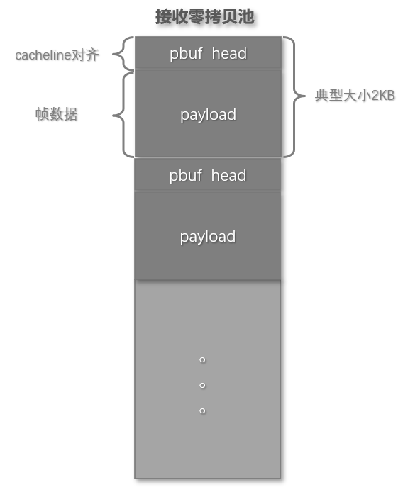

零拷贝池中的一个结点主要由两部分组成：

- pbuf head：这个就是用于管理pbuf的数据结构。
- pbuf payload：这个是用于存放帧数据的缓冲区。

从图中还可以看出pbuf head的大小是cacheline大小对齐的，在32位平台上，pbuf head为36字节大小，cacheline对齐后为64字节。一个结点的典型设置值为2KB大小，也就是说payload区域的大小是1984字节。

#### **零拷贝池中pbuf的申请和释放**

在网络驱动初始化的时候需要从零拷贝池中申请pbuf，然后将pbuf中的payload地址赋值给相应的缓冲区描述符。当驱动中使用input方法将零拷贝池中的pbuf传递给协议栈处理完之后，协议栈会回收这个pbuf，所以在调用完input方法之后还需要再次从零拷贝池中申请pbuf并将payload赋值给缓冲区描述符。

#### **接收零拷贝池的cache属性**

一般而言，零拷贝池需要设置为带cache属性的，当然如果遇到问题，可以先设置为不带cache的以排查问题。当使用带cache的零拷贝池时，就需要注意payload区域的dma一致性问题了，在驱动中调用input方法将pbuf上送协议栈之前需要将payload区域对应的cache失效，以保证协议栈读取数据时payload中的数据是最新的。

## SylixOS网络开发(五)

### 发送零拷贝问题

某SOC是四核A9平台，网络控制器是dw，不使用发送零拷贝的tcp发送带宽是93M/s，使用发送零拷贝之后的发送带宽竟然降低到了20M/s。最后查出的原因是用发送零拷贝时需要cache flush，这个函数的执行时间在A9平台上贼慢，后来写了个测试程序，cache flush 2KB的数据需要约400us左右，而用memcpy拷贝2KB的数据只需要50us左右，接着在飞腾2000四核平台上测试cache flush 2KB的数据只需要800ns左右。。。。。。从这个案例中可以看出驱动中是否使用发送零拷贝需要分析cache flush和memcpy的速度才能下结论。

### 接收零拷贝问题

还是某SOC dw网卡驱动==，接收零拷贝池使用不带cache属性时，一切工作正常，当使用带cache属性的零拷贝池时，用iperf测网速没啥问题，但是如果ping大包的话就会有丢包的现象，然后用tcpdump抓包会打印出ip包大小不正常，最后查出的问题是驱动中调用cache失效代码的位置有问题，放到正确的位置进行cache失效后，一切都正常了。下面请看具体的分析。

我们知道零拷贝池中的数据组织如下：


我们重点来关注下payload部分，其实payload区域前面有一些字节是预留的，如下所示：

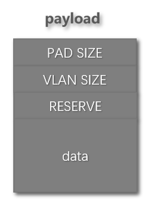

- PAD_SIZE是2字节大小。
- VLAN_SIZE是4字节大小。
- RESERVE大小是可以给程序员控制。
- data区域就是真正存放帧数据的地方。

整个payload区域的起始地址是cacheline对齐的，A9的cacheline大小为32字节，在某SOC的dw网卡驱动中，RESERVE大小为32字节，所以data区域相对于payload起始地址的偏移是2+4+32=38字节。在原来的驱动中，接收处理在调用input方法上送数据之前调用了cache失效接口来失效data区域的cache，但是data区域的起始地址并不是cacheline对齐的，在sylixos中的cache失效接口实现中，如果起始地址不cacheline对齐的话，会先计算出cacheline对齐的地址，然后对这个cacheLine进行数据回写，从下一个cacheline开始才是真正的去失效cache。这样就会带来问题，由于我们在data区域中的数据是dma接收好的最新的数据，在调用cache失效接口时，由于data区域起始地址不是cacheline对齐，所以会将data起始地址所在的那个cacheline先数据回写，这样就会有64-38=26字节的数据被回写到data区域的前26字节，而这前26字节正好包含了以太网帧头部和部分IP头部的数据，从而导致接收到的真实数据被cache中的数据覆盖了，这就导致了网络的异常。

由于驱动中只在调用input方法之前失效cache，当协议栈处理完payload之后，可能会去写这个区域，从而导致cache中缓存了数据，当下一次需要失效的时候，就会把cache中的数据回写到data区，从而引起异常。

解决的方法有两种：

- 第一种在失效前，手动通过data区域起始地址计算cacheline对齐的地址，然后再把这个地址传入API中进行cache失效。
- 第二种方法需要调整调用cache失效的位置，我们需要在初始化的时候先将所有的data区域cache失效，然后在input方法调用成功之后，也就是协议栈处理完接收数据之后，再次对data区域cache失效，这样就能保证在pbuf上送协议栈之前，payload中的数据是最新的。