[TOC]


# 全志D1开发

## 准备工作

#### 概述

本系列文章带领大家了解如何为全志D1芯片开发SylixOS BSP，D1芯片虽然是riscv架构的，但是其中采用的一些外设模块和我们之前为全志R16开发过的是一样的，所以驱动代码基本可以直接拿过来使用，比如串口、定时器驱动。因为之前已经在别的专题中将SylixOS BSP基础开发的一些知识讲过，所以本系列文章在前面的章节不会再去赘述，而是将精力放在后面的SD卡驱动和网络驱动开发上。在阅读本系列文章之前，最好将以下几个系列的专题文章先阅读一遍：

- SylixOS BSP基础开发 
- SylixOS块设备驱动开发 
- SylixOS网络开发 
- riscv基础开发

本次采用的开发板为韦东山老师的“东山哪吒STU”，在某宝即可购买，这款开发板可以在https://riscv64.dongshanpi.com/这个网址下载原理图和源码。

### 资料准备

#### 下载烧录镜像

韦东山老师为开发板提供了全志官方sdk和buildroot两种方式来编译linux下的环境，本次选择使用buildroot2022来制作Linux镜像，因为buildroot制作出来的烧录镜像uboot自带网络功能，可以方便我们通过tftp方式来引导启动SylixOS。buildroot2022的编译烧录请见https://riscv64.dongshanpi.com/DongshanNezhaSTU/05-Buildroot2022DevelopmentGuide/，也可以直接使用我事先编译好的镜像，地址在https://pan.baidu.com/s/1ah-fljLewJhBZ8kpXmEpdA?pwd=ic9h。烧录到sd卡上启动后可以停留在uboot命令行，如下所示。

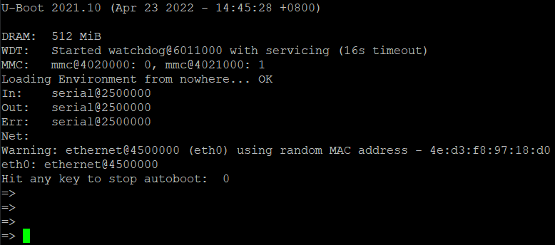

#### 下载BSP模板

SylixOS IDE由于不能像arm那样创建出riscv的BSP空工程模板，所以本次我依照着ide创建出来的sifiveu500这个BSP修改出一个riscv空工程模板，放在了百度网盘，后续的工作都是基于这个空工程逐步添加驱动，地址在[https://pan.baidu.com/s/1xh0Iy74nGj4tj9BVKFpqPg?pwd=uufk](https://pan.baidu.com/s/1Hno775UnyWQ5THD3rJd_Pw?pwd=zoxx)。由于全志官方SDK编译出来的uboot默认没有网络功能，并且没有go命令，所以只能从fat分区使用bootm命令来引导SylixOS，为此，在BSP中事先放了windows下的mkimage，同时在makefile添加命令来将SylixOS系统bin镜像打包成uboot的uimage格式，如下所示。

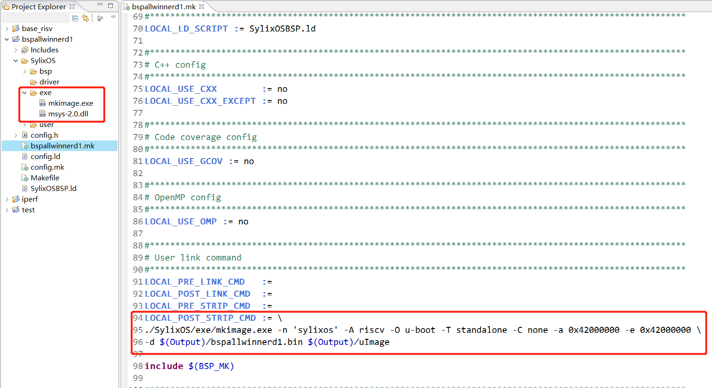

本系列教程中我们使用的是buildroot编译出的uboot，自带网络功能和go命令，当然也可以使用bootm命令来引导，后面会做演示。

## 添加串口驱动

### 基础功能修改

#### 创建base，导入BSP工程

根据全志D1的架构说明，创建base时选择如下：

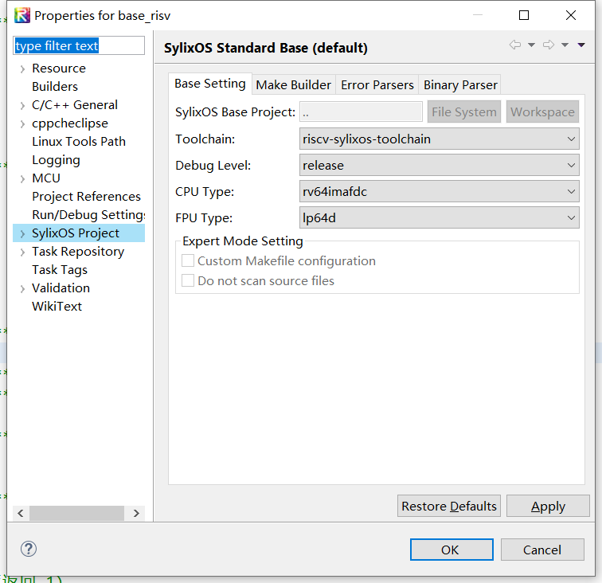

替换编译好base工程后，下载并导入BSP空模板工程工后续修改。

#### startup.S

启动文件中的内容很简单，跟arm架构的比较类似，主要就是设置异常向量表、初始化内核数据段啥的，具体如下：

- 首先关中断然后跳转到reset入口
- 接着设置中断入口为archTrapEntry，然后清零所有cpu寄存器
- 初始化栈地址，拷贝内核数据段，清零内核bss段
- 设置好栈，跳转c语言实现的接口执行

具体的代码大家可以亲自去瞅瞅，不算太难，都是一些基础性的工作。

#### SylixOS/config.h

接下来需要对SylixOS要求的内存段进行配置，由于riscv架构需要有SBI代码常驻内存，所以我们还不能将OpenSBI所在的内存给覆盖掉，查看启动打印输出可以看到OpenSBI在内存最开始的地方，如下所示：

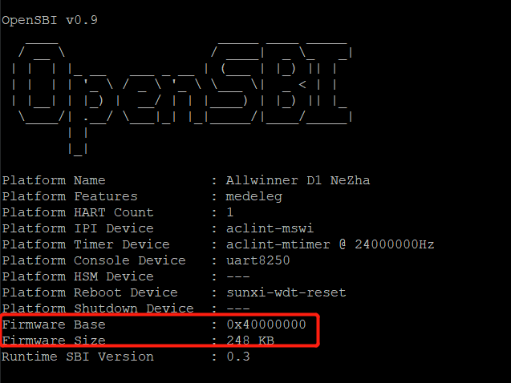

所以在内存的划分上，我们要将内存前面预留一段空间，这里我们选择预留32MB，也就是SylixOS内核的基址是从0x40000000+32MB=0x42000000开始的，如下所示：


#### bspMap.h

物理地址映射表后续添加驱动时我们需要将外设寄存器的地址填入这个表中，以便系统在启动的时候就能映射，我们这修改app和ioremap所使用的虚拟地址空间，只要不和物理映射表中的地址冲突就行，如下所示。

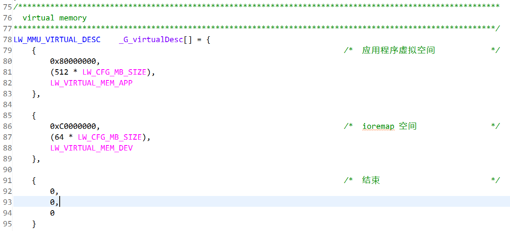

#### bspLib.c

修改BSP板级包的字符串信息，用于在启动时打印使用，如下所示。

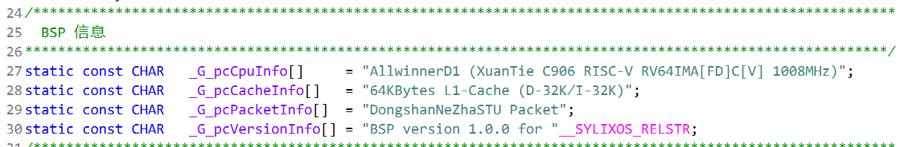

#### bspInit.c

这里主要是修改fpu、mmu、cache初始化时要传入的参数，这里要注意的是由于riscv架构没有具体定义cache刷新、失效之类的指令，所以全志D1采用的c906核自己扩展了这些指令，想要使用这些指令就需要使用c906自己的编译工具链，SylixOS编译工具链在riscv下目前不支持这些自定义指令，所以内核中对cache刷新、失效之类的都是空实现，这点需要特别注意。

对fpu的初始化如下：

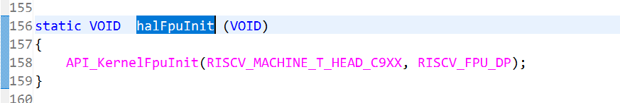

对mmu的初始化如下：

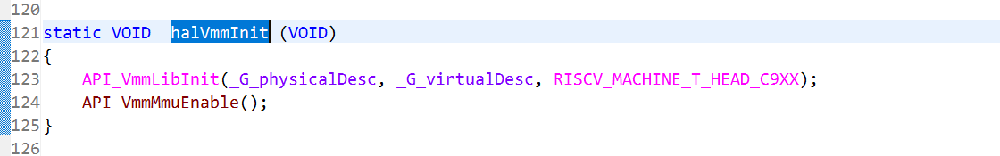

对cache的初始化如下：

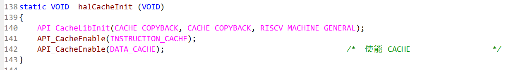

其实c906的cache硬件上固定使用write back机制，这里的设置参数到底层最终都是无操作实现。

### 添加串口驱动

#### 实现调试打印接口

全志D1的uart和全志R16的uart模块是一样的，只需要将寄存器基址和中断号修改即可。首先将全志R16的串口驱动复制到driver目录下：

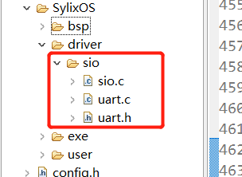

开发板使用的是uart0，通过查阅手册修改uart.c中定义的寄存器基址：


串口的输入需要使用中断机制，中断号的修改我们留到后续中断控制器驱动完成后再弄。要想在mmu开启之后访问寄存器，我们需要将串口寄存器的地址填入bspMap.h中映射，如下所示。

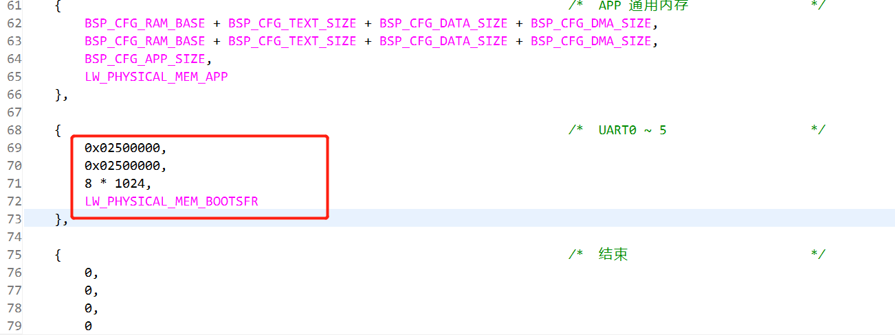

调试需要实现bspLib.c中的调试打印输出接口，这个在串口驱动中已经有对应的接口，直接填入即可，如下所示（别忘了在文件开始包含uart.h头文件）。

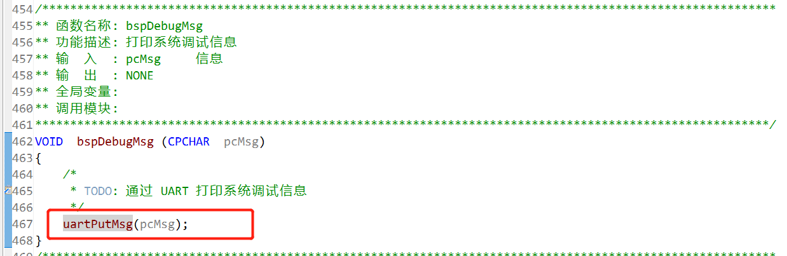

最后需要将内核启动参数中的kdlog改为yes，以便内核输出调试日志，从而来判断串口输出功能是否正常，由于目前在调试阶段，我们可以先将文件挂在内存上，如下所示：

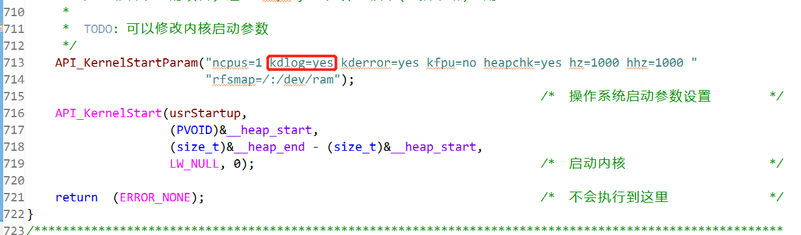

#### 网络引导系统

##### IDE tftp设置

上述文件修改完成之后，直接编译IDE会自动扫描工程并填写makefile中的内容，编译完成后生成bspallwinnerd1.bin，这个就是我们要使用的镜像文件，后面我们主要通过网络来下载此镜像并引导系统。想要uboot使用tftp下载文件就需要在电脑上运行一个tftp server，这里我们使用IDE中自带的tftp server功能。通过点击tools->tftp server来打开tftp server设置，如下所示：

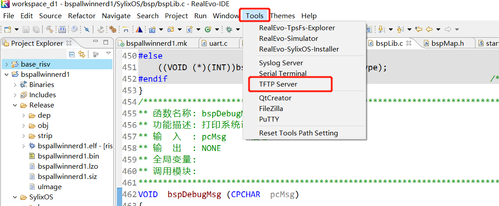

打开设置对话框后，需要选择bspallwinnerd1.bin所在的目录，点击output选择bspallwinnerd1/Output目录，然后点击ok，如下所示。

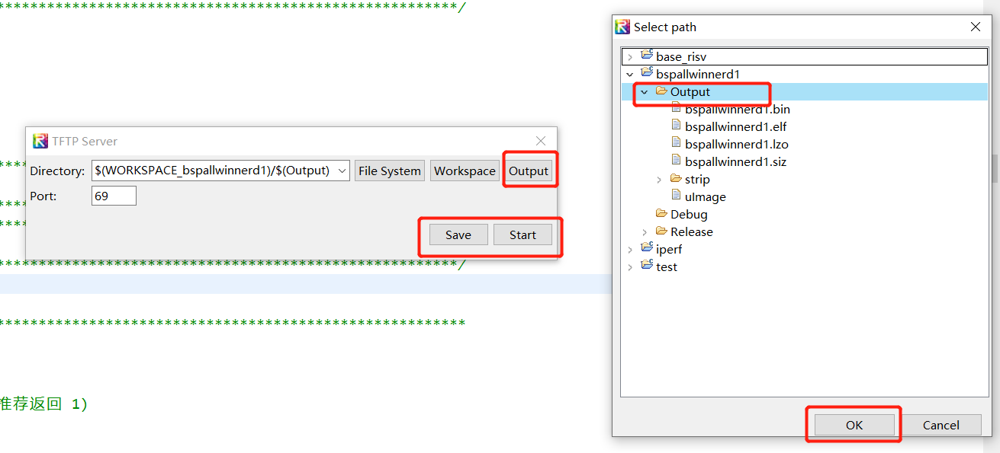

随后点击Save和Start按钮来启动tftp server，这样电脑端的设置就完成了，后续就可以在uboot下通过tftp命令下载allwinnerd1.bin文件到内存中了。

##### uboot tftp引导SylixOS镜像

引导命令大致分为三段：

- 由于buildroot编译出来的uboot跳转到系统代码之前会打开看门狗，所以我们需要在命令行先关闭看门狗功能，命令如下：

```
wdt dev watchdog@6011000;wdt stop;
```

- 接下来需要设置开发板的ip地址和tftp服务端的ip地址，我自己的电脑ip地址为10.9.0.107，开发板地址设置为10.9.0.109，大家根据实际情况修改设置，如下所示：

```
setenv ipaddr 10.9.0.109;setenv serverip 10.9.0.107;
```

- 最后我们需要通过tftp命令将bspallwinnerd1.bin下载到0x42000000内存地址处，然后通过go命令跳转到SylixOS内核中执行，如下所示：

```
tftp 42000000 bspallwinnerd1.bin;go 0x42000000
```

由于本次buildroot编译出的uboot无法保存环境变量，每次重启时都需要设置上述命令，可以将命令保存在文本文件里以便复制：

```
wdt dev watchdog@6011000;wdt stop;setenv ipaddr 10.9.0.109;setenv serverip 10.9.0.107;tftp 42000000 bspallwinnerd1.bin;go 0x42000000
```

一切正常后便可以看到串口上输出了内核打印的日志信息，如下所示。

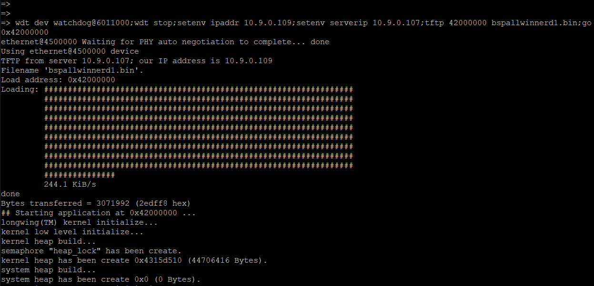

我们也可以通过bootm命令来引导SylixOS内核，将引导命令修改为如下：

```
wdt dev watchdog@6011000;wdt stop;setenv ipaddr 10.9.0.109;setenv serverip 10.9.0.107;tftp 42000000 uImage;bootm 0x42000000
```

通过tftp下载的是uImage镜像而不是bin文件镜像，最后通过bootm命令引导启动SylixOS，如下所示：

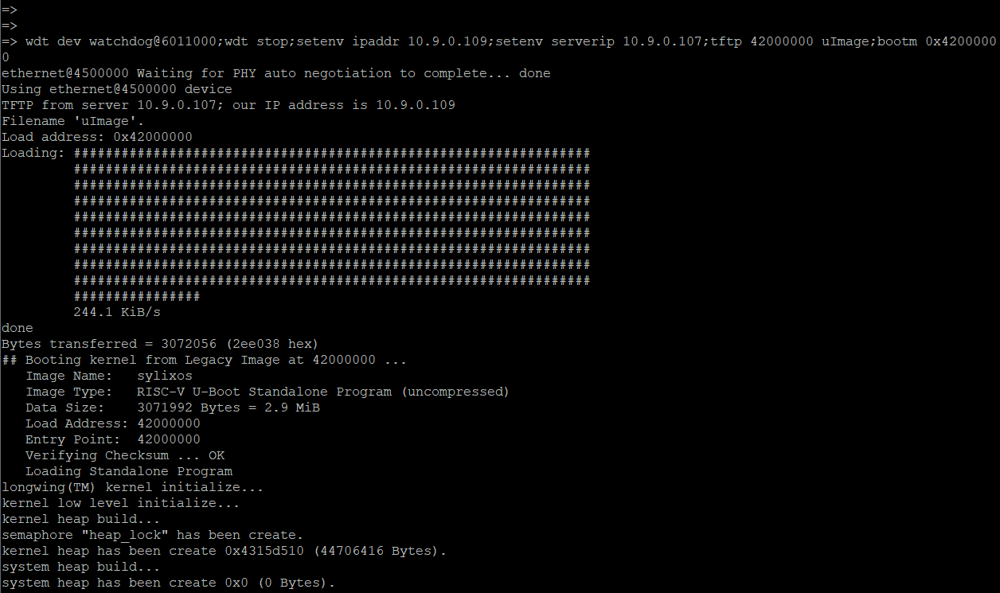

#### 创建串口tty设备，启动系统

跟全志R16一样，sio创建驱动代码都是一样的，直接将接口放到bspInit.c中的halDevInit中调用并创建tty设备，如下所示。

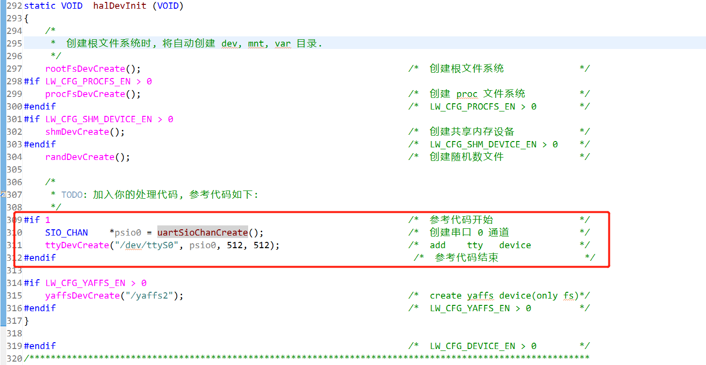

同样需要在文件开始处包含uart.h头文件，后续添加新驱动时都需要按个添加驱动的头文件，这点在后面不会再提醒，一定要牢记。最后别忘了将halBootThread中的启动脚本执行代码给注释掉，不然是无法启动到系统logo的，如下所示：

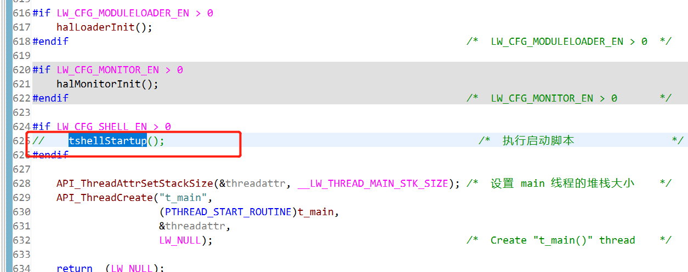

都完成后重新编译内核镜像，重启开发板引导，如果没问题的话就会看到SylixOS系统logo了：

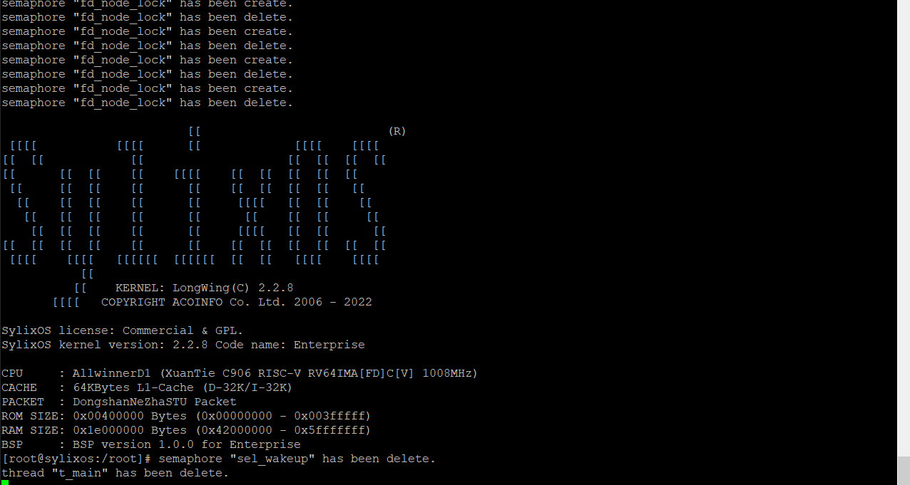

## 添加定时器驱动

### 选择系统tick定时器

在riscv架构中已经定义了定时器，但是如果要使用这个定时器就必须配合OpenSBI提供的接口来设置定时器的新值，在这里为了和之前的BSP教程统一，我们选择使用全志提供的厂商定时器来作为系统tick定时器。由于和全志R16使用的是相同的定时器，所以同样直接将定时器代码复制到driver目录下，并修改定时器模块的基址，如下所示。


### 修改 bspLibc

首先在bspTickInit中添加定时器的启动代码，如下所示：


这里我们先不关心中断号设置，同样放到中断控制器设置好之后再回头来修改。在定时器中断处理函数中添加清除中断的代码，如下所示。


最后为定时器添加高精度修正接口，如下所示。


### 功能验证

由于中断控制器我们还未初始化好，所以我们只能通过轮询定时器的中断状态寄存器来确定中断是否产生，在bspTickInit最后添加如下代码：


最后别忘了在bspMap.h中添加定时器寄存器的映射地址：


最后的最后我们将bspInit.c中内核启动参数中的kdlog改为no，不然会有一堆的输出打印干扰我们分析：


重新编译内核引导，如果在串口上看到我们添加的定时器验证打印，就说明定时器初始化没问题了：


## 添加中断控制器驱动

### riscv中断框架回顾

在riscv中，中断被分为CLINT和PLIC两类，CLINT负责架构定时器和核间中断管理，PLIC负责外设中断的管理。由于本系列教程我们的定时器没有选用架构的定时器，所以CLINT功能我们用不到，我们只需要关心PLIC外设中断就行了。 在后续的s模式系统全局中断寄存器设置上我们只会去使能和处理外设控制器中断，这样就简化了中断的设置和处理。

### 全志PLIC外设中断控制器简介

在全志的手册中我们查找到PLIC章节，寄存器其实也不多，比较简单的中断控制器：


我们主要关心图中红框中的寄存器，其他的寄存器大部分都需要在m模式下访问，s模式下无权限去访问这些寄存器：

- PLIC_PRIO_REGn：优先级寄存器，如果为0表示此中断无效，初始化时我们需要将所有中断的优先级设置为1。
- PLIC_SIE_ REGn：s模式中断使能寄存器，每个bit位代表对应一个中断号，设置1表示使能。
- PLIC_STH_REG：s模式中断优先级阈值寄存器，优先级大于阈值的中断才会被处理，初始化时我们会将阈值设置为0，表示处理所有中断。
- PLIC_SCLAIM_REG：中断号和ACK寄存器，读操作表示当前产生中断的外设中断号，写操作表示对应的中断处理完成了。

从上面的分析可以看出全志的PLIC中断控制器还是比较简单的，因为全志D1为单核处理器，所以这里也不需要考虑多核中断的处理。

### 全志PLIC中断控制器接口封装

#### plicInit

```
VOID plicInit (VOID)
{
    INT i;

    // 关闭 S 模式下所有中断
    write_csr("sie", 0);

    // 清除 S 模式下所有中断
    write_csr("sip", 0);

    // 使能 S 模式下外部控制器中断
    set_csr("sie", 1 << IRQ_S_EXT);

    // 关闭控制器所有中断
    for (i = 0; i < 9; i++) {
        writel(0, PLIC_BASE + 0x2080 + 4 * i);
    }

    // 处理所有优先级中断
    for (i = 0; i < 256; i++) {
        writel(1, PLIC_BASE + 4 * i);
    }
    writel(0, PLIC_BASE + PLIC_STH_REG);
}
```

首先关闭和清除s模式系统中断寄存器，然后只使能外部控制器中断，接着关闭PLIC所有外设的中断，并设置优先级和阈值。

####  plicVectorEnable

```
VOID plicVectorEnable (UINT32  ulVector)
{
    UINT32  uiRegAddr = PLIC_SIE_REG(ulVector);
    UINT32  uiVal     = PLIC_SIE_POS(ulVector);

    writel(readl(uiRegAddr) | uiVal, uiRegAddr);
}
```

原理很简单，根据中断号计算出要操作的寄存器位置，然后设置为1表示使能。

#### plicVectorDisable

```
VOID plicVectorDisable (UINT32  ulVector)
{
    UINT32  uiRegAddr = PLIC_SIE_REG(ulVector);
    UINT32  uiVal     = PLIC_SIE_POS(ulVector);

    writel(readl(uiRegAddr) & ~uiVal, uiRegAddr);
}
```

和使能原理类似，只是将对应的位置清零，表示关闭中断。

#### plicVectorGet

```
UINT32 plicVectorGet (VOID)
{
    // 清除 S 模式下外部控制器中断
    clear_csr("sip", 1 << IRQ_S_EXT);

    return  (readl(PLIC_BASE + PLIC_SCLAIM_REG));
}
```

这个接口只会在产生中断的时候调用，所以我们首先要清除s模式系统中断状态寄存器中的外设控制器中断状态，然后返回当前产生中断的硬件中断号。

#### plicVectorAckDone

```
VOID plicVectorAckDone (UINT32  ulVector)
{
    writel(ulVector, PLIC_BASE + PLIC_SCLAIM_REG);
}
```

#### plicVectorIsEnable

```
BOOL plicVectorIsEnable (UINT32  ulVector)
{
    UINT32  uiRegAddr = PLIC_SIE_REG(ulVector);
    UINT32  uiVal     = PLIC_SIE_POS(ulVector);

    return  (readl(uiRegAddr) & uiVal) ? TRUE : FALSE;
}
```

读取中断号对应的寄存器来检测中断是否使能。

### bsp修改

首先需要将封装好的6个接口填入bspLib.c中的bspIntxxx对应的接口中，如下所示：


然后需要在bspMsp.h中添加PLIC的寄存器地址映射，如下所示。


接着需要根据手册将uart.h和timer.h中的串口中断号和定时器中断号修改为手册的值，如下所示。

```
#define UART_VECTOR(x)  ((x) + 18)

#define TIMER_VECTOR(x)     ((x) + 75)
```

最后需要将bspTickInit中定时器中断号初始化为正确的值，如下所示。


### 系统启动

设置完后，编译bsp重启开发板引导，如果一切正常就可以在串口输入命令了，同时通过ints命令查看定时器产生的中断数来确定定时器中断是否工作正常了，如下所示。


#### 小结

到此为止我们已经将全志D1的SylixOS最小系统给适配完成了，得益于之前为全志R16适配的驱动，我们只需要做简单的修改就能复用代码了。后续会讲解sd卡驱动和网络驱动的开发，最小系统的开发我们只用了四个章节快速带过，如果中间有看不明白的请先回顾开始提到的4篇专题文章或者在文章下留言。

最小系统的BSP源码可以在https://pan.baidu.com/s/15qXCrqqjzpFz-FvNat5tkQ?pwd=koex下载。

## SD驱动之SD协议简介

### 总线拓扑

SD卡定义了两种总线来进行通信，SD总线和SPI总线，一般SD总线用的较多，本次我们以SD总线为例进行讲解驱动的编写，SD在设计上可以挂接多个SD设备，如下所示。


虽然设计上同一条SD总线上可以挂接多个设备，但是在实际应用种，为了传输速度以及其他因素的考虑，一条总线一般只会接一个SD设备。SD总线一般有6条信号线组成：

- CLK：时钟信号，HOST控制器提供，一般分为3种时钟频率，400kHz用于初始化阶段，25MHz用于正常速度传输，50MHz用于高速数据传输。
- D0~3：数据信号，初始化阶段只通过D0来传输数据，别的阶段可以设置使用D0~D3来传输数据。
- CMD：命令信号，SD协议中HOST控制器可以发送命令给设备，设备可以发送回应给HOST控制器，这些命令和回应就是通过CMD线来传递的。

### 总线协议

SD总线的通信有三个基本要素：

- 命令(Command)：命令由主控制器发送到设备，命令在CMD线上进行传输。
- 响应(Response)：响应由设备发给主控制器，用于对命令的回答，同样是在CMD线上进行传输。
- 数据(Data)：数据可以由主控制器发给设备，也可以由设备发给主控制器，通过DATA线传输。

由控制器发送的命令有需要响应的，也有不需要响应的，如下所示：


有些命令还需要携带数据，如下所示：


本次教程不会对SD卡通信具体的流程做深入的讲解，比如初始化的时候需要发送那些命令，传输数据的时候又需要发送那些命令，这些网上都有非常多详细的讲解了，大家可以在调试的时候遇到具体问题时查阅相关资料了解。

本教程更多的聚焦于如何快速的搭建一个SD卡驱动，通过一个简单的SD卡驱动来学习SylixOS SD协议栈是如何和一个具体的控制器产生联系的，从而快速的了解编写SylixOS SD驱动需要使用哪些基础的内核数据结构和对应的接口。

## SD驱动之SylixOS SD框架

SylixOS下的SD协议栈的整体框架如下所示：


- 最底下是SD控制器硬件，根据具体的实现大致分为两类：一类是SD协议中定义的标准控制器SDHC，比如zynq7000；另一类是各个厂商自己实现的非标准控制器，比如全志的SMHC控制器。
- 针对两类SD控制器，SD驱动同样分为了两类。SylixOS在内核SD协议栈中也提供了基础的SDHC驱动接口，方便编写具体的SDHC控制器驱动，因为一些厂商虽然控制器整体上是符合SDHC标准的，但是也有一些额外寄存器需要设置，这就需要在内核SDHC基础框架上进行扩展开发具体的驱动。对像全志SMHC这样的完全不符合SDHC标准的控制器，就需要使用SD Core中更底层的接口来编写驱动，这个在后续文章中问哦们再详细的讲解。
- SylixOS将SD协议栈大致分为了SD Core和SD Client两部分组成。SD Core主要是和底层控制器驱动打交道，为上层的SD Client提供命令发送和数据传输的接口。同时通过SDM来管理上层的Client驱动和底层的Host驱动，达到逻辑上隔离和解耦的目的。
- 类似于I2C和SPI这类驱动分为主控制器驱动和设备驱动，SD Client层主要就是SD的设备驱动，根据SD设备的用途大致分为两类：存储类(Memory)驱动和SDIO设备类驱动。SD Memory主要就是SD卡这类存储设备的驱动，对下提供了完整的SD卡初始化流程和传输数据的方法，对上提供了符合SylixOS基础块设备的驱动，以让文件系统通过SD驱动读写文件。SDIO设备一般有GPS、WIFI等等，Client中提供了SDIO设备的基础框架，编写具体的SDIO设备驱动时在基础上扩展即可，也可以将SDIO驱动进一步封装成字符设备驱动，让应用层方便去操作。

这里只是简单的列出SylixOS下的SD框架，目的是为了让初学者快速的从全局角度了解SD协议和驱动在整个内核中的上下层次关系。本此SD我们只关心SD Memory的用法，SDIO设备驱动不在这里讲解。更多的关于SylixOS SD驱动的资料请参考《SylixOS设备驱动开发》第20章或者阅读内核源码。

## SD驱动之创建SD适配器

### SD适配器简介

由于SylixOS的SD协议栈设计最开始是借鉴内核中的I2C和SPI框架的，具体的历史可以参见曾老师的博客http://blog.chinaunix.net/uid-30296321-id-5106707.html。所以SD同样使用适配器(Adapter)来表示具体的主控制器，在SylixOS中这是通过 ***LW_SD_ADAPTER*** 数据结构来表示的，如下所示：

```
typedef struct lw_sd_adapter {
    LW_BUS_ADAPTER          SDADAPTER_busadapter;                       /*  总线节点                    */
    struct lw_sd_funcs     *SDADAPTER_psdfunc;                          /*  总线适配器操作函数          */

    LW_OBJECT_HANDLE        SDADAPTER_hBusLock;                         /*  总线操作锁                  */
    INT                     SDADAPTER_iBusWidth;                        /*  总线位宽                    */
#define SDBUS_WIDTH_1       0
#define SDBUS_WIDTH_4       2
#define SDBUS_WIDTH_8       4
#define SDBUS_WIDTH_4_DDR   8
#define SDBUS_WIDTH_8_DDR   16

    LW_LIST_LINE_HEADER     SDADAPTER_plineDevHeader;                   /*  设备链表                    */
} LW_SD_ADAPTER, *PLW_SD_ADAPTER;
```

- ***SDADAPTER_psdfunc\***：适配器操作函数集，主要包括传输和控制两类接口，分别用于数据的传输和一些硬件上的控制设置，这个等会会详细讲解。
- ***SDADAPTER_iBusWidth***：使用的SD总线线宽，对于eMMC类设备可能会支持8线以及DDR方式传输数据，在本次SD驱动中，我们只关心4线模式。

SD适配器中最重要的就是传输和控制，这在SylixOS下是通过 ***LW_SD_FUNCS*** 数据结构来表示的，其成员如下所示：

```
typedef struct lw_sd_funcs {
    INT (*SDFUNC_pfuncMasterXfer)(PLW_SD_ADAPTER          psdadapter,
                                  struct lw_sd_device    *psddevice,
                                  PLW_SD_MESSAGE          psdmsg,
                                  INT                     iNum);
    INT (*SDFUNC_pfuncMasterCtl)(PLW_SD_ADAPTER          psdadapter,
                                 INT                     iCmd,
                                 LONG                    lArg);
} LW_SD_FUNCS, *PLW_SD_FUNCS;
```

- ***SDFUNC_pfuncMasterXfer***：SD协议栈将需要发送的命令和数据封装成 LW_SD_MESSAGE 发送到底层驱动使用，这个数据结构我们在后续章节展开讲解。
- ***SDFUNC_pfuncMasterCtl***：用于设置SD控制器，比如线宽、时钟频率等等。

###  定义SD适配器操作函数集

我们定义一个全局的变量来表示操作函数集，如下所示：

```
static LW_SD_FUNCS sdfuncs = {
    .SDFUNC_pfuncMasterXfer = sdTransfer,
    .SDFUNC_pfuncMasterCtl  = sdIoctl,
};
```

定义变量的同时用 ***sdTransfer*** 和 ***sdIoctl*** 这两个函数来初始化这个变量，这两个函数目前我们先空实现，后面再一步步完善：

```
static int sdIoctl (PLW_SD_ADAPTER psdadapter, int cmd, long arg)
{
    switch (cmd) {
    case SDBUS_CTRL_POWEROFF:
        // TODO:关闭电源
        break;
    case SDBUS_CTRL_POWERUP:
    case SDBUS_CTRL_POWERON:
        // TODO:使能电源
        break;
    case SDBUS_CTRL_SETBUSWIDTH:
        // TODO:设置线宽
        break;
    case SDBUS_CTRL_SETCLK:
        // TODO:设置时钟频率
        break;
    case SDBUS_CTRL_DELAYCLK:
        break;
    case SDBUS_CTRL_GETOCR:
        // TODO:获取支持的电压情况
        *(UINT32 *)arg = SD_VDD_32_33 | SD_VDD_33_34;
        break;
    default:
        return -1;
    }

    return 0;
}
static int sdTransfer (PLW_SD_ADAPTER psdadapter,
                       PLW_SD_DEVICE  psddevice,
                       PLW_SD_MESSAGE psdmsg,
                       int            num)
{
    return 0;
}
```

在sdIoctl中这里列出来了一些常用的cmd设置，但是在本次教程中并不是所有的cmd控制都需要实现，我们只需要实现如下三个：

- **SDBUS_CTRL_SETBUSWIDTH：**设置控制器线宽，arg的取值有 SDARG_SETBUSWIDTH_1、SDARG_SETBUSWIDTH_4、SDARG_SETBUSWIDTH_8等等。
- **SDBUS_CTRL_SETCLK**：设置时钟频率，arg的取值有400000、25000000、50000000等等。
- ***SDBUS_CTRL_GETOCR***：获取控制器支持的工作电压，SD工作电压一般都在3.3v左右，所以这里我们固定返回 SD_VDD_32_33 | SD_VDD_33_34。
- 至于其他的cmd在本次教程中用不到，但是在实际的SD卡驱动中需要根据具体的硬件原理图来设置电源的使能和关闭等操作。

####  创建SD适配器

初始化好操作函数集后，就可以通过 ***API_SdAdapterCreate*** 接口来创建SD适配器了，这个接口的函数原型如下：

```
LW_API INT              API_SdAdapterCreate(CPCHAR pcName, PLW_SD_FUNCS psdfunc);
```

- ***pcName***：SD总线名字，一般为”/bus/sd/xxx“，xxx根据控制器的序号来确定，本次我们使用的是控制器0，所以SD总线名字为”/bus/sd/0“。
- ***psdfunc***：用于传入SD适配器操作函数集，这里我们设置为第2步中初始化的函数集。

根据上述信息，我们可以封装出sdDevCreate接口，如下所示：

```
int sdDevCreate (void)
{
    // TODO:硬件初始化

    // 创建SD适配器
    API_SdAdapterCreate("/bus/sd/0", &sdfuncs);

    return 0;
}
```

一些关于硬件的初始化，比如引脚复用、时钟树设置等等我们到后续在封装单独的接口，另外由于SD适配器是在SD协议栈内部使用的，一般不需要在驱动中显示的使用，所以不需要在驱动中再用额外的变量来保存创建出来的SD适配器，当然如果需要的话，内核也提供了 ***API_SdAdapterGet*** 接口来获取适配器：

```
LW_API PLW_SD_ADAPTER   API_SdAdapterGet(CPCHAR pcName);
```

附源码：

```
/*
 * sd.c
 *
 *  Created on: Apr 23, 2022
 *      Author: gewenbin
 */
#define __SYLIXOS_KERNEL
#include <SylixOS.h>
#include <linux/compat.h>

static int sdIoctl (PLW_SD_ADAPTER psdadapter, int cmd, long arg)
{
    switch (cmd) {
    case SDBUS_CTRL_POWEROFF:
        // TODO:关闭电源
        break;
    case SDBUS_CTRL_POWERUP:
    case SDBUS_CTRL_POWERON:
        // TODO:使能电源
        break;
    case SDBUS_CTRL_SETBUSWIDTH:
        // TODO:设置线宽
        break;
    case SDBUS_CTRL_SETCLK:
        // TODO:设置时钟频率
        break;
    case SDBUS_CTRL_DELAYCLK:
        break;
    case SDBUS_CTRL_GETOCR:
        // TODO:获取支持的电压情况
        *(UINT32 *)arg = SD_VDD_32_33 | SD_VDD_33_34;
        break;
    default:
        return -1;
    }

    return 0;
}
static int sdTransfer (PLW_SD_ADAPTER psdadapter,
                       PLW_SD_DEVICE  psddevice,
                       PLW_SD_MESSAGE psdmsg,
                       int            num)
{
    return 0;
}
static LW_SD_FUNCS sdfuncs = {
    .SDFUNC_pfuncMasterXfer = sdTransfer,
    .SDFUNC_pfuncMasterCtl  = sdIoctl,
};
int sdDevCreate (void)
{
    // TODO:硬件初始化

    // 创建SD适配器
    API_SdAdapterCreate("/bus/sd/0", &sdfuncs);

    return 0;
}
```

## SD驱动之注册Host信息

### 注册SD Memory设备驱动

在SylixOS的SD框架设计中，需要将主控制器驱动和设备驱动分别注册到SDM框架中以方便管理。使用内核SDM相关接口之前需要先调用 ***API_SdmLibInit*** 进行内核一些信号量之类的初始化，这个接口无参数，直接调用一下就可。初始化完后我们就可以注册Host或者设备驱动了，本次我们编写的是SD卡驱动，用于存储使用，所以可以注册SD Memory设备驱动到SDM，内核已经为我们封装好对应的接口 ***API_SdMemDrvInstall*** ，此接口同样没有参数，直接调用即可。

### SD Host描述信息

为了让SDM管理Host驱动，SylixOS使用 ***SD_HOST*** 数据结构来为SDM描述一个控制器信息：

```
struct sd_host {
    CPCHAR        SDHOST_cpcName;

    INT           SDHOST_iType;
#define SDHOST_TYPE_SD                  0
#define SDHOST_TYPE_SPI                 1

    INT           SDHOST_iCapbility;                                /*  主动支持的特性                  */
#define SDHOST_CAP_HIGHSPEED            (1 << 0)                    /*  支持高速传输                    */
#define SDHOST_CAP_DATA_4BIT            (1 << 1)                    /*  支持4位数据传输                 */
#define SDHOST_CAP_DATA_8BIT            (1 << 2)                    /*  支持8位数据传输                 */
#define SDHOST_CAP_DATA_4BIT_DDR        (1 << 3)                    /*  支持4位ddr数据传输              */
#define SDHOST_CAP_DATA_8BIT_DDR        (1 << 4)                    /*  支持8位ddr数据传输              */
#define SDHOST_CAP_MMC_FORCE_1BIT       (1 << 5)                    /*  MMC卡 强制使用 1 位总线         */
#define SDHOST_CAP_SDIO_FORCE_1BIT      (1 << 6)                    /*  SDIO 卡 强制使用 1 位总线       */
#define SDHOST_CAP_SD_FORCE_1BIT        (1 << 7)                    /*  SD 卡 强制使用 1 位总线         */
#define SDHOST_CAP_HS200                (1 << 8)                    /*  支持 HS200 模式                 */
#define SDHOST_CAP_HS400                (1 << 9)                    /*  支持 HS400 模式                 */

    VOID          (*SDHOST_pfuncSpicsEn)(SD_HOST *psdhost);
    VOID          (*SDHOST_pfuncSpicsDis)(SD_HOST *psdhost);
    INT           (*SDHOST_pfuncCallbackInstall)
                  (
                  SD_HOST          *psdhost,
                  INT               iCallbackType,                  /*  安装的回调函数的类型            */
                  SD_CALLBACK       callback,                       /*  回调函数指针                    */
                  PVOID             pvCallbackArg                   /*  回调函数的参数                  */
                  );

    INT           (*SDHOST_pfuncCallbackUnInstall)
                  (
                  SD_HOST          *psdhost,
                  INT               iCallbackType                   /*  安装的回调函数的类型            */
                  );
#define SDHOST_CALLBACK_CHECK_DEV       0                           /*  卡状态检测                      */
#define SDHOST_DEVSTA_UNEXIST           0                           /*  卡状态:不存在                   */
#define SDHOST_DEVSTA_EXIST             1                           /*  卡状态:存在                     */

    VOID          (*SDHOST_pfuncSdioIntEn)(SD_HOST *psdhost, BOOL bEnable);
    BOOL          (*SDHOST_pfuncIsCardWp)(SD_HOST *psdhost);

    VOID          (*SDHOST_pfuncDevAttach)(SD_HOST *psdhost, CPCHAR cpcDevName);
    VOID          (*SDHOST_pfuncDevDetach)(SD_HOST *psdhost);
};
```

这里简介其中几个重要的成员作用：

- ***SDHOST_cpcName***：主控制器的名字，就是上一章节中使用的”/bus/sd/xxx“，这样就通过一个唯一的名字将 ***SD_HOST*** 和具体的SD适配器绑定起来了。
- ***SDHOST_iType***：SD总线的类型，有 **SDHOST_TYPE_SD** 和 **SDHOST_TYPE_SPI** 两种，我们本次驱动中设置为 **SDHOST_TYPE_SD 。**
- ***SDHOST_iCapbility***：控制器属性，比如支持的线宽、是否支持高速模式(50MHz时钟)等等，本SD卡驱动中设置为 **SDHOST_CAP_HIGHSPEED | SDHOST_CAP_DATA_4BIT** ，表示控制器使用4线和高速传输模式。
- ***SDHOST_pfuncCallbackInstall***：历史遗留接口，实际无作用，但是必须要初始化，本驱动中初始化为空函数。
- ***SDHOST_pfuncCallbackUnInstall\***：历史遗留接口，实际无作用，但是必须要初始化，本驱动中初始化为空函数。
- 还有其他一些成员由于本次驱动中没有使用到所以不做过多介绍，这样减少干扰项，方便理解简单的SD驱动组成。

### 定义SD Host描述信息

我们定义一个全局变量来表示SD Host描述信息，如下所示：

```
static SD_HOST sdhost = {
    .SDHOST_cpcName                 = "/bus/sd/0",
    .SDHOST_iType                   = SDHOST_TYPE_SD,
    .SDHOST_iCapbility              = SDHOST_CAP_HIGHSPEED | SDHOST_CAP_DATA_4BIT,
    .SDHOST_pfuncCallbackInstall    = sdCallBackInstall,
    .SDHOST_pfuncCallbackUnInstall  = sdCallBackUnInstall,
};
```

定义的同时对变量进行初始化，前三个成员的意义在上面已经讲解过，最后两个回调函数我们这里只需要实现为空函数即可，如下所示：

```
static int sdCallBackInstall (SD_HOST     *sdhost,
                              int          type,
                              SD_CALLBACK  callback,
                              void        *arg)
{
    return 0;
}
static int sdCallBackUnInstall (SD_HOST *sdhost, int type)
{
    return 0;
}
```

### 注册SD Host控制器驱动

注册Host驱动到SDM是通过 ***API_SdmHostRegister*** 接口实现的，其函数原型如下：

```
LW_API PVOID API_SdmHostRegister(SD_HOST *psdhost);
```

- 参数为初始化好的 SD_HOST 描述信息。
- 注册成功返回内核初始化好的 ***__SDM_HOST*** 数据结构，由于此数据结构在具体的驱动中不会访问其中的成员，所以返回值是一个void *类型指针，这个 SDM_HOST 后续会被其他接口作为参数使用，所以还需要定义一个全局void *指针变量来存放返回值。

根据上述信息，注册SD Host控制器驱动代码如下：

```
static void *sdmhost;

// 注册host信息到sdm框架
sdmhost = API_SdmHostRegister(&sdhost);
```

### 通知SDM立即初始化设备

由于SD卡是支持热插拔的，所以SD协议栈也必须提供对应的接口来处理热插拔事件。在SylixOS下这是通过 ***API_SdmEventNotify*** 来实现的，这个接口主要用来通知SDM层有事件产生了，比如热插拔、SDIO中断等，其函数原型如下：

```
LW_API INT   API_SdmEventNotify(PVOID pvSdmHost, INT iEvtType);
```

- ***pvSdmHost***：SDM_HOST数据结构，就是之前通过 ***API_SdmHostRegister*** 接口注册成功后的返回值。
- ***iEvtType***：通知SDM的事件类型，目前有四种：SDM_EVENT_DEV_INSERT和SDM_EVENT_DEV_REMOVE表示SD设备的插入和拔出，SDM_EVENT_SDIO_INTERRUPT表示产生了SDIO中断，SDM_EVENT_BOOT_DEV_INSERT作用跟SDM_EVENT_DEV_INSERT一样，但是区别是SDM_EVENT_DEV_INSERT和SDM_EVENT_DEV_REMOVE将内核SD设备的创建和卸载推迟到内核热插拔线程中统一处理的，而SDM_EVENT_BOOT_DEV_INSERT是直接创建内核SD设备，以最快的速度创建好SD设备和准备好驱动，以让后续文件系统挂载使用。

本次驱动中我们不实现热插拔功能，在实际SD驱动中，一般都是通过GPIO来检测SD状态。通过上述信息，通知SDM立即初始化设备的代码如下：

```
// 通知sdm框架立即初始化sd卡，创建块设备等
API_SdmEventNotify(sdmhost, SDM_EVENT_BOOT_DEV_INSERT);
```

处于简单原则考虑，本教程不会去检测接口调用返回值做错误判断，后续的网络驱动教程也是如此。

附源码：

```
/*
 * sd.c
 *
 *  Created on: Apr 23, 2022
 *      Author: gewenbin
 */
#define __SYLIXOS_KERNEL
#include <SylixOS.h>
#include <linux/compat.h>

static int sdCallBackInstall (SD_HOST     *sdhost,
                              int          type,
                              SD_CALLBACK  callback,
                              void        *arg)
{
    return 0;
}
static int sdCallBackUnInstall (SD_HOST *sdhost, int type)
{
    return 0;
}
static int sdIoctl (PLW_SD_ADAPTER psdadapter, int cmd, long arg)
{
    switch (cmd) {
    case SDBUS_CTRL_POWEROFF:
        // TODO:关闭电源
        break;
    case SDBUS_CTRL_POWERUP:
    case SDBUS_CTRL_POWERON:
        // TODO:使能电源
        break;
    case SDBUS_CTRL_SETBUSWIDTH:
        // TODO:设置线宽
        break;
    case SDBUS_CTRL_SETCLK:
        // TODO:设置时钟频率
        break;
    case SDBUS_CTRL_DELAYCLK:
        break;
    case SDBUS_CTRL_GETOCR:
        // TODO:获取支持的电压情况
        *(UINT32 *)arg = SD_VDD_32_33 | SD_VDD_33_34;
        break;
    default:
        return -1;
    }

    return 0;
}
static int sdTransfer (PLW_SD_ADAPTER psdadapter,
                       PLW_SD_DEVICE  psddevice,
                       PLW_SD_MESSAGE psdmsg,
                       int            num)
{
    return 0;
}
static LW_SD_FUNCS sdfuncs = {
    .SDFUNC_pfuncMasterXfer = sdTransfer,
    .SDFUNC_pfuncMasterCtl  = sdIoctl,
};
static SD_HOST sdhost = {
    .SDHOST_cpcName                 = "/bus/sd/0",
    .SDHOST_iType                   = SDHOST_TYPE_SD,
    .SDHOST_iCapbility              = SDHOST_CAP_HIGHSPEED | SDHOST_CAP_DATA_4BIT,
    .SDHOST_pfuncCallbackInstall    = sdCallBackInstall,
    .SDHOST_pfuncCallbackUnInstall  = sdCallBackUnInstall,
};
static void *sdmhost;
int sdDevCreate (void)
{
    // TODO:硬件初始化

    // 创建SD适配器
    API_SdAdapterCreate("/bus/sd/0", &sdfuncs);

    // 注册SD存储设备类驱动
    API_SdmLibInit();
    API_SdMemDrvInstall();

    // 注册host信息到sdm框架
    sdmhost = API_SdmHostRegister(&sdhost);

    // 通知sdm框架立即初始化sd卡，创建块设备等
    API_SdmEventNotify(sdmhost, SDM_EVENT_BOOT_DEV_INSERT);

    return 0;
}
```

## SD驱动之控制器硬件设置

###  硬件初始化

本文章不会对全志控制器的具体寄存器做详细的分析，只会关注接口封装或者设置时一般的流程或者共性的东西，详细的寄存器意义大家可以查阅数据手册或者源码理解。

控制器的硬件初始化主要包括以下三个方面：

- 引脚复用!!!：需要设置引脚寄存器，将其设置为SD引脚使用，否则你可能调试半天发现时钟也没有，数据也没有，到底咋回事啊（来自某位同事的亲身经历）!!!但是由于我们这次使用的开发板uboot已经将SD卡引脚复用初始化好了，为了简单起见，我们就不再去重复设置引脚复用了。
- 时钟初始化：需要设置时钟树打开SD模块时钟输入，在全志D1芯片中就是设置ccu模块。
- 控制器复位和初步设置：一般需要复位控制器，然后做一些基础的设置。

我们首先需要对ccu操作封装出两个接口，一个是使能控制器时钟输入，一个是设置具体的时钟频率，如下所示：

```
/*
 * ccu.c
 *
 *  Created on: Apr 26, 2022
 *      Author: gewenbin
 */
#define  __SYLIXOS_KERNEL
#include <SylixOS.h>
#include <linux/compat.h>

#define CCU_REG_BASE            (0x02001000)
#define CCU_REG_SMHC0_CLK       (CCU_REG_BASE + 0x830)
#define CCU_REG_SMHC_BUS        (CCU_REG_BASE + 0x84c)

void ccu_smhc0_bus_gate_enable (int enable)
{
    u32 val;
    val = readl(CCU_REG_SMHC_BUS);

    if (enable) {
        // de assert smhc0
        writel(val | (1 << 16), CCU_REG_SMHC_BUS);
        usleep(100);
        // smhc0 gate pass
        writel(val | (1 << 0), CCU_REG_SMHC_BUS);
    } else {
        // smhc0 gate mask
        writel(val & (~(1 << 0)), CCU_REG_SMHC_BUS);
    }
}

int ccu_smhc0_clock_set (unsigned int hz)
{
    unsigned int pll, pll_hz, div, n;

    if (hz <= 24000000) {
        pll = (0 << 24); // select HOSC
        pll_hz = 24000000;
    } else {
        pll = (2 << 24); // select PLL_PERI(2X)
        pll_hz = 1200000000; // PLL_PERI(2X) default 1.2GHz
    }

    div = pll_hz / hz;
    if (pll_hz % hz)
        div++;

    n = 0;
    while (div > 16) {
        n++;
        div = (div + 1) / 2;
    }

    if (n > 3) {
        _PrintFormat("mmc0 error cannot set clock to %d\n", hz);
        return -1;
    }

    writel((1 << 31) | pll | (n << 8) | (div << 0), CCU_REG_SMHC0_CLK);

    return 0;
}
```

设置时钟频率的代码是直接参考的uboot下的sd驱动，由于D1的ccu比较简单，大家自行查阅手册理解代码。同样复位控制器和设置基础初始化代码封装为 ***sunxi_mmc0_init*** 供外部使用：

```
void sunxi_mmc0_init(void)
{
    u32 rval;

    // TODO:初始化引脚复用

    // 初始化时钟
    ccu_smhc0_bus_gate_enable(1);
    ccu_smhc0_clock_set(24000000);

    // 复位控制器
    writel(SUNXI_MMC_GCTRL_RESET, &reg->gctrl);
    usleep(1000);

    // 使能 NEWTIMING
    rval = readl(&reg->ntsr);
    writel(rval | SUNXI_MMC_NTSR_MODE_SEL_NEW, &reg->width);

    // 不使用 DDR 模式
    rval = readl(&reg->gctrl);
    rval &= ~SUNXI_MMC_GCTRL_DDR_MODE;
    writel(rval, &reg->gctrl);
}
```

### 控制器线宽设置

设置线宽比较简单，根据手册设置对应的寄存器即可：

```
void sunxi_mmc0_buswidth_set(int width)
{
    switch (width) {
    case SDARG_SETBUSWIDTH_8:
        writel(0x2, &reg->width);
        break;
    case SDARG_SETBUSWIDTH_4:
        writel(0x1, &reg->width);
        break;
    case SDARG_SETBUSWIDTH_1:
        writel(0x0, &reg->width);
        break;
    }
}
```

参数为SD协议栈传下来的线宽值宏。

### 控制器时钟频率设置

时钟频率设置代码同样参考uboot，如下所示：

```
static int mmc_update_clk(void)
{
    unsigned int cmd;
    unsigned long expire = API_TimeGet() + LW_MSECOND_TO_TICK_1(2000);

    cmd = SUNXI_MMC_CMD_START |
          SUNXI_MMC_CMD_UPCLK_ONLY |
          SUNXI_MMC_CMD_WAIT_PRE_OVER;

    writel(cmd, &reg->cmd);
    while (readl(&reg->cmd) & SUNXI_MMC_CMD_START) {
        if (API_TimeGet() > expire)
            return -1;
    }

    /* clock update sets various irq status bits, clear these */
    writel(readl(&reg->rint), &reg->rint);

    return 0;
}

int sunxi_mmc0_clock_set(int hz)
{
    unsigned rval = readl(&reg->clkcr);

    /* Disable Clock */
    rval &= ~SUNXI_MMC_CLK_ENABLE;
    writel(rval, &reg->clkcr);
    if (mmc_update_clk())
        goto error;

    /* Set mod_clk to new rate */
    ccu_smhc0_clock_set(hz);

    /* Clear internal divider */
    rval &= ~SUNXI_MMC_CLK_DIVIDER_MASK;
    writel(rval, &reg->clkcr);

    // calibration
    writel(SUNXI_MMC_CAL_DL_SW_EN, &reg->samp_dl);

    /* Re-enable Clock */
    rval |= SUNXI_MMC_CLK_ENABLE;
    writel(rval, &reg->clkcr);
    if (mmc_update_clk())
        goto error;

    return 0;

error:
    SD_ERR("mmc_update_clk error!\r\n");
    return -1;
}
```

uboot采用的策略是不在sd控制器本身进行分频，而是直接在ccu时钟源处分出正确的频率，所以需要调用 ***ccu_smhc0_clock_set*** 设置好时钟源频率。

### 命令和数据传输

#### SylixOS SD传输消息

SylixOS下SD传输命令和数据都是通过 ***LW_SD_MESSAGE*** 数据结构来描述的：

```
typedef struct lw_sd_message {
    LW_SD_COMMAND  *SDMSG_psdcmdCmd;                                    /*  发送命令                    */
    LW_SD_DATA     *SDMSG_psddata;                                      /*  数据传输属性                */
    LW_SD_COMMAND  *SDMSG_psdcmdStop;                                   /*  停止命令                    */
    UINT8          *SDMSG_pucRdBuffer;                                  /*  请求缓冲(读缓冲)            */
    UINT8          *SDMSG_pucWrtBuffer;                                 /*  请求缓冲(写缓冲)            */
} LW_SD_MESSAGE, *PLW_SD_MESSAGE;
```

- ***SDMSG_psdcmdCmd***：用于描述发送的命令信息，使用 **LW_SD_COMMAND** 数据结构，这个数据结构下面在详细讲解。
- ***SDMSG_psddata***：如果传输需要携带数据，用于描述数据的大小和读写方向信息，通过**LW_SD_DATA** 数据结构描述。
- ***SDMSG_psdcmdStop***：描述停止命令信息。
- ***SDMSG_pucRdBuffer***：如果是读数据传输，此成员记录SD协议栈中数据缓冲区的地址。
- ***SDMSG_pucWrtBuffer\***：如果是写数据传输，此成员记录SD协议栈中数据缓冲区的地址。

不同于uboot或者linux下的数据结构，SylixOS下如果有数据传输，其上层协议栈的缓冲区地址是放在**LW_SD_MESSAGE** 数据结构中记录的，而不是记录在**LW_SD_DATA** 中。

SylixOS下的SD命令是通过***LW_SD_COMMAND*** 来描述的：

```
typedef struct lw_sd_command {
    UINT32  SDCMD_uiOpcode;                                             /*  操作码(命令)                */
    UINT32  SDCMD_uiArg;                                                /*  参数                        */
    UINT32  SDCMD_uiResp[4];                                            /*  应答(有效位最多128位)       */
    UINT32  SDCMD_uiFlag;                                               /*  属性位标 (命令和应答属性)   */
    UINT32  SDCMD_uiRetry;
} LW_SD_COMMAND, *PLW_SD_COMMAND;
```

- ***SDCMD_uiOpcode***：命令码，用于表示是SD协议中规定的哪种命令。
- ***SDCMD_uiArg***：如果命令带有参数，用于保存参数值。
- ***SDCMD_uiResp***：如果命令有应答，用于保存设备应答值。
- ***SDCMD_uiFlag***：属性标志。
- ***SDCMD_uiRetry***：如果传输错误，重试次数。

SylixOS下的SD数据是通过 ***LW_SD_DATA\*** 来描述的：

```
typedef struct lw_sd_data {
    UINT32  SDDAT_uiBlkSize;
    UINT32  SDDAT_uiBlkNum;
    UINT32  SDDAT_uiFlags;
} LW_SD_DATA, *PLW_SD_DATA;
#define SD_DAT_WRITE   (1 << 8)
#define SD_DAT_READ    (1 << 9)
#define SD_DAT_STREAM  (1 << 10)
```

- ***SDDAT_uiBlkSize***：传输扇区大小，一般为512。
- ***SDDAT_uiBlkNum***：传输扇区个数。
- ***SDDAT_uiFlags***：属性标志，比较是读还是写操作等。

SylixOS下的这些数据结构都能在uboot下或者linux下找到对应功能的数据结构，在实际驱动移植时做对应的替换即可。

#### 数据传输方式

全志SMHC支持DMA描述符和FIFO两种方式传输数据，本教程为了简单起见，采用cpu读写fifo的方式来传输数据，对外封装出 ***sunxi_mmc0_xfer*** 接口使用，将SD协议栈传下来的SD消息解析并设置对应的控制器寄存器，具体的代码请参见https://pan.baidu.com/s/15r0SD4ASu-j7K-vnuCEq_w?pwd=4x8j。

## SD驱动之挂载根文件系统

### 完善SD驱动

#### 完善SD控制和传输函数

根据上一章节封装的几个硬件设置接口，在控制和传输函数中相应位置进行调用：

```
static int sdIoctl (PLW_SD_ADAPTER psdadapter, int cmd, long arg)
{
    switch (cmd) {
    case SDBUS_CTRL_POWEROFF:
        // TODO:关闭电源
        break;
    case SDBUS_CTRL_POWERUP:
    case SDBUS_CTRL_POWERON:
        // TODO:使能电源
        break;
    case SDBUS_CTRL_SETBUSWIDTH:
        // TODO:设置线宽
        sunxi_mmc0_buswidth_set((int)arg);
        break;
    case SDBUS_CTRL_SETCLK:
        // TODO:设置时钟频率
        sunxi_mmc0_clock_set((int)arg);
        break;
    case SDBUS_CTRL_DELAYCLK:
        break;
    case SDBUS_CTRL_GETOCR:
        // TODO:获取支持的电压情况
        *(UINT32 *)arg = SD_VDD_32_33 | SD_VDD_33_34;
        break;
    default:
        return -1;
    }

    return 0;
}
static int sdTransfer (PLW_SD_ADAPTER psdadapter,
                       PLW_SD_DEVICE  psddevice,
                       PLW_SD_MESSAGE psdmsg,
                       int            num)
{
    int ret;

    while (num--) {
        ret = sunxi_mmc0_xfer(psdmsg);
        if (ret) {
            return -1;
        }
        psdmsg++;
    }

    return 0;
}
```

在 ***sdTransfer\*** 函数中根据SD消息的个数循环调用 ***sunxi_mmc0_xfer*** 传输命令和数据。同时在 ***sdDevCreate\*** 中调用控制器硬件初始化设置接口：

```
int sdDevCreate (void)
{
    // TODO:硬件初始化
    sunxi_mmc0_init();

    // 创建SD适配器
    API_SdAdapterCreate("/bus/sd/0", &sdfuncs);

    // 注册SD存储设备类驱动
    API_SdmLibInit();
    API_SdMemDrvInstall();

    // 注册host信息到sdm框架
    sdmhost = API_SdmHostRegister(&sdhost);

    // 通知sdm框架立即初始化sd卡，创建块设备等
    API_SdmEventNotify(sdmhost, SDM_EVENT_BOOT_DEV_INSERT);

    return 0;
}
```

####  修改映射和内核启动参数

在bspMap.h中添加ccu和smhc模块寄存器地址映射：


接着修改内核启动参数，将原来的根文件系统从挂载在ram换成挂载在sd卡上：

```
/*
 *  这里使用 bsp 设置启动参数, 如果 bootloader 支持, 可使用 bootloader 设置.
 *  为了兼容以前的项目, 这里 kfpu=yes 允许内核中(包括中断)使用 FPU.
 *
 *  TODO: 可以修改内核启动参数
 */
API_KernelStartParam("ncpus=1 kdlog=no kderror=yes kfpu=no heapchk=yes hz=1000 hhz=1000 "
        /*"rfsmap=/:/dev/ram"*/ "rfsmap=/boot:/media/sdcard0,/:/media/sdcard1");
                                                                    /*  操作系统启动参数设置        */
```

- /boot:/media/sdcard0：表示将根文件系统的/boot目录挂载在/media/sdcard0位置，这个位置一般都是sd卡fat分区挂载的位置，里面存放sylixos的bin镜像，从而让uboot能从fat分区加载SylixOS镜像并启动。
- /:/media/sdcard1：表示将根文件系统挂载在/media/sdcard1位置，这个位置一般都是sd卡tps分区挂载的位置，里面存放系统程序、库、用户程序等。

最后在 ***halDevInit*** 中调用 ***sdDevCreate*** 创建和初始化sd卡设备：

```
static VOID  halDevInit (VOID)
{
    /*
     *  创建根文件系统时, 将自动创建 dev, mnt, var 目录.
     */
    rootFsDevCreate();                                                  /*  创建根文件系统              */
#if LW_CFG_PROCFS_EN > 0
    procFsDevCreate();                                                  /*  创建 proc 文件系统          */
#endif                                                                  /*  LW_CFG_PROCFS_EN > 0        */
#if LW_CFG_SHM_DEVICE_EN > 0
    shmDevCreate();                                                     /*  创建共享内存设备            */
#endif                                                                  /*  LW_CFG_SHM_DEVICE_EN > 0    */
    randDevCreate();                                                    /*  创建随机数文件              */

    /*
     * TODO: 加入你的处理代码, 参考代码如下:
     */
#if 1                                                                   /*  参考代码开始                */
    SIO_CHAN    *psio0 = uartSioChanCreate();                           /*  创建串口 0 通道             */
    ttyDevCreate("/dev/ttyS0", psio0, 512, 512);                        /*  add    tty   device         */
#endif                                                                   /*  参考代码结束                */

    sdDevCreate();

#if LW_CFG_YAFFS_EN > 0
    yaffsDevCreate("/yaffs2");                                          /*  create yaffs device(only fs)*/
#endif                                                                  /*  LW_CFG_YAFFS_EN > 0         */
}
```

### 分区和格式化

重新编译BSP，重启开发板并分区和格式化SD卡，在SylixOS下如何分区和格式化参见http://www.databusworld.cn/9935.html。我们这里需要将SD卡分成三个区，第一个保留区域，因为里面有uboot，不能被新数据覆盖，第二个fat分区，第三个tps分区，如下所示：


这里我将保留分区和fat分区各分100MB，剩下空间全部给tps分区。再次重启开发板，启动系统后如果看到以下信息说明sd卡初始化和根文件系统挂载基本没问题了：


一般如果文件系统挂载有问题的话，在命令行前面的root会变成unknow，通过这个可以快速的判断文件系统是否正常挂载了。

### SD验证

存储类驱动开发完成后，可以通过几个简单的测试来初步验证驱动是否正常，下面一一介绍。

#### 查看挂载信息

通过showmount命令查看设备各个分区的挂载位置：


可以看出sd卡的第二个分区也就是fat分区挂载在/media/sdcard0位置，第三个分区也就是tps分区挂载在/media/sdcard1位置。

到根目录下通过ll命令也可以查看各个目录的挂载位置：


#### 中断信息

如果驱动采用了DMA描述符方式来传输数据，一般都会配合中断来工作的，那么就可以通过ints命令查看驱动的中断次数来确定驱动是否在工作，但是由于本次驱动我们采用的cpu轮询读写fifo，并没有使用中断，所以这种方法失效。

#### 读写文件

进入apps目录下，通过以下几个步骤快速验证读写文件是否正常：

- 通过touch命令创建一个新的空文件。
- 使用ll命令查看该文件信息。
- 通过echo命令将一段字符串写入新文件中。
- 再次使用ll命令查看该文件信息，主要是文件大小是否变化。
- 使用cat命令查看改文件内容，确认是否是刚才写入到文件中的字符串。


如果一切正常的话，cat出来的内容和echo写进去的内容应该是一样的。

#### 速度测试

简单快速的读写速度测试可以使用base编译出的dd工具，这个工具和linux下的dd作用类似，但是由于我们还没有做好网络驱动，所以我们需要将sd卡插到电脑上并dd程序复制到fat分区中：


如上图所示，将libsylixos下编译出来的dd和libvpmpdm.so这两个文件复制到sd卡fat分区，然后将sd卡插回开发板重启启动。启动后进入/boot目录，通过如下命令测试fat分区写速度：

```
/boot/dd if=/dev/zero of=testw.dbf2 bs=1M count=10
```

通过如下命令测试fat分区读速度：

```
/boot/dd if=testw.dbf2 of=/dev/null bs=1M count=10
```

测试结果如下所示：


测试tps分区速度之前首先通过cp命令将libvpmpdm.so复制到/lib目录下，然后进入到apps目录下，同样的操作测试tps分区的读写速度：


到底为止，一个简单的sd驱动我们就完成了，在实际的测试中，一般还配合iozone来更详细的测试驱动在不同条件下的读写速度。带sd驱动的最小系统源码可以在这里下载：https://pan.baidu.com/s/1DqcgPGlN4byx2PERATukaA?pwd=kfh9。

## 网络驱动之网络设备初始化

###  网络驱动操作集

类似于SD适配器有操作集，SylixOS的网络驱动也有自己的操作集，是通过 ***struct netdev_funcs*** 数据结构来表示：

```
/*
 * network driver functions.
 */
struct netdev_funcs {
  /* initialize function */
  int  (*init)(struct netdev *netdev);

  /* basice functions can initialize with NULL */
  int  (*up)(struct netdev *netdev);
  int  (*down)(struct netdev *netdev);
  int  (*remove)(struct netdev *netdev);
  
  /* netdev ioctl (If 'net_type' is ethernet, only 2 commands should do)
   * cmd: SIOCSIFMTU:    arg is struct ifreq *pifreq, set MTU    (pifreq->ifr_mtu)
   *      SIOCSIFHWADDR: arg is struct ifreq *pifreq, set hwaddr (pifreq->ifr_hwaddr[]) */
  int  (*ioctl)(struct netdev *netdev, int cmd, void *arg);

  /* netdev rx mode updated: 
   * if 'net_type' is ethernet, driver must be in strict accordance with the following order of judgment)
   * if flags & IFF_PROMISC, driver must allow all packet input.
   * if flags & IFF_ALLMULTI, driver must allow all multicast packet input.
   * other, driver must allow all multicast address in mac list (can use NETDEV_MACFILTER_FOREACH() traverse) */
  int  (*rxmode)(struct netdev *netdev, int flags);
  
  /* netdev transmit a packet, and if success return 0 or return -1. */
  int  (*transmit)(struct netdev *netdev, struct pbuf *p);
  
  /* netdev receive a packet, system will call this function receive a packet. */
#ifdef NETDEV_RECEIVE_ARG_3
  void (*receive)(struct netdev *netdev, int (*input)(struct netdev *, struct pbuf *), void *notify_arg);
#else
  void (*receive)(struct netdev *netdev, int (*input)(struct netdev *, struct pbuf *));
#endif /* NETDEV_RECEIVE_ARG_3 */
  
  /* If netdev support poll mode you must set the following functions 
   * Poll mode is often used for High-Speed, Real-Time network applications */
  /* pollrecv() will be called by real-time applications. 
   * if a packet arrived, pollrecv() must invoke netdev_notify(netdev, LINK_INPUT, 0); to receive packet */
  void (*pollrecv)(struct netdev *netdev);
  
  /* intctl() can enable or disable netdev interrupt, in poll mode, SylixOS will disable netdev interrupt */
  int (*intctl)(struct netdev *netdev, int en);
  
  /* reserve for futrue */
  void (*reserved[6])();
};
```

这里介绍其中最简单的网络驱动必须的成员：

- ***init***：初始化接口，可以将网络硬件的一些初始化操作放在这个回调函数中。
- ***transmit***：数据包发送接口，通过pbuf发送协议栈的数据。
- ***receive\***：数据包接收接口，将收到的数据包通过pbuf送到协议栈处理。
- 其他的一些回调接口在使用网络的一些高级功能时也要实现，比如如果想设置驱动MTU就需要实现intctl接口等等，这里我们为了学习最简单的网络驱动编写，只需要实现上述三个接口就行。

定义一个全局变量表示网络驱动操作集，并将三个接口先使用空函数实现：

```
static int netifInit(struct netdev *pnetdev)
{
    return 0;
}
static int netifTransmit(struct netdev *pnetdev, struct pbuf *pbuf)
{
    return 0;
}
static void netifReceive(struct netdev *pnetdev, int (*input)(struct netdev *, struct pbuf *))
{
    return;
}
static struct netdev_funcs netif_funcs = {
    .init      = netifInit,
    .transmit  = netifTransmit,
    .receive   = netifReceive,
};
```

### 添加SylixOS网络设备

在SylixOS中，通过 ***netdev_t*** 表示一个具体的网络设备：

```
/*
 * network device struct.
 */
typedef struct netdev {
#define NETDEV_VERSION  (0x00020003)
#define NETDEV_MAGIC    (0xf7e34a81 + NETDEV_VERSION)
  UINT32 magic_no;  /* MUST be NETDEV_MAGIC */

  char  dev_name[IF_NAMESIZE];  /* user network device name (such as igb* rtl* also call initialize with '\0') */
  char  if_name[IF_NAMESIZE];   /* add to system netif name (such as 'en'), after netdev_add() if_name saved full ifname by system */
  char *if_hostname;
  
#define NETDEV_INIT_LOAD_PARAM     0x01     /* load netif parameter when add to system */
#define NETDEV_INIT_LOAD_DNS       0x02     /* load dns parameter when add to system */
#define NETDEV_INIT_IPV6_AUTOCFG   0x04     /* use IPv6 auto config */
#define NETDEV_INIT_AS_DEFAULT     0x08
#define NETDEV_INIT_USE_DHCP       0x10     /* force use DHCP get address */
#define NETDEV_INIT_USE_DHCP6      0x40     /* force use IPv6 DHCP get address */
#define NETDEV_INIT_USE_AODV       0x80     /* use AODV(Ad-hoc) Only for LOWPAN (ipv4 only) */
#define NETDEV_INIT_DO_NOT         0x20     /* do not call init() function (Only used for net bridge) */
#define NETDEV_INIT_NO_TXQ         0x100    /* do not support txqueue */
#define NETDEV_INIT_TIGHT          0x200    /* add to bridge or bonding do not delete from system */
  UINT32 init_flags;
  
#define NETDEV_CHKSUM_GEN_IP       0x0001   /* tcp/ip stack will generate checksum IP, UDP, TCP, ICMP, ICMP6 */
#define NETDEV_CHKSUM_GEN_UDP      0x0002
#define NETDEV_CHKSUM_GEN_TCP      0x0004
#define NETDEV_CHKSUM_GEN_ICMP     0x0008
#define NETDEV_CHKSUM_GEN_ICMP6    0x0010
#define NETDEV_CHKSUM_CHECK_IP     0x0100   /* tcp/ip stack will check checksum IP, UDP, TCP, ICMP, ICMP6 */
#define NETDEV_CHKSUM_CHECK_UDP    0x0200
#define NETDEV_CHKSUM_CHECK_TCP    0x0400
#define NETDEV_CHKSUM_CHECK_ICMP   0x0800
#define NETDEV_CHKSUM_CHECK_ICMP6  0x1000
#define NETDEV_CHKSUM_ENABLE_ALL   0xffff   /* tcp/ip stack will gen/check all chksum */
#define NETDEV_CHKSUM_DISABLE_ALL  0x0000   /* tcp/ip stack will not gen/check all chksum */
  UINT32 chksum_flags;

#define NETDEV_TYPE_RAW             0
#define NETDEV_TYPE_ETHERNET        1
#define NETDEV_TYPE_LOWPAN          2
#define NETDEV_TYPE_LOWPAN_BLE      3
  UINT32 net_type;
  
  UINT64 speed; /* link layer speed bps */
  UINT32 mtu;   /* link layer max packet length (6LowPAN must be 1280) */
  
  UINT8 hwaddr_len;                     /* link layer address length MUST 6 or 8 */
  UINT8 hwaddr[NETIF_MAX_HWADDR_LEN];   /* link layer address */
  
  struct netdev_funcs *drv; /* netdev driver */
  
  void *priv;   /* user network device private data */
  
  /* the following member is used by system, driver MUST set zero and do not used! */
  int if_flags; /* ONLY IFF_RUNNING and IFF_UP flags will automated update, use netdev_flags() instead */
  
  /* wireless externed */
  void *wireless_handlers; /* iw_handler_def ptr */
  void *wireless_data; /* iw_public_data ptr */
  
  /* hwaddr filter list */
  struct netdev_mac *mac_filter;
  
  /* SylixOS Real-Time externd(poll mode) */
  struct netdev_poll poll;
  
  /* SylixOS Tx-Queue */
  void *kern_txq;
  
  /* SylixOS Reserve */
  void *kern_priv; /* kernel priv */
  void *kern_res[15];
  
  ULONG sys[254];  /* reserve for netif */
} netdev_t;
```

可以看出来这个数据结构有很多成员，下面介绍本次网络驱动中使用一些重要成员：

- ***dev_name***：网卡设备名字，这个名字在使用ifconfig命令查看网卡信息时回显示，同时也会在设置ifparam.ini文件时使用到，这个配置文件用于启动时自动设置网络ip地址等一些信息，在后面章节讲解。
- ***if_name***：网卡接口名字，一般都为"en"，同样会在ifconfig命令时查看到网卡对应的接口名字。
- ***if_hostname***：网络主机名，一般在局域网中使用。
- ***magic_no***：固定为 NETDEV_MAGIC 。
- ***init_flags***：网卡初始化的属性，一般设置为NETDEV_INIT_LOAD_PARAM | NETDEV_INIT_LOAD_DNS | NETDEV_INIT_IPV6_AUTOCFG | NETDEV_INIT_AS_DEFAULT。其中NETDEV_INIT_LOAD_PARAM标志表示是否在初始化的时候加载ifparam.ini文件。
- ***chksum_flags***：校验选项，一般设置为 NETDEV_CHKSUM_ENABLE_ALL。
- ***net_type***：网络类型，一般都是以太网，设置为 NETDEV_TYPE_ETHERNET。
- ***speed***：网络工作速度，千兆/百兆/十兆，初始化时设置为0，后续在MAC和PHY自协商完成后会重新通过接口设置。
- ***mtu***：一般初始化时设置为1500。
- ***hwaddr_len***：网卡mac地址长度，一般为6字节。
- ***hwaddr\***：网卡mac地址。
- ***drv***：网卡驱动操作集。
- ***priv***：网卡驱动私有数据。

 

SylixOS中通过netdev_add 接口来向内核添加一个网络设备，其函数原型如下：

```
int  netdev_add(netdev_t *netdev, const char *ip, const char *netmask, const char *gw, int if_flags);
```

- ***netdev\***：网络设备。
- ***ip***：初始化时用的网卡ip地址。
- ***netmask***：初始化时用的网络掩码。
- ***gw***：初始化时用的网关ip地址。
- ***if_flags***：用于设置网卡的一些属性功能，一般为IFF_UP | IFF_RUNNING | IFF_BROADCAST | IFF_MULTICAST。

我们定义一个全局变量表示网卡设备，并在 netifProbe 接口中初始化这个网络设备，最后加入到内核中：

```
struct netdev net_dev;

int netifProbe(void)
{
    struct netdev *pnetdev = &net_dev;

    sprintf(pnetdev->dev_name, "%s", "emac");
    strcpy(pnetdev->if_name, "en");
    pnetdev->if_hostname = "SylixOS D1";

    pnetdev->magic_no     = NETDEV_MAGIC;
    pnetdev->init_flags   = NETDEV_INIT_LOAD_PARAM   |
                            NETDEV_INIT_LOAD_DNS     |
                            NETDEV_INIT_IPV6_AUTOCFG |
                            NETDEV_INIT_AS_DEFAULT;
    pnetdev->chksum_flags = NETDEV_CHKSUM_ENABLE_ALL;
    pnetdev->net_type     = NETDEV_TYPE_ETHERNET;

    pnetdev->speed        = 0;
    pnetdev->mtu          = 1500;

    // TODO:应该从网卡设备中读取硬件MAC地址
    pnetdev->hwaddr_len   = 6;
    pnetdev->hwaddr[0]    = 0x00;
    pnetdev->hwaddr[1]    = 0x11;
    pnetdev->hwaddr[2]    = 0x22;
    pnetdev->hwaddr[3]    = 0x33;
    pnetdev->hwaddr[4]    = 0x44;
    pnetdev->hwaddr[5]    = 0x55;

    pnetdev->drv          = &netif_funcs;
    pnetdev->priv         = (void *)(pnetdev);

    netdev_add(pnetdev, "10.9.0.110", "255.255.0.0", "10.9.0.1",
               IFF_UP | IFF_RUNNING | IFF_BROADCAST | IFF_MULTICAST);

    return 0;
}
```

## 网络驱动之网络硬件PHY初始化

###  网卡PHY操作集

和SD卡驱动讲解一样，我们不会对全志D1的MAC和PHY寄存器做深入的讲解，同样只关心通用的处理流程和一些必要的设置思想，具体的细节请查阅数据手册和源码。

SylixOS下对PHY的操作是通过 ***PHY_DRV_FUNC*** 这个数据结构来定义操作集的：

```
typedef struct phy_drv_func {
    FUNCPTR             PHYF_pfuncRead;                                 /* phy read function            */
    FUNCPTR             PHYF_pfuncWrite;                                /* phy write function           */
    
    FUNCPTR             PHYF_pfuncLinkDown;                             /* phy status down function     */
    FUNCPTR             PHYF_pfuncLinkSetHook;                          /* mii phy link set hook func   */
} PHY_DRV_FUNC;
```

- ***PHYF_pfuncRead***：MDIO读PHY寄存器操作。
- ***PHYF_pfuncWrite***：MDIO写PHY寄存器操作。
- ***PHYF_pfuncLinkDown\***：PHY状态改变操作，比如网络连接断开和连接上都会调用这个接口做处理。
- ***PHYF_pfuncLinkSetHook\***：在自协商之前的回调接口。

同样定义一个全局变量来表示PHY操作集，并使用对应的函数初始化：

```
static int emac_mdio_write(struct phy_dev *phy, u8 reg, u16 val)
{
    struct emac_eth_dev *emac = &emac_dev;
    u32 mii_cmd;
    int addr = phy->PHY_ucPhyAddr;

    mii_cmd = (reg << MDIO_CMD_MII_PHY_REG_ADDR_SHIFT) &
        MDIO_CMD_MII_PHY_REG_ADDR_MASK;
    mii_cmd |= (addr << MDIO_CMD_MII_PHY_ADDR_SHIFT) &
        MDIO_CMD_MII_PHY_ADDR_MASK;

    /*
     * The EMAC clock is either 200 or 300 MHz, so we need a divider
     * of 128 to get the MDIO frequency below the required 2.5 MHz.
     */
    mii_cmd |= MDIO_CMD_MII_CLK_CSR_DIV_128 << MDIO_CMD_MII_CLK_CSR_SHIFT;
    mii_cmd |= MDIO_CMD_MII_WRITE;
    mii_cmd |= MDIO_CMD_MII_BUSY;

    writel(val, emac->mac_reg + EMAC_MII_DATA);
    writel(mii_cmd, emac->mac_reg + EMAC_MII_CMD);
    while(readl(emac->mac_reg + EMAC_MII_CMD) & MDIO_CMD_MII_BUSY);

    return 0;
}

static int emac_mdio_read(struct phy_dev *phy, u8 reg, u16 *val)
{
    struct emac_eth_dev *emac = &emac_dev;
    u32 mii_cmd;
    int addr = phy->PHY_ucPhyAddr;

    mii_cmd = (reg << MDIO_CMD_MII_PHY_REG_ADDR_SHIFT) &
        MDIO_CMD_MII_PHY_REG_ADDR_MASK;
    mii_cmd |= (addr << MDIO_CMD_MII_PHY_ADDR_SHIFT) &
        MDIO_CMD_MII_PHY_ADDR_MASK;

    /*
     * The EMAC clock is either 200 or 300 MHz, so we need a divider
     * of 128 to get the MDIO frequency below the required 2.5 MHz.
     */
    mii_cmd |= MDIO_CMD_MII_CLK_CSR_DIV_128 << MDIO_CMD_MII_CLK_CSR_SHIFT;
    mii_cmd |= MDIO_CMD_MII_BUSY;

    writel(mii_cmd, emac->mac_reg + EMAC_MII_CMD);
    while(readl(emac->mac_reg + EMAC_MII_CMD) & MDIO_CMD_MII_BUSY);

    *val = readl(emac->mac_reg + EMAC_MII_DATA) & 0xffff;

    return 0;
}

static void sun8i_adjust_link(struct emac_eth_dev *emac, struct phy_dev *phydev)
{
    u32 v;

    v = readl(emac->mac_reg + EMAC_CTL0);

    if (phydev->PHY_uiPhyAbilityFlags & MII_PHY_FD)
        v |= EMAC_CTL0_FULL_DUPLEX;
    else
        v &= ~EMAC_CTL0_FULL_DUPLEX;

    v &= ~EMAC_CTL0_SPEED_MASK;

    switch (phydev->PHY_uiPhySpeed) {
    case 1000 * 1000000:
        v |= EMAC_CTL0_SPEED_1000;
        break;
    case 100 * 1000000:
        v |= EMAC_CTL0_SPEED_100;
        break;
    case 10 * 1000000:
        v |= EMAC_CTL0_SPEED_10;
        break;
    }
    writel(v, emac->mac_reg + EMAC_CTL0);
}

static int emac_link_status(struct netdev *pnetdev)
{
    struct emac_eth_dev *emac = &emac_dev;
    struct phy_dev *phy = &emac_phy;

    printk("PHY EMAC - Link is %s", (phy->PHY_usPhyStatus & MII_SR_LINK_STATUS) ? "UP" : "DOWN");
    printk(" - %dM(%s)\r\n", phy->PHY_uiPhySpeed / (1000 * 1000), phy->PHY_pcPhyMode);

    if (phy->PHY_usPhyStatus & MII_SR_LINK_STATUS) {
        sun8i_adjust_link(emac, phy);
        netdev_set_linkup(pnetdev, 1, phy->PHY_uiPhySpeed);
    } else {
        netdev_set_linkup(pnetdev, 0, 0);
    }

    return 0;
}

static int emac_link_set(struct phy_dev *phydev)
{
    u16 reg;

    emac_mdio_write(phydev, MIIM_RTL8211F_PAGE_SELECT, 0xd08);

    /* enable TX-delay for rgmii-id and rgmii-txid, otherwise disable it */
    emac_mdio_read(phydev, 0x11, &reg);
    reg |= MIIM_RTL8211F_TX_DELAY;
    emac_mdio_write(phydev, 0x11, reg);

    /* enable RX-delay for rgmii-id and rgmii-rxid, otherwise disable it */
    emac_mdio_read(phydev, 0x15, &reg);
    reg |= MIIM_RTL8211F_RX_DELAY;
    emac_mdio_write(phydev, 0x15, reg);

    /* restore to default page 0 */
    emac_mdio_write(phydev, MIIM_RTL8211F_PAGE_SELECT, 0x0);

    /* Set green LED for Link, yellow LED for Active */
    emac_mdio_write(phydev, MIIM_RTL8211F_PAGE_SELECT, 0xd04);
    emac_mdio_write(phydev, 0x10, 0x617f);
    emac_mdio_write(phydev, MIIM_RTL8211F_PAGE_SELECT, 0x0);

    return 0;
}

static struct phy_drv_func emac_phy_func = {
    .PHYF_pfuncWrite       = (FUNCPTR)emac_mdio_write,
    .PHYF_pfuncRead        = (FUNCPTR)emac_mdio_read,
    .PHYF_pfuncLinkDown    = (FUNCPTR)emac_link_status,
    .PHYF_pfuncLinkSetHook = (FUNCPTR)emac_link_set,
};
```

全志D1的网卡驱动硬件设置同样基本是参考的uboot驱动代码，读写PHY寄存器没啥好说的，就是操作控制器相应的寄存器设置好PHY地址和寄存器偏移然后读写数据就行。***emac_link_status\*** 中调用了 ***netdev_set_linkup*** 来通知内核网络连接状态和速度，原型如下：

```
int  netdev_set_linkup(netdev_t *netdev, int linkup, UINT64 speed);
```

- ***netdev\***：网络设备。
- ***linkup\***：1表示连接上，0表示连接断开。
- ***speed***：连接速度，一般为十兆/百兆/千兆中的一个。

在 ***emac_link_status\*** 中同时还会根据当前状态打印网络连接状态信息，方便从串口上直观的看到。***emac_link_set*** 函数中的实现是从uboot中拿过来的，最主要的就是使能发送和接收的delay操作，如果不设置会导致发送的数据异常。

#### 网卡PHY初始化

SylixOS中通过 ***PHY_DEV*** 数据结构来描述一个PHY设备：

```
typedef struct phy_dev {
    LW_LIST_LINE        PHY_node;                                       /*  Device Header               */
    PHY_DRV_FUNC       *PHY_pPhyDrvFunc;
    VOID               *PHY_pvMacDrv;                                   /*  Mother Mac Driver Control   */
    
    UINT32              PHY_uiPhyFlags;                                 /*  PHY flag bits               */
    UINT32              PHY_uiPhyAbilityFlags;                          /*  PHY flag bits               */
    UINT32              PHY_uiPhyANFlags;                               /*  Auto Negotiation flags      */
    UINT32              PHY_uiPhyLinkMethod;                            /*  Whether to force link mode  */
    UINT32              PHY_uiLinkDelay;                                /*  Delay time to wait for Link */
    UINT32              PHY_uiSpinDelay;                                /*  Delay time of Spinning Reg  */
    UINT32              PHY_uiTryMax;                                   /*  Max Try times               */
    UINT16              PHY_usPhyStatus;                                /*  Record Status of PHY        */
    UINT8               PHY_ucPhyAddr;                                  /*  Address of a PHY            */
    UINT32              PHY_uiPhyID;                                    /*  Phy ID                      */
    UINT32              PHY_uiPhyIDMask;                                /*  Phy ID MASK                 */
    UINT32              PHY_uiPhySpeed;
    CHAR                PHY_pcPhyMode[16];                              /*  Link Mode description       */
} PHY_DEV;
```

一样有很多成员，介绍其中几个比较重要的：

- ***PHY_pPhyDrvFunc***：PHY驱动操作集。
- ***PHY_pvMacDrv***：PHY驱动私有数据，不能为空。
- ***PHY_ucPhyAddr\***：PHY地址，本次网络驱动中，查看原理图得知PHY地址为0x1。
- ***PHY_uiPhyID\***：PHY芯片ID，本次网络采用rtl8211f PHY，ID为0xc916001c。
- ***PHY_uiPhyIDMask\***：PHY芯片ID掩码，一般设置为0xffffffff。
- ***PHY_uiLinkDelay\***：PHY等待操作延时，单位为ms，一般10。
- ***PHY_uiTryMax\***：PHY操作超时重试次数，一般300。
- ***PHY_uiPhyFlags\***：PHY初始化属性，根据实际需求来设置。

PHY_uiPhyFlags常用的属性如下：

- **MII_PHY_AUTO**：使用自协商机制。
- **MII_PHY_GMII_TYPE**：PHY和MAC为GMII类接口。
- **MII_PHY_1000T_HD**：支持千兆半双工。
- **MII_PHY_1000T_FD**：支持千兆全双工。
- **MII_PHY_100**：支持百兆。
- **MII_PHY_10**：支持十兆。
- **MII_PHY_FD**：支持全双工。
- **MII_PHY_HD**：支持半双工。
- **MII_PHY_MONITOR**：使用PHY驱动内部定时器线程定时检测PHY状态。

初始化好***PHY_DEV*** 数据结构后，就可以使用 ***API_MiiPhyInit*** 接口来初始化PHY驱动，其原型如下：

```
LW_API INT API_MiiPhyInit(PHY_DEV *pPhyDev);
```

只有一个参数，就是 ***PHY_DEV***，我们同样定义一个全局变量表示PHY设备，本网卡驱动PHY初始化代码如下：

```
static struct phy_dev emac_phy;

static int sun8i_mdio_init(struct netdev *pnetdev)
{
    struct phy_dev *phy = &emac_phy;

    phy->PHY_pPhyDrvFunc = &emac_phy_func;
    phy->PHY_pvMacDrv    = pnetdev;

    phy->PHY_ucPhyAddr   = RTL8211F_PHY_ADDR;
    phy->PHY_uiPhyID     = RTL8211F_PHY_ID;
    phy->PHY_uiPhyIDMask = 0xffffffff;

    phy->PHY_uiTryMax    = 300;
    phy->PHY_uiLinkDelay = 10;

    phy->PHY_uiPhyFlags  = MII_PHY_AUTO | MII_PHY_GMII_TYPE | MII_PHY_1000T_HD | MII_PHY_1000T_FD |
                           MII_PHY_100 | MII_PHY_10 | MII_PHY_FD | MII_PHY_HD | MII_PHY_MONITOR;

    API_MiiPhyInit(phy);

    return 0;
}
```

在实际的网卡驱动中，如果内核提供的标准MII PHY初始化流程不满足需求的话，可以自己直接在驱动中编写PHY初始化流程，而不一定非要用内核中的MII PHY框架，对于大部分PHY，内核中提供的初始化流程基本都能满足，当然最终还是要根据实际情况做出选择。

  

## 网络驱动之网络硬件MAC初始化

网络MAC控制器的初始化流程和SD控制器其实类似，大致分为以下几步：

- 引脚复用：老生常谈的东西，在使用MAC功能之前需要将引脚复用设置正确，由于本次我们采用的uboot自带网络功能，已经将引脚复用初始化好了，所以这个不需要再次设置。
- 初始化时钟：设置ccu寄存器使能MAC控制器的时钟源。
- 复位和初始化MAC控制器：由于网络是使用的DMA描述符来传输数据，所以我们还需要设置DMA描述符内存和缓冲区。

时钟源使能和SD类似，我们在ccu中添加一个 ***ccu_emac_bus_gate_enable\*** 接口：

```
void ccu_emac_bus_gate_enable (int enable)
{
    u32 val;
    val = readl(CCU_REG_EMAC_BUS);

    if (enable) {
        // de assert emac
        writel(val | (1 << 16), CCU_REG_EMAC_BUS);
        usleep(100);
        // emac gate pass
        writel(val | (1 << 0), CCU_REG_EMAC_BUS);
    } else {
        // emac gate mask
        writel(val & (~(1 << 0)), CCU_REG_EMAC_BUS);
    }
}
```

MAC控制器初始化中有一个比较重要的操作就是发送和接收DMA描述符及缓冲区的设置。网络收发的数据需要存放在DMA内存中，而用来描述这些数据的描述符本身也要占用DMA内存，所以我们使用 ***API_VmmDmaAlloc\*** 接口来申请DMA内存区内存，通过这个接口申请出来的内存是不带cache的，所以避免了cache一致性问题。

我们将收发描述符各自初始化使用512个，一般情况下这足够了，每个描述符对应的buffer设置为和uboot下驱动中一样的大小2044。接收描述符初始化时需要将描述符的所有者设置为DMA硬件所有，因为接收是异步的，所以还需要在中断中进行接收数据的处理， 本网卡驱动中，发送不使用中断。DMA描述符的设置如下所示：

```
static void rx_descs_init(struct emac_eth_dev *emac)
{
    struct emac_dma_desc *desc_table_p;
    char *rxbuffs;
    struct emac_dma_desc *desc_p;
    int i;

    desc_table_p = emac->rx_chain = API_VmmDmaAlloc(CONFIG_RX_DESCR_NUM * sizeof(struct emac_dma_desc));
    rxbuffs = emac->rxbuffer = API_VmmDmaAlloc(RX_TOTAL_BUFSIZE);

    bzero(desc_table_p, 0);
    bzero(rxbuffs, 0);

    for (i = 0; i < CONFIG_RX_DESCR_NUM; i++) {
        desc_p = &desc_table_p[i];
        desc_p->buf_addr = (uintptr_t)&rxbuffs[i * CONFIG_ETH_BUFSIZE];
        desc_p->next = (uintptr_t)&desc_table_p[i + 1];
        desc_p->ctl_size = CONFIG_ETH_RXSIZE;
        desc_p->status = EMAC_DESC_OWN_DMA;
    }

    /* Correcting the last pointer of the chain */
    desc_p->next = (uintptr_t)&desc_table_p[0];

    writel((uintptr_t)&desc_table_p[0], (emac->mac_reg + EMAC_RX_DMA_DESC));
    emac->rx_currdesc = 0;
}

static void tx_descs_init(struct emac_eth_dev *emac)
{
    struct emac_dma_desc *desc_table_p;
    char *txbuffs;
    struct emac_dma_desc *desc_p;
    int i;

    desc_table_p = emac->tx_chain = API_VmmDmaAlloc(CONFIG_TX_DESCR_NUM * sizeof(struct emac_dma_desc));
    txbuffs = emac->txbuffer = API_VmmDmaAlloc(TX_TOTAL_BUFSIZE);

    for (i = 0; i < CONFIG_TX_DESCR_NUM; i++) {
        desc_p = &desc_table_p[i];
        desc_p->buf_addr = (uintptr_t)&txbuffs[i * CONFIG_ETH_BUFSIZE];
        desc_p->next = (uintptr_t)&desc_table_p[i + 1];
        desc_p->ctl_size = 0;
        desc_p->status = 0;
    }

    /* Correcting the last pointer of the chain */
    desc_p->next =  (uintptr_t)&desc_table_p[0];

    writel((uintptr_t)&desc_table_p[0], emac->mac_reg + EMAC_TX_DMA_DESC);
    emac->tx_currdesc = 0;
}
```

发送描述符的大小和所有者在实际发送函数中会去设置，DMA描述符初始化好之后就将描述符基址设置到相应的寄存器中， 同时设置其他寄存器使能DMA功能，最后对外封装出 ***emacInit*** 接口使用：

```
int emacInit(struct netdev *pnetdev)
{
    struct emac_eth_dev *emac = &emac_dev;

    emac->mac_reg    = (void *)EMAC_REG_BASE;
    emac->sysctl_reg = (void *)SYS_CFG_REG_BASE ;

    // TODO:初始化引脚复用

    // TODO:初始化ccu时钟和复位
    ccu_emac_bus_gate_enable(1);
    sun8i_emac_set_syscon(emac);

    // 初始化mdio和phy
    sun8i_mdio_init(pnetdev);
    sun8i_emac_eth_init(pnetdev, emac);

    return 0;
}
```

这其中还有其他一些系统寄存器需要去设置，大家自行对照手册和源码进行深入分析，这里就不展开了。

## 网络驱动之网络数据传输

### 发送数据

发送和接收数据的流程基本参考了uboot，只是为接收添加了中断支持。我们先来看看发送数据的实现：

```
int emacTransmit(struct netdev *pnetdev, struct pbuf *pbuf)
{
    struct emac_eth_dev *emac = &emac_dev;
    u32 desc_num = emac->tx_currdesc;
    struct emac_dma_desc *desc_p = &emac->tx_chain[desc_num];
    int linkup;
    u32 val;

    // 检测网络连接状态
    netdev_get_linkup(pnetdev, &linkup);
    if (!linkup) {
        printk("emac linkdown!\n");
        netdev_linkinfo_err_inc(pnetdev);
        netdev_linkinfo_drop_inc(pnetdev);
        return -1;
    }

    // TODO:描述符用满了，这里做简单处理，直接返回错误
    if (EMAC_DESC_OWN_DMA == (desc_p->status & EMAC_DESC_OWN_DMA)) {
        printk("TX descriptor full!!\n");
        return -1;
    }

    // 将数据从协议栈复制到 DMA 缓冲区中准备发送
    pbuf_copy_partial(pbuf, (void *)(unsigned long)(u32)desc_p->buf_addr, pbuf->tot_len, 0);

    // 设置发送 DMA 描述符，不使用中断
    desc_p->ctl_size = pbuf->tot_len | EMAC_DESC_CHAIN_SECOND | EMAC_DESC_LAST_DESC | EMAC_DESC_FIRST_DESC;
    desc_p->status = EMAC_DESC_OWN_DMA;
    KN_SMP_WMB();

    // 更新下一个可用描述符位置
    if (++desc_num >= CONFIG_TX_DESCR_NUM)
        desc_num = 0;
    emac->tx_currdesc = desc_num;

    // 启动发送 DMA
    val =  readl(emac->mac_reg + EMAC_TX_CTL1);
    val |= EMAC_TX_CTL1_TX_DMA_START;
    writel(val, emac->mac_reg + EMAC_TX_CTL1);

    // 更新发送数据计数
    netdev_linkinfo_xmit_inc(pnetdev);
    netdev_statinfo_total_add(pnetdev, LINK_OUTPUT, pbuf->tot_len);
    if (((u8 *)pbuf->payload)[0] & 1) {
        // 广播数据包
        netdev_statinfo_mcasts_inc(pnetdev, LINK_OUTPUT);
    } else {
        // 单播数据包
        netdev_statinfo_ucasts_inc(pnetdev, LINK_OUTPUT);
    }

    return 0;
}
```

发送数据做了最简化的处理，我们首先假设512个描述符不会被用完，因为发送时将描述符设置为DMA硬件所有，DMA发送数据完成后会将描述符再次归还给CPU所有，所以一般情况下512个描述符只要数据不是发送特别快，不会被用满的，当然如果发生用满了的情况，这里我们只简单的打印一条错误。在实际驱动中，需要阻塞，然后在发送中断中回收描述符后进行唤醒。

发送数据时数据是在协议栈传送下来的pbuf中，我们需要使用 ***pbuf_copy_partial*** 接口将pbuf中的发送数据复制到一个空闲的发送描述符对应的缓冲区中，改接口原型如下：

```
u16_t pbuf_copy_partial(const struct pbuf *p, void *dataptr, u16_t len, u16_t offset);
```

- ***p***：携带发送数据的pbuf。
- ***dataptr***：要拷贝的目的缓冲区的地址。
- ***len***：拷贝的数据大小。
- ***offset***：拷贝起始偏移值，一般为0。

随后启动DMA硬件发送数据，然后通过内核接口统计发送的数据计数，还是比较简单的。调试的时候可以在电脑上装上wireshark软件，SylixOS在启动的时候会发送一些数据包，通过在电脑段抓包来辅助确认发送是不是正常的。

### 接收数据

#### 接收中断上半部处理

接收需要通过中断来处理，中断上半部的处理如下：

```
static irqreturn_t sun8i_emac_isr(struct netdev *pnetdev, unsigned long vector)
{
    u32 val;
    struct emac_eth_dev *emac = &emac_dev;

    // 清除中断状态
    val = readl(emac->mac_reg + EMAC_INT_STA);
    writel(val, emac->mac_reg + EMAC_INT_STA);

    // 处理接收中断
    if (val & (1 << 8)) {
        // 放入网络处理线程去处理
        netdev_notify(pnetdev, LINK_INPUT, 1);
    }

    // 关闭控制器中断
    val = readl(emac->mac_reg + EMAC_INT_EN);
    val &= ~(1 << 8);
    writel(val, emac->mac_reg + EMAC_INT_EN);

    return LW_IRQ_HANDLED;
}
```

首先清除中断状态，然后激活网络处理线程去处理，最后关闭控制器的接收中断，因为我们需要在网络处理下半部中轮询检测是否有新数据接收到，如果有就处理，知道处理完所有接收到数据退出。激活网络线程处理接收数据的接口为***netdev_notify***，原型如下：

```
int  netdev_notify(struct netdev *netdev, netdev_inout inout, int q_en);
```

- ***netdev\***：网络设备。
- ***inout***：方向，接收的话填 LINK_INPUT。
- ***q_en***：是否放入网络处理线程中处理，1表示在线程中处理，0表示直接在中断上下文中调用下半部接口处理接收数据。

一般为了实时性考虑，都需要将接收数据的处理放在下半部网络处理线程中进行，，以便尽快退出中断上半部处理函数。

#### 接收中断下半部处理

接收下半部处理代码如下：

```
void emacReceive(struct netdev *pnetdev, int (*input)(struct netdev *, struct pbuf *))
{
    struct pbuf *pbuf;
    struct emac_eth_dev *emac = &emac_dev;
    u32 desc_num = emac->rx_currdesc;
    struct emac_dma_desc *desc_p = &emac->rx_chain[desc_num];
    int length;

    while (!(desc_p->status & EMAC_DESC_OWN_DMA)) {
        // 检测接受状态
        if (!(desc_p->status & EMAC_DESC_RX_ERROR_MASK)) {
            length = (desc_p->status >> 16) & 0x3fff;
            pbuf = netdev_pbuf_alloc(length);
            length -= ETH_FCS_LEN;

            if (!pbuf) {
                // pbuf耗尽
                netdev_linkinfo_memerr_inc(pnetdev);
                netdev_linkinfo_drop_inc(pnetdev);
                netdev_statinfo_discards_inc(pnetdev, LINK_INPUT);
            } else {
                // 复制数据到 pbuf payload
                pbuf_take(pbuf, (void *)(unsigned long)(u32)desc_p->buf_addr, (u16)length);

                // 将数据上报协议栈处理
                if (ERROR_NONE != input(pnetdev, pbuf)) {
                    // 处理失败
                    netdev_pbuf_free(pbuf);
                    netdev_statinfo_discards_inc(pnetdev, LINK_INPUT);
                } else {
                    // 处理成功，更新计数
                    netdev_linkinfo_recv_inc(pnetdev);
                    netdev_statinfo_total_add(pnetdev, LINK_INPUT, length);

                    if (((u8 *)pbuf->payload)[0] & 1) {
                        // 广播数据包
                        netdev_statinfo_mcasts_inc(pnetdev, LINK_INPUT);
                    } else {
                        // 单播数据包
                        netdev_statinfo_ucasts_inc(pnetdev, LINK_INPUT);
                    }
                }
            }
        } else {
            printk("Receive packet error!!\n");
            netdev_linkinfo_err_inc(pnetdev);
        }

        // 重新设置 DMA 接受描述符
        desc_p->status |= EMAC_DESC_OWN_DMA;

        // 更新下一个要处理的接受描述符
        if (++desc_num >= CONFIG_RX_DESCR_NUM)
            desc_num = 0;
        emac->rx_currdesc = desc_num;
        desc_p = &emac->rx_chain[desc_num];
    }

    // 打开控制器中断
    int val;
    val  = readl(emac->mac_reg + EMAC_INT_EN);
    val |= 1 << 8;
    writel(val, emac->mac_reg + EMAC_INT_EN);

    return;
}
```

讲解其中几个比较重要的地方：

- 由于接收到数据时，数据还在DMA描述符对应的缓冲区中，所以需要将其复制到pbuf中，那么必须得先通过 ***netdev_pbuf_alloc\*** 接口从内核中申请一个pbuf，参数为pbuf所要携带得数据大小，这个大小是从硬件中读取出来的。
- 申请pbuf成功后，通过 ***pbuf_take\*** 接口将数据从DMA缓冲区复制到pbuf中，参数也很好理解，类似memcpy。
- 数据复制成功后通过 ***input(pnetdev, pbuf)*** 回调函数上送协议栈处理接收到得数据。
- 处理成功后和发送流程类似，更新统计数据。
- 处理完一个DMA描述符后，就将这个描述符所属者再次设置为DMA硬件所有，然后继续处理下一个有数据得DMA描述符。
- 全部处理完接收数据之后，打开控制器接收中断。

可以发现接收处理也还算比较简单，当然本次驱动中我们都是做最简化得处理，为的是能尽快的入门网络驱动开发基础的知识。实际驱动中都有比较复杂的处理，比如为了性能需要做零拷贝管理等等。

## 网络驱动之网络测试

### 完善BSP设置

#### 网卡驱动完善

将上一章节封装出来的三个接口分别填入网络驱动操作集函数中调用：

```
static int netifInit(struct netdev *pnetdev)
{
    emacInit(pnetdev);
    return 0;
}
static int netifTransmit(struct netdev *pnetdev, struct pbuf *pbuf)
{
    int ret;
    ret = emacTransmit(pnetdev, pbuf);
    return ret;
}
static void netifReceive(struct netdev *pnetdev, int (*input)(struct netdev *, struct pbuf *))
{
    emacReceive(pnetdev, input);
    return;
}
static struct netdev_funcs netif_funcs = {
    .init      = netifInit,
    .transmit  = netifTransmit,
    .receive   = netifReceive,
};
```

#### 添加映射

在bspMap.h中添加网卡驱动中用到的寄存器映射：


#### 添加初始化调用

在 ***halNetifAttch*** 中添加网卡驱动的初始化接口调用：

```
static VOID  halNetifAttch (VOID)
{
    /*
     * TODO: 加入你的处理代码
     */
    netifProbe();
}
```

###  网络测试

重新编译BSP镜像，重启开发板，通过以下几个小测试来验证网络是否正常。

#### 连接状态打印

首先查看启动过程中是否有连接状态打印：


如果有打印的话基本表示PHY寄存器读写是正常工作的。

#### 中断查看

通过ints命令查看网卡驱动是否有中断产生：


如果有中断计数，基本表示MAC初始化设置是基本没啥问题的。

####  ifconfig查看网卡信息

通过ifconfig命令查看网卡的信息：


主要是看网卡的收发数据计数值是否有，如果为0的话就表示收发有问题了，从图里还能看到网卡的ip地址、掩码等等信息。

#### ping测试

如果开发板的网卡ip和电脑不在一个网段，首先以下命令来设置网卡的ip地址和掩码：


其中en1就是通过ifocnifg查看到的网卡名，设置完后再次通过ifconfig命令确认设置生效了，然后通过ping电脑ip来确定是否能ping通：


如果是上图这样的，基本说明网络是通畅的没什么问题。

#### ftp传输文件


使用ftp工具登录到开发板，用户名和密码都为root，传输一个文件到板子上，确保传输过程不会中断停止并且串口中断上没有错误打印，则基本说明网络传输功能正常。

#### ifparam.ini设置

在系统启动的时候，会尝试去/etc目录下寻找ifparam.ini配置文件用来设置网卡ip地址，这个配置文件的内容如下：

```
[emac]
enable=1
ipaddr=192.168.1.32
netmask=255.255.255.0
gateway=192.168.1.1
default=1
mac=55:44:33:22:11:00
```

- [emac]：要设置的网卡设备名，可以通过ifconfig查看得到：


- enable：是否使能该网卡，如果设置为0，则该网卡不会发送任何数据包出去。
- default：如果有多个网卡，用于指定默认从哪个网卡发送数据。
- 其他的就是ip地址、掩码等设置，应该很好理解。

设置好ifparam.ini文件后，将其传输到/etc目录下，重启系统，通过ifconfig查看网卡的ip地址是否被改变为和配置里一样的设置：


支持网络的最小系统BSP源码可以在这下载：https://pan.baidu.com/s/1qdkCVNMiVI4NS97EoMna3g?pwd=dqx6。